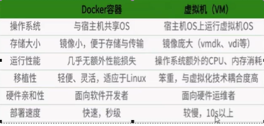

# Docker

>  [TOC]

## 一. Docker绪论

### 1.  为什么出现

一款产品从开发到上线,从操作系统到运行环境,再到应用配置.作为 开发+运维 的协作我们需要关心很多东西,特别是各种版本迭代后,不同版本环境的兼容,是对运维人员的考验.

* `Docker`对此问题给出了一个标准化的解决方案
  * 解决的方案是__软件带环境安装__,即$\color {red}{安装的时候,把原始环境一模一样的复制过来.开发人员利用Docker消除协作编码时机器环境不同的问题}$

### 2. Docker的技术

三要素:仓库,镜像,容器

* __镜像技术__:(images)

  * 打破"代码即应用"的理念,从系统环境开始,自底向上打包应用

  

  * 映像档即应用,达到跨平台无缝接轨运作

### 3. Docker理念

Docker是基于Go语言实现的云开源项目.

Docker的主要目标是=="Build,Ship and Run Any App Anywhere "==

$\color {blue}{一次封装,到处运行}$

### 4. 是什么?一句话总结

解决了运行环境和配置问题的**软件容器**,方便做持续继承并有助于整体发布的**容器虚拟化技术.**

### 5. 能干什么

* __虚拟机(virtual machine)__ 是带环境安装的一种解决而方案,可以在一个操作系统中运行另一个操作系统.而对底层系统来说,虚拟机就是一个普通文件,跟其他部分关联不大
  * 缺点: 占用资源多,冗余步骤多,开启慢
* __Linux容器(LXC)__: 因为虚拟机有上述缺点,所以linux发展处另一种<u>虚拟化技术</u>.它不是模拟一个完整的操作系统,而是对进程进行了隔离,就可以将软件运行所需的资源打包到一个隔离的容器中.不用复刻整个操作系统就能保证进程在任何环境下都能好好运行.
  * 与传统虚拟化的不同之处:
    * 传统虚拟机是虚拟出一套硬件后,在其上运行一个操作系统.
    * 容器内进程直接运行于宿主的内核,也没有硬件虚拟,所以更为轻便
    * ,容器之间没有相互影响

then: 

__开发自己运维(DevOps)__,两者界限逐渐模糊.

### 6. 三要素


---------------------------Docker架构图----------------------------------------

* __镜像image__: 是一个__只读__的模板,可以用来创建Docker容器,且可以创建多个,类比面向对象的__类__
* __容器container__: 
  * 容器的最上层__可读可写__
  * 容器是利用镜像创建的运行实例.
  * Docker是利用一个或一组利用容器独立运行的应用
  * 可以被启动,开始,停止,删除,并且相互隔离
  * 可以看做简易版的Linux环境和运行在其中的应用
* __仓库repository__:
  * 是集中存储__镜像__的场所
  * 与仓库注册服务器(registry)不一样,registry一般存有多个仓库,每个仓库存着多个镜像,每个镜像有不同的tag
  * 分为public和private两种
  * 最大的公开仓库叫__Docker Hub__,其他还有阿里云,网易云等

打包好的环境就是镜像文件,通过镜像生成Docker容器.一个容器运行一种服务.

---

### 7. 怎么工作的

Docker是一个CS结构系统,守护进程运行在主机上,然后通过Socket连接从客户端访问,守护进程从客户端接收命令并管理运行在主机上的容器.<u>容器是一个运行时环境,也就是集装箱</u>.

Docker比起VM有更少的抽象层.



-------

## 二. 常用命令

### 1. 帮助命令

```bash
docker version
docker info
docker --help
```

### 2. 镜像命令

* 查看镜像

```bash
docker images #列出本地的镜像
#REPOSITOR    TAG                      IMAGE ID         CREATED           SIZE
#镜像仓库源	  镜像标签(默认latest)        镜像ID        	创建时间		镜像大小

#选项:
docker images -a #显示所有镜像(包括中间映像层)
docker images -q #只显示镜像id
docker images --digests #多一个DIGEST栏
docker images --no-trunc #显示完整的镜像信息
```

* 查找镜像

  * 去hub.docker.com查找
  * 在docker中查找

  ```bash
  docker search 名字
  
  #选项
  docker search -s 数字 tomcat #搜索star数大于数字的镜像,过时了
  docker search tomcat --filter=stars=100 # 跟上面一样
  
  docker search --no-trunc tomcat #显示完整镜像信息
  docker search --automated tomcat#只列出automated build类型的镜像
  ```

* 下载镜像

  ```bash
  docker pull 镜像名字# -->等价于docker pull 名字:latest
  ```

* 删除镜像

  ```bash
  docker rmi 镜像名字 #默认latest
  
  # 选项
  docker rmi -f #强制删除
  docker rmi -f $(docker images -qa) #全部删除
  ```

  

### 3. 容器命令

前提条件: 有镜像才能创建容器

以CentOS容器为例

* __新建并启动容器__:

  ```bash
  docker run [选项] IMAGE [command] [arg..]
  # 新建并启动,这个IMAGE可以是image ID
  #选项:
  docker run -it image #i:以交互的模式运行容器,t:为容器重新分配一个伪终端(tty)
  docker run --name 名字 image #给容器起别名
  docker run -p 主机端口(给docker分配的对外端口):docker容器端口(真的) (8888:8080) image
  docker run -P #随机分配端口
  
  
  #在运行以后,进入了Docker中的CentOS,并且让你进入了伪终端的命令行
  [root@localhost ~]# docker run -it 470671670cac
  [root@08cc16b4c861 /]# pwd
  #上一行就是Docker中的CentOS环境的伪终端,跟外端CentOS不是一套环境(是全新的CentOS环境)
  ```

* __列出所有正在运行的容器:__

  ```bash
  docker ps
  #CONTAINER ID  IMAGE       COMMAND   CREATED    STATUS      PORTS   NAMES
  #容器id         镜像id       ???      创建时间     状态         端口?    名字
  
  docker ps -l #显示上一个开始运行的
  docker ps -a #显示所有运行(过)的
  docker ps -n 3 #显示上3次开始运行的
  docker ps -q #只显示容器编号
  ```

* __退出运行的容器__:

  ```bash
  exit(退出) 
  或者 
  ctrl+P+Q(暂时退出,不影响容器运行)
  ```

* __启动/停止容器__:

```bash
docker start 容器名或id
docker restart 容器名或id
docker stop 容器名或id #缓慢关闭
docker kill 容器名或id #强制马上关闭
```

* __删除已停止容器__:

```bash
docker rm 容器id
docker rm -f 容器ID #强制删除
docker rm -f $(docker ps -a -q) #强制删除多个容器
docker ps -aq | xargs docker rm #同上
```

### 3. 容器命令plus

* __启动守护式容器__:

  ```bash
  docker run -d 容器名/id #并返回容器id
  ```

  * 注意: Docker后台运行**必须有前台进程**,容器运行的命令如果不是那些一直挂起的命令(top,tail),**就会自动退出**.这是一项docker机制.
  * 对于像web容器比如nginx这种,正常情况下我们配置服务只需要穷相应的service即可,这种后台进程会导致前台没有运行的应用

* __查看容器日志__

  ```bash
  docker logs -f -t --tail 数字 容器ID
  # -t 加入时间戳
  # -f 跟随最新的日志打印(实时更新)
  # --tail显示最后多少条
  ```

* __查看容器内运行的进程__:

  ```bash
  docker top ID
  ```

* __查看容器内部细节__

  ```bash
  docker inspect ID
  ```

* __进入正在运行的容器并命令行交互__

  ```bash
  docker attach ID #进入容器
  docker exec -t ID 命令 #在容器中(没进去)使用命令并返回结果
  #如果命令是 /bin/bash 就等于打开了里面的shell,就等于进去了
  ```

* __从容器内拷贝文件到主机上__

  ```bash
  docker cp 容器ID:容器内路径 主机路径
  ```


### 4. 容器commit

```bash
docker commit -m="信息" -a="作者" 容器id 要创建的镜像名:[标签名]
#提交容器副本作为新的镜像
```


## 三. 镜像原理

* __镜像是什么:__
  * 镜像是一种轻量级,可执行的独立软件包.用来打包软件运行环境和基于环境开发的软件.

### 1. 联合文件系统

__UnionFS__是一种分层,轻量级,高性能的文件系统,它支持对文件系统的修改作为一次提交一层层的叠加.同时可以将不同的目录挂载到同一个虚拟文件系统下

* 是Docker镜像的基础
* 特性: 一次加载多个文件系统,但从外面看起来只能看到一个文件系统,联合加载会把多层文件系统叠加,这样最终的文件会包含所有底层文件和目录.

### 2. Docker镜像加载

docker镜像由一层层的文件系统组成(unionFS)

* __bootfs__(boot文件系统): 主要包含bootloader和kernel

  ,bootloader负责加载kernel(内核). 在docker镜像**最底层就是bootfs**,相当于加载内核,加载完以后内存中含有内核,bootfs会被系统自动卸载.

* __rootfs__(root文件系统): 在bootfs之上.类似于"发行版",包含linux中的标准目录和文件.


对于一个精简的OS,rootfs可以很小,因为直接用host的kernel,只需要提供rootfs就行了

对于一个环境复杂的,可能会变得很大.

* 这种分层的好处就是:共享资源.比如共享linux内核只要一个就够了


## 四 . 容器数据卷

我们希望:

* 容器数据持久化
* 可以容器间共享数据

容器产生的数据如果不用docker commit产生新的镜像就没法保存,所以我们需要__卷__


### 1. 用v命令在容器内添加

```bash
docker run -it -v /宿主机绝对路径目录:/容器内目录 镜像名
#文件夹都可以用这个命令生成
# 实现主机和容器数据共享
# 容器退出后主机修改对数据卷依然有效
```

* 查看是否挂载:

  ```bash
  docker inspect 容器id
  # 找"Volumes"
  ```

* 带权限:

  ```bash
  docker run -it -v /宿主机绝对路径目录:/容器内目录:ro 镜像名
  # ro: read only 能传输文件,但容器不能创建和修改和删除文件
  # 
  ```

  

  

### 2. DockerFile添加

* 类比:
  * javaEE : Hello.java ----Hello.class
  * Docker : images -----DockerFile

* 步骤:

  > 1. 根目录建立`mydocker`文件夹并进入
  >
  > 2. 在Dockerfile中使用`VOLUME`指令给镜像添加一个或多个数据卷
  >
  > 3. DockerFile构建(在文件夹下vim Dockerfile)
  >
  >    ```dockerfile
  >    #volume test
  >    FROM centos
  >    VOLUME ["/dataVolumeContainer1","/dataVolumeContainer2"]
  >    #dockerfile的volume只能放从机目录
  >    CMD echo "finished,----------success"
  >    CMD /bin/bashv
  >    ```
  >
  > 4. docker build生成镜像
  >
  >    ```bash
  >    docker build -f <dockerfile> -t  . #这里有个.
  >    ```
  >
  > 5. 本机上的对应文件
  >
  >    ```bash
  >    # 用docker inspect 看
  >                    "Source": "/var/lib/docker/volumes/d2a0bafd66dafce1f81630433894c26b37db94f58d7ced8528df0113ccf9c3b1/_data",
  >    ```
  >
  > 6. 如果不能写,在run后面加`--privileged=true`

### 3. 数据卷容器

命名的容器挂载数据卷,其他容器通过挂载这个实现数据共享,挂载数据卷的容器,称为数据卷容器.

简单的说,容器间的传递共享

> 1. 先启动一个父容器dc01,用之前弄得dockerfile镜像做
>
> 2.  将dc02和dc03继承自父容器
>
>    ```bash
>    docker run -it --name dc02  --volumes-from dc01 zzyy/centos
>    ```
>
> 3. 这样多个容器共享数据卷,可以达到互通有无的结果
>
> 4. 这个数据卷的共享周期一直到没有容器用它为止


## 五. dockerfile

### 1. 是什么

__Dockerfile__是用来构建Docker镜像的构建文件.是由一系列命令和参数构成的脚本

**dockerfile**是软件原材料(开发).**docker镜像**是软件交付品(交付标准),**docker容器**是软件运行态(部署运维)

* 步骤:
  * 编写dockerfile
  * docker build
  * docker run

### 2. 基本知识

1. 每条保留字指令都必须为大写字母,并且后面跟随至少一个参数
2. 指令从上到下顺序执行
3. #表示注释
4. 每条指令会创建一个新的镜像层,并对镜像提交

### 3. 执行流程

1. docker从基础镜像运行一个容器(FROM)
2. 执行一条指令并对容器作出修改
3. 执行类似docker commit提交一个新的镜像层
4. 基于刚刚提交的运行一个新容器
5. 执行下一条dockerfile指令直到完成

### 4. 保留字

> __FROM__: 基础镜像,当前镜像基于哪个镜像
>
> * `scratch`是镜像本源(类似Object)
>
> __MAINTAINER__: 镜像维护者的姓名和邮箱地址
>
> __RUN__: 构造时需要运行的额外命令
>
> __EXPOSE__: 当前容器对外暴露的端口
>
> __WORKDIR__: 创建容器后,终端默认登录进来的工作目录,一个落脚点(默认根目录)
>
> __ENV__ : 构建环境变量,参数为`变量名 值`,可以用在dockerfile的其他指令
>
> * WORKDIR $MY_PATH
>
> __ADD__: 将宿主机目录下的文件拷贝进镜像,并且自动处理URL,和解压tar压缩包
>
> __COPY__: 类似add,但是没有自动功能
>
> * ```bash
>   COPY src dest
>   COPY ["src","dest"]
>   ```
>
> __VOLUME__: 容器数据卷,用于保存和持久化
>
> __CMD__: 指定一个容器启动时要运行的命令
>
> * __dockerfile可以有多个CMD命令,但是只有最后一个生效__
>
> * CMD会被docker run后面加的参数覆盖
>
> * ```dockerfile
>   CMD <命令>#shell格式
>   CMD ["可执行文件","参数1",...]#exec格式
>   CMD ["参数1",...] # 参数列表格式,在指定`ENTRYPOINT`指令后,用CMD指定具体参数
>   ```
>
> __ENTRYPOINT__: 指定一个容器启动时要运行的命令
>
> * 有多个时变成追加
>
> __ONBUILD__: 当构建一个被继承的Dockerfile时运行命令,父镜像在被子继承后父镜像的onbuild被触发
>
> 

```dockerfile
#举例:定制版centos
FROM centos

ENV mypath /tmp
WORKDIR $mypath

RUN yum -y install vim
RUN yum -y install net-tools

EXPOSE 80
CMD /bin/bash
```

### 5. 使用

```bash
# 构建
docker build -f dockerfile -t 新镜像名字:TAG .
#.表示当前路径
#.是真正参数
```

### 6. CMD和ENTRYPOINT

CMD执行最后一条,并且会被docker run的命令覆盖

而ENTRYPOINT会追加,并且把docker run后面的参数传递给ENTRYPOINT

比如调用时加`-i`,ENTRYPOINT就会加-i选项(会覆盖cmd,cmd变成ep的参数)

### 7. ONBUILD

```dockerfile
ONBUILD RUN echo "im father"
```

只要有镜像继承了这个镜像,build的时候就会运行这个命令