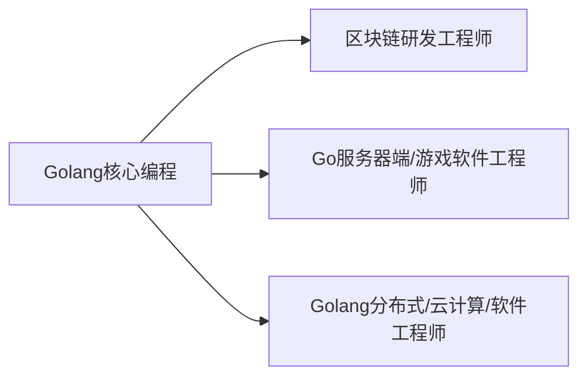

# Go

> [TOC]

## 一. Golang

`Golang`是go语言(language)的简称.

### 1. 学习方向



### 2. 引用领域

* 区块链应用
  * 也称为__分布式账本技术__,去中心化,公开透明
* 后端服务器应用

### 3. 特点

* 既保证静态编译语言的安全和性能,又达到了动态语言的开发效率.
* 具有垃圾回收机制
* go文件需要存在在包中
* **天然并发**
  * 从语言层面支持并发
* 吸收管道通信机制channel
* 函数返回多个值

## Hello world

### 1. 写程序

```go
package main
import "fmt"
func main(){
	fmt.Println("hello")//输出hello
}
```

编译运行环境: VScode

### 2. 搭建开发环境

搭建__SDK__编译(Software Development Kit)

* 由 go.exe编译和运行.

* 由gofmt.exe格式化.

### 3. Go程序基本结构

#### 3.1 文件目录结构

goproject -> src -> project(项目)->包

#### 3.2 代码结构

```go
//输出hello world
package main  //表示包名,go文件不能脱离包而存在
import "fmt" //引入包,可以使用包内函数

func main(){ //表示函数main
	fmt.Println("Hello world") //注意P大写
}
```

#### 3.3 编译运行

使用`go build`命令对go编译生成exe

调用exe运行

* 或者`go run`直接运行脚本(不推荐)

#### 3.4 执行流程分析


编译时会把依赖的库也编译进exe,所以exe会很大,但可以在没有sdk的地方运行

#### 3.5 编译运行细节

1. 编译可以指定生成exe的文件名

   ```bash
   go build -o hello.exe hh.go
   ```

2. go语言是__逐行编译__的,不能一行多句

3. <u>go语言定义的变量或者import的包没有用,编译不通过.</u>

4. main函数只能在main包内,一个包内的函数不能重名(同一个文件夹)

--------------------

## 二. 变量

 ### 1. 声明和赋值/初始化

__基本声明__: `var + 变量名+类型`

```go
func main(){
	
	var i int = 10
    //声明int类型的i变量,初始化为10
    i = 1 
    //赋值
	fmt.Println("i=",i) 
    //1
}
```

### 2. 细节

* golang变量声明的**三种方式**:
  * 若声明后不赋值,则使用默认值(术语为__零值__)
    * 数值型为0或0.0
  * __类型推导__: 根据值自行判断类型

  ```go
  var i = 1.2
  //浮点类型
  ```
  * 省略var,使用类型推导,使用`:=`表示新建变量
  
  ```go
  num := "tom"
  //若num已经声明过会报错
  ```
  
    

* **一次性声明多个变量的方式**

  ```go
  
  func main(){
      //一次性声明多个变量1(正规指定类型)
  	var n1 , n2 , n3 int
  
  	//一次性声明多个变量2(类型推导)
  	var n1, name ,n3 = 100 ,"tom" ,888
  
  	//:=法
  	n2,name1,n3 := 100,"tom",999
  }
  ```

* **全局变量批量声明方式**

  ```go
  var(
  	n1 = 900
      n2 = "tom"
  )//以此类推,在函数外
  ```

  

------

### 3. 数据类型


.

#### 3.1 整数类型

有符号: int8,int16,int32,int64

无符号: 加个u,如uint8

其他: int和uint(32位系统4字节,62位8字节),rune(类似int32,Unicode码),byte(同uint8,存字符)


> 1. 默认声明成int型

```go
//查看类型和字节数
package main
import (
	"fmt"
	"unsafe"
)

func main(){
	var i int = 1
	fmt.Println("i=", i);

	var n2 int64 = 10
	fmt.Printf("n2的类型 %T ,字节数%d",n2,unsafe.Sizeof(n2)) //这句
}
```

-------

#### 3.2 浮点类型

float32 单精度

float64 双精度

--------

#### 3.3 字符类型

Go的单字符用byte代替,用单引号括起

而String就是由字节构成的,使用utf8

* 双引号字符串支持转义
* 反引号字符串支持原生字符,可以换行
* 字符串无法改变
* 连接操作换行时,把加号放在行尾

----------

### 4. 类型转换

__GO不支持自动转换,必须使用强制转换__,包括同种不同精度的转换

```go
package main

import "fmt"

func main(){
	var i int32 = 100
	var n1 float32 = float32(i) //这么转

	fmt.Println(n1)
}

```

* 细节说明:
  * 无论范围大小都可以转换
  * 被转换的是值而不是变量本身
  * 任何运算都不能,<u>若有常数则以变量的类型为准</u>,若常数数字超过变量类型的范围,则编译错误

#### 4.1 基本类型转String类型

1. `fmt.Sprintf("格式字符串",参数) `其返回值为字符串

   ```go
   func main(){
   	var n1 int = 3
   	var n2 float32 = 3.1
   
   	fmt.Println(fmt.Sprintf("%d %.2f",n1,n2))
   
   }
   //布尔型用%t
   ```

   

2. 使用`strconv`包的函数

   ```go
   func format类型名(参数) string
   //如:
   strconv.FormatInt(1,10)//第一个参数使int64,后面表示转成几进制
   strconv.FormatFloat(num4,'f',10,64)//第二个参数指定格式,第三个指定精度,第四个指定原数类型
   strconv.Itoa(int) //把int转成字符串
   ```

   

#### 4.2 string类型转基本数据类型

1. 使用strconv包

   ```go
   strconv.Parse类型(变量)
   n,err = strconv.Atoi(str)//转整数
   ```
```
   
   

​```go
b,_ = strconv.ParseBool("true")
// ParseBool 将字符串转换为布尔值
// 它接受真值：1, t, T, TRUE, true, True
// 它接受假值：0, f, F, FALSE, false, False.
// 其它任何值都返回一个错误

//base: 进制
//bitSize: 转成多大的,比如64(int64),0(int),但返回值类型不受影响,使用时需要强转
```

注:

*  因为parse系列有两个返回值,所以需要用`_`来吸收err类型的返回值
* 若字符串不符合转换,则转成类型默认值.

### 5. 值类型和引用类型

int系列,float系列,bool,string和数组,结构体都是__值类型__,可以用指针指向

  * 空间在栈中存储值

指针,slice切皮,map,管道,interface都是__引用类型__

  * 空间在栈中存储堆地址

但是Golang中栈区和堆区 区分并不明显,以后再议.

### 6. 命名规范

首字母大写则可以被其他包访问,首字母小写不行

### 7. 位运算

用补码运算

## 三. 指针

### 1. 取地址/取值

& 取地址符

\* 取值符

### 2. 指针变量的声明

```go
func main(){
	var i int = 19

	fmt.Println("i的地址是: ",&i)

	var ptr *int = &i //*加在类型前面,声明为指针
	fmt.Println(ptr)
}
```

**类型也有严格要求**

## 四. 获取用户输入

fmt.scanln() 

fmt.scanf()(int,error)  和C的scanf一样

## 五. 流程控制

### 1. if语句

* __注意:__

  * 只有一条语句也要大括号

  * 可以在if语句中声明变量

    ```go
    if a:=1;a<2{
        
    }else{
        
    }
    ```

  * 多分支:

    ```go
    if a < 2{
        
    }else if a < 3{
        
    }else{
        
    }
    ```

  
### 2. switch

  默认带break;语法一样

  * case后可以是表达式,但类型必须和switch一致
  * switch可以不带表达式/变量,类似分支使用
  * switch可以声明变量
  * 在case块中可以加**fallthrough,**可以连着下一个case一起执行

### 3. for

语法:

```go
for i := 1 ; i < 10 ; i++{
   fmt.Println("haha")
}
//或者
for j < 10{
    j++;
}
for{
//无限循环
}
```

​	for 循环变量初始化 ; 循环条件 ; 循环变量迭代{}

没有while

break可以用类似mysql的label,continue也一样

```go
label:
for{
    break label
}
```

## 六. 函数

```go
func (参数列表)(返回值列表){

}
func haha(aa int)(int){//也可给返回参数命名,就不用了写return后的东西了
    fmt.Println(aa)
}
```

* __包:__

  * 本质就是不同文件夹

  * 导包从src开始写

  * 文件夹名和包名不是一个概念

  * 起别名:

    ```go
    import aaa "fmt" //别名aaa
    ```

    

### 1. init函数

这函数会在main之前执行,在导包时先把包内的init执行好,再执行main中的init和变量定义.

### 2. 匿名函数

```go
func(n1 int,n2 int){//声明定义,可以赋给变量
    return n1+n2
}(10,20)//调用
```

### 3. 闭包

闭包就是一个函数与其相关的引用环境组合的一个整体

```go
import(
   "fmt"
)
func AddUpper() func(int)int{
   var n int = 10
   return func (x int) int{
      n = n + x
      return n
   }//这个匿名函数和n构成一个整体,为闭包
}//可以把闭包当成类,有方法和属性

func main(){
   f := AddUpper()
   fmt.Println(f(1))
   fmt.Println(f(2))
}
```

### 4. defer

在函数中提供defer释放资源

```go
defer fmt.Print(n1) // 当执行到defer时,会将defer后的语句压入栈中,到函数最后执行
```

## 七. 常用函数

### 1. 字符串系列

不改变原有字符串

```go
len(str) //返回字符串字节数,按utf8算字节数
r := []rune(str) //遍历字符串并解决中文问题(需要转换成rune切片[]int32再遍历)
[]byte(str)
string([]byte)//string和byte切片互相转换
strings.Contains(str1,substr) //是否包含子串
strings.Count(str1,substr) //包含几个这样的子串
strings.EqualFold(str1,str2) //不区分大小写是否相等
strings.Index(str,substr) //返回子串在str中第一次出现的index
strings.LastIndex(str,substr) //返回子串在str中最后一次出现的index
string.Replace(str,subsstr,str1,n) //把子串替换成另一个,n代表替换前几个,-1全换,不改变原子串,返回
strings.Split(str,分隔符) //分隔,返回[]string
strings.ToLower(str) //小写
strings.ToUpper(str) //大写
strings.TrimSpace(str) //去掉左右两边空白
strings.Trim(str,"东西") //去掉左右两边的东西(第二参数的每个字符都能去掉)
strings.TrimLeft(..)...
strings.TrimRight(..)...
strings.HasPrefix(str,sub) //指定字符串是否以sub为前缀
strings.HasSuffix(str,sub) //指定字符串是否以sub为后缀
```

### 2. 日期函数

```go
import time
//里面有time.Time类型
var now time.Time = time.Now()//获取当前日期时间
now.format("2006  01 02 15:04:05") //格式化,也可以取一部分写
time.Unix() //返回时间戳
time.UnixNano()//返回纳秒时间戳
```


### 3. buildin

```go
num2 := new(int) //num2是int指针
```

### 4. 异常处理

`defer` `recover` `panic`

```go
func test(){
    defer func(){
        err := recover() //捕获异常
        if err != nil{
            fmt.Println("err=",err)
        }
    }()
}//然后错误就被跳过了,继续执行
```

* 自定义error
  * `errors.New("信息")`会返回一个error类型
  * `panic(err)`输出错误信息并退出程序

## 八. 数组

### 1. 数组

数组是值类型

```go
var hens [6]float64
for i := 0; i < len(hens); i++ {
   fmt.Println(hens[i])
}
```

* __初始化__

```go
var arr1 [3]int = [3]int {1,2,3}
var arr2 = [3]int {1,2,3}
var arr3 = [...] int {6,7,8}
var arr4 = [...]int {0:100,2:200,1:99} //按照下标赋值
```

### 2. for range遍历

```go
for index,value := range array01{
    
}
```

### 3. 注意点

* 数组长度和类型固定
* `var arr [] int`是一个slice切片,不是数组
* __传递数组不会对数组的元素产生影响__
* 想要处理,可以传入指向数组的指针`var arr *[3]int`

* 不同长度的数组不能互相赋值

## 九. 切片(slice)

我们总会需要动态数组,不能一直用定长的数组.用__切片__,解决问题

这是数组的__引用__,传递时符合引用传递机制

* 切片和数组的用法很相似,包括遍历,下标,len都一样,用cap函数查看容量

* 容量概念:目前可以存放的元素个数(动态变化)

* 定义语法:

  ```go
  var aaa []类型
  
  ```

### 1. 类似python的切片

```go
var intArr[5]int = [...]int{1,2,3,4,5}

slice := intArr[1:3] //左闭右开,slice是切片类型
//这样子由切片维护数组,切片能修改数组
```

### 2. make切片

```go
var slice [] int = make([]int,len,[cap(可选)])
//cap>=len
```

3:也可以直接把数组常量赋给它,容量和len一样

### 3. 底层

切片底层维护一个数组,如果用python方式赋值,那么数组是对程序员可见的,看到的数组就是slice的数组

,如果用make就是数组不可见的.

### 4. 遍历

```go
//常规方法
for i := 0; i < len(sli); i++ {
		fmt.Println(sli[i])
	}

//for range
	for index,value := range sli{
		fmt.Println(index,value)
	}
```

### 5. 注意事项

* 切片初始化时仍然不能越界,范围在[0-len]之间,可以动态增长
* 切片可以简化初始化:
  * arr[0:end]
  * arr[:ed]
  * arr[start:]
  * arr[0:len(arr)]
* 切片可以继续切片

### 6. 动态增长

`append函数`,将元素添加到末尾,有时可以扩容

参数是可变的

扩容会重新创建数组,指向有所改变,原数组如果没有人指就垃圾回收

```go
slice4 = append(slice3,400,500,400)
//注意: silce3是不变化的
slice4 = append(slice3,slice3...)
//再追加一个切片的内容
//...是固定写法
```

* 我们看一下这个迷惑的数组切片:

  * 一开始切片的cap是从取得值到数组末尾算cap
  * 切片指向数组对应地址.改变切片也会改变数组
  * 然后如果你append的操作如果不超出cap,是不会改变指向地址的
  * 也就是说append有可能改变原数组,也会影响其他切片
  * 但是如果一个append超出了cap就会重新分配一个内存空间

  * 也就是说,如果append不超出,切片还是返回原来的,如果超出了返回的才是不同的切片

### 7. 拷贝

```go
copy(oara1,para2)//拷贝内容,覆盖,后面可以是数组或切片
```

* 如果para2比1长,那只会填满1然后剩下的放弃

### 8. string和slice

string底层是[n]byte,可以切片处理

```go
str := "hellp@atguigu"
slice := str[:6] //这是string类型!!!!!!!!!!!!
fmt.Println(slice)
```

* string和slice底层指向的是同一个数组
* 想要改变string,需要强制转换[]byte(切片)或[]rune,再传回string