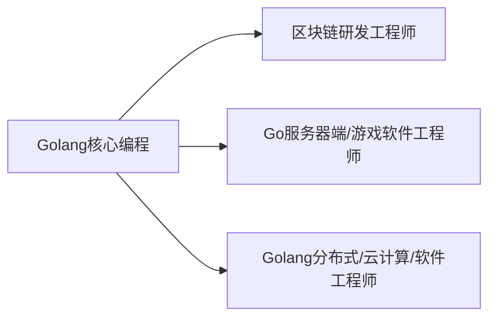

# Go

> [TOC]

## 一. Golang

`Golang`是go语言(language)的简称.

### 1. 学习方向



### 2. 引用领域

* 区块链应用
  * 也称为__分布式账本技术__,去中心化,公开透明
* 后端服务器应用

### 3. 特点

* 既保证静态编译语言的安全和性能,又达到了动态语言的开发效率.
* 具有垃圾回收机制
* go文件需要存在在包中
* **天然并发**
  * 从语言层面支持并发
* 吸收管道通信机制channel
* 函数返回多个值

## Hello world

### 1. 写程序

```go
package main
import "fmt"
func main(){
	fmt.Println("hello")//输出hello
}
```

编译运行环境: VScode

### 2. 搭建开发环境

搭建__SDK__编译(Software Development Kit)

* 由 go.exe编译和运行.

* 由gofmt.exe格式化.

### 3. Go程序基本结构

#### 3.1 文件目录结构

goproject -> src -> project(项目)->包

#### 3.2 代码结构

```go
//输出hello world
package main  //表示包名,go文件不能脱离包而存在
import "fmt" //引入包,可以使用包内函数

func main(){ //表示函数main
	fmt.Println("Hello world") //注意P大写
}
```

#### 3.3 编译运行

使用`go build`命令对go编译生成exe

调用exe运行

* 或者`go run`直接运行脚本(不推荐)

#### 3.4 执行流程分析


编译时会把依赖的库也编译进exe,所以exe会很大,但可以在没有sdk的地方运行

#### 3.5 编译运行细节

1. 编译可以指定生成exe的文件名

   ```bash
   go build -o hello.exe hh.go
   ```

2. go语言是__逐行编译__的,不能一行多句

3. <u>go语言定义的变量或者import的包没有用,编译不通过.</u>

4. main函数只能在main包内,一个包内的函数不能重名(同一个文件夹)

--------------------

## 二. 变量

 ### 1. 声明和赋值/初始化

__基本声明__: `var + 变量名+类型`

```go
func main(){
	
	var i int = 10
    //声明int类型的i变量,初始化为10
    i = 1 
    //赋值
	fmt.Println("i=",i) 
    //1
}
```

### 2. 细节

* golang变量声明的**三种方式**:
  * 若声明后不赋值,则使用默认值(术语为__零值__)
    * 数值型为0或0.0
  * __类型推导__: 根据值自行判断类型

  ```go
  var i = 1.2
  //浮点类型
  ```
  * 省略var,使用类型推导,使用`:=`表示新建变量
  
  ```go
  num := "tom"
  //若num已经声明过会报错
  ```
  
    

* **一次性声明多个变量的方式**

  ```go
  
  func main(){
      //一次性声明多个变量1(正规指定类型)
  	var n1 , n2 , n3 int
  
  	//一次性声明多个变量2(类型推导)
  	var n1, name ,n3 = 100 ,"tom" ,888
  
  	//:=法
  	n2,name1,n3 := 100,"tom",999
  }
  ```

* **全局变量批量声明方式**

  ```go
  var(
  	n1 = 900
      n2 = "tom"
  )//以此类推,在函数外
  ```

  

------

### 3. 数据类型


.

#### 3.1 整数类型

有符号: int8,int16,int32,int64

无符号: 加个u,如uint8

其他: int和uint(32位系统4字节,62位8字节),rune(类似int32,Unicode码),byte(同uint8,存字符)


> 1. 默认声明成int型

```go
//查看类型和字节数
package main
import (
	"fmt"
	"unsafe"
)

func main(){
	var i int = 1
	fmt.Println("i=", i);

	var n2 int64 = 10
	fmt.Printf("n2的类型 %T ,字节数%d",n2,unsafe.Sizeof(n2)) //这句
}
```

-------

#### 3.2 浮点类型

float32 单精度

float64 双精度

--------

#### 3.3 字符类型

Go的单字符用byte代替,用单引号括起

而String就是由字节构成的,使用utf8

* 双引号字符串支持转义
* 反引号字符串支持原生字符,可以换行
* 字符串无法改变
* 连接操作换行时,把加号放在行尾

----------

### 4. 类型转换

__GO不支持自动转换,必须使用强制转换__,包括同种不同精度的转换

```go
package main

import "fmt"

func main(){
	var i int32 = 100
	var n1 float32 = float32(i) //这么转

	fmt.Println(n1)
}

```

* 细节说明:
  * 无论范围大小都可以转换
  * 被转换的是值而不是变量本身
  * 任何运算都不能,<u>若有常数则以变量的类型为准</u>,若常数数字超过变量类型的范围,则编译错误

#### 4.1 基本类型转String类型

1. `fmt.Sprintf("格式字符串",参数) `其返回值为字符串

   ```go
   func main(){
   	var n1 int = 3
   	var n2 float32 = 3.1
   
   	fmt.Println(fmt.Sprintf("%d %.2f",n1,n2))
   
   }
   //布尔型用%t
   ```

   

2. 使用`strconv`包的函数

   ```go
   func format类型名(参数) string
   //如:
   strconv.FormatInt(1,10)//第一个参数使int64,后面表示转成几进制
   strconv.FormatFloat(num4,'f',10,64)//第二个参数指定格式,第三个指定精度,第四个指定原数类型
   strconv.Itoa(int) //把int转成字符串
   ```

   

#### 4.2 string类型转基本数据类型

1. 使用strconv包

   ```go
   strconv.Parse类型(变量)
   ```

   

```go
b,_ = strconv.ParseBool("true")
// ParseBool 将字符串转换为布尔值
// 它接受真值：1, t, T, TRUE, true, True
// 它接受假值：0, f, F, FALSE, false, False.
// 其它任何值都返回一个错误

//base: 进制
//bitSize: 转成多大的,比如64(int64),0(int),但返回值类型不受影响,使用时需要强转
```

注:

*  因为parse系列有两个返回值,所以需要用`_`来吸收err类型的返回值
* 若字符串不符合转换,则转成类型默认值.

### 5. 值类型和引用类型

int系列,float系列,bool,string和数组,结构体都是__值类型__,可以用指针指向

  * 空间在栈中存储值

指针,slice切皮,map,管道,interface都是__引用类型__

  * 空间在栈中存储堆地址

但是Golang中栈区和堆区 区分并不明显,以后再议.

## 三. 指针

### 1. 取地址/取值

& 取地址符

\* 取值符

### 2. 指针变量的声明

```go
func main(){
	var i int = 19

	fmt.Println("i的地址是: ",&i)

	var ptr *int = &i //*加在类型前面,声明为指针
	fmt.Println(ptr)
}
```

**类型也有严格要求**