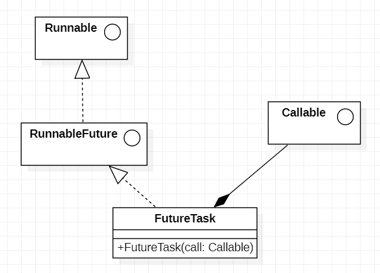

[TOC]

# JUC

## 一. 绪论

### 1. 它是什么

`JUC`: __java.util.concurrent__的首字母.说白了就是一个跟"线程同步"有关的工具包.

### 2. 朝花夕拾: 进程线程并发并行

####  程序,进程,线程

* __程序(program)__: 是为了完成特定任务,用某种预言编写的一组指令的集合. 即指__一段静态的代码__,<u>静态</u>对象.
* __进程(process)__: 是程序的一个执行过程,或者是__正在运行的程序__,<u>动态</u>过程,有产生,存在和消亡的过程(__生命周期__)
  * 进程作为资源分配的单位.在运行时会为每个进程分配不同的内存区域.

* __线程(thread)__: 进程可以进一步细化为线程,是一个程序内部的一条执行路径
  * 若一个进程同一时间并行执行多个线程,称为__支持多线程的__
  * ==线程作为调度和执行的单位,每个线程拥有独立的运行栈和程序计数器(PC)==,线程切换的开销小
  * 一个进程中的线程共享 堆 和 方法区 ,  使得线程间通信更高效.但多个线程操作贡献系统资源可能带来安全隐患.

#### CPU和并行并发

* 单核CPU : 假多线程,在一个时间单元只能执行一个线程的任务.相当于很多条车道但只有一个收费站人员.可以使用`挂起`提高效率
* 多核CPU : 真多线程.

> 一个Java程序至少有三个线程: <u>main()主线程,gc()垃圾回收线程,异常处理线程</u>

* __并行__: 多个CPU同时执行多个任务
* __并发__: 一个CPU(使用时间片)"同时"执行多个任务

### 3. JUC的组成

JUC由JUC包和它的两个子包构成

> java.util.concurrent
>
> java.util.concurrent.atomic
>
> java.util.concurrent.locks

## 二. 开始demo

1. 先创建一个资源类Ticket(票是资源类)

   > 资源类=实例变量+实例方法
   >
   > 一个线程就像一个遥控器,资源类就是遥控器控制的电视.
   >
   > 遥控器可以有多个,但**高内聚**(功能都自己实现)的电视**只有一个**,脱离具体线程的存在(低耦合),**只提供对外接口**

2. 加上实例变量+实例方法

   ```java
   private int number = 30;
   
       //List list = new ArrayList();
   
       public  void sale(){
           
       }
   ```

3. 放弃古老的synchronized,使用我们`java.util.concurrent.locks`里的Lock接口实现锁

   * Lock接口的实现类:`ReentrantLock(可重入锁)`,`ReentrantWriteLock`等
   * 此处用__可重入锁__

   ```java
   
   Lock lock = new ReentrantLock();//在资源类中提供实例锁
       public  void sale(){
           lock.lock();//在try外面锁上
               try{
           		//这里是需要同步的地方
               }catch(Exception e){
                   e.printStackTrace();
               }finally {
                   lock.unlock();//在finally解锁
               }
       }
   ```

4. 把资源类引进main线程

   ```java
   Ticket ticket = new Ticket();
    new Thread(new Runnable() {
        @Override
        public void run() {
            for (int i = 0; i < 40; i++) {
                ticket.sale();
            }
        }
    },"B").start();
   ```

   

## 三. 集合的线程不安全

### 1. 问题所在

我们开三个线程往一个list里加数据,会出现千奇百怪的情况,甚至报错

```java
java.util.ConcurrentModificationException
```

这个异常就是我们研究的__问题所在__

### 2. 原因所在

并发争抢同步资源且没有加锁

### 2. 解决方法

* 一: 用vector
* 二: 用Collections

```java
List<String> list = Collections.synchronizedList(new ArrayList<>())
```

* 三: 使用JUC__写时复制__(CopyOnWriteArrayList)/同步hashmap

  ```java
  //import java.util.concurrent.CopyOnWriteArrayList;
  List<String> list = new CopyOnWriteArrayList();//和ArrayList平级
  Map<String,String> map = new ConcurrentHashMap<>();
  ```

  

### 3. 写时复制

写时复制是**读写分离**的实现

* 写时将原份拷贝一份并修改
* 写完后将引用指向新版本的集合
* 读与写不再一个地方,是读写分离的体现

## 四. 八个锁问题

```java
class Phone{
    public static synchronized void sendEmail() throws Exception{
        TimeUnit.SECONDS.sleep(4);
        System.out.println("******email");
    }
    public synchronized void sendSMS() throws Exception{
        System.out.println("******SMS");
    }
}

public class Lock8Demos {
    public static void main(String[] args) throws InterruptedException {
        Phone phone = new Phone();
        Phone phone2 = new Phone();
        new Thread(()->{
            try {
                phone.sendEmail();
            }catch (Exception e){
                e.printStackTrace();
            }
        },"A").start();
        Thread.sleep(100);

        new Thread(()->{
            try {
                phone.sendSMS();
            }catch (Exception e){
                e.printStackTrace();
            }
        },"B").start();
    }

}
```

phone的两个方法都是同步方法(原生)

> 8个问题:
>
> 1. 在原生状态(如代码所示,在两线程之间有sleep),谁先输出
>
> 2. 如果在email输出前睡4秒,谁先输出
>
>    ```java
>    TimeUnit.SECONDS.sleep(4);//睡4s
>    ```
>
> 3. 新增普通sayHello方法,加一个线程,sayHello第几个执行
>
> 4. 两部手机,先邮件还是短信
>
> 5. 两个静态同步方法,同一部手机,先邮件还是短信
>
> 6. 两个静态同步方法,两部手机,请问先邮件还是短信
>
> 7. 1个静态同步方法,1个普通同步方法,1部手机,请问先?
>
> 8. 1个静态同步方法,1个普通同步方法,2部手机,请问先?
>
> 

### 1. + 2. + 5. + 6.

答案: 先邮件再短信

解析: 同步方法的同步监视器是__对象__,静态同步方法的同步监视器是__类.class__.一旦对象执行同步方法,那该对象的其他同步方法就被锁住

### 3. 

答案: sayHello始终在第一个

解析: 同步对象都在等email的4s,但没有同步的方法不需要资源就直接执行了

### 4. 

答案: 先短信

解析: 锁是不同对象,没有冲突

### 7. + 8.

答案: 先短信

解析: 一个锁是对象,一个是类.

## 五. 线程间通信

先声明一个高内聚低耦合的资源类

然后按照__判断/执行/唤醒__的步骤声明同步方法

最终要的是避免__虚假唤醒__

### 1. 虚假唤醒:

你唤醒一个不该唤醒的线程,叫虚假唤醒

看这个同步方法有什么问题

```java
public synchronized void produce() throws InterruptedException {
        if(numbers != 0){
            this.wait();
        }
        numbers++;
        System.out.println(Thread.currentThread().getName() + "\t" + numbers);
        this.notifyAll();
    }
```

这是一个会造成虚假唤醒的代码,因为在被唤醒后可以**直接执行后面的代码**,而可以**没有满足条件**

所以为了避免这样的情况,应当__把判断部分改为循环判断__

```java
public synchronized void produce() throws InterruptedException {
        while(numbers != 0){
            this.wait();
        }
        numbers++;
        System.out.println(Thread.currentThread().getName() + "\t" + numbers);
        this.notifyAll();
    }
```

### 2. 用新版锁实现通信

lock和wait/notify不是一路的

我们使用juc的__Condition__接口的方法`await,signal,signalAll`

* 获取Condition

  ```java
  Condition cond = lock.newCondition();
  ```

* 用

  ```java
  try{
              while(numbers != 0){
              condition.await();
          }
  ```


### 3. Condition强在哪

__可以精准的signal指定线程__

* 步骤: 

  * 一把锁配多个condition

  ```java
      private Lock lock = new ReentrantLock();
      private Condition c1 = lock.newCondition();
      private Condition c2 = lock.newCondition();
      private Condition c3 = lock.newCondition();
  ```

  * 指定一个condition唤醒他自己(signal)

    ```java
    c2.signal();
    ```

    

## 六. Callable

### 1. 与runnable在表面上的异同

```java
class MyThread implements Runnable{

    @Override
    public void run() {

    }
}

class MyThread2 implements Callable<Integer>{

    @Override
    public Integer call() throws Exception {
        return 1024;
    }
}
```

* 同: 都是函数式接口
* 异:
  * 方法名不同
  * Call方法抛异常
  * call方法有和泛型同类的返回值
  * Callable不能传进Thread的构造器

### 2. 调用

* __适配器模式__实例:
  * 在需要传入Runnable的地方用组合的方式传入适配器,关联成为Callable的适配



* `FutureTask`类:

```java

FutureTask<Integer> futureTask = new FutureTask<>(new MyThread());

new Thread(futureTask,"A").start();
```

* 获取返回值

* ```java
  
  Integer result = futureTask.get();
          System.out.println(result);
  ```

* 