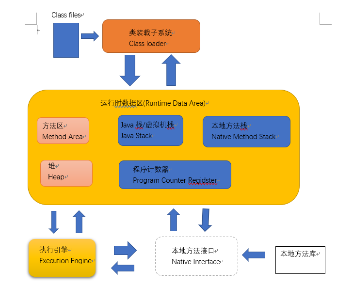

# JVM

> [TOC]

## 一. 绪论

字节码:

因为JVM,所以在JVM平台上各个语言都能编译成能在JVM上跑的字节码.

### 1. 虚拟机

__虚拟机__是一台虚拟的计算机,本质是__软件__,用来执行一系列虚拟计算机指令. 大体上可以分类为__系统虚拟机__和__程序虚拟机__

* 系统虚拟机: 比如VMware,完全对物理计算机的仿真
* 程序虚拟机: 比如JVM,专门为执行单个计算机程序设计,Java虚拟机中执行的指令称为Java字节码指令.

无论是哪种,在上面运行的软件都被限制于虚拟机提供的资源中

* JVM:
  * 是一台__执行Java字节码__的虚拟计算机,拥有独立的运行机制.不过运行的Java字节码未必由Java语言编译而成.
  * Java技术的核心就是Java虚拟机,所有Java程序都运行在JAva内部
  * 是二进制字节码的运行环境,负责装载字节码到其内部,解释/编译为对应平台上的机器指令执行. 每一条Java指令,都有规范详细定义,比如怎么取操作数,怎么处理操作数
  * 特点:
    * 一次编译,到处运行
    * 自动内存管理
    * 自动垃圾回收功能

* JAVA虚拟机是运行在操作系统上的,没有和硬件的直接交互

### 2. JVM整体结构

画在jvm的文件夹下

* **执行引擎:**充当了把高级语言翻译成机器语言的角色.

  包含:

  * Interpreter(解释器)
  * JIT Compiler(JIT编译器)
  * Garbage Collection(垃圾回收器)

### 3. Java代码执行流程

> `Java程序(xx.java) `
>
> 其先前往`Java编译器`

Java编译器流程:

1. 词法分析
2. 语法分析
3. 语法/抽象语法树
4. 语义分析
5. 注解抽象语法树
6. 字节码生成器

> 生成`字节码(xxx.class)`
>
> 进入`Java虚拟机`

Java虚拟机流程:

1. 类加载器
2. 字节码校验器
3. 翻译字节码/JIT编译器

> 最后交给操作系统