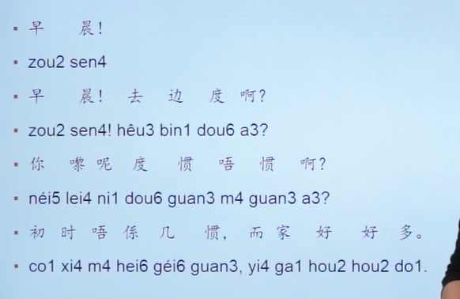

早上好! 去哪啊

你来这里习不习惯啊?

一开始不习惯,现在好多了

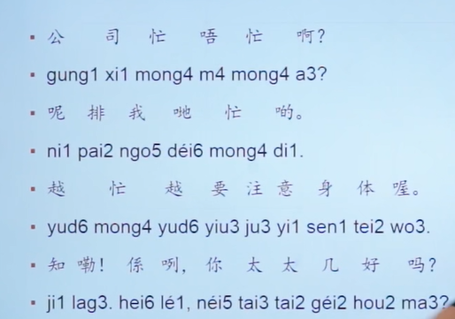

呢排: 这段时间

係咧: 对了

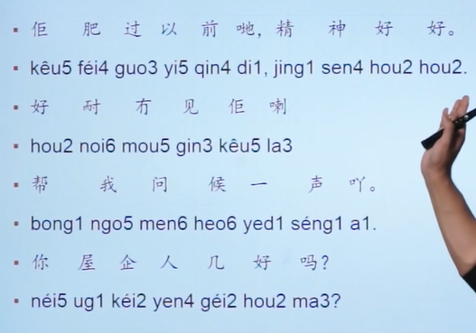

她比以前胖

好久没见他了

屋企人: 家里人

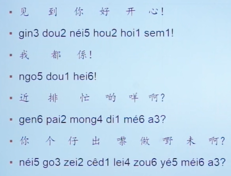

我也(都)是

最近忙什么呢

你的儿子出来做嘢(工作)没

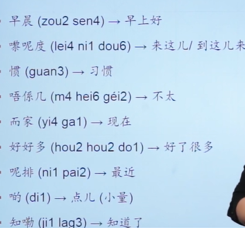

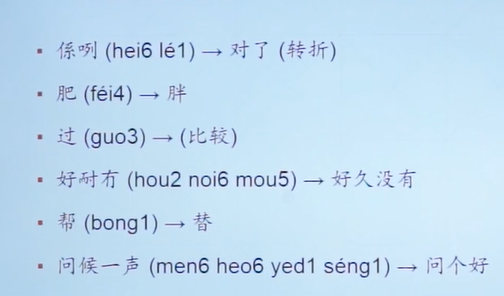

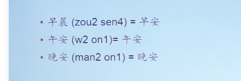

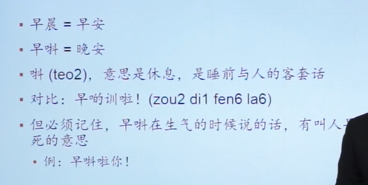

对比: 早点睡啦(亲昵)

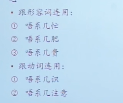

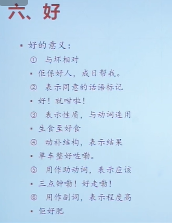

就(zau6)咁(gam2): 这样

生食至(zi)好食: 生吃才好吃 

整(zing)好: 修好

唔使: 不用

好好多: 好很多

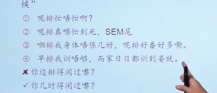