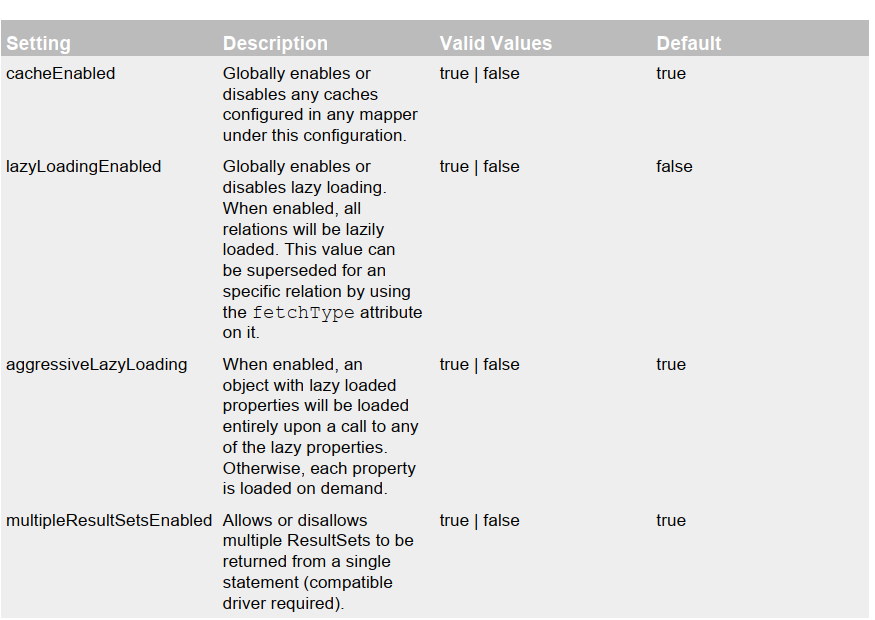
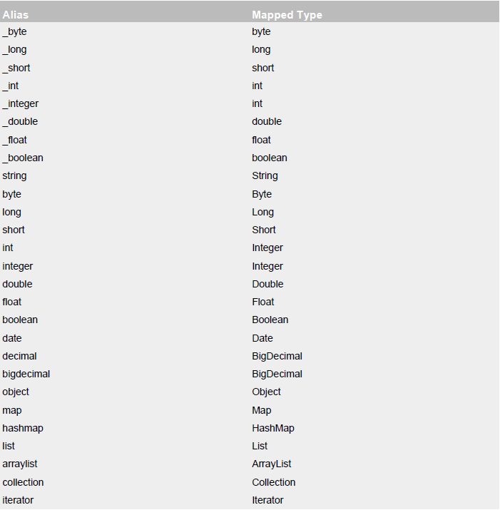
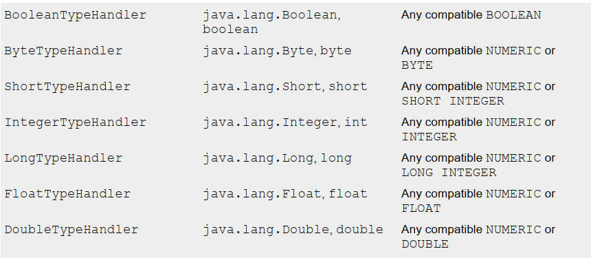

[TOC]

# Mybatis

## 一. 绪论

本课的主要内容为__Mybatis3(google)__,在其2之前名为__ibatis(apachy)__,

### 1. 前言

* 在持久化(Java)发展历史中,有:
  * JDBC

  * DBUtils(QueryRunner)

  * jdbcTemplate(Spring工具)

    ```mermaid
    graph LR
    以上三者的实现思路
    A[编写sql]-->B[预编译]-->C[设置参数]
    C-->D[执行sql]-->E[封装结果]
    ```

* 所以上面三个有什么问题?

  * 功能简单
  * sql编写在java中,高耦合

* 持久化框架
  * Hibernate: 

    * 全自动全映射ORM框架,
    * 旨在消除SQL;
    * 但是都消除了,微操就需要学习成本(学HQL)

    ```mermaid
    graph LR
    javaBean-->DbRecords
    ```

  * Mybatis:

    * 半自动,轻量级
    * SQL写在配置文件中,其他的由mybatis完成
    * 实现了SQL和java分离,而且SQL是开发人员控制

### 2. 下载地址

从github下载

https://github.com/mybatis/mybatis-3

## 二. helloworld

### 1. 原始步骤

1. 创建maven工程,填入依赖jar包:   

   * mysql驱动包,mybatisjar包,log4j日志包

     * log4j需要在类资源路径下放`log4j.xml`

2. 全局配置: 然后从XML构建`SQLSessionFactory`实例(从官方文档复制到`mybatis-config.xml`)

   * 全局配置中: 修改连接数据库的信息(url,驱动,user,password)

   * 创建工厂

     ```java
     String resource = "org/mybatis/example/mybatis-config.xml";
     InputStream inputStream = Resources.getResourceAsStream(resource);
     SqlSessionFactory sqlSessionFactory = new SqlSessionFactoryBuilder().build(inputStream);
     ```

3. 从工厂获得`SQLSession`

   ```java
   SqlSession session = sqlSessionFactory.openSession();//不加参数需要手动提交,传入true自动提交
   try {
   Blog blog = session.selectOne("org.mybatis.example.BlogMapper.selectBlog", 101);
   } finally {
   session.close();
   }
   ```

4. 使用session执行已经映射的sql查询语句

   ```java
   session.selectOne(arg0,arg1);
   //arg0: sql唯一标识
     //什么是唯一标识: 就是下面xml里面的`namespace+id`
   //arg1: 执行sql要用的参数
   //返回值: 根据xml里的参数返回一个Bean的对象
   ```

5. 看看什么是sql映射文件:

   往xml里写映射,

   然后要记得注册到**全局配置文件**的`<mapper>`中,~~我配都要配傻了~~

   ```xml
   <?xml version="1.0" encoding="UTF-8" ?>
   <!DOCTYPE mapper
   PUBLIC "-//mybatis.org//DTD Mapper 3.0//EN"
   "http://mybatis.org/dtd/mybatis-3-mapper.dtd">
   <mapper namespace="org.mybatis.example.BlogMapper">
       <!--名称空间: 好像可以随便取名-->
       
   <select id="selectEmp" resultType="com.at.bean.Employee">
      <!--id: 标识本xml文件  后面是返回值类型--> 
       
   	select * from Blog where id = #{id}
       <!--这玩意是sql语句-->
       <!--#{}: 从参数中取出值-->
   </select>
   </mapper>
   ```

6. 用完关闭

   ```java
   session.close();
   ```

7. 总览一下

   ```java
   public void test1() throws IOException {
           String resource = "mybatis-config.xml";
           InputStream inputStream = Resources.getResourceAsStream(resource);
           SqlSessionFactory sqlSessionFactory = new SqlSessionFactoryBuilder().build(inputStream);
           System.out.println("Hello");
   //        assertEquals("Helloli!","results");
   
           SqlSession session = sqlSessionFactory.openSession();
           try {
              Employee emp = session.selectOne("com.at.mybatis.EmployeeMapper.selectEmp",1);
               System.out.println(emp);
           } finally {
               session.close();
           }
       }
   ```

   

### 2. 步骤改进

__接口与xml(指mapper)动态绑定__

* 声明一个接口,在里面声明一个方法

* ```java
  public interface EmployeeMapper {
      public Employee getEmpById(Integer id);//将要与sql关联的方法,参数对应要传入sql的参数,返回值即想要的bean实例
  }
  ```

* 把namespace指定为**接口的全类名**
* 把id改成**方法名**

步骤:

* 一直到获取SQLSession都一样

* 向`sqlSession.getMapper(Class<T>)`传入接口的class,返回接口的实例对象

* 接口调用与sql关联的方法,传入相关参数获取返回值

* ```java
  EmployeeMapper mapper = sqlSession.getMapper(EmployeeMapper.class);
  Employee empById = mapper.getEmpById(1);//参数为占位符,和接口方法的参数匹配
  ```

* **关闭session**


### 3. 接口式编程(总结)

> 原生: 		**DAO 	==>	 DAOImpl**

> mybatis:  **Mapper ==>	xxxMapper.xml**
>
> session.getMapper(Class<T>)会返回给一个代理类对象,相当于xml帮你实现

> SQLSession: 和数据库的一次会话,用完必须关闭,**并非线程安全**,不能成为类共享成员变量

* __配置文件__:
  * 全局配置文件: 包含数据库连接池信息,事务管理信息等 系统运行环境信息
  * SQL映射文件(mapper,**至关重要**): 

## 三. 全局配置文件

> 注意: 本章节标签大多以configuration标签的后代标签出现

### 1. 全局配置文件内容总览

```xml
<?xml version="1.0" encoding="UTF-8" ?>
<!DOCTYPE configuration
        PUBLIC "-//mybatis.org//DTD Config 3.0//EN"
        "http://mybatis.org/dtd/mybatis-3-config.dtd">

<configuration>
    <environments default="development">
        <environment id="development">
            <transactionManager type="JDBC"/>
            <dataSource type="POOLED">
                <property name="driver" value="com.mysql.cj.jdbc.Driver"/>
                <property name="url" value="jdbc:mysql://localhost:3306/mybatis?useUnicode=true&amp;characterEncoding=utf8&amp;rewriteBatchedStatements=true&amp;serverTimezone=UTC"/>
                <property name="username" value="root"/>
                <property name="password" value="123456"/>
            </dataSource>
            
        </environment>
    </environments>
    <mappers>
        <mapper resource="EmployeeMapper.xml"/>
    </mappers>
</configuration>
```

### 2. dtd约束文件

在配置文件开头引入了dtd文件,约束了xml的语法规则

```xml
<!DOCTYPE configuration
        PUBLIC "-//mybatis.org//DTD Config 3.0//EN"
        "http://mybatis.org/dtd/mybatis-3-config.dtd">
```

如果能把dtd文件正确引入,开发工具就会给出正确的提示

~~idea好像帮我引入好了~~

### 3. properties标签

* 地位: 这种事一般交给`spring`来做,这个标签不太使用

* 作用: 引入外部properties配置文件内容

* 属性:

  * `resource`: 从类路径引入
  * `url`: 从网络/磁盘路径引入

* 示例: 导入数据库连接四个信息

  * ```properties
    # 在resources下,名为dbconfig.properties
    jdbc.driver=com.mysql.cj.jdbc.Driver
    jdbc.url=jdbc:mysql://localhost:3306/mybatis?useUnicode=true&amp;characterEncoding=utf8&amp;rewriteBatchedStatements=true&amp;serverTimezone=UTC
    jdbc.username=root
    jdbc.password=123456
    ```

  * 导入: (写在environment前面)

    ```xml
    <properties resource="dbconfig.properties"></properties>
    ```

    

  * 用导入的连接:(懵了,对${}并不熟)

    ```xml
    <property name="driver" value="${jdbc.driver}"/>
    <property name="url" value="${jdbc.url}"/>
    <property name="username" value="${jdbc.username}"/>
    <property name="password" value="${jdbc.password}"/>
    ```

    

### 4. settings标签

比较重要的标签

settings是**运行时行为设置**标签,可以去官方pdf看一看 属性表和值,今后在涉及时再细说

* 演示: `mapUnderscoreToCamelCase`(映射下划线为驼峰命名)

  * 会把数据库字段 A_Co 映射成 aCo

  ```xml
  <settings>
      <setting name="mapUnderscoreToCamelCase" value="true"/>
  </settings>
  ```

* 放个图看看属性



详细的去pdf看

### 5. typeAliases标签

typeAliases就是__类别名处理__,是一个给JAva类起短别名的标签,偷懒专用标签

别名不区分大小写,并且默认别名为短类名

* typeAlias标签单独取名

```xml
<typeAliases>
    <typeAlias alias="emp" type="com.at.bean.Employee"/>
    <!--默认alias为小写类名,比如此处为employee-->
</typeAliases>
```

* package标签为包内类批量起名

  ```xml
  <typeAliases>
  	<package name="com.at.bean">
  </typeAliases>
  ```

* 注解额外取名

  ```java
  @Alias("emp")
  //用注解取得名字会覆盖typeAliases的名字
  //为了防止重名冲突
  ```

有很多起好名的Java类型,一起来看一看(基本数据类型加横线,其他常用引用类都是变小写),不宜和他们1重复



### 6. typeHandlers

作用: 架起java类型和数据库类型的桥梁

类型处理器,以后细讲



<center>不全</center>

### 7. plugins

插件现在看不懂,只要知道它是允许拦截(动态代理)到sql语句执行的核心步骤就行.

> 拦截类型:四大对象的方法
>
> Executor
>
> ParameterHandler
>
> ResultSetHandler
>
> StatementHandler

### 8. environments

可以配置多种环境

使用`<environment>`标签加上两个子标签算一个完整环境

```xml
<environment id="">
      <transactionManager type=""></transactionManager>
      <dataSource type=""></dataSource>
</environment>
```

* environment的id: 当前环境的唯一标识,使用`<environments>`的default属性可以指定使用哪个环境

  ```xml
  <environments default="test">
  	<environment id="test">
        <transactionManager type=""></transactionManager>
        <dataSource type=""></dataSource>
  	</environment>
  </environments>
  ```

* `transactionManager`事务管理器: (一般被Spring代替)

  * type有两种取值 __JDBC/MANAGED__,实际上是两个别名
    * JDBC: 用jdbc事务控制
    * managed: 用j2ee容器事务控制
  * type可以用自定义,实现TransactionFactory接口,值为全类名

* `dataSource`数据源:  默认type值`UNPOOLED|POOLED|JNDI`(不用连接池/用连接池/JNDI)都是别名

  * 自定义: 实现DataSourceFactory,写全类名

### 9 .databaseIdProvider

mybatis可以执行不同数据库开发商的不同sql语句,这个标签可以提供一致性

```xml
<!--根据数据库厂商标识(驱动的getDatabaseProductName())
        MYSQL,Oracle,SQL Server
    ,-->
    <databaseIdProvider type="DB_VENDER">
        <!--为不同数据库厂商起别名-->
        <property name="MYSQL" value="mysql"/>
    </databaseIdProvider>
```

然后如何用之?在mapper的select中加属性databaseId="别名"

```xml
<select id="getEmpById" resultType="emp" databaseId="mysql" />
sql语句
</select>
<!--不同sql可以指定不用baseId-->
```

### 10. mappers

把写好的sql映射文件注册到全局配置中

```xml
    <mappers>
        <mapper resource="EmployeeMapper.xml"/>
    </mappers>
```

属性可以选择`resource`或者`url`引入文件

还有`class属性`: 类名,引用接口

* 要求mapper配置文件和接口在同一个目录并且xml和接口同名
* 或者你不需要配置mapper,直接把sql写在**注解上**(不推荐)

```java

public interface EmployeeMapper {
    
    @Select("select * from tbl_employee where id = #{id}")
    public Employee getEmpById(Integer id);

}
```

可以在mappers里写package加上name="包名"批量注册mapper

## 四. sql映射文件

### 1. 增删改查

先把接口定义增删改查四个方法

```java

public interface EmployeeMapper {
//    @Select("select * from tbl_employee where id = #{id}")
    public Employee getEmpById(Integer id);

    public void addEmp(Employee employee);
    public void updateEmp(Employee employee);
    public void deteteEmp(Integer id);

}

```

然后把方法和mapper映射文件一一对应

* 增标签insert详解:

```xml
<!--
	参数类型: 可选可不写
-->
<insert id="addEmp" parameterType="com.at.bean.Employee">
        insert into tbl_employee (last_name,email,gender)
        values(#{lastName},#{email},#{gender})
    <!--用#{}代表参数的属性名-->
    </insert>
```

* 更新update

```xml

<update id="updateEmp" parameterType="com.at.bean.Employee">
        update tbl_employee
        set last_name=#{lastName},email=#{email},gender=#{gender}
        where id=#{id}
    </update>
```

删除一样

* 细节:
  * 允许增删改<u>直接</u>返回integer,long,Boolean,表示有没有成功,或者影响了几行

### 2. insert细节

* 获取自增主键的值

  * mybati也可以利用`statement.getGeneratedKeys()`

    * 将insert标签中的useGeneratedKeys="true"

    * ```xml
      <insert id="addEmp" parameterType="com.at.bean.Employee" useGeneratedKeys="true">
      ```

    * 然后指定主键值交给javabean的哪个属性(keyProperty)

    * ```xml
        <insert id="addEmp" parameterType="com.at.bean.Employee" useGeneratedKeys="true"
              keyProperty="id">
      ```

    * 

### 3. 参数处理(#{})

#### 3.1 单个参数

mybatis不会做特殊处理,其实#{}里写什么都一样

 `#{参数名}`: 取出参数值

#### 3.2 多个参数

不能按照参数名给出#{}中的值,异常如下

```java
Parameter 'id' not found. Available parameters are [0, 1, param1, param2]
```

它建议我们使用`[0,1,param1,param2]`

* 本质: 多个参数会被封装成一个map,#{}从map中获取指定的值
  * map: `key:para1...paraN`,value: 参数值
  * 或者填参数索引(0,1,2...)

#### 3.3 命名参数

明确指定封装参数时map的key

方法: __对方法参数加上注解__`@Param("名字")`

```java

public Employee getBytwo(@Param("id")Integer id,@Param("lastName") String lastName);

```

#### 3.4 多个参数(特殊)

如果多个参数正好是我们的__业务逻辑数据模型__(bean类),可以直接传入pojo(bean类):

>  #{属性名}: 取出pojo中的属性值

不经常使用的数据也可以传入map,就不用它帮你封装了

> #{key}: 取出对应value

经常使用的数据可以编写一个__TO__(Transfer Object数据传输对象)

> 写个小类,还是传属性名

---

另,如果传参是多个引用混合,可以用.取属性

```java
public Employee getEmp(Integer id,Employee e);

//xml:
#{param2.name}
```

再另,如果是Collection参数或者数组,也会特殊处理,把传入的集合封装在Map中

​	key:为list,array,或者collection

```xml
public Employee getEmpById(List<Integer> ids);
取出第一个元素: #{list[0]}
```

### 4. 参数封装为map的过程

* 执行sql时会先Switch查看sql种类

* 然后将参数args通过方法转换为能用的参数

* 然后ParamNameResolver使用getNamedParams来解析参数封装map
  * names:{0=id,1=lastName} //name是一个跟解析参数有关的map
    *  首先获取每个标了param注解的参数的param值,赋值给name
    * 每次解析一个参数给map中保存信息:(key: 参数索引,value: name的 值)
      * name的值: 
        * 标注了param: 注解的值
        * 没有标注:
          * 全局配置:`useActualParamName`打开,name=参数名
          * 不打开,name=map.size()(0,1,2,3....当前参数的索引)
* 如果单个参数或者没有参数,可以直接返回(firstKey/null)
* 如果多个参数或者有Param标注
  * 遍历names,把names里面的__value__作为参数map的__key__,然后以names的key取值(`args[entry.getKey()]`)

### 5. ${}与#{}

区别: 

* `#{}`以预编译形式把参数设置到sql中
* `${}`取出的值直接拼装在sql中,显然会有__sql注入__问题
  * 但是原生jdbc不支持?的地方可以用${}取值(比如from后面的表)