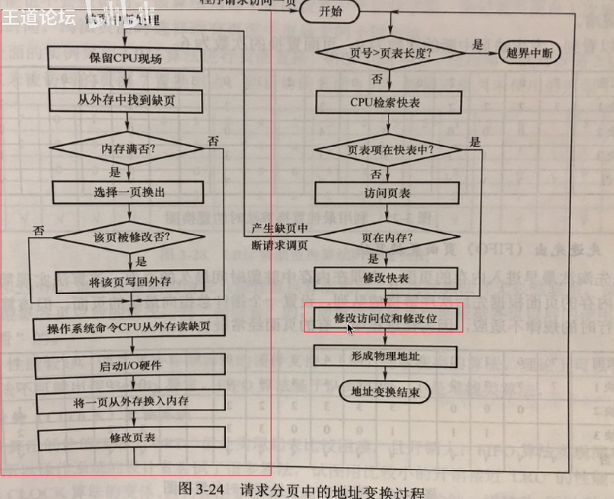
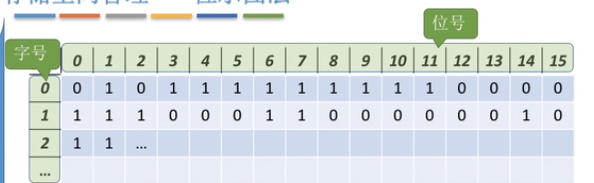
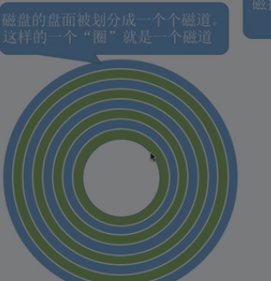
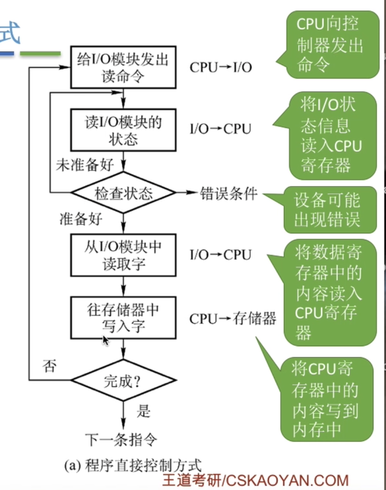
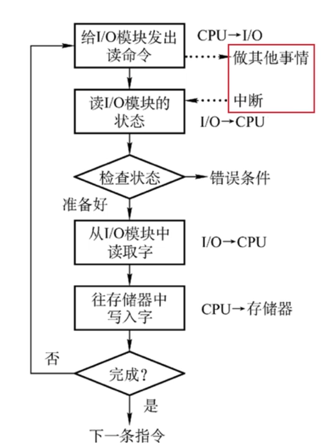
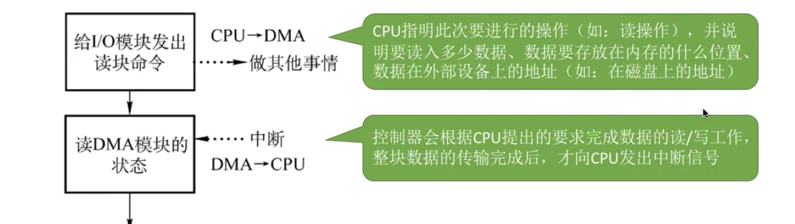
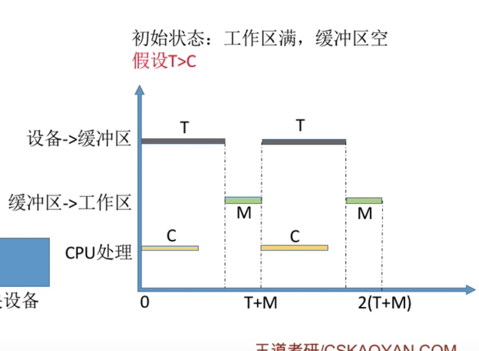
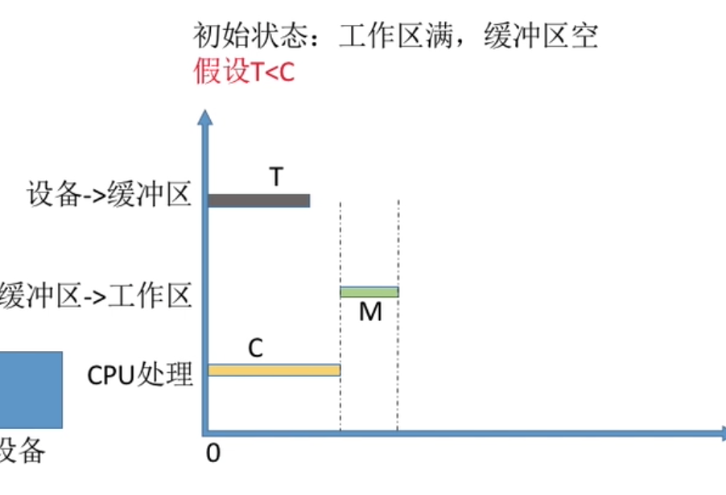
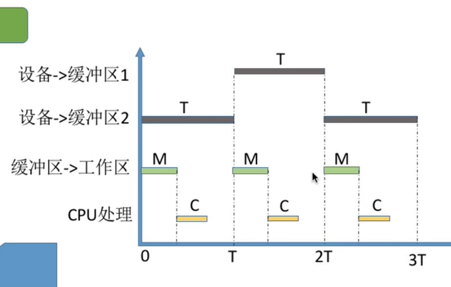

# 操作系统

> [TOC]

## 一. 绪论

### 1. 操作系统的地位

本质是__系统软件__

* <u>系统资源的管理者</u>
  * 处理机(CPU)管理
  * 存储器(内存)管理
  * 文件管理
  * 设备管理
  * 以安全高效为目标
* <u>用户与计算机硬件之间的接口</u>
  * 命令接口: 允许用户直接使用
    * 联机(交互式)命令接口
    * 脱机(批处理)命令接口
  * 程序接口: 允许用户通过程序间接使用
    * 由一组__系统调用/程序接口/广义指令__组成(同一个意思)
  * GUI
  * 以**方便用户**使用为目标
* <u>最接近硬件的层次</u>
  * 没有软件支持的计算机称为__裸机__,覆盖了软件的机器称为__扩充机器/虚拟机__

### 2. 操作系统四大特征

> ==**并发**==
>
> ==**共享**==
>
> ==**虚拟**==
>
> ==**异步**==

#### 2.1 并发

* 定义:

  **并发**指两个或多个时间在$\color {blue}同一时间间隔发生$. <u>宏观上同时发生,在微观上交替发生</u>

  * 易混淆: __并行__指连个或多个事件在$\color {blue}同一时刻同时发生$

  **操作系统的并发性** 指计算机系统中同时存在着多个运行着的程序

  * 单核CPU同一时刻只能执行一个程序,因此操作系统会负责协调多个程序交替执行
  * 操作系统和"多道程序技术"是伴随出现的,所以操作系统和程序并发一起诞生

#### 2.2 共享

* 定义:

  __共享__即资源共享,指系统中的资源可供内存中多个并发执行的进程共同使用

* 分类:两种资源共享的方式

  * 互斥共享方式(一个时间段只允许一个进程访问该资源)
  * 同时共享方式(一个时间段内进程可以"同时"访问该资源)

#### 并发和共享的关系

如果失去并发性,共享性也失去了存在的异议

如果没有共享性,就无法并发

**互为存在条件**

#### 2.3 虚拟

__虚拟__是指把一个物理上的实体变成若干个逻辑上的对应物.前者是实际存在的,后者是用户感受到的.

* ""空分复用技术"(空间 虚拟存储器)
* "时分复用技术"(时间 虚拟处理器)

没有并发性,谈不上虚拟性

#### 2.4 异步

__异步__是指,多道程序环境下,允许多个程序并发执行,但由于资源有限,进程的执行不是一贯到底的,而是走走停停(阻塞),以不可预知的速度向前推进,这就是进程的异步性.

没有并发性也没有异步性

--------

### 3. OS的发展和分类

1. ==手工发展阶段==

   * 纸带打孔
   * CPU快,IO慢,人类处理慢
   * 缺点总结: 用户独占主机,人机速度矛盾导致资源利用率低

2. ==批处理阶段--单道批处理系统==

   * 引入__脱机输入/输出技术__(读到磁带里,输出到磁带),并由__监督程序(OS雏形)__负责控制作业的输入输出
   * 优点: 缓解了一定程度的人机速度矛盾,资源利用率有所提升
   * 缺点: 内存中**仅有一道程序运行,只有该程序运行结束才能调入**下一道,CPU有大量时间是在**等待IO完成**,资源利用率也不高

3. ==批处理阶段--多道批处理处理技术==

   * 每次往内存中输入多道程序,引入了__中断技术__
   * __操作系统正式诞生__,负责管理这些程序运行,各个程序并发执行
   * 优点: 多道程序**并发执行**,**共享**计算机资源,资源利用率大大提升.CPU和其他资源保持忙碌状态,系统吞吐量增大
   * 缺点: 用户响应时间长,没有人机交互功能
   * 
   * 

4. ==分时操作系统==

   * 计算机以__时间片__为单位轮流为各个用户/作业服务,各个用户可以通过终端与计算机交互
   * 优点: 用户请求可以被即时响应,解决了人机交互问题,允许多个用户同时使用一台计算机,并且用户对计算机的操作相互独立,感受不到别人存在
   * 缺点: **不能优先处理一些紧急任务,**每个用户都是公平的

5. ==实时操作系统==

   * 在实时操作系统的控制下,计算机系统接受到外部信号后及时进行处理,并且要在**严格时限内处理完事件.**(硬实时要求必须,软实时接收偶尔违反)
   * 优点: 能够优先相应一些紧急任务,某些紧急任务不需要时间片排队
   * 特点: **及时性,可靠性**

6. 其他

   网络操作系统

   分布式操作系统

   个人计算机操作系统

### 4. OS运行机制和体系结构

#### 4.1 运行机制

* __两种指令__:
  * <u>特权指令</u>
  * <u>非特权指令</u>
* __两种处理器状态__:
  * <u>用户态**(目态)**</u> : 只能执行非特权指令
  * <u>核心态**(管态)**</u> :都能执行
  * 两种状态用__程序状态字寄存器(PSW)__中的某个标志位标识(0用户态,1管态)
* __两种程序__:
  * <u>内核程序:</u> 是系统的管理者,运行在核心态
  * <u>应用程序</u> : 运行在用户态

#### 4.2 OS内核(kernel)

内核掌管`时钟管理`,`中断处理`,`原语(最接近硬件,有原子性)`,`进程管理,存储器管理,设备管理等功能`

__内核__是计算机配置上的__底层软件__,是操作系统最基本,最核心的部分.

实现操作系统功能的的程序就是__内核程序__


#### 4.3 体系结构

OS的体系结构分为`大内核`和`微内核`

* 如果操作系统内核只包含最基本的功能,则为__微内核__
  * 优点: 内核功能少,结构清晰,易于维护
  * 缺点: 需要频繁地在核心态和用户态之间切换,性能低
* 将操作系统主要模块都作为系统内核,则为__大内核__
  * 优点: 高性能
  * 缺点: 内核代码庞大.结构混乱,难以维护

### 5. 中断和异常

早期个程序只能串行执行,效率低下. 

人们发明了操作系统,引入中断机制,实现了多道程序并发执行.

* __本质__: 发生中断意味着**需要操作系统介入,**开展管理工作
  * CPU在收到中断信号会转换为**核心态**
  * ,**由操作系统内核对中断处理**
  * 对不同的中断信号,会进行不同处理
* 用户态与核心态
  * <u>用户态到核心态的切换</u>是通过中断来实现的,<u>并且中断是唯一的途径</u>	
  * 而<u>核心态到用户态</u>通过特权指令,改变程序状态字

#### 5.1 分类

* ==内中断(异常,例外,陷入)==
  * 来源: CPU**内部,**与**当前执行的指令有关**
    * ==自愿中断==--仿管(trap,陷入)指令中断
    * ==强迫中断==(硬件故障(缺页)/软件中断(除以0))
* ==外中断(狭义中断)==
  * 来源: CPU__外部__,当前执行的指令__无关__
    * ==外设请求==(例如IO操作完成)
    * ==人工干预==

* __另一种内中断分类__
  * 陷阱,陷入(trap): 有意而为之的,如系统调用
  * 故障(fault) :由错误条件引起的,可能被故障处理程序修复
  * 终止(abort) :不可修复的致命错误,不再将控制权返回

### 6. 系统调用

前面我盟说过,程序接口由__一组系统调用__组成

应用程序通过**系统调用**请求操作系统的服务.凡是与**资源有关**的操作,都必须通过系统调用的方式向操作系统提出服务请求,由操作系统代为完成,这样可以**保证系统的稳定性和安全性**,防止用户非法操作

需要特权指令,运行在__核心态__

可以理解为操作系统提供的接口.

* 按功能分类:
  * 设备管理 : 完成设备的 请求 释放 启动等
  * 文件管理 : 完成文件的 读写创建删除 等
  * 进程控制 : 完成进程的 创建撤销阻塞唤醒
  * 进程通信 : 完成进程的 消息传递 信号传递
  * 内存管理 : 完成内存的 分配/回收功能

* 调用:
  * 前期处理相关指令
  * trap指令/陷入指令(内中断)
  * 后续处理指令,操作系统处理 系统调用 相关代码(核心态)
  * 注意: __陷入指令是唯一只能在用户态而不能在核心态执行的指令__

## 二. 进程

### 1. 进程

* 定义:

  * __程序__: 一个指令序列
  * 为了方便管理.完成个程序并发执行,引入了__进程,进程实体__的概念
    * <u>PCB(进程控制块),程序段,数据段构</u>成了__进程实体/进程映像__,简称进程
    * ==PCB是进程存在的唯一标志==
  * 进程是进程实体(静态)的__运行过程__,是__动态的__,是资源分配和调度的一个独立单位

* __组成__

  * 程序段: 存储程序代码
  * 数据段: 产生的数据
  * PCB: 操作系统通过PCB管理进程,存储操作系统对其管理的各种信息
    * **进程描述信息:** 
      * 进程标识符PID
      * 用户标识符UID
    * **进程控制和管理信息**
      * 进程当前状态
      * 进程优先级
    * **资源分配清单**
      * 程序段指针
      * 数据段指针
      * 键盘
      * 鼠标
    * **处理机相关信息 --寄存器的值**

* __组织__:

  PCB成百上千,组织讨论的是多个进程之间的组织方式问题.

  * **链接方式**
    * 按照进程状态把PCB分为多个队列,操作系统持有指向各个队列的指针
      * 
  * **索引方式**
    * 根据进程状态不同,建立几张索引表,操作系统拥有指向索引表的指针

整体来说,就是有`执行指针,就绪队列指针,阻塞队列指针`

* __特征__
  * **动态性**: 最基本特征,动态的产生和消亡
  * **并发性**: 各进程并发自行
  * **独立性**: 进程是__能独立运行,独立获取资源,调度的基本单位__
  * **异步性** : 各自独立,不可预知,需要进程同步机制
  * **结构性**: PCB+程序段+数据段

### 2. 进程状态转换

#### 2.1 三种基本状态

* __运行态(Running)__: 占有CPU,单核下时刻最多有一个运行态进程
* __就绪态(Ready)__: 拥有除了处理机外的所有资源,就等CPU
* __阻塞态(waiting/blocked)__:

#### 2.2 另外两种

* __创建态(New)__: 分配资源,初始化PCB
* __终止态(Terminated)__: 反上


#### 2.3 转换


### 3. 进程控制

进程控制的主要功能是对系统中所有进程实施有效的管理,它具有创建新进程,撤销已有进程,实现进程状态转换等功能.

#### 3.1 如何实现进程控制?

使用==原语==实现进程控制,其__特点__是<u>原子性:执行期间不允许中断</u>,也叫原子操作

原语采用__关中断指令__和__开中断指令__实现,是核心态的特权指令

关中断下收到外部中断信号不会处理,开中断会处理

所做的事无非是`更新PCB信息(状态标志,运行环境)`,`将PCB放入合适队列`,`分配回收资源`

* __创建进程__:
  * 由`创建原语`: 
  * 需要初始化PCB,分配系统资源
* 创建态到就绪态:
  * 修改PCB内容和相应队列
* 就绪态到运行态:
  * 恢复进程运行环境,修改PCB内容和相应队列
* 运行态到阻塞态:
  * 阻塞原语
  * 保存进程运行环境,修改PCB内容和相应队列
* 阻塞态到就绪态:
  * 唤醒原语(和阻塞原语曾对出现)
  * 修改PCB内容和相应队列,分配资源
* 运行态到终止态:
  * 由`撤销原语`:找到PCB,剥夺CPU,中止子进程,收资源,删PCB
  * 回收资源,撤销PCB

还有进程切换原语

#### 3.2 引起进程创建/结束的事件

* 用户登录
* 作业调度
* 提供服务
* 应用请求


* 正常结束
* 异常结束
* 外界干预

### 4. 进程通信

进程之间的信息交换叫进程通信.

每个进程拥有内存地址空间,相对独立,进程之间不能互相直接访问.

#### 4.1 三大方式

* **共享存储**:
  * 基于数据结构的共享
  * 基于存储区的共享
* **消息传递**
  * 直接通信方式
  * 间接通信方式
* **管道通信**

#### 4.2 共享存储

进程之间分配一个共享空间,但是每个时刻只有一个进程能访问(称为__互斥性__),操作系统会提供同步互斥工具

* 基于数据结构的共享:

  * 只能村固定的数据结构

  * 速度慢,限制多,是低级通信方式
* 基于存储区共享
  * 在内存划一块共享存储区
  * 是高级方式

#### 4.3 管道通信

__管道__是指用于连接读写进程的共享文件,又名pipe.就是内存中开辟的固定大小缓冲区

* 管道只能实现__单双工通信__,某个时间段只能单向传输,想双向同时必须两个管道.
* 各进程__互斥__的访问管道
* 数据以__字符流__写入管道,写满时写进程的write()阻塞,这时才能开始取数据.取完(管道为空)时read()阻塞,才能写
* 读出管道的数据就被抛弃了,所以读进程就只有一个

#### 4.4 消息传递

进程间数据以__格式化消息__为单位,通过__发送消息/接收消息原语__进行数据交换

* 格式化消息
  * 消息头: 包括进程ID,接收进程ID,消息类型,长度等信息.
  * 消息体
* 直接通信方式:
  * 消息直接挂在接收进程消息的缓冲队列上
* 间接通信方式:(信箱通信方式)
  * 先发送到中间实体(信箱)

## 三. 线程

一个进程多个功能,传统进程内部串行,所以需要多线程<u>增加并发度</u>

__线程__被引入后,成为了<u>程序执行流的最小单位</u>,<u>CPU最小单元</u>

而进程成为了<u>除了CPU以外的系统资源的分配单元</u>

### 1. 变化

* 资源分配,调度
* 并发性
* 系统开销
  * 切换线程,开销小
  * 进程切换开销极大

### 2. 属性

* 线程是处理机调度的基本单位
* 多CPU计算机中,各个线程可占用不同CPU
* 每个线程有一个ID,线程控制块(TCB)
* 线程也有就绪,阻塞,运行三个状态
* 几乎不拥有系统资源
* 同一进程不同线程共享进程资源
* 同一进程的线程通信无需系统干预
* 同一进程中的线程切换不会引起进程切换,不同的就会
* 切换同一进程的线程开销小

### 3. 实现方式

* **用户级线程(ULT)**
  * 通过线程库来实现. 所有**线程管理工作由应用程序负责**(包括线程切换)
  * 在**用户态**下即可完成,对操作系统看不到线程存在
* __内核级线程(KLT)__
  * **由操作系统内核完成线程管理**,核心态
  * 从操作系统角度能看到的线程

如果两者同时支持,可以吧n个用户级线程映射到m个内核级线程上.

因为操作系统只能看到内核级线程,所以__内核级线程才是处理机分配的单位__.

比如用户3个线程映射到内核2个线程,那最多有2个核执行线程,只有2个线程并行

* 多线程问题:
  * 因为用户级和内核级的映射问题,产生了多线程模型问题
  * __多对一__: 多个用户级映射到一个内核级时
    * 线程切换只需要在用户态
    * 并发性不高,阻塞时进程被阻塞
  * __一对一__:纯粹的内核级线程
    * 并发能力强,多核并行
    * 管理的成本高
  * __多对多__:n个映射到m
    * 并发还行,成本还行

## 四. 处理机调度

当有一堆任务要处理,但由于资源有限,不能同时处理,这就需要确定**某种规则**来**决定**处理这些任务的**顺序**,这就是调度的研究问题

简单地说,从就绪队列中按照**一定算法选择一个进程**并将处理机分配给它运行

### 1. 三个层次

* __高级调度(作业调度)__: 按一定原则从外存处于后备队列的作业中挑选一个作业,分配内存等资源并建立PCB(进程),使他们获得竞争 处理机的权利
  * 是__外存和内存__之间的调度,每个作业只调入一次,调出一次,作业调入设置会建立相应的PCB,调出是撤销PCB.
  * 高级调度指的是调入问题.
  * 无-->创建态-->就绪态
* __中级调度(内存调度)__:引用虚拟存储技术之后,可将暂时不能运行的进程调至外存等待,当他具备了运行条件且内存有空闲时再重新调回内存
  * 目的是**提高内存利用率**和**系统吞吐量**
  * 暂停的进程状态为__挂起__,而PCB却__常驻内存__,放在__挂起队列中__
  * 中级调度处理的是哪个处于挂起状态的进程进入内存
  * 频率比高级调度高
* 补充:七状态模型
  * 就绪挂起: 就绪态需腾出内存挂起
  * 阻塞挂起: 阻塞态腾出内存,有事时可以变成就绪挂起
  * 运行态和创建态都能直接到就绪挂起
* __低级调度(进程调度)__: 用算法给进程分配处理机
  * 操作系统中最基本的调度
  * 频率很高

### 2. 进程调度

#### 2.1 进程调度时机

* 当前运行的进程**主动放弃**处理机(有的系统只允许这个)
  * 正常终止,异常终止,请求阻塞
* 当前运行的进程**被动放弃**处理机
  * 时间片用完
  * 有更紧急的事处理(如IO中断)
  * 有更高优先级的进程进入优先队列

* 不能进行进程调度的情况:
  * 处理中断的过程中
  * <u>操作系统内核程序临界区</u>中
    * __临界资源__: 一个时间段内只允许一个进程使用的资源,各进程需要互斥的访问临界资源
    * __临界区__:访问临界资源的那一段代码
    * __内核程序临界区__: 访问某种内核程序,比如进程就绪队列
    * 如果内核临界区的临界资源不尽快释放可能影响到其他内核管理工作,所以不能进程调度
  * 原语操作不可中断

#### 2.2 进程调度方式

* __非剥夺(非抢占)方式__: 只允许进程主动放弃处理机,直到中止或阻塞
* __剥夺(抢占)调度方式__: 当一个进程在处理机执行时,如果有一个更重要的进程使用,则立即暂停当前进程,分配给紧急进程

#### 2.3 进程切换与过程

* __狭义的进程调度__: 指从就绪队列中选中一个要运行的进程
  * 可以是刚被暂停的,也可以是另一个进程,后者需要__进程切换__
* __广义的继承调度__: 包含了狭义进程+进程切换

* 进程切换的过程主要完成了:
  * 对原来运行的进程的各种数据的保存
  * 对新进程数据的恢复

频繁的个切换会使系统效率变低

### 3. 调度算法的评价指标

* __CPU利用率__: 指CPU忙碌的时间占总时间的比例
  $$
  利用率=\frac {忙碌时间}{总时间}
  $$

* __系统吞吐量__: 单位时间内完成作业的数量
  $$
  吞吐量(道/秒)=\frac {总共完成多少道作业}{总共多少时间}
  $$

* __周转时间__: 指作业被提交给系统开始.到作业完成的时间间隔

  * 分为:高级调度时间,低级调度时间,CPU执行时间,等待IO时间

  * __平均周转时间__: 各作业周转之和/作业数

  * __带权作业周转时间__:(必然大于1)(越接近1越好)
    $$
    带权作业周转时间=\frac{作业周转时间}{作业实际运行时间}=\frac{作业完成时间-作业提交时间}{作业实际运行时间}
    $$

  * __平均带权周转时间__: 上面除以作业数

* __等待时间__:指进程.作业处理等待处理机状态时间之和,越小越好

  * 对于__进程__来说,等待时间是进程建立后等待被服务的时间之和(**IO不计入等待时间**)
  * 对于__作业:__ 不仅考虑建立进程后的等待时间,也要加上作业在外存后备队列的准备时间
  * 调度算法只会影响等待时间,也有平均等待时间

* __响应时间__:用户提出请求到首次产生相应的时间

### 4. 调度算法

__饥饿__: 一个作业/进程长时间不被服务

#### 4.1 先来先服务(FCFS)

* 算法思想: 从公平角度考虑
* 算法规则: 按作业/进程到达的先后顺序进行服务
* 用于__作业调度时__,考虑哪个作业先到达后备队列,用于__进程调度__时,考虑哪个进程先到就绪队列
* 是否抢占? 非抢占
* 优点:
  * 公平,算法实现简单
* 缺点:
  * 对于排在长作业后面的短作业来说需要等很长时间.带权周转大:
  * 对长作业有利,对短作业没利
* 是否会导致饥饿: __不会__

#### 4.2 短作业优先(SJF)

* 算法思想: 追求最少的平均等待时间.最少的平均周转时间,最少的平均带权周转时间
* 算法规则: 最短的作业.进程优先得到服务(前提是已经到达)
* 用于作业也用于进程(用于进程叫短进程算法SPF)
* 抢占? __非抢占__,但是有抢占版本__最短剩余时间优先算法(SRTN)__
  * 如果题中不提,那是非抢占式的
  * 在所有进程同时可运行(或者几乎同时到达)时,采用SJF调度算法的平均等待时间,平均周转时间最少
  * 如果没有条件,则称SRTN是平均周转时间,平均等待时间最少

* 优点: 最短的平均等待时间,平均周转时间
* 缺点: 不公平,短作业有利,长作业不利,可能昌盛__长作业饥饿__.而且运行时间是用户提供的.不一定真实
* 饥饿: 会的,甚至"饿死"

#### 4.3 高响应比优先算法(HRRN)

* 算法思想: 综合考虑作业/进程的等待时间和要求服务的事件

* 算法规则:  在每次调度时先计算各个作业/进程的__响应比__,选择__响应比最高__的作业/进程服务
  $$
  响应比=\frac {等待时间+要求服务时间}{要求服务时间时}
  $$

* __非抢占__,需要等当前作业/进程放弃处理机

* 综合了上面两个算法的优点

* 交互性很糟糕

* 不饥饿

#### 4.4 时间片轮转调度算法(RR)

* 思想: 公平的,轮流的为各个进城服务,让每个进程在一定时间间隔内都可以得到相应
* 规则: 按照各个进程到达就绪队列的顺序,轮流的让各个进程执行一个时间片(如100ms),若进程未在一个时间片内执行完,则剥夺处理机,让进程重新放到就绪队列队尾排队
* __只用于进程调度__
* __抢占式__,由始终装置发出的__时钟中断__来通知CPU时间片已到
* 计算时,更注重响应时间
* 优点:公平,响应快,适用于分时操作系统
* 缺点: 高频率进程切换开销大,不区分进程紧急程度
* 如果__时间片__太大,使得每个进程可以在一个时间片内完成,则时间片轮转调度算法会退化为先来先服务调度算法,增大响应时间,不好;如果__时间片太小__,频繁的切换进程会花大量时间,也不好

* 不会饥饿

#### 4.5 优先级调度算法

* 思想: 随着计算机发展,特别是实时操作系统出现,越来越多的应用场景需要根据任务的紧急程度来决定处理顺序.
* 规则: 每个作业/进程各自有各自的优先级,调度时选择优先级最高的进程/作业
* 可用于进程和作业,还可以用于IO调度
* 抢占,非抢占都有,抢占式会在就绪队列改变时判断
* 优先级:
  * 就绪队列未必只有一个,可以按照不同优先级来组织,可以把优先级高的放啊在靠近队头位置
  * __静态优先级__: 创建进程时确定,一直不变
  * __动态优先级__: 创建进程时有初始值,之后会根据情况动态调整
    * 从追求公平,提升资源利用率角度考虑(比如响应比)
  * 原则:
    * 系统进程优先级 高于 用户进程
    * 前台进程优先级 高于 后台进程
    * 更偏好IO型进程(而不是CPU繁忙型进程)
* 优点: 用优先级区分紧急程度,重要程度,灵活
* 缺点: 如果源源不断高优先级,可能导致饥饿
* 会饥饿

#### 4.6 多级反馈队列调度算法

* 对其他算法折中权衡
* 只使用进程调度
* 规则:
  * 设置多级就绪队列,各级队列优先级从高到低
  * 新进程到达时先进入第一季队列,按FCFS原则排队等待被分配时间片,若时间皮用完还未结束,则进程进入下一级队列队尾
  * 只有k级队列为空时,才会为k+1级队头进程分配时间片
* __抢占式算法__,若上一级进入了一个新进程,则新进程抢占处理机
* 优点: 公平,很快响应,短进程体验好,不比比估计进程运行时间,
* __还是会饥饿__

## 五. 进程同步和互斥

### 1. 进程同步

__异步__是指,多道程序环境下,允许多个程序并发执行,但由于资源有限,进程的执行不是一贯到底的,而是走走停停(阻塞),以不可预知的速度向前推进,这就是进程的异步性.

但有时候希望进程按照我们希望的次序完成,操作系统提供__进程同步机制__实现这样的需求.

__同步__亦称__直接制约关系__,是指为完成某种任务二建立的两个或多个进程,这些进程需要在某些位置__协调工作次序__而产生制约关系.直接制约关系源于他们的相互合作

* * 

### 2. 进程互斥

我们把一个时间段内只允许一个进程使用的资源称为__临界资源__,许多物理设备都属于临界资源

对临界资源的访问只能互斥的进行

* 进入区: 上锁
* 临界区(段): 访问临界资源
* 退出区: 解锁
* 剩余区: 其他处理

如果一个进程在临界区,另一个要访问,那另一个怎么办?

* 原则:
  * **空闲让进**: 临界区空闲时,可以允许一个请求进入临界区的进程进入
  * **忙则等待**: 当已有进程进入临界区时,其他视图进入临界区进程必须等待
  * **有限等待**: 保证有限时间内能进入临界区
  * **让权等待**: 进程不能进入临界区时立即释放处理机

### 3. 具体进程互斥实现方法

#### 3.1 单标志法

* 思想: 两个进程访问完临界区后会把使用临界区的权限交给另一个进程,__每个进程进入临界区的权限只能被另一个进程赋予__.

* ```c
  int turn = 0;//turn 表示当前允许进入临界区的进程号
  ```

* ```c
  //p0进程
  while(turn != 0);//进入
  critical section;//临界区
  turn = 1;//退出,交给p1
  remainder section;//剩余
  
  //p1
  while(turn != 1);//一直循环,进入区
      critical section;
      turn = 0;//退出,交给p0
      remainder section;
  
  ```

* 可以实现互斥,但是是轮流访问的,如果其中一方不访问,就会一直卡住

* 违背了__空闲让进__

#### 4.2 双标志先检查法

* 思想: 设置一个布尔型flag[],数组中各个元素标记__各进程想进入临界区的意愿__.
* 进入临界区前先检查有没有别的进程特别想进入临界区,如果没有就把自己改成true然后访问,出来再改成false

```c
bool flag[2] = {false,false};

//p0
while(flag[1]);
flag[0] = true;
critical section;
flag[0] = false;
remainder section;

//p1
while(flag[0]);
flag[1] = true;
critical section;
flag[1] = false;
remainder section;
    
```

* 显然可能同时进入临界区,违反了__忙则等待__
* 本质来说检查和上锁不是同时进行的

#### 4.3 双标志后检查法

先上锁后检查版本双标志

* ```c
  bool flag[2] = {false,false};
  //p0
  flag[0] = true;
  while(flag[1]);
  critical section;
  flag[0] = false;
  remainder section;
  
  //p1
  flag[1] = true;
  while(flag[0]);
  critical section;
  flag[1] = false;
  remainder section;
  ```

* 还是会冲突,两个都设为true,那就都进不去,违背__空闲让进,有限等待__

#### 4.4 Peterson算法

如果双方都想进入临界区,可以孔融让梨,让出临界区

```c
bool flag[2];
int turn = 0;

//p0
flag[0] = true;
turn = 1; // 让对面
while(flag[1] && turn == 1);
critical section;
flag[0]= false;

//p1
flag[1] = true;
turn = 0;
while(flag[0] && turn == 0);
critical section;
flag[1]= false;
```

* 没有实现__让权等待__

### 4. 进程互斥的硬件实现方法

#### 4.1 中断屏蔽方法

利用"开关中断指令"实现.与愿与实现思想相同.

一个进程进入临界区就关中断,也就是不可能在临界区中有进程切换的情况.访问完开中断.

* 优点: 简单高效
* 缺点: 不适合多处理机,只适用于操作系统内核进程,不适用用户进程

#### 4.2 TS指令

就是`TestAndSet`,也叫`TSL(TestAndSetLock)`,是由硬件是极限的,执行过程不允许被中断,只能一气呵成

```c
// 背后逻辑
bool TestAndSet(bool * lock){
    bool old;
    old =  *lock;
    *lock = true;
    return old;
}
while(TestAndSet(&Lock));
临界区;
lock = false;
...
```

这只是硬件的背后逻辑

硬件上说,这就是上锁检查一气呵成,跟双标志不一样

不满足__让权等待__

#### 4.3 swap指令

也叫exchange指令和xchg指令.

用硬件实现,执行过程不允许中断

```c
swap(bool * a,bool,*b){
    bool temp;
    temp = *a;
    *a=*b;
    *b=temp;//就交换值
}
bool old = true;
while(old==true) swap(&lock,&old);
临界区;
lock=false;
```

逻辑上和TSL做的一样


### 5. 信号量机制

> 整型信号量
>
> 记录型信号量

因为前面讲的硬件软件互斥实现总有问题,不能让权等待,检查上锁一气呵成.

用户可以通过操作系统的__一对原语__(wait(S)和signal(S),S是传入的信号量,也叫__PV操作__)对信号量进行操作,实现进程互斥,进程同步,.

可以__用信号量表示系统中某种资源的数量__

##### 5.1 整型信号量

用一个整型变量作为信号量,用来表示系统中某种资源的数量.

对信号量的操作只有三种: __初始化,P操作,V操作__

```C
int S = 1;//初始化

void wait (int S){//P原语
    while(S <= 0);
    S = S - 1;
}
void signal  (int S){//V原语
    S=S+1;
}

wait(S);
使用资源;
signal(S);
```

会忙等,不满足让权等待.

#### 5.2 记录型信号量

用一个记录型信号量

```C
typedef struct{
    int value; //剩余资源数
	struct process *L;//等待队列
}semaphore;
        


void wait(semaphor S){
	S.value--;
    if(S.value < 0){
        bolck(S.L);//把当前进程主动阻塞的block原语,挂到信号量S的等待队列
    }
}
void signal(semaphor S){
	s.value++;
    if(S.value <= 0){
        wakeup(S.L);//如果有人在排队,就唤醒
    }
}
```


这对原语可以实现资源的申请和释放

#### 5.3 信号量实现进程互斥

> 1. 分析并发进程的关键活动,划定临界区.
> 2. 设置__互斥信号量__,mutex,初值为1
> 3. 对不同临界资源需要不同信号量

```C
semaphore mutex = 1;//简写

P1(){
    P(mutex);
    临界区;
    V(mutex)
}
```

#### 5.4 用信号量实现进程同步

有前后顺序即为同步.

> 1. 设置同步信号量S,初始为0
>
> 2. 在__前操作__之后执行V(S),__后操作__之前执行P(S)

```C
//代码4在代码2之后

semaohore S = 0;
P1(){
    代码1;
    代码2;
    V(S)
    代码3;
}
P2(){
    P(S)
   代码4;
    代码5;
}
```

#### 5.5 信号量实现进程前驱关系

如果安排要求像aoe网一样复杂,那我们:

1. 为每一对前驱关系设置同步变量
2. 在前操作后V
3. 后操作前P

### 附. 生产者-消费者问题

* 是一个经典问题,具体内容如下:

<u>生产者</u>(Productor)将产品交给<u>店员</u>(cleck),而<u>消费者</u>(Customer)从店员处取走商品.店员一次只能持有固定数量的商品(比如: 20),
如果生产者试图生产更多的商品,店员会叫生产者停一下.如果店中有空位了再通知生产者继续生产.
若店中没有商品了,店员会告诉消费者等一下.有产品了再来通知消费者取走

* 解答的代码在javaidea的`day01的java2的ProductTest`中

#### 附.1 用PV实现

信号量机制可以实现互斥,同步,对一类系统资源的申请和释放

* 缓冲区满时有同步关系,生产者要等待消费者取走产品.
* 缓冲区空时有同步关系,消费者要等待生产者放入物品
* 缓冲区是临界资源,互斥访问

分析:

生产者每次要消耗(P)一个空闲缓冲区,并(生产)V一个产品.

消费者每次要消耗(P)一个产品,并释放(V)一个空闲缓冲区

需要互斥.

代码:

```C
//初始化信号量
semaphore mutex = 1; //互斥信号量,实现对缓冲区的互斥访问
semaphore empty = n; //同步信号量,表示空闲缓冲区的数量
semaphore full = 0;  //同步信号量,表示产品数量(非空缓冲区数量)
//*********

producer(){
    while(1){
        生产一个产品;
        P(empty);
        P(mutex);
        把产品放入缓冲区;
       	V(mutex); 
        V(full);
        
    }
}
    
consumer(){
	P(full);
    P(mutex);
    从缓冲区取产品;
    V(mutex);
    V(empty);
    使用产品
}
    
```

如果互斥的p在同步的p前会出现死锁;而V操作可以交换顺序

#### 附.2 多生产者多消费者问题

多不是多个,而是多类.一个消费者只需要一类数据,一个生产者只生产一类数据

* 对盘子要互斥的进行
* 同步关系:
  * 父亲放苹果->女儿拿苹果
  * 母亲放句子->儿子拿橘子
  * 盘子为空->放水果


### 附. 吸烟者问题

假设系统有三个抽烟者进程和一个供应者进程.每个抽烟者不停地卷烟并抽掉它,但是要卷起并抽掉一支烟,抽烟者需要有三种材料: 烟草,纸和胶水. 三个抽烟者中,第一个拥有烟草,第二个拥有纸,第三个拥有胶水,供应者进程无限的提供三种材料.供应者每次把两种材料放桌子上,拥有剩下那种材料的抽烟者卷一根烟并抽掉它,并给供应者一个信号高速完成了.供应者就会放另外两种材料在桌子上,如此循环.

* 桌子可以看做容量为1的缓冲区,要互斥访问(每次桌子上能放一个材料组合)
  * 这是互斥关系
* 桌上有 纸+胶水(组合一) 后 第一个抽烟者取走东西
* 桌上有组合二 -> 第二个抽烟者取走东西
* 桌山有组合三: 第三个抽烟者取走东西
* 发出完成信号=>供应者拿出下一个组合

```C
semaphore offer1 = 0;//组合1
semaphore offer2 = 0;//组合2
semaphore offer3 = 0;//组合3
semaphore finish = 0;//完成信号
int i = 0;//用于轮流

provider(){
    while(1){
        
        if(i==0){
       		组合一放桌上 ;
       		V(offer1);
            
        }else if(i == 1){
            组合二放桌上;
            V(offer2);
        }else if(i == 2){
            组合三放桌上;
            V(offer3);
        }
        i = (i + 1) % 3;
        P(finish);
    }
}

smoker i(){
    while(1){
        P(offer i);
       拿走组合; 
        V(finish);
    }
}
```

### 附. 读者-写者问题

有读者和写者两组并发进程,共享一个文件.当两个或两个以上的读进程同时访问数据不会产生副作用.但若某个写进程和其他进程同时访问共享数据时则可能产生数据不一致的错误;因此要求:

1. 允许多个读者同时对文件执行操作
2. 只允许一个写者往文件中写信息.
3. 任意写者在完成写操作之前不允许其他读者或写者操作
4. 写者执行写操作前,应让已有的读者和写者全部退出

* 分析
  1. 写进程-写进程 互斥; 写进程-读进程 互斥;

设置互斥信号量rw,在写进程执行前后进行PV操作.使用count来记录当前有几个读进程在访问文件,然后用PV对读进程互斥

```C
semaphore w = 1;//不加是读优先,加了是读写公平法

semaphore rw = 1;
int count = 0;
semaphore mutex = 1;

write(){
    while(1){
        P(w);
        P(rw);
        写;
        V(rw);
        V(w);
    }
}

reader(){
    while(1){
        P(w);//防止写进程被读进程饿死
        P(mutex);//保证对count操作的原子性
        if(count == 0) P(rw);//先进来的关门
        count++;
        V(mutex);
        V(w);
        读;
        P(mutex);
        count--;
        if(count==0) V(rw);//最后走的开门
        
        V(mutex);
    }
}
```

### 附. 哲学家进餐问题

一个圆桌上坐五名哲学家.每两个哲学家之间的桌上摆一根筷子/桌子中间是一碗米饭.哲学家倾注毕生精力思考和用餐.思考时不影响他人,饥饿时会(先后)拿起左右两只筷子进餐.如果筷子在他人受伤,需要等待.哲学家同时拿两只筷子才能用餐,用餐完毕后继续思考.

* 分析:

  * 只有对相同筷子的访问是互斥关系.
  * 但是需要持有两份临界资源才能开始吃饭,如何__避免死锁__是这个问题的精髓

* 信号量设置: 定义互斥信号量数组 chopstick[5] = {1,1,1,1,1}; 并对哲学家0-4编号.哲学家i左边筷子记为i,右边筷子记为(i + 1 )% 5

* 简单逻辑,会发生死锁

  ```C
  semaphore chopstick[5] = {1,1,1,1,1};
  Pi(){
  	while(1){
          P(chopstick[i]);
          P(chopstick[(i + 1)%5]);
          吃饭;
         V(chopstick[i]);
         V(chopstick[(i + 1)%5]);
          
          
          思考;
      }
  }
  ```

* __如何避免死锁?__

  * 最多允许4个哲学家同时进餐
  * 奇数号先拿左边,偶数号先拿右边
  * 仅当哲学家两边都能有筷子时拿起筷子(用互斥信号量实现)
    * 实际并没有实现这样的理念,而是保证对筷子的访问都是互斥进行


### 6. 管程

* 为什么要引入管程:
  * 信号量机制存在的问题: 编写程序困难,易出错.
    * 比如顺序错了会死锁

__管程__是一种高级的同步机制,可以实现互斥和同步.

管程是一种特殊的软件模块,有这些部分组成:(类似于面向对象的类)

1. 局部于管程的<u>共享数据结构</u>说明;
2. 对该数据结构进行操作的<u>一组过程</u>
3. 对局部于管程的共享数据设置初始值语句
4. 管程有一个名字

* 基本特征:
  * 局部于管程的数据只能被局部于管程的过程访问(private 属性)
  * 一个进程只有通过调用管程内的过程才能进入管程访问数据(getter setter)
  * **每次仅允许一个进程在管程内执行某个内部过程**


* 由编译器解决问题,类似java的synchronized

## 六. 死锁

哲学家用餐问题中,如果哲学家都拿起左手边筷子,会引发死锁.

在并发环境下,各进程因竞争同一种资源而造成的一种<u>互相等待对方手里的资源,导致各进程都阻塞,都无法向前推进的现象</u>,就是**死锁**

### 1. 死锁,饥饿,死循环

* 死锁: 各进程互相等待对方手里的资源,导致无法推进
* 饥饿: 长期得不到想要的资源,导致无法推进
* 死循环: 某种进程执行过程中跳不出循环的现象.

### 2. 死锁的必要条件

* __互斥条件__: 互斥的使用资源才会导致死锁
* __不剥夺条件__: 进程获得资源未使用完之前不能由其他进程强行夺走,只能主动释放.
* __请求和保持条件__: 进程已经**保持**了一个资源,但又提出新的**资源请求**,并且一直保持资源不放
* __循环等待__: 存在一条循环等待链,每个进程都在等待链的下家给资源

循环等待是死锁的必要不充分条件(如果有同类可替代资源>1就不死锁)

### 3. 什么时候引发死锁

1. 对系统资源的竞争
2. 进程推进顺序非法
3. 信号量使用不当

### 4. 处理策略

1. 预防死锁: 破坏死锁产生的四个条件中的一个
2. 避免死锁: 用某种方法防止进入不安全状态,避免死锁.
3. 死锁的监测和结束: 操作系统检查,用策略解除死锁

### 5. 静态策略:预防死锁

破坏死锁形成的四个条件之一来预防死锁

* 互斥条件: 如果把只能互斥的资源改成允许共享使用,则不会死锁
  * 如SPOOLing技术
  * 缺点: 很多时候无法破坏互斥条件
* 不剥夺条件: 
  * 方案一: 当一个进程请求资源得不到满足时,该进程必须立即释放保持额所有资源
  * 方案二: 当某个进程需要的资源被其他进程所占有的时候,可以由操作系统协助,将想要的资源强行剥夺,考虑进程优先级.
  * 缺点: 
    * 实现复杂.
    * 可能导致一个进程前一段工作失效,只适合易保存和回复状态的资源如CPU
    * 增加系统开销,降低吞吐量
    * 可能会导致饥饿
* 请求和保持:
  * 采用**静态分配方法**:
    * 进程在运行前一次申请完它所需要的资源,在资源满足后才开始运行
  * 缺点:
    * 资源利用率低,可能导致饥饿
* 循环等待:
  * 采用**顺序资源分配法**,首先给系统中的**资源**编号,每个进程必须按编号递增的顺序请求资源
  * 有小编号才能有大编号,有大编号不能申请小编号,免去了循环等待
  * 缺点:
    * 不方便增加新的设备,因为可能需要重新分配所有编号
    * 实际使用资源顺序可能和递增顺序不一致,导致资源浪费
    * 用户编程麻烦

### 6. 动态策略: 避免死锁

#### 6.1 安全序列

__安全序列__就是指如果系统按照这种序列分配资源,则每个进程都能顺利完成.只要找出安全序列,系统就是__安全状态__,当然,安全序列可以有多个.

如果分配资源以后,系统找不出安全序列就进入了__不安全状态__,意味着__可能无法__顺利执行,当然如果有进程提前归还了一些资源,那有可能重新回到安全状态

如果系统在安全状态就__一定不会死锁__,不然可能死锁

#### 6.2 银行家算法

在资源分配之前预先判断分配是否会导致系统进入不安全状态,是**银行家算法**的**核心思想**

这是Dijkstra提出来的,用于__避免死锁__

* 思想:
  * 如何表示多种资源?
    * 使用多维的向量,比如3中资源__R0,R1,R2__初始数量为(10,5,7)
  * ****
  * 每次分配考虑能不能完成安全序列.
  * 如果剩余满足进程需求,则可以加入序列,并把剩余资源调整到该进程运行完的状态
  * __安全性算法__
  * 

### 7. 死锁的检测和解除

#### 7.1 死锁的检测

1. 用某种**数据结构**来保存资源的请求和分配信息
2. 提供一种算法,利用上述信息检测系统是否进入死锁

* 数据结构: 资源分配__图__
  * 两种节点: 
    * 进程结点: 对应一个进程
    * 资源节点: 对应一类资源,一类资源可能有多个
  * 两种边:
    * 进程节点-->资源节点: 表示进程想申请几个资源
    * 资源节点->进程节点: 表示已经为资源分配了几个资源
* 

如果资源分配图最终能消除所有边就称为__可完全简化__,一定不发生死锁

反之已经发生死锁,最终连着边的就是死锁进程

* 算法:
  * 在资源分配图中不是孤点且不阻塞的进程Pi,消去所有请求边和分配边
  * Pi释放的资源可以唤醒某些在等待的进程,可以回到第一步简化
  * 如此反复,可以去掉边就是完全简化,不然就死锁

#### 7.2 死锁的解除

* __资源剥夺法__: 挂起某些思索进程,抢占它的资源分配给其他死锁进程.需要防止饥饿
* __撤销进程法__: 强制撤销部分进入死锁的进程,剥夺资源
  * 实现简单,代价很大
* __进程回退法__:让一个或多个进程回退到可以避免死锁的程度,要求系统记录进程历史信息,设置还原点

对象选择:

1. 进程优先级
2. 已执行时间
3. 还要多久完成
4. 进程已经使用多少资源(多的先撤)
5. 交互式还是批处理式

## 七. 内存管理

### 1.内存概论 

内存关于存放数据的硬件,**程序执行前需要先放到内存**中才能被CPU处理

内存地址从0开始,每一个地址对应一个存储单元.

* **存储单元**大小:
  * __按字节编址__的计算机每个存储单元大小为__1字节__
  * __按字编址__的计算机每个存储单元大小__1个字__(16位计算机16位,32位则32位,64...)

* **地址长度**:
  * 表示地址的二进制码的长度,数值应该是$log_2(numof存储单元)$

### 2. 逻辑地址

写的代码要告诉CPU去内存哪个地方取数据/存数据.我们很难高速CPU存放的__物理地址__,但我们能告诉它__逻辑地址__(相对地址)

一般是: 绝对地址=代码存放地址+偏移量(逻辑地址)

逻辑地址到物理地址的转换:

* __绝对装入__:
  * 在编译时如果知道程序将放到内存中的哪个位置,编译程序将产生绝对地址的目标代码,装入程序按照模块中的地址,将程序和数据装入内存
  * 只适用于单道程序环境
* __静态重定位__:(重定义装入)
  * 编译,链接后的装入的模块地址都是从0开始,指令中的使用地址都是相对于起始地址而言的逻辑地址.可以根据内存当前情况将装入模块装入到内存的合适位置,**装入时对地址进行重定位**,将逻辑地址变为物理地址.
  * 由**装入程序**负责完成
  * **特点**: 必须分配其要求的全部内存空间,运行期间不能移动和申请内存
* __动态重定位__(动态运行时装入):
  * 编译,链接后的装入的模块地址都是从0开始,装入程序把装入模块放进内存后并不会立即把逻辑地址转换为物理地址,而是__把地址转换推迟到程序要执行时进行__.这种方式需要一个__重定位寄存器__支持
  * 允许程序在内存中发生异动,动态分配内存

### 2.附 链接:

* 静态链接: 在程序运行前链接库
* 装入时动态链接: 将目标模块放入内存时边放入边链接
* 运行时动态链接: 执行中需要模块时进行连接

### 3. 内存管理

#### 3.1 管什么?

> 1. 操作系统负责__内存空间的分配与回收__
> 2. 操作系统需要提供某种技术__从逻辑上对内存空间进行扩充__(虚拟性)
> 3. 操作系统需要提供地址转换功能,__逻辑和物理地址转换__
> 4. 操作系统要提供__内存保护__功能,保证各进程在各自存储空间内进行,互不干扰

* 内存保护:
  * 方法一: 在CPU设置一对__上,下限寄存器__,存储一个进程内存空间的上下限,一个进程只能访问上下限之间的内存地址
  * 方法二: 采用__重定位寄存器(基址寄存器)__和__界地址寄存器(限长寄存器)__,一个存起始地址,一个存最大<u>逻辑地址</u>,最大物理地址等于基址+逻辑地址

### 4. 内存扩充: 覆盖与交换

#### 4.1 覆盖技术

覆盖技术用来解决__程序内存大小超过物理内存总和__的问题

* 思想: 将__程序分为多个段__,常用段常驻内存,不常用段需要时调入内存;

  内存分为一个__固定区__和若干个__覆盖区__,

  ​	常驻内存放在固定区,__调入后不再调出__,除非运行结束

  ​	不常用的段放在覆盖区,需要用到时调入内存,用不到时调出内存

* 缺点: 必须由程序员声明覆盖结构,对用户不透明,增加编程负担

* 成为历史

#### 4.2 交换技术

* 思想: 内存空间紧张时,系统将内存中某些进程__暂时换出外存__,把外存中某些已具备运行条件的进程换入内存

  进程在内存和磁盘建动态调度

* 换出到外存(磁盘)的什么位置?

  * 具有对换的操作系统中一般把磁盘空间分为__文件区__和__对换区__两个部分;
  * 文件区存放文件,**追求存储空间利用率**,管理**采取离散方式**
  * 对换区只占磁盘一小部分,被换出的进程数据就存放在对换区,**追求换入换出速度**,采取**连续分配方式**
  * 对换区IO比文件区快

* 什么时候发生交换:

  * 内存吃紧的时候,经常缺页之类的

* 换出哪些进程?

  * 阻塞的
  * 优先级低的
  * 内存驻留时间

* PCB常驻内存,不会换出

### 5. 内存分配与回收

#### 5.1 连续分配管理方式

__连续分配__:指为用户分配的必须是一个连续的内存空间.

* __单一连续分配__

  * 内存被分为__系统区__和__用户区__
    * 系统区通常在低地址,存放操作系统相关数据.用户区存放进程相关数据
  * 内存中__只能有一道用户程序__,用户独占整个用户区空间.
  * 优点: 实现简单,没有外部碎片,可以用覆盖扩充,不一定需要内存保护
  * 缺点: 只用于单用户单任务,有内部碎片(分给进程但没用的空间),存储区利用率低

* __固定分区分配__

  * 把__用户区__划分为**固定大小的分区,**在**每个分区只装入一道作业.**

    * 分区大小相等,缺乏灵活性,适用于控制多个相同对象的场合
    * 分区大小不等,增加灵活性,可以按照作业大小划分

  * 操作系统建立__分区说明表__,实现分配和回收,包括每个分区的`大小,起始地址,状态`.

  * 优点: 没有外部碎片

  * 缺点: 如果用户程序太大,不得不采用覆盖技术,降低性能;

    会产生内部碎片,利用率低

* __动态(可变)分区分配__

  * 不会预先划分内存分区,而是根据进程大小动态的建立分区,使分区大小正好适合进程需要.

    * 系统分区的大小和数目可以改变

  * 用一个__空闲分区表__或者__空闲分区链__

    * 用表记录空闲区号,大小,起始地址,状态
    * 用双向链把各个分区和信息连接取来

  * 当有很多空闲分区都能满足需求,需要用__动态分区分配算法__,下一节再说

  * 如何进行分配和回收?以空闲分区表为例

    * 分配:
      * 如果塞满了空闲分区,就把空闲分区从表里去掉
      * 如果没有塞满,就改变分区大小和起始地址
    * 回收:
      * 可以更新起始地址和大小
      * 也可以多一项空闲分区
      * 把空闲分区合并

  * 特点: 没有__内部碎片__,有__外部碎片__

    * 内部碎片: 分配给进程却没有用到的空间

    * 外部碎片: 内存中某些空闲分区太小而难以利用

      可以用__拼凑__技术来解决外部碎片:即把进程挪位置

#### 5.2. 基本分页存储管理

连续分配管理方式都会有碎片,紧凑的代价又太高.

所以想着能不能分散的将一个进程放到多个不相邻的分区中.即__非连续分配管理__

* 基本思想:
  * 把进程拆分成一个一个小分区,再按照分区把进程拆成一个个小部分
* 做法:
  * 将内存空间分为一个个大小相等的分区,每个分区就是一个__页框/页帧/内存块/物理块__,每个页框有一个编号__页框号__,从0开始
  * 把进程的地址空间分为和页框大小相等的一个个区域,称为__页/页面__,每个页面也有一个编号,即__页号(0开始)__,页框和页有一一对应关系
  * 页框不能太大,不然会有比较大的内部碎片
* 如何逻辑地址到物理地址转换
  * 看准逻辑地址的__所在页号__,找到该页的__起始地址__,然后加上__偏移量__即为物理地址
  * $页号=逻辑地址//页面长度$
  * $偏移量=逻辑地址\% 页面长度$
  * 起始地址: 页表
* __页表__:
  * 一个进程对应一张页表
  * 每一个页对应一个页表项 `页号--块号`
  * 页表记录进程页面he实际存放的内存块之间的对应关系
    * $起始地址 = 内存块大小*块号$
  * 各页表项会__连续的存储__在内存中,所以假设有2^20^块,每个块号3字节,X为页表起始,那么M页的页表项一定在X+3M
  * 

##### 5.2.1 基本地址变换机构

__基本地址变换机构__是用于实现逻辑地址到物理地址转换的一组硬件机构

基本地址变换机构可以借助进程的页表将逻辑地址转换为物理地址.

通常在系统中设置一个**页表寄存器(PTR)**,存放__页表在内存中的起始位置F__和__页表长度M__.

进程未执行时,页表的始址和页表长度放在PCB(进程控制块中),当进程被.调度时,他们被放入页表寄存器

* 来一个计算:
  * PC: 指向下一条指令的逻辑地址A
  * F: 页表起始地址
  * M: 页表长度(多少页)
  * P: 请求的页号
  * W: 请求的页内偏移量

> 如果M小于等于P,则非法,产生内中断
>
> 不然就找到页表项和块号

##### 5.2.2 具有快表的地址变换机构

* __局部性原理__:
  * 时间局部性: 一个空间被访问过,一定时间内还会被访问
  * 空间局部性: 一个空间被访问过,相邻空间可能被访问

* __块表(TLB)__又被称作联系那个寄存器,是一种访问速度比内存快很多的高速缓冲存储器.存储当前访问的若干页表项. 页表也叫__慢表__

##### 5.2.3 两级页表

之前页表存在的问题: 页表可能需要很多页框,并且局部性原理告诉我们进程在一段时间内只需要访问某几个页面,没有必要让页表整个常驻内存

不如再整个页表类似的东西,把__页表分组__,然后每个块放一组,,离散的放到内存中

我们再来一张表记录页表的位置,叫__页目录表/外层页表__


第二个问题: 我们可以在需要访问__页面__时才把页面调入内存.我们不需要它常驻内存,页表可以加一项来标记是否在内存中,如果不在内存中就__缺页中断__,然后把目标页面从外存调入到内存


> 各级页表大小不能大于一个页面,如果超过就要再分一级页表

#### 5.3 基本分段存储管理

与基本分页管理最大的区别就是: 离散分配时所分配的地址空间的基本单位不同

* 什么是分段:
  * 进程的地址空间:按照程序**自身逻辑关系**划分为若干个段,每个段都有一个段名,每段从0开始编址
    * 比如main段,x段,d段
  * 操作系统以段为单位,每个段在内存中占连续空间,但段之间可以不相邻
* 优点: 用户编程更方便,程序可读性更高
* 分段系统的__逻辑地址__由段号(段名)和段内地址(偏移量)
  * 段号位数决定了最多能分多少段
  * 段地址位数决定了最大长度
  * 段名会被翻译成段号,助记符会被翻译成段内地址

##### 5.3.1 段表

记录了各个逻辑段和位置

* 内容:
  * 段号 段长 段基址(起始地址)
* 各个段表项长度是相同的
* 段号可以隐含,不占空间

可以用快表

##### 5.3.2 对比分页

页是物理单位,段是逻辑单位

页是系统行为,段是用户行为

页对用户不可见,段对用户可见

分页的地址空间一维,分段是二维的


分段比分页更容易实现信息共享和保护

* 不能修改的代码称为__纯代码/可重入代码__,只有这样的代码可以共享

#### 5.4 段页式管理方式

##### 5.4.1 分页和分段的优缺点

* 分页
  * 优点: 不会产生外部碎片
  * 缺点: 不方便按照逻辑模块实现信息共享和保护
* 分段: 
  * 优点: 方便按照逻辑模块实现信息共享和保护
  * 缺点: 产生外部碎片

##### 5.4.2 段页式管理

将进程按照逻辑模块分段,再将各段分页,把内存分为大小相同的页框/内存块/物理块

进程把各个页面放到内存块

* 段页表:
  * 段号,页号,页内偏移量
  * 地址结构二维,分段对用户可见,分页不可见
  * **段表: 存放页表长度,页表存放块号**
  * **页表:存放内存块号**
  * 页号,段号 隐含

### 6. 虚拟内存

#### 6.1 传统管理的缺点

* 作业必须__一次性__全部装入才能运行,大作业无法运行,并发度下降
* 一个作业装入内存就__一直驻留__在内存中

#### 6.2 局部性原理

略

#### 6.3 虚拟存储管理

基于局部性原理,在程序装入时,可以将__很快就会用到的部分装入内存,暂时用不到的放在外存__

当访问的信息不在外存的时候,由操作系统负责将所需信息从外存调入内存

这样用户就有看似很大的内存,称之为___虚拟内存__

虚拟性: 实际物理大小没变,在逻辑扩充

* 最大容量: 计算机的CPU寻址范围
* 实际容量: min(内外存之和,寻址范围)
* 特征:
  * 多次性:无须作业一次装入内存,可以多次
  * 对换性: 无需常驻内存
  * 虚拟性: 逻辑上扩充了容量
* 需要建立在__离散分配存储管理__的基础上形成虚拟存储方式
  * 请求分页存储管理
  * 请求分段存储管理
  * 请求段页式存储管理
  * 主要区别: 访问信息不在内存是,可以从外存调进来;内存不够要换出外存
    * **请求调页**(段)功能
    * **页(段)面置换**功能

#### 6.4 请求分页管理

* 请求分页和基本分页的主要区别:

  * 当访问信息不再内存时,请求分页__由操作系统负责将所需信息从外存调入内存__;内存不够时操作系统负责__将内存中暂时用不到的信息换出到外存__

##### 6.4.1 页表机制

与基本分页管理相比,请求分页管理中,为了实现"请求调页",操作系统需要知道**每个页面是否已经调入内**存,如果没调入也**需要知道页面在外存中存放的位置.**

当内存空间不够时,要实现页面置换,操作系统需要**通过某些指标来决定到底换出那个页面**.有些页面没有修改过就不需要写回外存,如果修改过就要将外存中旧数据覆盖,所以**操作系统也要记录各个页面是否被修改过的信息.**    

****

* 页表字段:
  * 内存块号 
  * 状态位(是否调入) 
  * 访问字段(提供置换算法的参考,把访问次数少或者很久没用的换出) 
  * 修改位 (是否被修改)
  * 外存地址

##### 6.4.2 缺页中断机构

当访问的页面不在内存时便产生**缺页中断信号**,然后操作系统的缺页中断程序处理中断.缺页进程阻塞,调页完成后唤醒.

如果此时内存中有空闲块,就为进程分配空闲块,把缺页装入空闲块,并修改页表项

如果内存没有空袭那块,就用__页面置换算法__选择一个页面淘汰,如果没修改过就不用写回外存,修改过就覆盖.

> 缺页中断和指令有关,属于内中断的故障分类

##### 6.4.3 图一张



* 补充:
  * 只有写指令会影响修改位,并且一般只需要先修改快表,等快表项要删除时才写到慢表
  * 中断都要保留CPU现场
  * 换入换出操作需要IO硬件,会有比较大的开销
  * 调页会直接修改快表,所以调页完成会先查快表

#### 6.5 页面置换算法

用页面置换算法决定到底换出哪个页面

一个好的置换算法应该追求__更好的缺页率(缺页数/执行数)__

#### 6.5.1 最佳置换算法(OPT)

* 思想: 选择以后__永不使用的页面__,或者__最长时间不在被访问的页面__
* 只是一种理想化算法,无法实现

##### 6.5.2 先进先出置换算法(FIFO)

* 思想: 每次选择淘汰的页面是**最早进入内存的页面**
* 实现方法: 排成一个队列,出头
  * 队列的长度取决于分配的内存块数
* `Belady异常`: 当为进程分配的物理块数越大,缺页次数不减反增
* 会引起Belady异常,性能也很差

##### 6.5.3 最近最久未使用置换算法(LRU)

* 思想: 淘汰最近最久未访问页面,用__访问字段__记录该页面自上次访问依赖所经历的时间t
* 实现困难,开销大

##### 6.5.4 时钟置换算法(CLOCK/NRU)

* 最近未用算法
* 简单版
  * 设置每个页面一个访问位,把内存中页面链接成一个**循环队列**
  * 要淘汰时从cursor后移找到一个最近没有被访问过的页面,如果是1就置为0,继续检查
* 改进型
  * 我们优先淘汰没有修改过的页面,加一个__访问位,修改位(0,0)__
  * 第一轮找**00**
  * 第二轮找**01** 把访问位都设为0
  * 第三轮扫**00**
  * 第四轮找**01**

## 八. 文件管理

文件: 一组有意义的信息/数据集合

### 1. 文件管理几个基本问题

问题: 

* 文件有哪些属性?
* 文件内部数据如何组织?
* 文件之间如何组织?
* OS提供哪些功能方便用户.应用程序使用文件
* 文件数据怎么放在外存上

#### 1.1 文件的属性

* 文件有哪些属性?
  * **文件名**: 主要是方便用户找到文件,**同一个目录下不允许有重名文件**
  * **标识符**: 一个系统内的各文件标识符唯一,是操作系统用于区分各个文件的内部名称
  * __类型__: 文件类型(比如.txt)
  * __位置__: 文件存放路径(用户可见)和在外存中的地址(对用户不可见)
  * 创建时间,上次修改时间,文件所有者信息
  * __保护信息__: 对文件进行保护的访问控制信息

#### 1.2 文件内部数据如何组织

* 无结构文件(如文本文件): 由二进制或字符流组成(也叫流式文件)
* 有结构文件(如数据库表): 由一条条相似的记录组成,又称"记录式文件"

#### 1.3 文件之间如何组织

一个根目录下好多目录目录时有结构文件()

#### 1.4 操作系统向上提供哪些功能?

创建文件(图形化界面**create系统调用**)

读文件(**read系统调用**)

写文件**(write系统调用**)

删除文件(__delete系统调用__)

打开文件(__open系统调用__) : 读写之前要打开

关闭文件(__close系统调用__) : 文件io之后要关闭

文件共享

文件保护

#### 1.5 文件如何存在外存

外存会分为一个个磁盘块,每个块大小相等,然后搞逻辑地址(逻辑块号,块内地址)

### 2. 文件的逻辑结构

文件的逻辑结构: 指在**用户**看来,文件内部的数据应该是如何组织起来的.

文件的物理结构: 操作系统看来,文件的数据是如何存放在外存中的.

文件的具体实现和两种结构都有关系

#### 2.1 无结构文件(流式文件)

如txt就是流式文件.没结构,所以不讨论

#### 2.2 有结构文件(记录式文件)

每条记录有一个数据项作为__关键字__. 根据各条记录长度是否相等,可以分为__定长记录__和__可变长记录__

* __顺序文件__
  * 文件中的记录一个接一个地顺序排列(逻辑上),记录可以是**定长**或**可变长的**,各个记录在物理上**可顺序存储或链式存储**(一般默认顺序)
  * 分类:
    * 串结构: 记录顺序和关键字顺序无关
    * 顺序结构: 记录之间的顺序按关键字顺序排列
  * 存取:
    * 链式: 无法随机存取,只能从第一个开始找
    * 顺序:
      * 可变长: 无法随机,只能第一个开始找
      * 定长: 可随机存取,记录长度为L,低国基路存放的相对位置i*L;
        * 若采用串结构,无法快速找到关键字对应的记录;顺序结构可以
  * 增删: 链式困难,串相对简单,顺序最难
* __索引文件__: 
  * 对于可变长,如何找?用索引表.每个索引表的表项对应一条记录
  * 索引表: 索引号 长度 指针
  * 索引表本身是__定长记录__的__顺序文件__,可以快速找到第i个记录对应的索引项
  * 用在__对信息处理的及时性要求很高的场合__
  * 可以用不同数据项建立多个索引表
* __索引顺序文件__
  * 索引文件占用内存太高
  * __一组记录对应一个索引表项__,组内顺序查找
* __多级索引文件__:
  * 索引记顺序索引记顺序索引

### 3. 目录

#### 3.1 文件控制块

目录本身是一种有**结构文件**,是由一条条__文件控制块(FCB)__组成,其中还记录了目录下文件的<u>文**件数据的物理地址**,类型,**文件名**,权限</u>

* 可以实现"按名存取"
* 操作: 
  * 搜索: 根据文件名找目录项
  * 创建文件: 添加一个目录项
  * 显示目录: 显示该目录所有文件的属性
  * 修改目录: 修改文件时修改目录项内容

#### 3.2 单级目录结构

整个系统只有一张目录表.实现了按名存取,但是__不允许文件重名__

不适用于多用户系统

#### 3.3 两级目录结构

分为__主文件目录(MFD)__和__用户文件目录(UFD)__,主文件存取用户名及相关用户文件存储位置

不同用户文件允许重名,可以实现访问限制,但用户就一级

#### 3.4 多级目录结构(树形目录结构)

不同目录下的文件可以重名,需要**路径名标识符(字符串)**来寻找文件,需要多次磁盘IO(读目录表)

相对路径比绝对路径IO访问的**少**

缺点: 不便于文件的共享

#### 3.5 无环图目录结构

增加了指向同一个节点的有向边,使整个目录树变成__有向无环图__,可以方便的实现不同用户的文件共享(硬链接)

增加共享计数器,每个用户有就加一,用户删除就减一,到0就删除文件

#### 3.6 索引节点(对FCB的改进)

只有文件名匹配时才需要关心细节,可以把其他信息放到__索引节点__当中

大大加快文件检索速度

放在外存叫"磁盘索引节点",放在内存叫"内存索引节点",内存索引节点还要记录文件是否被修改等额外信息

### 4. 文件的物理结构

操作系统对非空闲磁盘块(存了文件的磁盘块)和空闲磁盘块都要管理

#### 4.1 文件的物理结构(如何存放)

很多操作系统中,磁盘块大小和一个内存块,页面相同. 文件的逻辑地址空间也被__分为了一个一个的文件块__.于是逻辑地址可以表示为__(逻辑块号,块内地址)__

操作系统为文件分配存储空间以块为单位.

##### 4.1.1 连续分配

连续分配要求每个文件在磁盘上占有一组连续的块.(逻辑块号)->(物理块号).

>  物理块号=起始块号+逻辑块号.
>
>  需要验证是否合法

优点:

支持__顺序访问和直接访问__

连续分配的文件在读写时候速度最快

缺点:

不方便文件拓展

存储空间利用率低,很多磁盘碎片,可以用紧凑解决,需要代价


##### 4.1.2链接分配

* 隐式链接

  * 在文件目录项需要记录起始块号和结束块号
  * 文件最后一个磁盘块外,每个磁盘块都保存一个指向下一个盘块的指针,这些指针对于用户透明

  逻辑地址: 找到起始块号,然后一直链接类推,需要i + 1次磁盘IO

  缺点

  只支持顺序访问,不支持随机访问,查找效率低

  优点

  方便拓展文件

* 显式链接

  * 把用于链接文件的各物理块的指针显式的放在一张表中,称为__文件分配表(FAT)__
  * 表项: 磁盘块号,下一个块号
  * 一个磁盘仅需要一个FAT,物理块号隐含,常驻内存
  * 优点:
    * 支持顺序和随机访问
  * 缺点:
    * 分配表需要空间

##### 4.1.3 索引分配

索引分配允许文件离散的分配在各个磁盘块中,系统会为<u>每个文件</u>建立一张索引表**,索引表中记录了文件的各个**逻辑块和对应的物理块**, 索引表存放的磁盘块称为__索引快__,文件数据存放的磁盘块称为__数据块__

* 逻辑块号隐含
* 支持随机访问,方便文件拓展
* 索引表占空间
* 索引表太大的问题解决:
  * 链接方案:
    * 多个索引块,把索引块用链接方式穿起来,用最后一个索引项链接
    * 磁盘读取次数太多
  * 多级索引:
    * 给索引建立索引表,你懂得
    * 各层索引表大小不能超过一个磁盘块,这会影响文件最大长度
    * K层需要K+1次磁盘操作
  * 混合索引:
    * 多种索引的混合,索引项可能是直接地址索引,也能是二级索引,也可以是一级索引
    * **注意: 这是同一个文件的索引表啊**

### 5. 文件存储空间管理

#### 5.1 存储空间的划分和初始化

存储空间的划分: 将物理磁盘划分为一个个文件卷(逻辑卷)

存储空间初始化: 各个文件卷划分为目录区(存放文件目录信息FCB,用于磁盘存储空间管理信息),文件区(存放文件数据)

#### 5.2 磁盘空间管理

* __空闲表法__

  * 制作一张空闲表,表项为`第一个空闲盘块号,空闲块数`
  * 适用于**连续分配**方式
  * 如何分配磁盘块: 为一个文件分配连续存储空间,可采用__首次适应,最佳适应,最坏适应算法__来决定分配哪个空间(记得修改空闲表数据)
  * 如何回收磁盘块: 追表项合并问题,可能新增,可能合并两个,可能合并3个.

* __空闲链表法(空闲盘块连)__

  * 以盘块为单位组成一条空闲链
  * 
  * 操作系统保存着链头链尾
  * 分配: 若申请K个磁盘块,则从链头开始一次摘下L个盘块分配
  * 回收: 回收的盘块一次挂到链尾
  * 适用于**离散分配**的物理结构

  

* __空闲链表法(空闲盘区链)__

  * 以盘区为单位组成一条空闲链
  * 分配: 若某文件申请k个盘块,则按照首次适应,最佳适应等算法,从链头开始搜索,按照算法规则找到一个大小复合要求的空闲盘区,如果没有就可以吧不同盘区的盘块分配各一个文件.分配后可能要修改相应的链指针,盘区大小等数据
  * 回收: 看附近情况,可能合并为一个盘区,也可能新盘区挂到链尾
  * **离散连续**都用

* **位示图法**

  * 位示图: 每个二进制位对应一个盘块,比如0代表空闲,1代表分配,用连续的"字"表示.一位一个块号,所以可以用__(字号,位号)/(行号,列号)__对应块号

  

  * 分配: 需要K个块,扫描位示图,找K个0,根据字号位号算出盘块号,分配,然后置为1
  * 回收: 根据[盘块号计算出字号位号,将位置为0

* __成组链接法__: 

  * UNIX用的
  * 文件卷的目录区中专门用一个磁盘块作为__超级快__,当系统启动时需要将超级快读入内存,并且要保证内外村超级块数据一致
  * 超级块(链头)内容: 下一组空闲盘块数+对应的空闲盘块号(不需要连续),**分组的第一个空闲块需要记录下一个分组的信息.**最后一个分组第一个是-1,数量可能更少
  * 分配: 需要k个空闲块:
    * 一组装得下,就把块拿走,然后块的记录数量减去
    * 一组正好能装或者大于等于,全部分配出去,在这之前把第一个块的信息复制到超级块中
  * 回收: 
    * 分组没满,直接放,改变数量
    * 新回收的块放不下,做一个新分组,把超级块的内容复制到新分组,然后**刚收回的放进超级块**

### 6. 基本操作

#### 6.1 创建文件

点击新建后,图形化交互进程在背后调用了create系统调用

* 主要参数
  * 所需外存大小,如一个盘块
  * 存放路径
  * 文件名(有默认值)
* 操作系统处理Create系统调用时:
  * 在外存找到文件所需空间(结合上个小节)
  * 根据文件存放路径找到目录文件__创建目录项__

#### 6.2 删除文件

delete系统调用

* 主要参数
  * 文件存放路径
  * 文件名
* 操作系统做了:
  * 找到文件名对应的目录项
  * 根据目录项找到磁盘块等信息,回收磁盘块(详见上小结)
  * 删除对应目录项

#### 6.3 打开文件

open系统调用

* 主要参数:
  * 文件存放路径
  * 文件名
  * 文件操作类型(r,w,rw)
* 操作系统做了:
  * 根据文件存放路径找到相应的目录文件,从目录中找到文件名相应目录项,检查是否有__操作权限__
  * 把目录项复制到内存中的`打开文件表`中.并把对应表目的编号返回给用户,之后用户使用这个<u>编号(__文件描述符__)来指明要操作的文件</u>
    * 打开文件表分为进程和系统两份,系统是所有,进程是进程自己
      * 系统有__打开计数器__,指明有几个进程打开
    * 表项: 编号,文件名,读写指针,访问权限,系统表索引号(进程表关联系统表),[打开计数器]

#### 6.4 关闭文件

* 操作系统做了:
  * 删除进程打开文件表的的表项
  * 回收分配给文件的内存资源

#### 6.5 读文件

借助read系统调用,将文件数据读入内存

* 参数:

  * 文件名或者打开文件表编号
  * 读入多少数据

  * 读入数据在内存放在哪

#### 6.6 写文件

点击保存以后,应用程序调用写文件(write系统调用,将文件数据从内存写到外存)

* 参数
  * 文件名或者打开文件表编号
  * 写的数据多少
  * 写的数据放在内存的哪里.

### 7. 文件共享

多个用户共享的使用同一份文件

* 基于索引节点的共享方式(硬链接)
  * 索引节点是目录的知识点,把文件名以外的信息放到节点中,索引节点会包含**物理地址和链接数(使用的用户数)**
  * 不同用户的目录可以链接同一个索引节点,形成共享
  * 文件名可以不同,链接数为0才能彻底删除文件
* 基于符号链的共享方式(软链接)
  * 类似于快捷方式
  * 拥有`Link类型`的**文件,保存了目标文件的存放路径**,能找到文件的索引节点
  * 快捷方式找不到时会有软链接失效

### 8. 文件保护

保护数据的安全:

> 分类: 
>
> * 口令保护
> * 加密保护
> * 访问控制

#### 8.1 口令保护

为文件设置一个口令,用户访问文件时提供口令

口令一般存放在__FCB__中

优点: 空间开销和时间开销都不大

缺点: 口令放在系统内部,不安全

#### 8.2 加密保护

用密码对文件进行加密(如md5),访问文件时用密码才能正确解密

优点: 保密性强,不需要在系统中存储

缺点: 加密解密花费时间

#### 8.3 访问控制

在每个文件的FCB增加一个__访问控制列表__,记录各个用户可以对该文件执行哪些操作.

> <u>读(r),写(w),执行(x),添加(>>),删除(rm),列表清单(ls)</u>

* 精简的访问控制表
  * 以组为单位,标记各组用户的权限
  * 访问时检查所属组的权限

### 9. 文件系统层次结构

* 用户/应用程序

* __用户接口:__ 向上层用户提供一些简单易用的功能接口 ,这层用于处理用户发出的系统调用请求
* __文件目录系统__: 根据用户给出的文件路径找到对应的FCB或索引节点.所有目录,目录项相关管理工作都在本层完成
* __存取控制模块__: 为了保证文件数据安全,检查用户权限,完成文件保护系那个管功能
* __逻辑文件系统与文件信息缓冲区__: 用户指明想要访问文件的记录号,这一层把记录号转换为逻辑地址
* __物理文件系统__: 把逻辑地址转换为物理地址
  * __辅助分配模块:__负责文件存储空间的管理,负责分配和回收存储空间
  * __设备管理模块__ : 直接与硬件交互,负责和硬件直接相关的一些管理工作

## 九. 磁盘管理

### 1. 磁盘,磁道,扇区

每个扇区存放的数据量相同,最内侧数据密度最大</u>

让目标扇区从磁头下面划过才能完成对扇区的读写操作

磁盘有多层,每层一个磁头,磁头用一个臂控制,共进退

定位: `柱面号(磁道),盘面号,扇区号`定位一个**磁盘块**

分类: 

* 活动头磁盘(磁头可移动)
* 固定头磁盘(每个磁道都有一个磁头,不需要移动)
* 
* 可换盘磁盘/不可换盘磁盘

### 2. 磁盘调度算法

#### 2.1 一次磁盘读写需要的时间

* **寻找时间**(寻道时间)$T_s$: 读写数据前把磁头移到磁道画的时间
  * 启动磁头臂,s耗时
  * 移动磁头,假设匀速移动,每一磁道耗时m,移过n条
  * $T_s=s+m*n$
* **延迟时间**$T_R$: 通过旋转磁盘使磁头定位到目标扇区的时间
  * 设转速为r(转/秒(分钟)),平均延迟时间$T_r=\frac {1}{2r}$
* **传输时间**$T_t$: 从磁盘读出或向磁盘写入数据所经历的时间,假设磁盘转速为r,此次读写的字节数为b,每个磁道上字节数为N,则
  * $T_t=\frac{b}{rN}$
* <u>延迟时间和传输时间</u>是<u>硬件转速</u>的事,操作系统无能为力,能处理寻道时间

#### 2.2 FCFS先来先服务

根据进程请求的访问磁盘的<u>先后顺序</u>调度.

优点: 公平

缺点: 磁道分散,寻道时间长

#### 2.3 SSTF最短寻找时间优先

优先处理与磁头最近的磁道,可以保证每次寻道短,但**不能保证总的寻道最短**

优点: 平均寻道短,性能海星

缺点: 可能__饥饿__

#### 2.4 SCAN扫描算法

__只有磁头移动到最外侧磁道时才能向内移动,移动到最内侧磁道的时候才能往外移动__.也叫电梯算法

优点: 平均寻道时间短,不会饥饿

缺点: 只有到达最边上磁道才可以改变方向浪费了很多时间

对于各个磁道相应<u>频率</u>不平均

#### 2.5 LOOK调度算法

扫描算法的基础上,如果磁头的方向上已经<u>没有别的请求就可以立即改变磁头移动方向</u>

#### 2.6 C-SCAN循环扫描算法

相应不平均的方法

只向一边移动,到边缘快速返回头部不进行任何处理

优点: 响应平均

缺点: 没有必要到头再返回到头

#### 2.7 C-LOOK

循环,并且只有边缘需要移动:如果<u>接下来没有</u>就能回到<u>第一个要访问的磁道</u>

### 3. 减少延迟事件的方法

如果逻辑上相邻的扇区在物理上也相邻,那读入连续几个逻辑扇区可能要很长时间

* __交替编号__: 在转的时候做准备,统筹兼顾
* __错位命名__: 相邻盘面在一个面不对应而是错位

#### 4. 柱面号,盘面号,扇区号

从后面往前改变,所以这样,柱的移动时间最大,放在前面

### 5. 磁盘块

磁盘初始化: 

​	进行物理格式化,划分扇区,一个扇区通常可分为头尾,数据区域,头尾放管理扇区的数据结构

​	磁盘分区,由若干柱面组成

逻辑格式化:

​	创建文件系统,比如位示图,空闲分区表

### 6. 引导块

计算机开机需要一系列初始化工作,由__初始化程序(自举程序)__完成.一般放在ROM中放一部分(__不能修改__),集成在主板上.其他的放在__引导块/启动分区__上

拥有启动分区的磁盘就叫__系统磁盘/启动磁盘__

### 7. 坏块

标记坏亏啊,可以在FAT标名.坏块对操作系统不透明,可以维护一个坏块链表,也可以用备用扇区

## 十. 设备管理

### 1. IO设备的概念

IO设备就是可以将数据输入到计算机,或者可以接受计算机输出数据的外部设备,属于计算机中的硬件部件

* 分类:
  * 人机交互型外部设备: 数据传输慢
  * 存储设备: 数据传输快
  * 网络通信设备 : 居中传输速度
* 分类:
  * 低速: 键盘鼠标
  * 中速: 激光答应机
  * 高速: 硬盘
* 按信息交换的单位分类:
  * 块设备: 磁盘,速率高可寻址
  * 字符设备: 鼠标键盘,中断驱动不可寻址

### 1. IO控制器

IO设备由 机械部件,电子部件(IO控制器,设备控制器)组成

机械部件主要执行IO操作

电子部件通常是一块插入主板扩充槽的印刷电路板,是__CPU和IO的中介__

* 功能:

  * 接收和识别CPU发出的指令:

    * 用IO控制器相应的__控制寄存器__存放命令和参数
* 向CPU报告设备状态
  
  * IO控制器会有相应的__状态寄存器__记录状态
  * 数据交换

    * IO控制器有__数据寄存器__
* 地址识别
    * 对自己寄存器的编址和识别
* 组成:
  * CPU域控制器的接口
  * IO逻辑
    * 负责接收和识别CPU命令,并对设备发出命令
  * 控制器与设备的接口
* 细节:
  * 一个IO控制器可能对应多个设备
  * 数据寄存器,控制寄存器,状态寄存器可能有多个,并且都有相应地址,有些计算机会让这些寄存器占用内存一部分,称为__内存映象IO__,另一些则采用IO专用地址,即__寄存器独立编制(需要提供指令)__

### 3. IO控制方式

> 程序直接控制
>
> 中断驱动
>
> DMA
>
> 通道控制


#### 3.1 程序直接控制方式

* 读/写操作(轮询)
  * CPU向控制器发出读指令,于是设备启动,状态寄存器设为1(未就绪)
  * CPU__轮询__检查控制器的状态(直到准备好)
  * 输入设备准备好后将数据传给控制器,并报告自身状态
  * 控制器将输入的数据放到数据寄存器中,并将状态改为0
  * CPU将需要读取的数据从__数据寄存器__的内容读入CPU寄存器,再把CPU寄存器内容放入内存

 

* CPU干预频率:
  * 极其频繁(轮询)
* 数据传送单位:
  * 一个字(每次)
* 数据流向:
  * 读: IO设备-CPU-内存
  * 写:  内存-CPU-IO
* 优点: 实现简单
* 缺点: CPU和IO设备只能串行工作,CPU轮询忙等,利用率低

#### 3.2 中断驱动方式

引入__中断机制__,在未就绪时CPU不需要轮询. CPU在发出读写命令时,可__将等待的IO进程阻塞__,先去干别的事,当IO完成后,IO向CPU发出__中断信号__,CPU检测到以后,回去处理中断程序,这个过程中从IO控制器读一个字的数据传送到CPU寄存器,再写入主存.最后CPU恢复等待IO的进程的运行环境,继续执行

 

* CPU干预频率:
  * 比上一个低很多,在IO过程中可以换进程执行
* 数据传送单位:
  * 一个字
* 数据流向:
  * 读: IO设备-CPU-内存
  * 写:  内存-CPU-IO
* 优点: CPU和IO可以并行工作
* 缺点: 频繁中断处理会消耗较多的CPU时间,读写没有绕过CPU

#### 3.3 DMA方式

DMA就是__直接存储器存取__:

​	<u>数据的传送单位是__块__(连续的一个或多个块)</u>

​	<u>数据的流向直接IO和存储器之间</u>

​	<u>仅在传送一个或多个数据块的开始和结束时才需要CPU干预</u>



* DMA控制器: 是一种IO控制器
  * 主机(控制器接口)+IO逻辑+块设备(控制器接口)
  * 寄存器:
    * DR数据寄存器: 暂存从设备到内存,从内存到设备的数据
    * MAR内存地址寄存器: 输入时MAR表示数据应放到内存什么位置; 输出时MAR表示要输出的数据放在内存什么位置
    * CR命令/状态寄存器: 用于存放CPU发来的IO命令,或设备的状态信息

* 优点: 块为单位,CPU介入低,效率增加
* 缺点: 只能写读__连续__的多个块

#### 3.4 通道控制方式

__通道__是一种__硬件__,可以识别一系列通道指令

* 读写操作:
  * CPU向通道发出IO指令,指明通道程序在内存中的位置,并指名要操作的是哪个IO设备,然后CPU就不管了
  * 通道执行内存中的通道程序(类似任务清单,指明了要读写多少数据,应该在内存哪里等)
  * 结束后发出中断信号,CPU对中断处理
* 干预频率:
  * 极低
* 数据传送单位: 一组数据块
* 流向:
  * IO设备与内存
* 缺点: 实现复杂,需要硬件
* 优点: CPU,通道,IO并行,资源利用率高

### 4. IO软件层次结构

> 用户层软件
>
> **设备独立性软件**
>
> **设备驱动程序**
>
> **中断处理程序**
>
> 硬件

中间三个"IO核心子系统/IO系统",属于操作系统内核部分

* __设备独立性软件__,也叫设备无关性软件,与硬件特性无关的功能在这一层实现
  * 向上一层提供统一的调用接口
  * 设备的保护(查权限)
  * 差错处理
  * 设备的分配与回收
  * 数据缓冲区管理
  * 建立<u>逻辑设备名</u>到<u>物理设备名</u>的映射关系: 根据设备类型选择调用相应的驱动程序
    * 逻辑设备表(LUT)管理: 逻辑设备名+物理设备名+驱动程序入口地址
      * 第一种: <u>整个系统只设置一张LUT,</u>意味着所有用户不能使用相同的逻辑设备名,适用于单用户操作系统
      * 第二种: 为<u>每个用户设置一张LUT</u>,不同用户的逻辑设备名可以重复

* __中断处理程序__
  * 当IO任务完成时,IO控制器会发送一个中断信号,系统会根据中断信号类型找到相应的中断处理程序并执行

### 5. IO核心子系统

|                |                                           |
| -------------- | ----------------------------------------- |
| 用户层软件     | 假脱机技术(SPOOLing)                      |
| 设备独立性软件 | IO调度,设备保护,设备分配与回收,缓冲区管理 |
| 设备驱动程序   |                                           |

IO调度: 用某种算法确定一个好的顺序处理各个IO请求(磁盘调度也是IO调度的一种)

设备保护: 把设备看作特殊文件,根据FCB判断能否访问

### 6. 假脱机(SPOOLing)

脱机技术: 将输入输出放在磁带中,用外围控制机转换磁带和纸带

​	脱机: 脱离主机的控制进行的输入/输出

假脱机技术: 用软件模拟的脱机技术.

> 输入设备===输入进程/输出进程(外围控制机+缓冲区)===输入井/输出井

### 7. 设备的分配与回收

#### 7.1 考虑的因素

> 设备固有属性
>
> * 独占设备: 宏观上只能一个进程
> * 共享设备: 宏观上可以分给各个进程
> * 虚拟设备: 用SPOOLing技术把独占变成共享
>
> 设备分配算法
>
> * 先来先服务,优先级,短任务优先...
>
> 设备安全性
>
> * 安全分配方式: 为进程分配一个设备后将进程阻塞,本次IO完成后才将进程唤醒
>   * 优点: 破坏了"请求和保持",不会死锁
>   * 缺点: 对于一个进程来说,CPU和IO只能串行工作
> * 不安全分配方式: 进程发出IO请求后,系统才为其分配IO设备,进程可继续执行.之后还可以发出新的IO请求,只有某个IO请求得不到满足时才将其阻塞
>   * 优点: IO和CPU并行,效率高
>   * 有可能死锁

#### 7.2 分配方式

* __静态分配__
  * 进程运行前为其分配全部所需资源,运行结束后归还
  * 破坏了请求和保持,不会死锁
* 动态分配
  * 进程运行过程中动态申请设备资源

#### 7.3 设备分配管理中的数据结构

* 设备,控制器,通道
  * 一个通道可以控制多个控制器,一个控制器可以控制多个设备
* __设备控制表(DCT)__:
  * 设备类型(比如打印机)
  * 设备标识符(物理设备名)
  * 设备状态
  * 指向控制器表的指针
  * 重复执行次数或时间(重复失败多次以后认为IO失败)
  * 设备队列的队首指针(等待它的进程队列的PCB们)
* __控制器控制表(COCT)__:
  * 每个设备控制器都会对应一张COCT.操作系统根据COCT的信息对控制器进行操作和管理
  * 控制器标识符
  * 控制器状态
  * 指向通道表的指针
  * 控制器队列的队首指针
  * 控制器队列的队尾指针
* __通道控制表(CHCT)__: 每个通道对应一张CHCT,操作系统根据这个管理通道
  * 通道标识符
  * 通道状态
  * 与通道连接的控制器表首地址
  * 通道队列的队首指针
  * 通道队列的队尾指针

* __系统设备表(SDT)__: 记录了系统中全部设备的情况
  * 设备类型
  * 设备标识符
  * DCT
  * 驱动程序入口

#### 7.4 设备分配步骤

1. 根据进程请求的<u>物理设备名</u>查找SDT
2. 根据SDT找到DCT,若设备忙碌就把进程PCB挂到设备等待队列中,不忙碌就把设备分配给进程
3. 根据DCT找到COCT,忙碌就放等待队列,不然就把控制器分配出去
4. 根据COCT找到CHCT,跟上面一样的操作

<p style="color:red">只有设备,控制块,通道都分配成功,设备分配才成功,才能启动IO进行数据传送</p>

缺点:

1. 需要提供物理设备名,不适合编程
2. 如果物理设备换了就不能运行
3. 进程请求的物理设备正在忙碌,就算系统中有同类型的设备也要忙碌

改进方法:

​	建立逻辑设备名到物理设备名的映射机制,用户只需要逻辑设备名

改进后:

1. 根据进程请求的<u>逻辑设备名</u>查找SDT
2. 查找SDT,找到用户进程指定类型的,并且空闲的设备,分配,操作系统在逻辑设备表(LUT)加一个表项
3. 根据SDT找到DCT,若设备忙碌就把进程PCB挂到设备等待队列中,不忙碌就把设备分配给进程
4. 根据DCT找到COCT,忙碌就放等待队列,不然就把控制器分配出去
5. 根据COCT找到CHCT,跟上面一样的操作

### 8. 缓冲区管理

缓冲区是一个存储区域,可以有专门的硬件组成,也可利用内存作为缓冲区

使用硬件作为缓冲区: __成本大,容量小__,一般用在对速度要求高的场合(比如快表)

一般用内存作为缓冲区,设备独立性软件的缓冲区管理就是组织管理好这些缓冲区

#### 8.1 缓冲区的作用

> 缓和CPU和IO设备之间速度不匹配的矛盾
>
> 减少对CPU的中断频率,放宽对CPU中断响应时间的限制
>
> 解决数据粒度不匹配的问题
>
> 提高CPU和IO设备的并行性

CPU把要输出的数据快速的放入缓冲区,之后就可以做别的事

IO设备可以慢慢的从缓冲区取走数据

#### 8.2 缓冲区管理策略

__单缓冲__: 假设某用户进程请求某种块设备读入若干块的数据. 若采用__单缓冲__策略,操作系统就会在主存中为其分配一块缓冲区.(默认情况一个缓冲区大小就是一个块)

<p style="color:red">注意: 当缓冲区数据非空时,不能往缓冲区冲入数据,只能从缓冲区把数据取出;当缓冲区为空时可以冲入数据,但必须充满后才能从缓冲区把数据取出</p>

块设备 -(T)- 缓冲区 -(M)- 用户进程工作区 -(C)- CPU

* 假设初始状态: 工作区满,缓冲区空
  
* Time=max(T+C) + M
  * 假设T>C

  
  
  * 	假设T<C



__双缓冲__: 操作系统在主存中分配两个缓冲区

* 假设初始状态: 工作区空,缓冲区一个满一个空
  * 假设T>C+M: T
  * 假设T<C+M: 不会发生循环,平均C+M



__单缓冲/双缓冲在通信的区别__:

双缓冲区可以同时收发,联动管道通信

__循环缓冲区:__

多个大小相等的缓冲区连接成循环队列

in指针指空,out指满,一个一个来

__缓冲池__: 就放池子里