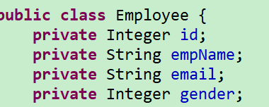

# Mybatis

[TOC]

## 一. 绪论

本课的主要内容为__Mybatis3(google)__,在其2之前名为__ibatis(apachy)__,

### 1. 前言

* 在持久化(Java)发展历史中,有:

  * JDBC

  * DBUtils(QueryRunner)

  * jdbcTemplate(Spring工具)

    ```mermaid
    graph LR
    以上三者的实现思路
    A[编写sql]-->B[预编译]-->C[设置参数]
    C-->D[执行sql]-->E[封装结果]
    ```

* 所以上面三个有什么问题?

  * 功能简单
  * sql编写在java中,高耦合

* 持久化框架

  * Hibernate: 

    * 全自动全映射ORM框架,
    * 旨在消除SQL;
    * 但是都消除了,微操就需要学习成本(学HQL),

    ```mermaid
    graph LR
    javaBean-->DbRecords
    ```

  * Mybatis:

    * 半自动,轻量级(只有一个jar包)
    * SQL写在配置文件中,其他的由mybatis完成
    * 实现了SQL和java分离,而且SQL是开发人员控制
    * 是对原生JDBC的封装

### 2. 下载地址

从github下载

https://github.com/mybatis/mybatis-3

## 二. HelloWorld

### 1. 导包

核心`mybatis-x.x.x.jar`一个包就行

然后导入一个数据库驱动包,比如`mysql-connector`

建议再导入日志包`log4j`,让mybatis自动在一些时刻记录日志

> 依赖类路径下的一个log4j.xml/properties配置文件
>
> 内容可以去mybatis文档logging里cv

### 2. 配置基本环境

<u>数据库和表</u>需要,<u>bean</u>需要<u>,dao接口</u>也需要

表:


bean:



dao:

```java
public interface EmployeeDao {
	public Employee getEmpById(Integer id) ;
}
```

### 3. 简单写配置文件1: 全局配置文件

指导mybatis指向哪个数据库(配连接池)

这个看官方文档更爽

3.1是官方文档内容加一点润色

#### 3.1 从 XML 中构建 SqlSessionFactory

每个基于 MyBatis 的应用都是**以一个 `SqlSessionFactory` 的实例为核心**的。SqlSessionFactory 的实例可以通过 `SqlSessionFactoryBuilder` 获得。而 SqlSessionFactoryBuilder 则可以<u>从 XML 配置文件或一个预先配置的 Configuration 实例</u>来构建出 SqlSessionFactory 实例。

> XML --- SqlSessionFactoryBuilder ---- SqlSessionFactory

从 XML 文件中构建 SqlSessionFactory 的实例非常简单，建议使用类路径下的资源文件进行配置。 但也可以使用任意的输入流（InputStream）实例，比如用文件路径字符串或 file:// URL 构造的输入流。MyBatis 包含一个名叫 Resources 的工具类，它包含一些实用方法，使得从类路径或其它位置加载资源文件更加容易。

```java
//这里是从全局配置文件中获取SqlSessionFactory的java代码
String resource = "org/mybatis/example/mybatis-config.xml";//路径
InputStream inputStream = Resources.getResourceAsStream(resource);
SqlSessionFactory sqlSessionFactory = new SqlSessionFactoryBuilder().build(inputStream);
```

XML 配置文件中包含了对 MyBatis 系统的核心设置，包括获取数据库连接实例的数据源（DataSource）以及决定事务作用域和控制方式的事务管理器（TransactionManager）。后面会再探讨 XML 配置文件的详细内容，这里先给出一个简单的示例：

* 全局配置文件: 示例配置

```xml
<?xml version="1.0" encoding="UTF-8" ?>
<!DOCTYPE configuration
  PUBLIC "-//mybatis.org//DTD Config 3.0//EN"
  "http://mybatis.org/dtd/mybatis-3-config.dtd">
<configuration>
  <environments default="development">
    <environment id="development">
      <transactionManager type="JDBC"/>
        <!-- -->
        <!-- 这里配置的就是datasource,可以改-->
      <dataSource type="POOLED">
        <property name="driver" value="${driver}"/>
        <property name="url" value="${url}"/>
        <property name="username" value="${username}"/>
        <property name="password" value="${password}"/>
      </dataSource>
        <!--***********-->
    </environment>
  </environments>
  <mappers>
    <mapper resource="org/mybatis/example/BlogMapper.xml"/>
  </mappers>
</configuration>
```

当然，还有很多可以在 XML 文件中配置的选项，上面的示例仅罗列了最关键的部分。 注意 XML 头部的声明，它用来验证 XML 文档的正确性。environment 元素体中包含了事务管理和连接池的配置。mappers 元素则包含了一组映射器（mapper），这些映射器的 XML 映射文件包含了 SQL 代码和映射定义信息。

### 4. 配置文件2: Sql映射文件+注册

编写sql语句,并制定每一个方法如何执行sql,<u>相当于一个dao实现类</u>

sql语句不建议分号

`#{}`取参数值

```xml
<?xml version="1.0" encoding="UTF-8" ?>
<!DOCTYPE mapper
  PUBLIC "-//mybatis.org//DTD Mapper 3.0//EN"
  "http://mybatis.org/dtd/mybatis-3-mapper.dtd">
<mapper namespace="com.at.dao.EmployeeDao">
<!-- namespace写dao接口的全类名 -->
<select id="getEmpById" resultType="com.at.bean.Employee">    
  <!-- select标签定义一个select操作 -->
  <!-- id         =方法名 -->
  <!-- resultType =返回值类型,查询操作不能省略 -->
  <!-- 标签体:     sql语句 -->
    select * from t_employee where id = #{id} <!-- 取参数值-->
</select>

```

* 然后得去全局配置文件注册sql映射文件

  在全局配置文件中的`<mappers>`标签中使用mapper标签引入sql映射文件

```xml
<mappers>
    <!--从类路径下开始-->
    <mapper resource="employeedao.xml"/>
</mappers>
```

### 4.+ 配置增删改

```java
public interface EmployeeDao {
	public Employee getEmpById(Integer id) ;
	public boolean updateEmp(Employee employee);
	public boolean deleteEmp(Integer id);
	public boolean insertEmp(Employee employee);
}

```

* 在**sql映射文件**中使用对应标签进行配置,永远不需要写paramType(参数类型)

  * 增删改的<u>返回值</u>: 
    * 如果返回值为数字就返回影响了多少行
    * 如果是boolean就返回是否影响了一行以上
  * 参数: 当传入bean时,可以用`#{属性名}`直接取属性

  ```xml
  <update id="updateEmp">
    	update t_employee set email=#{email},empname=#{empName},gender=#{gender} where id=#{id}
  </update>
  ```

  ```xml
  <delete id="deleteEmp">
    		delete from t_employee where id=#{id}
  </delete>
  ```

* 需要**手动提交**

  ```java
  session.commit();
  ```

  或者: 在openSession()的时候传入boolean为true,开启自动连接

### 5. SqlSessionFactory

就是之前从全局配置文件获取SqlSessionFactory的代码

```java
//这里是从全局配置文件中获取SqlSessionFactory的java代码
String resource = "org/mybatis/example/mybatis-config.xml";//类路径起步
InputStream inputStream = Resources.getResourceAsStream(resource);
SqlSessionFactory sqlSessionFactory = new SqlSessionFactoryBuilder().build(inputStream);
```

* 

### 6. 获取SqlSession和使用

`SqlSession`: 跟数据库的一次会话,相当于一次连接

使用工厂的openSession方法获得

```java
SqlSession session = sqlSessionFactory.openSession();
```

使用: 调用`getMapper(dao接口的class)`,然后调用dao的方法就可以达到希望的效果

```java

SqlSession session = sqlSessionFactory.openSession();
		try {	
			EmployeeDao mapper = session.getMapper(EmployeeDao.class);
            //获取一个动态代理
			Employee empById = mapper.getEmpById(1);
			System.out.println(empById);
		}finally {
			
			session.close();
		}
```

## 附. 用dtd让eclipse给你提示

dtd是xml的约束文件,只要配在xml文件中,ide就会给提示

mybatis提供的dtd:

```xml
<!DOCTYPE configuration
  PUBLIC "-//mybatis.org//DTD Config 3.0//EN"
  "http://mybatis.org/dtd/mybatis-3-config.dtd">
```


在jar包里就能看得到,可以通过解压获取(或者直接复制网址下载)

配置: 

1. 复制xml中提供的dtd网址

2. 网址填进key,keyType设置uri,location选择文件

   


## 三. 全局配置文件

```
Content Model : (properties?, settings?, typeAliases?, typeHandlers?, objectFactory?, 
 objectWrapperFactory?, plugins?, environments?, databaseIdProvider?, mappers?)
```

所有标签要按照这个顺序写

### 1. 从properties中获得数据源信息

`<properties>标签`引入properties文件,直接写在`<configuration>`下

```xml
从类路径下获取
<properties resource="jdbc.properties"></properties>
从网络资源获取
<properties url=""></properties>
```

然后用Spring/EL同款语法取值

```xml
<dataSource type="POOLED">
        <property name="driver" value="${jdbcDriver}"/>
        <property name="url" value="${url}"/>
        <property name="username" value="${user}"/>
        <property name="password" value="${password}"/>
      </dataSource>
```

### 2. **settings标签改变mybatis行为

官方有一张配置项表,建议查看

[settings](https://mybatis.org/mybatis-3/zh/configuration.html#settings)

* 示例: 自动命名映射

| 属性                     | 作用                                                         | 取值        | 默认值                |
| ------------------------ | ------------------------------------------------------------ | ----------- | --------------------- |
| mapUnderscoreToCamelCase | 是否开启驼峰命名自动映射，即从经典数据库列名 A_COLUMN 映射到经典 Java 属性名 aColumn。 | true/false  | False                 |
| lazyLoadingEnabled       | 延迟加载,当打开后所有关联对象(association)都会延迟加载,等待要用的时候再查询 | true\|false | false                 |
| aggressiveLazyLoading    | 开启时，任一方法的调用都会加载该对象的所有延迟加载属性。 否则，每个延迟加载属性会按需加载 | true\|false | true/false(3.4.1以后) |

```xml
<settings >
 		<setting name="mapUnderscoreToCamelCase" value="true"/>
</settings>
```

### 3. typeAliases简化全类名写法

> 但是推荐使用全类名

别名默认是不区分大小写的**类名**

使用alias属性指定别名

```xml
<typeAliases>
    	<!-- 默认为employee,指定为emp-->
 	<typeAlias type="com.at.bean.Employee" alias="emp"/>
</typeAliases>
```

* 批量起别名:

  ```xml
  <typeAliases>
      <!-- 按包分配 -->
   	<package name="com.at" />
  </typeAliases>
  ```

* 在批量的时候指定别名

  * 在想要起别名的类上使用`@Alias`注解

    ```java
    @Alias("emp")
    public class Employee {
    ```

    

* 已经内置的别名
  * 对于基础类型,别名是类名前加一个`_`,对于大家熟知的引用类型,别名就是类名
  * 不建议冲突

### 4. typeHandlers类型处理器

我们期望mybatis智能的转换mysql的类型和java类型,类似springmvc的那种类型转换器

mybatis已经帮你准备了很多,如果想自定义就实现BaseTypeHandler接口

然后用这个标签把自定义处理器配置进去就行

### 5. plugins


一般不自己写插件,一般插件会用面向切面切入代理对象的运行

以后再介绍

### 6. environments

> 建议看文档了解

环境们,配置环境,用`environment`配置,主要是配置__事务管理器__和__数据源__

但其实都是用spring来管理的

属性: default 属性值为environment的id,指定默认使用环境

```xml
<!-- id是环境的唯一标识,可以通过environments的default属性指定默认环境-->
<environment id="development">
      <transactionManager type="JDBC"/>
      
        <!-- -->
        <!-- 这里配置的就是datasource,可以改-->
      <dataSource type="POOLED">
        <property name="driver" value="${jdbcDriver}"/>
        <property name="url" value="${url}"/>
        <property name="username" value="${user}"/>
        <property name="password" value="${password}"/>
      </dataSource>
        <!--***********-->
    </environment>
```

### 7. databaseIdProvider做数据库移植(厂商标识)

sql是写好的,如果换数据库dbms,之前写的sql语法就有问题了

所以`databaseIdProvider`就是用来解决这问题

```xml
<databaseIdProvider type="DB_VENDOR">
    <!-- name=数据库厂商标识 value=别名 -->
  <property name="SQL Server" value="sqlserver"/>
  <property name="DB2" value="db2"/>
  <property name="Oracle" value="oracle" />
</databaseIdProvider>
```

然后在sql映射文件中的增删改查标签中使用`databaseId`属性并传入别名,区分sql语法对应的厂商就行

### 8. **mappers注册sql映射

* `mapper`标签的属性

  * `class`: 直接用接口全类名

    * 实现细节: 配置文件和接口在一个包下,并且文件名相同

    * 或者用注解(sql耦合,不好,可以配合使用)

      ```java
      public interface EmployeeDao2 {
      	@Select("select * from t_employee where id = #{id}")
      	public Employee getEmpById(Integer id) ;
      	@Update("update t_employee set email=#{email},emp_name=#{empName},gender=#{gender} where id=#{id}")
      	public boolean updateEmp(Employee employee);
      	@Delete("delete from t_employee where id=#{id}")
      	public boolean deleteEmp(Integer id);
      	@Insert("insert into t_employee(emp_name,gender,email) values (#{empName},#{gender},#{email})")
      	public boolean insertEmp(Employee employee);
      }
      ```

      

  * `resource`: 在类路径下找sql映射文件

  * `url`: 从磁盘/网络路径寻找

* 批量注册`package`标签
  
  * `name`属性: 包名,但是用的是class的匹配方式,需要用注解或者 放在一个包下起同一个名字


## 四. sql映射文件

### 1. 增删改

`insert,update,delete`标签

* 属性
  * `databaseId`: 指定这个CRUD属于哪个数据库
  * `id`: 唯一标识符,方法名
  * 参数类型: 已废弃
  * `timeout`: 超时秒数,跟事务控制有关,用spring做
  * `statement`: 
    * STATEMENT: 用Statement做
    * PREPARED: 默认,用PreparedStatement做
    * CALLABLE: 调用存储过程
  * `useGeneratedKeys`:接下来细说
  * `keyProperty`: 接下来细说

* 获取插入后的自增id

  * 我们希望: <u>将id自动赋值给传入的Employee对象</u>

  * 操作:

    * 将`useGeneratedKeys`设为true,表示要使用自动生成的主键
    * 用`keyProperty`指定属性封装(填参数的属性名)
    * 示例:

    ```xml
    <insert id="insertEmp" useGeneratedKeys="true" keyProperty="id">
      	insert into .....
    </insert>
    ```

  * 底层: 调用statement的getGeneratedKey()方法

### 2. 查

#### 2.1 参数

* 单个参数: 
  * 基本类型取值: `#{随便写}`
  * 传入POJO: 
    * 取属性: `#{属性名}`
  * 传map:
    * 取属性: `#{键名}`
* 两个+参数: 只能用 <u>数字序号(从0开始)</u> 或者 <u>param+数字序号(从1开始)</u>
  * `#{0}`,`#{1}`,`#{param1}`,`#{param2}`.....
  * mybatis会把多个参数封装在一个map中,然后根据表达式中的key取值(指的是0,1数字键,而param1这种键不是)
  * **指定键名**: 在Dao接口的参数上加`@Param(键名)`指定,称为__命名参数__,<u>会覆盖0,1,2...数字键</u>
* 多个参数: 含pojo或者map
  * 已知多个参数会封装map,所以我们可以用`#{别名或者paramN.属性}`获得多个参数中的pojo或者map中的属性值或者值

#### 2.2 取值

两种取值方式:

`#{}`: 

基本规则上面讲的差不多了

取值的时候还可以在#{}中传入一些规则

```sql
#{aaa,jdbcType=INTEGER}
比如给oracle传了个null,oracle不认输,所以要用jdbcType指定
```

`${}`: 

用法一样,但是上面#{ }的sql是**预编译**的,但**${ }是拼串**的

显然有安全性问题

好像这家伙会把包装类看做bean取属性

**使用场景:** sql语句预编译的时候只有_参数部分_支持预编译为占位符`?`,但是有时候要动态取表名,所以可以用${ }来进行填充

#### 2.3 返回list

当返回值是集合,`resultType`指定内部元素的类型即可,Mybatis会智能的封装

```xml
<!-- public List<Employee> getAll(); -->
<select id="getAll" resultType ="com.at.bean.Employee">
  	select * from t_employee
</select>
```

#### 2.4 返回map

* 如果只有一条记录:`resultType`写**map**(内建类型的别名)

  * key: 列名

  * value: 值

    ```xml
    <!-- public Map<String,Object> getById(Integer id); -->
    <select id="getById" resultType="map">
    	select * from t_employee where id=${id}
    </select>
    ```

* 有好多记录: `resultType`写map中元素的类型(一条记录对应的bean的类型)

  * key: 主键,需要用注解指定

    ```java
    //注解的value是封装的对象的属性(通过getter获取的那种),而不是数据库字段名
    @MapKey("id")
    public Map<String,Employee> getAllMap();
    ```

    

  * value: 这个记录封装的对象(要用对应的Map<主键类型,>)

```xml

<!-- public Map<String,Employee> getAllMap(); -->
<select id="getAllMap" resultType="com.at.bean.Employee">
  	select * from t_employee
</select>
```

#### 2.5 resultMap自定义

有时候比如简单的驼峰映射满足不了我们的需要,也不想写别名

* mybatis封装的规则:
  * 按照列名和属性名不区分大小写的一一对应
  * 不然
    * 用驼峰命名映射
    * 起别名
    * 自定义结果集

自定义结果集`resultMap标签`:

* 在sql映射文件中使用

* 属性

  * `type` 指定对哪个javaBean自定义封装规则
  * `id` 唯一标识,让后人引用

* 子标签

  * `id`: 用来指定主键列的对应规则

    * property: 属性
    * column: 列

    ```xml
    <!-- 已经对应上了,不写也行 -->
    <id column="id" property="id"/>
    ```

  * `result`: 其他属性,跟上面这个用法一样

整体总览:(写在mapper标签中)

```xml
<resultMap type="com.at.bean.Cat" id="catt">
 		<id column="id" property="id"/>
 		<result column="cname" property="name"/>
 		<result column="cage" property="age"/>
 		<result column="cgender" property="gender"/>
 	</resultMap>

```

* __在select中使用自定义规则__:

  * 将resultType属性去掉

  * 改用resultMap属性,值为想要用的规则的id

  * 即可

    ```xml
    <select id="getCatById" resultMap="catt">
     	select * from t_cat where id = #{id}
    </select>
    ```

### 3. resultMap: 联合查询

#### 3.1 级联属性

情景: 我们在建立key表和lock表,并建立key中参照lock表的<u>外键约束</u>

然后建立Key类和Lock类,在<u>Key类中包含一个属性为Lock类对象</u>

我们想要在连接查询的同时将外键封装进Lock对象

* 一般用到联合查询这种比较复杂的查询,我们都会选择用`resultType`自定义封装

1. 联合查询时,建议多表 同名字段 起别名(为了在resultMap中能分辨)

   ```xml
   <select id="getKeyById" resultMap="key">
       select k.id kid,k.keyname,k.lock_id,l.id lid,l.lockname 
       from t_key k left join t_lock l 
       on k.lock_id=l.id 
       where k.id=#{id}
    </select>	
   ```

2. 在给引用类型属性赋值时,使用类似于SpringMVC级联封装的语法,就是

   `property="key的属性.lock的属性名"`

3. 可以成功的配置: 

```xml

<select id="getKeyById" resultMap="key">
select k.id kid,k.keyname,k.lock_id,l.id lid,l.lockname
    from t_key k left join t_lock l on k.lock_id=l.id  
    where k.id=#{id} 	
</select>	
  	<resultMap type="com.at.bean.Key" id="key">
  		<id column="kid" property="id"></id>
  		<result column="keyname" property="keyName"/>
        
  		<result column="lid" property="lock.id"/>
  		<result column="lockname" property="lock.lockName"/>
  	</resultMap>
```

#### 3.2 association标签

resultMap的子标签

使用`association`标签简化对复杂的级联对象的操作

使用`collection`标签简化集合属性的操作

介绍: `association`表示<u>我级联了一个对象</u>

* 属性: 
  * `property`为主对象中的属性名
  * `javaType`指定该属性的类型
* 子标签: 子标签和resultMap相同

```xml

<resultMap type="com.at.bean.Key" id="key">
  		<id column="kid" property="id"></id>
  		<result column="keyname" property="keyName"/>
  		<association property="lock" javaType="com.at.bean.Lock">
  			<id column="lid" property="id"/>
  			<result column="lockname" property="lockName"/>
  		</association>
  	</resultMap>
```

#### 3.3 collection标签

级联的集合属性

> 1-1关联 
>
> 1-n关联 *
>
> n-n关联

我们是1-n关联,使用外键

bean中含有集合属性

* collection属性
  * `property` 属性名
  * `ofType`: 封装的元素的类型
* 在collection中的子标签和resultMap的子标签一样

查出多条记录,之后将不一样的部分注册进collection,其他部分放在resultMap下,就会整合成一条记录(一个对象); 如果不是这样就会报错

```xml
<resultMap type="com.at.bean.Lock" id="lockm">
		<id column="lid" property="id"/>
		<result column="lockname" property="lockName"/>
		<collection property="keys" ofType="com.at.bean.Key">
			<!-- 直接写封装对象的属性,不需要额外的association -->
            <id column="kid" property="id"></id>
			<result column="keyname" property="keyName"/>
		</collection>
	</resultMap>
```


#### 3.4. 分步查询:assciation(不太推荐)

>  在resultMap中使用查询来赋值,使sql分步

我们想要在Key中赋值Lock,试着用简单的实现来完成

```java
Key key = keyDao.getKeyById(1);
Lock lock = lockDao,getLockById(1);
//照理说分这两步就可以获得,用了两次sql
```

* 在要查的对象使用association
* 在association中使用属性`select`指向一个select标签的id,可以用`namespace.id`引用其他sql映射文件中的select,比如`com.at.dao.LockDao.getLockById`
* 使用`column`属性指定将哪一列的值作为参数传入select标签(即方法参数)

```xml
<association property="lock" column="lock_name"
			select="com.at.dao.LockDao.getLockById"></association>
```

* 分布查询懒加载属性:
  * 在全局配置中的settings中配置了`lazyLoadingEnabled`以后,可以在association中配置说要不要懒加载
  * `fetchType属性`: **lazy**则懒加载,**eager**则立即加载

> 多列 column="{id=lock_name,...,....}"

#### 3.5 分布查询: collection

一样的,select属性,column属性,fetchType属性


## 五. 动态sql

### 1. 介绍

动态 SQL 是 MyBatis 的强大特性之一。如果你使用过 JDBC 或其它类似的框架，你应该能理解根据不同条件拼接 SQL 语句有多痛苦，例如拼接时要确保不能忘记添加必要的空格，还要注意去掉列表最后一个列名的逗号。利用动态 SQL，可以彻底摆脱这种痛苦。

* 简而言之: 简化**sql语句的动态拼串**操作
* 和jstl有些似曾相识

### 2. if

情景介绍:

```java
public Teacher getTeacher(Teacher teacher);
//我们传入一个teacher,teacher中有哪些字段不为null,就根据这些字段来查
```

搭个框:

```xml
<select id="getTeacher" resultMap="teacher">
  		select * from t_teacher
  		where
  		<if test="">
  			<!-- 这里需要动态拼串 -->
  		</if>
  	</select>
```

`if`: 和c:if用法差不多,test就是判断的内容,传入__OGNL表达式__

* 判断属性是否为空

```xml
<if test="id!=null">
  		<!-- 取出传入的bean的id属性,判断其不为空 -->
    id = #{id}
</if>
```

* 逻辑: and,or,not, `&amp;&amp;`,||
* 要转义用xml那套&;

### 2. where,trim

#### 2.1 where

专门用于where的拼串

* 有了where标签就不需要在sql中写where了
* 会自动消除拼串完成后第一个__and,or__
  * 也就是说,拼串的and,or应该写在条件前面而不是后面

```xml
select * from t_teacher
<where>
  		<if test="birth!=null">
  			birth_date > #{birth} 
  		</if>
  		<if test="id!=null">
  			and id=#{id}
  		</if>
  		<if test="name!=null">
  			and teachername like #{name}
  		</if>

</where>
```

#### 2.2 trim

改变前后缀,比where好用

```xml
<trim prefix="" prefixOverrides="" suffix="" suffixOverrides="">
</trim>
```

`prefix`: 为内容添加一个前缀,比如prefix="where"

`prefixOverrides`: 去除前缀,用管道符`|`分隔多个

后缀同理

```xml
select * from t_teacher
		<!-- 把前后多出来的and,or干掉-->
		<trim prefix="where" prefixOverrides="and|or" suffixOverrides="and|or">
			<if test="birth!=null">
				birth_date > #{birth}
			</if>
			<if test="id!=null">
				and id=#{id}
			</if>
			<if test="name!=null">
				and teachername like #{name}
			</if>

		</trim>
```

### 3. foreach

情景: 我们给了个id list,想要取出多条记录

```java
public List<Teacher> getTeacherIdIn(@Param("ids")List<Integer> id);
//指定Param注解可以对应collection属性的值
```

* 搭个架子

  ```xml
  select * from t_teacher 
  where id in
  <foreach collection="ids">
  			<!-- 如果没有指定@param,那只能传入list来取-->
  </foreach>
  ```

* 属性

  * `collection`: 要遍历的集合的代号
  * `item`: 遍历出的元素的变量名,可以用#{}取值
  * `index`: 索引,或者key(map)对应的变量名
  * `separator`: 每次遍历之间加分隔符(这样就摆脱了多一个少一个逗号的困扰)
  * `open`: 指定一个前缀,以什么开始,比如open="("
  * `close`: 指定一个后缀

```xml
select * from t_teacher 
where id in
<foreach collection="ids" item="id_item" separator="," open="(" close=")">
	#{id_item}
</foreach>
```

### 4. choose、when、otherwise

有时候，我们不想使用所有的条件，而只是想从多个条件中选择一个使用。针对这种情况，MyBatis 提供了 choose 元素，它有点像 Java 中的 switch 语句。

还是上面的例子，但是策略变为：传入了 “title” 就按 “title” 查找，传入了 “author” 就按 “author” 查找的情形。若两者都没有传入，就返回标记为 featured 的 BLOG（这可能是管理员认为，与其返回大量的无意义随机 Blog，还不如返回一些由管理员精选的 Blog）。

```xml
<select id="findActiveBlogLike" resultType="Blog">
  SELECT * FROM BLOG WHERE state = ‘ACTIVE’
  <choose>
     <when test="title != null">
       AND title like #{title}
     </when>
     <when test="author != null and author.name != null">
       AND author_name like #{author.name}
     </when>
    <otherwise>
      AND featured = 1
    </otherwise>
  </choose>
```

### 5. set

处理update的那个set

把串放进set,就会帮你去掉最后一个逗号(就这)

还是得用一堆if

### 6. OGNL表达式

`对象图导航语言`

可以操作对象属性

* person.name

* person.getName()

* 静态属性/方法: `@java.lang.Math@PI`

* 构造器: `new com.at.bean.Person("aaa").name`

* 集合使用伪属性

* 运算符

  

  内置参数:

  `_parameter`: 封装参数的map

  `_databaseId`: 就是数据库环境,在全局配置中写的

  ### 7. include,sql

  sql里写可重用sql,用include引入

  

## 六. 缓存

### 1. 缓存

暂时的存储一些数据,加快系统的查询数据

在内存中时

Mybatis的两级缓存:

* 一级缓存: 线程级别,本地缓存,sqlSession缓存
* 二级缓存: 全局缓存,其他sqlSession和其他线程都能用

不会出现一二级缓存有相同数据

优先看二级缓存

### 2. 一级缓存

`sqlSession级别缓存`

本质是map

是mybatis的默认行为,无论如何配置它都存在.

* 只要之前查询过的数据,mybatis就会保存在缓存中,下次直接从缓存中拿

一级缓存失效:

* 用的不是同一个sqlSession
* 查的不是同一个sql
* 任何增删改操作
* 调用了sqlsession的`clearCache`方法

### 3. 二级缓存

`namespace级别缓存`

默认不开启,需要手动配置

要求相关POJO实现Serializable接口

在一个SqlSession关闭或提交后,缓存在全局生效

* 全局配置

```xml
<setting name="cacheEnabled" value="true" />
```

* 映射文件配置: 直接配置在mapper下

   ```
  <cache />
  ```

* 属性:

  * `evicton`: LRU,FIFO之类的
  * `flushInterval`: 刷新间隔
  * `size`: 最大大小
  * `readOnly`: 只读/读写;读写比较安全

### 4. 缓存原理


### 5. 一些各种标签属性

`select的useCache`属性: true/false 是否使用二级缓存

`增删改标签的flushCache`属性: true/false 设置为false就不会清空一二级缓存

### 6. 整合第三方缓存

Mybatis开放了Cache接口来让人实现

用cache标签的type可以指定Cache接口的实现类


## 七. MBG

`Mybatis generator`mybatis官方提供的代码生成器,也称为<u>逆向工程</u>

### 1. 正向逆向

正向: table-javaBean-dao-xml

逆向: xml-dao-bean-table

### 2. 导包

`mybatis-generator-core-....jar`

### 3. 写配置

放在工程底下

内容可以从文档拷贝

```xml
<?xml version="1.0" encoding="UTF-8"?>
<!DOCTYPE generatorConfiguration
  PUBLIC "-//mybatis.org//DTD MyBatis Generator Configuration 1.0//EN"
  "http://mybatis.org/dtd/mybatis-generator-config_1_0.dtd">

<generatorConfiguration>

  <context id="DB2Tables" targetRuntime="MyBatis3">
    <jdbcConnection driverClass="COM.ibm.db2.jdbc.app.DB2Driver"
        connectionURL="jdbc:db2:TEST"
        userId="db2admin"
        password="db2admin">
    </jdbcConnection>

    <javaTypeResolver >
      <property name="forceBigDecimals" value="false" />
    </javaTypeResolver>

    <javaModelGenerator targetPackage="test.model" targetProject="\MBGTestProject\src">
      <property name="enableSubPackages" value="true" />
      <property name="trimStrings" value="true" />
    </javaModelGenerator>

    <sqlMapGenerator targetPackage="test.xml"  targetProject="\MBGTestProject\src">
      <property name="enableSubPackages" value="true" />
    </sqlMapGenerator>

    <javaClientGenerator type="XMLMAPPER" targetPackage="test.dao"  targetProject="\MBGTestProject\src">
      <property name="enableSubPackages" value="true" />
    </javaClientGenerator>

    <table schema="DB2ADMIN" tableName="ALLTYPES" domainObjectName="Customer" >
      <property name="useActualColumnNames" value="true"/>
      <generatedKey column="ID" sqlStatement="DB2" identity="true" />
      <columnOverride column="DATE_FIELD" property="startDate" />
      <ignoreColumn column="FRED" />
      <columnOverride column="LONG_VARCHAR_FIELD" jdbcType="VARCHAR" />
    </table>

  </context>
</generatorConfiguration>
```

`jdbcConnection`: 数据库连接

`javaModelGenerator`: bean类生成

`sqlMapGenerator`: 映射文件生成

`javaClientGenerator`: dao生成

`table`: 表,和对应的类名

### 3. 生成(用java代码)

```java

@Test
	public void test1() throws Exception, IOException, InterruptedException {
		 List<String> warnings = new ArrayList<String>();
		   boolean overwrite = true;
		   File configFile = new File("mbg.xml");
		   ConfigurationParser cp = new ConfigurationParser(warnings);
		   Configuration config = cp.parseConfiguration(configFile);
		   DefaultShellCallback callback = new DefaultShellCallback(overwrite);
		   MyBatisGenerator myBatisGenerator = new MyBatisGenerator(config, callback, warnings);
		   myBatisGenerator.generate(null);
	}
```

## 八. 原理


### 1. SqlSessionFactory的初始化

```java
SqlSessionFactory sqlSessionFactory = new SqlSessionFactoryBuilder().build(inputStream);
```

该代码即初始化过程,inputStream是读入的全局配置文件

`SqlSessionFactoryBuilder`: 是一个单纯的Builder,除了构造器就只有build了

#### 1.1 Builder将xml转换为Configuration

build方法最终落实到build(Configuration)的实现上,在此之前该Builder会将各种信息转换为Configuration,比如此地是xml

```java
XMLConfigBuilder parser = new XMLConfigBuilder(inputStream, environment, properties);
return build(parser.parse());
```

```java
public SqlSessionFactory build(Configuration config) {
  return new DefaultSqlSessionFactory(config);
}
```

以下是parse中的源码:

evalNode和XNode是ibatis封装w3c.dom的实现,方便利用xpath查找及使用xml信息

```java
private void parseConfiguration(XNode root) {
  try {
    // issue #117 read properties first
    propertiesElement(root.evalNode("properties"));
    Properties settings = settingsAsProperties(root.evalNode("settings"));
    loadCustomVfs(settings);
    loadCustomLogImpl(settings);
    typeAliasesElement(root.evalNode("typeAliases"));
    pluginElement(root.evalNode("plugins"));
    objectFactoryElement(root.evalNode("objectFactory"));
    objectWrapperFactoryElement(root.evalNode("objectWrapperFactory"));
    reflectorFactoryElement(root.evalNode("reflectorFactory"));
      
      //该方法内记录了每一个setting的信息及其默认值,可以看看
    settingsElement(settings);
    // read it after objectFactory and objectWrapperFactory issue #631
    environmentsElement(root.evalNode("environments"));
    databaseIdProviderElement(root.evalNode("databaseIdProvider"));
    typeHandlerElement(root.evalNode("typeHandlers"));
    mapperElement(root.evalNode("mappers"));
  } catch (Exception e) {
    throw new BuilderException("Error parsing SQL Mapper Configuration. Cause: " + e, e);
  }
}
```

展开1: `mapperElement`

>  如果写了package就会按照包的方式添加Mapper,不然就会使用`XMLMapperBuilder`进行构建
>
> 其先将namespace存储,并且处理缓存,resultMap,sql之类的,最后处理增删改查标签
>
> 在解析增删改查标签时,使用`XMLStatementBuilder`
>
> > 先获取标签上所有的属性信息,然后作为参数传入一个方法中,该方法返回一个<u>**MappedStatement**并添加入configuration(id-statement映射)</u>.蕴含了一个增删改查标签的所有信息
> >
> > ```java
> > builderAssistant.addMappedStatement(id, sqlSource, statementType, sqlCommandType,
> >     fetchSize, timeout, parameterMap, parameterTypeClass, resultMap, resultTypeClass,
> >     resultSetTypeEnum, flushCache, useCache, resultOrdered,
> >     keyGenerator, keyProperty, keyColumn, databaseId, langDriver, resultSets);
> > ```
> >
> > 对于c<u>onfiguration中的MapperRegistry</u>,保存接口和代理工厂的映射

```java
//MappedStatement的所有属性
public final class MappedStatement {

  private String resource;
  private Configuration configuration;
  private String id;
  private Integer fetchSize;
  private Integer timeout;
  private StatementType statementType;
  private ResultSetType resultSetType;
  private SqlSource sqlSource;
  private Cache cache;
  private ParameterMap parameterMap;
  private List<ResultMap> resultMaps;
  private boolean flushCacheRequired;
  private boolean useCache;
  private boolean resultOrdered;
  private SqlCommandType sqlCommandType;
  private KeyGenerator keyGenerator;
  private String[] keyProperties;
  private String[] keyColumns;
  private boolean hasNestedResultMaps;
  private String databaseId;
  private Log statementLog;
  private LanguageDriver lang;
  private String[] resultSets;
}
```

### 2. openSession

调用`openSessionFromDataSource`并返回SqlSession

> __openSessionFromDataSource__:
>
> 参数中获取ExecutorType,先创建事务并添加一些信息
>
> 然后newExecutor
>
> > **newExecutor(tx,executype)**:
> >
> > (Executor是执行器接口,传入MappedStatement可以进行指定的操作)
> >
> > 根据Type是REUSE,BATCH,SIMPLE分别new不同的Executor
> >
> > 如果缓存开启就包装成CachedExecutor(每次操作先查缓存再操作)
> >
> > 最后拦截器链再将插件包装进Executor中
> >
> > ```java
> > public Object pluginAll(Object target) {
> >   for (Interceptor interceptor : interceptors) {
> >     target = interceptor.plugin(target);
> >   }
> >   return target;
> > }
> > ```
>
> new一个DefaultSqlSEssion,将<u>configuration,executor和autoCommit=false</u>传入,并返回给主程序

### 3. getMapper获取代理

内部由configuration调用,传入类型和sqlSession(自己)

再由`mapperRegistry`调用寻找

其从`knownMappers`属性(一个Map<Class\<?>, MapperProxyFactory<?>> )获取**MapperProxyFactory**,获取不了就抛异常;

之后: 

```java
mapperProxyFactory.newInstance(sqlSession);
```

> newInstance:
>
> 创建MapperProxy,其是一个InvocationHandler(动态代理传入的接口)
>
> 最后用最朴素的方式创建代理
>
> ```java
> return (T) Proxy.newProxyInstance(mapperInterface.getClassLoader(), new Class[] { mapperInterface }, mapperProxy);
> ```
>
> 

### 4. Mapper执行查询方法

获取的MapperProxy在执行方法时会先走进InvocationHandler的invoke方法

```java
@Override
public Object invoke(Object proxy, Method method, Object[] args) throws Throwable {
  try {
      //判断代理的方法来自Object还是接口
    if (Object.class.equals(method.getDeclaringClass())) {
      return method.invoke(this, args);
    } else {
        //将当前方法包装一个cachedInvoker再执行
      return cachedInvoker(method).invoke(proxy, method, args, sqlSession);
    }
  } catch (Throwable t) {
    throw ExceptionUtil.unwrapThrowable(t);
  }
}
```

Invoker再调用<u>mappedMethod的execute</u>

```java
@Override
public Object invoke(Object proxy, Method method, Object[] args, SqlSession sqlSession) throws Throwable {
  return mapperMethod.execute(sqlSession, args);
}
```

> __execute__:
>
>  首先判断command的类型,我们这里是select
>
> 判断完毕后根据返回值情况来执行,此处我们来到else块
>
> ```java
> if (method.returnsVoid() && method.hasResultHandler()) {
>   executeWithResultHandler(sqlSession, args);
>   result = null;
> } else if (method.returnsMany()) {
>   result = executeForMany(sqlSession, args);
> } else if (method.returnsMap()) {
>   result = executeForMap(sqlSession, args);
> } else if (method.returnsCursor()) {
>   result = executeForCursor(sqlSession, args);
> } else {
>     //转换参数,如果是单个就返回,如果是多个就包装成map返回
>   Object param = method.convertArgsToSqlCommandParam(args);
>     //执行jdbc
>   result = sqlSession.selectOne(command.getName(), param);
>   if (method.returnsOptional()
>       && (result == null || !method.getReturnType().equals(result.getClass()))) {
>     result = Optional.ofNullable(result);
>   }
> }
> ```
>
> > __selectOne__:
> >
> > 查询列表并返回第一个值,如果太多或没有就自己抛异常
> >
> > ```java
> > @Override
> > public <T> T selectOne(String statement, Object parameter) {
> >   // Popular vote was to return null on 0 results and throw exception on too many.
> >   List<T> list = this.selectList(statement, parameter);
> >   if (list.size() == 1) {
> >     return list.get(0);
> >   } else if (list.size() > 1) {
> >     throw new TooManyResultsException("Expected one result (or null) to be returned by selectOne(), but found: " + list.size());
> >   } else {
> >     return null;
> >   }
> > }
> > ```
> >
> > > __selectList__:
> > >
> > > 首先拿到mappedStatement,然后将其传入**executor执行query**
> > >
> > > 在执行前会按照一定依据封装集合参数
> > >
> > > > __CachingExecutor.query__:
> > > >
> > > > > __getBoundSql__:
> > > > >
> > > > > 根据statement中的信息和传入的参数,生成一个BoundSql;
> > > > >
> > > > > 包含: 预编译的sql语句,占位符映射信息,传入参数信息,还有些metadata
> > > > >
> > > > > 接着检查一下ParameterMapping的ResultMap,就将BoundSql返回了
> > > >
> > > > 然后生成一个缓存key
> > > >
> > > > 最后再调用另一个query方法进行查询
> > > >
> > > > > __query__: 先检查**二级缓存**,没有的话就执行被代理Executor的query
> > > > >
> > > > > > __SimpleExecutor.query__:
> > > > > >
> > > > > > 试图从**一级缓存**拿到值,我们这没有,就执行__queryFromDatabase__
> > > > > >
> > > > > > > __queryFromDatabase__:
> > > > > > >
> > > > > > > 缓存操作: 先在本地缓存中放一个key-占位符,查询结束后先清空占位符,然后根据有没有查到值放key-list进缓存
> > > > > > >
> > > > > > > 创建StatementHandler以及使用它创建Statement:
> > > > > > >
> > > > > > > > __newStatementHandler__:
> > > > > > > >
> > > > > > > > 根据配置的statementType创建PreparedStatementHandler,在外面包装一层RoutingStatementHandler
> > > > > > > >
> > > > > > > > 并加入ParameterHandler,ResultHandler
> > > > > > > >
> > > > > > > > <u>拦截器链分别给ParameterHandler,ResultHandler,StatementHandler添加插件</u>
> > > > > > >
> > > > > > > > __prepareStatement__:
> > > > > > > >
> > > > > > > > 底层使用connection.prepareStatement创建,并进行一些设置
> > > > > > > >
> > > > > > > > 紧接着就预编译(parameterize)
> > > > > > > >
> > > > > > > > ```java
> > > > > > > > @Override
> > > > > > > > public void parameterize(Statement statement) throws SQLException {
> > > > > > > >     //底层调用TypeHandler设置参数,最底层当然是statement设置参数
> > > > > > > >   parameterHandler.setParameters((PreparedStatement) statement);
> > > > > > > > }
> > > > > > > > ```
> > > > > > >
> > > > > > > 最后由handler配合生成的statement执行query
> > > > > > >
> > > > > > > ```java
> > > > > > > @Override
> > > > > > > public <E> List<E> query(Statement statement, ResultHandler resultHandler) throws SQLException {
> > > > > > >   PreparedStatement ps = (PreparedStatement) statement;
> > > > > > >   ps.execute();
> > > > > > >   return resultSetHandler.handleResultSets(ps);
> > > > > > > }
> > > > > > > ```

## 九. 插件

### 1. 原理

原理就是上面源码中对四个对象进行拦截器链添加插件

机制: 拦截器创建代理对象并返回

```java
public Object pluginAll(Object target){
    for(Interceptor interceptor: intercrptors){
        target = interceptor.plugin(target);
    }
    return target;
}
```

### 2. 编写流程

简单地说就是实现Interceptor并放入链条

* **Interceptor: 主要是拦截并包装四大对象**

  ```java
  public interface Interceptor {
  	//拦截目标方法执行
      //调用invocation.proceed()相当于执行方法,会返回方法的返回值
      //该方法返回的内容即最终返回值
    Object intercept(Invocation invocation) throws Throwable;
  	
      //包装对象,即根据intercept的内容给四大对象包装动态代理,这里已经提供了默认实现
    default Object plugin(Object target) {
      return Plugin.wrap(target, this);
    }
  
    default void setProperties(Properties properties) {
      // 配置时设置的属性
    }
  
  }
  ```

也就是说实现intercept的操作即可

* **但是这还不够,我们需要用注解注明拦截哪些对象的哪些方法**,`@Intercepts`

  ```java
  @Documented
  @Retention(RetentionPolicy.RUNTIME)
  @Target(ElementType.TYPE)
  public @interface Intercepts {
    /**
     * Returns method signatures to intercept.
     * 返回要拦截的方法签名
     * @return method signatures
     */
    Signature[] value();
  }
  ```

  ```java
  @Documented
  @Retention(RetentionPolicy.RUNTIME)
  @Target({})
  public @interface Signature {
    // 拦截的类型,主要是四大对象
    Class<?> type();
    //方法名
    String method();
    //参数类型列表
    Class<?>[] args();
  }
  ```

  

* Interceptor实现示例:

  ```java
  @Intercepts({
          @Signature(type= StatementHandler.class,method="parameterize",args={Statement.class})
  })
  public class MyInterceptor implements Interceptor {
      @Override
      public Object intercept(Invocation invocation) throws Throwable {
          return invocation.proceed();
      }
  
      @Override
      public void setProperties(Properties properties) {
          System.out.println(properties);
      }
  }
  ```

  

* **将拦截器注册进全局配置**:

  * xml: 使用plugins标签

    ```xml
    <plugins>
        <plugin interceptor="com.sealll.interceptor.MyInterceptor">
            <property name="username" value="123"/>
            <property name="pass" value="123"/>
        </plugin>
    </plugins>
    ```