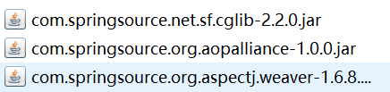

# Spring

学的是Spring4

> [TOC]

## 一. 绪论

### 1. 框架

**框架**是高度抽取可重用代码的一种设计,具有高度的通用性;

> 比如书城里的WebUtils,BaseServlet,之类的东西都挺不错的,打个包还能用

是一些半成品软件

### 2. Spring

Spring是一个<span style="color:red">IOC和AOP</span>__容器框架__

* Spring之前有一项技术叫做`EJB`(企业级JavaBean),拥有容器技术,但是以前的配置实在是太麻烦了,还只能JBoss提供容器环境

Sping的优良特性:

* __非侵入式__: 基于Spring开发的应用对象可以不依赖于Spirng的API
* __依赖注入__: 即IOC(后续展开)
* __面向切面编程__: 即AOP(后续展开)
* __容器__: Spring是一个容器,因为它包含并且管理应用对象的生命周期
* __组件化__: 用简单的组件配置组合复杂的应用
* __一站式__: 在IOC和AOP基础上可以整合各种企业应用的开源框架和第三方库

### 3. 官网及下载

官网: [Spring.io](https://spring.io/),也可以去apache官网找

在官网找到projects查看overview,找到Spring framework

然后自己摸索maven依赖在哪找

### 4. 模块划分


每个绿色矩形就是一个模块,从Test自底向上

黑色代表组成模块的jar包,要使用模块的完整功能,这些jar包都要导入

如果模块没有黑色,导它自身就行

> __Test__: Spring的单元测试模块
>
> __Core Container__ : 核心容器(IOC)
>
> * beans + core + context + SpEL(Spring表达式语言,expression包)
>
> __AOP+Aspects__: 面向切面编程模块
>
> __Data Access__/Integration: 
>
> * <u>数据访问</u> JDBC+ORM+Transactions(事务,tx包) +
> *  <u>集成</u> OX(xml)M+JMS
>
> __Web__: web应用 
>
> * WebSocket,Servlet(在web包),Web(webmvc包),Portlet

### 5. IOC和AOP简述

Spring可以利用IOC容器整合Structs2,Hibernate,Mybatis之类的框架

可以根据AOP面向切面编程学习__声明式事务__

### 6. 框架编写流程

**导包----写配置-----测试**

# IOC

## 一. IOC和DI

### 1. *概念

`IOC(Inversion Of Control)`: __控制反转__

将主动式控制反转为被动式控制

> 相关概念:
>
> __控制__: 指资源的获取方式
>
> * 主动式: 想要资源,自己创建,对于复杂对象的创建比较庞大
> * 被动式: 资源的获取不是程序员自己创建,而是交给__容器__来创建和设置
>
> __容器__: 能管理所有的组件(即有功能的类),容器可以自动探查出哪些组件需要用到另一些组件. 容器帮我们创建对象,并把对象赋值过去.
>
> 使主动的new资源变成被动的接收资源

`DI(Dependency Injection)`: __依赖注入__

是对IOC思想的一种落地

容器能够知道哪个组件运行的时候,需要另外一个组件; 然后容器通过**反射**形式,将容器中准备好的对象注入到组件中

只要是容器管理的组件都能使用容器提供的强大功能

### 2. IOC导包

在此处导入容器模块的<u>4个jar包(beans,core,context,expression)</u>和<u>日志包(commons-logging)</u>

## 二. *IOC配置(xml)

在eclipse中创建__Spring Bean Configuration File(一个xml)__,可以看见根标签就叫bean

### 1. 注册bean组件

1. 先创建一个bean名字叫Person,差不多就长这样:(简略版)

```java
public class Person {
	private String lastName;
	private Integer age;
	private String gender;
	private String email;
	.....
}
```

2. **在xml里注册bean:**

* `bean标签`: 一个bean标签可以注册一个组件(对象/类)
  * 属性:
    * **class:** 要注册的组件的全类名
    * **id**: 该组件(对象)的唯一标识
  * 标签体:
    * 使用`property`标签为属性赋值,标签的属性有name和value,是kv对
    * name用的是bean中getter/setter的规律

```xml

<bean class="com.at.bean.Person" id="person01">
		<property name="lastName" value="张三"></property>
		<property name="age" value="18"></property>
		<property name="email" value="zhangsan@gui"></property>
		<property name="gender" value="f"></property>
	</bean>

```

### 2. 通过构造器给bean属性赋值

假设我们创建了Person的四个参数的构造器,我们可以在xml中通过构造器构造Person

使用`constructor-arg`标签

<u>使用name属性</u>

```xml
<bean class="com.at.bean.Person" id="person03">
		<constructor-arg name="age" value="18"></constructor-arg>
		<constructor-arg name="email" value="e"></constructor-arg>
		<constructor-arg name="gender" value="a"></constructor-arg>
		<constructor-arg name="lastName" value="a"></constructor-arg>
	</bean>
<!-- name:参数,value:值-->
```

* 如果参数名写错,或者少了,或者类型不匹配,就抛`BeanCreationException`

<u>或者不写name,严格按照参数顺序传值</u>

```xml
<bean class="com.at.bean.Person" id="person04">
		<constructor-arg value="xiaohua"></constructor-arg>
		<constructor-arg value="18"></constructor-arg>
		<constructor-arg value="a"></constructor-arg>
		<constructor-arg value="a"></constructor-arg>
</bean>
```

<u>也可以选择写参数的索引(index)传值(从0开始)</u>

```xml

<bean class="com.at.bean.Person" id="person04">
		<constructor-arg value="18" index="1"></constructor-arg>
		<constructor-arg value="xiaohua1" index="0"></constructor-arg>
		<constructor-arg value="a"></constructor-arg>
		<constructor-arg value="a"></constructor-arg>
	</bean>
```

> 如果相同参数数量的重载构造器,可能具有随机性
>
> 可以使用`type`属性来指定参数的类型
>
> ```xml
> <constructor-arg value="a" type="java.lang.String"></constructor-arg>
> ```
>
> 

### 3. 通过p名称空间为bean属性赋值

* **名称空间:** 在xml中,名称空间是为了防止标签重复出现的
  * 一般作为前缀出现,比如`<c:forEach>`,`<jsp:forward>`,c,jsp就是一个名称空间
* __使用p名称空间准备步骤__

1. 导入p名称空间

   ```xml
   xmlns:p="http://www.springframework.org/schema/p"
   <!-- 可以在eclipse的namespace辅助里直接点 -->
   <!-- 也可以把这段作为beans的属性添加进来 -->
   ```

2. 然后在bean标签的__属性__里用p名称空间

   

3. 成品

   ```xml
   <bean class="com.at.bean.Person" id="person05" 
   	p:age="2" p:email="aa" p:gender="m" p:lastName="aaa">
   </bean>
   ```

   

## 三. 获取组件(java)

### 1. 简易版步骤

1. 获取ioc容器

   

   ```java
   //ApplicationContext就代表IOC容器
   ApplicationContext ioc = new ClassPathXmlApplicationContext("ico.xml");
   //两个类分别代表 类路径 文件路径
   //类路径: 必须相对路径
   //文件路径: 绝对路径
   ```

2. 获得你想要的bean

   ```java
   Person bean = (Person) ioc.getBean("person01");
   ```

3. 整体

   ```java
   	ApplicationContext ioc = new ClassPathXmlApplicationContext("ico.xml");
   
   	Person bean = (Person) ioc.getBean("person01");
   	System.out.println(bean);
   ```

> 一些细节:
>
> 1. 容器中的对象在容器创建的时候就已经创建好了
>
> 2. 同一个组件在IOC容器中只有一个(单实例)
>
> 3. 容器中如果没有对应id的组件,会给你报这样的异常`NoSuchBeanDefinitionException`
>
>    ```
>    org.springframework.beans.factory.NoSuchBeanDefinitionException: No bean named 'person03' is defined
>    ```
>
> 4. property用setter方法赋值

### 2. 根据Bean类型从IOC中获取实例

(主要是不需要强转)


先用这个

* __如果有多个符合类型的__,会报错`NoUniqueBeanDefinitionException:`

  ```java
  No qualifying bean of type [com.at.bean.Person] is defined: expected single matching bean but found 2: person01,person02
  ```

还能用另一个


能先传id,再传bean类,获取唯一的

## 四. 属性赋值进阶(xml)

> 所有复杂的赋值都在标签体里赋值

### 1. 引用类型赋值null

不能再value里写"null"

而是使用`null标签`

适用于有默认值但是初始化时需要赋值null的情况

```java
<property name="lastName">
	<null></null>
</property>
```

### 2. 给引用属性赋IOC已有对象

#### 2.1 引用赋值

在property中使用`ref`属性,属性值为bean的id

```xml
<bean class="com.at.bean.Person" id="person01" >
	<property name="car" ref="car01"></property>
</bean>
```

* 是引用传递(浅拷贝),ref就是引用的意思

  ```java
  Car bean = ioc.getBean("car01",Car.class);
  Person bean2 = ioc.getBean("person01",Person.class);
  System.out.println(bean == bean2.getCar()); // true
  ```


### 3. 给引用属性赋IOC没有的对象

就是在property体中写个bean

```xml
<bean class="com.at.bean.Person" id="person02" >
		<property name="car">
			<bean id="car02" class="com.at.bean.Car">
				<property name="carName" value="aaae"></property>
				<property name="color" value="grree"></property>
				<property name="price" value="11"></property>
			</bean>
		</property>
	</bean>
```

### 4. List赋值

> 底层是ArrayList

在property中使用list标签

然后在list里面放bean,或者用ref引用IOC里的

```xml
<bean id="book3" class="com.at.bean.Book" p:bookName="bbb"></bean>
...
<property name="books">
	<list>
		<bean id="book1" class="com.at.bean.Book" p:bookName="aaa"></bean>
		<bean id="book2" class="com.at.bean.Book" p:bookName="bbb"></bean>
		<ref bean="book3"/>
	</list>
</property>
```

> 在属性内部的bean(内部bean)的是不能(通过id)获取的

### 5. Map赋值

> 底层是LinkedHashMap

在property中用`map`标签

然后在map中用`entry`标签

* kv都是基本类型

  * 用key,value属性即可

  ```java
  <map>
  	<entry key="key01" value="aaa"></entry>
  	<entry key="key02" value="18"></entry>
  </map>
  ```

* kv有引用类型,可以用`value-ref/key-ref`属性并赋值IOC中的ID

```java
<entry key="key03" value-ref="book3"></entry>
```

* kv引用自己创建的新对象: 在**标签体**中创建
  * 标签体中还可以嵌套map,list之类的

```java

<entry key="key04">
	<bean id="book4" class="com.at.bean.Book" p:bookName="aaae"p:auther="aaaa"></bean>
</entry>
```

### 6. Properties赋值

用`props`标签,props里写prop标签

因为properties里只有string,所以不会有那么花里胡哨的

```java
<property name="properties">
	<props>
		<prop key="username">root</prop>
		<prop key="password">123</prop>
	</props>
</property>
```


### 7. util名称空间创建集合类型的bean

之前学的,集合只能放在bean的属性里,我们想要让集合自己成为bean

先在名称空间里把util勾上

* 比如map

  * 必须指定id
  * 标签体和[map标签](# 5. Map赋值)一致,使用entry标签

  ```xml
  <util:map id="myMap">
  	<!-- 相当于创建了一个LinkedHashMap -->
  	<entry key="key01" value="aaa"></entry>
  	<entry key="key02" value="18"></entry>
  	<entry key="key03" value-ref="book3"></entry>
  	<entry key="key04">
      	<bean id="book4" class="com.at.bean.Book" p:bookName="aaae" 	   p:auther="aaaa"></bean>
  	</entry>
  </util:map>
  ```

  

### 8. 级联属性赋值

>  属性的属性就叫级联属性

示例: 想要创建person的bean,给car属性赋值时,改一下car的价格

方案: 在property标签的<u>name属性</u>,赋值为`"属性名.属性名(car.price)"`

```xml
<bean class="com.at.bean.Person" id="person01">
		<property name="car"></property>
		<property name="car.price" value="900"></property>
</bean>
```

<span style="color:red">注意: 会影响容器中的原对象,就是对引用直接修改</span>

person.car.price = 900,改变了person也改变了car(都在容器中)

## 五. bean间关系及使用(xml)

### 1. 继承

**需求**: 有两个(或多个)同类型的bean,其中有些属性是一样的,不想复制粘贴属性

**解决方案:** <u>使用继承,获得一个bean的属性,然后修改不一样的属性</u>

**继承的语法:** 在bean中使用parent指明要"复制"的bean的id

```xml

<bean class="com.at.bean.Person" id="person01">
		<property name="lastName" value="zhangsan"></property>
		<property name="age" value="18"></property>
		<property name="gender" value="n"></property>
		<property name="email" value="ooo@"></property>
</bean>
<bean class="com.at.bean.Person" id="person02" parent="person01">
	<!-- 不写任何东西,属性内容就和parent一模一样 -->	
</bean>
```

```xml
<!-- 子bean可以不写class -->
<bean id="person02" parent="person01">
    <!-- 覆盖属性 -->
		<property name="lastName" value="aaa"></property>
</bean>
```

### 2. 抽象父bean

跟抽象类想法差不多, 创造出来就是让别人来继承的,自己不在容器中生成组件

__语法__: 在父bean标签中设置__属性abstract__为true

```xml
<bean class="com.at.bean.Person" id="person01" abstract="true">
		<property name="lastName" value="zhangsan"></property>
		<property name="age" value="18"></property>
		<property name="gender" value="n"></property>
		<property name="email" value="ooo@"></property>
</bean>
```


> 抽象bean不会发动构造器(就是不会构造)
>
> 想拿(包括外面拿和引用)就抛`BeanIsAbstractException`

### 3. bean间依赖

bean的创建顺序默认是按照配置的先后顺序

可以用`depends-on属性`改变创建的先后顺序

* 当bean中使用了属性depends-on,赋上别的bean的id,就产生了依赖关系,该bean会在指定bean之后创建
* depends-on可以指定多个bean: id之间用逗号隔开

```xml
<bean class="com.at.bean.Person" id="person" depends-on="book,car"></bean>
<!--person在这两个之后创建-->
<bean class="com.at.bean.Book" id="book"></bean>
<bean class="com.at.bean.Car" id="car"></bean>
```

### 4. bean的作用域和实例数

**bean作用域** 能指定bean是否是__单实例__,默认为单实例

使用`scope属性`确定作用域

```xml
取值:
	prototype: 多实例
	singleton: 单实例(默认)
	request: 在web环境下,一次请求创建一个bean实例(没人用)
	session: 在web环境下,一个session创建一个bean实例(没人用)
```

* 单实例:
  * 容器启动时就完成创建
  * 任意时候获取都是一模一样的(都是之前创建好的)
* 多实例:
  * 容器启动时不会创建,__获取时被创建__
  * 而且获取一次创建一次,每次获取到的都不一样
  * 相当于配置了一个__原型(prototype)__

## 六. bean创建进阶(xml)

### 0. 静态工厂和实例工厂

静态工厂: 工厂调用<u>静态</u>方法创建对象

实例工厂: 工厂调用<u>非静态方法</u>创建对象

### 1. 用工厂造bean

#### 1.1 静态工厂

想要用静态工厂创建对象作为组件,则需要这样操作bean标签

1. __如何指定工厂__: 在class属性中传入工厂的全类名
2. __如何指定工厂调用的方法__: 使用`factory-method`属性,传入方法名
3. __如何给工厂传参__: bean标签体中使用`constructor-arg`标签,指定name参数名然后用之前说的方式传值

#### 1.2 实例工厂

使用实例工厂创建对象作为组件,则需要这样操作

1. __创建实例工厂对象__: 使用bean标签按基本操作创建实例工厂对象
2. __如何关联工厂对象__: 在将创建的目标bean中: 
   * class属性依然是<u>被创建对象</u>的全类名(和静态工厂不同)
   * `factory-bean属性`传入工厂对象对应的id(不同)
   * `factory-method属性`传入需要调用工厂的方法名(相同)
   * `constructor-arg`传参(相同)

#### 1.3 FactoryBean接口

`FactoryBean`是Spring规定的一个**接口**,只要是这个接口的实现类,Spring都认为是一个工厂.

* 实现FactoryBean

  ```java
  public class MyFactoryBeanImpl 
      implements FactoryBean<Book> {
      //要加泛型,表示创建的bean类型
  ```

* 需要实现的方法

  ```java
  public Book getObject() throws Exception {} // 工厂方法,返回创建的对象
  public Class<?> getObjectType() {}//spring自动调用,来确认创建的对象是什么类型
  public boolean isSingleton() {} // 是单例吗?
  ```

* 以Book为例的FactoryBean实例:

  ```java
  public class MyFactoryBeanImpl implements FactoryBean<Book> {
  
  	@Override
  	public Book getObject() throws Exception {
  		Book book = new Book();
  		book.setBookName("aa");
  		book.setAuther("bb");
  		return book;
  	}
  
  	@Override
  	public Class<?> getObjectType() {
  		// TODO Auto-generated method stub
  		return Book.class;
  	}
  
  	@Override
  	public boolean isSingleton() {
  		// TODO Auto-generated method stub
  		return true;
  	}
  
  }
  ```

用FactoryBean创建bean的步骤:

1. 编写FactoryBean的实现类(见上面)
2. 在spring配置中注册实现类

```xml
<bean class="com.at.factory.MyFactoryBeanImpl" id="myFactoryBeanImpl"></bean>
```

* bean标签中:
  * <u>属性class值为FactoryBean的实现类</u>
  * bean对应的是实现类调用getObject返回的组件
  * 照常使用id可以从ioc中获取对应创建好的bean
* 特性:
  * singleton的true和false和单多实例对应
  * spring认识接口的实现类,所以给你省了很多步骤

### 2. 创建带有生命周期方法的bean

生命周期就是bean的创建和销毁

ioc容器中所有注册的bean:

1. 单例bean: 容器启动时创建,容器关闭会销毁

2. 多实例bean: 获取的时候才能创建

   ~~但是销毁了以后已经获得的组件还能用~~

------

我们可以为bean自定义一些生命周期方法,<u>spring在创建或销毁的时候就会调用指定方法</u>

__语法:__ 使用bean的`init-method属性`和`destroy-method属性`,指定的方法必须没有参数

> "指定的方法"应该在创建的bean对应的类 中声明

```java
public class Book {
...
    //创建两个方法为示例做准备
	public void myInit() {
		System.out.println("init");
	}
	public void myDes() {
		System.out.println("des");
	}
}
```

```xml
<bean id="book01" class="com.at.bean.Book"
	 init-method="myInit" destroy-method="myDes"></bean>
<!--直接配就行了-->
```

* 关闭容器

  ```java
  //把ApplicationContext改成ConfigurableApplicationContext,就能调用ioc的close方法
  //就能看到关闭容器,销毁方法的调用了
  多实例时容器关闭不触发销毁方法
  ```

  

### 3. bean的后置处理器

Spring中有一个接口称为__后置处理器__,可以在bean的初始化前后调用一些方法

实现`BeanProcessor接口`需要实现的方法:

```java
@Override
	public Object postProcessAfterInitialization(Object bean, String beanName) throws BeansException {
        //初始化之前调用
        //beanName: 就是bean的id
        return bean; //bean是将要初始化的对象,返回值必须为bean
	}

	@Override
	public Object postProcessBeforeInitialization(Object bean, String beanName) throws BeansException {
        //初始化之后调用
        return bean; // 跟上面一样
	}
	
```

1. 实现后置处理器
2. 在xml注册后置处理器(就是单独放一个bean,class为处理器实现类,分配id)
   * 后置处理器不针对特定bean,对整个容器的创建bean都有效

* 流程
  * book<u> 先构造器</u>
    book01start <u>然后后置处理器在初始化之前的调用</u>
    init <u>初始化函数(生命周期的创建)</u>
    book01end <u>后置处理器在初始化之后的调用</u>
* 其他注意点:
  * 后置处理器"after"返回的是什么,容器里保存的就是什么

### 4. 引用外部属性文件-连接池管理

<u>IOC容器的一种应用</u>: 数据库连接池作为单实例是最好的,一个项目一个连接池,连接池管理很多连接

所以让Spring帮我们管连接池

此处以`c3p0`为例

#### 4.1 最简

* 最简:
  * 创建ComboPooledDataSource单例,并给基本思想属性赋值

```xml
<bean class="com.mchange.v2.c3p0.ComboPooledDataSource" id="dataSource">
	<property name="user" value="root"></property>
	<property name="password" value="123456"></property>
	<property name="jdbcUrl" value="jdbc:mysql///test3?useUnicode=true&amp;characterEncoding=utf8&amp;rewriteBatchedStatements=true&amp;serverTimezone=UTC"></property>
	<property name="driverClass" value="com.mysql.jdbc.Driver"></property>
</bean>
```

#### 4.2 properties配置文件引入配置

* 引入

先引入context名称空间

使用`context:property-placeholder`标签

用`location属性`指定properties文件路径,值可以使用`classpath:`前缀表明是类路径开始

```xml
<context:property-placeholder location="classpath:dbconfig.properties"/>
<!--在当前xml中引入配置文件-->
```

* 使用

在要赋值的property中,用类似el表达式(`${键名}`)的语法引入properties的值

> username不能作为键名,因为是Spring关键字
>
> ${username}是自己电脑的用户名

```xml
<bean class="com.mchange.v2.c3p0.ComboPooledDataSource" id="dataSource">
		<property name="user" value="${usernamehaha}"></property>
		<property name="password" value="${password}"></property>
		<property name="jdbcUrl" value="${jdbcUrl}"></property>
		<property name="driverClass" value="${driverClass}"></property>
	</bean>
```

### 5. 基于xml的自动装配

自动装配实际上就是<u>**自定义类型**的自动赋值</u>,不需要任何指定就能赋值

* 之前学的手动赋值:

  ```xml
  <property name="car" ref="car"></property>
  ```

* 自动复制:

  * 使用bean标签的`autowire属性`,这就是管自动装配的

    ```xml
    <bean id="person01" class="com.at.bean.Person" autowire="default">
    
    ```

  * autowire取值:
    * default/no: 不自动装配
    * byName: 按照名字自动装配,以<u>属性名作为id</u>去找到组件赋值,找不到就null
    * byType: 按照属性类型自动装配,以<u>类型class匹配</u>去容器中找到组件赋值
      * 找到多个就报错,找不到装配null
    * constructor: 按照构造器自动赋值
      * 如果有一个只为指定属性赋值的构造器(参数只有一个),可以用(如果没有就直接null)
      * 先按照<u>参数类型</u>装配
        * 如果有单独的匹配就调用构造器
        * 如果没有匹配就连构造器都不调用
        * 如果有多个:
      * 再按照<u>参数的名作为id匹配</u>
        * 找得到就匹配
        * 找不到就直接null

> 另: 
>
> 1. 对于list类型的装配: 如果是byType,则容器会自动帮你把<u>所有符合类型的bean</u>都放进list里

## 七. SpEL(Spring表达式语言)(xml)

其实和EL表达式还挺像的,主要语法是`#{...}`

可以取各种对象的属性,甚至调用属性的方法

### 1. 简介

1. 支持各种运算符

```xml
<property name="age" value="#{1*2}"></property>
```

2. 取(容器中的)对象的属性: 使用#{id.属性}

```xml
<bean id="car" class="com.at.bean.Car">
		<property name="carName" value="baoma"></property>
		<property name="color" value="bai"></property>
</bean>
<!-- 以上是现有bean-->
<bean id="person01" class="com.at.bean.Person" autowire="constructor">
		<property name="lastName" value="#{car.carName}"></property>
    <!--取bean car的属性-->
	</bean>
```

3. 用容器内的bean本身

   ```xml
   <bean id="person01" class="com.at.bean.Person" autowire="constructor">
   	<property name="car" value="#{car}"></property>
   </bean>
   ```

4. 调用静态方法

   * 语法: `#{T(全类名).静态方法名(参数们)}`

     * 参数可以用别的对象或者别的对象的属性

     ```java
     #{T(java.lang.Integer).parseInt(car.color)}
     ```

   * 链式调用

     ```java
     #{T(java.lang.UUID).randomUUID().toString()}
     ```

5. 非静态方法

   * 就用`#{id.方法(参数)}`

## 八. 通过注解加入IOC(java)

### 1. Spring的四个注解

在某个类上添加任何一个注解都能<u>快速的将这个组件加入到IOC容器中</u>

他们的用法都只是推荐,其实随便乱加都行,主要是**提高可读性**

默认**单实例**

```java
@Controller // 推荐给控制器(比如Servlet)加这个,但是tomcat有自己生成的,所以对servlet比较无效
@Service    // 推荐给业务逻辑层加这个,比如service
@Repository // 推荐给数据库层(DAO层)的组件添加这个注解
@Component  // 推荐给不属于以上几层的组件添加这个注解
```

```java
@Service
public class BookService {

}
```

### 2. 添加步骤

<span style="color:red">要导入aop包</span>

1. 给要添加的组件上标注解

2. 告诉Spring自动扫描加了注解的组件,使用`context:component-scan标签`

   ```xml
   <context:component-scan base-package="com.at"></context:component-scan>
   <!--
   	base-package: 基础包,spring会扫描基础包的所有子包和包含类,找到带注解的注册
   -->
   ```

3. 获取组件时,__id默认为类名首字母小写__

```java
BookService bean = ioc.getBean("bookService",BookService.class);
BookService bean2 = ioc.getBean("bookService",BookService.class);
System.out.println(bean == bean2);//true
```


### 3. 自定义组件id

在注解中直接传参即可

```java
@Service("hah")
public class BookService {

}
```

### 4. 指定扫描包时不包含的类

在__context:component-scan标签体中__使用`context:exclude-filter`标签

* 属性**type:** 指定排除规则,比如取值annotation就是指定有<u>相应注解</u>的组件不要
  * **assignable**: 在expression中直接指定要排除的组件的全类名
  * **annotation**: 在expression中指定要排除的注解的全类名
  * aspectj: 跟Aspectj表达式有关,后面说
  * custom: 自定义TypeFilter决定要不要
  * regex: 正则表达式
* 属性__expression__: <u>注解的(跟type有关)</u>全类名

### 5. 指定只扫描哪些

在__context:component-scan标签体中__使用`context:include-filter`标签


属性type和expression和上面exclude一样

并在component-scan中将`属性use-default-filters`设为false(不使用默认行为)

## 九. 依赖注入(DI)

### 1. 对属性使用@Autowired

简述: 给属性带上注解`@Autowired`,属性就会自动赋值

如何赋值: 在容器中找到对应的组件

```java
@Controller
public class BookServlet {
	@Autowired
	private BookService bookService;
	
	public void doGet() {
		bookService.save();
		System.out.println("servlet");
	}
}
```
```java
@Service
public class BookService {
	@Autowired
	private BookDAO bookDao;
	
	public void save() {
		bookDao.save();
		System.out.println("serviced");
	}
}

```

### 2. Autowired原理分析和拓展

1. 首先看属性类型,去容器中找

   * 找到一个: 赋值

   * 没找到: 报错`NoSuchBean...`
   * 找到好几个: 
     * 按照变量名作为id匹配(注意,<u>默认id是首字母小写的类名)</u>
     * 找不到id匹配直接<u>报错</u>

#### 2.2 给属性指定组件id

使用`@Qualifier`注解

```java
@Autowired
@Qualifier("bookDAO") // 两个注解没有顺序
private BookDAO bookDao1;
```

#### 2.3 指定属性可以不赋值

使用Autowire的`参数required`: <u>找得到赋值,找不到赋值null</u>

```java
@Autowired(required = false)
@Qualifier("bookDAO111")
private BookDAO bookDao1;
```

### 3. 对方法使用@Autowired

对方法使用这个注解以后,**每一个参数**都会被注入值,并且在**启动容器**时会<u>运行该方法(容器里的每一个对应类的对象都会调用一次)</u>,

参数也可以加@Quilifier注解

### 4. @Resource和@Inject注解

其实Autowired,Resource,Inject(EJB下的,不考虑)都是<u>自动装配注解</u>

<u>但是只有Autowired是由Spring声明,最强大,</u>

<u>而Resource是j2ee(javax)下的</u>

* 故:
  * <u>Resource的拓展性很强</u>,因为是java的标准; 而Autowired只支持spring
    * 就算不是Spring的容器框架(实际上除了EJB就只有Spring),Resource依然可以提供自动装配

### 5. 泛型依赖注入

如果自动装配带泛型,那就会首先按照 <u>带泛型的类型或者带泛型的父类类型</u>去找对应的组件

```java
BookService.class.getGenericSuperclass()// 获得带泛型的父类
```


## 十. IOC源码

### 1. 现在能感受到的现象和问题

1. IOC是一个容器
2. IOC启动的时候创建所有单实例对象
3. 我们可以从容器中获取对象

问题:

1. ioc的启动过程
2. 如何创建这些单实例bean,并如何管理和保存

### 2. 容器的启动

整个容器的启动都是在构造器中完成的,来看看构造器

所有的构造器最后都调用了这样的三个参数的构造器

```java
public ClassPathXmlApplicationContext(String[] configLocations, boolean refresh, ApplicationContext parent)
			throws BeansException {

		super(parent);
    //配置文件作为String数组,会在构造器中率先设置
		setConfigLocations(configLocations);
     //然后判断是否refresh,是则调用refresh()
		if (refresh) {
			refresh();
		}
}
    //refresh即为关键方法
  /*  @param refresh whether to automatically refresh the context,
	 * loading all bean definitions and creating all singletons.
	 * Alternatively, call refresh manually after further configuring the context.
	 */
```

* **refresh方法**: 来自AbstractApplicationContext

  * 附继承链:

  * 方法头+同步块的头
  
    ```java
    public void refresh() throws BeansException, IllegalStateException {
    	synchronized (this.startupShutdownMonitor) {//开关监视器
    ```
  
  * 方法体
  
    * 准备refresh
  
    ```java
    prepareRefresh();//准备刷新,打印一些信息,启动时间之类的
    ```
  
    * **解析xml**
  
    ```java
    //注意到ApplicationContext也是BeanFactory的子接口
    ConfigurableListableBeanFactory beanFactory = obtainFreshBeanFactory();
    //核心步骤之一,在这里spring解析xml文件,将bean的信息放入beanFactory的map中
    
    prepareBeanFactory(beanFactory);//单纯准备一下
    ```
  
    * 各种初始化,不用在意
  
    ```java
    
    	postProcessBeanFactory(beanFactory);
    //注册并使用spring自己的后置处理器
    	invokeBeanFactoryPostProcessors(beanFactory);
    	registerBeanPostProcessors(beanFactory);
    ```
  
    ```java
    initMessageSource();//国际化相关功能
    ```
  
    ```java
    // 初始化事件感知器
    initApplicationEventMulticaster();
    ```
  
    ```java
    // 留给子类实现的方法
    onRefresh();
    
    // Check for listener beans and register them.
    registerListeners();
    ```
  
    * **创建bean**
  
    ```java
    //核心工作: 完成bean的初始化: 创建单实例bean
    finishBeanFactoryInitialization(beanFactory);
    ```
  
    * 结束
  
    ```java
    // Last step: publish corresponding event.
    finishRefresh();
    ```
  
    * 出错控制,销毁
  
    ```java
    catch (BeansException ex) {
    	// Destroy already created singletons to avoid dangling resources.
    	destroyBeans();
    
    	// Reset 'active' flag.
    	cancelRefresh(ex);
    
    	// Propagate exception to caller.
    	throw ex;
    }
    ```
  
* `finishBeanFactoryInitialization`方法: 初始化bean

  *  ```java
    protected void finishBeanFactoryInitialization(ConfigurableListableBeanFactory beanFactory) {
    		// Initialize conversion service for this context.
        ........
    
    		// Initialize LoadTimeWeaverAware beans early to allow for registering their transformers early.
        	//初始化跟autowired有关的东西
    		String[] weaverAwareNames = beanFactory.getBeanNamesForType(LoadTimeWeaverAware.class, false, false);
    		for (String weaverAwareName : weaverAwareNames) {
    			getBean(weaverAwareName);
    		}
    ......//一些其他配置
    
    		// Instantiate all remaining (non-lazy-init) singletons.
        	//实例化所有不懒加载的单实例,核心
    		beanFactory.preInstantiateSingletons();
    	}
    ```

* `beanFactory.preInstantiateSingletons();`bean创建代码

  ```java
  @Override
  public void preInstantiateSingletons() throws BeansException {
  //....日志记录省略
  	List<String> beanNames;
  	synchronized (this.beanDefinitionMap) {
  		// 这个锁里有bean的详细信息
          //拿到所有bean名
  		beanNames = new ArrayList<String>(this.beanDefinitionNames);
  	}
      
  	for (String beanName : beanNames) {
          //增强for用来创建bean,按顺序创建
          //首先根据bean的id拿到bean定义详细信息
  		RootBeanDefinition bd = getMergedLocalBeanDefinition(beanName);
  		//bean不是抽象,是单例,还是懒加载,就进入if创建
          if (!bd.isAbstract() && bd.isSingleton() && !bd.isLazyInit()) {
              //如果是factorybean,我们就用factoryBean创建
  			if (isFactoryBean(beanName)) {
  			//....省略
  			}
  			else {
  				getBean(beanName);//没有工厂的创建bean,调用了doGetBean
  			}
  		}
  	}
  }
  ```

* `doGetBean`AbstractBeanFactory

  ```java
  protected <T> T doGetBean(
  			final String name, final Class<T> requiredType, final Object[] args, boolean typeCheckOnly)
  			throws BeansException {
  ```

  方法体很长:

  * 检查有没有已经创建好的

  ```java
  Object sharedInstance = getSingleton(beanName);//检查已经创建的里面有没有
  if (sharedInstance != null && args == null) { // 如果不为null就变成获取Bean
     ...
  }
  ```
  * 检查有没有父工厂 ,不管
  ```java
  
  BeanFactory parentBeanFactory = getParentBeanFactory();
  if (parentBeanFactory != null && !containsBeanDefinition(beanName)) {
      ...
  }
  ```

  * 标志bean已经被创建,防止线程争抢

    ```java
    if (!typeCheckOnly) {
    	markBeanAsCreated(beanName);
    }
    ```

  * 获取bean的定义信息

    ```java
    final RootBeanDefinition mbd = getMergedLocalBeanDefinition(beanName);
    checkMergedBeanDefinition(mbd, beanName, args);
    ```

  * 检查有没有depends-on

    ```java
    String[] dependsOn = mbd.getDependsOn();
    if (dependsOn != null) {
    	//...在这里先创建起它依赖的bean,用增强for
    }
    ```

  * 开始创建bean实例

    ```java
    // Create bean instance.
    if (mbd.isSingleton()) { // 判断是单例
    ```

  * 调用了getSingleton

    ```java
    sharedInstance = getSingleton(beanName, new ObjectFactory<Object>() {
    						@Override
    						public Object getObject() throws BeansException {
    							try {
    								return createBean(beanName, mbd, args);
    							}
    							catch (BeansException ex) {
    								destroySingleton(beanName);
    								throw ex;
    							}
    						}
    					});//局部内部类作为参数传递
    //getSingleton干了什么
    	//singletonObject属性是一个map,保存了id-bean映射,它先试图从这个map里拿一拿
    	//拿不到就调用getObject方法创建bean
    	//创建完了就把映射加到map
    ```

  > ioc容器之一: DefaultSingletonBeanRegistry类的**singletonObject,**保存单实例bean

  

# Spring单元测试

### 1. 步骤

1. 导包

2. 给测试类加`@ContextConfiguration`注解,给locations参数赋值

   ```java
   @ContextConfiguration(locations="classpath:application.xml")
   ```

3. 再加个`@RunWith()`指定单元测试驱动,默认junit

   ```java
   @RunWith(SpringJUnit4ClassRunner.class)
   ```

   > 以前@Test都是junit负责执行,现在由spring负责

然后进行测试即可

* 不一样的地方

  * 不需要声明容器

  * 可以给测试类中的属性自动装配(因为不需要声明容器)

    ```java
    @Autowired
    	private BookServlet bookServlet;
    	
    	@Test
    	public void test1() {
    		bookServlet.doGet();
    	}
    ```

    

# AOP

## 一. 绪论 + 动态代理

### 1. 是什么 + 情景

`AOP(Aspect Oriented Programming)` 面向切面编程 是一种新的编程思想,基于oop之上.

**概述:** 在程序<u>运行</u>期间,将<u>某段代码动态的切入</u>到<u>指定方法的指定位置</u>进行运行的这种编程方式,称为面向切面编程

* 场景举例:

  > 计算器运行方法的时候要进行日志记录,记录运行的方法和参数,和结果
  >
  > * 考虑几种方法: 直接写在方法内(太累,耦合),抽取出来(还是太累,耦合)

### 2. 动态代理

动态代理是面向切面的一个雏形

计算器场景中,我们考虑使用代理对象,在代理对象运行方法(业务逻辑)的时候附加上对日志的使用

(动态代理的原理详见设计模式,这里只贴代码)

```java
public class CalculatorProxy {

	// 局部内部类用参数要声明为final,或者jdk自己会帮你弄成final
	public static Calculator getProxy(final Calculator calc) {
		Class<?>[] interfaces = calc.getClass().getInterfaces();
		InvocationHandler h = new InvocationHandler() {
			/**
			 * proxy: 给jdk用的,不要使用 method: 传入的要执行的方法 args: 参数
			 */
			@Override
			public Object invoke(Object proxy, Method method, Object[] args) throws Throwable {
			//日志输出语句
				System.out.println("[" + method.getName() + "]" + "[i=" + args[0] + ",j=" + args[1] + "]");
            //===========
            //方法调用,不可以用proxy,会递归
				return method.invoke(calc, args);
			}
		};
		Object proxy = Proxy.newProxyInstance(Calculator.class.getClassLoader(), interfaces, h);
		return (Calculator) proxy;
	}
}
```

### 3. 动态代理的问题

* 写着比较难
* 要代理必须实现接口

所以Spring实现了AOP功能,其底层仍然为动态代理;

### 4. 术语解释

以绪论中的计算器例子接着说

* 方法运行周期
  * 方法运行
  * 方法返回
  * 方法异常
  * 方法结束
* __横切关注点__: 所有方法的同一个周期阶段的集合称为横切关注点
  * 比如计算器add,sub,mul,div的方法开始阶段,聚合成为一个横切关注点
* __通知方法__: 在一个横切关注点中,各个运行的方法被称为通知方法
* __切面类__: 若所有通知方法都在一个类中,该类称为切面类
* __连接点__: 每一个方法的每一个周期阶段都是一个连接点
* __切入点__: 我们真正需要切入通知方法的连接点
* __切入点表达式: __在众多连接点中选出感兴趣的(切入点)


## 二. AOP简单配置

### 1. AOP的简单使用

**目标:** 将切面类的通知方法在各个连接点切入

* 步骤:

  1. 导包

     * 核心包带上aop和aspects(基础版)

     * 还有加强版面向切面(cglib代理,设计模式有写)

       

  2. 写配置

     * 配置文件和ioc是同一套

     * 先将<u>目标类和切面类</u>注册到容器(用注解也行)
     * 并且用注解`@Aspect`指定切面类
     * 然后告诉Spring(每一个)方法啥时候在哪运行,使用__通知注解__

  3. 开启基于注解的AOP模式

     ```xml
     <!--
     	配置文件加个标签即可,其他什么都不用写
     -->
     <aop:aspectj-autoproxy></aop:aspectj-autoproxy>
     ```

* 注意点

  > 1. 只对容器中拿到的对象有效,并且只可用__接口__获取和查找,不可以用它本类
  >    * 用本类报了一堆错,记住"简单版"用的是动态代理,以接口为重

### 2. 通知注解

* 前置通知`@Before`: 在目标方法之前运行
* 后置通知`@After`: 在目标方法结束之后
* 返回通知`@AfterReturning`: 在目标方法正常返回之后
* 异常通知`@AfterThrowing`: 在抛出异常之后执行
* 环绕通知`@Around`

```java
//流程解析
try{
	@Before
	method.invoke(...);
	@AfterReturning
}catch(e){
	@AfterThrowing
}finally{
	@After
}
```

通知注解的参数: **切入点表达式**

* 格式: 一个字符串,内容为`execution(返回值类型 方法签名)`

* 试一试: 

  ```java
  @Before("execution(public int com.at.imp.MyCalculator.add(int, int))")
  public void start() {
  	System.out.println("start");
  }
  ```

  ```java
  //搞成*表示通配也行
  @Before("execution(public int com.at.imp.MyCalculator.*(int, int))")
  ```

## 三. AOP细节探究

### 1. 容器中的对象

(在没有cglib的时候)

在AOP之后,容器中作为<u>目标类(被切类)</u>的组件,保存的是它__动态代理对象__,只能以多态形式赋值给它的接口

获取时也只能用接口的class

### 2. cglib的使用

首先得把模块java.lang暴露给spring.core(java9及以上)(自己搜索)

~~这个模块好烦人~~

然后直接把接口去掉,它就会使用cglib代理给你创造目标类的子类,子类对象即为代理对象

```java
class com.at.imp.MyCalculator$$EnhancerByCGLIB$$c23c314c
```

### 3. 切入点表达式

__格式:__ 固定格式`execution(访问权限符 返回值类型 方法签名(参数列表))`

通配符:

* `*`: 匹配0个或多个字符,可以用来通配参数类型(一下可以匹配多个),方法名之类的

  * 只有权限位置不能写,其实权限可写可不写

  ```java
  "execution(public int com.at.imp.MyCalc*u*lator.*(int, int))"
  ```

  ```java
  "execution(public int com.at.imp.MyCalc*u*lator.*(in*, *))"
  ```

  

* `..`: 匹配任意多个参数,匹配任意多层路径(就是匹配带逗号分隔,点分隔的字符串)

  ```java
  "execution(public int com.at.imp.MyCalc*u*lator.*(..))"
  "execution(public int ...MyCalc*u*lator.*(..))" 
  ```

  ```java
  "execution(* *(..))" // 所有方法全要
  ```

逻辑运算符

`execution(表达式&&表达式)`: 两个表达式同时满足

`||`: or

`!`: not

### 4. 通知方法的执行顺序

* **正常运行**
  * @Before -- @After -- @AfterReturning
* __出现异常__
  * @Before -- @AfterThrowing --@After

### 5. 通知方法拿到目标方法的详细信息

~~修行靠个人~~

在通知方法中使用`JoinPoint`类型的参数,这个对象封装了目标方法的详细信息

```java
@After("execution(public int com.at.imp.MyCalculator.*(int, int))")
public void end(JoinPoint joinPoint) {
```


* **JoinPoint方法:**

  * 

  * 获取目标方法的参数

    ```java
    Object[] args = joinPoint.getArgs();
    System.out.println(Arrays.asList(args));
    ```

  * 获取方法签名

    ```java
    Signature signature = joinPoint.getSignature();
    ```

* **Signature方法:**

  * 

  * 可以获得<u>调用者类型(class/字符串),方法名</u>
  * toString打印方法签名

### 6. 获取返回值和异常

<u>加一个参数</u>,作为接受返回值的(对AfterReturning有效)

使用`AfterReturning的参数returning指定`为参数名

```java
	@AfterReturning(value= "execution(public int com.at.imp.MyCalculator.*(int, int))",returning="res")//添加returning配上参数名
public void return1(Object res) {//参数Object类型,可以加在JoinPont后面
	System.out.println("return");
	System.out.println(res);
}
```

异常同理,对AfterThrowing有效,指定的是throwing参数,指定为参数名

```java
@AfterThrowing(value="execution(public int com.at.imp.MyCalculator.*(int, int))",throwing = "e")
	public void error(Exception e) {
		System.out.println("error");
	}
```

>  如果参数的异常类型跟抛的异常不匹配,AfterThrowing就不会运行

### 7. Spring对通知方法的约束

其他都不约束,只有<u>参数列表</u>不能乱写,毕竟不是js那样,java都是固定的参数

JoinPoint,它认识.注册到Spring的,它也认识.

啥都不说,它就不认识

## 四. AOP细节探究2

### 1. 抽取重用切入点表达式

先写一个<u>没有实现的返回void的空</u>方法,在切面类中

然后把方法加上注解`@Pointcut`,加上参数value=切入点表达式

```java
@Pointcut("execution(public int com.at.imp.MyCalc*u*lator.*(in*, *))")
	public void hahaM() {};
```

最后把想要写的切入点表达式换成该方法的调用

```java
@Before("hahaM()")
```

或者当你想在其他类使用时,就用方法签名调用即可

```java
@Before("com.at.util.LogUtils.hahaM()")
```


### 2. 环绕通知

环绕就<u>**类似于直接写动态代理**</u>,上面前置,返回,异常,后置通知的合体形态就是`@Around`

只有环绕通知能影响方法的运行

环绕通知执行的方法应该有一个参数,是JoinPoint的子类,称为`ProceedingJoinPoint`,可以用来调用目标方法

```java
Object [] args = pjp.getArgs();//获取目标方法参数
pjp.proceed();//调用目标方法
pjp.proceed(Object [] args); //调用目标方法
```

* 整体流程

  ```java
  @Around(value="hahaM()")
  	public Object myAround(ProceedingJoinPoint pjp) throws Throwable {
  		Object [] args = pjp.getArgs();
          //@Before
  		Object proceed = pjp.proceed(args);//运行方法,类似method.invoke
  		System.out.println("around!!");
  		return proceed; // 把返回值返回出去
  	}
  ```

  所以其实就是加强版动态代理,在proceed前就是前置通知,在proceed后面就是返回通知,最后弄的就是后置通知,抛异常运行的就是异常通知

* 环绕通知和其他通知的顺序

  * 环绕通知优先于普通通知执行. 顺序跟下一节__多切面运行顺序__原理不一样

  * **环绕优先**

    ```java
    环绕前
    start //前置比较随机
    环绕返回
    环绕后置
    end
    return
    ```

    

  

### 3. 多切面的运行顺序

我们要给一个目标类搞好几个切面类,看看运行顺序


类似于栈,外部的前置先执行,内部的前置后执行. 

出去时,内部的返回和后置先执行,外部的返回和后置后执行

<u>顺序: 默认按照切面列字母顺序,小的排在外层</u>,或者使用`@Order`改变顺序,加的参数指定优先级,越小越高,比如Order(1)一定在第一个执行

__环绕的顺序__: 环绕终归<u>是属于切面类</u>的,和切面类的普通通知方法绑在一起

```java
环绕前
start // 这两行都作为LogUtils的前置
start1 // va的前置
end1
return1 // va的后置 + 返回
环绕返回
环绕后置
end
return // log的后置 + 返回
```

## 五. 使用场景

1. 日志
2. 权限验证,类似于Filter在方法的前后左右拦截
3. 安全检查
4. **事务控制**

## 六. xml版AOP

### 1. 步骤

1. 导包

2. 把切面类和目标类都加到容器中(用bean)

   ```java
   <bean class="com.at.imp.MyCalculator" id="my"></bean>
   <bean class="com.at.util.LogUtils" id="log"></bean>
   ```

   

3. 用aop名称空间`<aop:config>`的标签体里`<aop:aspect>`指定切面

4. 配置通知方法

   

```xml
<aop:config>
		<aop:aspect ref="log">
			<aop:before method="start" pointcut="execution(public int com.at.imp.MyCalc*u*lator.*(in*, *))"/>
		</aop:aspect>
	</aop:config>
```

重用切入点表达式: 给用过的pointcut加id,其他用pointcut-ref赋值id就能重用,或者用aop:pointcut搞成全局的可重用切入点表达式

也可以配throwing和returning

__顺序: 配置优先,可以用order(aop:aspect属性)指定__

# 声明式事务

## 一. JDBCTemplate

Spring提供了`JDBCTemplate类`来操作数据库,和QueryRunner差不多

是__不重要的知识__,因为后面有Mybatis,就没事顺便学学

### 1. 创建

导包`jdbc,orm,transactions`


然后注册一个JDBCTemplate组件(相当于new),传入一个DataSource

```java
JdbcTemplate jdbcTemplate = new JdbcTemplate(dataSource);
//或者:
```

```xml
<bean class="org.springframework.jdbc.core.JdbcTemplate" id="template">
	<constructor-arg name="dataSource" ref="source"></constructor-arg>
</bean>
```

### 2. 使用

就宛如QueryRunner那样用,查询也要用BeanPropertyRowMapper(跟BeanHandler一样用法),根本就一样

```java
String sql = "update employee set salary=? where emp_id=?";
int update = jt.update(sql,1300,1);
System.out.println("===" + update);
```

### 3. 具名参数

跟占位符参数(问号?)是并列的,用<u>变量名</u>作为占位参数则称为__具名参数__

格式: `:变量名`

```sql
insert into employee(emp_name,salary) values (:empname,:salary);
```

有一个叫`NamedParameterJdbcTemplate`的类能支持具名参数,直接在ioc里配置就行,构造器传一个DataSource

参数可以传入Map<String,Object>类型的东西,key反正就是具名参数的变量名

或者传一个bean对象,传入`SqlParameterSource接口`的BeanPropertySQLParameterSource实现类就行

## 二. 声明式事务

### 1. 概念

声明式事务和编程式事务是对立的概念.

* 编程式事务: 比如使用Filter来做事务和回滚,整个流程都是自己写的,像设置非自动提交,提交回滚之类的

  ```java
  try{
      //获取连接
      //设置非自动提交
      目标代码
      //正常则提交
  }catch(){
      //异常则回滚
  }finally{
      //关闭资源
  }
      
  ```

* **声明式事务**: 以前通过复杂的编程来编写的事务,现在只需要告诉Spring哪个方法是事务方法就行,Spring自动事务控制

> 考虑到编程式事务和AOP玩的很像,Spring自然用AOP(环绕通知)实现声明式事务

* 希望的最终效果
  * 给Service或者别的的方法加个注解就完成一切事务控制

### 2. 配置和使用

* Spring提供的切面类: 事务管理器或者叫事务切面`PlatformTransactionManager接口`
  * 为各种操作者提供了实现类,原生的框架的都有,原生的就用DataSource开头的就行


* 步骤
0. **导入**各种切面/ioc/核心/事务包,或者用maven最好

1. **配置事务管理器**

   就放进容器,然后给dataSource传一个就行了

   ```xml
   <bean class="org.springframework.jdbc.datasource.DataSourceTransactionManager" id="txMan">66
   	<constructor-arg name="dataSource" ref="source"></constructor-arg>
   </bean>
   ```

   

2. **开启基于注解的事务控制模式,依赖于tx名称空间**

```xml
<tx:annotation-driven transaction-manager="txMan"/>
    <!--传入事务管理器的id-->
<默认为transactionManager>
```

3. **给事务方法加注解**`@Transactional`

   ```java
   @Service
   public class BookService {
   	@Autowired
   	BookDao bookDao;
   	@Transactional
   	public void checkout(String username,String isbn) {
   		bookDao.updateStock(isbn);
   		Integer price = bookDao.getPrice(isbn);
   		bookDao.updateBalance(username, price);
   	}
   }
   ```

4. 测试,完成

> 有事务的业务逻辑,保存的是代理对象(理论上说它也是个aop目标类)

## 三. Transactional注解

### 1. Transactional参数概览

```java
isolation -- Isolation; // 隔离级别
propagation --Propagation; // 事务的传播行为


noRollbackFor -- Class[];
noRollbackForClassName -- String[]; //哪些异常不回滚
rollbackFor -- Class[];
rollbackForClassName -- String; // 哪些异常回滚

timeout -- int;//超出指定时间自动终止并回滚
readOnly -- boolean;//调整事务的只读属性
```

### 2. timeout

`timeout`参数传入int值,以__秒__为单位,设置执行阈值

如果超过阈值,程序会抛出`TransactionTimedOutException`异常,并将事务回滚

### 3. readOnly

只读参数

boolean类型,这个参数用于事务优化,默认值是false

如果整个事务都没有写的内容可以设置readOnly为true,加快查询速度

> 只读不需要加写锁,不需要设置自动提交

如果设置为true以后硬要写,就抛`TransientDataAccessResourceException`

### 4. noRollbackFor/rollbackFor

设置(不)需要回滚的异常,类型为`Class[]`

> 前提: 声明式事务的行为
>
> ​	对于运行时异常(非检查异常),默认都会回滚
>
> ​	对于编译时异常(受检查异常),就默认不回滚
>
> 所以产生了这样两个参数

`noRollbackFor`: 可以让原来应该回滚的异常不回滚(运行时异常)

`rollbackFor`: 让原来不回滚的异常回滚(编译时异常)

```java
//注解里赋值数组: 大括号,逗号分隔
@Transactional(noRollbackFor = {ArithmeticException.class,NullPointerException.class} )
```

### 5. isolation

~~忘记隔离级别概念的话快去复习~~

类型: 枚举类型`org.springframework.transaction.annotation.Isolation`

取值:  对应标准规定的4种隔离级别(default不算)

### 6. propagation

__事务的传播行为__. 如果有多个事务嵌套运行,子事务和父事务是否共用一个事务

```java
tx_a(){
    //a事务
    tx_b(){
        //b事务
    }
    
    tx_c(){
        //当c出现问题,b需要rollback吗
    }
}
```

值的类型是`Propagation`枚举类,定义的行为是针对<u>子事务</u>的

取值:

|                   |                                                              |      |
| ----------------- | ------------------------------------------------------------ | ---- |
| **REQUIRED**      | ~~我们的事务喜欢搭便车,在别人的事务里运行,并且不把自己当成单独的事务看~~<br>**如果有事务在运行,当前的方法就在这个事务内运行,否则就启动一个新的事务,并在自己的事务内运行** |      |
| **REQUIRED_NEW**  | 当前的方法必须启动新事务,并在它自己的事务内运行,如果有事务正在运行,将其挂起<br>~~比较喜欢另起炉灶,出了事自己担着(回滚)~~ |      |
| __SUPPORTS__      | 如果有事务在运行就在事务内运行,否则可以不运行在事务中<br>~~没人带,就不做事务了~~ |      |
| __NOT_SUPPORTED__ | 当前方法不应该运行在事务中,如果有运行的事务就将它挂起        |      |
| __MANDATORY__     | 当前方法必须运行在事务内部,没有就抛异常                      |      |
| __NEVER__         | 当前方法必须不运行在事务内,否则抛异常                        |      |
|                   |                                                              |      |
| __NESTED__        | ~~EJB专用,基于保存点,不太常用了~~                            |      |


基本就两种情况: <u>融合-单干(非专业表述)</u>,融合则一起进退,单干就互不影响(除非子事务的异常向上抛把父事务整体干掉了)

融合以后,子事务的超时之类的就无效了(子事务已经不是事务了)

* 传播的本质
  * REQUIRED: 将之前用的connection传给这个方法用
  * REQUIRES_NEW: 新弄一个connection
* 调用本类(自己类)的事务方法:
  * 不会有父子事务的关系,统一当做一个事务
  * 因为方法没有被当成方法看

## 四. XML配置(简约版)


```xml
<aop:config>
		<aop:pointcut expression="execution(* com.at.service.*.*(..))" id="txPoint"/>
		<aop:advisor advice-ref="myTx" pointcut-ref="txPoint"/>
	</aop:config>
	<tx:advice id="myTx" transaction-manager= "txm">
		<tx:attributes>
			<tx:method name="*"/>
		</tx:attributes>
	</tx:advice>
```

