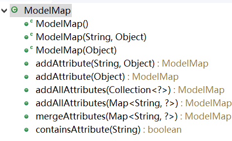
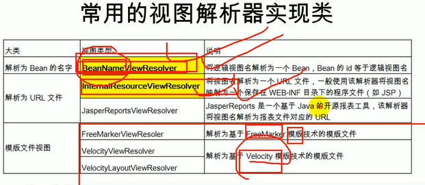
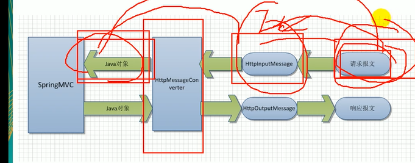

# SpringMVC(上)

> [TOC]

## 一. 简介


Spring模块划分右上角那些就是SpringMVC

### 1. 概述

`SpringMVC`是Spring为展现层提供的基于MVC设计理念的优秀web框架,是目前最主流的MVC框架之一

* 概述
  * SpringMVC通过一套<u>MVC注解</u>,让POJO称为处理请求的控制器,而无需实现任何借口

  * 支持REST风格的URL请求
  * 采用了松散耦合的可插拔组件结构,比其他MVC框架更具有拓展性和灵活性

> __POJO__: Plain Old Java Object普通的java对象

### 2. Spring的MVC: 前端控制器


MVC都是它原来的样子,多了一个__前端控制器__

* 负责把请求转给相应的控制器
* 负责把数据模型经过视图渲染(即填充模板)派发给相应的view

## 二. 简单HelloWorld

### 1. 导包


### 2. 配置

* __前端控制器__配置

  * 前端控制器本质是一个**拦截所有请求的Servlet**

  * web.xml配置:

    在eclipse的web.xml中直接输入dispatcherservlet然后索引回车就能生成

  * 生成的前端控制器(front controller)配置:

```xml
<!-- The front controller of this Spring Web application, responsible for handling all application requests -->
	<servlet>
		<servlet-name>springDispatcherServlet</servlet-name>
		<servlet-class>org.springframework.web.servlet.DispatcherServlet</servlet-class>
		<init-param>
            <!-- 指定Spring(mvc)配置文件位置,需要修改 -->
			<param-name>contextConfigLocation</param-name>
			<param-value>location</param-value>
            <!--<param-value>classpath:springmvc.xml</param-value>-->
		</init-param>
        <!-- 当开启时加载,值越小优先级越高 -->
		<load-on-startup>1</load-on-startup>
	</servlet>

	<!-- Map all requests to the DispatcherServlet for handling -->
	<servlet-mapping>
		<servlet-name>springDispatcherServlet</servlet-name>
        <!-- 映射也要改,改成/不会拦截jsp请求,/*会 -->
		<url-pattern>/</url-pattern>
	</servlet-mapping>
```

* spring配置: 暂且只用扫描组件

### 3. 编写控制器

`@Controller`注解可以在SpringMVC中标识哪个组件能作为控制器

所以不能乱加(之前介绍Spring注解加容器的时候提过这个注解)

```java
@Controller
public class MyController {

}

```

然后使用`@RequestMapping(参数)`指定哪个方法处理哪个请求,传入请求的url路径,绝对路径从项目下开始

```java

@Controller
public class MyController {
	@RequestMapping("/hello")
	public void myfirstRequest() {
		
	}
}
```

用return语句<u>转发</u>页面,返回当前路径即可转发

```java
@RequestMapping("/hello")
	public String myfirstRequest() {
		System.out.println("ooo");
		return "/page/success.jsp";
	}
```

### 4. 简单配置视图解析器

可以简化路径字符串的编写

```xml
<bean class="org.springframework.web.servlet.view.InternalResourceViewResolver">
		<property name="prefix" value="/page"></property>
		<property name="suffix" value=".jsp"></property>
</bean>
```


```java
return "/page/success.jsp";
return "success";
```


### 5. 流程分析

1. 客户端发送请求,来到tomcat服务器
2. SpringMVC前端控制器收到所有请求
3. 根据RequestMapping标注进行匹配找到处理方法
4. 用反射执行方法,结束后有一个返回值,由SpringMVC进行视图解析器<u>拼串</u>并<u>转发</u>

### 6. 细节补充

1. RequestMapping的value就算不加`/`也默认是项目路径开始

2. 如果不用init-param参数指定配置文件位置,默认的文件是

   `/WEB-INF/servlet的名字(servlet-name)-servlet.xml`

   ```java
   <init-param>
   	<param-name>contextConfigLocation</param-name>
   	<param-value>classpath:applicationContext.xml</param-value>
   </init-param>
   ```

3. url-pattern: 注意到tomcat的web.xml中配置了DefaultServlet处理静态资源, 若我们的servlet配/,则会"重写"/的使用,导致静态资源无法被正常获取; 对于jsp是JSPServlet处理的,用`/`处理不到,而`/*`能处理

> 后面补充: 使用\<mvc:default-servlet-handler\>来解决静态资源的获取问题

## 三. RequestMapping

### 1. 简介

`@RequestMapping`注解为控制器指定可以处理哪些url请求

在<u>类定义</u>和<u>方法定义处</u>都可以使用

无论开头是不是/,都看作绝对路径

参数有<u>method,params,headers,consumes,produces</u>

> 针对两个方法指向同一个映射会报错

### 2. 在类上使用

在类上使用类似于base标签的效果,绝对路径的位置会进行修改

```java
@Controller
@RequestMapping("/haha")
public class RequestMappingController {
	
	@RequestMapping("/handle01")
    //管理localhost:.../项目/haha/handle01
	public String handle01() {
		System.out.println("aaa");
		return "success";
		
	}
}
```

### 3. 规定请求方式

使用RequestMapping的`method`参数,类型为`RequestMethod[]`枚举类数组

RequestMethod取值: (默认全接受)


* 比如我们想限定只能用post请求

  ```java
  @RequestMapping(value="handle02",method=RequestMethod.POST)
  public String handle02() {
  	System.out.println("bbb");
  	return "success";
  }
  ```

  然后用GET请求就会这样,405错误: 方式不允许


### 4. 规定请求参数

没有自己想要的请求参数(名)就不给访问(__报404__)

使用RequestMapping注解的`params`参数标注,类型是`String[]`

* 可以用花式的表达式规定请求参数

```java
params="username"  // 必须带名字叫username的参数
params="!username" // 不许不带名字叫username的参数
params="username=123" // 带username还必须是123
params="username!=123" // username必须不是123,也可以不带(就是null)
params={"usename=123","pwd","!age"} // 三个同时满足才能访问
```

### 5. 规定请求头

使用headers参数,用法其实跟params一模一样,规定键值对

### 6. 剩下的参数

consumes: 只接受内容类型是哪种的请求,限定响应的Content-Type

produces: 告诉浏览器返回的Content-type是啥

### 7. 模糊匹配(Ant风格url)

Ant是自动化构建工具,SpringMVC借鉴了它的路径匹配方式

多个匹配情况下精确优先

* 通配符:
  * 精确度从上到下递减
  * `?`: 匹配一个字符,不会匹配路径符
  * `*`: 匹配任意0或多个字符,或一层路径
  * `**`: 替代多层路径

### 8. 模糊匹配 + 获取占位符实值(@PathVariable注解)

还可以使用placeholder占位符,用变量来替代url中的内容,语法`{变量名}`

> 只能占一层路径

```java
@RequestMapping("/user/{id}")
@RequestMapping("/user/a{id}")
```

好处是在方法中可以作为参数传递进来,依靠`@PathVariable`注解

```java
@RequestMapping("/user/a{id}")
public String pathVar(@PathVariable("id")String id) {
    //注解的value参数值为占位符名
	return "success";
}

@RequestMapping(value="/book/{id}")
public String addBook(@PathVariable("id")Integer id) {}//转换成Integer
```

## 四. Rest风格

### 1. 是什么

`REST`即 资源(Resources),表现层(Representation),状态转化(State Transfer)的合成词,合起来说就叫__资源表现层状态转化__.是当前流行的一种互联网软件架构

> 资源: 我们认为网络上的一个实体,就信息都是一种资源,URI是资源独一无二的标识符. 
>
> 表现层: 将资源具体呈现出来的方式,比如txt,xml,html,json
>
> 状态转化: 每发出一次请求都是客户端和服务器的交互过程. HTTP是无状态协议,状态保存在服务端. 如果客户端想要操作服务器就应该通过某种手段让服务器端发生状态转化.
>
> 
>
> 对资源的增删改查: **POST,DELETE,PUT,GET**四种请求方式对应着对资源的**增删改查**,而不由url的内容决定

综上,REST的思想就是:

1. 用非常简洁的URL地址来发送请求
2. 增删改查的操作类型由请求方式决定

* 旧思想url

  ```
  /getBook?id=1 : 查询图书
  /updateBook?id=1 : 更新图书
  /deleteBook?id=1 : 删除图书
  /addBook          : 添加图书
  ```

* REST思想url

  ```
  /资源名/资源标识符
  /book/1  GET: 查询图书
  /book/1  PUT: 更新图书
  /book/1  DELETE: 删除图书
  /book  POST: 添加图书
  ```

### 2. 简单的实现

我们从页面上只能发GET和POST,另外两个发不出来

* 我们来一个简单实现:
  * RequestMapping中: url一致,但是各自限定method参数
  * 这样就简单实现了REST思想

```java
public class BookController {

	@RequestMapping(value = "/book/{id}",method=RequestMethod.GET)
	public String getBook(@PathVariable("id") Integer id) {
		...
	}

	@RequestMapping(value = "/book/{id}",method=RequestMethod.PUT)
	public String updateBook(@PathVariable("id") Integer id) {
	...
	}

	@RequestMapping(value = "/book/{id}",method=RequestMethod.DELETE)
	public String deleteBook(@PathVariable("id") Integer id) {
		...
	}
	@RequestMapping(value = "/book",method=RequestMethod.POST)
	public String addBook() {
		...
	}
}
```

### 3. DELETE和PUT

1. SpringMVC中有一个Filter可以把普通请求转化为规定形式的请求

   `HiddenHttpMethodFilter`

```xml
<filter>
		<filter-name>hidden</filter-name>
		<filter-class>org.springframework.web.filter.HiddenHttpMethodFilter</filter-class>
	</filter>
	<filter-mapping>
		<filter-name>hidden</filter-name>
		<url-pattern>/*</url-pattern>
	</filter-mapping>
```

2. 按照以下要求: 创建一个post类型的表单,携带一个名为`_method`的参数,值中指定请求方式即可

```html
<form action="book" method="post">
		<input name="_method" value="delete"> 
		<input type="submit" value="-+1"/>
</form>
```

3. 如果不行就在转发的页面把isErrorPage设为true

## 五. 请求处理

### 1. 获取请求参数

寻找SpringMVC中request.getParameter的等价操作

* <u>默认</u>:  用方法参数接收

比如访问`.../handle01?username=tom`,就在方法中放一个同名参数

```java
@RequestMapping("/handle01")
	public String nihao(String username) {
		System.out.println(username); // tom,不带就是null
		System.out.println("hello");
		return "success";
	}
```

* <u>拓展</u>: 使用`@RequestParam`指定请求参数名,而不是形参名指定

  

  ```java
  @RequestMapping("/handle01")
  	public String nihao(@RequestParam("username")String user) {
  		System.out.println(user);
  		System.out.println("hello");
  		return "success";
  	}
  ```

* RequestParam的参数

  * **value**: 要获取的参数的key
  * **required:** boolean,指定是否一定需要(默认true),如果需要还没有带就抛`400 – Bad Request`
  * **defaultValue**: 默认值,用了这个required就没有用了

```java
//实例(感觉好长)
public String nihao(@RequestParam(value="username",required = true,defaultValue = "啊啊啊")String user) {
```

### 2. 获取请求头的值

寻找SpringMVC中request.getHeader的等价操作

* 操作: 也是用一个方法参数接收,使用`@RequestHeader`注解

```java
public String nihao(
			@RequestHeader("User-Agent") String userAgent) {
```

* **value**: 要获取的参数的key
* **required:** boolean,指定是否一定需要(默认true),如果需要还没有带就抛`500 – Internal Server Error`
* **defaultValue**: 默认值,用了这个required就没有用了

### 3. 获取某个Cookie的值

寻找SpringMVC中Cookie [] request.getCookies的等价操作

跟前面一样,方法参数 + `@CookieValue`注解 + 三个参数

```java
public String nihao(@CookieValue("JSESSIONID")String js) {
```

* **value**: 要获取的参数的key
* **required:** boolean,指定是否一定需要(默认true),如果需要还没有带就抛`500 – Internal Server Error`
* **defaultValue**: 默认值,用了这个required就没有用了

### 4. 获取POJO(封装bean)

寻求webUtils把request参数封装成bean的等价工具

* 还是使用方法参数,SpringMVC会自动封装
  * 参数键名和bean的属性名必须对应
  * 默认情况下 类型必须能转换,不然报500

```java

@RequestMapping("book")
	public String getBook(Book book) {
		System.out.println(book);
		return "success";
	}
```

* 级联封装

  * bean中的bean也能进行封装,不过对于参数的名有要求

  * 请求参数取名用`属性名.属性名`,以此类推

  * 比如Book中有Address add属性,则对add的属性赋值就需要这样

    ```html
    省:<input name="add.province">
    市:<input name="add.city">
    街道:<input name="add.street">
    ```

  * 就可以达到级联赋值的效果

### 5. post请求的乱码

Spring也给你弄了个Filter来请求乱码`CharacterEncodingFilter`

其他都一样,不过你可以在filter中用init-param中设置encoding参数的值(指定字符集)

还可以指定forceEncoding为true告诉它响应也设置这个字符集(但没设置mime type)

> 注意: 这个filter应当设置在配置的第一个,否则可能被人抢先使用request

```xml
<filter>
		<filter-name>chara</filter-name>
		<filter-class>org.springframework.web.filter.CharacterEncodingFilter</filter-class>
		<init-param>
			<param-name>encoding</param-name>
			<param-value>utf-8</param-value>
		</init-param>
        <init-param>
			<param-name>forceEncoding</param-name>
			<param-value>true</param-value>
		</init-param>
	</filter>
	<filter-mapping>
		<filter-name>chara</filter-name>
		<url-pattern>/*</url-pattern>
	</filter-mapping>
```


## 额外. SpringMVC使用原生Servlet API

### 1. 想要session和request

写在方法参数里就自己给你了

```java
@RequestMapping("handle05")
public String handle03(HttpSession session,HttpServletRequest request) {
	session.setAttribute("user", "haha");
	request.setAttribute("name", "ahaah");
	return "success";
}
                                         
```

### 2. 其他能传的东西

```
HttpServletRequest
HttpServletResponse
HttpSession // 都能传

Principal,Locale
InputStream,OutputStream,Reader,Writer // 各种流
```

# SpringMVC(中)

## 六. 数据输出

探究将数据带给页面的方式,不用原生api

### 1. Map,Model,ModelMap

给方法传入Map,Model,ModelMap中任一类型的参数,它们保存的键值对也会被放在<u>域对象</u>中,可以被页面获取

* __放在哪个域对象中:__ 放在`request`域对象中

1. Map的使用: 简单易懂

```java
@RequestMapping("handle01")
public String haha(Map<String,Object> map) {
	map.put("msg","你好");//request中就有msg键值对了
	return "success";
}
```

2. <u>Model</u>传数据的使用:

* Model是Spring定义的一个接口
* 方法:

~~看方法名都挺好懂的~~

```java
@RequestMapping("handle02")
	public String haha1(Model model) {
		model.addAttribute("msg", "ninini");//在数据传输中和map用法差不多
		return "success";
	}
```

3. <u>ModelMap</u>传数据的使用

ModelMap是一个类

* 方法:

在数据传输的基础用法上和其他两个一模一样

---

#### 1.0 Map,ModelMap,Model的关系

不管你参数是Map,Model,ModelMap,最终传入的都是`BindingAwareModelMap`类型的参数

相当于这个类型参数保存的东西都会被放在Request域中

* 三者关系
  * 

### 2. 返回值ModelAndView

可以通过返回`ModelAndView`类型的对象来向页面传送数据

还是放在request中

* 创建对象: ModelAndView是一个类,可以直接new

  * 传入参数: 第一个参数view是字符串,将原来的返回值填入(要转发的页面)

    * 第二个参数是个map,可以初始化一定的键值对,也可以不传

    ```java
    ModelAndView mv = new ModelAndView("success");
    ```

* 添加键值对

  ```java
  mv.addObject("msg","o");
  ```

* 返回

```java
@RequestMapping("handle03")
	public ModelAndView haha2() {
		ModelAndView mv = new ModelAndView("success");
		mv.addObject("msg","o");
		return mv;
	}
```

### 3. 给session保存数据(过时)

使用注解`@SessionAttributes`

1. 应当**标在控制器类**上
2. value的类型是String数组含义是:
   * 指定键名,如果这样的键名有通过BindingAwareModelMap或者返回值向Request存数据,那同时也给Session存一份
3. types参数的类型是Class数组,含义是:
   * 键值对的value的类型只要是types中的一员就会保存(无视注解的value参数)

> SessionAttributes会引发异常,我们推荐用__原生api__

### 4. @ModelAttribute(有点过时)

#### 4.1 使用场景

* 页面端: 显示要修改的图书信息,图书所有字段都在修改范围内

* servlet收到修改请求调用dao,会update数据库中的所有字段

* 但是实际场景并不可能是全字段修改,可能传过来一个null,这个就不要更新了

  > 比如对于用户修改: usrname,password,email只有后面两个会改,username一般不让改

但sql又是写好的全字段,怎么动态的使用呢

#### 4.2 SpringMVC提供的方案

> 思想: 
>
> 先取出数据库里的对应id(主键)数据用bean封装上. 
>
> 然后如果请求带了就覆盖,没带就用原来的值.
>
> 思想与实践之间:
>
> 我们不要springmvc传入自己new(配容器)的新封装对象,我们从一个方法中先从数据库取出对象,然后再给mvc封装

`@ModelAttribute`可以标在方法和参数上

* <u>在方法</u>: 这个方法会提前于目标方法先运行,所以我们可以在这里提前查出数据库里的信息并封装
  * 我们在这个方法参数中传入map,model,modelmap,然后把查到的bean放进去
* 然后在参数上用: 在参数上用并传入键名,告诉SpringMVC我在ModelAttribute中已经创建了对象,你从中间直接取用并封装即可,不需要new一个

#### 4.3 原理

* <u>ModelAttribute传入的参数BindingAwareModelMap</u>和<u>请求方法 传入的参数BindingAwareModelMap</u>是同一个map

这个map被称为`隐含模型`,陪伴处理请求全程

## 七. 源码(1)

### 1. 前端控制器DispatcherServlet

#### 1.1 继承树


#### 1.2 请求流程

1. 进入**doGet/doPost**,在FrameworkServlet中重写

   ```java
   protected final void doGet(HttpServletRequest request, HttpServletResponse response)throws ServletException, IOException {
   		processRequest(request, response);
   	}
   //都是processRequest
   protected final void doPost(HttpServletRequest request, HttpServletResponse response)throws ServletException, IOException {
   
   		processRequest(request, response);
   	}
   ```

2. **processRequest**处理请求

```java
protected final void processRequest(HttpServletRequest request, HttpServletResponse response)throws ServletException, IOException {
//...一堆准备
	try {
		doService(request, response);//大概这个核心方法
	}
    catch...{
        //catch块们
    }finally {
        	//清理
    }
}
```

3. **doService**由DispatcherServlet实现

```java
@Override
	protected void doService(HttpServletRequest request, HttpServletResponse response) throws Exception {
		//这里是日志

		// Keep a snapshot of the request attributes in case of an include,
		// to be able to restore the original attributes after the include.
		Map<String, Object> attributesSnapshot = null;
		//往请求域中放一些东西

		FlashMap inputFlashMap = this.flashMapManager.retrieveAndUpdate(request, response);
		//再放一些东西

		try {
			doDispatch(request, response);//核心
		}
		finally {
			//清理工作
		}
	}
```

4. **doDispatch**由DispatcherServlet实现

```java
protected void doDispatch(HttpServletRequest request, HttpServletResponse response) throws Exception {
	HttpServletRequest processedRequest = request;
	HandlerExecutionChain mappedHandler = null;
	boolean multipartRequestParsed = false;
    
	WebAsyncManager asyncManager = WebAsyncUtils.getAsyncManager(request);

	try {
		ModelAndView mv = null;
		Exception dispatchException = null;
		try {
            
            //检查是否文件上传请求,包装成新request1
			processedRequest = checkMultipart(request);
			multipartRequestParsed = processedRequest != request;

			// Determine handler for the current request.
            //决定哪个控制器处理请求
			mappedHandler = getHandler(processedRequest);
			if (mappedHandler == null || mappedHandler.getHandler() == null) {
				noHandlerFound(processedRequest, response);
                //重定向或者抛异常404
				return;
			}

			// Determine handler adapter for the current request.
            //决定哪个处理类的适配器处理请求(适配器能执行该类的所有方法),类似一个反射工具
            //
			HandlerAdapter ha = getHandlerAdapter(mappedHandler.getHandler());

			// Process last-modified header, if supported by the handler.
            //获取请求方式之类的
			String method = request.getMethod();
			//...
        }
        try{
            // Actually invoke the handler
            //适配器调用处理方法(控制器/处理器),返回一个ModelAndView
			mv = ha.handle(processedRequest, response, mappedHandler.getHandler());
            
        }
		finally {
			//...
		}
        //设置默认视图名...
    }catch(){}
            //转发到页面
			processDispatchResult(processedRequest, response, mappedHandler, mv, dispatchException;
        }
		catch (){//...
        }
		finally {
		//....	
		}
	}
```

#### 1.3 请求方法调用

doDispatch中:

```java
HandlerExecutionChain mappedHandler = null;//处理器调用链
mappedHandler = getHandler(processedRequest);//根据当前地址找到处理这个请求的方法
HandlerAdapter ha = getHandlerAdapter(mappedHandler.getHandler());//根据当前处理器类获取到能执行这个处理器方法的适配器,AnnotationMethodHandlerAdapter

//适配器调用处理方法(控制器/处理器),返回一个ModelAndView
mv = ha.handle(processedRequest, response, mappedHandler.getHandler());
```

* `getHandler(HttpServletRequest)`方法: 
  * 返回值为处理器调用链, 除了handler还封装了好多**拦截器**
  * 内容: 遍历并获取HandlerMapping,取得url和方法键值对
    * handlerMappings有两个元素,第一个bean的不太常用,第二个是注解的,一般只看这个注解的
    * handlermapping存着**\<url,控制器对象\>键值对**和__\<控制器对象,方法\>__键值对/或者__<url,控制器对象\>键值对__(根据类的不同),精准测控
    * 然后用hm找,找不到就null,找到了就返回

```java
for (HandlerMapping hm : this.handlerMappings) {
	if (logger.isTraceEnabled()) {
		logger.trace("Testing handler map [" + hm + "] in DispatcherServlet with name '" + getServletName() + "'");
	}
	HandlerExecutionChain handler = hm.getHandler(request);
	if (handler != null) {//找到了就不为空
		return handler;
	}
}
```

* `getHandlerAdapter()`方法:
  * 拿到处理器的适配器,传入的是目标处理器对象
  * 就这个:

```java
for (HandlerAdapter ha : this.handlerAdapters) {//内有HttpRequest处理适配器,注解适配器,controller适配器
			if (logger.isTraceEnabled()) {
				logger.trace("Testing handler adapter [" + ha + "]");
			}
			if (ha.supports(handler)) { // 如果适配器支持handler就返回,不然就接着,最后抛异常
				//支持: 就是说是不是实现类,比如Http那个需要是HttpRequestHandler的实现类
                //现在基本都是注解了,如果处理器里面没有方法先pass掉,如果有方法就会适配
                return ha;
			}
		}
		throw new ServletException("No adapter for handler [" + handler +
				"]: The DispatcherServlet configuration needs to include a HandlerAdapter that supports this handler");
	}
```

* 执行方法:
  * 就是先返回值封装成ModelAndView
  * 然后processDispatchRequest转发
  * 下面再讲

### 2. SpringMVC九大组件

出自DispatcherServlet的属性,SpringMVC的关键行为都是由这些组件完成的

属性的类型全是`接口`

```java
//文件上传,多部件请求
private MultipartResolver multipartResolver;
//国际化,locale解析器
private LocaleResolver localeResolver;
//主题效果解析器,没人用
private ThemeResolver themeResolver;
//处理器映射
private List<HandlerMapping> handlerMappings;
//处理器适配器
private List<HandlerAdapter> handlerAdapters;
//处理器异常解析器
private List<HandlerExceptionResolver> handlerExceptionResolvers;
//请求到视图名的转换,不用了解
private RequestToViewNameTranslator viewNameTranslator;
//flashMap manager,重定向携带数据
private FlashMapManager flashMapManager;
//视图解析器list,比如InternalResourceViewResolver
private List<ViewResolver> viewResolvers;

```

* 九大组件的初始化

  * onRefresh是专门给子类实现的方法,在它的父类中是初始化的一个空实现,Spring的ApplicationContext中也有同名方法

    ```java
    @Override
    protected void onRefresh(ApplicationContext context) {
    	initStrategies(context);
    }
    ```

  * 一目了然

    ```java
    protected void initStrategies(ApplicationContext context) {
    		initMultipartResolver(context);
    		initLocaleResolver(context);
    		initThemeResolver(context);
    		initHandlerMappings(context);
    		initHandlerAdapters(context);
    		initHandlerExceptionResolvers(context);
    		initRequestToViewNameTranslator(context);
    		initViewResolvers(context);
    		initFlashMapManager(context);
    	}
    ```

  * 挑两个看看

    * 有些组件用类型找,有些用id找

    ```java
    private void initMultipartResolver(ApplicationContext context) {
    	try {
    		this.multipartResolver = context.getBean(MULTIPART_RESOLVER_BEAN_NAME, MultipartResolver.class);//从容器getBean
    		//...然后记录日志,省略
    	}
    	catch (NoSuchBeanDefinitionException ex) {
    		// Default is no multipart resolver.
    		//找不到bean就设置null
    	}
    }
    ```

    ```java
    private void initHandlerMappings(ApplicationContext context) {
    		this.handlerMappings = null;
    
    		if (this.detectAllHandlerMappings) {//默认true,可以用init-param修改
    			Map<String, HandlerMapping> matchingBeans =
    					BeanFactoryUtils.beansOfTypeIncludingAncestors(context, HandlerMapping.class, true, false);//从容器中找相应类型(包括父类)的bean,搞成map并使用
    			if (!matchingBeans.isEmpty()) {
    				this.handlerMappings = new ArrayList<HandlerMapping>(matchingBeans.values());//把map里的东西都取出来
    				// We keep HandlerMappings in sorted order.排序
    				OrderComparator.sort(this.handlerMappings);
    			}
    		}
    		else {//不检测所有handlermapping
    			try {
    				HandlerMapping hm = context.getBean(HANDLER_MAPPING_BEAN_NAME, HandlerMapping.class);//在容器里找指定id的
    				this.handlerMappings = Collections.singletonList(hm);
    			}
    			catch (NoSuchBeanDefinitionException ex) {
    				// Ignore, we'll add a default HandlerMapping later.
    			}
    		}
       		 if (this.handlerMappings == null) {
    			this.handlerMappings = getDefaultStrategies(context, HandlerMapping.class);//空就弄一个默认的,从DispatcherServlet类路径下的DispatcherServlet.properties加载进来(去jar包里看得到)
    			if (logger.isDebugEnabled()) {
    				logger.debug("No HandlerMappings found in servlet '" + getServletName() + "': using default");
    			}
    		}
    }
    
    ```

    

### 3. 请求方法调用

```java
public ModelAndView handle(HttpServletRequest request, HttpServletResponse response, Object handler)
			throws Exception {

		Class<?> clazz = ClassUtils.getUserClass(handler);//获取调用对象的真正类型
		//....先检查有没有sessionAttributes,然后设置缓存

		// Execute invokeHandlerMethod in synchronized block if required.
		if (this.synchronizeOnSession) {//判断session锁
			HttpSession session = request.getSession(false);
			if (session != null) {
				Object mutex = WebUtils.getSessionMutex(session);
				synchronized (mutex) {
					return invokeHandlerMethod(request, response, handler);
				}
			}
		}

		return invokeHandlerMethod(request, response, handler);//核心执行
	}
```

* `invokeHandlerMethod(request, response, handler)`

```java
protected ModelAndView invokeHandlerMethod(HttpServletRequest request, HttpServletResponse response, Object handler)
			throws Exception {
		//获取方法解析器
		ServletHandlerMethodResolver methodResolver = getMethodResolver(handler);
    	//获取对应方法
		Method handlerMethod = methodResolver.resolveHandlerMethod(request);
    //再来个方法调用器
		ServletHandlerMethodInvoker methodInvoker = new ServletHandlerMethodInvoker(methodResolver);
    //把reqeust和response都包装上
		ServletWebRequest webRequest = new ServletWebRequest(request, response);
	//	重点: BindingAwareModelMap,隐含模型
    	ExtendedModelMap implicitModel = new BindingAwareModelMap();
	//重点: 调用方法并获得返回值
		Object result = methodInvoker.invokeHandlerMethod(handlerMethod, handler, webRequest, implicitModel);
    //将返回值封装成ModelAndView
	ModelAndView mav =methodInvoker.getModelAndView(handlerMethod, handler.getClass(), result, implicitModel, webRequest);
	methodInvoker.updateModelAttributes(handler, (mav != null ? mav.getModel() : null), implicitModel, webRequest);
		return mav;
	}
```

* 

```java
public final Object invokeHandlerMethod(Method handlerMethod, Object handler,
			NativeWebRequest webRequest, ExtendedModelMap implicitModel) throws Exception {
    //先根据目标方法经过桥接获取要执行的方法
    Method handlerMethodToInvoke=BridgeMethodResolver.findBridgedMethod(handlerMethod);
	try {
        //...先日志,然后遍历SessionAttributeNames,把符合要求的域信息存入隐含模型中
        //implicitModel.addAttribute(attrName, attrValue);
            
        //获取所有有ModelAttribute的方法,先行调用
        for (Method attributeMethod:this.methodResolver.getModelAttributeMethods()) 
		Method attributeMethodToInvoke=BridgeMethodResolver.findBridgedMethod(attributeMethod);
        //也是桥接获得方法
        
        //这里解析参数
		Object[] args = resolveHandlerArguments(attributeMethodToInvoke, handler, webRequest, implicitModel);//确定每一个参数的值,包括用注解赋值的内容
        //如果为原生api就赋值,如果是model或者map旗下就赋值隐含模型
		//...这里记录日志
		}
		String attrName = AnnotationUtils.findAnnotation(attributeMethod, ModelAttribute.class).value();
	if (!"".equals(attrName) && implicitModel.containsAttribute(attrName)) {
			continue;
		}
		ReflectionUtils.makeAccessible(attributeMethodToInvoke);
		Object attrValue = attributeMethodToInvoke.invoke(handler, args);
    //利用反射执行提前的方法
		if ("".equals(attrName)) {//如果注解的value为空,把attrName设置为返回值
		Class<?> resolvedType = GenericTypeResolver.resolveReturnType(attributeMethodToInvoke, handler.getClass());
		attrName = Conventions.getVariableNameForReturnType(attributeMethodToInvoke, resolvedType, attrValue);
				}
	if (!implicitModel.containsAttribute(attrName)) {
		implicitModel.addAttribute(attrName, attrValue);
	}//ModelAttribute可以把<value-返回值>键放进去,默认方<返回类型名小写,返回值>放进隐含模型
			}
//....搞点其他事,比如获取参数,日志,setAccessible,和前面ModelAttribute的调用一样
//调用,就是先判断后反射,跟前面一样
return handlerMethodToInvoke.invoke(handler, args);
```

## 八. 视图解析

```java
<bean class="org.springframework.web.servlet.view.InternalResourceViewResolver">
		<property name="prefix" value="/WEB-INF/page/"></property>
		<property name="suffix" value=".jsp"></property>
	</bean>
```

这里用的ViewResolver就是视图解析器

### 1. 转发的注意点

1. 普通转发在处理方法的返回值处返回字符串,或者ModelAndView封装的字符串,然后根据视图解析器拼串形成转发地址并转发
2. 可以在返回的字符串中使用`forward前缀`,转发的页面就是从根目录开始的路径,不会通过视图解析器
   * 也可以根据requestmapping转发给别的处理方法

```java
@RequestMapping("hello")
	public String aaa() {
		return "forward:/hello.jsp";
	}//尽量用绝对路径
```

### 2. 重定向

用`redirect前缀`,绝对路径还是从项目下开始

### 3. 大致原理

> 在运行处理方法接收到返回值后,首先无论传了什么回来都会先封装成ModelAndView再进行处理
>
> 然后用<u>processDispatchResult</u>进行**视图渲染(render)**
>
> ```java
> processDispatchResult(processedRequest, response, mappedHandler, mv, dispatchException);
> ```
>
> 在这个方法中,首先调用render进行渲染render(mv, request, response);
>
> > **render:**
> >
> >  先用我们已经装配好的组件viewResolvers(九大组件之一)(没配置就用默认的Internal视图解析器),根据返回值的视图名称<u>获取视图/创建并获取视图</u>
> >
> > > **创建视图:** 先判断前缀,如果是重定向就创建RedirectView,如果是forward前缀就创建InterResourceView,没有前缀,就用父类的默认创建(比如用解析器拼串)
> >
> > 创建完了先放进缓存
> >
> > 然后调用了view的render方法
> >
> > > __view.render__:传入隐含模型,request,response
> > >
> > > 创建了一个String-Object映射保存隐含模型,然后渲染
> > >
> > > > **renderMergedOutputModel:**(所谓的视图渲染就是这几步),高层的render选择调用这个方法,然后让子类实现
> > > >
> > > > 转发版
> > > >
> > > > 1. 把隐含模型中的对象放进request域对象
> > > > 2. 获取转发路径和转发器(RequestDispatcher)
> > > > 3. 转发
> > > >
> > > > 重定向比较复杂,反正最后都是sendRedirect

* <u>View与ViewResolver</u>: ViewResolver是一个函数式接口,可以根据视图名返回一个View对象
* 一些视图实现类


* 一些视图解析器实现类

  

### 4. JstlView实现国际化

如果导入了taglib包(jstl),会自动把view创建成JstlView,支持快速的国际化

或者在viewResolver中使用`viewClass`属性指定

```java
<bean class="org.springframework.web.servlet.view.InternalResourceViewResolver">
		<property name="prefix" value="/WEB-INF/page/"></property>
		<property name="suffix" value=".jsp"></property>
		<property name="viewClass" value="org.springframework.web.servlet.view.JstlView"></property>
	</bean>
```

* 使用:
  * 让Spring管理国际化资源
  * 直接去页面使用\<fmt:message\>

* 具体:

  * 先按照国际化编写特定的国际化properties文件`基础名_locale.properties`

    

  * 然后去SpringMVC配置文件里让他们管理(配置资源文件管理器)

    ```xml
    <!-- 必须用messageSource作为id -->
    	<bean id="messageSource" class="org.springframework.context.support.ResourceBundleMessageSource">
    		<!-- basename指定基础名 -->
    		<property name="basename" value="i18n"></property>
    	</bean>
    ```

  * 最后去jsp页面直接使用jstl标签就可以了

* 注意点:

  * 必须过springmvc手下掌握的<u>controller</u>才能成功国际化
  * 如果使用<u>forward前缀</u>转发,创建的view是InternalResourceView,<u>不会国际化</u>

### 5. 直接将请求映射到页面


**现存的问题**: 有很多请求的处理只是返回一个字符串让服务器转发,都写成方法太浪费了

**mvc给出的方案**:

* 在spring配置文件的**mvc名称空间**下有一个请求映射标签`mvc:view-controller`

* `path属性`: 指定要处理的请求的路径(都从项目下开始)

* `view-name属性`: 值和原来转发的返回值一样

  ```java
  <mvc:view-controller path="/login" view-name="success"/>
  <mvc:annotation-driven></mvc:annotation-driven>
  ```

<span style="color:red">注意: 这个标签会让其他requestmapping失效,需要随身携带mvc:annotation-driven标签</span>

### 6. 将请求交给tomcat处理

springmvc会拦截jsp以外(配置/的条件下)所有请求,包括静态的js

我们使用spring配置中这样的组合解决

```xml
<mvc:default-servlet-handler/>
<mvc:annotation-driven></mvc:annotation-driven>
```


## 九. 表单标签

原来的表单也被springmvc简化了

通过SpringMVC的**表单标签**可以实现将模型数据中的属性和HTML元素相绑定,以实现表单数据**更便捷编辑和表单值的回显**

* 思想: 直接将表单和隐含模型中的元素绑定

### 2. 简单介绍使用

* 引入: 在jsp中使用taglib引入

```jsp
<%@taglib uri="http://www.springframework.org/tags/form" prefix="form" %>
```

* `form:form`标签 
  * 如果form:form不加action属性,就是把原来get发过来的请求再加上表单post发一遍
* `form:input`标签
  * path属性: 跟原来input的name属性一样
    * 另一个作用: 和隐含模型中的键值对关联自动回显
* 不同type的input有不同标签,比如`form:radiobutton单选框`

> 这些自结束标签结尾的斜杠一定要加

```jsp
<form:form action>
	lastName: <form:input path="lastName" /><br>
	email: <form:input path="email"><br>
	gender: 
	男: <form:radiobutton path="gender" value="1"/>
	女: <form:radiobutton path="gender" value="0"/><br>
	dept:<form:select path="depatment.id" items="${depts }"
			itemLabel="departmentName" itemValue="id">
	<!-- items指定要遍历的集合 -->
	<!-- itemLabel:指定遍历出的东西的哪一个属性作为option标签体的值 -->
	<!-- itemValue: 指定遍历出的东西哪一个属性作为提交的值 -->
	</form:select>
	<input type="submit" value="保存">
</form:form>
```

直接使用会报错:

```
java.lang.IllegalStateException: 
Neither BindingResult nor plain target object for bean name 'command' available as request attribute
```

<u>原因:</u> SpringMVC认为表单数据中的每一项最终都是要回显的,

path是一个属性,这个属性应当从请求域中取出. 所以SpringMVC希望reqeust域里有一个以command为键,并且值含有path对应属性名的属性的对象,取值并回显

```java
request.addAttribute("command",new Employee()); // 这就是个包含lastName的command
```

可以把command改成别的名字,用form:form的`modelAttribute`属性

```jsp
<form:form action="emp" modelAttribute="employee">
```

```java
model.addAttribute("employee", new Employee());
```

如果不想回显,对应属性传空串或null即可

## 十. 数据绑定

### 1. POJO绑定原理

要探索的问题:

1. 参数都是String,怎么转换
2. 数据格式化问题,比如日期等
3. 数据合法校验怎么做(前端毕竟不靠谱)

涉及的组件

`WebDataBinder`: 主负责数据绑定工作,<u>其属性</u>组件负责不同的区域

`conversionService属性`: 负责类型转换和格式化

`validators属性`: 负责数据校验工作

`bindingResult属性`: 封装数据校验的错误

### 2. 自定义的类型转换

WebDataBinder中的ConversionService中已经包含了String到各种JDK自带类型的转换(converters)

我们想通过ConversionService把字符串直接转换成自定义类型对象

```java
public String quickAdd(@RequestParam("empinfo")Employee employee){
   
}
```

* 创建ConversionService的流程

  > ConversionServiceFactoryBean从外界获取converters
  >
  > > createConversionService创建对象:
  > >
  > > DefaultConversionService创建并给自己注册默认的converters
  >
  > > afterPropertiesSet: 当设置了新的converters以后,将converters注册进ConversionService


* 自定义类型转换器的使用

  * 首先实现`Converter<S,T>`接口(将S类型转换成T类型)

    * 是函数式接口,只有convert需要重写,参数为S类型,返回值T类型

    ```java
    @Override
    	public Employee convert(String source) {
    		// TODO Auto-generated method stub
    		return null;
    	}
    ```

  * 然后把Converter放进ConversionService中

    1. 配置ConversionServiceFactoryBean(因为是FactoryBean,所以能直接获取到getObject的返回值即ConversionService)

       ```xml
       <bean class="org.springframework.context.support.ConversionServiceFactoryBean" id="cons">
       		<property name="converters">
       			<set>
                       <!-- 在这里塞进自己写的Converter们 -->
       				<bean class="com.at.component.MyStringToEmployeeConverter"></bean>
       			</set>
       		</property>
       	</bean>
       ```

    2. 然后在mvc:annotation-driven中用`conversion-service`属性告诉springmvc应该用哪个

       ```xml
       <mvc:annotation-driven conversion-service="cons"></mvc:annotation-driven>
       ```

### 3. mvc:annotation-driven

  标签的作用:

> 1. 九大组件中的`RequestMappingHandlerMapping`,`RequestMappingHandlerAdapter`和`ExceptionHandlerExceptionResolver`三个bean会加入容器
> 2. 支持使用ConversionService自定义类型转换
> 3. 支持使用@NumberFormat annotation,@DateTimeFormat注解完成数据类型的格式化
> 4. 支持使用@Valid注解对JavaBean实施JSR 303校验
> 5. 支持使用@RequestBody和@ResponseBody注解

#### 3.1 探究1

所有的配置都是通过BeanDefinitionParser接口的实现类来读取的,我们这里的主角就是`AnnotationDriverBeanDefinitionParser(web下)`,包括dom4j的行为都在这里

```java
public BeanDefinition parse(Element element, ParserContext parserContext) {
```

####  3.2 场景 

* 我们使用\<mvc:default-servlet-handler\>让tomcat处理静态资源,但动态资源都亡了
* 这时我们使用annotation-driven标签,就解决了

解析:

1. 没有加两者的时候的handlerMapping: DefaultAnnotationHandlerMapping在处理所有请求,没有保存静态资源映射的请求

   handlerAdapter:AnnotationMethodHandlerAdapter在执行

   

2. 加入default-servlet-handler的handlerMapping: `simpleUrlHandlerMapping`在处理,将所有请求全部交给tomcat,但DefaultAnnotation都没了

   handlerAdaptor: SimpleControllerHandlerAdapter

   
   
3. 再加上annotation-driven: 加上了`RequestMappingHandlerMapping`(标签对应创建的组件),第一位匹配,保存每个请求的信息和映射(urlMap,handlerMethods)

   适配器:`RequestMappingHandlerAdapter`,隐含模型换成了ModelAndViewContainer,用解析器解析参数

> 因为这个标签把Adaper和Mapping都换掉了,所以之前用的那两个其实都过时了@deprecate

### 4. 日期时间格式化

要求: 我们想要特定的日期格式

对应解决方案: `@DateTimeFormat`

* 注解加在: bean的属性上
* 告知格式: 用pattern参数,格式跟SimpleDateFormat的字符串一样

一些注意点:

* 如果自己<u>配置了ConverionService</u>,ConversionServiceFactoryBean就不会帮你把Formatter放进Converter中
  * 解决方案: 把ConversionServiceFactoryBean换成`FormattingConversionServiceFactoryBean`,它拥有converters和formatters属性(都是set),但是formatters通过注解自动加入了,所以只需要配置converters


### 附. 数字格式化

@NumberFormat注解,参数和上面DateTimeFormat一样

```java
@NumberFormat(pattern="#,###,###.##")
private Double salary
```

## 十一. 数据校验

前端验证显然不安全,后端肯定要校验

### 1. JSR303数据校验

`JSR(JavaSpecification Requests)`<u>Java规范提案,</u>它的第303条是Java为bean数据合法性校验提供的标准框架,包含在JavaEE6.0中

| 注解                          | 含义                          |
| ----------------------------- | ----------------------------- |
| **@Null**                     | 必须是null                    |
| **@NotNull**                  | 必须不是null                  |
| **@AssertTrue**               | 必须为true                    |
| **@AssertFalse**              | 必须为false                   |
| **@Min(value)**               | 必须是数字,并且大于等于最小值 |
| **@Max(value)**               | 必须是数字,小于等于最大值     |
| **@DecimalMin(value)**        | 浮点版最小值                  |
| **@DecimalMax(value)**        | 浮点版最大值                  |
| **@Size(max,min)**            | min<=x<=max                   |
| **@Digits(integer,fraction)** |                               |
| **@Past**                     | 必须是过去的一个日期          |
| **@Future**                   | 必须是将来的一个日期          |
| **@Pattern(value)**           | 必须符合指定正则表达式        |
|                               |                               |

JSR303通过在__Bean属性上标注注解__来进行规范,比如`@NotNull`这种

| 注解      |                     |
| --------- | ------------------- |
| @Email    | 字符串为email格式   |
| @Length   | 长度在指定范围      |
| @NotEmpty | 不能为""            |
| @Range    | 元素在合适的范围内? |
|           |                     |

当前JSR303的实现主要有**Hibernate Validator**,它还加了几个注解

### 2. SpringMVC和JSR303结合

* 步骤

  1. 导入校验框架jar包`hibernate-validator-5.0.0`(和他的依赖们)

     

     

  2. 给bean的属性添加注解

     ```java
     @NotEmpty
     @Length(max = 18,min = 6)
     private String lastName;
     	
     @Email
     private String email;
     
     @DateTimeFormat(pattern = "yyyy-MM-dd")
     @Past
     private Date birth;
     ```

  3. 告诉springMVC要校验的东西,用`@Valid`注解在参数上

     ```java
     public String add(@Valid Employee employee) {
     ```

  4. 获取校验结果

  * 在要校验的参数后面__紧跟__一个BindResult参数封装校验结果

    ```java
    public String add(@Valid Employee employee,BindingResult result) {
    ```

  * 用result的方法在请求方法体内使用

> 但是我tomcat版本太高,都不知道哪里冲突
>

* 使用form:errors path="对应名字"/ 就能在页面上显示错误信息

### 3. 原生表单显示错误信息

使用List<FieldError\> errors = result.getFieldErrors();获取错误的字段,和信息提示,然后放到域对象或者model里面去页面显示

### 4. 返回信息的国际化

hibernate validation自带的错误都制定了国际化,我们自己的错误想定制还要加国际化

1. 写国际化文件`基础名_locale.properties`

2. 国际化文件中的key有规定:

   > 每一个字段发生错误以后都会有错误代码codes,<u>国际化文件中错误信息的key</u>必须对应一个错误代码
   >
   > 从上到下,从精确到模糊
   >
   > > 校验规则.隐含模型中对象key.对象的属性
   > >
   > > 校验规则.属性名 (校验所有对应属性名)
   > >
   > > 校验规则.类型      (校验所有对应类型)
   > >
   > > 校验规则

3. 让springMVC管理国际化文件

```xml
<!-- 必须用messageSource作为id -->
	<bean id="messageSource" class="org.springframework.context.support.ResourceBundleMessageSource">
		<!-- basename指定基础名 -->
		<property name="basename" value="errors"></property>
	</bean>
```

4. 用form:errors 自己就国际化/自定义了

取参数: 可以在properties中写{0}{1}这种,mvc会自己填充

{0} : 属性名

{1}: 注解的1号参数

{2}: 注解的2号参数(按照字母顺序排号)

...

> 或者直接在数据校验注解配置message参数,不过不能国际化

# SpringMVC(下)

## 十二. 请求报文和响应报文

### 1. ajax请求的特殊之处

ajax的请求跟普通页面请求的不同之处在于,ajax收到的响应更倾向于**json**

并且不太会有请求的重定向或转发

所以我们让springmvc帮我们解决json解析问题

### 2. 发送json步骤(响应体注解)

导包


然后写请求方法: 返回一个集合并加上`@ResponseBody`注解,将返回的数据放在响应体中

它会自动通过jackson将内容转换成json

```java
@ResponseBody
@RequestMapping("/getallajax")
public Collection<Employee> ajaxGetAll(){
	Collection<Employee> all = employeeDao.getAll();
	return all;
}
```

* 其他
  * `@JsonIgnore`加在bean的属性上,在jackson封装json的时候就不会将其封装进
  * `@JsonFormat`加再bean的属性上,参数pattern可以写日期格式化内容

> 如果返回的是字符串,就是往响应体里写字符串,字符串写html标签浏览器就会解析

### 3. 接收json步骤(请求体注解)

1. 获取请求体 使用`@RequestBody`注解,接收json字符串

   ```java
   public void ajaxPostAll(@RequestBody String body) {
   ```

2. RequestBody接收json数据并封装进bean:

   * 直接把参数改成对应类型,就会直接封装

### 4. 获取所有请求头

在方法参数里加入`HttpEntity<String>`类型的参数,即可获取所有请求头

泛型指的是请求体中内容类型

```java

@RequestMapping("/postAjax")
	public void ajaxPostAll(@RequestBody String body,HttpEntity<String> entity) {
		HttpHeaders headers = entity.getHeaders();
		Set<Entry<String, List<String>>> entrySet = headers.entrySet();
		System.out.println(body);
	}
```

### 5. 处理响应头

请求方法__不__加上`@ResponseBody`注解,并且返回`ResponseEntity<String>`类型可以实现定制响应头/响应体

泛型指的是响应体中内容类型

* 响应entity的构造

```java

MultiValueMap<String, String> headers; // 响应头
HttpStatus statusCode; //响应码,是枚举类
String body; //响应体
new ResponseEntity<String>(body, headers, statusCode);
```

* 响应头MultiValueMap的构造

  ```java
  //MultiValueMap是一个Map的子接口,我们取它的实现类HttpHeaders
  MultiValueMap<String, String> headers = new HttpHeaders();
  headers.add("Set-cookie", "username=aaa"); //添加头
  ```

* 整体一览

  ```java
  @RequestMapping("/postAjax")
  public ResponseEntity<String> ajaxPostAll(HttpEntity<String> entity) {
  		
  	MultiValueMap<String, String> headers = new HttpHeaders();
  	headers.add("Set-cookie", "username=aaa");
  	HttpStatus statusCode = HttpStatus.OK;
  	String body = "<h1>success</h1>";
  	return new ResponseEntity<String>(body, headers, statusCode);
  		
  }
  ```

### 6. 文件下载

javaweb中,想要下载文件就得先设置响应头`Content-Type`和`Content-Position`

```java
response.setHeader("Content-Disposition", "attachment;filename=1.jpg");
```

然后往响应体里写文件流

那我们在SpringMVC中怎么用呢(其实和web差不多)

1. 首先将响应体弄成`byte[]`

   ```java
   public ResponseEntity<byte[]> download(){
   ```

2. 用原生api获取资源的realPath

3. 写流,设置响应头(这里不能获取输出流,所以就不能用IOUtils)

```java
@RequestMapping("/Download")
	public ResponseEntity<byte[]> download(HttpServletRequest request) throws IOException{
		String location = "";
		ServletContext context = request.getServletContext();
		location = context.getRealPath("/index.jsp");
		FileInputStream is = new FileInputStream(location);
		byte[] tmp = new byte[is.available()];
		is.read(tmp);
		is.close();
		
		HttpHeaders headers = new HttpHeaders();
		headers.set("Content-Disposition","attachment;filename=1.jsp");
		return new ResponseEntity<>(tmp,headers,HttpStatus.OK);
	}
```


### 7. 大致原理

像ResponseEntity,@ResponseBody这样的请求方法的返回值就不是由视图解析器来处理了

而是由一个`HttpMessageConverter`接口来负责<u>将请求信息转换为一个对象,将对象输出为响应信息</u>

* 接口方法:

  ```java
  boolean canRead(Class<?> clazz, MediaType mediaType);
  //指定转换器可以读取的对象类型,即转换器是否可以将请求信息转换成Clazz类型的对象,同时指定支持的MIME类型
  
  boolean canWrite(Class<?> clazz, MediaType mediaType);
  //指定转换器可以将clazz类型的对象写到响应流中,和响应流支持的MIMEtype
  
  List<MediaType> getSupportedMediaTypes();
  //获取支持的MIMEType
  
  T read(Class<? extends T> clazz, HttpInputMessage inputMessage);
  //将请求信息流转换为T类型的对象,传入的第二个就是输入流
  void write(T t, MediaType contentType, HttpOutputMessage outputMessage);
  //将T类型对象写到响应流中,同时指定MIMEType,传入输出流
  //后续有supports(Class<T>)方法,判断是否支持该类型转换,然后在doDispatch处理中使用
  ```




## 十三. 文件上传

### 1. 还是要fileupload包


### 2. 还是要写form表单

```html
<form action="upload" enctype="multipart/form-data" method="post">
		头像: <form type="file" name="headerimg"></form><br>
		yonghuming: <input name="username"><br>
		<input type="submit">
</form>
```


### 3. 配置九大组件之一MultipartResolver

`MultipartResolver`是文件上传解析器接口,我们在这里使用`CommonsMultipartResolver`

id必须为multipartResolver

* 可配置的属性

  * 包括默认编码,最大上传大小,懒加载,暂时目录

  

```xml
<!-- 实例-->
<bean id="multipartResolver" class="org.springframework.web.multipart.commons.CommonsMultipartResolver">
	<property name="maxInMemorySize" value="#{1024*1024*1}"></property>
    <!-- 最大1Mb(原来的单位为字节) -->
	<property name="defaultEncoding" value="utf-8"></property>
</bean>
```

### 4. 请求方法中使用

1. 在参数中指定`MultipartFile`,获取的方式可以是参数指定也可以RequestParam:(普通的参数获取不受影响)

   ```java
   @RequestMapping("/upload")
   	public String upload(String username,
   			@RequestParam("headerimg")MultipartFile file,
   			Model model)
   ```

2. 在方法中使用MultipartFile操作上传的文件(流)

   * 获取文件信息

     ```java
     System.out.println(file.getName()); // 获取表单中的键名
     System.out.println(file.getOriginalFilename()); //获取文件名
     ```

   * 文件保存

     ```java
     file.transferTo(new File("E:\\codes\\ecssm\\aaa.jpg"));
     ```

### 5. 多文件上传

一个表单name项搞了好多个文件input会造成多文件上传,该怎么办

把参数里的MultipartFile改成MultipartFile[]就行了

然后按照数组和MultipartFile的用法使用即可

## 十四. 拦截器HandlerIntercepter

### 1. 概述

`拦截器`是升级版过滤器Filter,允许在运行目标方法运行之前进行一些拦截,在目标方法运行之后进行一些处理(其实功能大体和Filter一样)

其接口名字叫`HandlerIntercepter`

```java
//清爽版(把抛异常和注释去掉了)
public interface HandlerInterceptor {
boolean preHandle(HttpServletRequest request, HttpServletResponse response, Object handler);//请求方法处理前,返回true就放行,不然不放
    
void postHandle(HttpServletRequest request, HttpServletResponse response, Object handler, ModelAndView modelAndView);//请求方法处理之后,可以给ModelAndView修改修改
    
void afterCompletion(HttpServletRequest request, HttpServletResponse response, Object handler, Exception ex); // 整个请求完成之后(资源响应之后,已经到目标资源了)

}
```

> 当preHandle没有放行,则后面流程都失败
>
> 若放行,就算目标方法出现异常,postHandle不执行,但afterCompletion仍然执行

### 2. 单拦截器使用

1. 写一个实现HandlerInterceptor接口的拦截器

```java
public class MyFirstInterceptor implements HandlerInterceptor{
	@Override
	public void afterCompletion(HttpServletRequest arg0, HttpServletResponse arg1, Object arg2, Exception arg3)
			throws Exception {
		System.out.println("afterCompletion");
	}
	@Override
	public void postHandle(HttpServletRequest arg0, HttpServletResponse arg1, Object arg2, ModelAndView arg3)
			throws Exception {
		System.out.println("postHandle");
	}

	@Override
	public boolean preHandle(HttpServletRequest arg0, HttpServletResponse arg1, Object arg2) throws Exception {
		System.out.println("preHandle");
		return true;
	}

}
```

2. 在spring里注册拦截器,配置拦截器拦截哪些请求

   * 先写个大标签`<mvc:interceptors>`,然后在里面使用bean或者mvc:interceptor注册拦截器

     * 直接用`bean`: 使用bean标签注册,拦截所有请求
     * `mvc: interceptor`中使用bean和mvc:mapping标签,用path属性指定拦截路径

     ```xml
     <mvc:interceptors>
     		<mvc:interceptor>
     			<bean class="com.at.interceptor.MyFirstInterceptor"></bean>
     			<mvc:mapping path="/handle01"/>
     		</mvc:interceptor>
     	</mvc:interceptors>
     ```

### 3. 配置好几个拦截器

在mvc:interceptors中多配置几个即可

顺序跟配置顺序有关,进去从上到下,出来反之,跟Filter差不多,afterCompletion和postHandle顺序一样

* 不放行: 任一不放行,都会导致请求方法和post不执行,但是已经放行的会执它的afterCompletion

### 4. 流程源码

在doDispatch中,有拦截器的执行:

* **获取拦截器链:** 在dodispatch获取handler的时候就获取了

  ```java
  mappedHandler = getHandler(processedRequest);
  //返回的是handler执行chain,内部包含目标方法和拦截器
  ```

  

* **preHandle:** 就在执行方法的代码块上方有preHandle拦截器的执行

  ```java
  if (!mappedHandler.applyPreHandle(processedRequest, response)) {
  	return; // 要是不放行就直接结束
  }
  
  try {
  	// Actually invoke the handler.
  	mv = ha.handle(processedRequest, response, mappedHandler.getHandler());
  }
  ```

  applyPreHandle:

  * 逐个遍历拦截器并执行preHandle
  * 如果有拦截器不放行,就直接**倒序**触发之前放行的拦截器的AfterCompletion,并返回false
  * 如果所有拦截器放行,返回true

  ```java
  boolean applyPreHandle(HttpServletRequest request, HttpServletResponse response) throws Exception {
  		if (getInterceptors() != null) { // 获取拦截器
  			for (int i = 0; i < getInterceptors().length; i++) {//按顺序遍历拦截器
  				HandlerInterceptor interceptor = getInterceptors()[i];
  				if (!interceptor.preHandle(request, response, this.handler)) {
                      //就调用preHandle方法,不让放行就直接触发afterCompletion
  					triggerAfterCompletion(request, response, null);
  					return false;
  				}
  				this.interceptorIndex = i;//记录已经放行的最后一个索引
  			}
  		}
  		return true;
  	}
  ```

* __posthandle__: 在doDispatch中目标方法执行后,有执行post方法的语句

  ```java
  mappedHandler.applyPostHandle(processedRequest, response, mv);
  ```

  ```java
  //相当好懂
  void applyPostHandle(HttpServletRequest request, HttpServletResponse response, ModelAndView mv) throws Exception {
  		if (getInterceptors() == null) {
  			return;
  		}
  		for (int i = getInterceptors().length - 1; i >= 0; i--) {//倒序执行
  			HandlerInterceptor interceptor = getInterceptors()[i];
  			interceptor.postHandle(request, response, this.handler, mv);
  		}
  	}
  ```

* 目标方法出异常: 目标方法在try块中,出异常会直接**来到页面渲染**而不执行post

* **AfterCompletion:** 从最后一个放行的拦截器倒序往前执行

  * 如果在页面渲染中出现任何异常,都会直接触发AfterCompletion
  * 或者在页面渲染的render等执行完后,若mappedHandler不为空就会触发AfterCompletion


### 5. 和Filter的对比

1. 拦截器可以使用Spring的其他组件,Filter不能Autowired
2. 拦截器不能脱离Spring,但Filter可以

## 十五. 国际化+

### 1. 获取locale/localeResolver

Springmvc中区域信息是由区域信息解析器(localeResolver)得到的(底层直接request.getLocale)

而在请求方法中传入Locale即可获得区域信息

LocaleResolver有setLocale可以修改Locale信息


自定义LocaleResolver中使用id="localeResolver"配置即可

* `SessionLocaleResolver`可以设置locale信息,从session中解析,键为`SessionLocaleResolver.class.getName()+".LOCALE"`
* `CookieLocaleResolver`从cookie中解析

### 2. 获取配置文件中的信息

通过已经配置好的MessageSource来获取properties的信息,使用getMessage方法

getMessage(key,占位符数组/null,locale)

### 3. 专门Locale拦截器

`LocaleChangeInterceptor`直接拦截,从请求参数中获取一个值(locale键)作为request的Locale,然后就可以在Controller里放进session

## 十六. 异常处理

SpringMVC通过HandlerExceptionResolver处理程序异常

默认拥有的处理异常解析器:

> ExceptionHandlerExceptionResolver(annotation-driven) --------@ExceptionHandler
>
> ResponseStatusExceptionResolver  -----------@ResponseStatus
>
> DefaultHandlerExceptionResolver -------------@SpringMVC自带异常

### 1. 默认请求方法异常

当请求方法出现异常,会执行finally,然后catch异常,赋值给dispatchException并传给渲染视图的processDispatchResult

进方法首先判断异常

当异常不为null时,它首先判断是不是ModelAndViewDefiningException,

如果不是,就先来拿到目标方法,然后调用processHandlerException处理异常

在其中遍历异常解析器,如果都不能处理catch的异常,那抛出去触发AfterCompletion,由tomcat处理并返回一个错误页面

### 2. @ExceptionHandler

@ExceptionHandler可以写在方法上,该方法作为特地处理这些异常的方法

对当前Controller类中的方法有用

* 参数: value Class数组,标明处理的异常
* 将异常信息作为参数传递

```java
@ExceptionHandler(value= {ArithmeticException.class})
	public String handleException01(Exception exception) {
		return "success"; //返回值的处理和普通请求方法一样
	}
```

* 有多个时,精确优先

### 3. 全局ExceptionHandler

1. 写一个类专门作为处理异常方法的集中
2. 在这个类上加注解`@ControllerAdvice`而不是`@Controller`

```java
@ControllerAdvice
public class MyJizhongException {
	@ExceptionHandler(value= {ArithmeticException.class})
	public String handleException01() {
		return "success";
	}
}
```

本类的ExceptionHandler优先于全局的,

不同全局处理类之间按照字母表顺序处理

### 4. @ResponseStatus处理自定义异常

加在: 自定义异常的类上

参数: 

* reason: 原因,类似作为message的字符串
* value: 响应码

这样子springmvc就会自己处理异常,交给你错误页面,类似于这样


优先级低于ExceptionHandler

### 5. SpringMVC默认异常

如果ExceptionHandler和ResponseStatus没有处理SpringMVC默认的异常比如_请求方法不允许_,就会由`DefaultHandlerExceptionResolver`处理

### 4. SimpleMappingExceptionResolver通过配置来异常处理

就是把 异常-页面 用配置的方法

* 属性: exceptionMappings(Properties)
  * key: 异常全类名
  * value: 页面(可以经过视图解析器)
* 属性: exceptionAttribute:
  * 配置: 隐含模型中异常信息的键名,默认为`exception`

## 十七. SpringMVC流程总结

1. 所有请求由__前端控制器DispatcherServlet__的`doDispatch`进行处理
2. 根据**HandlerMapping**中的映射信息找到处理当前请求的**方法执行链**
3. 根据当前处理器找到处理器适配器**HandlerAdapter**
4. 拦截器的**preHandler**执行
5. 适配器执行**目标方法**
   * ModelAttribute注解标注的方法提前运行
   * 确定目标方法参数
     * 有注解: 
     * 没有注解: 是否制定类型参数,比如Model
     * 如果是自定义类型,看隐含模型有没有,再看是否SessionAttributes标注的属性,如果不是就抛异常,都不是就利用反射new一个
6. (正常则)执行**postHandle**方法
7. 处理结果,视图解析.
   * 使用**异常解析器**处理异常,返回**ModelAndView**
   * 使用**render**进行渲染
8. 执行**AfterCompletion**


## 十八. 和Spring整合

虽然SpringMVC本身就是Spring,但是我们还需要让两者的**分工进行明确**(配置文件分离)

SpringMVC的配置文件就用来配置 与网站转发逻辑以及网站功能有关的东西(比如视图解析器,文件上传解析器,...)

### 1. 方式1: 合并文件

在主要的配置文件(就是配置DispatcherServlet时参数指定的那个)中,使用import标签导入另外的配置文件

```xml
<import resource="spring.xml" />
```

### 2. 方式2: Spring和SpringMVC分容器配置

* 在DispatcherServlet中配置SpringMVC的配置文件
* web.xml中配置ContextLoaderListener来启动Spring的配置文件
* 此时SpringMVC是Spring的父容器,父容器能访问子容器的内容,但子容器不能用父容器的东西

```xml
<context-param>
		<param-name>contextConfigLocation</param-name>
		<param-value>classpath:Spring.xml</param-value>
</context-param>

	<!-- Bootstraps the root web application context before servlet initialization -->
<listener>
	<listener-class>org.springframework.web.context.ContextLoaderListener</listener-class>
</listener>


	<servlet>
		<servlet-name>springDispatcherServlet</servlet-name>
		<servlet-class>org.springframework.web.servlet.DispatcherServlet</servlet-class>
		<init-param>
			<param-name>contextConfigLocation</param-name>
			<param-value>classpath:applicationContext.xml</param-value>
		</init-param>
		<load-on-startup>1</load-on-startup>
	</servlet>
```

希望Spring管理业务逻辑组件,SpringMVC管理控制器组件

在`<context:component-scan>`中指定扫描的注解

```java

<context:component-scan base-package="xxx" use-default-filters="false">
		<context:include-filter type="annotation" expression="java.lang.ModuleLayer.Controller"/>
	</context:component-scan>
```

