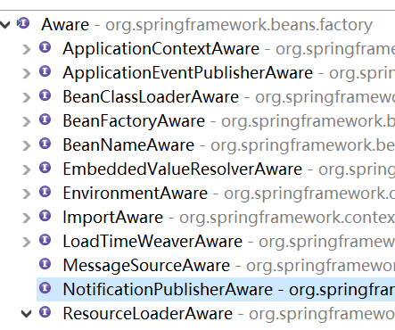
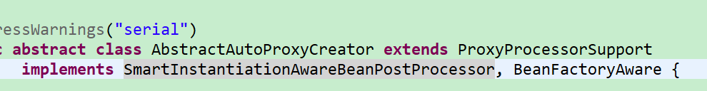
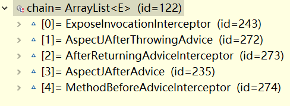
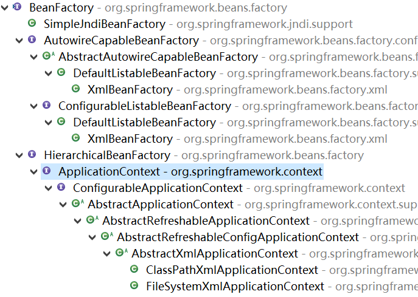

# Spring注解

> [TOC]

# 容器

抛弃配置文件的spring容器

## 一. 组件注册

### 1. 配置类和Configuration,Bean

* **配置类**
  * 在类上加上注解`@Configuration`即可成为配置类
  * 是配置文件的替代
* 配置Bean
  * 在配置类中写方法并加上`@Bean`即可完成组件配置
    * 返回值为<u>组件</u>
    * 方法名或者Bean的value参数值为<u>id</u>

```java
@Configuration
public class MyConfig {
	@Bean
	public Person person() {
		return new Person("lisi",20);
	}
}
```

* 使用配置类
  * 使用`AnnotationConfigApplicationContext(配置类.class)`

```java
ApplicationContext ioc = new AnnotationConfigApplicationContext(MyConfig.class);
```

* 然后按照之前学习的来

```java
Person bean = ioc.getBean(Person.class);
System.out.println(bean);
```

### 2. 包扫描

在配置类上加上`@ComponentScan(value="包名")`就能完成最基本的包扫描

* 排除excludeFilters参数: Filter注解数组

  * Filter数组: type: 排除类型; value: class数组,过滤的类型
  * 多个Filter取并集

  ```java
  @ComponentScan(value="com.at",excludeFilters = {
  		@Filter(type = FilterType.ANNOTATION,value = {Controller.class,Service.class})
  	})
  ```

* 包含: 首先要useDefaultFilters = false

  * 然后和上面语法一样

* 多个包扫描规则: 
  
  * `@ComponentScans`: 值为@ComponentScan数组

### 3. @Filter细节

<u>多个Filter取并集</u>

* `type参数`: 取值

  * FilterType.ANNOTATION: 按照注解过滤,上面已经演示过

  * `FilterType.ASSIGNABLE_TYPE`: 直接指定要包含/过滤的类型

  * `FilterType.ASPECTJ` : ASPECTJ表达式(不常用)

  * `FilterType.REGEX` : 正则

  * `FilterType.CUSTOM`: 自定义规则,指定TypeFilter(函数式接口)实现类的class数组

    ```java
    boolean match(MetadataReader metadataReader, MetadataReaderFactory metadataReaderFactory)
        //第一个参数: 当前类的信息
        //第二个参数: 其他类的信息
    ```

    

### 4. @Scope单实例/原型+@Lazy

> 和bean标签的scope属性的行为一模一样

`@Scope`加在方法上,value为字节数组,取值为:

**proptotype: 多实例**

**singleton: 多实例**

session/request: 不用

```java
@Configuration
public class MyConfig2 {
	@Scope(value="singleton")
	@Bean("person02")
	public Person person() {
		return new Person("还在那改善",25);
	}
}
```

* `@Lazy`: 针对单实例,使用的时候再创建单实例bean

  ```java
  @Lazy
  @Scope(value="singleton")
  @Bean("person02")
  public Person person() {
  	System.out.println("aaa");
  	return new Person("还在那改善",25);
  }
  ```

  

### 5. @Conditional条件添加

> SpringBoot底层大量使用,按照一定条件进行判断

可以标注在类和方法上,都表示满足条件(<u>所有Condition都返回true</u>)就加入容器

值为Condition(函数式接口)的class数组

* Condition接口:

  ```java
  public class LinuxCondition implements Condition{
  	@Override
  	public boolean matches(ConditionContext context, AnnotatedTypeMetadata metadata) {
  		//context: 判断条件能使用的context环境
          	//可以获得ioc bean工厂,类加载器,环境(环境信息,环境变量),registry(定义的注册类)
          //metadata: 当前标注了Conditional的信息
  		return false;
  	}
  }
  ```

### 6. @Import快速导入

#### 6.1 对于我们在别的包里的类快速导入

在配置类上使用`@Import`快速导入,就跟@Service这种一样

传入class数组

```java
@Import(value= {Color.class})
```

#### 6.2 ImportSelector接口

是@Import的相关选择器接口(函数式)

<u>返回需要导入的组件的全类名</u>

参数:@Import标注的类的所有注解信息

```java
public interface ImportSelector {

	/**
	 * Select and return the names of which class(es) should be imported based on
	 * the {@link AnnotationMetadata} of the importing @{@link Configuration} class.
	 */
	String[] selectImports(AnnotationMetadata importingClassMetadata);

}
```

#### 6.3 ImportBeanDefinitionRegistrar接口

实现类放在Import中

注册时不需要全类名,也不需要大小写

注册时传入RootBeanDefinition,构造器传入想要的组件的Class

```java
public interface ImportBeanDefinitionRegistrar {

	/**
	 * Register bean definitions as necessary based on the given annotation metadata of
	 * the importing {@code @Configuration} class.
	 * <p>Note that {@link BeanDefinitionRegistryPostProcessor} types may <em>not</em> be
	 * registered here, due to lifecycle constraints related to {@code @Configuration}
	 * class processing.
	 * @param importingClassMetadata 当前类的注解信息
	 * @param registry BeanDefinition注册工具,有registerBeanDefinition来手动注册
	 */
	public void registerBeanDefinitions(
			AnnotationMetadata importingClassMetadata, BeanDefinitionRegistry registry);

}
```

### 7. FactoryBean

先写个方法返回FactoryBean

然后他就会自动帮你获取那个对象组件并加入容器

> 如果想要获取,就在用id获取时,在id字符串第一个字符前加上&

## 二. 生命周期/后置处理

容器管理bean的创建-初始化-销毁过程

### 1. 指定初始化和销毁方法

> 只有关闭容器会销毁
>
> init在创建后运行

旧xml方式: 在bean中属性init-method和destroy-method中传入无参数的方法名(方法在bean类中)

注解方式: 在@Bean中指定,一样的

```java
@Configuration
public class Myconfig3 {
	@Bean(initMethod = "init",destroyMethod = "destroy")
	public Car car() {
		return new Car();
	}
}
```

### 2. InitializingBean接口和DisposableBean接口

让bean实现这两个接口,它就会初始化和销毁的时候调用对应方法.

### 3. JSR250

JSR250定义了两个注解`@PostConstruct`,`@PreDestroy`标在方法上就行

### 4. BeanPostProcessor后置处理器接口

```java

@Override
	public Object postProcessAfterInitialization(Object bean, String beanName) throws BeansException {
        //初始化之前调用
        //beanName: 就是bean的id
        return bean; //bean是将要初始化的对象,返回值必须为bean
	}
@Override
public Object postProcessBeforeInitialization(Object bean, String beanName) throws BeansException {
    //初始化之后调用
    return bean; // 跟上面一样
}
```

和spring配置用法一样,就实现以后放进容器,就会对所有组件 有效 

### 5. 后置处理器大致时机

>  挨个遍历BeanPostProcessor并执行对应方法
>
> 如果返回null,后面的都不执行

beforeinitialization: 在bean属性赋值以后,在初始化bean方法之前执行

after: 在bean初始化方法之后执行

### 6. Spring底层中的后置处理器

...

## 三. 属性赋值

### 1. @Value

写在bean定义的属性上

@Value(值)

@Value("#{20 - 1}") // Spring表达式

@Value("${}")

```java
public class Car {
@Value("张三")
private String name;
    ...
}
```

### 2. 从properties中取

1. 导入配置文件

   ```java
   //在配置文件上使用@PropertySource
   //value值为配置文件路径数组
   @PropertySource(value= {"classpath:/person.properties"})
   @Configuration
   public class Myconfig3 {
   ```

2. 用`@Value("${xx}")`获取

### 3. 从properties中给不是自己定义的bean赋值属性

1. 导入配置文件

* 几种方法
  * 在配置类中定义属性,并用@Value("${...}")赋值,然后在方法中使用setter给属性赋值
  * 或者作为参数传入,并给参数添加@Value("${...}"),然后在方法中setter
  * 实现**EmbeddedValueResolver**然后用解析器来解析"${..}",获取值

## 四. 自动装配

利用依赖注入完成对IOC容器中各个组件的赋值

### 1. Autowired和它的朋友们

@Autowired自动注入跟之前的用法一样

1. 优先类型
2. 然后id(属性名),可以用**@Qualifier**指定要找的id
3. 找不到就报错,或者在Autowired设置required为false

### 2. 新朋友@Primary

在组件上(配置类中的方法上)加注解`@Primary`,让组件优先注入(在Autowired没有明确指定id的前提下)

### 3. @Resource

@Resource是JSR250标准的注解,可以取代Autowired用,自动装配

默认按照组件名称-属性,想要指定就用name参数,不能指定required,不吃Primary

```java
@Resource(name="bookDao2")
private BookDao bookDao;
```

### 4. @Inject

JSR250导入依赖`javax.inject`,也是取代Autowired,吃Primary,没有required

 ### 5. Autowired用在方法和构造器

1. 标在方法上: 按之前的规则自动装配所有参数,并在创建组件时执行此函数
2. 标在构造器上: 默认是调用无参,如果加了autowired就会调用有参并且自动传参
   * 如果没有无参构造器且只有一个有参构造器,则spring自动Autowired之
3. 放在参数位置: 效果一样

@Bean的配置方法加入参数: 会自动将容器中组件加入

### 6. Aware接口

> 由后置处理器处理

组件想要获得一些Spring容器的实例,比如applicationContext,beanFactory怎么做?

bean类实现对应Aware接口,在**组件创建**时会执行对应方法传入需要的自定义组件

```java
public class Car implements ApplicationContextAware{
	@Override
	public void setApplicationContext(ApplicationContext applicationContext) throws BeansException {
		// TODO Auto-generated method stub
		//注入容器
	}
```

Aware接口的子接口们:



* 举例:
  * BeanNameAware: 获取自己的id
  * EmbeddedValueResolverAware: 获取一个StringValueResolver,可以解析出spring占位符的值,

```java
public void setEmbeddedValueResolver(StringValueResolver resolver) {
		// TODO Auto-generated method stub
		String resolveStringValue = resolver.resolveStringValue("${os.name}");
		//空格隔开
	}
```

### 6. @Profile

根据当前环境(比如开发,测试,生产)为我们提供根据当前环境,动态的激活和切换一系列组件的功能

写在方法上指定一个组件,写在配置类上指定整个配置类(包括配置类本身)

* 使用:

  * value为String[],指定当前组件在什么环境下被创建

  * value的值是自定义标识,默认环境叫"default"

    ```java
    @Profile("dep")
    @Bean
    public DataSource dataSourceDep() throws PropertyVetoException {
            
    @Profile("test")
    	@Bean
    	public DataSource dataSourceTest() throws PropertyVetoException {
    
    @Profile("dev")
    	@Bean
    	public DataSource dataSourceDev() throws PropertyVetoException {
    ```

    

* 切换环境:

方法一: jvm的参数指定环境字符串

```bash
java -Dspring.profiles.active=test Test1
```

方法二: 无参构造器创建ApplicationContext,再设置环境

```java
AnnotationConfigApplicationContext ioc = new AnnotationConfigApplicationContext();
ioc.getEnvironment().setActiveProfiles("test");//指明环境,String...args
ioc.register(MyConfiguration.class);//注册配置类
```

## 五. 引用其他组件

1. 作为参数传入(省略了Autowired)
2. 调用对应的方法(Spring的config中调用方法会去容器中找而不是生成新的)

# AOP

## 一. HElloWorld again

### 1. 简单制作

1. 写配置,和配置文件一样

* 配置文件和ioc是同一套
* 先将<u>目标类和切面类</u>注册到容器(用注解也行)
* 并且用注解`@Aspect`指定切面类
* 然后告诉Spring(每一个)方法啥时候在哪运行,使用__通知注解__(参数可以写切入点表达式,也可以写@Pointcut的方法)

2. 开启基于注解的切面功能(注解`@EnableAspectJAutoProxy`取代配置文件)

   > 很多@EnableXXX注解可以加在配置类上来替代配置

```java
@EnableAspectJAutoProxy
@Configuration
public class MyAopConfig1 {
```

## 二. 原理-创建代理对象

这个注解的代码: 

```java
@Target(ElementType.TYPE)
@Retention(RetentionPolicy.RUNTIME)
@Documented
@Import(AspectJAutoProxyRegistrar.class) // 注意import注解
public @interface EnableAspectJAutoProxy {
```

```java
class AspectJAutoProxyRegistrar implements ImportBeanDefinitionRegistrar {
    //ImportBeanDefinitionRegistrar: spring的接口,实现以后import会按照方法的行为导入组件
```

#### 1.

AspectJAutoProxyRegistrar的作用:

* 注册组件"internalAutoProxyCreator",类型为`AnnotationAwareAspectJAutoProxyCreator`
  * 注解式切面自动代理创建器

#### 2.

`AnnotationAwareAspectJAutoProxyCreator`的祖先类实现了两个接口



**bean后置处理器** 和BeanFactoryAware

* 后置处理器做的事:
  * 由AbstractAutoProxyCreator实现,包装并返回代理对象
* BeanFactory
  * 由AbstractAutoProxyCreator实现
  * 由AbstractAdvisorAutoProxyCreator重载
  * 由AnnotationAwareAspecJAutoProxyCreator重载initBeanFactory

### 3. 流程1: 创建ioc容器

new AnnotationConfigAnnotationContext(xxx);

```java
public AnnotationConfigApplicationContext(Class<?>... annotatedClasses) {
		this();
		register(annotatedClasses);
		refresh(); // 看这个
	}
```

```java
try {
	// Allows post-processing of the bean factory in context subclasses.
	postProcessBeanFactory(beanFactory);
	// Invoke factory processors registered as beans in the context.
	invokeBeanFactoryPostProcessors(beanFactory);
	// Register bean processors that intercept bean creation.
	registerBeanPostProcessors(beanFactory); // 注册后置处理器
    //根据PriorityOrdered,Ordered,未实现接口排序
   // Initialize message source for this context.
	initMessageSource();
// Initialize event multicaster for this context.
	initApplicationEventMulticaster();
// Initialize other special beans in specific context subclasses.
	onRefresh();
// Check for listener beans and register them.
	registerListeners();
// Instantiate all remaining (non-lazy-init) singletons.
	finishBeanFactoryInitialization(beanFactory);
// Last step: publish corresponding event.
	finishRefresh();
}

```

registerBeanPostProcessors:

1. 获取容器中所有后置处理器(包括spring自己定义的,还有注解import的)

   ```java
   String[] postProcessorNames = beanFactory.getBeanNamesForType(BeanPostProcessor.class, true, false);
   ```

2. 给容器中添加一些后置处理器

   ```java
   beanFactory.addBeanPostProcessor(new BeanPostProcessorChecker(beanFactory, beanProcessorTargetCount));
   ```

3. 将后置处理器按照PriorityOrdered,Ordered分离

   ```java
   // Separate between BeanPostProcessors that implement PriorityOrdered,
   // Ordered, and the rest.
   ```

   遍历并分离

   ```java
   for (String ppName : postProcessorNames) {
   	if (beanFactory.isTypeMatch(ppName, PriorityOrdered.class)) {
           //高优先级
   		BeanPostProcessor pp = beanFactory.getBean(ppName, BeanPostProcessor.class);
   		priorityOrderedPostProcessors.add(pp);
   		if (pp instanceof MergedBeanDefinitionPostProcessor) {
   			internalPostProcessors.add(pp);
   		}
   	}
   	else if (beanFactory.isTypeMatch(ppName, Ordered.class)) {
           //有优先级
   		orderedPostProcessorNames.add(ppName);
   	}
   	else {
           //无
   		nonOrderedPostProcessorNames.add(ppName);
   	}
   		}
   ```

4. 注册(创建beanPostProcessor对象并保存在容器中)

   1. 遍历

      ```java
      for (String ppName : postProcessorNames) {
          //遍历全类名
      ```

   2. 用工厂getBean(创建AnnotationAwareAspectJAutoProxyCreator)

      ```java
      BeanPostProcessor pp = beanFactory.getBean(ppName, BeanPostProcessor.class);
      ```

      > 创建流程:(和普通bean一样)
      >
      > 先获取,如果没有并且是单例就创建createBean(beanName, mbd, args);
      >
      > 然后属性赋值(populateBean)
      >
      > 初始化bean(initializeBean)
      >
      > > invokeAwareMethods: 调用Aware实现的方法
      > >
      > > applyBeanPostProcessorsBeforeInitialization: 调用所有后置处理器的before...方法
      > >
      > > invokeInitMethods: 执行自定义的初始化方法init-method

### 4. 后置处理器工作

我们的AnnotationAwareAspectJAutoProxyCreator是InstantiationAwareBeanPostProcessor的实现,在初始化前走

```java
 postProcessBeforeInstantiation
```

1. createBean(beanName, mbd, args);

2. 后置处理器运行before方法

   ```java
   // Give BeanPostProcessors a chance to return a proxy instead of the target bean instance. 给后置处理器一个机会来返回一个代理对象,不然就doCreateBean
   Object bean = resolveBeforeInstantiation(beanName, mbdToUse);
   if(bean != null){return...}
   ....
   Object beanInstance = doCreateBean(beanName, mbdToUse, args);
   //流程和上一节最后的创建流程一样
   ```

   ```java
   //resolveBeforeInstantiation
   bean = applyBeanPostProcessorsBeforeInstantiation(targetType, beanName);
   if (bean != null) {
   	bean = applyBeanPostProcessorsAfterInitialization(bean, beanName);
   }
   ```

   ```java
   if (bp instanceof InstantiationAwareBeanPostProcessor) {
   	InstantiationAwareBeanPostProcessor ibp =(InstantiationAwareBeanPostProcessor) bp;
   	Object result = ibp.postProcessBeforeInstantiation(beanClass, beanName);
   	if (result != null) {
   			return result;
   		}
   	}
   ```

3. 进入postProcessBeforeInstantiation

#### 4.1 创建AOP代理

* 被切类创建时

  * 检查是否advisedBeans(保存了所有增强的bean)
  * 检查是否Advicor等基础类型接口实现类,或者检查是否切面类(有切面注解)
  * 检查是否需要跳过不处理:(基本永远返回true)
    * 获取所有通知方法(增强器),类型为InstantiationModelAwarePointcutAdvisor
    * 判断增强器是不是某个类型的,有就返回false

* 被切类创建后(after)

  > wrapIfNecessary
  >
  > > Object[] specificInterceptors = getAdvicesAndAdvisorsForBean(bean.getClass(), beanName, null);
  > >
  > > //获取通知方法/增强器,找到能在当前bean能使用的候选增强器
  > >
  > > //返回一个拦截器数组
  > >
  > > //如果需要增强,创建代理
  > >
  > > Object proxy = createProxy
  > >
  > > > 获取所有增强器保存到proxyFactory
  > > >
  > > > 用工厂创建代理
  > > >
  > > > > 创建JDK代理,或Cglib代理等...
  >
  > 最终返回一个代理

## 三. 原理-方法调用

### 1. 代理对象

容器中保存了cglib增强后的代理对象,在代理中保存了增强器,目标对象等内容

### 2. 拦截

调用目标方法时,来到了`CglibAopProxy `的`intercept`方法(拦截)

> __intercept()__:
>
> ```java
> List\<Object\> chain = this.advised.getInterceptorsAndDynamicInterceptionAdvice(method, targetClass);
> //获取拦截器链,根据proxyFactory对象; 如果没有拦截链,就直接invoke方法
> //如果有,就: 把需要执行的目标对象,方法,拦截器链传入CglibMethodInvocation,调用其proceed
> retVal = new CglibMethodInvocation(proxy, target, method, args, targetClass, chain, methodProxy).proceed();
> ```
>
> > **getInterceptorsAndDynamicInterceptionAdvice**: 获取拦截器链
> >
> > > **getInterceptorsAndDynamicInterceptionAdvice**
> > >
> > > ```java
> > > List<Object> interceptorList = new ArrayList<Object>(config.getAdvisors().length);//new一个拦截器链(空),是ArrayList
> > > ```
> > >
> > > 接着遍历所有的Advisor(增强器),并将它们都封装出一个Inteceptor数组
> > >
> > > * 封装逻辑:
> > >   * 如果advisor它本身就是指定Interceptor,直接加入数组
> > >   * 如果不是,就用一个AdvisorAdapter进行适配成为Interceptor加入
> > >
> > > 并将数组中的内容放入拦截器链
> > >
> > > ```java
> > > Interceptor[] interceptors = registry.getInterceptors(advisor);
> > > ```
> > >
> > > 拦截器链

### 3. 调用链

> __intercept()__:
>
> > **proceed**:
> >
> >  先判断拦截器是否空/拦截器索引和拦截器链大小一样=>直接调用方法
> >
> > 根据++索引获取一个拦截器
> >
> > ```java
> > //调用链条
> > return ((MethodInterceptor) interceptorOrInterceptionAdvice).invoke(this);
> > ```
> >
> > > **invoke**:
> > >
> > > 获取新的方法调用器mi,并
> > >
> > > ```java
> > > return mi.proceed();//和上面那个proceed行为一样,调用下一个MethodInvocation的proceed,形成链式调用(包含索引自增直到 空/拦截器索引和拦截器链大小一样)
> > > ```
> >
> > > **MethodBeforeAdviceInterceptor的proceed的invoke:**
> > >
> > > 执行前置通知
> > >
> > > ```java
> > > //before
> > > this.advice.before(mi.getMethod(), mi.getArguments(), mi.getThis() );
> > > ```

前置proceed到链末尾后执行目标方法

```java
if (this.currentInterceptorIndex == this.interceptorsAndDynamicMethodMatchers.size() - 1) {
		return invokeJoinpoint();
}
```

如递归调用一样,proceed后面也是有代码的,当递归出口到来后,一层一层调用回去,执行proceed后面的代码

```java
//After
public Object invoke(MethodInvocation mi) throws Throwable {
		try {
			return mi.proceed();
		}
		finally {
            //finally,由后置通知AspectJAfterAdvice执行
			invokeAdviceMethod(getJoinPointMatch(), null, null);
		}
	}
```

```java
//AfterReturning
@Override
public Object invoke(MethodInvocation mi) throws Throwable {
	Object retVal = mi.proceed();//如果有异常就直接抛给上层AfterThrowing不执行返回
	this.advice.afterReturning(retVal, mi.getMethod(), mi.getArguments(), mi.getThis());//执行afterReturning方法
	return retVal;
	}
```

```java
//AfterThrowing
@Override
	public Object invoke(MethodInvocation mi) throws Throwable {
		try {
			return mi.proceed();
		}
		catch (Throwable ex) {
            //处理异常
			if (shouldInvokeOnThrowing(ex)) {
                //调用AfterThrowing
				invokeAdviceMethod(getJoinPointMatch(), null, ex);
			}
			throw ex;
		}
	}
```

## 三. 声明式事务

### 1. 用法

在Service层中的方法上加上`@Transactional`告诉spring需要事务控制

在配置类上加`@EnableTransactionManagement`开启基于注解的事务管理

配置事务管理器TransactionManager

```java
@Bean
public PlatformTransactionManager transactionManager() {
	return new DataSourceTransactionManager(dataSource());
}
```

### 2. @EnableTransactionManagement作用

和aop那个enable其实差不多,import一个importSelector

```java
@Import(TransactionManagementConfigurationSelector.class)
public @interface EnableTransactionManagement {
```

该ImportSelector根据AdviseMode返回对应类型的全类名

* AdviseMode: @EnableTransactionManagement的参数

  ```java
  AdviceMode mode() default AdviceMode.PROXY;
  ```

* 其代码:

  * 注册了两个组件:

        //AutoProxyRegistrar
        //ProxyTransactionManagementConfiguration

  ```java
  @Override
  	protected String[] selectImports(AdviceMode adviceMode) {
  		switch (adviceMode) {
                  //看这里
                  //AutoProxyRegistrar
                  //ProxyTransactionManagementConfiguration
  			case PROXY:
  				return new String[] {AutoProxyRegistrar.class.getName(), ProxyTransactionManagementConfiguration.class.getName()};
  			case ASPECTJ:
  				return new String[] {TransactionManagementConfigUtils.TRANSACTION_ASPECT_CONFIGURATION_CLASS_NAME};
  			default:
  				return null;
  		}
  	}
  ```

  

### 3. AutoProxyRegistarar

作为ImportBeanDefinitionRegistrar的实现,它注册进容器时会调用registerBeanDefinitions进行注册组件操作

任务是注册`AutoProxyCreator`,具体类型是`InfrastructureAdvisorAutoProxyCreator`

这家伙的行为和之前aop那个AutoProxyCreator差不多: 创建代理,用增强器,链式调用;详细请复习aop原理

```java
AopConfigUtils.registerAutoProxyCreatorIfNecessary(registry);
//这个行为和aop那边AspectJAutoProxyRegistrar的行为很相似,但略有区别
//对比: AopConfigUtils.registerAspectJAnnotationAutoProxyCreatorIfNecessary(registry);
```

### 4. ProxyTransactionManagementConfiguration

这是一个__配置类__

注册:

1. transactionAdvisor: 事务增强器BeanFactoryTransactionAttributeSourceAdvisor

2. TransactionInterceptor: 事务拦截器,methodInterceptor的实现类,链上只有它

   * 保存了事务的属性信息和事务管理器

   * 其invoke:

     ```java
     @Override
     	public Object invoke(final MethodInvocation invocation) throws Throwable {
     	// Work out the target class: may be {@code null}.
     	// The TransactionAttributeSource should be passed the target class
     	// as well as the method, which may be from an interface.
     	Class<?> targetClass = (invocation.getThis() != null ? AopUtils.getTargetClass(invocation.getThis()) : null);
     
     	// Adapt to TransactionAspectSupport's invokeWithinTransaction...
     	return invokeWithinTransaction(invocation.getMethod(), targetClass, new InvocationCallback() {
     		@Override
     		public Object proceedWithInvocation() throws Throwable {
     			return invocation.proceed();
     		}
     	});
     }
     ```

     > **invokeWithinTransaction:**
     >
     > 先获取事务属性和事务管理器
     >
     > > 方法上有@Qualifier或者transactionManager参数,就用指定的事务管理器
     > >
     > > 不然就按照类型(PlatformTransactionManager)获取
     >
     > 运行目标方法,如果出现异常就completeTransactionAfterThrowing(txInfo, ex);
     >
     > > **completeTransactionAfterThrowing**:
     > >
     > > 拿到事务管理器,回滚
     >
     > 没异常就commitTransactionAfterReturning;

# Spring原理拓展

## 一. BeanFactoryPostProcessor接口

### 1. 介绍

`BeanFactoryPostProcessor`是BeanFactory的后置处理器,在BeanFactory标准初始化之后执行(即所有bean定义信息被加载而还没有bean被初始化的时候)

> 形如ApplicationContext就是它的子接口,在Spring原理中讲过



该接口要实现的方法: 

```java
@Override
	public void postProcessBeanFactory(ConfigurableListableBeanFactory beanFactory) throws BeansException {
		//该beanFactory参数可以拿到bean定义的数量,名字等信息
	}
```

### 2. 运行原理

容器创建时需要refresh(),在其中会调用`invokeBeanFactoryPostProcessors(beanFactory);`

```java
postProcessBeanFactory(beanFactory);
invokeBeanFactoryPostProcessors(beanFactory);//这里
registerBeanPostProcessors(beanFactory);

```

> 调用到__PostProcessorRegistrationDelegate类中:__
>
> 在beanFactory中获取每一个BeanFactoryPostProcessor并继续运行:
>
> 先把这些按照三个优先级分类,然后高优先级的先运行,接着低优先级
>
> ```java
> for (String postProcessorName : nonOrderedPostProcessorNames) {
> 	nonOrderedPostProcessors.add(beanFactory.getBean(postProcessorName, BeanFactoryPostProcessor.class));//有优先级排序,几个for遍历,这边只放一个
> }
> ```
>
> 

## 二. BeanDefinitionRegistryPostProcessor接口

是BeanFactoryPostProcessor的子接口,bean定义注册处的后置处理器

### 1. 要实现的方法

除了父接口要求实现的,还有一个

```java
/**
	 * Modify the application context's internal bean definition registry after its
	 * standard initialization. All regular bean definitions will have been loaded,
	 * but no beans will have been instantiated yet. This allows for adding further
	 * bean definitions before the next post-processing phase kicks in.
	 * @param registry the bean definition registry used by the application context
	 * @throws org.springframework.beans.BeansException in case of errors
	 */
void postProcessBeanDefinitionRegistry(BeanDefinitionRegistry registry) throws BeansException;
//执行时机是所有合法bean定义信息 将要 被加载完但是没有bean被初始化的时候
//先于postProcessBeanFactory执行

//参数保存了所有bean定义信息,后面BeanFactory就是按照BeanDefinitionRegistry来创建bean

```

### 额外. BeanDefinitionRegistry注册bean

```java
//使用registerBeanDefinition方法
//RootBeanDefinition ro = new RootBeanDefinition(Car.class);
//或者
RootBeanDefinition ro = BeanDefinitionBuilder.rootBeanDefinition(Car.class).getDefinition();
registry.registerBeanDefinition("id",ro)//第一个传id,第二个传BeanDefinition
```

### 2. 时机原理

依然是refresh的invokeBeanFactoryPostProcessors

在PostProcessorRegistrationDelegate 中,BeanDefinitionRegistry会先被执行,在所有BeanFactoryPostProcessor被获取并执行之前

```java
boolean reiterate = true;
while (reiterate) {
	reiterate = false;
	postProcessorNames = beanFactory.getBeanNamesForType(BeanDefinitionRegistryPostProcessor.class, true, false);
	for (String ppName : postProcessorNames) {//获取所有BeanDefinitionRegistryPostProcessor
		if (!processedBeans.contains(ppName)) {
			currentRegistryProcessors.add(beanFactory.getBean(ppName, BeanDefinitionRegistryPostProcessor.class));
			processedBeans.add(ppName);
			reiterate = true;
		}
	}
	sortPostProcessors(currentRegistryProcessors, beanFactory);
	registryProcessors.addAll(currentRegistryProcessors);
    
    //调用自己实现的方法
	invokeBeanDefinitionRegistryPostProcessors(currentRegistryProcessors, registry);
	currentRegistryProcessors.clear();
}

// Now, invoke the postProcessBeanFactory callback of all processors handled so far.
//在这里调用父接口的方法
invokeBeanFactoryPostProcessors(registryProcessors, beanFactory);
invokeBeanFactoryPostProcessors(regularPostProcessors, beanFactory);
```

## 三. ApplicationListener接口


```java
public interface ApplicationListener<E extends ApplicationEvent> extends EventListener {
 //泛型就是监听的事件
	/**
	 * Handle an application event.
	 * @param event the event to respond to
	 */
	void onApplicationEvent(E event);
    //有容器关闭,刷新,开始,停止等事件

}
```

也可以自己发布事件

```java
ioc.publishEvent(ApplicationEvent对象)
```

