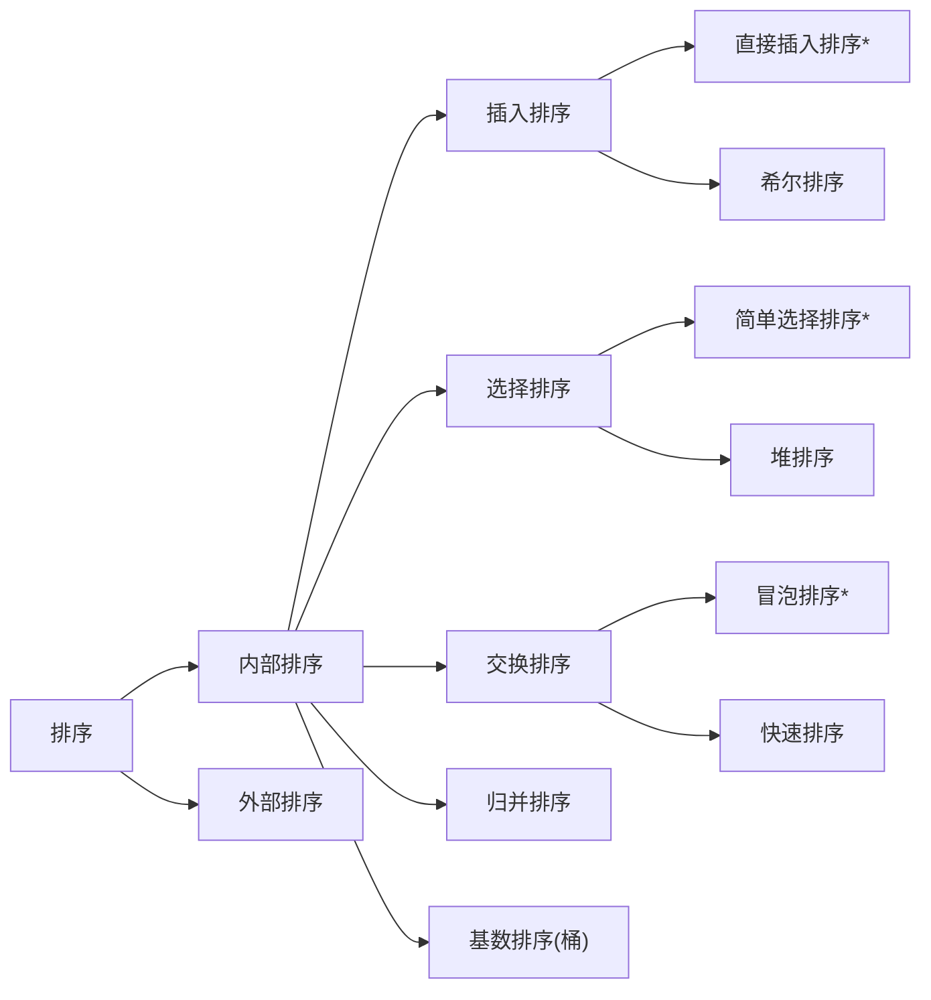

# JAVA数据结构和算法

> [TOC]

-----------

所有数据结构都写在`E:\javas\DataStructures`包中

## 一. 稀疏数组(Sparse Array)

### 1. 基本介绍

* __介绍__:当一个数组中大部分为同一个值时,可以用__稀疏数组__保存该数组

* __处理方法__:
  * 记录一共几行几列,有多少不同值
  * 把具有不同值的元素的行列及值记录在一个小规模数组中,缩小程序规模

* __记录方式__:

  * 一个记录 `行(row) 列(col) 值(value)` 的数组
  * _第一行_记录 __行数,列数,不同值数__
  * 剩下的记录值

### 2. 代码实现

见文件夹的包`com.at.sparsearray`

## 二. 环形队列(Queue)

直线队列在`com.at.queue`中的`ArrayQueue`类;

### 1. 基本思路

> 1. 数组大小为maxSize
> 2. front 指向队列的第一个元素
> 3. rear指向最后一个元素的后一个位置,因为希望留出一个空间作为约定.
> 4. rear初始值为0
> 5. 当队列满时,条件为__(rear+1)%maxSize==front__
> 6. 队列空时,__rear==front__
> 7. 有效数据的个数=(rear+maxSize-front)%maxSize

### 2. 代码实现

在`com.at.queue`的`CircleArrayQueue`中

## 三. 链表(Linked List)

### 1. 基本思路

链表是以节点方式存储,每个节点包括`data`域`next`域.

分为带<u>头结点</u>的链表和<u>不带头结点</u>的链表.

### 2. 单链表(SingleLinkedList)

使用Node类实现链表,带头结点,属性包括__数据和next__,尾节点next指向null

>  注: Node是一个类,包含数据和next,然后在List类中连接

* 创建头结点-->添加节点(先在尾部)

* 实现: `com.at.LinkedList`的`SingleLinkedList`

### 3. 单向环形链表/约瑟夫问题

* __约瑟夫问题__(Josephu)/约瑟夫环:

  > 设编号为 1,2,3,..,n 的人围坐一圈,约定编号为`k`的人从1开始报数,报到`m`的人出列.
  >
  > 下一个人再从1开始报到m,以此类推.
  >
  > 求出队序列.

使用循环链表直接数 代码见`com.at.Josephu`

---

## 四. 栈(Stack)

众所周知,FILO是栈,top栈顶移动,bottom栈底不动

`com.at.Stack`的Arraystack实现了一个简单的栈

表达式求值,后缀表达式求值,中缀转后缀,尽在`com.at.expression`

### 1. 表达式

#### 1.1简易思路

* 思路

  1. 创建两个栈,一个存数据(数栈),一个存符号(符号栈);
  2. 通过索引index扫描表达式
  3. 如果我们发现是一个数字,就直接入`数栈`
  4. 如果是符号:
     * 如果当前符号栈<u>为空</u>,入栈
     * 如果不为空:
       * 如果当前操作符<u>优先级小于或者等于</u>栈中操作符,需要从数栈中pop两个数,从符号栈中pop一个符号进行运算,将结果入数栈,然后当前操作符入符号栈
       * 不然,当前符号直接入栈

  5. 当表达式扫描完毕,则顺序从数栈和符号栈中pop出相应数和符号运行.
  6. 最后留下的数字就是结果

#### 1.2 前缀表达式(波兰表达式)

特点: 运算符位于操作数前

举例:

```java
(3+4)*5-6 -->  - * + 3 4 5 6
```

* 前缀表达式求值: 
  * 从__右至左__扫描,
  * 遇到数字压入栈
  * 遇到运算符,弹出栈顶两个数 ,并作相应计算,将结果放入栈顶

#### 1.3 中缀表达式

是常见的运算式,对人熟悉,对计算机不友好. 所以需要转换成其他方式求值.

举例:

```-
(3+4)*5-6
```


#### 1.4 后缀表达式(逆波兰)

后缀:suffix

特点: 运算符位于操作数后

举例:

```()
(3+4)*5-6 --> 3 4 + 5 * 6 -
```

* __求值过程__:
  * 从左向右扫描
  * 遇到数字,压入栈
  * 遇到运算符,弹出栈顶两个数字,运算并压入栈

#### 1.5 中缀转后缀

__步骤__:

> 1. 初始化两个栈, 运算符栈`s1`,结果栈`s2`;
> 2. 从左至右扫描
> 3. 若是数字,直接压入结果栈s2
> 4. 遇到运算符时:
>    * 若`s1`为空或者栈顶为`(`,直接入栈
>    * 若此运算符比栈顶高,压入栈`s1`
>    * 否则将__栈顶弹出并压入__`s2`,回到第4步再次检验
> 5. 遇到括号:
>    * 左括号`(`直接压入栈
>    * 右括号`)`,弹出`s1`栈顶运算符并压入`s2`,直到遇到左括号,然后将左括号弹出遗弃;
> 6. 扫描完毕,把`s1`剩余的栈顶依次弹出压进`s2`
> 7. s2从__栈底到栈顶__的顺序输出 为结果后缀表达式

------

## 五. 递归(Recursion)

递归就是方法自己调用自己,每次传入不同变量,有助于解决复杂问题,简洁代码.

* __迷宫问题__:`com.at.recursion MiGong` 

* **八皇后问题**:`com.at.recursion Queue`

---

## 六. 排序算法(Sort)

* __分类__:

  * 内部排序: 在内部存储器中排序
  * 外部排序: 数据量很大,借助外部存储排序

* 常见算法:

  ------



--------

### 1. 时间复杂度

#### 1.1 时间频度

* __时间频度__:<u>一个算法花费的时间与算法中语句的执行次数成正比例</u>,哪个算法中执行的次数多,它花费的时间越多.一个算法中的语句执行次数被称为__语句频度__或__时间频度__,记为==T(n)==

```java
//举例说明
//例1
int total = 0;
int end = 100;
for(int i =1;i<= end ; i++){
    total += i;
}
//T(n)=n+1;判断加循环数
//例2
total=(1+end)*end/2;
//T(n)=1
```

* __注__:
  1. 随着n的变大,T(n)的<u>常数项</u>可以被无视
  2. 随着n的变大,T(n)的<u>低次项</u>可以被无视
  3. 随着n的变大,在不同次幂比较下,T(n)的<u>系数</u>可以被无视

#### 1.2 时间复杂度

在时间频度T(n)下,若存在辅助函数f(n),当n趋于无穷大时,__T(n)/f(n)__极限值为不等于0的常数,

则称f(n)是T(n)的__同数量级函数__,记作 ==$T(n)= O (f(n))$==

* 此时称$O(f(n))$为算法的__渐进时间复杂度__(时间复杂度)

* <u>计算方法:</u>(已知T(n))

  1. 用常数1代替运行时间中的所有加法常数
  2. 修改T(n)只保留最高阶项
  3. 去除最高阶系数

* __常见时间复杂度__:

  > 从小到大:
  >
  > 常数阶O(1)
  >
  > 对数阶O(log2n)
  >
  > 线性阶O(n)
  >
  > 线性对数阶O(nlogn)
  >
  > 平方阶O($n^2$)
  >
  > 立方阶$O(n^3)$
  >
  > k次方阶O($n^k$)
  >
  > 指数阶O($2^n$)

#### 1.3 不同情况下的复杂度

* __平均时间复杂度__: 所有输入实例均以等概率出现情况下,该算法运行时间
* __最坏时间复杂度__: 最坏输入情况下的复杂度,一般<u>考虑这个</u>

#### 1.4 排序算法复杂度表


---

### 2. 冒泡排序(Bubble Sorting)

对待排序序列从前向后遍历,比较相邻元素的值,若逆序则交换,使值较大的数据后移到一定位置(最大者直接到达目的地).反复执行.

若其中一次遍历未发生交换,则排序提前完成.

代码: `com.at.sort`-->`BubbleSort`

时间复杂度$O(n^2)$

-----

### 3. 选择排序(Select Sort )

* 思想: 用指定规则选出某一元素,再依规定交换位置后达到排序目的.
  * 从整个数组找最小数,找到和最前面的数交换
  * arr[0]开始,第二个从arr[1]开始
  * 一共有数组大小-1次循环

$O(n^2)$

----

### 4. 插入排序(Insert Sort)

* __思想__: 把n个待排序的元素看成一个有序表和一个无序表,开始时有序表只包含一个元素,无序表包含n-1个.将无序表的元素插入有序表的过程称为插入排序.

* 代码: `com.at.sort`-->`InsertSort`

$O(n^ 2)$

-------

### 5. 希尔排序(Shell Sort)

* __插入排序存在的问题:__ 当有一个后面的数较小时,进行的后移次数较多,效率低下.
* __希尔排序思想__: 在简单插入排序经过改进以后的更高效的版本,也叫__缩小增量排序__.
  * 把记录按下表的一定增量分组,对每组使用直接插入排序算法排序
  * 随着增量逐渐减少,每组包含的关键词越来越多,当增量减至1时,整个文件恰成一组,排序完成.


* 排序方式:
  * 交换法(效率低) 
  * 移动法(效率高)
* 代码实现: `com.at.sort`-->`shellSort`

$O(nlogn)\sim O(n^2)$

------

### 6. 快速排序(Quick Sort)

快速排序是对冒泡排序的改进.

* __基本思想__: 通过一趟排序将要排序的数据分隔成独立的两部分,其中一部分的数据比另一部分的都要小,.

  然后递归的对两个独立部分再使用快速排序.

* 代码实现: `com.at.sort`-->`QuickSort`

$O(nlogn)\sim O(n^2)$

----------

### 7. 归并排序(Merge Sort)

* 归并排序是分治思想的体现

分(divide): 将问题分为小问题递归求解

治(conquer):  将每个小部分修补在一起,称为大问题的答案

* 将数组分为两份,递归排序并执行merge操作,为归并排序

* 代码:`com.at.sort`-->`MergeSort`

$O(nlogn)$

--------

### 8. 基数排序(Radix Sort)

`基数排序`属于__分配式排序__,是__稳定性__排序,桶排序的拓展.

* __思想__:
  * 将所有待比较数统一为一样的数位长度,数位较短的补0
  * 从最低位开始一次排序,这样一直到最高位完成就有序了


* __细节__:
  * 在后面的排桶中,先把前面的排序倒入数组中(按桶和入桶的顺序),再排桶
  * 在最后的倒桶中,亦按顺序遍历
  * 以上两点方可保证稳定性和正确性

* 代码实现:`com.at.sort`-->`RadixSort`

--------

### 9. 总结和时间与稳定


--------------

## 七. 查找算法

在数据结构(数组)中寻找指定值value

`com.at.search`

* __常用__:

  > * 顺序(线性)查找
  > * 二分(折半)查找
  > * 插值查找
  > * 斐波那契查找

### 1. 线性查找

`SeqSearch`

### 2. 二分查找

在__有序数组__进行二分查找

* 递归思路:
  * 首先确定该数组中间的下标
  * 将查找数`findVal`和中间数比较
    * 若查找数大于中间数,向右查找
    * 若等于,返回
    * 若小于,向左查找
  * 当`left > right`(没找到)或找到数退出

* 代码实现: `com.at.search -->BinarySearch-->binarySearch()`
* 进阶代码实现(返回重复的所有下标):`com.at.search -->BinarySearch-->binarySearch2()`
  * 在找到mid时不要马上返回,向左右扫描,将满足所有的下标加入到集合中.

-------------

### 3. 插值查找

要求有序

类似于二分查找,但是区别是从__自适应mid__开始查找,是二分查找的优化

对分布均匀的数组有效.

从mid = (low+high)/2= $low+(high-low)/2$改成

> $$
> mid = low+\frac {key-a[low]}{a[high]-a[low]}(high-low)
> $$
> 
>

即考虑key偏移的程度来完成mid选择.

* `com.at.search -->BinarySearch-->InsertValueSearch()`

-----------

### 4. 斐波那契查找

要求有序

类似二分查找,只是改了mid,这里的mid指黄金分隔点.
$$
mid = low + F(k-1)-1
$$

* 理解:
  * F代表斐波那契数列,有$F(k)=F(k-1)+F(k-2)$的性质-->$F(k)-1=(F(k-1)-1)+(F(k-2)-1)+1$
  * 所以mid处在黄金分割位置
  * 但是需要原数组长度为(F(k)-1),实际可能不满足,需要<u>人为增长</u>,并都赋予arr[n]的值

```java
while(n>fib(k)-1)
    k++;
```


* 代码`com.at.search -->BinarySearch-->FibonacchiSearch()`

-----------

## 八. hash表(散列)

__hash表__是根据<u>关键码值(</u>key value)而直接进行访问的数据结构.他通过把关键码值<u>映射</u>到表中一个位置来访问记录.

* 这个映射函数称为__散列函数__
* 存放记录的数组称作__散列表__

代码实现:`com.at.hashtable`

### 1. 相关需求

在数据库取数据时不希望每次都取,可以放在中间的__缓存层__,这个缓存层可以用redis等产品实现,也可以用自己的<u>散列表</u>实现

---------

## 九. 树(基础部分)

### 1. 为什么需要树

数组:

* 优点: 下标访问速度快,有序时可以用高效的检索算法
* 缺点: 插值时整体移动,检索具体某个值时效率低

链表:

* 优点:  插入删除时效果好
* 缺点: 检索时效率低

这两个数据结构在增删和查不能兼顾,故树可以解决这样的问题.

---

### 2. 线索化二叉树

利用二叉树中的空指针域,存放该节点在某种遍历次序下的前驱和后继节点的指针(称之为__线索__)

* 前序线索二叉树
* 中序线索二叉树
* 后序线索二叉树

建立思路:

*  需要一个属性来标识左右节点的特性(指向子树还是前驱后继)
* 需要pre属性指向前驱节点
* 操作:
  * 先中序遍历到最左,此时前驱pre为null,不操作后继节点
  * 该节点称为pre节点,遍历到下一个节点node
  * 若pre的右子树不存在,则让pre指向node
  * 然后回第二步循环
  * 到遍历结束,结束;

-----------

### 3. 堆

__大顶堆__: 子节点一定不比父节点大

小顶堆: 子节点一定不比父节点小

#### 3.1 堆排序

1. 用大顶堆构造
2. 将末尾元素和堆顶交换
3. 将n-1个元素重新构成一个堆

---------------------------

### 4. 哈夫曼树

给定n个权值作为n个叶子节点,构成一颗二叉树,若该树的__带权路径长度(wpl)__达到最小,称为__最优二叉树__

,或者叫__哈夫曼树__

* __路径__: 在一棵树中,从一节点打到孩子或孙子节点的通路为路径
* __路径长度__: 通路中分支的数目称为路径长度
* __节点的带权路径长度__: 从根节点到该节点之间的<u>路径长度</u> 乘以 <u>该节点的权</u>
* __树的带权路径长度(WPL)__: 所有叶子节点的带权路径长度之和


创建哈夫曼树的步骤:

1. 从小到大排序,每个数据是一个节点,每个节点可以看做一颗二叉树
2. 去除根节点权值最小的两颗二叉树
3. 组成一颗新的二叉树,根节点权值为两个二叉树节点的和
4. 新二叉树放回排序,循环处理
5. 到结束

在`com.at.tree`的huffmanTree中

---------

### 5. 哈夫曼编码

广泛的用于文件压缩,电讯通信,是可变字长编码的一种,无损压缩.

原则: 字符出现的次数越多,编码值越小,<u>但字符的编码不能是其他字符编码的前缀</u>

* 构建思路:
  * 以字符出现次数作为权值,构建哈夫曼树
  * 根据哈夫曼树指定编码: 向左是0,向右为1
* 只要wpl是最小的,压缩率就是一样的,但编码可能不一样.

在`com.at.huffmancode`中

-------------

### 6. AVL树

#### 6.1 平衡二叉树(AVL树)介绍

显然一个树平衡才最好.平衡树有以下__特点__:

* 它是空树 或者 左右子树的高度的差的绝对值不大于1

实现的方法有:

* 红黑树
* AVL算法
* 替罪羊树
* Treap
* 伸展树

#### 6.2 AVL算法

* 单旋转算法(左旋转为例):

  

* 理论上是这样,但是有不改变当前节点的方法:
  * 创建新的节点作为当前节点的复制品
  * 新节点按图里指,原节点赋值为右子节点的值
  * ,然后按图里的指
  * 就可以了


### 7. 多叉树/B树

B树通过重新组织节点,降低树的高度,并且减少io次数来提高效率

利用磁盘预读原理,将一个节点大校设为一个页,则每个节点只要一次io就可以完全载入

树的度M设置为1024

#### 7.1 2-3树

2-3树是B树的最简单结构:

* 所有叶子节点都在同一层(B树的特点)
* 有两个子节点的叫二节点,必须有0或2个节点
* 有三个子节点的叫三节点,必须有0或3个节点
* 2-3树由二节点和三节点构建

构建相关

* 三节点含有两个值,左子小,中子在二者之间,右子大
* 若不能满足规则,则需要拆,先向上,不行在拆本层(即把二节点转为三节点,三节点转成二节点)

## 十. 动态规划(Dynamic Programming)

* __01背包问题__: 有n件物品,价值分别为v1,...vn,重量分别为w1...wn
  * 问怎么装总价值最大,重量不超出
  * 并且要求装入的物品不重复
  * ~~完全背包问题不要求不重复,可以转成01~~

### 1. 动态规划

动态规划算法的核心思想是: 把大问题划分为小问题而解决,一步步获取最优解

与分之不同的是,它适用于动态规划问题,其特点是__子问题往往不相互独立__

* 动态规划可以用__填表的方式__来逐步推进

### 2. 主要思想:

* 每次遍历到第i个物品,根据`w[i]`和`v[i]`来确定是否需要将物品放入背包中
* 假设`C`为最大容量

* 令二维数组的`a[i][j]`表示前i个物品能装入容量为j的物品的最大价值

  ```java
  v[i][0]==v[0][j]==0;
  w[i] > j时,v[i][j] == v[i-1][j];
  j >=w[i]时,v[i][j] == max{v[i-1][j],v[i-1][j-w[i]] +v[i]}
  ```

  