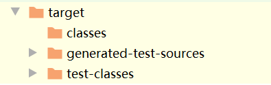

前几天刚学了maven基本知识, 正好今天想照着mybatis官方的pdf来一个quick start,于是打算用这个机会来实践一下maven工程.

开发工具: idea

---------------

踩了很多不该踩的坑,记录一下,防止来来回回的踩.

<!--more-->

~~过程和错误都是写博客的时候复现的~~

### 1. 编写pom.xml

这单纯是一个在<a href="https://mvnrepository.com">mvnrepository.com</a>搜索并复制坐标的过程. 

* 1号坑
  
  * ```
    Could not find artifact junit:junit:pom:4.0.12 in ...(指仓库id)
    ```

    这个问题还挺让人摸不着头脑的,第一次报的是这个错,第二次开始报的又是另一个错`Cannot resolve junit:junit:4.0.12`. 这种报错的方式很容易想到缓存机制,所以就去本地仓库里看了看,junit文件夹下确实有一个`4.0.12`文件夹,里面打开一看就两个.lastUpdate后缀的文件,就尝试着把文件夹删了,果然报错信息又回到了第一个版本.
  
  * 后来了解到是__版本号写错了__~~(4.12)~~,对于**在各种仓库找不到的依赖**,是这样处理的
  

### 2. test测试

确认依赖无误以后,先保证测试模块能够正常运作. 于是对test文件夹做了点操作

 

```java
//Hello.java 内容如下
public class Hello {
    @Test
    public void test1(){
        System.out.println("Hello");
    }
}
```

~~只要在输出框框里看到Hello就是我的胜利.~~所以就这样mvn test了

结果相当好看:

```java
[INFO] --- maven-surefire-plugin:2.12.4:test (default-test) @ maven1 ---
[INFO] ------------------------------------------------------------------------
[INFO] BUILD SUCCESS
[INFO] ------------------------------------------------------------------------
[INFO] Total time: 1.626 s
[INFO] Finished at: 2020-07-08T21:15:17+08:00
[INFO] Final Memory: 11M/44M
[INFO] ------------------------------------------------------------------------
```

__BUILD SUCCESS__了,说明就成功了,我还需要担心什么呢? 我没有看到我的__"Hello"__

* 2号坑: Hello去哪了
  * 一开始以为mvn test它就是不给我看输出的,感觉有点不人性化,应该有什么方法能看到输出.
  
  * 然后去网上一查,告诉我target下面会有输出日志,找`surefire-reports`就行了.然后发现连这个日志都没有给我
    
   
  * 冷静分析,忽然想到之前跟着学maven的时候测试都会给我测试结果:
  
     ```java
     -------------------------------------------------------
      T E S T S
     -------------------------------------------------------
     Running com.at.maven.HelloTest
     Tests run: 1, Failures: 0, Errors: 0, Skipped: 0, Time elapsed: 0.028 sec
     
     Results :
     
     Tests run: 1, Failures: 0, Errors: 0, Skipped: 0
     ```
  
     但是这次居然没有这样的测试结果.会不会是我的文件目录结构出现了问题? 对照了一遍发现两个module的结构基本没有区别. 又去找搜索引擎,才知道测试类有__命名规范(选其一)__:
  
     > 使用Test开头的文件名(Test*.java)
     >
     > 使用Test结尾的文件名(*Test.java)
     >
     > 使用TestCase结尾的文件名(*TestCase.java)
  
  * <small>附: 听说以Abstract开头可以使类被exclude在测试外,但是我尝试了却没有成功,先懵着.</small>

### 3. 总结

到现在为止遇到的坑都不算深,主要就是知识储备不足和粗心这种个人原因.

没有什么特别有价值的错误,但是需要记录以防止没有价值的错误一再发生. 

顺便希望自己能少一点面向搜索引擎,多自己思考,多做出自己的判断.

