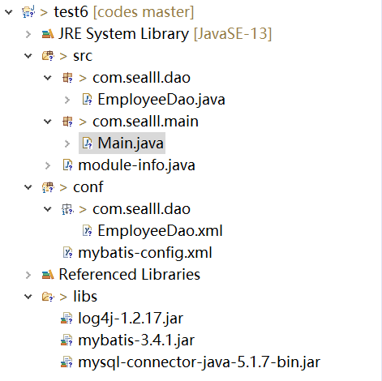
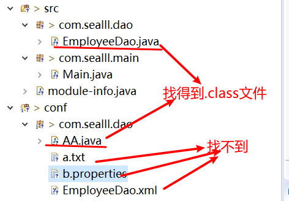
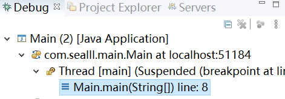
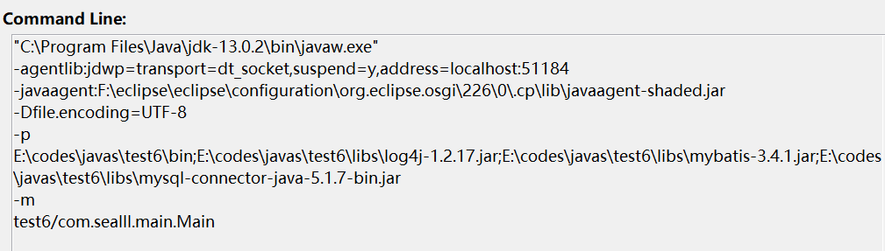
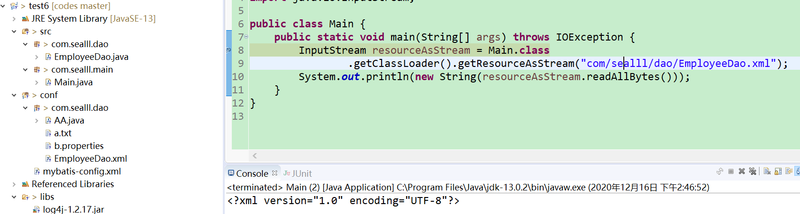
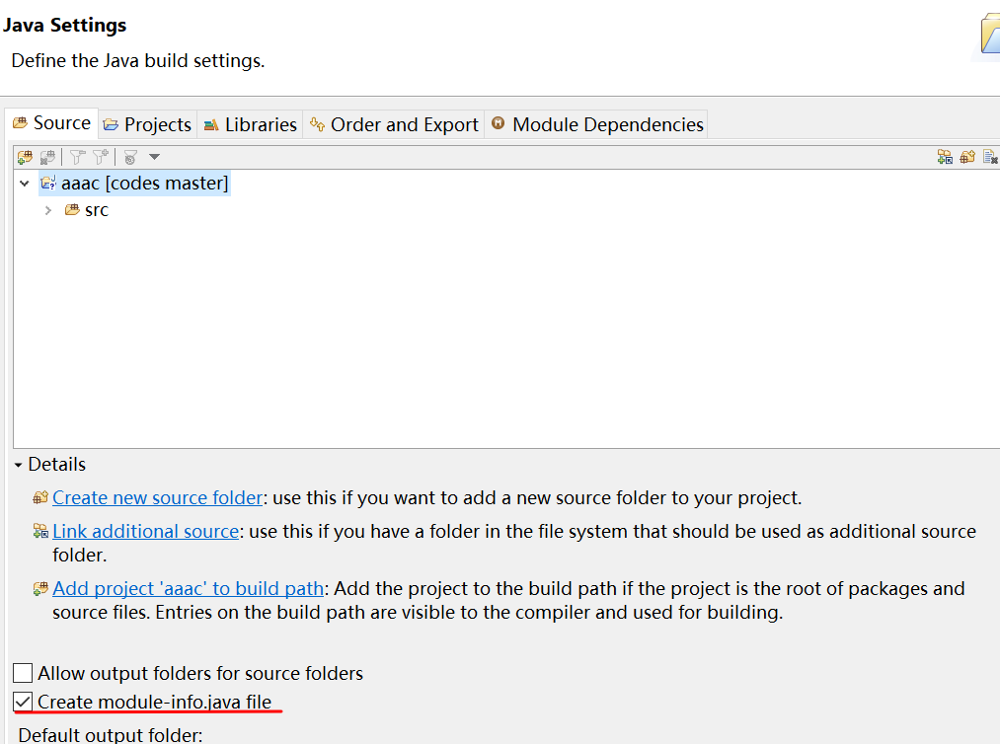
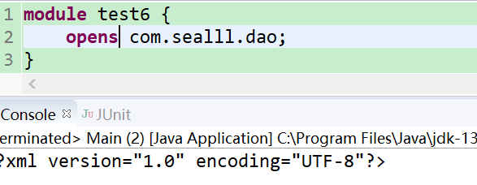

## 一. 环境介绍

* jdk version "13.0.2" 2020-01-14
* eclipse 2019-12
* 未使用maven
* 工程: 普通java工程,非web工程

其他注意点:

* jdk8及以下出现的类似问题不在本文讨论范围内

## 二. 问题现象

项目目录结构如图



1. mybatis的mappers使用package引入映射,但是却找不到dao包下的xml文件

2. 鉴于mybatis底层的Resources获取资源时采用的是`classLoader.getResourceAsStream()`,所以在

   Main.java中使用classLoader获取com.sealll.dao下的文件,也是找不到

```java
//Main.java
public class Main {
	public static void main(String[] args) throws IOException {
		InputStream resourceAsStream = Main.class
				.getClassLoader().getResourceAsStream("com/sealll/dao/EmployeeDao.xml");
		System.out.println(new String(resourceAsStream.readAllBytes()));//报空指针异常
	}
}
```

3. 前往该项目的bin目录下查看,EmployeeDao.xml又好好的躺在dao下


4. 向dao包增加各种文件,并逐个获取,结果如下: 只能找到.class文件,其他文件我们的classLoader全都视而不见

   

5. 来到bin目录,用java命令运行Main找EmployeeDao.xml却能正常的获取

```bash
E:\codes\javas\test6\bin> java com.sealll.main.Main
<?xml version="1.0" encoding="UTF-8"?>
```

## 三. 问题分析

### 1. 探究eclipse运行项目的方式

既然直接用java.exe运行能找到,那eclipse一定用了特别的方式来运行我们的Main.class

* 如何查看eclipse运行java的command

  * 给主程序(不是主程序也行)设置断点,debug并打开debug视图

    

  * 在左边debug视窗看到类似上图的样子,对准我这边focus的Main.main右键选择属性

  * 打开属性就能看到eclipse是用什么命令在运行Main.class了



* 要素提取:
  * `javaw.exe`: 可以简单理解为不用控制台的java.exe,在这个例子中和java.exe行为基本一致,后面我们用java.exe来模拟
  * `-p <模块路径>`: 可以看到这里-p把我们项目的bin目录和我们加入build path的jar包都加入到了模块路径
  * ` -m <模块>[/<主类>] `: 指定要运行的模块主函数

> -p和-m都是jdk9模块化引入的选项

这里eclipse没有直接使用`java 主类`的形式,而是采用了jigsaw的`java -p xxx -m 模块/主类`的形式运行,我们再来到bin目录模拟一下

```bash
# jar包对当前运行没有影响,所以不导入了
E:\codes\javas\test6\bin> java -p E:\codes\javas\test6\bin; -m test6/com.sealll.main.Main

Exception in thread "main" java.lang.NullPointerException
        at test6/com.sealll.main.Main.main(Main.java:10)
```

果然引入了模块系统就报异常了.

结论: **模块系统jigsaw的锅.**

## 四. 解决方案

这个问题我已经是第二次遇到了,上一次被坑的直接换用idea,百度也百度不到,谷歌只找到类似的问题却没有解决方案. 这次气的头铁就来自己探索了.

### 1. 换jdk8

没有模块系统解决100%的问题,什么spring没有requires,junit没有requires都省了

而且现在主流环境也是8.0及更早,越早换越好

### 2. 换用idea

其实大可不必,不过我第一次确实是这么解决的

### 3. 删除moudle-info.java/创建的时候不添加moudle-info.java

效果立竿见影,只要对准moudle-info.java来一个delete,立马解决问题



或者干脆在创建的时候就不要带它,创建工程时点一下next,然后取消勾选



### 4. 不能动moudle-info.java怎么办

其实问题的根源就在于你的模块没有把资源对外开放.

* 在moudle-info.java中开放com.sealll.dao包即可

  * `exports`的力度不够,要用`opens`

    ```java
    module test6 {
    	opens com.sealll.dao;
    }
    ```

    



## 五. 总结

模块化搞得真的有点麻烦,很多东西需要额外加一句exports,opens,requires

因为这原因出现bug上网查又查不到,会浪费了很多时间.