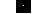

# Css/Js样式技巧

## 一. Css动画

### 1. @Keyframes关键帧

指定__@Keyframes__规则

* 语法:

  ```css
  @keyframes animationname {keyframes-selector {css-styles;}}
  /* animationname: 动画名,与后面animation对应 */
  /* keyframes-selector: 指定时间节点,取值可以是0-100%,from(即0),to(100) */
  /* css-styles: 该时间节点呈现的样式*/
  ```

* 实例:

  ```css
  .box1{
      height: 100px;
      width: 100px;
      background-color: blue;
      animation-name: ani1;
      animation-duration: 10s;
      position: absolute;
  }
  @keyframes ani1 {
      0%{top: 20px;}
      10%{top: 30px;}
      20%{top: 40px;}
      30%{top: 60px;}
      40%{top: 80px;}
      60%{top: 120px;
          background-color: red;}
      to{top: 30px;
          background-color: red;}
  }
  ```

  

### 2. 相关css属性

`animation-name`: 指定动画对应的@Keyframe名,默认none

`animation-duration`: 必须指定,动画完成时间,单位ms或s

`animation-delay`: 动画发生前的延迟,若为负值(-n s)则视为已经发生了n秒

`animation-iteration-count`: 动画运行次数

`animation-direction`: 指定动画方向,即可以完成倒放的操作

* 取值:
  * __normal__: 正常向前运行
  * __reserve__: 反向运行(倒放
  * __alternate__:先向前再向后
  * __alternate-reserve__: 先向后再向前

`animation-timing-function`: 规定动画的速度曲线。

- ease - 指定从慢速开始，然后加快，然后缓慢结束的动画（默认）
- linear - 规定从开始到结束的速度相同的动画
- ease-in - 规定慢速开始的动画
- ease-out - 规定慢速结束的动画
- ease-in-out - 指定开始和结束较慢的动画
- cubic-bezier(x1,y1,x2,y2) - 运行您在三次贝塞尔函数中定义自己的值

> 三次贝塞尔函数, 在平面上指定了两个点(x1,y1),(x2,y2)以及平面本身拥有的(0,0),(1,1)四点形成曲线
>
> 
>
> 

`animation-fill-mode`: 指定动画结束后元素的样式

* none: 保持动画前不变
* forwards: (动画结束后)保持最后一帧的样式
* backwards: (动画开始前,包括delay中)保持第一帧的样式
* both: 结合两者

### 3. 简写属性

`animation`可以将所有六个动画属性简在一起

## 二. 居中

### 1. 元素水平居中

__在设置<span style="color:red">块</span>元素宽度的情况下__(非100%),设置margin:auto可以造成居中

### 2. 文本水平居中

text-align: center

### 3. 垂直居中1

设置padding或者line-height

### 4. transform垂直居中

```css
.center p {
  margin: 0;
  position: absolute;
  top: 50%;
  left: 50%;
  transform: translate(-50%, -50%);
}
```

### 5. flexbox垂直居中

```css
.center {
  display: flex;
  justify-content: center;
  align-items: center;
  height: 200px;
  border: 3px solid green; 
}
```

## 三. css计数器

### 1. 流程

* 父(祖先)元素创建counter

* 子元素逐个增加并使用,主要用在before,after伪类

  * counter-reset
  * counter-increment
  * counter

  ```css
   <style>
  body{
      counter-reset: abc; /* 创建或重置计数器 */
  }
  .div1::before{
      counter-increment: abc;
      content: counter(abc);
  }
  </style>
  ```

> 伪类的content可以用空格拼串
>
> ```css
> content: "Section " counter(abc);
> ```
>
> 

### 2. 嵌套计数器

使用`counters()`可以在不同嵌套级别下创建不同的计数器

```css
ol {
  counter-reset: section;
  list-style-type: none;
}

li::before {
  counter-increment: section;
  content: counters(section,".") " ";/* 以.分隔的层级计数 */
}
```

## 四. 图像边框

### 1. 介绍

可以将图片作为边框,前提是border属性生效

一个图片将被分为九块,分别作为边框的边和角,中间部分将被丢弃

`border-image-source`: 指定图片

`border-image-slice`: 一般来说,需要指定四个数字,分别是,上,右,下,左切片的偏移(一张图被分为9块)

可以省略,对应规则和border相同,可以指定__fill__,则不会丢弃中间部分(即四角都是完整图片)

* 没有用fill的效果:


`border-image-width`: 指定边框图像宽度,下图为指定后效果


`border-image-outset` 指定可以超出盒子的量,指定数字为width的倍数或者长度单位

```
stretch|repeat|round;
```

看不懂,用不懂

## 五. 阴影

### 1. text-shadow

语法:

```css
text-shadow: 水平偏移量 垂直偏移量 [模糊距离] [阴影尺寸] [颜色]
```

> 可以创建不止一个阴影,用逗号分隔
>
> 为文字添加边框:  text-shadow: -1px 0 black, 0 1px black, 1px 0 black, 0 -1px black;

### 2. box-shadow: 和text-shadow语法完全相同

## 六. 文本效果

### 1. 文本溢出


#### 1.1 溢出隐藏

* 使用前提: white-space: nowrap杜绝换行,overflow:hidden隐藏溢出
* 此时文字以clip的方式隐藏中

`text-overflow`指定文本溢出后的隐藏行为

* __ellipsis__: 使用省略号并隐藏
* __clip__: 修剪,无省略号(默认值)
* __string__: 用指定文本替代溢出文本

#### 1.2 换行

`word-break`: 指定换行时机

| normal    | 使用浏览器默认的换行规则。     |
| --------- | ------------------------------ |
| break-all | 允许在单词内换行。             |
| keep-all  | 只能在半角空格或连字符处换行。 |

## 附. 角度单位

css中一共有4个角度单位:

`deg`: 标准度数,一圈有360deg

`grad`: 梯度,一圈有400grad

`rad`: 弧度,一圈有2pi rad

`turn`: 转, 一圈等于1turn

## 七. transform

transform是一个css属性,用于转换实体的2D,3D样式

### 1. 2D转换(transform)

2D转换的是在二维上的旋转,缩放,倾斜(基于矩阵)

#### 1.1 移动元素

`translate(x,y)`  将当前元素向右移动x,向下移动y,可以负值

* 注意点:
  * 不会改变定位, 会根据定位的位置移动
  * 不会影响布局

```css
.box2{
    transform: translate(100px,100px);
}
```

#### 1.2 旋转元素

`rotate(角度)`让元素顺时针旋转,可以指定负值

* 轴在图形中心

  ```css
  transform:rotate(20deg);
  height: 100px;
  width: 100px;
  border: 1px black solid;
  ```

  

<div class="box2" style="transform:rotate(20deg);height: 100px;
            width: 100px;
            border: 1px black solid;"></div>

#### 1.3 缩放

`scale(a,b)`将元素的x缩放为原来的a倍,y缩放为原来的b倍

* 注意:
  * 会连同margin,padding,border,字体一起翻倍

也可以`scaleX(a)`,`scaleY(b)`分别扩大x轴和y轴的图形

#### 1.4 元素拉伸倾斜

`skewX(角度)`使元素x轴按角度倾斜,效果如下

> 角度逆时针为正

<div class="box2" style="height: 100px;
            width: 100px;
            border: 1px black solid;
            margin-top: 10px;transform: skew(20deg);">aaaaaaaaaaaaaaaaa</div>

```html
<div class="box2" style="height: 100px;
            width: 100px;
            border: 1px black solid;
            margin-top: 10px;transform: skew(20deg);">aaaaaaaaaaaaaaaaa</div>
```

`skewY(角度)`,`skew(X,Y)`同理

#### 1.5 2D转换总方法

`matrix(scaleX,scaleY,skewX,skewY,translateX,translateY)`将上面大多数方法融合在一起

> 注意: skew合理使用可以达到旋转效果

### 2. 3D转换

3D转换增加了z轴的方法

#### 2.1 3D旋转

`rotateX(角度)`绕X轴旋转,从左向右看,顺时针为正方向

`rotateY`绕Y轴旋转,看不清正方向

`rotateZ`绕Z轴旋转,Z轴垂直屏幕,看着屏幕是顺时针

#### 2.2 其他

| matrix3d(*n*,*n*,*n*,*n*,*n*,*n*, *n*,*n*,*n*,*n*,*n*,*n*,*n*,*n*,*n*,*n*) | 定义 3D 转换，使用 16 个值的 4x4 矩阵。   |
| ------------------------------------------------------------ | ----------------------------------------- |
| translate3d(*x*,*y*,*z*)                                     | 定义 3D 转化。                            |
| translateX(*x*)                                              | 定义 3D 转化，仅使用用于 X 轴的值。       |
| translateY(*y*)                                              | 定义 3D 转化，仅使用用于 Y 轴的值。       |
| translateZ(*z*)                                              | 定义 3D 转化，仅使用用于 Z 轴的值。       |
| scale3d(*x*,*y*,*z*)                                         | 定义 3D 缩放转换。                        |
| scaleX(*x*)                                                  | 定义 3D 缩放转换，通过给定一个 X 轴的值。 |
| scaleY(*y*)                                                  | 定义 3D 缩放转换，通过给定一个 Y 轴的值。 |
| scaleZ(*z*)                                                  | 定义 3D 缩放转换，通过给定一个 Z 轴的值。 |
| rotate3d(*x*,*y*,*z*,*angle*)                                | 定义 3D 旋转。                            |
| rotateX(*angle*)                                             | 定义沿 X 轴的 3D 旋转。                   |
| rotateY(*angle*)                                             | 定义沿 Y 轴的 3D 旋转。                   |
| rotateZ(*angle*)                                             | 定义沿 Z 轴的 3D 旋转。                   |
| perspective(*n*)                                             | 定义 3D 转换元素的透视视图。              |

## 八. css过渡

`transition`让元素能平滑的改变css属性

* 要点:
  * 要平滑改变的css属性
  * 平滑改变的时间(必须指定)
  * css属性可以是transform

### 1. 实例1: hover改变宽度

```css
transition: 样式属性(transition-property) 时间(transition-duration),样式属性 时间...
```

```css
.box1{
    height: 100px;
    width: 100px;
    background-color: red;
    transition: width 2s;
}
.box1:hover{
    width: 300px;
}
```

### 2. 过渡速度曲线

`transition-timing-function`规定速度曲线,和动画的timing-function完全一致

### 3. 延迟

`transition-delay`

## 九. 工具提示

工具提示提供一种类似效果的css样式: 


### 1. 思想

创建一个包含span的div,div中为显式的内容,span中为提示的内容

并设置两者的样式

```css
<div class="box1">
    吃饭
    <span class="hov">喝水</span>
</div>
```

将span的visibility设置为hidden,并设置hover visible

```css
.hov{
    text-align: center;
    background-color: black;
    color: white;
    width: 90px;
    display: inline-block;
    border-radius: 15px;
    visibility: hidden;
}
.box1:hover .hov{
    visibility: visible;
}
```

效果:


### 2. 定位

给父元素div添加相对定位,给span添加绝对定位

然后给span设定left和top即可

> 设置提示: left或者right设置100%可以正好贴在右边/左边,设置top时要注意到padding
>
> 设置在顶部时可以设置`left:50%;margin-left:-一半span`来达到居中效果

### 3. 箭头

箭头通过`::after`以及border实现

* 原理

  * `::after`的content设置为空,给::after进行绝对定位,确定它的位置(比如下方就是left:50%;top:100%;margin-left: 5px;(假设border设置为5px)
  * 给::after设置5px的边框,完整边框效果如下,实际上对于每个方向该边框都是5px高的三角形

  

  * 将其他三面的border颜色设置为transparent,独留最上面那部分

    

> 注意: 在定位的时候宜只使用100%和50%,万不能出现0,比如在左边箭头设置right:100%

```css
.hov::after{
    content: " ";
    position: absolute;
    top: 50%; /* At the bottom of the tooltip */
    right: 100%;
    margin-top: -5px;
    border-width: 5px;
    border-style: solid;
    border-color: transparent black transparent transparent;
}
```

### 4. 出现/消失过渡

为了实现过渡效果,我们可以将visibility改为opacity

```css
/*visibility: hidden;*/
opacity: 0;
transition: opacity 0.5s;
```

```css
.box1:hover .hov{
    /*visibility: visible;*/
    opacity: 1;
}
```

## 十. 图像填充

object-fit 属性可接受如下值：

- fill - 默认值。调整替换后的内容大小，以填充元素的内容框。如有必要，将拉伸或挤压物体以适应该对象。
- contain - 缩放替换后的内容以保持其纵横比，同时将其放入元素的内容框。
- cover - 调整替换内容的大小，以在填充元素的整个内容框时保持其长宽比。该对象将被裁剪以适应。
- none - 不对替换的内容调整大小。
- scale-down - 调整内容大小就像没有指定内容或包含内容一样（将导致较小的具体对象尺寸）

## 十一. 分列

css自带分列系统,在文本过长时会分列

### 1. 基本属性

`column-count`: 父元素使用,规定该元素能分成多少列

`column-gap`: 父元素使用,规定列间距离

`column-rule-style/color/width`: 列间边框,用法和border一样,可以简写成column-rule

`column-span` 属性规定元素应跨越多少列

`column-width` 属性为列指定建议的最佳宽度。

## 十二. css变量

### 1. 定义和使用

`全局作用域变量`: 声明在__:root__选择器下

`局部作用域变量`: 声明在选择器中

在两者都有的时候,局部作用域优先

声明语法: `变量名: 变量值`

* 变量名: 必须以__`--`__开头

使用语法: `var(变量名,[value(默认值)])`

实例:

```css
:root {
  --blue: #6495ed;
  --white: #faf0e6;
}

body { background-color: var(--blue); }
```

### 2. js访问(获取/修改)css变量

使用类似以下dom语法:

```js
footer.style.setProperty('--palatte-padding-left', this.value + 'px')
```

## 十三. 布局

### 1. box-sizing

规定height和width适用范围,传统意义上只包含内容区,box-sizing可以使其包含padding和border

| 值          | 描述                                                         |
| :---------- | :----------------------------------------------------------- |
| content-box | 这是由 CSS2.1 规定的宽度高度行为。宽度和高度分别应用到元素的内容框。在宽度和高度之外绘制元素的内边距和边框。 |
| border-box  | 为元素设定的宽度和高度决定了元素的边框盒。就是说，为元素指定的任何内边距和边框都将在已设定的宽度和高度内进行绘制。通过从已设定的宽度和高度分别减去边框和内边距才能得到内容的宽度和高度。 |
| inherit     | 规定应从父元素继承 box-sizing 属性的值。                     |

### 2. flex

称为flexbox布局

* 基本准备:
  * 父元素,又称为__flex容器__,设置display:flex,此时子元素会自动称为弹性布局的部分

#### 2.1 flex-direction

`flex-direction`指定子元素堆叠方向,应用于flex容器


* 取值:

  * **column:** 从上到下排列(从容器顶部开始)

  * **column-reverse:** 从下到上排列(从容器底部开始)

    

  * **row/row-reverse**: 水平排列,从左到右/从右到左(从右边开始)


#### 2.2 flex-wrap

`flex-wrap`主要处理子元素是否换行的问题

对于纵向排列的来说,换行即换到右边一列

* 取值:
  * __wrap:__ 必要时换行
  * __no-wrap__: 不换行(默认)
  * __wrap_reverse__: 向上换行

#### 2.3 flex-flow

flex-warp+flex-direction的简写属性

#### 2.4 justify-content

`justify-content`规定子元素们对容器的对齐方式,无论是横向还是纵向

比如水平排列,就调整水平对齐; 垂直同理

* 取值:
  * `flex-start`: 默认,元素的起始对齐容器的起始
  * `flex-end`: 元素的末尾对齐容器的末尾
  * `center`: 元素的中轴和容器的中轴对齐
  * `space-around`: 在元素的左右都一定空白
  * `space-between`: 在元素之间有一定空白,使元素能和start与end对齐,如果已经溢出不会生效

#### 2.5 align-items

`align-itms`规定**单行**子元素的垂直对齐方式,比如水平排列规定垂直对齐

* 取值
  * `flex-start`: 默认,元素的起始对齐容器的起始
  * `flex-end`: 元素的末尾对齐容器的末尾
  * `center`: 元素的中轴和容器的中轴对齐
  * `space-around`: 在元素的左右都一定空白
  * `space-between`: 在元素之间有一定空白,使元素能和start与end对齐,如果已经溢出不会生效
  * `stretch`: 拉伸以填充容器(水平时垂直拉伸填满)
  * `baseline`: 基线对齐

#### 2.6 align-content

`align-content`适合__多行子元素__的垂直对掐方式

最重要的和上面的区别就是在最后一行会留出空白

取值

* `flex-start`: 默认,元素的起始对齐容器的起始
* `flex-end`: 元素的末尾对齐容器的末尾
* `center`: 元素的中轴和容器的中轴对齐
* `space-around`: 在元素的左右都一定空白
* `space-between`: 在元素之间有一定空白,使元素能和start与end对齐,如果已经溢出不会生效
* `stretch`: 拉伸以填充容器(水平时垂直拉伸填满)
* `baseline`: 基线对齐

### 3. flex item

父元素称为flex容器后,子元素会自动成为flex itme

flex item适用的属性如下:

#### 3.1 order

设置子元素顺序,order必须是数字,__越小越靠前__

#### 3.2 flex-grow

布局的时候会留下一些空白,默认flex-grow: 0,即认为该item不会增长去占有空白

当给item设置flex-grow后,item会根据权重去争夺空白,最后根据权重获得对应比例的空白


#### 3.3 flex-shrink

默认flex-shrink为0,在子元素超出flex容器时不会做出反应

当flex-shrink不为0时,子元素会按照设置的比例进行收缩

#### 3.4 flex-basis

指定flex item在主轴上的

#### 3.5 flex

上面三个属性按顺序合成就是flex属性了

#### 3.6 align-self

对单独flex item使用,覆盖align-items的行为

取值和align-items相同

## 十四. 媒体查询

### 1. 介绍

css3添加了基于以下参数的媒体查询:

* 视窗的宽高
* 设备的宽高
* 方向(横向/纵向)
* 分辨率

### 2. 选择器语法

```css
@media not|only mediatype and (expressions) {
  CSS-Code;
}
```

mediatype: all,print,screen,speech

### 3. 实例:

```css
@media screen and (min-width: 480px) {
  body {
    background-color: lightgreen;
  }
}
```

