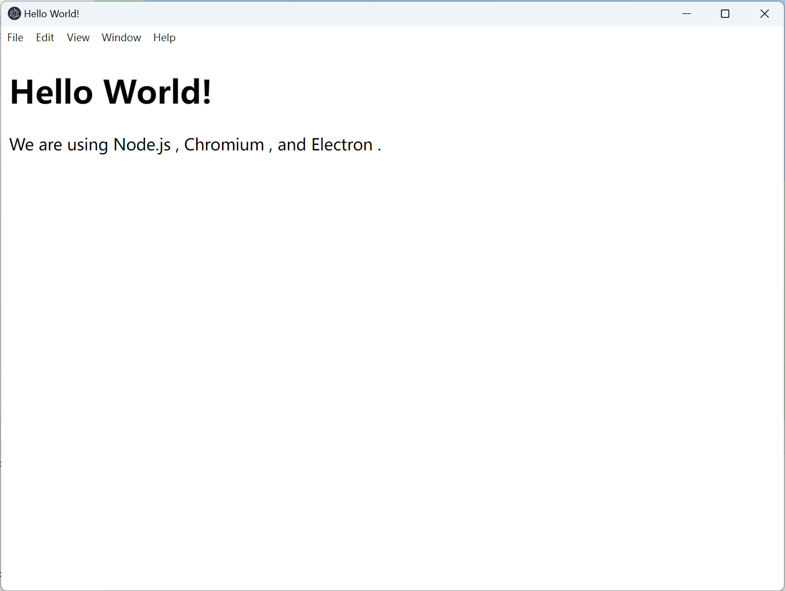

# Electron.js

是一个用html+css+js做桌面应用的node系统

## 一. 简单构建

### 1. 安装启动

```
npm init # 这一步可以设置main.js为主文件
npm install --save-dev electron
```

package.json中的设置

```
{
  "scripts": {
    "start": "electron ."
  }
}
```

启动方式

```
npm start
```

### 2. 跟着实例创建页面

index.html在主目录下

```html
<!DOCTYPE html>
<html lang="en">
  <head>
    <meta charset="UTF-8">
    <!-- https://developer.mozilla.org/en-US/docs/Web/HTTP/CSP -->
    <meta http-equiv="Content-Security-Policy" content="default-src 'self'; script-src 'self'">
    <title>Hello World!</title>
  </head>
  <body>
    <h1>Hello World!</h1>
    We are using Node.js <span id="node-version"></span>,
    Chromium <span id="chrome-version"></span>,
    and Electron <span id="electron-version"></span>.
  </body>
</html>
```

然后在main.js中装载

```js
const { app, BrowserWindow } = require('electron')

const createWindow = () => {
    const win = new BrowserWindow({
        width: 800,
        height: 600
    })

    win.loadFile('index.html')
}
// Promise: ready后
app.whenReady().then(() => {
    createWindow()
})
```

然后启动就好了



### 3. 打包

```
npm install --save-dev @electron-forge/cli
npx electron-forge import
```

这样package.json就会有make命令