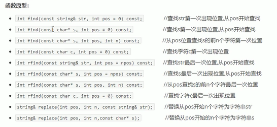

# C++碎片整理

## 一. const

const即不变

1. const修饰的局部变量不进入全局区

2. const修饰指针时:

   ```C++
   const int * a;// const在*前,内容不变,包括结构体的字段之类的任何内容
   int * const b;// const在*后,指针不变
   //以上两点对形参也有效,但后者其实没什么用
   
   const int * a,b; //b:const int,共享const
   int * const a,b; //b: int
   const int * a,*const b;//猜猜看
   ```

<u>实际上 const int * 就是指向const int 的指针,两者应该属于对应关系; const int 的地址无法赋值给int *</u>

## 二. 引用

### 1. 引用

引用的特点: 

1. 初始化时将变量传入,则称为该变量的引用

2. 引用的指向不会改变,后续赋值操作的都是被引用变量

3. 无法引用const常量

   ```c++
   int &b = a;//b是指向a的引用
   b = c;//将c赋值给a
   ```

引用的本质:

1. 初始化时称为指针常量

2. 使用时采用取值符号

   ```c++
   int &b = a;//int * const b = &a;所以必须引用一块合法的内存空间
   b = c;//*b = c;
   ```

### 2. 常量引用

常量引用主要应用于形参,防止对值的修改

1. 对变量引用的情况:

   ```c++
   int & ref = 10;//不可行,引用必须指向一块合法的内存空间
   const int & ref = 10;//可行,编译器会将10赋值给临时变量,然后ref引用这个变量;ref只读,不可修改
   ```

   

## 三. 函数

### 1. 默认参数

1. <u>函数如果声明时写了默认参数,实现就不需要(不能)写默认参数</u>

### 2. 占位参数

作用就是占一个参数位置(?),在运算符重载时展开

```c++
//语法
int abc(int a,int,int b) { // 只声明类型不声明形参,成为占位参数
	return a + b;
}
int bcd(int = 10);//占位参数可以有默认,语法如此句

int main() {
	cout << abc(10,10,10) << endl; //调用时需要传(没有默认值的情况下)
	system("pause");
	return 0;
}
```

### 3. 重载

给几个例子,自己领悟

```c++
//float,double对比
int abc(double a) {
	
	return (int)(a + 1);
}
int abc(float a) {

	return (int)a;
}
int main() {
	cout << abc(10.0f) << endl; // 10
	system("pause");
	return 0;
}
```

```c++
//const例子对比
int abc(const float a) {
	
	return (int)(a + 1);
}
int abc(float a) {

	return (int)a;
}
int main() {
	cout << abc(10.0f) << endl; //报错
	system("pause");
	return 0;
}
```

```C++
//引用/非引用对比
//结论: 当传入变量(可引用的右值)时,报错; 传入不可引用的右值时,调用下面的
//如果引用含有const,会有临时变量的情况狂,基本都会报错
int abc(float &a) {
	return (int)(a + 1);
}
int abc(float a) {
	return (int)a;
}
```

```c++
//const引用对比
//结论: 当传入的是 const float类型 或 const float & 或 不可引用的右值(会创建临时变量) 的对象时,匹配const float&
//否则选择float &
//不报错
int abc(float &a) {
	return (int)(a + 1);
}
int abc(const float &a) {

	return (int)a;
}
```

# C++面向对象

## 一. 创建类

强行写一个案例

```C++
class Circle{
private: //权限修饰,默认为private
	int radius; //属性
public:
	Circle(int radius = 10) { //方法
		this -> radius = radius;
	}
	double getPerimeter() {
		return 3.14 * 2 * 10;
	}
};
int main() {
	Circle * a = new Circle(100); //new一个circle指针,记得释放
    //Circle c(100);这样其实就创建了一个对象,不一定要new
	cout << a->getPerimeter() << endl; // 指针所以使用->调用方法
    delete a;
	system("pause");
	return 0;
}
```

### 2. 构造函数

* 用户提供了**有参构造**,系统**默认提供拷贝构造**(浅拷贝)
* 用户提供**拷贝构造,****编译器不会提供任何构造函数**

众所周知,构造函数分为普通和拷贝,在声明对象时有所区别:

```c
Person p1(10);//应对Person(int a);
//Person p2(); 注意: 不能用括号声名无参,会被认为是函数声明

//显式赋值
Person p2 = Person(10); //调用的是对应的构造函数,不是拷贝构造
//隐式赋值
Person p4 = 10; // 语义同上

Person p3 = Person(p2); // 调用一个拷贝对象
Person p5 = p2;
//拷贝构造函数不能声明匿名对象(匿名对象创建后立刻析构)
//Person(p4); 会被编译器翻译成 Person p4;
```

### 3. 拷贝构造函数

场合:

1. 初始化

2. **值**传递函数参数

3. **值**返回值局部对象
   
   * 注意: 引用传递没有这问题
   
   * **根据局部变量的值拷贝出一个新的临时变量,返回出去**

```C++
class Person {
public:
	Person() {
		cout << "无参构造" << endl;
	}
	Person(const Person & p) { //const 类&是拷贝构造的标准形式,有默认形式(浅拷贝)
		cout << "拷贝构造" << endl;
	}
	~Person() {
		cout << "析构" << endl;
	}
};
int main() {
	Person p;
	Person p1 = p;//等价于Person(p);
	system("pause");
	return 0;
}
```

### 4. 初始化列表

就是简化构造赋值的一种语法

```C++
class Person {
public:
	int a;
	int b;
	public Person() :a(10), b(20) {

	}
    //或者使用参数
    public Person(int a,int b) :a(a), b(b) {

	}
}
```

### 5. 组合

```c++
class A{}
class B{
	A a;
}
//构造顺序: B-A,初始化列表在构造函数之前
//但是另一个角度看,A的构造完成早于B的构造完成
//析构开始的顺序: B-A
```


### 6. 静态

类内声明,类外初始化(就算是private也是类外初始化)

Person::a = 1;

对象访问: p.a;

类名访问: Person::a;

### 7. 对象占用

完全空的对象占用1字节;

不是空的就按照属性的大小加起来,struct记得8字节对齐

## 二. 怪语法

### 1. 空指针调用成员函数

```c++
class Person1 {
public:
	void abc() {
		cout << "abc" << this << endl;//this就是null,不能访问属性
	}
};

int main() {
	Person1 * p = NULL;//空指针调用函数
	p->abc();
}
```

### 2. 常函数/常对象

常函数

1. 常函数内不可以修改类对象属性
2. 属性声明时添加`mutable`后,可以在常函数中修改

```c++
class Person1 {
public:
	void showPerson() const { //const放在参数列表之后,相当于对this修饰了const *
		//a = 100; 不能改
		b = 100; //可以改
	}
	int a;
	mutable int b;
};
```


常对象

1. 常对象**只能调用常函数**
2. 只能**修改mutable的属性,其他的都不能改**

```c++
int main() {
	const Person1 p;
}
```

### 3. 友元

友元割让一个函数/类访问类中私有成员

#### 3.1 友元全局函数

```c++
class Person1 {
	Person1(){
		abc = 1;
	}
	friend void cba(Person1 & a);//友元声明放类中
private:
	string abc;
};
void cba(Person1& a) { //声明在类外,可以访问私有变量
	cout << a.abc << endl;
}
```

#### 3.2 友元类

```c++
class Person1 {
	friend class Abc;//就friend class 类;
public:
	Person1(){
		abc = 1;
	}
private:
	string abc;
};
```

#### 3.3 友元方法

```c++
class Abc {
	
public:
	void visit(Person1 & p);
};
class Person1 {
	friend void Abc::visit(Person1 & p);//就..就这样
public:
	Person1(){
		abc = 1;
	}
private:
	string abc;
};
void Abc::visit(Person1 & p) {
	cout << p.abc << endl;
}
```

## 三. 运算符重载

对于内置数据类型,编译器默认运算符运算

对于声明类,需要运算符重载

### 1. 常规二元运算符

1. 局部重载(类中重载): 只需要一个参数,另一个参数是this自身
2. 全局重载: 需要两个参数
3. 另外重载: 可以不传入对象引用而传入其他类型,比如p+10

```c++
class Person2 {
public:
	int a;
	Person2():a(1){}
	Person2 operator+(Person2 & p) { //返回值非引用,每次返回都会创建新的临时变量,其实返回值是啥都行
		this->a = p.a;
		return *this;
	}
};
int main() {
	Person2 p, q;
	Person2 x = p + q;
    //p.operator+(q)
	cout << x.a << endl;
	system("pause");
	return 0;
}
```

全局重载:

```c++
Person2 operator+(Person2 & p, Person2 & q) {
	q.a = p.a;
	return q;
}
//operator+(p,q);
```

### 附. 左移运算符实现toString效果

```c++
ostream& operator << (ostream& cout, Person2& p) { // 重载就完了,可以友元
	cout << p.a;
	return cout;
}
int main() {
	Person2 p, q;

	cout << p;
	system("pause");
	return 0;
}
```

### 2. 单目运算符: ++

++分为前置和后置,语法分别为:

```c++
//前置运算符: 常规定义
Person& operator++() {// 返回引用
    a++;
    return *this;
}
//后置运算符: 占位int
Person operator++(int) {//占位参数表示后置,返回值
    Person p = *this;
    a++;
    return p;
}
```

### 3. 特殊: 赋值运算符

编译器会提供**默认的operator=**操作,即**浅拷贝**

## 四. 继承

### 1. 语法

```c++
class BestPerson :public Person { //公共继承

};
```

* 公共继承:
  * 不能继承private,其他权限符的依旧保持父类原样
* 保护继承:
  * 公共-保护权限,不能继承private
* 私有继承:
  * 公共和保护->私有,不能继承private

### 2. 同名成员

通过子类对象访问父类同名成员

```c++
a.Base::b;//
```

如果方法重名

* 子类会隐藏父类所有的重载方法
* 用Base::b这种语法访问

静态成员重名:

* 用对象访问,用`父类::`;

* 通过类名访问,`类::父类::同名`,类名访问父类作用域下的静态变量

### 3. 多继承

(憨批语法)

`class 类:权限 父类,权限,父类`

父类同名成员用父类修饰符`父类::成员`

### 附. 菱形继承问题

菱形继承形态的问题是我们对同一个字段出现了两个或多个,与我们期望的不符(我们期望只有一个)

我们使用__虚继承__来解决(即中间层继承顶层的时候采用虚继承)

* 虚继承是专门解决这个问题产生的,在权限前加virtual形成虚继承
* 本质上是虚继承的类可以**共享一个基类,**在类对象中产生指针指向同一份基类实例地址

## 五. 多态

### 1. 多态的复杂语法

* 前提:
  * 是父类的**指针或者引用**
  * 调用的父类方法是**virtual函数**(否则不能完成重写,依然运行父类方法)
  * 子类重写依然是虚函数,但是不需要加virtual

### 2. 原理

**虚函数**: 给类实例中添加了一个4字节大小的<u>vfptr(虚函数指针)</u>,指向一个虚函数表(vftable);**子类继承时会将该指针继承**,如果发生了重写,就覆盖父类的vfptr,该指针指向自己重写的函数;在调用时根据vfptr前往调用

### 3. 纯虚函数,抽象类

纯虚函数:

```c++
virtual void func(int a)=0;
```

含有纯虚函数的类叫做抽象类,和java抽象类行为差不多

### 4. 虚析构/纯虚析构

纯虚析构也会造成抽象类,但是纯虚析构需要在类外实现(?)

跟普通函数的行为一样

# C++提高

## 一. 模板(泛型)

### 1. 函数模板

声明:

```c++
template<typename T> // 把typename换成class也行
T a();
```

实例:

```C++
template<class T>
void swap(T &a, T &b) {
	T temp = a;
	a = b;
	b = temp;
}
```

调用:

1. 自动类型推导(必须T类型一致)

   不接受隐式类型转换

2. 显式指定类型(接收隐式类型转换)

   ```c++
   swap<int>(a,b);
   ```

原则: 优先调用普通函数,使用空模板参数类表强制重载

如果函数模板匹配的更好,选择函数模板

# STL


## 一. string

### 1. 构造函数

```c++
string();
string(const char* s);
string(const string& str);
string(int n,char c);//使用n个c

```

### 2. 赋值

```c++
string & operator=(const char* s);
string & operator=(const string& s);
string & operator=(char c);

string & assign(const char* s);
string & assign(const char* s,int n);//前n个
string & assign(const string & s);
string & assign(int n,char c);
```

### 3. 拼接

```c++
+=(const char*str);
+=(const char c);
+=(const string & str);
append(const char * s);
append(const char * s,int n);
append(const string & s);
aooend(const string & s,int pos,int n);
```

### 4. 查找和替换



### 5. 访问字符

`size()`

`[]`: 下标访问字符,**可读可写**

`at(i)`: 方法访问字符,**可读可写**

### 6. 插入和删除

```c++
str.insert(index,(char,char*,string,(n,c)));
str.erase(start,n);
```

### 7. 子串

`substr(start,n)`

## 二. vector

### 1. 示范

```c++

#include<vector>
void test01() {
	vector<int> v;
	//增加示范
	v.push_back(10);

	//声明迭代器,指针指向第一个元素,v.rbegin指向右边第一个元素
	vector<int>::iterator itBegin = v.begin();
	//指针指向容器中元素的下一个位置,rend指向-1
	vector<int>::iterator itEnd = v.end();

	while (itBegin != itEnd) { // 重载运算,两个指针没有指向同一个位置
		cout << *itBegin << endl; //取址符取出元素
		itBegin++; //自增符指向下一个元素
	}
}
```

进阶遍历:

```c++
for (vector<int>::iterator it = v.begin; it != v.end; it++) {
	//const_interator 表示只读
}
```

stl算法遍历:

```c++
#include<algorithm>
void myPrint(int val) {
	cout << val << endl;
}
void test01() {
	vector<int> v;
	for_each(v.begin(), v.end(), myPrint);
	cout << myPrint << endl;
}
```

### 2. 特点

1. 可以动态拓展,通过拷贝到更大的内存空间拓展
2. 概念上又称为单端数组,只能尾插尾删,是栈
3. 底层是数组,即线性表

### 3. 构造函数

```c++
vector<T> v;//空参模板
vector(v.begin().v,end());//将两个迭代器(包含)之间的元素拷贝构造
vector(n,elem); // 将n个elem拷贝过来
vector(const vector & vec);//拷贝构造
```

### 4. vector赋值

`vector & operator=(const vector & vec)`重载赋值运算符,只传递元素

`assign(beg,end)` beg,end指的是首和尾的迭代器

`assign(n,elem)`

### 5. 容量和大小方法

```c++
v.empty(); //bool 判断是否为空
v.capacity(); //容量
v.size(); //元素个数
v.resize(int num); //重新指定vector大小,如果比原来大就填充默认值,比原来小就删除多出来的
v.resize(int num,T elem);//填充elem
```

### 6. 插入删除方法

```c++
v.push_back(ele);//添加最后一个元素
v.pop_back();//删除最后一个元素
v.insert(iterator pos,ele);//向迭代器位置插入元素
v.insert(iterator pos,int n,ele);//向迭代器位置插入n个元素
v.insert(iterator pos);//迭代器删除元素
v.insert(iterator pos,iterator end);//删除闭区间元素
v.clear();//清除容器元素
```

### 7. 数据访问

```c++
v.at(int index);
v[index];
v.front();//第一个元素
v.back();//最后一个元素
```

### 8. 交换vector元素

```c++
v.swap(vec);//互换元素,本质交换指针
```

实际用途:

1. 收缩内存空间

   当vector的容量扩大到过大时,我们可以使用swap跟自己的拷贝构造出的对象交换,capacity会进行收缩(实际上就是利用匿名对象回收指针来回收空间)

### 9. 预留空间

功能: 减少vector在动态拓展容量时的拓展次数

```c++
v.reserve(int len); // 预留位置不初始化,元素不可访问
```

## 三. deque

双端数组,即队列,底层是__中控器数组__,存储着各个**缓冲区**的地址

push_front,push_back()

pop_front,pop_back

push_front,push_back

### 1. 构造函数

和vector一样

```
<T>
(beg,end)
(n,ele)
(const deque &)
```

### 2. 赋值和大小操作

和vector一样,但是没有容量概念

# 备选

## 一. 类型大小

### 1. 整型

1. `short`: 2
2. `int`: 4
3. `long`: win4,linux: 32-4,64-8
4. `longlong` : 8

### 2. 浮点型

`float`: 4

`double`: 8