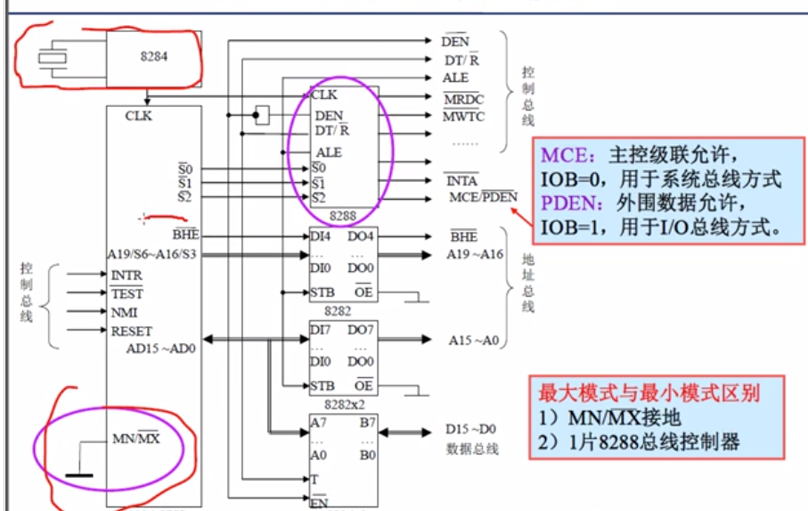
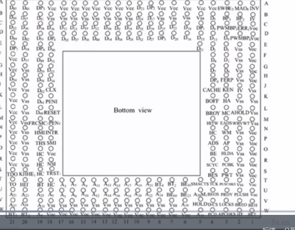
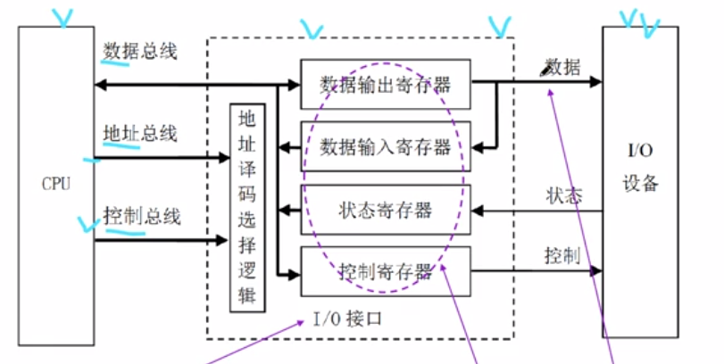
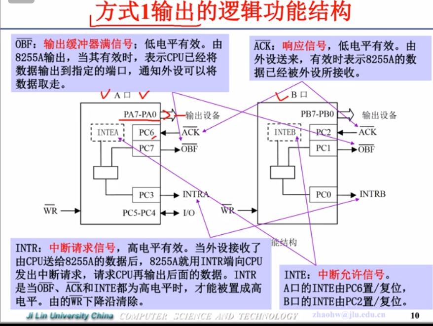

# 微机系统

## 一. 绪论

### 1. 微型计算机

计算机: 运算器,控制器,存储器,I,O

计算机的五个种类: 巨型机,大型机,中型机,小型机,__微型计算机(单板机,单片机)__

微型计算机系统=微型计算机+IO设备

微机特点: 集成度高,体积小,维护方便,应用广,低廉

结构:

划重点: **DB,AB,CB**

### 2. 性能指标

* __字长__: 计算机一次能处理二进制数的位数,与CPU寄存器位数有关.
  * 越长,精度越高,功能越强,主存容量越大
  * 一般是字节的倍数
* __主频__: CPU的始终频率.主频高低很大程度决定了计算机运算的速度
  * 单位MHz(兆赫)
    * 8086: 4.77~10MHz
    * 80386: 20MHz~50MHz
* __主存容量__: 主存能够存储的信息量,一般用二进制位或字节数表示
* __存储速度__:
  * 由__存取时间__和__存取周期__:
  * 存取时间: 启动一次存储器操作到完成操作的所需全部时间
  * 存取周期: 进行连续两次独立存储器操作所用最小间隔时间
  * 存取周期>存取时间
* __运算速度__
  * 采用__单位时间执行指令的平均条数__衡量,单位__MIPS(每秒执行百万条)__

### 3. 应用:

科学计算,信息处理,检测和控制系统与装置,通信,数字多媒体技术,计算机辅助系统

### 4. 两种结构的微处理器

`CISC`: 复杂指令系统计算机

* __指令系统__: 简单,指令短,等长
* __内存访问__: 专有指令,简单
* __电路结构__: 简单,设计周期短,面积小,功耗低
* 典型: Intel x86,AMD,VIA

`RISC`: 精减指令系统计算机

* __指令系统__: 复杂,指令长,不等长
* __内存访问__: 很多指令,复杂
* __电路结构__: 复杂,设计周期长,技术更新难,功能强
* 典型: PowerPC,Power2,SPARC,ARM

### 5. 发展趋势

4位-8位-16(8086)-32-64

1 四位微处理器

1970年代初

典型产品 Intel 4004, Inteal4040

字长 4位

特点 指令系统比较简单，运算功能较差，价格低廉

应利 面向家电，计算器和二次仪表

2 八位微处理器

1974-1977

字长 8位

特点 指令系统比较完善，运算速度提高一个数量级，寻址能力有所增强，有中断和DMA,汇编，BASIC,FORTRAN

应用 面向家电，智能仪表，工业控制

3 十六位微处理器

1978-1980

特点 指令系统丰富，采用多级中断，多种寻址方式，段式存储结构，配有功能强大的系统软件

应用 工业控制

4 三十二位微处理器

1980年带初开始，之后十余年迅速发展

5 六十四位处理器

2001 年开始

高性能化,形式多样化,多媒体化,网络化,多核化,嵌入式应用,智能化

## 二. 16位微处理器8086

### 1. 概述

8086是Intel在1978推出的,兼容8085,__CISC__

主频: 4.77-10MHz

内部数据总线和外部数据总线都是16位,**地址总线20位,**最大可寻址1MB

双列直插式封装DIP,40引脚

内存采用**分段式**管理方式

### 2. 基本构成


基本构成(如图),不知道考不考

解析:

* 总线接口单元__BIU__: **完成所有总线操作**
  * BIU组成
    * 4个16位段寄存器: CS DS SS ES
    * 16位指令指针(偏移地址)IP
    * 6字节指令队列
    * 总线控制逻辑
    * 20位地址加法器**(段地址16位左移4位+偏移地址16位)**
  * BIU功能
    * 取指令
    * 形成物理地址
    * 传送数据(CPU与内存,IO端)
  * __指令预取策略__:
    * 当指令队列出现2个以上空字节时,自动按`CS:IP`组成的20位物理地址到寄存器去取指令,一次取20个
* 执行单元__EU__: **执行指令**
  * 组成
    * 16位ALU
    * 16位标志寄存器
    * EU控制电路
    * 8个16位通用寄存器
  * 功能:
    * 从BIU指令队列的UI列读取指令(EU控制)
    * EU控制电路译码分析
    * 在EU中计算操作数的16位偏移地址送BIU的IP,由BIU形成20位物理地址
    * 将取来的操作数送ALU指令运算
    * 结果送寄存器或送BIU存到内存
    * 本次操作状态放到标志寄存器中
* 并行工作,8086和8088EU相同,BIU有区别:
  * 8086外部DB16位,指令队列6字节
  * 8088外部DB8位,指令队列4字节

* **结构特点:**
  * 由BIU,EU独立单元组成
  * 取值和执行重叠,不会让BUS闲着

### 3. 编程结构

编程人员能看见的结构胶编程结构

8086中有14个**16位**寄存器

* **分类**
  * **通用寄存器**
    * **数据寄存器**	
    * **指针及变址寄存器**
  * **专用寄存器**
    * **段寄存器**
    * **控制寄存器**

#### 3.1 数据寄存器

> **AX**累加器
>
> **BX**基址寄存器
>
> **CX**计数器
>
> **DX**数据寄存器

这些寄存器可分为8高位和8低位(AH,AL),可以**独立使用**,每个寄存器根据命名有__专门功能__

#### 3.2 指针及变址寄存器

一般当成20位物理地址的组成部分

> **SP**堆栈指针: 指示栈顶的位置
>
> **BP**基址指针: 堆栈段中一个数据区的基址地址
>
> **SI**源变址寄存器: **源串**指针,只是数据段中一个源串操作数的位置
>
> **DI**目的变址寄存器: **目的串**指针 

#### 3.3 段寄存器

存放的都是__高十六位__,计算时需要左移四位

> **CS**代码段寄存器: 存当前执行程序的段起始地址
>
> **SS**堆栈寄存器: 当前堆栈段的起始地址
>
> **DS**数据段寄存器: 当前数据段的起始地址
>
> **ES**附加段寄存器: 当前附加段的起始地址

#### 3.4 控制寄存器

> **IP**指令指针: 存放下一次要取出的指令的偏移地址(就是上面说的CS:IP),由BIU修改,类似PC程序计数器
>
> __FLAGS__: 16位寄存器,但有意义的有9位
>
> * 状态标志:6位,CF,OF,ZF,SF,PF,AF,上次操作后ALU状态
> * 控制标志: 3位,IF,DF,TF,认为设置控制CPU操作

* 状态位:
  * **CF进位:** 产生进位和借位,置为1
  * **PF奇偶:** 第八位结果为偶数为1
  * **AF辅助进位:** D3有进位或借位,AF=1,和十进制调整指令配合
  * **ZF零标志:** 结果为0,ZF=1
  * **SF符号位**,结果为正,置0
  * **OF溢出标位**: **有符号数**算术运算,结果超出能表示的数值范围,OF=1

* 控制位:
  * **DF方向标志:**数据串操作地址修改方向(增址0,减址1)
  * **IF中断允许:** 1则可屏蔽中断(开中断),0则关中断
  * **TF陷阱标志:** TF=1时,但不放时,每执行一个指令自动产生类型为1的内中断.比如可以debug

### 4. 外部引脚

8086用40引脚双列直插式封装

8086有两个工作模式: **最大模式,最小模式**

有8个引脚在不同模式下功能不同


*  __VCC,GND__:电源和地,一个VCC+5V电源,2个地
* `AD15-AD0(16个寄存器)`: 地址/数据,分时输出低16位地址及数据信号,经地址锁存器输出对应的地址信号为A15-A0
* `A19/S6-A16/S3(4个寄存器)`: 地址/状态,分时输出高4位地址及状态信息
  * S6: 为0时CPU与总线联通
  * S5: 等价于IF
  * S4,S3: 使用哪个段寄存器
    * (S4S3:)00:ES 01:SS 10:CS 11:DS

* `INTR`: 可屏蔽中断请求信号(请求开中断),高电平有效
* `NMI`:  非屏蔽中断请求(关中断),上升沿有效
* $\overline{RD}$: 读选通
* `CLK`: 始终,占空比1/3,即1/3高电平,2/3低电平,周期均匀
* `RESET: `复位,4个T周期高电平启用,清零标志寄存器,IP,DS,SS,ES指令队列,CS=FFFFH
* `READY`: 准备就绪,有效时表示准村或IO接口准备好,可以进行数据传输,T3采样(第三个时钟周期).若READY=0则无限插入TW(等待周期)
* $\overline{Test}$ 测试,由wait指令检查,使CPU与外部硬件同步,TEST=0继续,否则等待
* $MN/\overline{MX}$ : 最小/最大,接+5V最小,接地最大
* $\overline{BHE}/S7$: 高8位数据允许/状态,T1时BHE=0,AD15-AD8数据有效,S7无定义.
  * 利用BHE和A0(最低位)配合可知当前系统操作状态


#### 4.1. 最小模式下的8个引脚

最小                                                       最大

$\overline{INTA}$: 中断响应                                 QS1: 指令队列状态,提供前一个T状态中指令队列的状态

`ALE`: 地址锁存允许                            QS0:同QS0

$\overline{DEN}$: 数据允许                                    S0: 总线周期状态

$DT/\overline{R}$: 数据发送/接收                          S1: 同上

$M/\overline{IO}$: 存储器/输入输出控制             S2: 同上1

$\overline{WR}:$写信号                                        LOCK: 总线封锁,低电平别的设备不允许打断

`HOLD`: 总线请求                               RQ/GT1或0: 总线请求.允许,1的优先级比0高

`HLDA`: 总线相应


### 5. 两种模式

最小模式: 单机系统,只有一个8086CPU,所有控制信号由CPu产生,系统控制电路小

* 硬件特点:
  * MN/MX接+5V
  * 1片8284作为时钟发生器
  * 3片8282作为地址锁存器
  * 考虑到驱动力,加两片8286作为总线驱动器
  * ****

最大模式: 多机系统,有两个以上CPU,一个主8086CPU,其他为协处理器,控制信号由总线控制器8288产生



* 对总线共享的三种情况:
  * 8086CPU本身占用总线,8288发响应命令
  * DMA请求,封锁8288命令输出,由DMA控制传送
  * 协处理器占用总线,通过RQ/GT向8086请求,然后8086释放总线

### 6. 总线周期

**工作时序:** 微处理器按一定的时需工作

**时钟周期:** cPU主频每个时钟脉冲的持续时间,用一个T表示

**总线周期**: CPU通过总线进行一次读或写的过程

**指令周期:** 执行一条指令所需时间

**总线请求相应:** 利用总线传输数据时,总线控制部件必须获得总显得控制权.**总线请求**是总线控制部件发出的占用总线的请求信号**.总线响应**是当前控制总线的部件或总线控制器在接收到总线请求后给出的应答信号 

**中断响应周期:** 中断响应是CPU接收中断请求后的处理过程,在相应中断时,CPU在当前指令结束后,插入两个总线周期,发出中断应答,并通过总线获取中断类型码

* 8086一个基本总线周期由四个时钟周期组成,每个时钟称为T状态,用T1,T2,T3,T4表示
  * T1: CPU发出地址
  * T2: 撤地址,发控制信号,,进行读写准备,CPU撤销地址/数据,地址/状态复用线上的地址,
  * T3: 地址/数据线上出现数据,等待CPU或IO或存储器提供数据.检查Ready信号,插入TW
  * T4 完成数据读写,控制信号无效,结束总线操作

#### 6.1 总线读写周期(最小模式)


### 7. 存储器组织

__地址空间__: 8086有20位地址线,按字节单元编制,直接寻址能达到1M字节,范围为0000H-FFFFFH,每个存储单元对应一个20位地址,称为物理地址.

8086支持字节数据,字数据的存取.字存放在任意连续的两个单元中.

__对齐字:__ 在偶数地址中开始存放.读写时只需要一个总线周期

__非对齐字__: 在级数地址开始存放.读写时需要两个总线周期

#### 7.1 分段管理.

8086CPU内部寄存器都是16位,无法直接提供20位,故分段管理,每段64k.段内地址连续,各段独立

寻址每个段应当指明段的起始位置,这个起始位置在__段寄存器__中.段寄存器是16位的,锁每个段的起始位置应当被16整数,即低4位为0.所以__段基址__只需要存高16位,计算物理地址时左移四位加上偏移量

#### 7.2 逻辑地址

编程中使用的地址时逻辑地址

* 格式: `段地址:段内偏移量`
* 段地址: 决定该段第一个字节的位置
* 段内偏移量: 指令中称为有效地址__EA__
* 物理地址=段寄存器x16 + 段内偏移量

同一个物理地址可以用不同逻辑地址表示


### 8. IO组织

IO设备不能直接与CPU总线项链,需要通过IO接口芯片. 每个IO芯片都有一个或几个端口,一个端口往往对应芯片内部的一个寄存器或一组寄存器.

每个端口分配一个__端口地址__

8086使用低16位地址线对IO端口进行编制.最多允许有65536个8位IO端口,两个编号相邻的8位端口可以组合成16位端口

8086有独立的输入输出指令(8/16)

#### 8.1 中断系统.

8086可以处理256种中断,每个中断都规定一个__中断类型编码__

* 分类:
  * 外中断: 外部源引起的中断,INTR,NMI
  * 内中断: 由CPU触发
    * 软件中断: INT指令发出的
    * 软件陷阱: 出发错误中断,单步中断
* 中断向量: 中断服务程序的起始地址
  * 中断向量地址=中断类型码*4;
  * 一个中断向量占4个存储单元
* 软件中断特点: 不受if控制,不读取中断向量,优先权高
* 优先级: 除法错误>软件中断>nmi>intr>单步

## 三. Pentium微处理器


### 1. 基本结构

* 结构特性:
  * 超标量流水线,超标量为2
  * 分立cache,指令数据各8k
  * 重新设计的浮点运算部件,8级流水
  *  动态转移预测
  * 内部结构32位,外部DB64位,属于32位机
  * 4中工作方式: 实地址,保护虚地址,虚拟8086,系统管理
* 基本结构:
  * 总线接口部件
  * 预取缓冲存储器
  * 整数运算部件
  * 转移目标缓冲器
  * 浮点运算部件
  * 代码cache
  * 数据cache
  * 指令译码部件
  * 控制部件
  * 整数及浮点数寄存器组
  * 控制ROM部件

### 2. 编程结构

* 寄存器组包括5部分
  * 基本结构寄存器: 16个,通用8,控制2 段6
  * 系统级寄存器: 9个,系统4控制5
  * 调试寄存器8个
  * 模型专用寄存器20个
  * 浮点寄存器18个

#### 2.1 基本结构寄存器


* 8个通用32位寄存器: 

  > EAX,EBX,ECX,EDX,ESP,EBP,EDI,ESI.
  >
  > 低16位和8086去掉E(拓展)完全对应

* 两个控制寄存器

  > EIP,EFLAGS,低16位跟8086去掉E一样
  >
  > EFLAGS: 低16位和8086相通
  >
  > * IOPL(两位): IO特权级0-3,0位最高,只有CPL>=IOPL才能执行IO指令.
  > * NT: 嵌套任务,NT=1当前执行的任务嵌套在另一个任务中
  > * RF: 恢复标志,RF=1会忽略端点或故障,不出发异常中断.正确执行指令会自动清零
  > * VM: 虚拟8086
  > * AC: 对齐检查,开启后访问非对齐产生异常中断17
  > * VIF: 虚拟中断地址,在虚拟方式下是IF的虚拟影像
  > * VIP: 虚拟终端挂起,指示虚拟终端是否挂起
  > * ID: 标识标志,表示该CPU是否支持CPUID指令

* 6个16位段寄存器: 

  > CS,DS,SS,ES
  >
  > FS,GS
  >
  > 名字和8086差不多,内容不一样

存储段选择符(16位可见),寻找段描述符(?位不可见)

段描述符: 段及地址+段限+属性

段选择符对应段描述符.

#### 2.2 系统级寄存器

* 4个系统地址寄存器:

>__GDTR__: 全局描述符表寄存器
>
>__IDTR:__ 中段描述符表寄存器
>
>__LDTR__: 局部描述符表LDTR
>
>__TR__: 任务状态寄存器


* 段描述符

  * 在段为单位分配内存是,短的信息重要
  * 段描述符: 描述段的信息,8字节组成
  * 段描述符表: 每个段的描述符组合在一起就形成了段描述符表
  * 描述附表的开始地址放在描述附表的寄存器中,该首地址再加上描述符表偏移量就会得到相应描述符

* 段描述符表:

  * GDT: 全局描述符表,整个系统的描述符和各个任务共用的段描述符
  * LDT: 每个任务一个
  * IDT中断描述符表: 整个系统一个,把每个中断向量与描述符联系在一起.

  * 后面加个R就是描述符表寄存器
    * GDTR: 48位
    * LDTR: 16+64位
    * IDTR: 48位
  * 任务寄存器TR=16+64位,保护方式下使用,保存当前正在执行任务的任务状态段的信息.

* 5个控制寄存器

  保存全局性机器状

  > CR0: 机器状态
  > CR1: 保留
  >
  > CR2: 页故障线性地址寄存器
  >
  > CR3: 页目录及地址
  >
  > CR4: 设置Pentium拓展功能

CR0:


### 3. 引脚

奔腾处理器有296个引脚交错栅格阵列封装(SPGA).




> 功能分类:
>
> 1. 地址线及控制
> 2. 数据线及控制
> 3. 总线周期控制
> 4. cache控制
> 5. 系统控制
> 6. 总线控制
> 7. 监测与处理
> 8. 系统管理模式
> 9. 测试
> 10. 跟踪和检查

#### 3.1 地址线及控制

$\overline {A20M}:$ A20以上地址线屏蔽信号,与ISA兼容,仿真8086CPU的1M空间

A31-A3: 地址总线,寻址4GB.内部cache,地址双向. A31-A3突发传送时不变.

A2-A0在CPU中被编码,形成BE7-BE0(三位数)的输出,用于字节选择

$\overline {ADS}$: 地址选通.有效时表示CPU启动1个总线周期,T1有效

AP: 地址偶校验. 为存储和IO传送提供地址偶校验位

$\overline {APCHK}$: 地址校验检查,当检查到地址校验错时该信号变为0

#### 3.2 数据线及控制:

$\overline{BE7}-\overline{BE0}$:字节允许,对应每个字节,由地址A2-A0产生

D63-D0: 数据总线,按偶字节校验

DP7-DP0: 数据偶校验,每一位依次对应数据线上一个字节的偶校验

$\overline {PCHK}:$ 奇偶校验检查,有效表名__读数据__时偶校验出错

$\overline{PEN}$: 奇偶校验允许,如果.如果该信号为逻辑0,只要读校验出错CPU就会自动执行异常处理.如果内存不带奇偶校验位应该使PEN无效.

#### 3.3 总线周期控制

$D/\overline C$: 数据/控制

$M/\overline {IO}$: 存储器/IO

$W/\overline R$: 写/读

$\overline {BRDY}$: 突发就绪.类似ready,结束一个总线周期.赤水市外设准备好可以进入总线流水,可用于检查是否插入等待

$NA$: 下一地址有效,用于支持地址流水操作,检测到NA有效的两个时钟周期后,CPU可送出新地址

LOCK: 总线锁定,LOCK签注使该信号有效.用来指示线性总线周期不能被打断.

$SCYC$: 分割周期,地址指针未对齐,需要2个总线周期

#### 3.4 Cache控制

$\overline {Cache}$: Cache控制,指示目前处于Cache周期

$PCD$: 页面Cache进制,反应CR3的PCD为状态,对外部Cache,有效时禁止

PWT: 页面写直达,反应CR3的PWT位状态,对外部Cache

$\overline{FLUSH}$: Cache擦除,数据Cache中修改过的行写回操作,并使相应的Cache行无效,对内部Cache

$\overline{KEN}$: Cache允许,有效时指示进入突发周期,将外部数据复制到内部Cache.

$WB/\overline{WT}$: 写回/写直达,对内部Cache

$\overline{EADS}$: 外部地址选通,指示地址总线由外部部件驱动.

$\overline{HIT}: CACHE命中$

$\overline{HITM}$: 命中的Cache行被修改,用于在已修改过的Cache行协会到存储器前禁止其他单元访问这些数据

$INV$: 无效请求,使内部Cache行变为无效

$AHOLD$: 地址保持请求解,和EADS一起用于Cache监听,保持Cache一致性.在DMA存储器发生变化,若这两个信号有效,则Cache与存储器相同地址的内容无效

$\overline{EWBE}$: 外部写缓冲器空

#### 3.5 系统控制

CLK: 始终

INIT: 初始化,和RESET类似,不清0,Cache,浮点寄存器,__当前指令结束后复位__

RESET: 复位1)实地址方式,2)A31-A20置为FFFH3)CS=F000H,EIP=0000FFF0H,4)清0,Cache,浮点寄存器5)清零相关寄存器__立即复位__

INTR: 可屏蔽中断请求

NMI:非屏蔽中断请求.

#### 3.6 总线仲裁

$HOLD$: 总线保持请求,请求Pentium停止总线驱动,完成当前总线周期后让出总线,用HLDA相应.

$HLDA$: 总线保持相应

$BREQ$: 总线请求

$\overline{BOFF}$: 总线释放.总线脱离,强制,时钟周期后立即让出总线

#### 3.7 检测与处理

$\overline {BUSCHK}$: 总线检查,总线周期失败时,外部用此信号通知CPU,如果CR4的MCE=1,则引起异常中断18

$\overline{IERR}$: 内部出错

$\overline{FERR}$:浮点运算出错

$\overline{IGNNE}$: 忽略浮点运算出差错

$\overline{FRCMC}: $功能冗余检查


### 4. 操作模式

* 模式
  * 实地址模式
  * 保护虚地址模式
    * 一般保护模式
    * 虚拟8086模式

#### 4.1 实地址模式

简称实地址方式,与8086兼容,基本体系结构相同.

存储空间为1M字节,不允许分页,所以线性地址是物理地址

物理地址=段地址*16+偏移地址

保留两个物理存储空间

0000:0000H-0000:03FFH: 中断向量区,每个中断向量占用4个字节

FFFF:0000H-FFFF:000FH系统保护区

可以把奔腾设置为保护方式

#### 4.2 保护虚拟地址模式

简称保护模式,4GB物理空间,64TB逻辑空间.

在保护方式下,逻辑地址由选择符和偏移地址两部分组成.选择符存放在段寄存器中,不能直接表示段及地址.而操作系统通过一定的方法获得段基地址.

#### 4.3 特权级保护

多种保护凡事,最突出的是环保护方式.

环保护方式是在用户程序与用户程序之间,用户程序与操作系统之间隔离,通过特权级实现.

特权级: 0-3(高到低),0分配操作系统核心.

规则: 

高特权机可以用低特权级数据

低特权级可以调用高特权级程序

#### 4.4 虚拟8086

允许在实方式和保护方式洗执行8086应用程序

使用分页把8086 1M应社保奔腾的4GB的任何位置

8086和实地址的不同:虚拟8086是一个程序的运行方式,实地址方式是处理器的工作方式

## 四. 奔腾微处理器的指令系统

### 1. 指令格式

一条指令由5部分组成: <u>前缀,操作码,寻址方式,偏移量,立即数</u>

* 前缀: 对指令的某种限定或说明
  * 4种:
    * 指令前缀: 说明指令相关特性,如Lock
    * 段超越前缀: 用超越短取代默认段,三种情况进制段超越: 串操作ES,堆栈指令SS,代码段CS
    * 操作数大小前缀: 改变默认数据长度 16-32,32-16
    * 地址大小前缀: 改变默认的地址长度
  * 在实地址,虚拟8086的方式下隐含寻址16位
  * 保护方式下,隐含寻址由段描述符中的D位确定,D=0默认是16位,D=1默认是32位,**操作数大小前缀**和**地址大小前缀**用于改变隐含特性


* 操作码: 规定了微处理器执行的操作
  * 长为1或2个字节,第一个字节的前六位是操作码,剩余两位中的D位表示数据流方向,W位用来指示数据长度是字节还是字还是双字


* 寻址方式

  * MOD: 有两位,4个编码

    

  * Reg: 寄存器,3位编码表示是哪个寄存器

    

  * R/M: 寄存器或存储器 16位

  * 

* 位/偏移量: 允许指令中直接给出寻址方式所需的位/偏移量.
* 偏移量: 直接寻址的地址,无符号数,如MOV AX [2000H]
* 位移量: 相对寻址的地址数据,有符号数
* 立即数: 允许指令中直接给出操作数时

### 2. 寻址方式

一个指令要解决2个问题: 做什么;对象来源

2类寻址: 对操作数寻址;对转移地址,调用地址寻址

#### 2.1 数据寻址方式

奔腾中采用<u>字节8,字16,双字,4倍字</u>,低端存储方式

**十一种寻址方式**:

* 立即寻址
* 寄存器寻址
* 存储器寻址
  * 直接寻址
  * 寄存器间接寻址
  * 寄存器相对寻址
  * 基址变址寻址
  * 相对基址变址寻址
  * 比例变址寻址
  * 相对比例变址寻址
  * 基址比例变址寻址
  * 相对基址比例变址寻址

-----

* 立即数寻址
  * 操作数是指令的一部分,完整的取出该条指令之后也就获得了操作数.这种操作数叫立即数
  * 好处: 速度快,灵活,用于寄存器初始化
  * 规定: 必须以数字开头,如果有字母开头就用0前缀(H十六,B2,Q8,D缺省10),也可以是加减乘除的算术表达式

* 寄存器寻址: 操作数在寄存器中,指令指定寄存器
  * 最通用的寻址方式,8位有ALAH等8个通用寄存器,16位有AX,...SP,BP,SI,DI.还可以是ESP这种32位

#### 2.2 存储器寻址

操作数在存储器中.

* 存储器地址的分类:
  * 物理地址
  * 逻辑地址:  段基址: 偏移量(EA)
* 有效地址(EA)的计算
* $EA=基址+(变址*比例因子)+位移量$
  * 基址: 基址寄存器的内容,通常用于指向局部变量区,数据段中数组或字符串的首地址
  * 变址: 变址寄存器的内容,用于访问数组或字符串的元素
  * 比例因子: 32位机的寻址方式,寻址中用编制寄存器内容乘以比例因子得到变址值,可用于访问数组
  * 位移量: 指令中一个数,不是立即数是一个地址


* 9种寻址方式
* 

* 超越段


#### 2.2 转移地址的寻址方式

用于确定转移指令和CALL指令的专项地质

转移指令使得程序不再顺序执行

__转移地址__: 操作数是转移的目的地地址,称为转移地址 

* 转移范围:
  * 段内(IP/EIP): 直接(相对)/间接
  * 段间(CS:IP/EIP):直接/间接

* 段内相对寻址
  * 位移量+IP=EA->IP/EIP
  * 位移量是相对值
    * 短跳转: 位移量8位
    * 近跳转: 位移量16位
  * 用于__条件转移__,无条件转移
* 段内间接寻址
  * 寄存器内容=EA->IP/EIP
  * 不能用于条件转移指令


* 段间直接寻址
  * 目标段地址:偏移量=CS:IP/EIP
* 段间间接寻址
  * 连续的存储器单元内容:CS:IP/EIP

#### 2.3 堆栈寄存器寻址

以FIFO方式的一个特定存储区

栈底固定,栈顶浮动.

作用: 保存传递参数,现场参数,寄存器内容,返回地址.

8086规定:

* 堆栈向小地址生长
* 必须使用堆栈段SS
* PUSH压入数据时先修改指针,再按照指针指示的单元存入数据
* POP指令弹出数据时,先按照指针指示的单元取出数据,再修改指针
* 压入和弹出的数据类型不同,堆栈指针修改的数字都不同.
* 16位还是32位(SP/ESP)由SS内的数据段描述符说明

### 3. 以下是指令系统

指令系统是指一个CPU能用的指令的集合

要点: 指令的功能和使用方法.

十个大类:

> * 数据传送指令
> * 算术运算指令
> * BCD码调整指令
> * 逻辑运算指令
> * 位处理指令
> * 控制转移指令
> * 条件设置指令
> * 串操作指令
> * 处理器控制指令
> * 保护模式系统控制指令

### 4. 数据传送指令

将数据从`源`到`目`,源操作数不变,不影响状态标志

#### 4.1 MOV

`MOV`: 最基本的传送指令

格式: MOV DST,SRC; (DST)<-(SRC)

重点: 源目长度相等,CS只出不入

```assembly
MOV WORD PTR[BX],10H
```

#### 4.2 PUSH进栈

* 格式: PUSH SRC; 堆栈<-(SRC)

* 操作:
  * 16位: 将SP减去2,然后把SRC送进SP+1,SP中 
  * 32位: ESP-4,送入(ESP+3)...(ESP)
* 对象: 通用寄存器,段寄存器,存储器,立即数

#### 4.3 POP出栈

格式: POP DST

反过来的PUSH操作

#### 4.4 PUSHF/POPF

16位标志寄存器进出栈

POPF: 从栈顶弹出2个字节送标志寄存器低16位

#### 4.5 XCHG

交换

XCHG OPR1,OPR2; (OPR1)<->(ORP2)

可以用作 存储器-寄存器,寄存器-寄存器

#### 4.6 CBW字节转换为字

CBW;

(AX<-AL)符号拓展

#### 4.7 CWD字转换为双字

CWD;

DX:AX<-AX符号拓展32位

#### 4.8 LEA 有效地址送寄存器

格式: LEA REG,REG/MEM;

(REG)<-(SRC)的有效地址


#### 4.9 LAHF/SAHF

LASF: flags中低八位送到AH

SAHF: AH送flags低八位

#### 4.10 XLAT换码

格式: XLAT,隐含操作数AL,BX

功能: 代码转换,偏移量8位

​	16位指令: (AL)<-[(BX)+(AL)]

​	32位指令: (AL)<-[(EBX)+(AL)]

#### 4.11 IN/OUT

IN:

****

* **n是端口地址**
* 直接寻址(端口地址<=255)
  * IN AL,n; 字节(AL)<-n
  * IN AX,n; 字(AH)<-(n+1) (AL)<-n
  * IN EAX,n; 双字,EAX <-n+3...n
* 间接寻址(全部端口可用)
  * IN AL,DX(把n换成x) (AL)<-((DX))
  * 字和双字同理

OUT:

​	**n是端口地址**

​		OUT n,AL; 换个方向,和in同理

### 5. 算术运算指令

#### 5.1 ADD

格式: ADD DST,SRC; (DST)<-(SRC)+(DST)

影响CF,PF,AF,ZF,SF,OF,可进行8,16,32位操作


#### 5.2 ADC带进位加法

格式: ADC DST,SRC;

(DST) <-(SRC) + (DST) + CF

#### 5.3 SUB/SBB带借位减法

SUB/SBB DST,SRC;

(DST)$\leftarrow$ (DST)-(SRC)[-CF]

#### 5.4 INC/DEC

INC/DEC OPR; 加一减一

#### 5.5 NEG

NEG OPR; 符号位在内取反加一

以上三个共性:

* 可操作通用寄存器,存储器,8位16位32位
* NEG影响AF,CF,OF,PF,SF,ZF

#### 5.6 CMP比较

CMP OPR1,OPR2; 

(OPR1)-(OPR2)影响标志位状态,如果ZF就相等

#### 5.7 MUL无符号乘法

MUL SRC

功能:

​	字节乘: (AX)<-(AL)x(SRC)

​	字乘: (DX:AX)<-(AX)x(SRC)

​	双字乘: (EDX:EAX)<-(EAX)x(SRC)

注意: 

* 乘数和被乘数登场
* SRC: 通用寄存器,存储单元
* 被乘数: AX,AL,EAX
* 如果乘积的高半部分为0,则CF=0,OF=0,否则CF=1,OF=1,其他无定义

#### 5.8 IMUL带符号数乘法

IMUL SRC

和上面一样

#### 5.9 DIV无符号数除法/IDIV有符号除法

IDIV/DIV SRC

字节(AL)(AH)<-(AX)/(SRC),__AH放余数,AL放商__

字除: 被除数DX:AX,__DX余数,AX商__

双字都加个E

所有标志位无定义

### 6. BCD码调整指令

#### 6.1 压缩BCD/非压缩BCD

压缩BCD码: 个位数放在低四位,十位放在高四位

非压缩BCD码: 高四位0,低4位存一位十进制数BCD码

#### 6.2 DAA/DAS

压缩BCD码加(减)法调整

DAA

功能:

​	如果AL的低四位大于9或者AF=1,(AL)+(-)6->(AL)并且1->AF

​	如果AL的高四位大于9或者CF=1,(AL)+(-)60H->(AL)并且1->CF

说明:

​	只对AL调整

​	OF无定义,其他5个状态受影响

#### 6.3 AAA/AAS

非压缩BCD码加减法调整

功能:

1. 如果AL低4位小于等于9,并且AF=0,则跳到3
2. (AH)+(-)1->(AH),(AL)+(-)6->(AL)并且1->AF
3. AL高4位清零
4. AF->CF

影响AF,CF,其他无定义

#### 6.4 AAM/AAD

非压缩BCD码乘除法调整

乘法: (AL)/0AH->AH,余数->(AL)

除法: (AH)x10+(AL)->(AL),0->AH

先调整后运算,影响SF,ZF,PF,其他无定义

### 7. 逻辑运算指令

AND/OR/XOR DST,SRC

TEST OPR1,OPR2;按位逻辑比较运算,影响标志位不影响操作数

CF,OF置为0,影响SF,ZF,PF,那AF无定义


NOT OPR; 不影响标志位

### 8. 位处理指令

#### 8.1 SHL/SHR

逻辑左移/逻辑右移

SHL OPR,CNT;

多出来的会移进CF

#### 8.2 SAL/SAR

算术左移/右移

左移没有区别,

右移会保留最高位


CNT是8位立即数或CL,ORP都行

OF当CNT=1时有效

#### 8.3 ROL/ROR

循环左移/右移

多出来的位循环补在尾巴上,顺便也进CF

#### 8.4 RCL/RCR

带进位的循环左右移

就把CF套进循环,进位到CF,把CF填充到尾巴

### 9. 控制转移指令

#### 9.1 jump

* 无条件段内相对短(8位)转移	
  * 格式: JMP SHORT OPR
  * ([E]IP)=([E]IP)+8位位移量
  * JMP SHORT是固定写法,表明短转移
  * 8位位移量OPR是一个符号数,范围-128~127
* 无条件段内相对近转移
  * `JMP NEAR PTR` OPR
  * (IP)=(IP)+16位位移量
  * (EIP)=(EIP)+32位位移量
* 无条件段内间接转移
  * `JMP` OPR;OPR可以是寄存器,存储器
  * (IP/EIP)=(EA)
* 无条件段间直接转移
  * `JMP FAR PTR`; OPR为指令的标号
  * (IP/EIP)=OPR的段内偏移,(CS)=OPR所在段地址
* 无条件段间间接转移
  * `JMP DWORD PTR` OPR; OPR为存储器单元
  * (IP/EIP)=[EA]
  * (CS)=[EA+2]/[EA+4]

#### 9.2 单条件相对转移

* `JZ/JE` OPR; ZF=1转移(结果为0或者相等)
* `JNZ/JNE` OPR; ZF=0转移(跟上面相反)
* `JS` OPR; SF=1转移(为负)
* `JNS` OPR;SF=0转移
* `JO` OPR; OF=1转移(结果溢出)
* `JNO`;
* `JP/JPE`; PF=1(为偶转移)
* `JNP/JPO`;
* `JC`; cF=1有借位或者进位
* `JNC`


#### 9.3 无符号数比较条件相对转移

(A-B)

`JB/JNAE/JC` ; CF=1(A<B转移)

`JAE/JNB/JNC`; CF=0(A>=B)

`JBE/JNA`; (CF或ZF=1,A<=B)

`JA/JNBE`;(CF或ZF=0)(A>B)

#### 9.4 有符号数比较条件转移(A-B)

`JL/JNGE`;(SF异或OF)=1 A<B

`JGE/JNL`;(SF异或OF)=0 A>=B

`JLE/JNG`; ((SF异或OF)或ZF)=1 A<=B

`JG/JNLE`; ((SF异或OF)或ZF)=0 A>B

#### 9.5 测试CX条件相对转移

JCXZ OPR;(CX)=0转移

#### 9.6 LOOP循环控制相对转移

LOOP OPR;

(CX/ECX)=(CX/ECX)-1; (CX/ECX)!=0转移

#### 9.7 LOOPZ/LOOPE

LOOPZ OPR;

(CX/ECX)=(CX/ECX)-1; (CX/ECX)!=0并且ZF=1转移

#### 9.8 LOOPNZ/LOOPNE

(CX/ECX)=(CX/ECX)-1; (CX/ECX)!=0并且ZF=0转移


转移地址为(IP/EIP)+8位带符号数.由目标地址OPR确定

#### 9.9 子程序调用和返回

子程序: 具有独立功能的程序和模块.

微机提供了CALL和RET

* 段内相对调用

  * CALL DST;DST为直接入口地址

  * `CALL NEAR PTR` DST

  * 16位操作数:

    * SP=(SP)-2,[SP]=(IP)
    * IP=(IP)+16位偏移量

    32位都加一个E

* 段内间接调用

  * CALL DST; DST为R,M
    * 把现有IP压倒堆栈,然后(IP)=(EA)

* 段间直接调用

  * CALL DST;DST为直接入口地址

  * 把现有CS:IP入栈

  * 16位

    * SP=(SP)-2,[SP]=(CS)
    * SP=(SP)-2,[SP]=(IP)
    * IP=DST的偏移地址
    * CS=DST的段地址

    32位加个E(SP.IP),第二个减去4

* 段间间接调用

  * CALL DST; DST为M
    * 和上面差不多
  * CS=(EA+2)(16位),CS=(EA+4)


EA由DST确定的任何内存寻址方式

* 段内返回

  * RET
  * IP=栈弹出2字节,EIP=栈弹出4字节
  * (SP/ESP)+2/4

* 段内带参数返回

  * RET N,用在使用堆栈调用
  * 

  * N表示返回的字节数,**东西在栈中,把栈中东西(参数)清除**

* 段间返回:

  * RET
  * 就多回复一个段寄存器CS的内容(2字节栈中)

* 段间带参数返回

  * RET N;
  * 就多回复一个CS的内容(2字节栈中)

#### 9.10 中断指令

调用中断服务程序.中断向量地址=中断类型码*4;

INT n(类型码);


* INT3;

  * 产生类型为3的中断,不影响标志位

* INTO;

  * OF=1产生类型为4额的中断,为0时顺序执行指令
  * TF=0,IF=0其他标志位不影响

* IRET中断分会

  * 标志位岁寄存器出战从操作改变

  * IP=栈弹出两个字节

    SP=(SP)+2

    CS=弹出2字节

    SP=(SP)+2

    FR=弹出字节

    SP=(SP+2)

* **INT 21H 系统功能调用**

  * DOS为系统程序员及用户提供的一组中断程序服务.

  * AH=功能调用编号

    设置入口参数

    CPU执行INT 21H

    给出出口参数

  * AH:

    * 1: 等待键盘输入并回送显示器
    * 2: 输出字符(DL)送显示器
    * 4CH: 终止程序,返回

### 10. 处理器控制指令

设置或清除本指令的标志位

#### 10.1 CS系列

CLC: 进位0

CMC: 取反

STC: 置1

#### 10.2 DF

CLD: 方向标志位置0

STD: 1

#### 10.3 IF:

CLI: 中断标志位置0

STI: 1


## 五. 汇编语言程序格式

### 1. 概述

指令: 指使计算机完成某种操作的命令

程序: 完成某种功能的指令序列

软件: 各种程序总称

机器语言: 计算机能直接识别的语言

汇编语言: 用字符几号代替机器指令

汇编程序: 一种翻译程序,把助记符翻译成机器语言

* 汇编语言运行步骤:
  * 编辑器编辑.**asm**文件
  * <u>汇编程序</u>(MASM)汇编成**.obj**文件
  * link<u>连接程序</u>成**.exe**文件

* 汇编语言语句格式
  * `[名字] 操作符 操作数;[注释]`
  * **名字:** 由字母,数字,?.@_$组成,`.`只能放在开头,数字不能开头,长度31个字符有效,不能是关键字
    * 类型: 标号(指令符号地址),变量(数据符号地址)
  * 操作符: CPU指令,伪指令,宏指令
  * 操作数: 指定参与操作的数据或数据所在地址

### 2. 伪指令

伪指令: 指示汇编程序完成规定的操作,比如选择处理器,定义数据,分配存储区等

#### 2.1 程序开始和结束

* `END [标号]`
  * 功能: 表示源程序结束,不可省略,为源程序最后一条语句
  * 说明
    * 标号指示程序执行起始地址
    * 主程序缺省值为代码段第一条指令地址
    * 多个模块链接,主程序用标号,其他程序不用

#### 2.2 段定义伪指令

段定义: 确定代码组织与数据存储方式

两种: 完整的段定义,简化的段定义(不讲)

* `SEGMENT,ENDS`

  * 格式

    ```assembly
    段名 SEGMENT [定位类型] [组合类型] [字长类型]['类别']
    ...
    段名 ENDS
    ```

  * 功能: 定义段名,段属性,表示段的开始位置,结束位置.

  * 说明: 

    * SEGMENT和ENDS必须成对出现,前面段名要相同
    * 段名是段的标识符,指明段基址,由程序员指定
    * 一般情况下选项可以不用,但如果需要链接程序,就必须使用这些说明

  * 参数:

    * 定位类型: 指定段起始地址边界

      | 定位类型 |                   |
      | -------- | ----------------- |
      | BYTE     | 任意地址          |
      | WORD     | 偶地址            |
      | DWORD    | 4倍数地址         |
      | PARA     | 16倍数地址(默认)  |
      | PAGE     | 256倍地址(页起点) |

    * 组合类型: 表示本段与其他模块端之间,具有相同段名的各段组合关系(看看就好)

    * 

    * 字长类型: USE16,USE32几位寻址,默认16
    * '类别': 段的类别,类别相同放在连续的存储空间
      * DATA:数据段,CODE: 代码段
      * STACK:堆栈段 EXTRA:附加数据段 

* `ASSUME`段分配伪指令

  * ```assembly
    ASSUME 段寄存器名:段名,段寄存器名:段名
    
    ASSUME NOTHING ;取消
    ```

  * 指定哪个段用哪个寄存器

  * 说明:

    * 程序段必须CS,堆栈断必须SS

    * 一般放在代码段最前面

    * __说明性语句__,除CS外,各段寄存器在程序中赋值

      

* 格式举例

  ```assembly
  DATA1 SEGMENT 'DATA'
  ...
  DATA1 ENDS
  DATA2 SEGMENT 'DATA'
  ...
  DATA2 ENDS
  DATA3 SEGMENT 'DATA'
  ...
  DATA3 ENDS
  
  CODE SEGMENT 'CODE'
  ASSUME CS:CODE,DS:DATA1,ES:DATA3,SS:DATA2
  
  START: 
  MOV...
  MOV AH,4CH
  INT 21H
  CODE ENDS
  
  END START
  ```

  

  

#### 2.3 地址计数器伪指令

* 地址计数器`$`

  * 指出汇编地址,记载下一个变量或指令在当前段中的偏移量
  * 每个段开始时.$=0,每处理一条指令$增加一个值.此值是指令所需的字节数.
  * 允许直接饮用$,如JNE \$+6
  * $用于指令时,表示本条指令的第一个字节地址
  * $用于其他情况,表示$的当前值

* `ORG`地址计数器设置

  * ORG 数值表达式
  * 定义指令或数据的起始地址,赋值给$
  * 取值范围在0-65535

* `EVEN`偶数地址定义

  * 使得下一个变量或指令从偶地址开始
  * 便于字存储对准,EVEN在代码段中可能多出一个NOP语句

* `ALIGN`边界定义

  ```assembly
  ALIGN n ;n是2的幂
  ```

  使得下一个变量或指令从n的整数倍地址开始

  * 保证双字,4焙子对准,n=2和even一样

#### 2.4 数据定义伪指令

格式:

```assembly
[变量名] 操作符 操作数
```

功能: 为操作数分配存储单元,用变量和存储单元联系

* 操作符:

  | 操作符  | 单元                 | 通俗说法 |
  | ------- | -------------------- | -------- |
  | DB      | 8                    | 字节变量 |
  | DW      | 16                   | 字变量   |
  | DD      | 32                   | 双字变量 |
  | DF      | 48                   | 三字变量 |
  | DQ      | 64                   | 四字变量 |
  | DT      | 80                   | 五字变量 |
  | 操作数: | 常数,表达式,字符串,? |          |

  举例:


#### 2.5 字符串定义操作数

包括在单引号中的若干字符形成字符串

一个字符一个字节

```assembly
ORG 100H
DATA1 DB `abcd`
;从100H开始4个字节分别存ABCD
DATA2 DB `AB`
;从104H开始是DATA2,存AB
```

> 当字符串中字符多于2个时只能用DB定义而不是DW 因为这样两个字符会被当一个字看

#### 2.6 ?符

?会分配空间,但保留原值

```assembly
ORG 400H
DATA1 DB 1,2,?,4
;402H分配空间不改值
```

?不一定只填充一个字节,它可以把不满的全都填了

### 3. 操作数字段

操作数: 寄存器,变量,标号,常数,表达式

#### 3.1 常数

主要用作指令的直接操作数,也可以作为存储变量操作数的组成部分,或者在伪指令中给变量赋初值

包括: 数值常数,符号常数,字符串常数

* 数值常数

  * 2进制B,8进制Q,16进制H,10进制D(默认)
  * `.RADIX 数值表达式` 
  * 把默认基数改编为2-16的任何基数

* 字符串常数:

  * 在单引号的若干字符,存ASCII

* 符号常数:

  * EQU赋值伪指令对应

    ```assembly
    符号常数名 EQU 表达式 ;把表达式的值赋给符号常数
    ```

  * 表达式可以是有效的操作数格式,可以是数值常数,尅是符号

  * __相同记号只能定义一次__

  * =伪指令,用法和EQU一样,可以__重复定义__

#### 3.2 表达式

表达式是一个组合序列,包括常数,寄存器,标号,变量

数字表达式/地址表达式

* 六种运算符:

  * 算术运算: +-*/ MOD

  * 逻辑运算: AND,OR.XOR,NOT

  * 位移运算: SHL,SHHR

  * 关系运算: EQ,NE.LT.GT,LE,GE

    * 真为0FFFFH,假为0

  * 返回值运算: 

    ```assembly
    操作数 SEG 变量/标号 ;段地址值赋给操作数
    操作数 OFFSET 变量/标号 ;偏移量值赋给操作数
    操作数 TYPE 变量/标号 ;代表变量/标号类型的值赋给操作数
    操作数 LENGTH 变量/标号 ;第一个数占用的单元数赋给操作数
    操作数 SIZE 变量 ;第一个数占用的字节数赋给操作数
    ```

    * Type:db返1,dw返2,near返-1,far反-2

  * 属性运算: 

    * `PTR`属性说明符

      ```assembly
      类型 PTR 变量/标号
      ;临时改变类型属性
      ```

    * 可以是字节,字,双字,...五字

      NEAR,FAR

    * `THIS`指定类型

      ```assembly
      变量/标号 EQU THIS 类型
      ```

      把变量和标号定义成指定类型

    * 它不分配空间,他和下一个变量只有类型不同,占用同样的段地址和偏移量.便于程序设计.

    * `LABEL`

    格式和上面THIS一样

* 优先级


* __数字表达式__

  * 由常数,变量,标号和运算符组成的序列,结果__必须常数__
  * 

  

* 标号: 指令的符号地址,后面跟着冒号`:`,这个地址一定在代码段中,可以作为转移调用指令的目标操作数

  * 类型: near,far(段内段外)
  * 偏移值:偏移地址,指明到段起始地址的字节数
  * 段值属性: 标号所在段的段地址

* 变量:

  * 数据单元的符号地址:
  * 属性:
    * 段值: 变量所在段
    * 偏移值: 偏移地址
    * 类型属性: 字节数
    * 长度属性: 在数据区的单元数
    * 字节数属性: 在数据区中给变量的字节数

* 地址表达式: 值为存储器地址,即EA的计算

  * 使用规则:

    * 变量和标号可以加上或减去某个结果为整数的数值表达式

    * 同一个段内的变量和变量,标号和标号可以相减

    * 寄存器内容可作为地址使用,用[]表示,方括号[]内出现一个或两个寄存器,可以加减数值表达式但不能有变量或标号出现

    * 可以使用段超越前缀,格式:

      ```assembly
      段寄存器/段名 : 变量/标号/地址表达式
      ```

      

### 4. 汇编语言源程序结构:

* 8086汇编源程序结构特点:

  * 一个程序由若干逻辑段组成,个逻辑段由伪指令语句定义和说明

  * 整个源程序以END伪指令结束

  * 每个逻辑段由语句序列组成,语句:

    * 指令语句: 可执行语句
    * 伪指令语句
    * 宏指令语句
    * 注释语句
    * 空行语句

  * 每个源程序必须有返操作系统的指令语句,使程序执行完后能自动返回系统.

  * .COM文件: 长度限制为一个段长,没有重定位,结构紧凑,适合小程序

    * 段偏移量从100H开始,并且在100H是一条可执行指令
    * 必须END说明起始地址
    * 所有目标模块必须具有同一代码段名,类别名,公共属性.主模块具有100H的入口指针并优先连接
    * 子程序必须设置为NEAR\
    * 累了,剩下全截图

    

    

    

  * .exe文件: 长度的仅受内存空间控制,加载过程中需要段重定位.

    * 特点: <u>多个段,空间不限,入口随应用而定,可重定位,可NEAR可FAR,有堆栈段</u>
    * 

---

## 六. 汇编语言程序设计

### 1. 基本步骤:

> 描述问题
>
> 确定算法
>
> 绘制流程图
>
> 分配存储空间和工作单元
>
> 编写程序
>
> 上机调试

顺序,分支,循环,子程序

### 1. 分支程序设计

根据不同情况或条件执行不同功能,具有判断和转移功能

特点: 按条件判断,转移,分支

2种结构形式: 二路,多路,都只执行其中一条分支

#### 1.1 二路分支程序设计方法

```assembly
;给自变量x,如果x>=0则Y=1,不然Y=-1,给定的X存入XX1单元,Y存入YY1单元
DATA SEGMENT
XX1 DB X
YY1 DB ?
DATA ENDS
--------
CODE SEGMENT
	 ASSUME CS:CODE,DS:DATA
START: 
	MOV AX,DATA
	MOV DS,AX    ;把DATA放到数据段寄存器
	MOV AL,XX1 ;取X
	CMP AL,0
	JNS AA2     ;跳转
	MOV AL,0FFH   ;else
	JMP AA1;
AA2: MOV AL,1
AA1: MOV YY1,AL
	MOV AH,4CH
	INT 21H
	
CODE ENDS
	END START
	
```

#### 1.2 多路分支程序设计方法

* 三种方法:
  * 逻辑分解法
  * 地址表法
  * 转移表法

* 逻辑分解: 逻辑判断,直接转移到目标程序
  问题: 比如输入1-5对应运行work1-5

  ```assembly
  CODE SEGMENT
  ASSUME CS:CODE
  START:
  	MOV AH,1
  	INT 21H  ; 按键的ASCII送AL
  	CMP AL,31H
  	JZ WORK1
  	
  	CMP AL,32H
  	JZ WORK2
  	
  	CMP AL,33H
  	JZ WORK3
  	.....;一个一个判断
  ```

  

### 2. 循环程序设计

#### 2.1 结构

> 初始化部分
>
> 循环工作不分
>
> 循环修改部分: 修改循环工作变量,指针
>
> 循环控制部分: 修改控制变量,确定程序走向
>
> 循环结束部分

2种: 先执行后判断,先判断后执行

#### 2.2 设计方法

* 三种循环条件控制方法

  > 计数控制
  >
  > 条件控制
  >
  > 变量控制

* 举例: 数据求和程序

  某个数据段中从偏移地址1000H开始,连续存放255个8位无符号整数x1,...x255,求和并放进SUM1单元

  ```assembly
  ;先执行,后判断
  DATA  SEGMENT
  	ORG 1000H
  NUMBER1 DB x1,x2,...x255
  SUM1 DW ?
  DATA ENDS
  CODE SEGMENT
  	ASSYME CS:CODE DS:DATA
  	MOV DS,AX
  	LEA BX,NUMBER1
  	MOV AX,0
  	MOV DH,0
  	MOV CL,255
  
  AA1: 
  	MOV DL,[BX]
  	ADD AX,DX
  	INC BX
  	SUB CL,1
  	JNZ AA1
  	
  	MOV SUM1,AX
  	MOV AH,4CH
  	INT 21H
  CODE ENDS
  	END START
  ```

  

  

* 基本模式
  * 单重循环
  * 多重循环(嵌套)

* 举例: 在CRT上显示"中"字形程序

  ```assembly
  ;用DOS服务调用(AH=2,INT21)
  DATA SEGMENT
  NUMBER1 DB 0AH,0DH;换行,回车
  	DB '   A   ',0AH,0DH
  	DB 'AAAAAAA',0AH,0DH
  	DB 'A  A  A',0AH,0DH
  	DB 'A  A  A',0AH,0DH
  	DB 'AAAAAAA',0AH,0DH
  	DB '   A   ',0AH,0DH
  	DB '   A   ',0AH,0DH
  DATA ENDS
  CODE SEGMENT
  	ASSUME CS:CODE,DS:DAAT
  START:
  	MOV AX,DATA;
  	MOV DS,AX;
  	LEA BX,NUMBER1
  	MOV CX,65
  AA1:
  	MOV DL,[BX]
  	INC BX
  	MOV AH,2
  	INT 21H
  	LOOP AA1
  	MOV AH 4CH
  	INT 21H
  CODE ENDS
  	END START
  	
  ```

  

### 3. 子程序设计

#### 3.1 过程/子程序

能被多次调用,完成指定功能的程序段

关键: 返回地址的保护和返回,设计CALL,RET,堆栈

子程序的__说明文件__:

> 子程序名,子程序功能,子程序占用的寄存器和工作单元
>
> 输入参数,输出参数(及存放的位置),运行时间(时钟周期),计算精度,示例,可递归和可重入性

#### 3.2 子程序的组成

* 子程序定义
* 保护现场
* 取入口参数
* 子程序体
* 存出口参数
* 恢复现场
* 返回

#### 3.3 子程序定义

格式:

```assembly
过程名 proc 属性(NEAR(默认),FAR)
;NEAR: 主程序和过程同段
;far: 主程序和过程不同段
过程名 endp
```

主程序可定义为FAR,因为可以看做DOS调用的不同段的子过程

#### 3.4 调用和返回

正确选择PROC属性

注意清除堆栈状态

* __保护现场__: 子程序中保护主程序要用,子程序也要用的寄存器内容

* __恢复现场__: 回复现场保护的内容

* 常用方法:

  * 使用堆栈指令
  * 使用数据传送指令(存到存储器)
  * 使用PUSHA和POPA(什么都不用说,直接用)
  * 使用PUSHAD和POPAD

  ```assembly
  ;利用堆栈
  SUB4 PROC NEAR
  	PUSH AX
  	PUSH BX
  	...
  	POP BX
  	POP AX
  	RET
  SUB4 ENDP
  ```

  

#### 3.5 参数传送

主程序和子程序之间参数传送

> 通过寄存器
>
> 通过存储单元
>
> 通过堆栈(传参或参数表地址)

* 通过寄存器传送
  * 特点: 简便,实用,应用最多,适合参数比较少的情况

#### 3.6 举例

```assembly
CODE SEGMENT
	ASSUME CS:CODE
	
MAIN PROC FAR
	CALL SUB8
	MOV BX,CX
	CALL SUB8
	ADD CX,BX    ;CX是参数
	CALL SUB9
	MOV AH,4CH
	INT 21H
```

```assembly
SUB8 PROC NEAR
;键入,十进制转二进制子程序SUB8
	PUSH AX
	PUSH BX
	PUSH DX ;保护现场
	XOR CS,CS;
AA2:
	MOV AH,1
	INT 21H ;等待键入
	CMP AL,30H
	JC AA1  ;小于0,,返回
	CMP AL,3AH
	JNC AA1  ;大于9,返回
	ADD CX,CX ;cx*2
	MOV BX,CX
	ADD CX,CX
	ADD CX,CX
	ADD CX,BX
	AND AX,0FH
	ADD CX,AX
	JMP AA2
	
AA1 POP DX
	POP BX
	POP AX
	RET
SUB8 ENDP

```


## 七. 奔腾保护模式存储管理

### 1. 虚拟存储器及其工作原理

`虚拟存储器`: 由主存储器,辅助存储器,辅助硬件和操作系统管理软件组成的一种存储体系

__其目标__: <u>增加存储器的存储容量.</u> 速度接近主存,单位造价接近辅存,性价比高

存储层次: 主存-辅存

信息传送单位: 段,页

部分硬件和操作系统管理软件实现

#### 1.1 地址空间

> 虚拟地址空间: 程序员编写程序的地址空间,与此相对应的地址称为__虚地址/逻辑地址__
>
> 主存地址空间: 实地址空间,是存储运行程序的空间,对应__物理地址/实地址__
>
> 辅存地址空间: 磁盘存储器地址空间, 存放程序的空间,对应__辅存地址/磁盘地址__


#### 1.2 存贮管理方式

就三种方式,和操作系统知识点一样: 段式,页式,段页式

奔腾微处理机的存储管理部件: 由分段部件和分页部件组成

分段部件功能: 将逻辑地址转换成一个连续的不分段地址空间

分页部件功能: 将线性地址转换成物理地址

### 2. 分段存储管理

#### 2.1 基本思想

一个程序由多个模块组成,每一个模块都是一个特定功能的独立程序段.

段式管理: 把主存按段分配的存储管理方式

程序模块-段-段描述符-段描述符表-段描述符表寄存器


* 虚拟地址和虚拟地址空间: 使用__48位__存储器指针
  * 16位段选择符,32位偏移量
* 虚实地址的转换
  * 段选择符-段描述符表-段描述符-段基址-偏移量-物理地址

#### 2.2 段描述符

段描述符: __8字节__,描述段的基本信息(属性,大小,在存储器位置,控制和状态信息)

段描述符是由<u>编译程序,连接程序,装入程序或操作系统</u>产生的.

* 分类:

  > 程序段描述符
  >
  > * 代码段描述符
  > * 堆栈段描述符
  > * 数据段描述符
  >
  > 系统段描述符
  >
  > * 任务状态段(TSS)描述符
  > * 局部描述符表(LDT)描述符
  > * 门描述符(给出程序的入口地址)
  >   * 调用门描述符
  >   * 中断门描述符
  >   * 任务门描述符
  >   * 陷阱门描述符

#### 2.3 程序段描述符

格式: 8个字节

<table>
    <tr>
        <td>D7</td>
        <td>D6</td> 
        <td>D5</td> 
        <td>D4</td> 
        <td>D3</td> 
        <td>D2</td>
        <td>D1</td> 
        <td>D0</td> 
        <td>字节</td> 
    </tr>
    <tr>
        <td colspan="8"><center>段界限7-0<center></td><td>0</td>
    </tr>
    <tr>
        <td colspan="8"><center>段界限15-8<center></td><td>1</td>
    </tr>
    <tr>
        <td colspan="8"><center>段基址7-0<center></td>
        <td>2</td> 
    </tr>
    <tr>
  <td colspan="8"><center>段基址15-8<center></td>
        <td>3</td> 
    </tr>
    <tr>
   <td colspan="8"><center>段基址23-16<center></td>
        <td>4</td>  
    </tr>
    <tr>
   <td>P存在</td>
        <td colspan="2">DPL特权级</td> 
        <td>S分类</td> 
        <td colspan="4">TYPE类型</td> 
        <td>5</td> 
    </tr>
    <tr>
        <td>G粒度</td> 
        <td>D/B</td> 
        <td>0</td> 
        <td>AVL</td> 
        <td colspan="4">段界限19-16</td> 
        <td>6</td> 
    </tr>
    <tr>
   <td colspan="8">段基址31-24</td>
        <td>7</td>  
    </tr>


* 基地址: 有32位,规定一个段在4GB物理地址空间中的
* 段界限:20位,该字的值由__G(粒度位)__来决定单位
  * G=1,长度4K字节为单位
  * G=0,一个字节为单位
* __S分类__: 区分系统段描述符还是非系统段描述符
  * 0: 是
  * 1: 非
* __段存在位P__: 该段是否在内存中
  * 1: 在
  * 0 不在
* __系统可用位AVL__: 表示系统软件是否可用本段
  * 1: 可
  * 0: 不可
* __DPL特权级__: 2位,4个特权级,00,01,10,11从高到低,控制对这个段的访问
* __D/B__: 32/16位大小选择,1=32,0=16
  * 在代码段描述符中,表示操作符长度和有效地址长度,D位
  * 堆栈段中指示ESP或SP,B位
  * 数据段描述符中,操作数长度,B位
* __TYPE类型__: 在不同段描述符中有不同格式
  * 


* S=0时TYPE还有别的意义


#### 2.4 门描述符

门: 一种关卡,用来控制从一段程序到另一端程序或从一个任务到另一个任务的转移

门描述符: 用于控制转入目标代码段的入口点

包括: 调用门,任务门,中断门,陷阱门

* 调用门用于改变特权级别
* 任务门用于任务切换
* 红端门和陷阱门用于确定中断服务程序

格式:

* __段选择符__: 16位,指出段描述符位置,索引值
  * 任务门送TR,其他门送CS
* __32位段内偏移__
* S分类: S=0系统,不然非系统
  * S=0是系统段还是门主要看TYPE
* __类型TYPE__: 确定门的分类(四选一),类型TYPE的规则与上面完全相同
* P字段: 0表示描述符无效,1有效
* 字计数: 指示有多少字参数要从堆栈段复制到被调用的子程序堆栈.
  * 只用于特权级有变化的调用门.

##### 2.5 全局描述符表

全局描述符表GDT: 保存系统使用,各任务共享的段描述符,只有一个

全局描述符表寄存器GDTR: 指定了GDT的起始地址

​	48位=32位基地址+16位界限

GDT保存的描述符类型: 除中断门,陷阱门外的各类描述符

GDT寻址可归纳为:

1. 段选择符*8 + GDTR基址 = 段描述符地址
2. 段描述符内容(包括基址)-> 相应段cache
3. cache中段基址 + 虚地址偏移量 = 物理地址


#### 2.6 局部描述附表

局部描述符表LDT: 保存某任务使用的段描述符,每个任务一个

LDTR: 指出LDT的基址

​	16位选择符+(32位基址+20位界限+12位属性)

如果LDTR中装入了段选择符,处理器自动的将相应的LDT描述符从全局描述附表GDT读出来,并装入KDTR中的cache部分,包括LDT基址,从而为当前任务创建一个LDT

#### 2.7 中断描述符表

中断描述符表IDT: 保存<u>门描述符</u>,整个系统一个,包括中断门,陷阱门,任务门.

门提供了一种将程序控制转移到张洪段服务程序入口的手段,每个门8个字节,包含服务程序的属性和起始地址

中段描述符表寄存器__IDTR__:

​	48位=32位基址+16位界限

​	IDT按字节大小,最大可64KB,256个中断和异常最多2KB

#### 2.8 任务状态段TSS

保存现有任务的机器状态及其任务键关联信息.

没有数据和代码,每个任务一个


* 返回链: 是一个段选择符,把前一个任务的TSS描述符的选择符转入新任务的TSS中,供任务返回时使用
  * 由返回指令IRET装入TR寄存器,从而返回前一个TSS
* 三组堆栈指针:ESP012,同一个任务在不同特权级下使用不同堆栈,没有指向最低(3级)的指针,因为向高特权级转移不可能转移到3级

* CR3保存前一个状态的页目录的及地址,如果分页有效必须保存
* 下面存放寄存器保护区域,每当任务切换,处理器当前所有寄存器呢哦荣都被保存在TSS所对应的单元内容装入所有寄存器

* LDT选择符: 任务切换时要选择新LDT,对LDTR修改,每个任务都有自己的LDT
* 最低位T:1会发生异常,0不会
* IO位图偏移地址: 偏移量66H中包含IO允许位图的偏移量: 存放由TSS的起始地址到IO位影响首字节的偏移量


#### 2.9 段选择符

在实模式下段寄存器的16位值是及地址

保护模式下,每一个段寄存器由两部分组成:

​	可见部分(16位)+不可见部分(高速缓存)(64位)

* 可见部分 可以用传送指令MOV装入,用于识别在全局描述符表GDT或LDT里登记的段描述符

* 不可见部分只能处理机装入


### 3. 保护模式下的访问操作和保护机制

#### 3.1 保护机制的分类

> <u>任务间存储空间的保护</u>
>
> * 任务间保护通过每一个任务所专用的LDT实现
>
> <u>段属性和界限的保护</u>
>
> * 当但寄存器进行加载时,需要进行__段存在检查__和__段限检查__
> * 在描述符中给出了20位段界限,每当产生逻辑地址都要比较偏移量和段限,一旦皮阿奴一地址大于段限就中止执行.
> * 最后还要对该段的__读写权限进行检查__
>
> <u>特权级和特权级保护</u>

#### 3.1 三种形式特权管理

* 当前特权级__CPL__:
  * CPL是当前正在执行的代码段所具有的访问特权级
  * 一般就是代码段描述符中的DPL
* 描述符特权级DPL
  * 段被访问的特权级
  * 保存在改短的段描述符特权级DPL位
* 请求特权级RPL
  * 是新装入段寄存器的段选择符特权级

**高特权级访问低特权级**

**低特权级调用高特权级**

#### 3.2 数据段访问及其特权级检查


#### 3.3 任务内的段间转移及其特权级检查

转移: 从一个程序到另一个程序

* 任务内转移:
  * 段内: 只改变IP,检查段长
  * 段间: 同一特权级用段描述符直接转移,不同特权级用调用门(调用),中断/陷阱门(中断)
* 任务间切换: 直接: 使用TSS描述符,间接: 用任务门

#### 3.4 任务内段间控制转移的描述符访问基本规则


#### 3.5 任务切换及其特权级检查

任务切换: 指从执行某一个任务转换到执行另一个任务的过程

任务切换过程: 保存机器的整个状态,装入新的执行状态,进行保护检查.开始

新任务的执行,执行完毕后回到原来的任务继续执行.

* 任务的设定:
  * 在执行某任务之前,必须在存储器中定义GDT,IDT,LDT和TSS,在GDT中登记所需要的段描述符,门描述符,LDT描述符,TSS描述符,在IDT中登记所需要的中断门,陷阱门,任务门等. 并且还必须对GDTR,IDTR,TR设置适当的数值
* TSS描述符和任务门
  * 在任务切换中,通常用到任务状态段TSS和任务门
  * 每一个任务必须有一个任务状态段TSS与其关联
  * TSS描述符属于系统描述符类,包含了TSS在内存中的基址和界限.TSS描述符位于GDT中,所以指向TSS描述符的段选择符的TI位应该为0

* 任务切换的方法:
  * 在进行任务切换时,要把新任务的TSS描述符的选择符送到TR的选择符字段
  * 对TR的选择符字段有两种修改方法
    * 直接任务切换: 直接访问新任务的TSS描述符,获得新任务的TSS.段间JMP/CALL的操作数的段选择符就是新任务的TSS描述符的选择符.
    * 间接任务切换: 新任务的TSS描述符的选择符由任务门加载
  * 任务切换方法:
    * 段间JMP/CALL
    * INT指令,调用IDT中的任务门
    * IRET指令(NT=1时): 只能进行直接任务切换


### 4. 向保护模式的转换

从实地址向保护膜似的切换步骤:

1. 初始化中断描述符表IDT,使其包含至少前32种中断类型有效的中断门描述符
2. 初始化全局描述符表GDT,使其第0项为一个空描述符,并且使至少包含一个数据段描述符,一个代码段描述符,一个堆栈段描述符
3. 通过指令`MOV CR0,R/M`;使CR0寄存器中的PE位 置1. 使奔腾置于保护某事
4. 执行一条段内近转移JMP指令清除内部指令队列并把TSS描述符基址装入TR
5. 将初始数据段选择符的值装入到所有数据段寄存器中
6. 现在奔腾已经运行在保护模式下

用任务切换进入保护模式

1. 初始化中断描述符表IDT,使其包含至少前32种中断类型有效的中断门描述符
2. 初始化全局描述符表GDT,使其第0项为一个空描述符,并且使至少包含一个数据段描述符,一个代码段描述符,一个堆栈段描述符
3. 初始化任务寄存器TR,使他指向一个TSS,当初始人物切换并访问新的TSS时,当前寄存器值保存爱这个原始TSS中
4. 执行一条段内近转移JMP指令清除内部指令队列并把TSS描述符基址装入TR
5. 用一条远转移指令装载TR寄存器,以便访问新的TSS并保存当前状态

### 5. 分页存储管理

分页是虚拟存储器的另一种管理器存储方法,页的长度是固定的.

分页: 将程序分为若干个大小相同的页,各页逻辑结构没有直接关系

碎片: 一页中未用的存储器区域成为碎片

奔腾采用__两级页表__对页面管理,第一级成为页目录,页目录红的页目录向指向第二级的基址

* 寄存器:
  * 页目录及地址寄存器CR3
  * 也故障线性地址寄存器CR2,保存检测到的最后引起故障的32位线性地址
* 页目录: 由页目录项组成.奔腾中页目录最多包含1024个页目录项,每个页目录项4个字节,页目录自身占用4K
* 页表: 由页表项组成,1024/4,4KB

#### 5.1 页目录/页表项格式:32位

* D31-D12: 页表基址(20位)
* D11(AV)+D10(AI)+D9(L): 系统保留位,可任意使用
* D8-D6: 000
* D5(A): 访问状态
* D4(PCD): 设置页面cache进制
* D3(PWT): 页面写直达
* D2(U/S): 用户/系统
* D1(R/W): 读/写,0只读
* D0(P): 存在

页表项: 和页目录项差不多

前面20位页面基址

D6: (D) 修改位

#### 5.2 分页转换机制

分页转换机制就是把32位线性地址转换为32位物理地址的过程,通过两级查表实现

> 1. 4KB长的页目录存储在由CR3寄存器所指定的物理地址,称为__根地址__
> 2. 用先行地址中最高**10位**进行页目录索引
> 3. 用A21-A12这**10位**进行页表索引
> 4. 以物理页的其实地址为机制,加上线性地址的低**12位页面偏移量**就寻址到了物理单元

#### 5.3 转换旁视缓冲存储器TLB

两次访问内存:需要访问两次主存,因为页目录和页表在主存里.

所以我们用一用快表TLB.

TLB组成: 4组高速缓冲存储器,每组8个寄存器,每个寄存器可存放一个线性地址和与之对应的页表项

可以存放32项,根据最近最少使用原则进行替换

### 6. 段页式存储管理

先通过分段,再分页


### 7. 虚拟8086模式

虚拟8086: 特殊运行模式,这种特殊运行模式的设计,使得8086实模式的应用软件可以同时进行


保护模式和虚拟8086主要区别: 微处理器对段寄存器的解释方式不同,在虚拟8086模式下,段寄存器与实模式下的使用方式相同,能寻址从0000H到0FFFFFH的1MB存储空间,程序访问的是1MB以内的寄存器,而微处理器可以访问存储系统中4GB范围内的任意存物理储单元.


启动虚拟8086模式有两种方式: 

1. 通过任务切换给标志寄存器赋值
2. 通过中断返回,标志寄存器的内容从堆栈中装入

## 八. IO

### 1. 输入输出

有选择的启动被微处理器选中的外部设备,以便使其接收来自CPU的数据或者向CPU送入数据

数据传送方向标准以微处理器为中心.

输入输出技术: CPU与外部设备间的连接方法与信息交换手段

* 接口: 在微型计算机中,CPU与外部设备之间额联系,需要欧特定硬件连接和相应的控制软件
* 接口技术: 完成这一软硬件的综合称为对这种硬件.软件的设计

* **端口**: 接口电路中那些完成信息传送,可由程序寻址并进行读写操作的**寄存器**

若干个端口加上相应的控制逻辑才构成接口

* 接口的功能:
  * 地址译码或者设备选择
  * 数据缓冲和锁存
  * 信息格式与电平转换
  * 数据传送和协调

* 接口的编程结构

  


* 接口的分类:
  * 用户交互接口: 比如键盘,打印机,显示器,鼠标
  * 辅助操作接口: 计算机发回最基本处理和控制功能所必需的接口,包括总线驱动,总线接收器,数据锁存器
  * 传感接口: 压力传感器等
  * 控制接口: 往往是输出接口,发出控制信息,比如电磁阀门
* 接口的分类:
  * 按数据传送方式: 并行接口,串行接口
  * 接口通用性分类: 通用接口,专用接口
  * 按可编程性分类: 可编程接口,不可编程接口
  * 按接口输入输出信号分类: 数字接口,模拟接口

### 2. 输入输出的寻址方式

1. 存储器映像方式:
   * 把IO端口看做一个存储单元.相当于给每个IO端口分配一个存储器地址
   * 优点: 指令丰富,IO端口空间大,寻址控制逻辑简单
   * 缺点: 内存空间减少,译码电路复杂,存储器操作指令的机器码比较长,程序的设计调试比较困难
2. IO映像方式
   * IO端口空间和存储器空间各自独立,互不干涉.
   * 在指令操作上,对存储单元一般性传送使用MOV,对IO端口的传送操作使用IN/OUT指令
   * 优点: IO与存储器空间独立可分开,编程清晰易于理解,一码电路简单,指令格式短执行时间快
   * 缺点: 需要专门的IO指令,灵活性差

### 3. IO端口的地址选择

端口编址方式: 存储器映像方式,IO映像方式

端口地址选择方法: 门电路组合法,译码器法,比较器法.

### 4. 端口地址选择方法

* 门电路组合法

最简单的端口地址选择方法,采用与门,活门非门作为基本的组合元件

端口都有一个芯片选择号,简称片选信号,多数是低电平有效

端口地址选择的目的,是当地址线上出现某种信息组合时,在端口地址选择电路的输出端会产生一个有效信号.该信号连到器件的控制端,使器件产生动作,从而完成IO端的读写操作

有效信号: 高电平低电平,上边沿下边沿

* 译码器译码法

  利用译码器芯片对地址进行译码

  PC机系统板上接口芯片的端口地址译码采用译码器法

  使用74LS138译码器

只使用A9-A5,剩下的留给各接口芯片内部自行译码,以便寻址多个寄存器


看不懂

### 5. 程序查询方式

1. 无条件传送方式


无论是输入还是输出都可以随时访问接口称为无条件访问接口

(接口随时就绪)

2. 查询输入传送方式

   


3. 程序中断方式

查询方式缺点: CPU和外设只能串行工作.

中断方式: 当外设完成数据传送的准备以后,向CPU发出"中断请求"信号.

在终端服务程序中完成一次CPU与外设之间的数据传送

### 4. DMA传送方式

中断方式效率不高的因素: CPU要保护端点,转入中断服务程序,每次传送一个字节

DMA: 在外设和内存之间直接传送数据

* CPU停机方式: 破事CPU在现行的总线周期结束后,让出对总显得控制权,DMA对总线进行数据传送控制工作,CPU再恢复对总线的控制权.
* 周期拓展方式: DMa发出请求信号给时钟电路,把CPU时钟周期加宽,只能一次传送一个字节.
* 周期挪用: 利用CPU不访问内存的那些周期来实现DMA操作.

### 5. DMA控制器

功能: 

1. 当外设准备就绪,发出DMA请求信号,能像CPU发出总线请求信号
2. 发出DMA响应信号,从而CPU放弃对总线的控制
3. DMA控制器得到总线控制权以后,要往地址总线发送地址信号,修改所用存储器的地址指针
4. 在DMA传送器件,DMA控制器应能发存储器或接口的读写控制信号.
5. 能统计传送的字节数,判断DMA传送是否结束
6. 能像CPU发出结束DMA信号,交还总线控制权

### 6. DMA控制器8237A

* 主要功能:
  * 一片8237A有4个独立的DMA通道
  * 每个通道的DMA请求可以分别编程允许和进制
  * 每个通道DMA的请求优先级有两种: 固定优先级和循环优先级,0最高,3最低
  * 可在外设存储器,存储器存储器之间传送数据
  * 四种工作方式: 单字节,数据块,请求,级联
  * 可以多片级连,拓展通道数
  * DMA结束有两种方法: 字节计数器由0变为FFFFH; 通过EOP输入负脉冲强制结束
  * DMA启动有两种方法: 外设输入DMA请求信号DREQ,通过软件


* 工作方式:
  * 主从模态
    * 主态: 在主态方式8237A是主模块,如同CPU占有总线的控制权.,可对涉及的外设端口或存储器单元进行读写操作
    * 从态: 同一般IO接口芯片一样,8237是从模块
  * 传送方式
    * 单字节
      * 一次一字节,然后释放总线
      * 每次传送后,当前字节数计数器减一,当前地址寄存器减一或者加一.如果字节数变成FFFF,发出有效信号. 如果通道编程设为自动初始化方式,自动的装入计数值和地址寄存器
    * 数据块
      * 响应一次DMA请求将完成设定的字节数的全部传送
      * 一旦DACK有效,无论DREQ如何,8237一直不放弃总显得控制权.直到整块数据全部传完,才会退出DMA操作,将总线控制权交还CPU
      * PC即不能用这种方式,否则会影响动态存储器刷新和磁盘驱动器的数据传送
    * 请求
      * 类似数据块传送,但是每传送一字节就检测DREQ,若无效则停止
    * 级连
      * 允许连接一个以上的芯片来拓展DMA通道的个数
      * 连接方法: 将拓展芯片的HRQ和HLDA分别连到主片的某个通道的DREQ和DACK
      * 优先级连接的作用: 
        * 将从片的4个DMA纳入主片的优先级管理机制
        * 向CPU输出HRQ和传递HLDA
  * 传送类型
    * DMA读: 把存储器数据读
    * DMA写: 把IO数据写到存储器
    * DMA校验: 伪传输,校验8237A芯片内部读写功能,进制实际传送
  * 优先级编码
    * 固定优先级,循环优先级
    * 优先为哪个通道服务就是优先级问题
    * 一个通道申请DMA并被相应服务后它变成低优先级
    * 进制嵌套服务
  * 自动初始化方式
    * 当该通道完成一个数据传送并产生信号时,用及地址寄存器和基字节数计数器的内容,使相应的当前地址寄存器和当前字节数计数器恢复初值
  * 存储器到存储器的传送
    * 把数据快从一个存储器传送到另一个存储空间
    * 占用8273A的两个通道:#0,#1
    * 传送方向: #0地址寄存器->#1地址寄存器
    * 计数方法: 采用#1字节计数器
    * 启动方法: 设置一个#0的软件DREQ启动

* __工作时序__:

  三种: 正常时序,压缩时序,拓展写时序

  * 正常时序: 传送一个字节数据包含4个时钟脉冲周期S1-S4,若是数据亏啊传送中不改变高8位就省去S1
  * 压缩时序: 把读命令的宽度压缩到等于写命令的宽度,省略掉了S3,由S4完成读和写,并且高8位不变可以省略S1,最后剩下S2和S4
  * 拓展写时序: 写命令提前到读命令,写命令和读命令一样拓展为2个周期

  对应各种工作时序有两类工作周期: 空闲周期和操作周期

  全部工作周期分为7种时钟状态:

  * 空闲状态SI
    * 检测有无CS信号或者DREQ信号
  * 起始状态S0: 过渡过程
  * 传送状态S1: 准备高8位地址
  * 传送状态S2: 为存储器提供16位地址
  * 传送状态S3: 输出读控制信号
  * 传送状态S4: 输出写控制信号
  * 等待状态SW: 协调外设与存储器之间的传送速度


## 九. 中断

### 1. 中断

中断: 描述了一种CPU处理程序的过程,CPU在正常执行当前程序时,由某个事件引起CPU暂时停止正在执行的程序,进而转去执行请求CPU暂时停止相应事务的服务程序.代处理完毕后又返回重新执行被暂停的程序

__中断系统__: 实现中断功能的硬件和软件系统

__中断源__: 产生中断的来源

分类:

* 中断: CPU外部事件引起
  * 外部中断: INTR,NMI
  * 内部中断(软中断): INT n
* 异常: 执行指令引起

### 2. 中断接口电路

采用中断方式进行输入输出


### 中断优先级

有多个中断源

采用中断优先级排队,方法有: 软件查询,硬件优先级

### 中断处理过程

单重中断: 中断服务不被其他中断请求打断

* CPU相应中断的条件
  * 一条指令执行结束后
  * 有中断请求
  * 开中断
* 中断处理(硬件)
  * 关中断-保护现场-保护断点-形成中断服务程序入口地址-转入中断服务程序
* 软件
  * 保护现场-中断处理-恢复现场-开中断-返回断点

多重中断: 相应中断和中断吃力相同

​	中断服务程序要保护原中断关键字

### 奔腾的中断机制

奔腾中断机制最多能处理256个中断源,每个中断源都有8位二进制中断类型码

* 四类:
  * 可屏蔽中断INTR
  * 非屏蔽中断NMI
  * 软件中断INT
  * 异常


* 中断向量表
  * 中断向量: 中断服务程序的入口地址
  * 从00000H-003FFH,每4个字节存一个中断服务程序入口地址,一共1K地址空间
  * 类型码X4就是向量表对应地址

#### 3. 可屏蔽中断INTR

INTR引脚: 高电平有效,并且当前中断允许标志位IF为1时,CPU在当前指令执行结束后,会响应INTR引脚的中断请求

INTR信号的高电平必须维持到CPU响应中断后结束


### 4. 非屏蔽中断NMI

用于系统重要事件的处理,比如电源没电

__不受IF的影响(中断影响标志)__上升沿触发,中断类型码为2

### 5. 软件中断

包括INTO(溢出),INT3(断点),BOUND(界限比较)

特点:

1. 人为设置
2. 中断类型码包含在指令中,不执行中断响应总线周期
3. 除了BOUND,中断返回地址指向软件中断指令的下一条指令

### 6. 实模式中断处理过程


### 7. 保护模式


## 十. 可编程中断控制器8259A

### 1. 功能

1. 每片管理8级优先权中断源,通过两级级连可以管理64级优先级的中断源
2. 可单独进行屏蔽,使该级中断请求暂时被停止,直到取消屏蔽为止
3. 向CPU提供可编程的标识码(中断类型码
4. 支持多种工作方式,可以用编程选择
5. 可以与CPU直接连接,不需要外加硬件电路

### 2. 内部结构


操作命令字寄存器OCW1-OCW3:用于存放操作命令字

1. 操作命令字由应用程序决定,用于对中断处理过程的动态控制
2. 在一个系统运行过程中,操作命令字可以被多次设置
3. OCW1: 8位中断屏蔽寄存器IMR,存放CPU送来的中断屏蔽信号,某位=1就屏蔽某位

初始化命令字寄存器ICW1-ICW4:

1. 初始命令字一旦设定,在系统工作过程中不会被改变
2. 初始化命令字送入8259A时,必须严格按照规定的顺序
3. ICW1和ICW2是必须设置的,ICW3和ICW4是由工作方式选择的
4. ICW1用偶地址,其他都奇地址


### 3. ICW

ICW1:

* 格式:
  * **D4: 1 特殊标志位**
  * **D3 LTIM: IRx输入触发方式选择**(1电平,0边沿)
  * **D1 SNGL: 单片/级连选择**
  * **D0 IC4: ICW4选择**
* 功能: 确定计量方式,触发方式

中断类型码的形成:

* 高五位: ICW2高五位
* 低3位: 中断请求引脚编码

ICW2:

* 格式:
  * D7-D3: 由程序决定
  * D2-D0: 中断源选择
* 功能: 确定中断向量,中断类型码

ICW3的两种格式

* 格式1: 主片ICW3

  * D7-D0: S7-S0:Sx对应IRx的连接从片的状态(1有,0无)
  * 主片功能: 表名IRx与从片INT之间的连接关系(连了为1,没连为0)

  

* 格式2: 从片ICW3
  * 表明从片INT引脚是和主片的哪个IRx连接
  * D7-D3不用
  * D2-D0表示主片的连接位


ICW4:

* 格式:
  * D4 SFNM: 设置特殊全嵌套方式
  * D3 BUF: 缓冲方式选择
  * D2 M/S: 缓冲方式下主片从片选择
  * D1 AEOI:设置中断结束方式(1为自动)
  * D0 $\mu$PM: CPU类型选择

### 4. OCW

OCW1: 保护中断屏蔽字


OCW2: 控制8259A的中断循环优先级方式及发送命令中断结束方式


OCW3:  设定查询方式,特殊评比方式,寄存器读取方式


## 十一. 8255A接口芯片

8255A: 可编程并行IO接口芯片

### 1. 结构

8255A为40引脚,双列直插封装.


* 数据端口
* 组控制电路
* 数据总线缓冲器
* 读写控制逻辑


A1-A0: 对应ABC,11是控制端口

RD读,WR写,都搞就三态,CS没搞也三态

RESET: 复位信号,高电平有效,清除所有内部寄存器,将ABC置为输入状态

### 2. 控制字:

方式选择控制字+C口进行置位或者复位控制字

* 方式选择控制字:
  * D7: 1
  * D6D5: 00,01,1x对应方式0,1,2
* C口控制字


### 3. 三种工作方式

方式0: 基本输入输出,C,A,B都可以设置为基本的输入输出口,4个口有16种组合方式

方式1: 分为AB两组,选通输入输出

方式2: 双向选通输入输出只适用于A口,用C口五位进行联络

#### 3.1 方式1

方式一输出的逻辑功能结构:

* 


#### 3.2 方式二


#### 例: 利用8255A方式0产生波形

利用8255A在方式0下工作,使其PC0,OC3引脚产生如图波形


设8255A各端口地址分别设为60H,61H,62H,63H,波形延时时间可调用延时1ms子程序实现


分析:

​	PC3 PC2 PC1 PC0

​     0      0       0      1      01H

​      1      0		0		1     09H

​		0		0		0		0     00H

​		1 		0		0		0   08H

程序:

```assembly
START:
	MOV AL,80H
	OUT 63H,AL ;设置方式控制字并赋值
X1:
	MOV AL,01H
	OUT 62H,AL
	CALL D1MS
	MOV AL,09H
	OUT 62H,AL
	CALL D1MS
	MOV AL,00H
	OUT 62H,AL
	CALL D1MS
	MOV AL,08H
	OUT 62H,AL
	CALL D1MS
	JMP X1
```

## 十二. 可编程计数器/定时器8253

### 1. 基本功能

1. 3个独立的16位计数器,能进行3个16位独立计数
2. 每一个计数器具有__六种工作方式__
3. 能进行二进制/十进制计数(剪发技术,BCD码计数)
4. 计数频率0-2mhz
5. 可作为计数器或者定时器

### 2. 引脚和内部结构


* 初值计算:
  * 计数方式 = 要求的计数次数
  * 定时方式: 计数值 = OUT时间 / CLK周期

* 计数值读出方法:
  * 直接读
  * 锁存读
* A1A0: 00,计时器0; 01,计时器1;10,计时器2;11,控制口

CLK:计数脉冲输入，用于输入定时基准脉冲或计数脉冲。（一定程度上决定了计数是工作在计数方式还是定时方式）

GATE：选通输入（门控输入），用于启动或禁止计数器的操作，以使计数器和计数输入信号同步。低电平时禁止计数器工作，高电平时允许计数器工作。

OUT：输出信号，以相应的电平指示计数的完成或输出脉冲波形。不论什么工作方式，减1计数器减1到0时，在OUT引脚是必定有输出，输出波形取决于8253计数器的工作方式

### 3. 控制字


SC1-SC0: 计数器选择

RL1-RL0: 读写格式

* 锁存命令,计数值锁存
* 只读低8位,高8位清零
* 只读高8位
* 先读低8位,再读高8位
* M2-M0: 工作方式
* BSD: 计数方式(二进制/BCD)

### 3. 工作方式

6个工作方式,方式0-方式5

## 十三. 串行通信

### 1. 概念

数字通信模型的方法: 基带传送,频带传送

### 2. 传输方向

三种情况: 

1. 单工方式: 从一方传到另一方
2. 半双工方式: 双向,但分时
3. 全双工方式: 双向,不分时

### 3. 传送速率

* __信息传输速率(传信率/比特率)__:
  * 单位时间内通信系统所传送的信息量
  * 记作`Rb`,单位bit/s
* __码元传输速率(传码率)__
  * 单位时间内通信系统所传送的码元数目
  * 记作`RB`,单位为`波特(Baud)`
  * 每个码元占有的时间TB佳作码长,码元没有说明几进制,设为`M`进制
* 换算公式$R_b = RB.log_2(M)$

### 4. 异步通讯

每一帧传送一个字符


如果按照最高传送速率,则把空闲位去掉

### 5. 同步通信


## 十四. 8251A可编程串行通信接口芯片

### 1. 基本性能

1. 可以工作在同步方式也可以在异步方式
   * 同步下波特率0-64k
   * 异步方式下波特率0-19.2k
2. 在同步方式可以用5678位来代表字符,并且内部能自动检测同步字符实现同步,允许增加奇偶校验
3. 异步也是5678,而且用一个奇偶校验,可以设置1,1.5,2个停止位
4. 所有输入输出都与TTL电平兼容
5. 全双工缓冲接收/发送器

### 2. 内部逻辑


（1)C/(D*):控制/数据端，高电平：cpu对8251A写控制字或读状态字，低电平：cpu对8251A读写数据。于是偶地址为数据口地址，奇地址为控制口地址。

​       （2）TXRDY：发送器准备好状态，高电平有效。有效时表示发送器已经准备好接收    cpu的数据。cpu写入一个数据时，TXRDY自动复位。当8251A允许发送（CTS低，        TXEN高），且输出缓冲器为空时，此信号有效。用查询方式时，作为状态信号，cpu可     从状态寄存器的D0位检测。用中断方式时作为中断请求信号。

 （3)TXC:发送时钟，控制8251A发送数据的速度。异步方式下是波特率的1、16、或64倍，程序设定。同步方式下，TXC的频率与发送数据波特率相同。如果发送和接受波特率相同，RXC和TXC可以连起来接到一个时钟发生器上。

（4）RXC：接收时钟，频率规定同TXC。

（5)RXD:接收数据线

（6）TXD：发送数据线


### 3. 控制字

* 方式选择控制字+操作命令控制字
* 方式选择控制字

  

  *	 前两位: 停止位或者同步字符
  *	 一位: 奇偶校验
  *	 一位: 奇偶校验允许
  *	 后两位: 字符长度选择
  *	 最后两位: 通信方式

* 命令控制字

  


### 4. 初始化流程


## 十五. 模数转换,数模转换

### 1. 概念

模拟量: 连续变化的物理量

* 连续:
  * 时间上和数值上

数字量: 在某一时刻的瞬时值,按照某一最小单位的倍数变化

### 2. D/A(数据到模拟量)

#### 2.1 主要参数

* 分辨率(数字量位数): 当输入数字发生单位数码变化时(数字量最低有效位产生变化的时候),模拟量的最小变化量.
* 建立时间(转换时间):
  * DA输入数字量变化以后,转换输出模拟量稳定到相应数值范围内所需要的时间
* 线性度: 当数字量变化时,DA转换器输出的模拟量按比例关系变化的程度

#### 2.2 DAC 0832:

* 主要特性:

  * 8位分辨率
  * 电流型输出
  * 三工作方式
  * 双缓冲
    * 单缓冲
    * 直接输入
  
  


* 引脚
  * D7-D0: 数据输入
  * ILE: 输入寄存器允许信号
  * CS*: 片选信号
  * WR1*: 写选通信号
  * XFER*: 传送控制信号
  * WR2*: DAC寄存器的写选通信号
  * Vref: 参考电压
  * IOUT: 输出电流端
  * Rfb: 反馈电阻
  * Vcc: 电源电压
  * Agnd: 模拟地
  * Dgnd:数字地


### 3. A/D

* 基本过程
  * 模拟量
  * **采样**过程---离散信号
  * **量化**过程: 数字量
  * 


采样定理: 对一个有限频谱的连续型号采样,当采样频率的f>=2fmax时(fmax是输入模拟信号的最高频率),则采样输出信号能无失真的恢复到原来的连续信号

* __采样保持器__:
  * 

采样保持器将采集来的信号电平保持一段时间，以便模数转换器正确地将其转换成对应的数字量。

* __技术指标__
  * <span style="color:red">分辨率:</span> 表明输出数字量<u>变化一个相邻数码</u>所需要的<u>输入模拟电压的变化量</u>; 即数字输出的最低有效位对应的模拟输入电平值
  * <span style="color:red">精度</span>: 指AD转换器的实际变换函数和理想变换函数的接近程度,分为绝对和相对
  * <span style="color:red">转换时间:</span>指ADC完成一次转换所需时间
  * <span style="color:red">量程</span>: ADC所能转换的输入电压范围

#### 3.1 ADC 0809

* 特性:
  * <u>8位</u>分辨率
  * 输入电压0-+5V
  * 转换时间100$\mu s$
  * <u>8路单</u>端模拟量输入通道


OE：输出允许，输入线。当OE为高电平时打开输出三态缓冲器，使转换后的数据进入数据总线。


ADC 8089和CPU的接口方法

* 等待方式: 向AD转换器发出启动指令后进行软件延时
* 查询方式: CPU等EOC到1,轮询
* 中断方式: 跳变触发中断,CPU去处理转换过程


## 十六. 键盘

### 1. 分类

* 按照编码提供方式:
  * 编码键盘
  * 非编码键盘
    * 需要解决的问题
      * 清除键接触时产生的抖动干扰
      * 防止键盘操作的重键错误
      * 键盘的结构及被按键的识别
      * 产生被按键相应编码

* 按照按键连接方式:
  * 线性键盘
    * 用IO先构成单个按键电路
    * 每一按键相互独立的接通一条输入IO口线
    * 
  * 矩阵键盘
    * 行线列线交叉处形成一个键

### 2. 消抖

抖动: 是在按下去到起来之间频繁的变化,看图


* 方法:
  * 硬件滤波: 每个键加一个RC滤波电路
  * 软件去抖动技术: 采用一个产生20ms左右延迟的子程序,等到稳定了再读

### 3. 矩阵键盘

* 行扫描法
  * 步进扫描方式,每次向键盘的某一行发出扫描信号,同时通过检查列线的输出来确定闭合键的位置
* 线反转法
  * 

字形译码：对应的字形应该有哪几个二极管导通，根据共阴极还是共阳极的特点可得对应的段选码。

显示方式：

静态显示：显示时相应的发光二极管恒定的导通或截至。

动态显示：一位一位轮流点亮各位显示器。