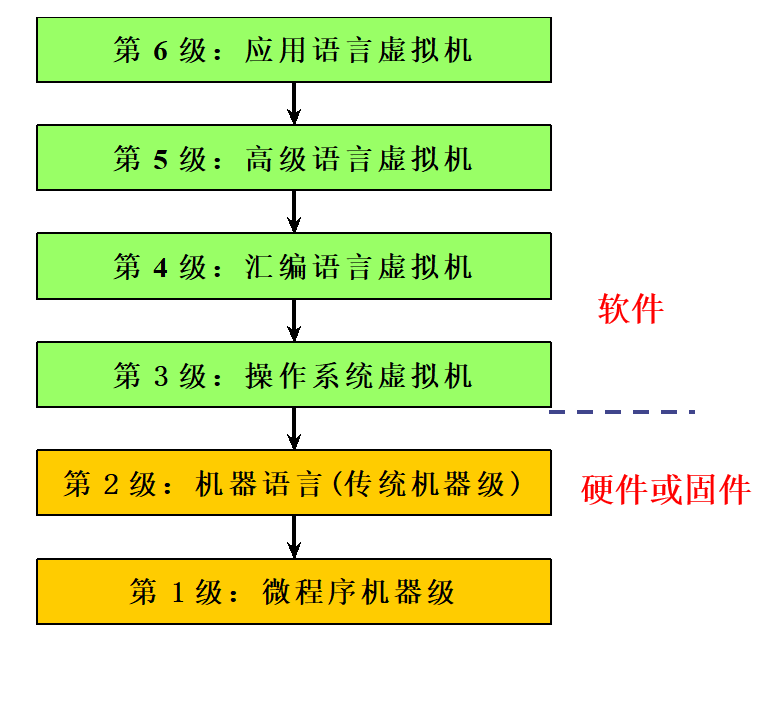
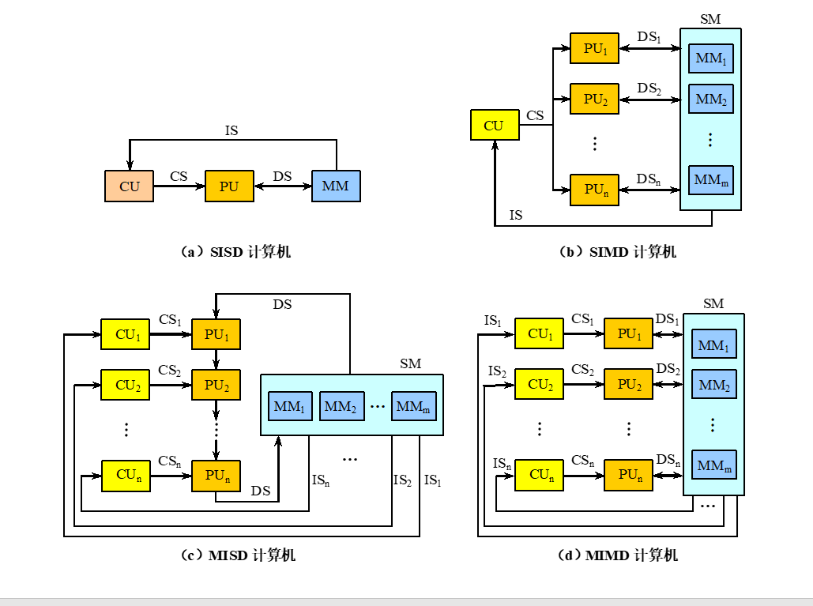
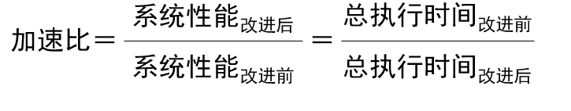
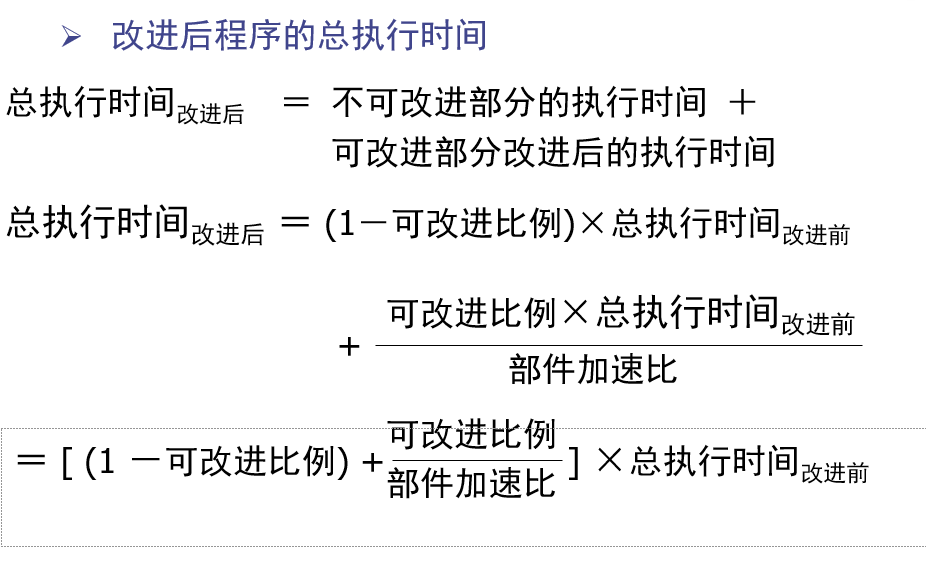
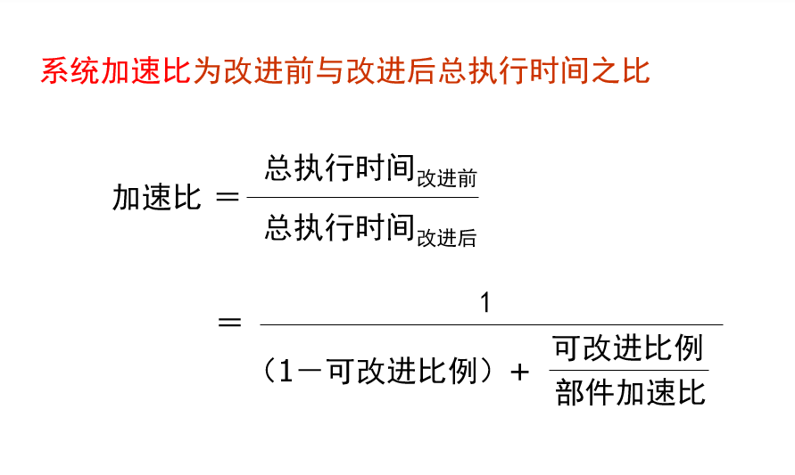
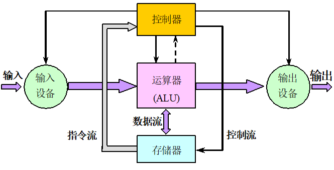

# 系统结构

[TOC]

----

## 一. 绪论

### 1. ?

系统结构的重大转折：

​    从单纯依靠**指令级并行**转向**开发线程级并行**和**数据级并行**。

### 2. 计算机系统的层次结构

1.计算机系统＝**硬件/固件＋软件**

2.计算机语言从低级向高级发展

​    **高一级语言的语句相对于低一级语言来说功能更强，**

**更便于应用，但又都以低级语言为基础。**

3.从计算机语言的角度，把计算机系统按功能划分成

   [多级层次结构](1-2-1 计算机的多级层次结构.exe)。

Ø 每一层以一种语言为特征 

Ø 虚拟机：由软件实现的机器

* 语言实现的两种基本技术
  * **翻译**：先把N+1级程序全部转换成N级程序后，再去执行新产生的N级程序，在执行过程中N+1级程序不再被访问。 
  * **解释**：每当一条N+1级指令被译码后，就直接去执行一串等效的N级指令，然后再去取下一条N+1级的指令，依此重复进行。

​    解释执行比编译后再执行所花的**时间多**，但占用的**存储空间较少**。

### 3. 计算机系统结构。

1. 计算机系统结构的**经典定义**

**程序员所看到**的**计算机属性**，即<u>概念性结构与功能特性</u>。

2. 按照计算机系统的<u>多级层次结构</u>，<u>不同级</u>程序员所看到的计算机具有不同的属性。

3. **透明性**

在计算机技术中，<u>把这种本来存在的事物或属性，但从某种角度看又好像不存在</u>的概念称为透明性。

4. **Amdahl提出的系统结构**

   传统**机器语言级程序员**所看到的计算机属性。

5. 广义的系统结构定义：指令集结构、组成、硬件

5.对于通用寄存器型机器来说，这些属性主要是指：

*  **指令系统**  
  
* 包括机器指令的操作类型和格式、指令间的排序和控制机构等。
  
* **数据表示** 

  * 硬件能直接识别和处理的数据类型。

* **寻址规则** 

  * 包括最小寻址单元、寻址方式及其表示。

* **寄存器定义** 

* **中断系统**

* **机器工作状态的定义和切换**

* **存储系统** 

* **信息保护**

* **I/O结构**

    * 包括I/O连接方式、处理机/存储器与I/O设备之间

        数据传送的方式和格式以及I/O操作的状态等

### 4. 结构.组成.实现 对比

 <u>一种体系结构可以有多种组成。 一种组成可以有多种物理实现。</u>

* 计算机系统结构概念的实质：确定计算机系统中软、硬件的界面，界面之上是软件实现的功能，界面之下是硬件和固件实现的功能。

* 计算机组成：计算机系统结构的逻辑实现
  * 包含物理机器级中的数据流和控制流的组成以及逻辑设计等。
  * 着眼于：物理机器级内各事件的**排序方式与控制方式、各部件的功能以及各部件之间的联系**。

* 3.计算机实现：计算机组成的物理实现

  * 包括处理机、主存等部件的物理结构，器件的集成度和速度，模块、插件、底板的划分与连接，

     信号传输，电源、冷却及整机装配技术等。

  * 着眼于：器件技术（起主导作用）、微组装技术。

### 5. 分类

常见的计算机系统结构分类法有两种：

   `Flynn分类法`、`冯氏分类法`

* 冯氏分类法
  * 用系统的最大并行度对计算机进行分类。

  * **最大并行度**：计算机系统在单位时间内能够处理的最大的二进制位数。 

> 用平面直角坐标系中的一个点代表一个计算机系统，其横坐标表示字宽（n位），纵坐标表示一次能同时处理的字数（m字）。m×n就表示了其最大并行度。

2.Flynn分类法 

* 按照指令流和数据流的**多倍性**进行分类。

* **指令流：**计算机执行的指令序列

* **数据流：**由指令流调用的数据序列。

* **多倍性**：在系统受限的部件上，**同时**处于**同一执行阶段的指令或数据的最大数目**。

  * `IS`：指令流，`DS`：数据流，`CS`：控制流，`CU`：控制部件，`PU`：处理部件，`MM`和`SM`：存储器**。**

* Flynn分类法把计算机系统的结构分为4类：

  q  **单指令流单数据流**(SISD)

  q **单指令流多数据流**(SIMD)

  q **多指令流单数据流**(MISD)

  q **多指令流多数据流**(MIMD)

### 6. 定量原理

4个定量原理：

1. 以**经常性事件**为重点

* 对经常发生的情况采用优化方法的原则进行选择，以得到更多的总体上的改进。

* 优化是指分配更多的资源、达到更高的性能或者分配更多的电能等

2. Amdahl定律
	* <u>加快某部件执行速度</u>所能<u>获得的系统性能加速比</u>，受限于该部件的<u>执行时间占系统中总执行时间</u> 的百分比。

* 系统性能加速比：

* 加速比依赖于两个因素
  **可改进比例：**在改进前的系统中，<u>可改进部分的执行时间</u>在<u>总的执行时间</u>中所占的<u>比例</u>。
              它总是小于等于1。
  例如：一个需运行60秒的程序中有20秒的运算可以加速,那么这个比例就是20/60。
  **部件加速比**：**可改进部分改进以后**性能<u>提高的倍数.</u>它是<u>改进前所需的执行时间与改进后执行时间的比。</u>一般情况下部件加速比是大于1的。
  例如：若系统改进后，改进部分的执行时间是2秒， 而改进前其执行时间为5秒，则部件加速比为5/2

* Amdahl定律：一种性能改进的递减规则

如果仅仅对计算任务中的一部分做性能改进，则改进得越多，所得到的总体性能的提升就越有限

* 重要推论：如果只针对整个任务的一部分进行改

   进和优化，那么所获得的**加速比不超过**

​      1/（1－可改进比例） 

### 7. CPU性能

CPU的性能取决于3个参数

* 时钟周期时间：取决于硬件实现技术和计算机组成。
  CPI：取决于计算机组成和指令集结构。

  *  CPI = 执行程序所需的时钟周期数／IC

     IC：所执行的指令条数

* IC：取决于指令集结构和编译技术。

  

假设：计算机系统有n种指令；
      CPIi ：第i种指令的处理时间；
      ICi ：在程序中第i种指令出现的次数；
则
   CPU时钟周期数 = 求和(CPIi * ICi)

**CPU时间** = 执行程序所需的时钟周期数×时钟周期时间

​      = sigma（CPI*i*×IC*i*）×时钟周期时间

* 执行时间和吞吐率 

   如何评测一台计算机的性能，与测试者看问题

的角度有关。

Ø用户关心的是：单个程序的**执行时间**（执行单个

   程序所花的时间很少）

Ø数据处理中心的管理员关心的是：**吞吐率**（在单

   位时间里能够完成的任务很多 ）

2.基准测试程序 

Ø用于测试和比较性能的基准测试程序的最佳选择是真实应用程序。

   **（例如编译器）** 

Ø以前常采用简化了的程序，例如： 

q**核心测试程序：****从真实程序中选出的关键代码段构**

​               **成的小程序。**

q**小测试程序：****简单的只有几十行的小程序。**

q**合成的测试程序：****人工合成出来的程序。**

**Whetstone****与****Dhrystone****是最流行的合成测试程序。**

从测试性能的角度来看，上述测试程序就不可信了。

**Ø事务处理（TP）性能测试基准程序**：用于测试计算机在事务处理方面的能力，包括数据库访问

　 和更新等

1.冯·诺依曼结构的主要特点

Ø以运算器为中心。

Ø在存储器中，指令和数据同等对待。

​    **指令和数据一样可以进行运算，即由指令组成的程**

**序是可以修改的。**

Ø存储器是按地址访问、按顺序线性编址的一维结

   构，每个单元的位数是固定的。

1.存储程序原理的基本点：指令驱动

程序预先存放在计算机存储器中，计算机一旦启

动，就能按照程序指定的逻辑顺序执行这些程序，

自动完成由程序所描述的处理工作。