# 计算机网络 

[TOC]

  ## 一. 绪论 

  ### 1.计算机网络是什么？ 

  * `计算机技术`和`通信技术`相结合得产物 
  * 多个__独立自制 相互链接__的计算机集合 

计算机系统是一个将分散的具有独立功能的**计算机系统**,通过**通信设备**和**线路**连接起来,由功能完善的***软件***实现**资源共享**和**信息传递**的系统

计算机网络是多个__互连自治__的计算机集合(无主从关系)

  ### 2. 演变 

  * 具有通信的连接系统：终端-线路-计算机 
  * 具有通信功能的分时系统：终端-集中器-计算机 
  * 计算机网络：独立的计算机互联 
  * 国际标准化网络 
    * TCP/IP 

  ### 3. 功能 *

  * 数据通信 
  * 资源共享 
  * 并行和分布式处理 
  * 提高可靠性
    * 如果一台主机坏了,另一台能代替他 
  * 扩充性 /负载均衡

  ### 4. 组成结构 

网络由若干__结点（node）__和链接这些结点的__链路（link）__组成 

由硬件,软件,协议构成

* 工作方式分为

  * **边缘部分**: 用户直接使用,分为C/S和P2P
  * **核心部分**: 为边缘部分服务的部分

  ### 5. 子网 

功能性组成:

**通信子网**和**资源子网**

* 应用层,表示层,会话层 是资源子网(资源共享/数据处理)
* 网络层,数据链路层,物理层 是通信子网(数据通信)

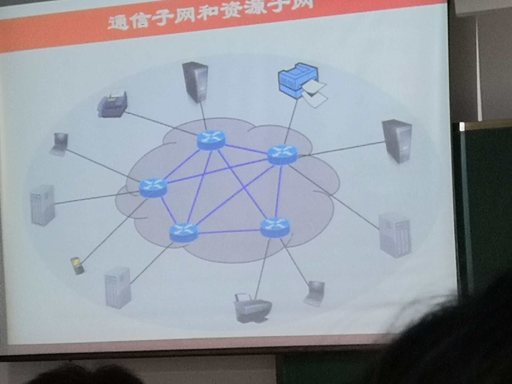

  ### 6. 拓扑结构 

以太网：物理上星型，逻辑上总线，需要解决冲突问题 

* 网状拓扑 mesh topology 
  * 避免拥塞 
  * 好健壮性 
  * 安全 便于管理 
  * 安装费用高 
  * 星状拓扑 star topology 
  * 从中央控制器向外连（比如集线器hub 
  * 拓扑结构简单 
  * 健壮性 
  * 便于管理 
  * 中央控制器是网络瓶颈 

* 树状拓扑 tree 
  * 星星连星型连计算机，拓展规模，隔离通信 
* 总线型拓扑 bus 
  * 所有主机连到bus上，不需要路由器 
  * 但是总线长度有限，有故障隔离问题 
  * 广播型设备 
* 环状拓扑 ring 
* 混合型拓扑 hybrid 

### 7. 体系结构 

计算机网络是一个复杂的系统，设计和实现中需要__分层处理__，每层完成__特定的功能__，各层协调成一个完整网络系统。 

### 8. 分类

* 按照分布范围: 广域网WAN,城域网MAN,局域网WAN,个人区域网PAN
* 按使用者: 公用网,专用网
* 交换技术: 电路交换,报文交换,分组交换
* 按拓扑结构分: 总线型,星型,环形,网状型(常用语广域网)
* 按传输技术: 广播式网络(共享),点对点网络.(一对一)

### 9. 标准化工作

标准化工作对于计算机网络至关重要,要实现不同厂商的软硬件联通,必须遵循指定标准

* 分类:
  * 法定标准: 由权威机构制定的正式的,合法的标准,如OSI
  * 事实标准: 某些公司产品在竞争中占据了主流,自然成为标准,比如TCP/IP

RFC:因特网标准的形式

* 四个阶段
  * 因特网草案
  * 建议标准(成为RFC)
  * 草案标准
  * 成为因特网标准

### 10. 速率相关

`速率`即 数据率/数据传输率/比特率(bit)

连接在计算机网络上的主机在数字信道上传送数据位数的速率

b: bit B: Byte

`带宽`,原本指某个信号具有的频带宽度(最高频率和最低频率之差),单位Hz

现在的带宽表示网络通信线路传送数据的能力,通常指单位时间内从网络的某一点到另一点能通过的"**最高数据率**(速率)",单位是"比特/秒"

带宽指的是主机发送数据的速度而不是传送速度

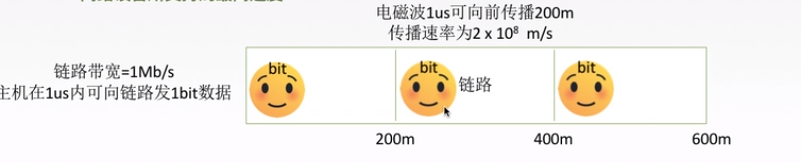

`吞吐量`在单位时间内通过某个网络(/信道/接口)的数据量,单位b/s

受带宽或速率限制

### 10. 时延相关

`时延/延迟`: 指数据从网络(链路)的一段传送到另一端所需要的时间,单位为s

四个部分组成,想要就相加

* `发送时延 `= **数据长度/信道带宽(发送速率)** ,高速链路指提高这个部分
* `传播时延 `= 取决于电磁波传送速度和链路长度 __信道长度/电磁波在信道上的传播速率__
* `排队时延` = 等待输入|输出链路可用
* `处理时延 `= 检错,找出口的时间

`时延带宽积`: 指 __传播时延*带宽__ 单位b,是描述信息量的属性,也称为以比特为单位的链路长度,描述"某段链路现在有多少比特"(容量)

`往返时延RTT`: 从发送方发送数据开始,到发送方收到接收方的确认 总共经历的时延,用ping可以测

* RTT越大,收到确认前可以发送的数据越多
* RTT包括: 
  * 往返传播时延 = 传播时延*2
  * 末端处理时间

`利用率`: 

* 信道利用率: 有数据通过时间/总时间
* 网络利用率: 信道利用率加权平均

* 利用率越大,时延越大

## 二. 分层结构

### 1. 为什么分层

* 发送文件前要完成的工作:

  * 发起通信的计算机必须将数据通信的通路激活

  * 告诉网络如何识别目的主机

  * 发起通信的计算机查明目的主机是否开机

    ...

* 分治解决

实体: 每一个活动元素称为实体

协议: 一系列的规则和约定

接口: 每层之间有个接口

服务: 上层调用下层的服务

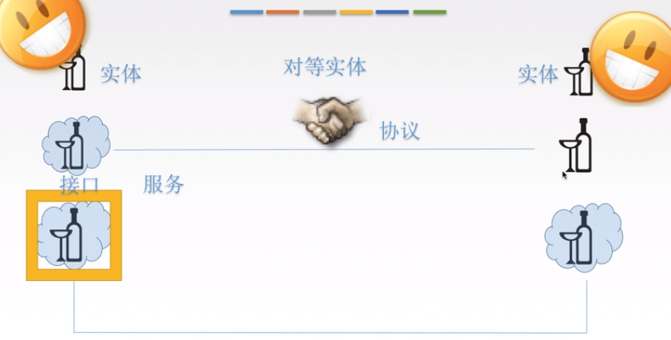 

### 2. 分层基本原则

1. 各层相互独立,每层只能实现一种相对独立的功能
2. 每层之间界面自然清晰,易于理解,相互交流尽可能少
3. 结构上可分割,每层都采用最合适的技术
4. 保持下层对上层的独立性,上层单向使用下层提供的服务
5. 整个分层结构应该能促进标准化工作

### 3. 分层结构

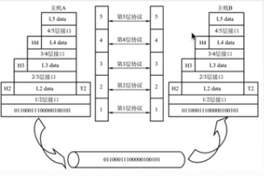

`实体`: 第n层中的活动元素称为n层实体,同一层的实体叫__对等实体__

`协议`: 为进行网络中对等实体的数据交换而建立的规则,标准或约定称为网络协议

* 协议的三个要素
  * 语法: 规定传输数据的格式
  * 语义: 规定要完成的功能
  * 同步: 规定各种操作的顺序

`接口`: 上层使用下层服务的入口(相邻)

`服务`:下层为相邻上层提供的功能调用

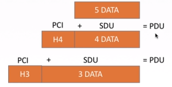 

`SDU服务数据单元`: 为完成用户要求的功能而应传送的数据

`PCI协议控制信息`: 控制协议操作信息

`PDU协议数据单元`: 对等层次之间传送的数据单位

上一层PDU = 下一层SDU

### 4. OSI参考模型

ISO/OSI模型是7层的**法定标准**,为了支持异构网络系统的的互联互通

理论上很成功,市场上很失败.

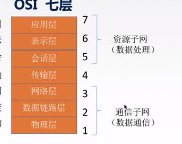 应用层 表示层 会话层 传输层 网络层 数据链路层 物理层

> 物联网赎回适用

#### 4.1 七层通信

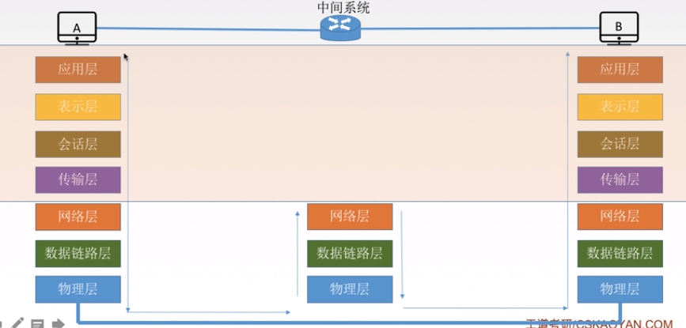

上面四层 称为 端到端通信

下面三层 称为 点到点通信

发送端每一层都会给上一层的数据(SDU)附加一段(数据链路加两段)控制信息(PCI),就能越来越大

#### 4.2 应用层

应用层 是用户与网络的界面,__本质__是所有能和用户交互产生网络流量的程序

> 典型应用层服务:
>
> ​	文件传输(FTP),电子邮件(SMTP),万维网(HTTP)

#### 4.3 表示层

表示层

 用于处理在两个通信系统中**交换信息的表示方式**

* 功能一. 数据格式变换
* 功能二. 数据加密解密
* 功能三. 数据压缩和恢复

#### 4.4 会话层

会话层 向表示层实体/用户进程提供**建立连接**并在连接上**有序地传输数据**

这整个过程称为__会话__,也是__建立同步(SYN)__

* 功能一. 建立,管理,终止会话
* 功能二. 使用校验点可以使会话在通信失效时从__校验点/同步点___继续恢复通信,实现数据同步
  * 适用于传输大文件

> ADSP,ASP

#### 4.5 传输层

负责两个主机中的__两个进程__的通信,即端到端通信,即__端到端__通信.传输单位是报文或数据报

* 功能一. 可靠传输,不可靠传输
* 功能二. 差错控制
* 功能三. 流量控制
* 功能四. 复用分用
  * 复用: 多个应用层进程可同时使用下面的传输层服务
  * 分用: 传输层把收到的信息分别交付给上面应用层中相应的进程

> TCP,UDP

#### 4.6 网络层(最重要)

主要任务是把__分组__从源端传到目的端,为分组交换网上的不同主机提供通信服务

网络层传输单位是__数据报__

分组=>数据报

* 功能一. 路有选择(选择最佳路径)
* 功能二. 流量控制
* 功能三. 差错控制
* 功能四: 拥塞控制
  * 如果所有节点都来不解接收分组,而要丢弃大量分组的话,网络就处于**拥塞**状态

#### 4.7 数据链路层

主要任务是把网络层传下来的数据报__组装成帧__

传输单位__帧__

* 功能一. 成帧(定义帧的开始和结束)
* 功能二. 差错控制(帧错+位错)
* 功能三. 流量控制
* 功能四. 访问控制(控制对信道的访问)

> SDLC,HDC

#### 4.8 物理层

在__物理媒体__上实现比特流的透明传输

物理层的传输单位是__比特__

__透明传输__: 不管所传数据是什么样的比特组合,都应当能在链路上传送

* 功能一. 定义接口特性
* 功能二. 定义传送模式
  * 单工: 单向
  * 双工: 双向
  * 半双工: 双向,同一时刻只能一方到另一方
* 功能三. 定义传送速率
* 功能四. 比特同步
* 功能五. 比特编码

> Rj45,802.3

### 5. TCP/IP参考模型

先实践后理论的参考模型,更有价值

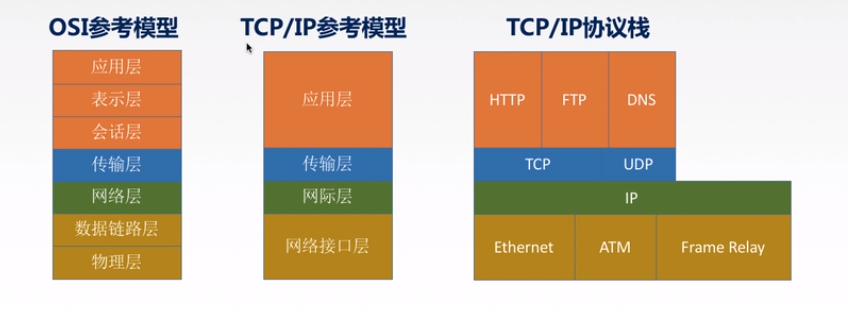

#### 5.1 和OSI的异同

同

1. 都分层
2. 基于独立的协议栈的概念
3. 实现异构网络互联

异

1. OSI有服务,协议,接口
2. OSI先于协议出现,不偏向腾协议
3. TCP/IP设计之初就想到异构网互联问题(在网络层无连接),将IP作为重要层次


> 面向连接: 分为三个阶段,建立连接,传输数据,释放连接
>
> 物理额济纳: 直接数据传输

#### 5.2 五层参考模型

 是一个概念

## 三. 物理层

### 1. 基本概念

物理层解决如何在连接各种计算机的传输媒体上传输数据比特流

主要任务: 确定与传输媒体接口有关的一些**特性** -->定义标准

* 特性:
  * `机械特性`:定义物理连接的特性,规定物理连接所采用的规格,接口形状,**引线数目,引脚数量**和排列情况
  * `电气特性`:规定传输二进制位时,线路上信号的**电压范围**,阻抗匹配,传输**速率**和**距离限制**等
  * `功能特性`: 指明某条线上出现的**某一电平的何种意义**,接口部件的信号线用途
  * `规程特性`: 定义各条物理线路的**规程和时序**的关系


### 2. 数据通信的基础知识

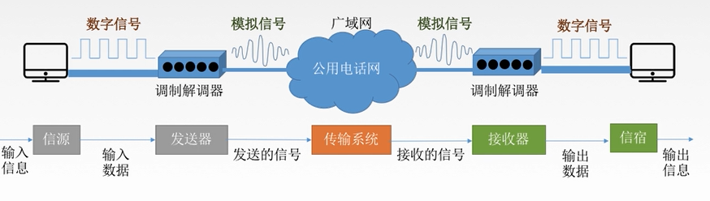

信源-发送器-传输系统-接收器-信宿

#### 2.1 相关术语

通信的目的是传送信息

__数据__: 传送信息的实体,通常是有意义的符号序列

__信号__: 数据的电气/电磁的标签,是数据在传输过程中的存在形式.

* 数字信号: 离散
* 模拟信号: 连续

__信源__: 产生和发送数据的源头

__信宿__: 接收数据的终点

__信道__: 信号的传输媒介,一般用来表示向某一方向传送信息的截止,因此一条通信线路往往包含一条发送信道和一条接收信道

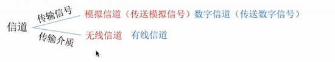

#### 2.2 三种通信方式

* 单工通信: 只有一个方向的通信而没有反方向的交互,仅需要一条信道
* 半双工通信: 通信双方都可以发送或接收信息,但任何一方都不能同时发送和接收,需要两条信道
* 全双工通信: 通信双方可以同时发送和接受信息,需要两条信道

#### 2.3 两种数据传输方式

* 串行
  * 速度慢,费用低,适合远距离
* 并行
  * 

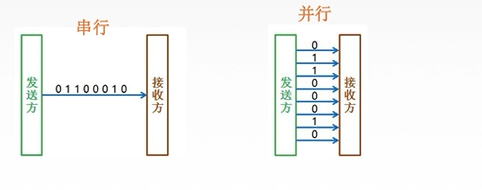

### 3. 四个常见参数

__码元__是指用一个**固定时长**的**信号波形**,代表不同离散数值的基本波形,是数字通信中数字信号的计量单位.这个固定时长内的信号称为__k进制码元__,而该时长称为__码元宽度__.当码元的离散状态有M个时,此时码元为M进制码元

1码元可以携带多个比特的信息量,例如用二进制编码时只有两种不同的码元,一种代表0状态,另一种代表1状态

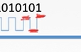二进制码元

四进制码元

__速率__: 也叫数据率,是指数据的**传输速率/发送速率,**表示单位时间内传输的数据量. 可以用码元传输速率和信息传输速率表示(跟传播速率不一样,传播速率和电磁波有关)

* **码元传输速率:** 别名码元速率,波形速率,调制速率,符号速率.表示单位时间内数字通信系统所传输的码元个数(脉冲个数/信号变化次数),单位为__波特(Baud)__(码元/秒). 1波特表示数字通信系统每秒传输一个码元,这里的码元可以是多进制的,也可以是二进制的,速率与进制无关. 1s内传输多少码元
* __信息传输速率__: 别名比特率,就是一秒传输多少个比特

比特率 = M波特 * n bit/s (假定码元=n bit)

__带宽__: 最高数据率

### 4. 编码&调制

__信道__: 

信道上传送的信号又分为两种:

* 基带信号: 将数字信号1和0直接用**两种**不同的电压表示,再送到数字信道上去传输(基带传输)
  * 来自信源的信号就是基带信号. 基带信号就是发出的直接表达了要传输的信息的信号,声波也是基带信号
  * 适合近
* 宽带信号: 将基带信号进行调制后形成的**频分复用模拟信号**,再传送到模拟信道上去传输(带宽传输)
  * 把基带信号经过载波调制后,把信号的频率范围搬移到较高的频段以便在信道中传输
  * 适合远

#### 4.2 编码与调制

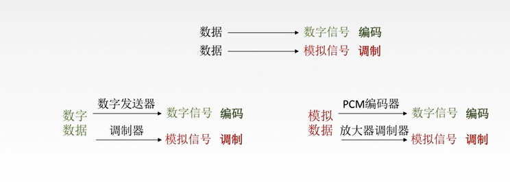

#### 4.3 数字数据-编码-数字信号

> 六种:
>
> 1. **非归零编码(NRZ)**
> 2. **曼彻斯特编码**
> 3. **差分曼彻斯特编码**
> 4. 归零编码(RZ)
> 5. 反向不归零编码(BRZI)
> 6. 4B/5B编码

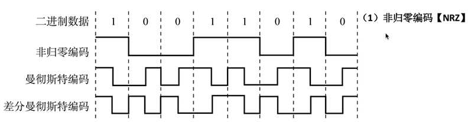

* 非归零编码(NRZ)
  * 高电平就是1,低电平就是0
  * 编码容易实现,不能检错,无法判断码元的开始和结束. 以至于__收发双方难以保持同步__
  * 需要告知时钟周期
* 归零编码
  * 信号电平在一个码元之内都要恢复到0
  * 不推荐

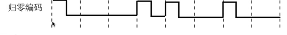

* 反向不归零编码
  * 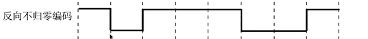
  * 电平出现变化(翻转)表示0,电平不变表示1
  * 还是需要确定时钟周期时
* __曼彻斯特编码__
  * 将一个码元分成两个相等的间隔. 前一个间隔为低电平,后一个间隔为高电平表示码元1,码元0就相反.
  * 规定也可以相反,特点是在每一个码元的中间出现电平跳变,位中间的跳变既作为时钟信号又作数据信号,但他所占频带宽度是原始基带宽度的两倍
  * 每一个码元被调成两个电平,所以**数据传输速率只有调制速率的二分之一**
    * 因为一个时钟周期有两个脉冲,调制速率(脉冲速率,码元传输速率)加倍
* 差分曼彻斯特编码
  * 同1异0,看的是在虚线两边的信号
  * 如果码元为1,则前半个码元的电平和上一个码元的后半个码元电平相同,若0则不同. 每个码元中间都有电平的跳转,可以实现自同步,**抗干扰性强**于曼彻斯特
* 4B/5B编码
  * 比特流中插入额外bit来打破一连串的0,1.就是用5个bit来编码4bit的数据,再传给接收方,称为4B/5B
  * 编码效率80%

#### 4.3 数字数据-调制-模拟信号

数字数据调制技术在发送端将__数字信号转换为模拟信号__,在接收端将模拟信号还原为数字信号,分别对应调制/解调过程

> 调制方式:
>
> 1. 2ASK
> 2. 2FSK
> 3. 2PSK
> 4. QAM

* **2ASK**

  * 又叫做**调幅**,0没有幅度,1有幅度
  * 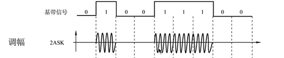

* **2FSK**

  * 又叫**调频**,0的频率小,1的频率大
  * 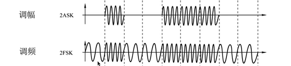

* __2PSK__

  * __调相__,对相位的调制,0和1对应两种波形

* __QAM__

  * 调相+调幅

    > 例题: 某通信链路的波特率是1200Baud,采用4个相位,每个相位有4种振幅的QAM调制技术,则该链路的信息传输速率是多少
    >
    > ```
    > 解: 
    > 	4*4 = 16种波形,即16种(进制)码元
    > 	所以需要4个比特位表示16中码元(1码元 = 4bit)
    > 	1200*4 = 4800bit/s
    > ```
    >
    > 

#### 4.4 模拟数据-编码-数字信号

计算机内部处理的是二进制数据,处理的都是__数字音频__,所以需要将模拟音频通过采样,量化转换**成有限个数字表示的离散序列**(音频数字化)

最典型的就是对音频信号进行编码的脉冲调制(__PCM__),在计算机应用中,能达到最高保真水平的就是PCM编码. 被广泛用于素材保存及音乐欣赏,CD,DVD以及我们常见的WAV均有应用,主要包括: 抽样,量化,编码

* 抽样: 对模拟信号周期性扫描,把时间上连续的信号编程时间上离散的信号

  * 为了使锁的离散信号能无失真的代表被抽样的模拟数据,要使用采样定理
    $$
    f_{采样频率}\ge 2f_P{信号最高频率}
    $$

* 量化: 把抽样取得的电平幅值按照一定的分级标准转化为对应的数字值,并取整数,这样就把连续的电平幅值转换为离散的数字量

* 编码: 把量化的结果转换为与之对应的二进制编码

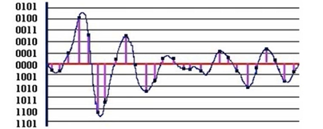

#### 4.5 模拟信号-调制-模拟信号

为了保证传输的有效性,可能需要较高的频率,这种调制方式还可以用频分复用技术,充分利用带宽资源. 在电话机和本地交换机所传输的信号是...

(这不重要)

### 5. 奈氏准则,香农定理

* __失真__:
  * 在现实中的信道,带宽受限还有噪声干扰,所以会失真
  * 影响因素:
    * 码元传输速率
    * 信号传输距离
    * 噪声干扰
    * 传输媒体质量
* 失真的一种现象: __码间串扰__
  * 当频率过高时,以至于接收端收到的信号波形失去**了码元之间清晰界限**的现象

`信道带宽`: 信道能通过的最高频率和最低频率之差

#### 5.2 奈氏准则(奈奎斯特定理)

__奈氏准则__: 在理想低通条件下,为了避免码间串扰,**极限码元传输速率**位2W Baud,W是带宽,单位是Hz(只有这里带宽会用Hz表示)

> 极限码元传输速率和极限数据率要区分开,
>
> 理想低通信道下的极限数据传输率 = 2Wlog$_2$V(b/s) V:几种码元,码元的离散电平数目

**信道频带越宽,**能通过的信号高频分量越多,就可以用更高的速率进行码元的有效传输

只给出了码元传输限制,没有对信息传输速率进行限制

由于码元的传输速率受奈氏准则的制约,所以要提高数据的传输速率,就必须设法使每个码元能携带更多的比特信息量,这就需要采用多元制的调制方法.

#### 5.3 香农定理

噪声存在于所有的电子设备和通信信道中. 由于噪声的随机产生,它的瞬时值有时会很大,因此噪声会使接收端对码元的判决产生错误. 但是噪声的影响是相对的,若信号较强,那么噪声影响相对较小. 因此 __信噪比__会很重要.

信噪比 = 信号的平均功率/噪声的平均功率 ,常记为`S/N`,用分贝作为度量单位

信噪比(dB) = 10log$_{10}$(S/N) 数值等价,数量级的十倍

__香农定理__: 在带宽受限且有噪声的信道中,为了不产生误差,**信息的传输速率**有上限值
$$
信道的极限数据传输速率 = Wlog_2(1+S/N)\ (b/s)
$$
S: 信道所传信号的平均功率

N是高斯噪声功率

> 推论:
>
> 1. 信道带宽 或 信噪比越大 极限传输速率越高
> 2. 对于一定传输带宽和一定信噪比,信息传输速率上限确定
> 3. 只要信息的传输速率低于信道的极限传输速率,就一定能找到某种方法来实现无差错传输
> 4. 香农定理得出的为极限信息传输速率,实际信道能到达的传输速率比他低不少
> 5. 如果W或S/N无穷大,则极限传输速率也没上限

### 6. 物理层传输介质

传输介质也叫传输媒体/传输媒介,它就是数据传输系统中在发送设备和接收设备之间的**物理通路**

传输媒体并不属于物理层,它可以称为第0层,传输媒体无脑传输信号<u>,但物理层</u>规定了__电气特性__,因此物理层能够识别所传送的比特流

* 分类:
  * 导向性: 沿着固体媒介传播,比如铜线
  * 非导向性: 自由空间,比如海水,空气

#### 6.1 双绞线

双绞线是最古老的最常用的传输介质,由两根采用一定规则并排绞合的,相互绝缘的铜导线组成

绞合: 可以减少对相邻导线的电磁干扰

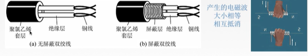

* 为了进一步提高抗电磁干扰能力,可以在双绞线外面加上一个由金属丝编织成的屏蔽层,这就是__屏蔽双绞线__(STP),没有屏蔽的叫UTP

* 特点:
  * 便宜,常用
  * 距离太远时,对于模拟传输 需要用放大器放大衰减的信号
  * 对于数字传输 要用中继器将失真的信号整形

#### 6.2 同轴电缆

同轴电缆由 __导体质导线,绝缘层,网状编织屏蔽层,导体铜制芯线__构成

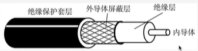

* 分类:
  * 基带同轴电缆: 传数字信号
  * 宽带同轴电缆: 传宽带信号,主要用于有线电视系统

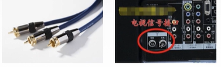

* 特点:
  * 抗干扰能力强
  * 传输距离远
  * 比双绞线更贵

#### 6.3 光纤

光纤通信就是利用光导纤维传递__光脉冲__来进行通信. 有光脉冲表示1,无光脉冲表示0. 可见光的频率大约是10$^8$MHz,光纤的__带宽远远大于__目前其他各种传输媒介的带宽

在发送和接收的时候需要光电转换

* 构造:
  * 光纤主要由 __纤芯(实心的)__和__包层__构成. 折射率较低,入射角较大出现全反射,不断传播,超低损耗
  * 一般捆成一条光缆
* 分类:
  * 多模光纤: 
    * 有多种传输光信号模式的光纤
    * 光源是普通发光二极管
    * 易失真,s呵呵近距离传输
  * 单模光纤:
    * 在横向模式直接传输光信号的光纤
    * 光源是定向性很好的发光二极管
    * 衰耗少,适合远距离

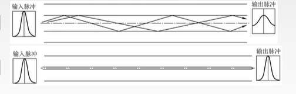

* 特点:
  * 传输损耗小,中继距离长,对远距离很经济
  * 抗雷电和电磁干扰性能好
  * 无串音干扰,保密性好,不易被窃听或截取
  * 体积小,重量轻

#### 6.4 非导向性传输介质:

#### 6.5 无线电波

向__所有方向__传播

有较强的穿透能力,可以传远距离,广泛用于通信领域

#### 6.6 微波

信号沿着__固定方向__传播

通信频率较高,频段范围宽,数据率高.

* 应用:
  * 地面微波接力通信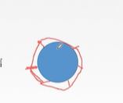
  * 卫星通信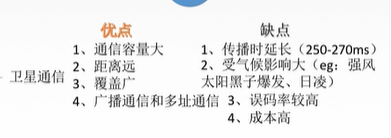

#### 6.7 红外线,激光

信号沿着__固定方向__传播

### 7. 物理层设备

#### 7.1 中继器

诞生原因: 由于存在损耗,在线路上传输的信号功率会衰减,以至于失真,导致接收错误

中继器功能: 对信号__再生和还原__,对衰减的信号放大,保持与元数据相同,以增加信号传输的举例,延长网络的长度

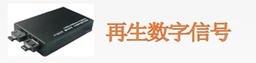

中继器的两端: 两端的网络部分是网段而不是子网,适用于完全相同的两类网络的互连,且两个网段速率要相同

* 只作用于信号的电气部分,并不管数据中是否有错误数据或不适用于网段的数据
* 两端可以连相同媒体,也可以不同媒体
* 中继器两端的网段一定要是同一个协议

5-4-3规则: 网络标准中都对信号延迟范围做了具体规定,中继器只能在规定的范围进行,否则会网络故障

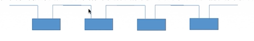5个网段,4个中继器,只有三个段可以挂接计算机

#### 7.2 集线器(多口中继器)

再生,放大信号

功能: 对信号进行__再生放大转发__,接着转发到其他所有处于工作状态的端口上,以增加信号传输的举例,延长网络长度. 不具备信号定向传送能力,是一个共享式设备

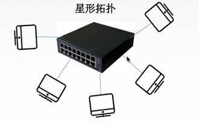

## 四. 数据链路层

### 1. 基本概念

`结点`: 主机/路由器

`链路`: 网络中两个结点之间的**物理信道**,链路的传输介质主要有双绞线,光纤和微波

`数据链路`: 网络中两个结点的**逻辑通道**,把实现控制数据传输协议的硬件和软件加到链路上就构成数据链路

`帧`: 链路层的协议数据单元,封装网络层的数据报

__数据链路层__负责通过一条链路从一个节点向另一个物理链路直接相连的相邻接点传送数据报

### 2. 数据链路层功能概述

数据链路层在物理层提供服务的基础上**向网络层提供服务**,其最基本的服务是将源自网络层来的数据__可靠__的传输到相邻节点的目标机网络层. 其主要作用是**加强物理层传输原始比特流的功能**,将物理层提供的可能出错的物理连接改造成为__逻辑上无差错的数据链路__.使之对网络层表现为一条无差错的链路

* 功能一: 为网络层提供服务: 无确认无连接服务,有确认无连接服务,有确认面向连接服务(有链接一定有确认)
* 功能二: 链路管理,即连接的建立,维持,释放
* 功能三. 组帧
* 功能四. 流量控制,限制发送方
* 功能五: 差错控制

### 3. 封装成帧/组帧

封装成帧就是在一段数据的前后部分添加首部和尾部,这样就构成了一个帧. 接收端在收到物理层上交的比特流后,就能根据首部和尾部标记,从收到的比特流中识别帧的开始和结束


首部和尾部包含许多控制信息,他们的一个重要作用: __帧定界__(确定帧的界限)

__帧同步__: 接收方应当能从接受到的二进制比特流中区分出帧的起始和终止

在封装过程中,数据报长度一定小于等于最大传送单元MTU

* 四种方法组帧
  * 字符计数法
  * 字符(节)填充法
  * 零比特填充法
  * 违规编码法

* __透明传输__: 指不管所传数据是什么样的比特组合,都应当能在链路上进行传送 . 这样链路就看不见有什么妨碍数据传输的东西
  * 当所传数据的比特组合恰巧与某个控制信息完全一样时,就应该采取适当措施,使接收方不会将这样的错误数据认为是某种控制信息,这样才能保证数据链路层的传输是透明的.

#### 3.1 字符计数法

帧首部用一个计数字段(第一个字节,8位)来表名帧内字符数

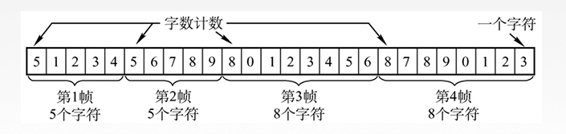

* 缺点: 如果计数出了差错,那后面全错了

#### 3.2 字符填充法

* 前置: (这不是字符填充法)

设置两个比特组合作为`SOH(Start Of Header)`和`EOT(end of transmission)`

然后在两个中间填充数据

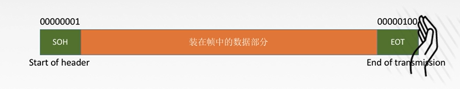

* 若传送的帧是文本文件组成的(文本文件的字符都是键盘输入的),可以实现透明传输
* 若不是文本文件,就有可能出现SOH或EOT出现在数据中的情况,需要__用字符填充法来解决__

字符填充法:

* 在数据中众多EOT,SOH之前,在前面加上`转义字符ESC`,在数据中的ESC前也要加转义字符

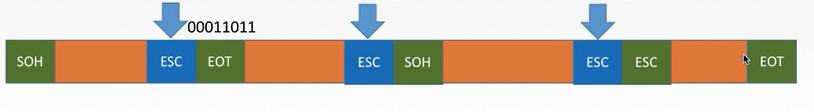

#### 3.3 零比特填充法

5"1"1"0"原则

SOH = EOT = 01111110

然后按照这样的方法组帧:

* 在接收端,扫描整个信息字段,只要连续5个1,就立即填入1个0

这样就透明传输了

**常用**

#### 3.4 违规编码法

对曼彻斯特编码,每个数据中间都会出现电平转换

所以可以用"高-高","低-低"来定界帧的起始和终止

**最常用**

### 4. 差错控制

差错: 基本都是由噪声引起的

* 位错: 比特位出错
* 帧错:
  * 帧丢失
  * 帧重复
  * 帧失序

噪声:

* 全局性: 由于线路本身电气特性所产生的随机噪声,是信道固有的,随机存在的
  * 解决方法: 提高信噪比
* 局部性: 由于外界特定短暂性原因所产生的冲击噪声,是差错的主要原因
  * 解决方法: 利用编码技术来解决

|             | 无确认无连接服务 | 有确认无连接服务         | 有确认面向连接服务       |
| ----------- | ---------------- | ------------------------ | ------------------------ |
| 面向的链路: | 通信质量好       | 通信质量差的无线传输链路 | 通信质量差的无线传输链路 |
|             | 有线传输链路     |                          |                          |
|             |                  |                          |                          |

针对比特错,我们有__检错编码,纠错编码__

> 编码: 数据链路层编码和物理层的数据编码和调制不同. 物理层编码针对的是单个比特,解决传输过程中比特同步问题,如曼彻斯特编码,二数据链路层的编码针对的是一组比特,它通过**冗余码**技术实现一组二进制比特串在传输过程中是否出现了差错
>
> __冗余编码__
>
> * 在数据发送之前,先按照某种关系附加上一定的**冗余位**,构成一个符合某一规则的码字后在发送. 当要发送的有效数据变化时,相应的冗余位也随之变化,使码字遵从不变的规则. 接收端根据收到的码字是否符合原规则判断是否出错

#### 4.2 检错编码

* __奇偶校验码__:
  * 构成: n-1位信息元 + 1位校验元
  * 分类: 奇校验码,偶校验码
  * 对于奇校验码,保证加上校验元后,`1`的个数为奇数; 偶校验同理

```latex
如果一个字符S的ASCII编码从低到高依次为1100101,采用奇校验,在下述收到的传输后字符中,哪种错误不能检测
A. 11000011
B. 11001010
C. 11001100
D. 11010011
ANS: D 因为D满足奇校验
```

* 奇偶校验码特点:
  * 只能检测出奇数个比特错误,检错能力为50%
* __CRC循环冗余码__

基本思想: 

例题:

<blockquote style=";border:none;border-radius:2px;color:black;font-size:15px">
例: 要发送的数据时1101011011,采用CRC校验,生成多项式是10011,则最终应该发送的数据是?
<br/>解:<br/>
    第一步: 发送的数据 = 要发送的数据 + <b>帧检验序列FCS</b><br/>
    第二步: 计算FCS:<br/>&nbsp;&nbsp;&nbsp;
    先按照生成多项式的阶r(就是生成多项式的位数 - 1),向数据后面加r个0
    <br/>&nbsp;&nbsp;&nbsp;
    (在此处就是r=4,第一步生成了11010110110000)<br/>&nbsp;&nbsp;&nbsp;
    再将生成的数字除以多项式(模二除法,用小学除法做),余数为FCS/冗余码
    (在此处余数是1110)<br/>
    第三部: 要发送的数据=1101011011+1110


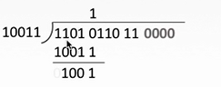二进制除法,上面减下面可以用异或

接收端检错过程:

把收到的每一个帧都除以同样的除数,然后检查得到的余数R

* 如果余数为0就没有差错
* 不然有差错,丢弃

FCS的生成以及接收端CRC检验都是硬件实现,处理迅速

#### 4.3 纠错编码

__海明码__: 可以__发现双__比特错,__纠正单__比特错

工作原理: 动一发而牵全身

1. 确定校验码位数

   > 使用海明不等式: $2^r \ge k + r + 1$
   >
   > r为冗余信息位,k为信息位
   >
   > 示例: 假设D=101101,则k=6,满足不等式的最小r为4,则海明码有10位,元数据6位,校验码4位

2. 确定校验码和数据的位置

   > 跟着示例: 
   >
   > 假设这4位校验码为$P_1,P_2..P_4$,数据从左到右为$D_1...D_6$
   >
   > $P_i$的位置: 只能放在2的次方的位置,比如1,2,4,8
   >
   > D的位置: 把剩下的填满
   >
   > | 1    | 2    | 3    | 4    | 5    | 6    | 7    | 8    | 9    | 10   |
   > | ---- | ---- | ---- | ---- | ---- | ---- | ---- | ---- | ---- | ---- |
   > | P_1  | P_2  | D1   | P_3  | D2   | D3   | D4   | P_4  | D5   | D6   |
   > |      |      | 1    |      | 0    | 1    | 1    |      | 0    | 1    |
   >
   > 

3. 求P值

> 规律: 我们知道对于P的位置都是2的n次方,所以二进制表示只有一个1
>
> 则它的值是所有跟他做__与运算__结果不为0的D的和(就是跟他一样的那位为1的所有D的和)取最低位
>
> (和取最低位 等价于 令所有要校验的位异或为0)
>
> | 0001 | 0010 | 0011 | 0100 | 0101 | 0110 | 0111 | 1000 | 1001 | 1010 |
> | ---- | ---- | ---- | ---- | ---- | ---- | ---- | ---- | ---- | ---- |
> | 1    | 2    | 3    | 4    | 5    | 6    | 7    | 8    | 9    | 10   |
> | P_1  | P_2  | D1   | P_3  | D2   | D3   | D4   | P_4  | D5   | D6   |
> | 0    | 1    | 1    | 0    | 0    | 1    | 1    | 1    | 0    | 1    |
>
> P1在最低位为1,D1,D2,D4,D5在最低位也为1,所以P1的值就是0
>
> P2第二位是1,对应D1,D3,D4,D6值为0
>
> 以此类推

4. 检错纠错

   > 智能纠错方法:
   >
   > * 从P1开始计算对应位异或,比如P1异或结果是1,P2位0,P3为1,P4为0
   > * 最后得到的0101就是错误位(P4P3P2P1排列),即第5位出错了,知道错误就可以改了
   > * 在P1..P4跟位数12345正相关时可以这么用

### 5. 流量控制/可靠传输

较高的发送速度和较低的接受能力不匹配,会造成传输出错. 所以流量控制也是链路层的影响重要工作

链路层的流量控制是点对点的,传输层流量控制是端到端的.

__数据链路层__的流量控制手段: 接收方收不下就不回复确认

__传输层__的流量控制手段: 接收端给发送端一个窗口公告

* 方法:
  * **停止-等待协议**
  * **滑动窗口协议:**
    * **后退N帧协议(GBN)**
    * **选择重传协议(SR)**

> 停止-等待协议: 每发送完一个帧就停止发送,等待对方的确认. 收到确认帧后再发送下一个帧
>
> 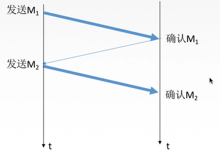
>
> 滑动窗口协议: 
>
> 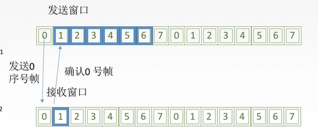

停止等待协议: 发送窗口大小=接收窗口大小=1

后退n帧协议(GBN): 发送窗口大小>1, 接收窗口大小 = 1

选择重传协议(SR): 发送窗口大小>1, 接收窗口大小 > 1

#### 5.1 停止-等待协议

* 为什么要有停止-等待协议?
  * 比特错
  * 底层通信的丢包问题: 物理线路故障,设备故障,病毒攻击,路由信息错误等原因,会导致数据包(帧,数据报)的丢失

* 停等协议的前提
  * 只考虑一方发送数据,一方接收数据
  * 不考虑数据在哪一层次传送,只讨论可靠性原理
* 停止等待协议: 每发送完一个分组就停止发送,等待对方确认,收到再发送下一个分组

* 情况
  * **无差错**:
    * 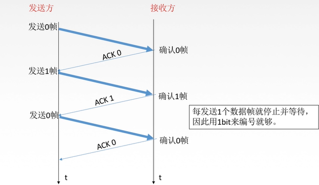
  * **数据帧丢失或检测到帧出错**:
    * 设置超时计时器,出现帧丢失之类的没有收到确认,超过计时器以后就会重新传一遍帧
    * 超时计时器设置的重传时间应当比帧传输的平均RTT更长一些
    * 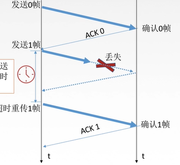
    * 注意点:
      * 发送完一个帧以后必须保留它的副本
      * 数据帧和确认帧必须编号
  * __ACK(确认帧)丢失__
    * 还是需要超时计时器,超时重传
  * __ACK迟到__
    * ACK在超时计时器时间内没有到发送端,发生重传
    * 接收端丢弃重复的帧,重传确认帧
    * 发送端收到重复的确认帧,丢弃
* 优点: 简单
* 缺点: 信道利用率低


> 信道利用率: 发送方在一个发送周期内,有效的发送数据所需要的时间占整个发送周期的比率
>
> 信道利用率 = (L/C)/T 
>
> * L: T内发送L比特数据
> * C: 发送方数据传输率
> * T: 发送周期,从开始发送数据,到收到第一个确认帧为止
>
> 信道吞吐率= 信道利用率 * 发送方的发送速率

例题:

> 一个信道的数据传输率为4kb/s,单项传播时延为30ms,如果使停止-等待协议的信道最大利用率达到80%,要求数据帧的长度至少为:
>
> $80\%=\frac{L/4}{L/4+2×30}$
>
> 然后算L

#### 5.2 后退n帧协议(GBN)

* __滑动窗口__

  * 发送窗口: 发送方维持一组连续的允许发送的帧的序号

    

  * 接收窗口: 接收方维持一组连续的的允许接收帧的信号

    

* 发送和确认过程

  * 0号帧发送,发送方建立副本,开始传输
  * 紧接着1号发送,建立副本
  * 可以持续到发送窗口发完
  * 当接收方接收到了就返回第一个确认信号,然后窗口向前一格,接收下一个
  * 发送端收到信号,窗口向前移动一格

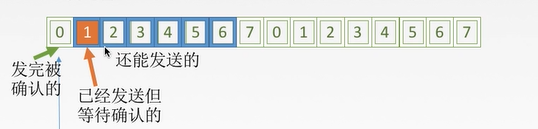

* __发送方必须响应的三件事__:

  * 上层(网络层)的调用

    上层要发送数据时,发送方先检查发送窗口是否已满,如果未满则产生一个帧并将其发送,如果窗口已满,发送方只需将数据返回给上层,暗示上层窗口已满. 上层等一会儿再发送(或者发送方缓存)

  * 收到了ACK确认帧

    GBN中,对n号帧采取了__累积确认__的方式,表明了接收方已经收到了__n号帧和它之前的全部帧__

  * 超时事件

    协议名`后退n帧`来源于出现丢失和时延过长帧时发送方的行为. 就像在停等协议中的一样,定时器将再次用于恢复数据帧或确认帧的丢失. 出现超时时,发送方重传所有已发送但未确认的帧

* 接收方要做的事

  * 如果正确收到n号帧,并且按序,那么接收方为n帧发送一个ACK,并将该帧中的数据部分交付给上层
  * 其余情况都丢弃帧,并为最近按序接受的帧重新发送ACK.接收方无需缓存任何失序帧,只需要维护一个信息: expectedseqnum(下一个按序接收的帧序号)

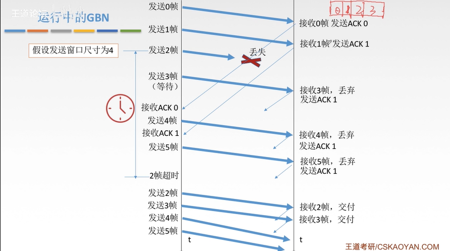

* 窗口长度问题:
  * 如果采用n个比特对帧编号,那么发送窗口的尺寸应该[1,$2^n-1$].发送窗口过大会使得接收方无法区别新帧和旧帧

* 优点: 提高了信道利用率
* 缺点: 重传时要把原来正确的重传了,很浪费,传送效率低


#### 5.3 选择重传协议(SR)

可不可以只重传出错的帧?

解决方法: 设置单个确认,**同时加大接收窗口,**设置接收缓存,缓存乱序到达的帧

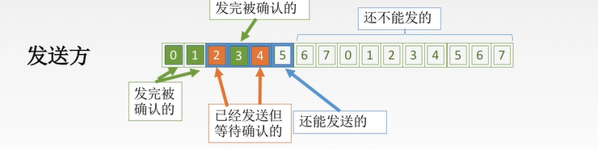


* __SR发送方做三件事__

  * 上层调用

  * 收到一个ACK

    如果收到ACK,加入该帧序号在窗口内,则SR发送方将那个被确认的帧标记为已经接收. 如果该帧序号是窗口的下届,则窗口向前移动到具有最小序号的未确认帧出. 如果窗口移动了并且有序号在窗口内的未发送帧,则发送这些帧.

  * 超时事件

    每个帧都有计时器,超时后重传一个帧.

* __SR接收方做的事__:

  * 来者不拒(窗口内的帧):

    SR接收方将确认一个正确接收的帧而__不管是否按序__. 失序的帧将被__缓存__,并且返回给发送方一个该帧的确认帧(收谁确认谁),直到所有帧(序号更小的帧)都被收到为止. __这时__才可以将一批帧按序交付给上层,__然后向前移动滑动窗口__

    如果收到了小于窗口下界的帧,就返回一个ACK

    其他情况,丢弃

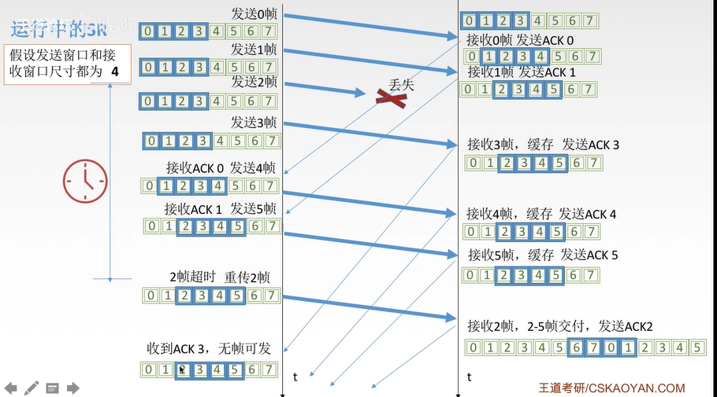

* __滑动窗口长度__
  * $W_{TMAX}=W_{RMAX}=2^{n-1}$bit,n是帧数

### 6. 介质访问控制

#### 6.1 传输数据使用的两种链路

* 点对点链路: 两个相邻节点通过一个链路相连,比如PPP协议,常用于广域网
* 广播式链路: 所有主机共享通信介质,常用于早期以太网,局域网,典型拓扑结构有总线型或星型

#### 6.2 介质访问控制

__介质访问控制__的内容就是,采取一定的措施,使得两对节点之间通信不会发生相互干扰的情况.

* 分类:
  * 静态划分信道/信道划分介质访问控制
  * 动态分配信道
    * 轮询访问介质访问控制
    * 随机访问介质访问控制
      * ALOHA协议
      * CSMA协议
      * CSMA/CD协议
      * CSMA/CA协议

#### 6.3 信道划分介质访问控制

信道划分介质访问控制: 将使用介质的每一个设备与来自同一信道上的其它设备的**通信隔离开**,把**时域和频域资源**合理的分配给网络上的设备

* 四种控制手法
  * **频分多路复用FDM**
  * **时分多路复用TDM**
  * **波分多路复用WDM**
  * **码分多路复用CDM**

> 多路复用技术:
>
> 把多个信号组合在一条物理信道上进行传输,使得多个计算机或终端设备共享**信道资源,**提高信道利用率
>
> 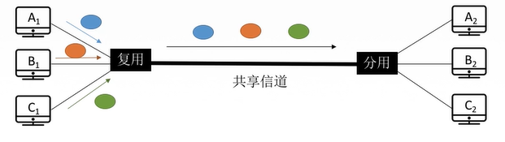
>
> 把一条广播信道逻辑上分成几条用于两个结点之间通信的互不干扰的子信道,实际就是把**广播信道转变为点对点信道**

##### 6.3.1  频分多路复用FDM

(类似并行?)

先获得一些频率段,然后将频带交给每一个用户. 用户在分配到一定频带后,在通信过程中自始至终都占用这个频带. **频分复用的所有用户在同样的时间占用不同的带宽资源**

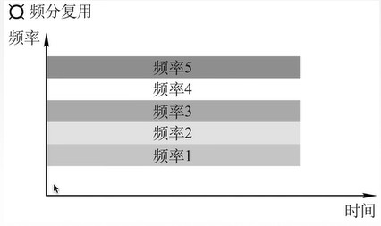

* 特点:
  * 充分利用传输介质带宽,系统效率较高; 实现比较容易

##### 6.3.2 时分多路复用TDM

(类似并发?)

将时间划分为一段段等长的时分复用帧,每一个时分复用的用户在每一个TDM帧中**占用固定序号的时**隙,所有用户轮流占用信道

(时间片轮换?)

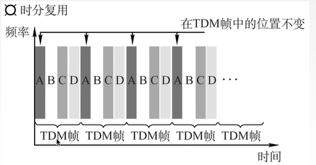

##### 6.3.3 统计时分复用STDM

对于发送频率比较低的,时分复用可能造成浪费

统计时分复用使用__集中器__收集发送频率较低的数据,并且集中起来分配STDM帧

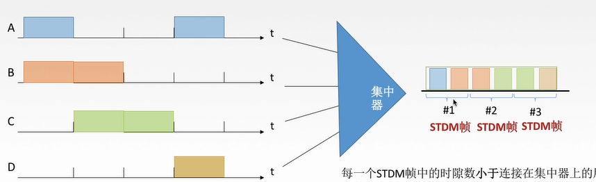

每一个STDM帧中的时隙数小于连接在集中器上的用户数. 个用户有了数据就随时发往集中器的输入缓存,然后集中器按顺序依次扫描输入缓存,把缓存中的输入数据放入STDM帧中,一个STDM帧满了就发出. __STDM帧不是固定分配时隙,而是按需动态分配时隙__

##### 6.3.4 波分多路复用WDM

波分多路复用就是__光的频分多路复用__,在一根光纤中传输多种**不同波长**的光信号,由于波长不同,所以各路光信号互不干扰,最后再用波长分解复用器将各路波长分解出来

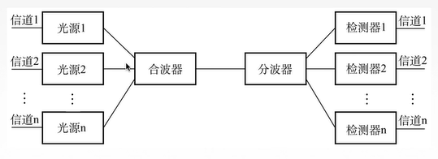

##### 6.3.5 码分多路复用CDM

__码分多址(CDMA)__是码分复用的一种方式时

码分多路复用: 1个bit分为多个码片/芯片(chip),每一个站点被指定为一个唯一m位芯片序列

发送1时站点发送芯片序列,发送0时发送芯片序列反码.(在芯片中通常把0写成-1)

* 如何不打架:

  * 多个站点同时发送数据的时候,要求各个站点芯片序列相互正交

* 如何合并: 各路数据在信道中被线性相加

* 如何分离: 合并的数据和源站规格化内积,(乘起来除以8)如果结果为-1就对应0,不然就对应1

  > 还记得吗,一组正交的相加,只有和自身相乘才不会为0,所以结果就是8个1或者8个-1(反码)相加

#### 6.4 随机访问介质访问控制

用户可以随机发送信息,发送信息时占用全部带宽

##### 6.4.1 ALOHA协议

想说就说

* __纯ALOHA__

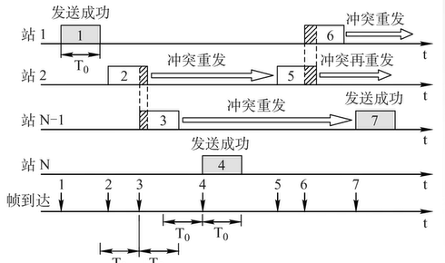

冲突如何检测?

如果发生冲突,接收方就会检测出差错然后不予确认,发送方一段时间收不到就判断出了差错

如何解决冲突?

超时重传

* __时隙ALOHA协议__

把时间分为若干个相同的时间片,所有用户在时间片开始时刻同步接入网络信道,若发生冲突,则必须等到下一个时间片开始时刻再发送

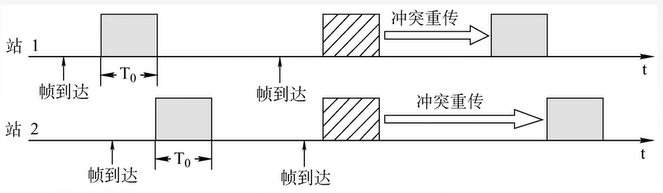

* 其他
  * 纯ALOHA比时隙ALOHA效率更低,吞吐率更低
  * 纯ALOHA想发就发,时隙只能在时间片段开始才能重发

##### 6.4.2 CSMA协议

`载波监听多路访问协议CSMA`

> CS: 载波监听,每一个站在发送数据之前要检测一下总线上是否有其他计算机在发送数据
>
> MA: 多点接入,表示许多计算机以多点接入方式连接在一根总线上

先听再说

__协议思想:__ 发送帧之前,监听信道

监听结果: 信道**空闲**就发送完整帧(三种协议),信道**忙**就推迟发送

三种协议: 1-坚持CSMA.非坚持CSMA,p-坚持CSMA

* __1-坚持CSMA:__ 如果一个主机要发送信息,那么监听信道
  * 空闲则直接传输,不必等待
  * 忙则一直监听,等待到空闲马上传输
  * 如果冲突,则等待一个随机长的事件再监听
  * 优点: 只要有媒体空闲,站点马上发送,避免了媒体利用率损失
  * 缺点: 冲突基本不可避免
* __非坚持CSMA:__ 指的是对于信道监听忙以后就不继续监听
  *  如果一个主机要发送信息,那么监听信道
  *  如果**空闲**就直接传输
  *  **忙**就等待一个随机的时间之后再进行监听
  *  优点:
     * 采用随机的重发延迟时间可以减少冲突的可能性
  *  缺点: 可能大家都在延迟等待,使得媒体利用率降低
* __p-坚持CSMA__: 指的是对于监听信道__空闲__的处理
  * 如果一个主机要发送信息,那么监听信道
  * __空闲__则以**p概率**直接传输,不必等待; 概率1-p等待到下一个时间槽再传输
  * 忙就等待一个随机的时间之后再监听
  * 优点:
    * 既能像非坚持算法那样减少冲突,又能像1-坚持算法那样减少媒体空闲时间
  * 缺点:
    * 发生冲突后还要把数据帧发送完,造成浪费

##### 6.4.3 CSMA/CD协议

`载波监听多点输入/碰撞检测协议`

> CD: 冲突检测,边发送边监听,适配器边发送数据边检测信道上信号电压的变化情况,以便判断自己在发送数据时其他站是否在发送数据.(适用半双工网络)

先听再说,边听边说

* 传播时延对载波监听的影响

  * 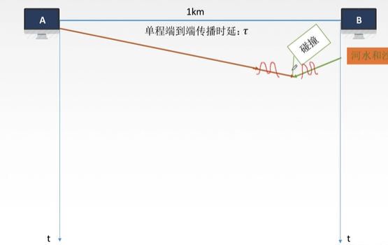
  * 如果单程端到端传播时延为$\tau$.则总线的端到端往返传播时延的__争用期/冲突窗口/碰撞窗口__为$2\tau$
  * **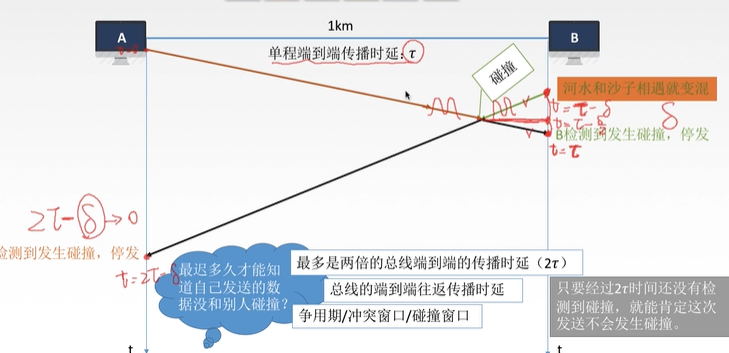**

* 重传的时机: 不可以立即重传,否则可能陷入无限循环

* CSMA/CD采用了__阶段二进制指数规避算法__

  1. 确定基本退避时间是争用期$2\tau$

  2. 定义一个参数k,它就是__重传次数__,k不超过10,即 k = min[重传次数,10]. 当重传次数不超过10时,k等于重传次数; 当重传次数大于10时,k就不再增大而一直等于10

  3. 从离散的整数集合$[0,1,...,2^{k}-1]$中随机取出一个数r,重传所需要退避的时间就是__r倍的基本退避时间__,$2r\tau$

  4. 如果重传**16次**仍然不能成功,说明网络太拥挤,认为此帧永远无法正确发出. 抛弃此帧并向高层报错

     > 示例:
     >
     > 第一次重传,k=1,r从{0,1}选,即0或2$\tau$
     >
     > 第二次重传,k=2.r从{0,1,2,3,}选,即0246\tau
     >
     > ...
     >
     > 重传次数越多,说明信道越拥挤,所以等的事件取值越来越多

* 最小帧长问题: 如果帧太小,那检测到就已经发完了,就没有CD的意义

  * __帧的传输时延至少要两倍于信号在总线中的传播时延__

    $\frac{帧长}{数据传输速率}\ge2\tau$

  * 最小帧长: $2\tau$ * 数据传输速率

  * 以太网的最小帧长是64字节

##### 6.4.4 CSMA/CA

`载波监听多点接入/碰撞避免`

为什么要有这个? 因为无线局域网中无法做到全面检测碰撞,也会出现隐蔽站问题

> 隐蔽站: A和C都检测不到信号,认为信道空闲时,同时向终端B发送数据帧就会导致冲突

* 工作原理
  * 发送数据前,先检测信道是否空闲
  * 空闲则发出__RTS__(request to send),包括发射端地址,接收端地址,下一份数据将持续发送的事件等信息,信道忙则等待
  * 接收端收到RTS后,相应一个__CTS(clear to send)__
  * 发送端收到CTS后,开始发送数据帧(同时预约信道:发送方告知其他站点自己要传多久数据)
  * 接收端收到数据后,将用CRC来检验数据是否正确,正确则相应ACK帧
  * 发送方收到ACK就可以进行下一个数据帧的发送,如果没有就一直重传到规定重发次数为止(用二进制指数退避算法)

* 手段
  * 预约信道
  * ACK帧
  * RTS/CTS(可选),解决隐蔽站问题

#### 6.5 轮询访问介质访问控制

不产生冲突,又要发送时占全部带宽

> 轮询协议
>
> 令牌传递协议

##### 6.5.1 轮询协议

**主节点轮流邀请从属节点发送数据**

询问的过程其实就是发送短数据帧,显然就是不会冲突还占了很多带宽

问题:

* 轮询开销
* 等待延迟
* 单点故障(主节点故障)

##### 6.5.2 令牌传递协议

经典结构:__令牌环__

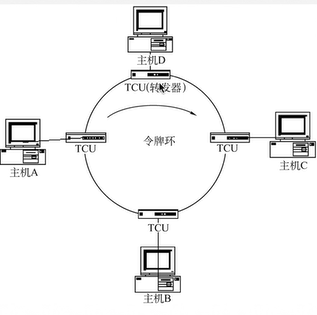

* 组成成分:

  * __令牌__: 一个特殊格式的MAC控制帧,不含任何信息

    控制信道的使用,确保同一时刻只有一个节点独占信道

    令牌环网无碰撞


令牌就在令牌环上不断轮转,当有人要发送时会给令牌带上数据并指明终点

每个节点都可以在一定时间内获得发送数据的权利,并不是无限制的持有令牌

问题:

* 令牌开销
* 等待延迟
* 单点故障

应用于:

* 令牌环网(物理星型,逻辑环形拓扑)
* 常用于负载较重,通信量较大的网络

## 五. 局域网

### 1. 局域网基本概念和体系结构

__局域网__简称LAN,是指在某一区域内由多态计算机互联成的计算机组,使用__广播信道__

特点:

1. 覆盖地理范围小
2. 使用专门铺设的传输介质联网,传输速率高
3. 通信延迟短,误码率低,可靠性较高
4. 各站为平等关系,共享传输信道
5. 多采用分布式控制和广播式通信,

局域网的主要要素: **网络拓扑 传输介质,介质访问控制方法**

* 网络拓扑
  * 星型: 集线器作为一个设备,和其他相连
  * 
  * 总线型
  * 环形
  * 树形


* 传输介质
  * 有线局域网
    * 双绞线,同轴电缆,光纤
  * 无线局域网
    * 电磁波
* 介质访问控制的方法
  * CSMA/CD
    * 常用于总线型局域网,用于树形网络
  * 令牌总线
    * 常用于总线型局域网,用于树形网络
    * 把总线或树形网络中各个工作站按一定顺序排列称为逻辑环,假装有令牌环
  * 令牌环
    * 常用于环形局域网

* **分类**
  * 以太网
    * 逻辑拓扑总线型,物理星型,使用CSMA/CD
  * 令牌环网
    * 物理星型,逻辑环形,没人用
  * FDDI网
    * 物理双环拓扑,逻辑环形拓扑
  * ATM网
    * 使用53节固定长度的单元进行交换
  * 无线局域网(WLAN)
    * 采用IEEE802.11标准

#### 1.2 IEEE802标准

IEEE802是IEEE802 LAN/MAN标准委员会指定的局域网城域网技术标准. 其中最广泛使用的有以太网,令牌环,无线局域网等

### 2. 以太网

以太网(__Ethernet__)指的是由Xerox公司创建并由Xerox,Intel,DEC公司联合开发的__基带总线局域网规范__

使用CSMA/CD

提供无连接,不可靠服务(无差错接收,不可靠传输)

> 无连接: 发送方与接收方不握手
>
> 不可靠: 不对发送方数据帧编号,接收方不向发送方进行确认,差错帧直接丢弃,差错纠正由高层负责

* 优点:
  * 造价低廉
  * 应用广泛
  * 比令牌环网,ATM网便宜,简单
* 两个标准
  * `DIX Ethernet V2`: 第一个局域网产品规约
  * `IEEE802.3`: 第一个IEEE以太网标准(两个规约只有帧格式的一点区别)
* 传输介质和拓扑结构的发展
  * 粗同轴电缆->细同轴电缆-->双绞线+集线器
  * 总线型---->星型
    * 使用集线器的以太网在逻辑上依然是总线网
    * __逻辑上总线型,物理上星型__

#### 2.2 10BASE-T以太网

10BASE-T是传送__基带信号__的双绞线以太网,T表示采用双绞线. 现在采用的是__无屏蔽双绞线(UTP)__,传输速率10MB/s

物理上星型,逻辑上总线,每段双绞线最长100m

采用曼彻斯特编码

#### 2.3 适配器与MAC地址

* 计算机与外界有局域网的链接是通过__通信适配器__的

通信适配器的ROM上有计算机的硬件地址__MAC地址__

MAC地址: 每个适配器有一个全球唯一的48位二进制地址,前24位代表厂家,后24位厂家自己指定

#### 2.4 MAC帧

最常用MAC帧采用的是以太网V2的格式


#### 2.5 高速以太网

速率大于等于100Mb/s的以太网称为高速以太网

* 100BASE-T
* 吉比特以太网
* 10吉比特(10Gbit)

### 3. 无线局域网

`IEEE802.11`是无线局域网的通用标准


802.11的mac帧头格式:


* 地址1: RA接收端
* 地址2: TA发送端
* 地址3: DA目的地址
* 地址4: SA 源地址

RATA类似于__基站的MAC地址__

DASA类似于__实际通信的MAC地址__

* 分类:
  * 有固定基础设施的无线局域网
  * 无固定基础设施的自组织网络

