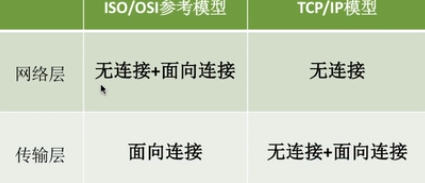
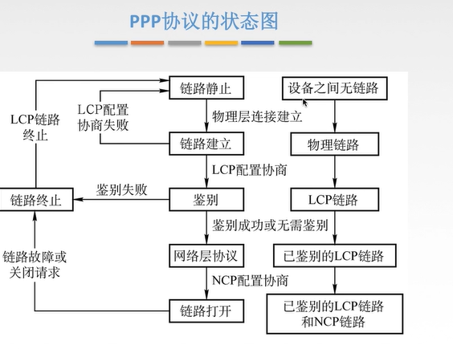
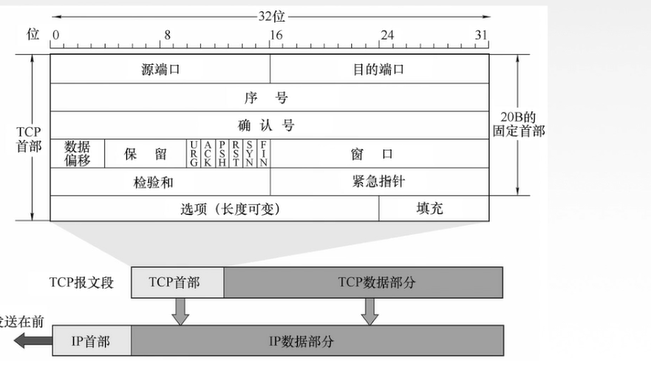
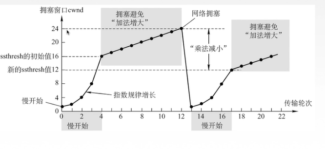
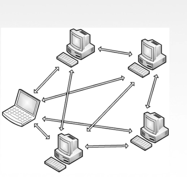
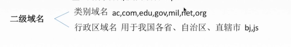

# 计算机网络 

[TOC]

  ## 一. 绪论 

  ### 1.计算机网络是什么？ 

  * `计算机技术`和`通信技术`相结合得产物 
  * 多个__独立自制 相互链接__的计算机集合 

计算机系统是一个将分散的具有独立功能的**计算机系统**,通过**通信设备**和**线路**连接起来,由功能完善的***软件***实现**资源共享**和**信息传递**的系统

计算机网络是多个__互连自治__的计算机集合(无主从关系)

  ### 2. 演变 

  * 具有通信的连接系统：终端-线路-计算机 
  * 具有通信功能的分时系统：终端-集中器-计算机 
  * 计算机网络：独立的计算机互联 
  * 国际标准化网络 
    * TCP/IP 

  ### 3. 功能 *

  * 数据通信 
  * 资源共享 
  * 并行和分布式处理 
  * 提高可靠性
    * 如果一台主机坏了,另一台能代替他 
  * 扩充性 /负载均衡

  ### 4. 组成结构 

网络由若干__结点（node）__和链接这些结点的__链路（link）__组成 

由硬件,软件,协议构成

* 工作方式分为

  * **边缘部分**: 用户直接使用,分为C/S和P2P
  * **核心部分**: 为边缘部分服务的部分

  ### 5. 子网 

功能性组成:

**通信子网**和**资源子网**

* 应用层,表示层,会话层 是资源子网(资源共享/数据处理)
* 网络层,数据链路层,物理层 是通信子网(数据通信)


  ### 6. 拓扑结构 

以太网：物理上星型，逻辑上总线，需要解决冲突问题 

* 网状拓扑 mesh topology 
  * 避免拥塞 
  * 好健壮性 
  * 安全 便于管理 
  * 安装费用高 
  * 星状拓扑 star topology 
  * 从中央控制器向外连（比如集线器hub 
  * 拓扑结构简单 
  * 健壮性 
  * 便于管理 
  * 中央控制器是网络瓶颈 

* 树状拓扑 tree 
  * 星星连星型连计算机，拓展规模，隔离通信 
* 总线型拓扑 bus 
  * 所有主机连到bus上，不需要路由器 
  * 但是总线长度有限，有故障隔离问题 
  * 广播型设备 
* 环状拓扑 ring 
* 混合型拓扑 hybrid 

### 7. 体系结构 

计算机网络是一个复杂的系统，设计和实现中需要__分层处理__，每层完成__特定的功能__，各层协调成一个完整网络系统。 

### 8. 分类

* 按照分布范围: 广域网WAN,城域网MAN,局域网WAN,个人区域网PAN
* 按使用者: 公用网,专用网
* 交换技术: 电路交换,报文交换,分组交换
* 按拓扑结构分: 总线型,星型,环形,网状型(常用语广域网)
* 按传输技术: 广播式网络(共享),点对点网络.(一对一)

### 9. 标准化工作

标准化工作对于计算机网络至关重要,要实现不同厂商的软硬件联通,必须遵循指定标准

* 分类:
  * 法定标准: 由权威机构制定的正式的,合法的标准,如OSI
  * 事实标准: 某些公司产品在竞争中占据了主流,自然成为标准,比如TCP/IP

RFC:因特网标准的形式

* 四个阶段
  * 因特网草案
  * 建议标准(成为RFC)
  * 草案标准
  * 成为因特网标准

### 10. 速率相关

`速率`即 数据率/数据传输率/比特率(bit)

连接在计算机网络上的主机在数字信道上传送数据位数的速率

b: bit B: Byte

`带宽`,原本指某个信号具有的频带宽度(最高频率和最低频率之差),单位Hz

现在的带宽表示网络通信线路传送数据的能力,通常指单位时间内从网络的某一点到另一点能通过的"**最高数据率**(速率)",单位是"比特/秒"

带宽指的是主机发送数据的速度而不是传送速度


`吞吐量`在单位时间内通过某个网络(/信道/接口)的数据量,单位b/s

受带宽或速率限制

### 10. 时延相关

`时延/延迟`: 指数据从网络(链路)的一段传送到另一端所需要的时间,单位为s

四个部分组成,想要就相加

* `发送时延 `= **数据长度/信道带宽(发送速率)** ,高速链路指提高这个部分
* `传播时延 `= 取决于电磁波传送速度和链路长度 __信道长度/电磁波在信道上的传播速率__
* `排队时延` = 等待输入|输出链路可用
* `处理时延 `= 检错,找出口的时间

`时延带宽积`: 指 __传播时延*带宽__ 单位b,是描述信息量的属性,也称为以比特为单位的链路长度,描述"某段链路现在有多少比特"(容量)

`往返时延RTT`: 从发送方发送数据开始,到发送方收到接收方的确认 总共经历的时延,用ping可以测

* RTT越大,收到确认前可以发送的数据越多
* RTT包括: 
  * 往返传播时延 = 传播时延*2
  * 末端处理时间

`利用率`: 

* 信道利用率: 有数据通过时间/总时间
* 网络利用率: 信道利用率加权平均

* 利用率越大,时延越大

## 二. 分层结构

### 1. 为什么分层

* 发送文件前要完成的工作:

  * 发起通信的计算机必须将数据通信的通路**激活**

  * 告诉网络如何识别目的主机

  * 发起通信的计算机查明目的主机是否开机

    ...

* 分治解决

实体: 每一个活动元素称为实体

协议: 一系列的规则和约定

接口: 每层之间有个接口

服务: 上层调用下层的服务

 

### 2. 分层基本原则

1. 各层相互独立,每层只能实现一种相对独立的功能
2. 每层之间界面自然清晰,易于理解,相互交流尽可能少
3. 结构上可分割,每层都采用最合适的技术
4. 保持下层对上层的独立性,上层单向使用下层提供的服务
5. 整个分层结构应该能促进标准化工作

### 3. 分层结构


`实体`: 第n层中的活动元素称为n层实体,同一层的实体叫__对等实体__

`协议`: 为进行网络中对等实体的数据交换而建立的规则,标准或约定称为网络协议

* 协议的三个要素
  * 语法: 规定传输数据的格式
  * 语义: 规定要完成的功能
  * 同步: 规定各种操作的顺序

`接口`: 上层使用下层服务的入口(相邻)

`服务`:下层为相邻上层提供的功能调用

 

`SDU服务数据单元`: 为完成用户要求的功能而应传送的数据

`PCI协议控制信息`: 控制协议操作信息

`PDU协议数据单元`: 对等层次之间传送的数据单位

上一层PDU = 下一层SDU

### 4. OSI参考模型

ISO/OSI模型是7层的**法定标准**,为了支持异构网络系统的的互联互通

理论上很成功,市场上很失败.

 应用层 表示层 会话层 传输层 网络层 数据链路层 物理层

> 物联网赎回适用

#### 4.1 七层通信


上面四层 称为 端到端通信

下面三层 称为 点到点通信

发送端每一层都会给上一层的数据(SDU)附加一段(数据链路加两段)控制信息(PCI),就能越来越大

#### 4.2 应用层

应用层 是用户与网络的界面,__本质__是所有能和用户交互产生网络流量的程序

> 典型应用层服务:
>
> ​	文件传输(FTP),电子邮件(SMTP),万维网(HTTP)

#### 4.3 表示层

表示层

 用于处理在两个通信系统中**交换信息的表示方式**

* 功能一. 数据格式变换
* 功能二. 数据加密解密
* 功能三. 数据压缩和恢复

#### 4.4 会话层

会话层 向表示层实体/用户进程提供**建立连接**并在连接上**有序地传输数据**

这整个过程称为__会话__,也是__建立同步(SYN)__

* 功能一. 建立,管理,终止会话
* 功能二. 使用校验点可以使会话在通信失效时从__校验点/同步点___继续恢复通信,实现数据同步
  * 适用于传输大文件

> ADSP,ASP

#### 4.5 传输层

负责两个主机中的__两个进程__的通信,即端到端通信,即__端到端__通信.传输单位是报文或数据报

* 功能一. 可靠传输,不可靠传输
* 功能二. 差错控制
* 功能三. 流量控制
* 功能四. 复用分用
  * 复用: 多个应用层进程可同时使用下面的传输层服务
  * 分用: 传输层把收到的信息分别交付给上面应用层中相应的进程

> TCP,UDP

#### 4.6 网络层(最重要)

主要任务是把__分组__从源端传到目的端,为分组交换网上的不同主机提供通信服务

网络层传输单位是__数据报__

分组=>数据报

* 功能一. 路有选择(选择最佳路径)
* 功能二. 流量控制
* 功能三. 差错控制
* 功能四: 拥塞控制
  * 如果所有节点都来不解接收分组,而要丢弃大量分组的话,网络就处于**拥塞**状态

#### 4.7 数据链路层

主要任务是把网络层传下来的数据报__组装成帧__

传输单位__帧__

* 功能一. 成帧(定义帧的开始和结束)
* 功能二. 差错控制(帧错+位错)
* 功能三. 流量控制
* 功能四. 访问控制(控制对信道的访问)

> SDLC,HDC

#### 4.8 物理层

在__物理媒体__上实现比特流的透明传输

物理层的传输单位是__比特__

__透明传输__: 不管所传数据是什么样的比特组合,都应当能在链路上传送

* 功能一. 定义接口特性
* 功能二. 定义传送模式
  * 单工: 单向
  * 双工: 双向
  * 半双工: 双向,同一时刻只能一方到另一方
* 功能三. 定义传送速率
* 功能四. 比特同步
* 功能五. 比特编码

> Rj45,802.3

### 5. TCP/IP参考模型

先实践后理论的参考模型,更有价值


#### 5.1 和OSI的异同

同

1. 都分层
2. 基于独立的协议栈的概念
3. 实现异构网络互联

异

1. OSI有服务,协议,接口
2. OSI先于协议出现,不偏向腾协议
3. TCP/IP设计之初就想到异构网互联问题(在网络层无连接),将IP作为重要层次



> 面向连接: 分为三个阶段,建立连接,传输数据,释放连接
>
> 物理额济纳: 直接数据传输

#### 5.2 五层参考模型

 是一个概念

## 三. 物理层

### 1. 基本概念

物理层解决如何在连接各种计算机的传输媒体上传输数据比特流

主要任务: 确定与传输媒体接口有关的一些**特性** -->定义标准

* 特性:
  * `机械特性`:定义物理连接的特性,规定物理连接所采用的规格,接口形状,**引线数目,引脚数量**和排列情况
  * `电气特性`:规定传输二进制位时,线路上信号的**电压范围**,阻抗匹配,传输**速率**和**距离限制**等
  * `功能特性`: 指明某条线上出现的**某一电平的何种意义**,接口部件的信号线用途
  * `规程特性`: 定义各条物理线路的**规程和时序**的关系


### 2. 数据通信的基础知识


信源-发送器-传输系统-接收器-信宿

#### 2.1 相关术语

通信的目的是传送信息

__数据__: 传送信息的实体,通常是有意义的符号序列

__信号__: 数据的电气/电磁的标签,是数据在传输过程中的存在形式.

* 数字信号: 离散
* 模拟信号: 连续

__信源__: 产生和发送数据的源头

__信宿__: 接收数据的终点

__信道__: 信号的传输媒介,一般用来表示向某一方向传送信息的截止,因此一条通信线路往往包含一条发送信道和一条接收信道


#### 2.2 三种通信方式

* 单工通信: 只有一个方向的通信而没有反方向的交互,仅需要一条信道
* 半双工通信: 通信双方都可以发送或接收信息,但任何一方都不能同时发送和接收,需要两条信道
* 全双工通信: 通信双方可以同时发送和接受信息,需要两条信道

#### 2.3 两种数据传输方式

* 串行
  * 速度慢,费用低,适合远距离
* 并行
  * 速度快,费用高,适合近距离


### 3. 四个常见参数

__码元__是指用一个**固定时长**的**信号波形**,代表不同离散数值的基本波形,是数字通信中数字信号的计量单位.这个固定时长内的信号称为__k进制码元__,而该时长称为__码元宽度__.当码元的离散状态有M个时,此时码元为M进制码元

1码元可以携带多个比特的信息量,例如用二进制编码时只有两种不同的码元,一种代表0状态,另一种代表1状态

二进制码元

四进制码元

__速率__: 也叫数据率,是指数据的**传输速率/发送速率,**表示单位时间内传输的数据量. 可以用码元传输速率和信息传输速率表示(跟传播速率不一样,传播速率和电磁波有关)

* **码元传输速率:** 别名码元速率,波形速率,调制速率,符号速率.表示单位时间内数字通信系统所传输的码元个数(脉冲个数/信号变化次数),单位为__波特(Baud)__(码元/秒). 1波特表示数字通信系统每秒传输一个码元,这里的码元可以是多进制的,也可以是二进制的,速率与进制无关. 1s内传输多少码元
* __信息传输速率__: 别名比特率,就是一秒传输多少个比特

比特率 = M波特 * n bit/s (假定码元=n bit)

__带宽__: 最高数据率

### 4. 编码&调制

__信道__: 

信道上传送的信号又分为两种:

* 基带信号: 将数字信号1和0直接用**两种**不同的电压表示,再送到数字信道上去传输(基带传输)
  * 来自信源的信号就是基带信号. 基带信号就是发出的直接表达了要传输的信息的信号,声波也是基带信号
  * 适合近
* 宽带信号: 将基带信号进行调制后形成的**频分复用模拟信号**,再传送到模拟信道上去传输(带宽传输)
  * 把基带信号经过载波调制后,把信号的频率范围搬移到较高的频段以便在信道中传输
  * 适合远

#### 4.2 编码与调制


#### 4.3 数字数据-编码-数字信号

> 六种:
>
> 1. **非归零编码(NRZ)**
> 2. **曼彻斯特编码**
> 3. **差分曼彻斯特编码**
> 4. 归零编码(RZ)
> 5. 反向不归零编码(BRZI)
> 6. 4B/5B编码


* 非归零编码(NRZ)
  * 高电平就是1,低电平就是0
  * 编码容易实现,不能检错,无法判断码元的开始和结束. 以至于__收发双方难以保持同步__
  * 需要告知时钟周期
* 归零编码
  * 信号电平在一个码元之内都要恢复到0
  * 不推荐


* 反向不归零编码
  * 
  * 电平出现变化(翻转)表示0,电平不变表示1
  * 还是需要确定时钟周期时
* __曼彻斯特编码__
  * 将一个码元分成两个相等的间隔. 前一个间隔为低电平,后一个间隔为高电平表示码元1,码元0就相反.
  * 规定也可以相反,特点是在每一个码元的中间出现电平跳变,位中间的跳变既作为时钟信号又作数据信号,但他所占频带宽度是原始基带宽度的两倍
  * 每一个码元被调成两个电平,所以**数据传输速率只有调制速率的二分之一**
    * 因为一个时钟周期有两个脉冲,调制速率(脉冲速率,码元传输速率)加倍
* 差分曼彻斯特编码
  * 同1异0,看的是在虚线两边的信号
  * 如果码元为1,则前半个码元的电平和上一个码元的后半个码元电平相同,若0则不同. 每个码元中间都有电平的跳转,可以实现自同步,**抗干扰性强**于曼彻斯特
* 4B/5B编码
  * 比特流中插入额外bit来打破一连串的0,1.就是用5个bit来编码4bit的数据,再传给接收方,称为4B/5B
  * 编码效率80%

#### 4.3 数字数据-调制-模拟信号

数字数据调制技术在发送端将__数字信号转换为模拟信号__,在接收端将模拟信号还原为数字信号,分别对应调制/解调过程

> 调制方式:
>
> 1. 2ASK
> 2. 2FSK
> 3. 2PSK
> 4. QAM

* **2ASK**

  * 又叫做**调幅**,0没有幅度,1有幅度
  * 

* **2FSK**

  * 又叫**调频**,0的频率小,1的频率大
  * 

* __2PSK__

  * __调相__,对相位的调制,0和1对应两种波形

* __QAM__

  * 调相+调幅

    > 例题: 某通信链路的波特率是1200Baud,采用4个相位,每个相位有4种振幅的QAM调制技术,则该链路的信息传输速率是多少
    >
    > ```
    > 解: 
    > 	4*4 = 16种波形,即16种(进制)码元
    > 	所以需要4个比特位表示16中码元(1码元 = 4bit)
    > 	1200*4 = 4800bit/s
    > ```
    >
    > 

#### 4.4 模拟数据-编码-数字信号

计算机内部处理的是二进制数据,处理的都是__数字音频__,所以需要将模拟音频通过采样,量化转换**成有限个数字表示的离散序列**(音频数字化)

最典型的就是对音频信号进行编码的脉冲调制(__PCM__),在计算机应用中,能达到最高保真水平的就是PCM编码. 被广泛用于素材保存及音乐欣赏,CD,DVD以及我们常见的WAV均有应用,主要包括: 抽样,量化,编码

* 抽样: 对模拟信号周期性扫描,把时间上连续的信号编程时间上离散的信号

  * 为了使锁的离散信号能无失真的代表被抽样的模拟数据,要使用采样定理
    $$
    f_{采样频率}\ge 2f_P{信号最高频率}
    $$

* 量化: 把抽样取得的电平幅值按照一定的分级标准转化为对应的数字值,并取整数,这样就把连续的电平幅值转换为离散的数字量

* 编码: 把量化的结果转换为与之对应的二进制编码


#### 4.5 模拟信号-调制-模拟信号

为了保证传输的有效性,可能需要较高的频率,这种调制方式还可以用频分复用技术,充分利用带宽资源. 在电话机和本地交换机所传输的信号是...

(这不重要)

### 5. 奈氏准则,香农定理

* __失真__:
  * 在现实中的信道,带宽受限还有噪声干扰,所以会失真
  * 影响因素:
    * 码元传输速率
    * 信号传输距离
    * 噪声干扰
    * 传输媒体质量
* 失真的一种现象: __码间串扰__
  * 当频率过高时,以至于接收端收到的信号波形失去**了码元之间清晰界限**的现象

`信道带宽`: 信道能通过的最高频率和最低频率之差

#### 5.2 奈氏准则(奈奎斯特定理)

__奈氏准则__: 在理想低通条件下,为了避免码间串扰,**极限码元传输速率**位2W Baud,W是带宽,单位是Hz(只有这里带宽会用Hz表示)

> 极限码元传输速率和极限数据率要区分开,
>
> 理想低通信道下的极限数据传输率 = 2Wlog$_2$V(b/s) V:几种码元,码元的离散电平数目

**信道频带越宽,**能通过的信号高频分量越多,就可以用更高的速率进行码元的有效传输

只给出了码元传输限制,没有对信息传输速率进行限制

由于码元的传输速率受奈氏准则的制约,所以要提高数据的传输速率,就必须设法使每个码元能携带更多的比特信息量,这就需要采用多元制的调制方法.

#### 5.3 香农定理

噪声存在于所有的电子设备和通信信道中. 由于噪声的随机产生,它的瞬时值有时会很大,因此噪声会使接收端对码元的判决产生错误. 但是噪声的影响是相对的,若信号较强,那么噪声影响相对较小. 因此 __信噪比__会很重要.

信噪比 = 信号的平均功率/噪声的平均功率 ,常记为`S/N`,用分贝作为度量单位

信噪比(dB) = 10log$_{10}$(S/N) 数值等价,数量级的十倍

__香农定理__: 在带宽受限且有噪声的信道中,为了不产生误差,**信息的传输速率**有上限值
$$
信道的极限数据传输速率 = Wlog_2(1+S/N)\ (b/s)
$$
S: 信道所传信号的平均功率

N是高斯噪声功率

> 推论:
>
> 1. 信道带宽 或 信噪比越大 极限传输速率越高
> 2. 对于一定传输带宽和一定信噪比,信息传输速率上限确定
> 3. 只要信息的传输速率低于信道的极限传输速率,就一定能找到某种方法来实现无差错传输
> 4. 香农定理得出的为极限信息传输速率,实际信道能到达的传输速率比他低不少
> 5. 如果W或S/N无穷大,则极限传输速率也没上限

### 6. 物理层传输介质

传输介质也叫传输媒体/传输媒介,它就是数据传输系统中在发送设备和接收设备之间的**物理通路**

传输媒体并不属于物理层,它可以称为第0层,传输媒体无脑传输信号<u>,但物理层</u>规定了__电气特性__,因此物理层能够识别所传送的比特流

* 分类:
  * 导向性: 沿着固体媒介传播,比如铜线
  * 非导向性: 自由空间,比如海水,空气

#### 6.1 双绞线

双绞线是最古老的最常用的传输介质,由两根采用一定规则并排绞合的,相互绝缘的铜导线组成

绞合: 可以减少对相邻导线的电磁干扰


* 为了进一步提高抗电磁干扰能力,可以在双绞线外面加上一个由金属丝编织成的屏蔽层,这就是__屏蔽双绞线__(STP),没有屏蔽的叫UTP

* 特点:
  * 便宜,常用
  * 距离太远时,对于模拟传输 需要用放大器放大衰减的信号
  * 对于数字传输 要用中继器将失真的信号整形

#### 6.2 同轴电缆

同轴电缆由 __导体质导线,绝缘层,网状编织屏蔽层,导体铜制芯线__构成


* 分类:
  * 基带同轴电缆: 传数字信号
  * 宽带同轴电缆: 传宽带信号,主要用于有线电视系统


* 特点:
  * 抗干扰能力强
  * 传输距离远
  * 比双绞线更贵

#### 6.3 光纤

光纤通信就是利用光导纤维传递__光脉冲__来进行通信. 有光脉冲表示1,无光脉冲表示0. 可见光的频率大约是10$^8$MHz,光纤的__带宽远远大于__目前其他各种传输媒介的带宽

在发送和接收的时候需要光电转换

* 构造:
  * 光纤主要由 __纤芯(实心的)__和__包层__构成. 折射率较低,入射角较大出现全反射,不断传播,超低损耗
  * 一般捆成一条光缆
* 分类:
  * 多模光纤: 
    * 有多种传输光信号模式的光纤
    * 光源是普通发光二极管
    * 易失真,近距离传输
  * 单模光纤:
    * 在横向模式直接传输光信号的光纤
    * 光源是定向性很好的发光二极管
    * 衰耗少,适合远距离


* 特点:
  * 传输损耗小,中继距离长,对远距离很经济
  * 抗雷电和电磁干扰性能好
  * 无串音干扰,保密性好,不易被窃听或截取
  * 体积小,重量轻

#### 6.4 非导向性传输介质:

#### 6.5 无线电波

向__所有方向__传播

有较强的穿透能力,可以传远距离,广泛用于通信领域

#### 6.6 微波

信号沿着__固定方向__传播

通信频率较高,频段范围宽,数据率高.

* 应用:
  * 地面微波接力通信
  * 卫星通信

#### 6.7 红外线,激光

信号沿着__固定方向__传播

### 7. 物理层设备

#### 7.1 中继器

诞生原因: 由于存在损耗,在线路上传输的信号功率会衰减,以至于失真,导致接收错误

中继器功能: 对信号__再生和还原__,对衰减的信号放大,保持与元数据相同,以增加信号传输的举例,延长网络的长度


中继器的两端: 两端的网络部分是网段而不是子网,适用于完全相同的两类网络的互连,且两个网段速率要相同

* 只作用于信号的电气部分,并不管数据中是否有错误数据或不适用于网段的数据
* 两端可以连相同媒体,也可以不同媒体
* 中继器两端的网段一定要是同一个协议

5-4-3规则: 网络标准中都对信号延迟范围做了具体规定,中继器只能在规定的范围进行,否则会网络故障

5个网段,4个中继器,只有三个段可以挂接计算机

#### 7.2 集线器(多口中继器)

再生,放大信号

功能: 对信号进行__再生放大转发__,接着转发到其他所有处于工作状态的端口上,以增加信号传输的举例,延长网络长度. 不具备信号定向传送能力,是一个共享式设备


## 四. 数据链路层

### 1. 基本概念

`结点`: 主机/路由器

`链路`: 网络中两个结点之间的**物理信道**,链路的传输介质主要有双绞线,光纤和微波

`数据链路`: 网络中两个结点的**逻辑通道**,把实现控制数据传输协议的硬件和软件加到链路上就构成数据链路

`帧`: 链路层的协议数据单元,封装网络层的数据报

__数据链路层__负责通过一条链路从一个节点向另一个物理链路直接相连的相邻接点传送数据报

### 2. 数据链路层功能概述

数据链路层在物理层提供服务的基础上**向网络层提供服务**,其最基本的服务是将源自网络层来的数据__可靠__的传输到相邻节点的目标机网络层. 其主要作用是**加强物理层传输原始比特流的功能**,将物理层提供的可能出错的物理连接改造成为__逻辑上无差错的数据链路__.使之对网络层表现为一条无差错的链路

* 功能一: 为网络层提供服务: 无确认无连接服务,有确认无连接服务,有确认面向连接服务(有链接一定有确认)
* 功能二: 链路管理,即连接的建立,维持,释放
* 功能三. 组帧
* 功能四. 流量控制,限制发送方
* 功能五: 差错控制

### 3. 封装成帧/组帧

封装成帧就是在一段数据的前后部分添加首部和尾部,这样就构成了一个帧. 接收端在收到物理层上交的比特流后,就能根据首部和尾部标记,从收到的比特流中识别帧的开始和结束


首部和尾部包含许多控制信息,他们的一个重要作用: __帧定界__(确定帧的界限)

__帧同步__: 接收方应当能从接受到的二进制比特流中区分出帧的起始和终止

在封装过程中,数据报长度一定小于等于**最大传送单元MTU**

* 四种方法组帧
  * 字符计数法
  * 字符(节)填充法
  * 零比特填充法
  * 违规编码法

* __透明传输__: 指不管所传数据是什么样的比特组合,都应当能在链路上进行传送 . 这样链路就看不见有什么妨碍数据传输的东西
  * 当所传数据的比特组合恰巧与某个控制信息完全一样时,就应该采取适当措施,使接收方不会将这样的错误数据认为是某种控制信息,这样才能保证数据链路层的传输是透明的.

#### 3.1 字符计数法

帧首部用一个计数字段(第一个字节,8位)来表名帧内字符数


* 缺点: 如果计数出了差错,那后面全错了

#### 3.2 字符填充法

* 前置: (这不是字符填充法)

设置两个比特组合作为`SOH(Start Of Header)`和`EOT(end of transmission)`

然后在两个中间填充数据


* 若传送的帧是文本文件组成的(文本文件的字符都是键盘输入的),可以实现透明传输
* 若不是文本文件,就有可能出现SOH或EOT出现在数据中的情况,需要__用字符填充法来解决__

字符填充法:

* 在数据中众多EOT,SOH之前,在前面加上`转义字符ESC`,在数据中的ESC前也要加转义字符


#### 3.3 零比特填充法

5"1"1"0"原则

SOH = EOT = 01111110

然后按照这样的方法组帧:

* 在接收端,扫描整个信息字段,只要连续5个1,就立即填入1个0

这样就透明传输了

**常用**

#### 3.4 违规编码法

对曼彻斯特编码,每个数据中间都会出现电平转换

所以可以用"高-高","低-低"来定界帧的起始和终止

**最常用**

### 4. 差错控制

差错: 基本都是由噪声引起的

* 位错: 比特位出错
* 帧错:
  * 帧丢失
  * 帧重复
  * 帧失序

噪声:

* 全局性: 由于线路本身电气特性所产生的随机噪声,是信道固有的,随机存在的
  * 解决方法: 提高信噪比
* 局部性: 由于外界特定短暂性原因所产生的冲击噪声,是差错的主要原因
  * 解决方法: 利用编码技术来解决

|             | 无确认无连接服务 | 有确认无连接服务         | 有确认面向连接服务       |
| ----------- | ---------------- | ------------------------ | ------------------------ |
| 面向的链路: | 通信质量好       | 通信质量差的无线传输链路 | 通信质量差的无线传输链路 |
|             | 有线传输链路     |                          |                          |
|             |                  |                          |                          |

针对比特错,我们有__检错编码,纠错编码__

> 编码: 数据链路层编码和物理层的数据编码和调制不同. 物理层编码针对的是单个比特,解决传输过程中比特同步问题,如曼彻斯特编码,二数据链路层的编码针对的是一组比特,它通过**冗余码**技术实现一组二进制比特串在传输过程中是否出现了差错
>
> __冗余编码__
>
> * 在数据发送之前,先按照某种关系附加上一定的**冗余位**,构成一个符合某一规则的码字后在发送. 当要发送的有效数据变化时,相应的冗余位也随之变化,使码字遵从不变的规则. 接收端根据收到的码字是否符合原规则判断是否出错

#### 4.2 检错编码

* __奇偶校验码__:
  * 构成: n-1位信息元 + 1位校验元
  * 分类: 奇校验码,偶校验码
  * 对于奇校验码,保证加上校验元后,`1`的个数为奇数; 偶校验同理

```latex
如果一个字符S的ASCII编码从低到高依次为1100101,采用奇校验,在下述收到的传输后字符中,哪种错误不能检测
A. 11000011
B. 11001010
C. 11001100
D. 11010011
ANS: D 因为D满足奇校验
```

* 奇偶校验码特点:
  * 只能检测出奇数个比特错误,检错能力为50%

>  另一种: 水平奇偶校验码
>
> 将所有数据字节竖着排,相同位进行奇偶校验,最后形成一串8位校验码放在数据最前面
>
> 还有两种结合都用的


* __CRC循环冗余码__

基本思想: 

例题:

<blockquote style=";border:none;border-radius:2px;color:black;font-size:15px">
例: 要发送的数据时1101011011,采用CRC校验,生成多项式是10011,则最终应该发送的数据是?
<br/>解:<br/>
    第一步: 发送的数据 = 要发送的数据 +(拼串) <b>帧检验序列FCS</b><br/>
    第二步: 计算FCS:<br/>&nbsp;&nbsp;&nbsp;
    先按照生成多项式的阶r(就是生成多项式的位数 - 1),向数据后面加r个0
    <br/>&nbsp;&nbsp;&nbsp;
    (在此处就是r=4,第一步生成了11010110110000)<br/>&nbsp;&nbsp;&nbsp;
    再将生成的数字除以多项式(模二除法,用小学除法做),余数为FCS/冗余码
    (在此处余数是1110)<br/>
    第三部: 要发送的数据=1101011011 1110


二进制除法,上面减下面可以用异或

接收端检错过程:

把收到的每一个帧都除以同样的除数,然后检查得到的余数R

* 如果余数为0就没有差错
* 不然有差错,丢弃

FCS的生成以及接收端CRC检验都是硬件实现,处理迅速

#### 4.3 纠错编码

__海明码__: 可以__发现双__比特错,__纠正单__比特错

工作原理: 动一发而牵全身

1. 确定校验码位数

   > 使用海明不等式: $2^r \ge k + r + 1$
   >
   > r为冗余信息位,k为信息位
   >
   > 示例: 假设D=101101,则k=6,满足不等式的最小r为4,则海明码有10位,元数据6位,校验码4位

2. 确定校验码和数据的位置

   > 跟着示例: 
   >
   > 假设这4位校验码为$P_1,P_2..P_4$,数据从左到右为$D_1...D_6$
   >
   > $P_i$的位置: 只能放在2的次方的位置,比如1,2,4,8
   >
   > D的位置: 把剩下的填满
   >
   > | 1    | 2    | 3    | 4    | 5    | 6    | 7    | 8    | 9    | 10   |
   > | ---- | ---- | ---- | ---- | ---- | ---- | ---- | ---- | ---- | ---- |
   > | P_1  | P_2  | D1   | P_3  | D2   | D3   | D4   | P_4  | D5   | D6   |
   > |      |      | 1    |      | 0    | 1    | 1    |      | 0    | 1    |
   >
   > 

3. 求P值

> 规律: 我们知道对于P的位置都是2的n次方,所以二进制表示只有一个1
>
> 则它的值是所有跟他做__与运算__结果不为0的D的和(就是跟他一样的那位为1的所有D的和)取最低位
>
> (和取最低位 等价于 令所有要校验的位异或为0)
>
> | 0001 | 0010 | 0011 | 0100 | 0101 | 0110 | 0111 | 1000 | 1001 | 1010 |
> | ---- | ---- | ---- | ---- | ---- | ---- | ---- | ---- | ---- | ---- |
> | 1    | 2    | 3    | 4    | 5    | 6    | 7    | 8    | 9    | 10   |
> | P_1  | P_2  | D1   | P_3  | D2   | D3   | D4   | P_4  | D5   | D6   |
> | 0    | 1    | 1    | 0    | 0    | 1    | 1    | 1    | 0    | 1    |
>
> P1在最低位为1,D1,D2,D4,D5在最低位也为1,所以P1的值就是0
>
> P2第二位是1,对应D1,D3,D4,D6值为0
>
> 以此类推

4. 检错纠错

   > 智能纠错方法:
   >
   > * 从P1开始计算对应位异或,比如P1异或结果是1,P2位0,P3为1,P4为0
   > * 最后得到的0101就是错误位(P4P3P2P1排列),即第5位出错了,知道错误就可以改了
   > * 在P1..P4跟位数12345正相关时可以这么用

### 5. 流量控制/可靠传输

较高的发送速度和较低的接受能力不匹配,会造成传输出错. 所以流量控制也是链路层的影响重要工作

链路层的流量控制是点对点的,传输层流量控制是端到端的.

__数据链路层__的流量控制手段: 接收方收不下就不回复确认

__传输层__的流量控制手段: 接收端给发送端一个窗口公告

* 方法:
  * **停止-等待协议**
  * **滑动窗口协议:**
    * **后退N帧协议(GBN)**
    * **选择重传协议(SR)**

> 停止-等待协议: 每发送完一个帧就停止发送,等待对方的确认. 收到确认帧后再发送下一个帧
>
> 
>
> 滑动窗口协议: 
>
> 

停止等待协议: 发送窗口大小=接收窗口大小=1

后退n帧协议(GBN): 发送窗口大小>1, 接收窗口大小 = 1

选择重传协议(SR): 发送窗口大小>1, 接收窗口大小 > 1

#### 5.1 停止-等待协议

* 为什么要有停止-等待协议?
  * 比特错
  * 底层通信的丢包问题: 物理线路故障,设备故障,病毒攻击,路由信息错误等原因,会导致数据包(帧,数据报)的丢失

* 停等协议的前提
  * 只考虑一方发送数据,一方接收数据
  * 不考虑数据在哪一层次传送,只讨论可靠性原理
* 停止等待协议: 每发送完一个分组就停止发送,等待对方确认,收到再发送下一个分组

* 情况
  * **无差错**:
    * 
  * **数据帧丢失或检测到帧出错**:
    * 设置超时计时器,出现帧丢失之类的没有收到确认,超过计时器以后就会重新传一遍帧
    * 超时计时器设置的重传时间应当比帧传输的平均RTT更长一些
    * 
    * 注意点:
      * 发送完一个帧以后必须保留它的副本
      * 数据帧和确认帧必须编号
  * __ACK(确认帧)丢失__
    * 还是需要超时计时器,超时重传
  * __ACK迟到__
    * ACK在超时计时器时间内没有到发送端,发生重传
    * 接收端丢弃重复的帧,重传确认帧
    * 发送端收到重复的确认帧,丢弃
* 优点: 简单
* 缺点: 信道利用率低


> 信道利用率: 发送方在一个发送周期内,有效的发送数据所需要的时间占整个发送周期的比率
>
> 信道利用率 = (L/C)/T 
>
> * L: T内发送L比特数据
> * C: 发送方数据传输率
> * T: 发送周期,从开始发送数据,到收到第一个确认帧为止
>
> 信道吞吐率= 信道利用率 * 发送方的发送速率

例题:

> 一个信道的数据传输率为4kb/s,单项传播时延为30ms,如果使停止-等待协议的信道最大利用率达到80%,要求数据帧的长度至少为:
>
> $80\%=\frac{L/4}{L/4+2×30}$
>
> 然后算L

#### 5.2 后退n帧协议(GBN)

* __滑动窗口__

  * 发送窗口: 发送方维持一组连续的允许发送的帧的序号

    

  * 接收窗口: 接收方维持一组连续的的允许接收帧的信号

    

* 发送和确认过程

  * 0号帧发送,发送方建立副本,开始传输
  * 紧接着1号发送,建立副本
  * 可以持续到发送窗口发完
  * 当接收方接收到了就返回第一个确认信号,然后窗口向前一格,接收下一个
  * 发送端收到信号,窗口向前移动一格


* __发送方必须响应的三件事__:

  * 上层(网络层)的调用

    上层要发送数据时,发送方先检查发送窗口是否已满,如果未满则产生一个帧并将其发送,如果窗口已满,发送方只需将数据返回给上层,暗示上层窗口已满. 上层等一会儿再发送(或者发送方缓存)

  * 收到了ACK确认帧

    GBN中,对n号帧采取了__累积确认__的方式,表明了接收方已经收到了__n号帧和它之前的全部帧__

  * 超时事件

    协议名`后退n帧`来源于出现丢失和时延过长帧时发送方的行为. 就像在停等协议中的一样,定时器将再次用于恢复数据帧或确认帧的丢失. 出现超时时,发送方重传所有已发送但未确认的帧

* 接收方要做的事

  * 如果正确收到n号帧,并且按序,那么接收方为n帧发送一个ACK,并将该帧中的数据部分交付给上层
  * 其余情况都丢弃帧,并为最近按序接受的帧重新发送ACK.接收方无需缓存任何失序帧,只需要维护一个信息: expectedseqnum(下一个按序接收的帧序号)


* 窗口长度问题:
  * 如果采用n个比特对帧编号,那么发送窗口的尺寸应该[1,$2^n-1$].发送窗口过大会使得接收方无法区别新帧和旧帧

* 优点: 提高了信道利用率
* 缺点: 重传时要把原来正确的重传了,很浪费,传送效率低


#### 5.3 选择重传协议(SR)

可不可以只重传出错的帧?

解决方法: 设置单个确认,**同时加大接收窗口,**设置接收缓存,缓存乱序到达的帧


* __SR发送方做三件事__

  * 上层调用

  * 收到一个ACK

    如果收到ACK,加入该帧序号在窗口内,则SR发送方将那个被确认的帧标记为已经接收. 如果该帧序号是窗口的下届,则窗口向前移动到具有最小序号的未确认帧出. 如果窗口移动了并且有序号在窗口内的未发送帧,则发送这些帧.

  * 超时事件

    每个帧都有计时器,超时后重传一个帧.

* __SR接收方做的事__:

  * 来者不拒(窗口内的帧):

    SR接收方将确认一个正确接收的帧而__不管是否按序__. 失序的帧将被__缓存__,并且返回给发送方一个该帧的确认帧(收谁确认谁),直到所有帧(序号更小的帧)都被收到为止. __这时__才可以将一批帧按序交付给上层,__然后向前移动滑动窗口__

    如果收到了小于窗口下界的帧,就返回一个ACK

    其他情况,丢弃


* __滑动窗口长度__
  * $W_{TMAX}=W_{RMAX}=2^{n-1}$bit,n是帧数(**就帧序号数除以二就行**)

### 6. 介质访问控制

#### 6.1 传输数据使用的两种链路

* 点对点链路: 两个相邻节点通过一个链路相连,比如PPP协议,常用于广域网
* 广播式链路: 所有主机共享通信介质,常用于早期以太网,局域网,典型拓扑结构有总线型或星型

#### 6.2 介质访问控制

__介质访问控制__的内容就是,采取一定的措施,使得两对节点之间通信不会发生相互干扰的情况.

* 分类:
  * 静态划分信道/信道划分介质访问控制
  * 动态分配信道
    * 轮询访问介质访问控制
    * 随机访问介质访问控制
      * ALOHA协议
      * CSMA协议
      * CSMA/CD协议
      * CSMA/CA协议

#### 6.3 信道划分介质访问控制

信道划分介质访问控制: 将使用介质的每一个设备与来自同一信道上的其它设备的**通信隔离开**,把**时域和频域资源**合理的分配给网络上的设备

* 四种控制手法
  * **频分多路复用FDM**
  * **时分多路复用TDM**
  * **波分多路复用WDM**
  * **码分多路复用CDM**

> 多路复用技术:
>
> 把多个信号组合在一条物理信道上进行传输,使得多个计算机或终端设备共享**信道资源,**提高信道利用率
>
> 
>
> 把一条广播信道逻辑上分成几条用于两个结点之间通信的互不干扰的子信道,实际就是把**广播信道转变为点对点信道**

##### 6.3.1  频分多路复用FDM

(类似并行?)

先获得一些频率段,然后将频带交给每一个用户. 用户在分配到一定频带后,在通信过程中自始至终都占用这个频带. **频分复用的所有用户在同样的时间占用不同的带宽资源**


* 特点:
  * 充分利用传输介质带宽,系统效率较高; 实现比较容易

##### 6.3.2 时分多路复用TDM

(类似并发?)

将时间划分为一段段等长的时分复用帧,每一个时分复用的用户在每一个TDM帧中**占用固定序号的时**隙,所有用户轮流占用信道

(时间片轮换?)


##### 6.3.3 统计时分复用STDM

对于发送频率比较低的,时分复用可能造成浪费

统计时分复用使用__集中器__收集发送频率较低的数据,并且集中起来分配STDM帧


每一个STDM帧中的时隙数小于连接在集中器上的用户数. 个用户有了数据就随时发往集中器的输入缓存,然后集中器按顺序依次扫描输入缓存,把缓存中的输入数据放入STDM帧中,一个STDM帧满了就发出. __STDM帧不是固定分配时隙,而是按需动态分配时隙__

##### 6.3.4 波分多路复用WDM

波分多路复用就是__光的频分多路复用__,在一根光纤中传输多种**不同波长**的光信号,由于波长不同,所以各路光信号互不干扰,最后再用波长分解复用器将各路波长分解出来


##### 6.3.5 码分多路复用CDM

__码分多址(CDMA)__是码分复用的一种方式时

码分多路复用: 1个bit分为多个码片/芯片(chip),每一个站点被指定为一个唯一m位芯片序列

发送1时站点发送芯片序列,发送0时发送芯片序列反码.(在芯片中通常把0写成-1)

* 如何不打架:

  * 多个站点同时发送数据的时候,要求各个站点芯片序列相互正交

* 如何合并: 各路数据在信道中被线性相加

* 如何分离: 合并的数据和源站规格化内积,(乘起来除以8)如果结果为-1就对应0,不然就对应1

  > 还记得吗,一组正交的相加,只有和自身相乘才不会为0,所以结果就是8个1或者8个-1(反码)相加

#### 6.4 随机访问介质访问控制

用户可以随机发送信息,发送信息时占用全部带宽

##### 6.4.1 ALOHA协议

想说就说

* __纯ALOHA__


冲突如何检测?

如果发生冲突,接收方就会检测出差错然后不予确认,发送方一段时间收不到就判断出了差错

如何解决冲突?

超时重传

* __时隙ALOHA协议__

把时间分为若干个相同的时间片,所有用户在时间片开始时刻同步接入网络信道,若发生冲突,则必须等到下一个时间片开始时刻再发送


* 其他
  * 纯ALOHA比时隙ALOHA效率更低,吞吐率更低
  * 纯ALOHA想发就发,时隙只能在时间片段开始才能重发

##### 6.4.2 CSMA协议

`载波监听多路访问协议CSMA`

> CS: 载波监听,每一个站在发送数据之前要检测一下总线上是否有其他计算机在发送数据
>
> MA: 多点接入,表示许多计算机以多点接入方式连接在一根总线上

先听再说

__协议思想:__ 发送帧之前,监听信道

监听结果: 信道**空闲**就发送完整帧(三种协议),信道**忙**就推迟发送

三种协议: 1-坚持CSMA.非坚持CSMA,p-坚持CSMA

* __1-坚持CSMA:__ 如果一个主机要发送信息,那么监听信道
  * 空闲则直接传输,不必等待
  * 忙则一直监听,等待到空闲马上传输
  * 如果冲突,则等待一个随机长的事件再监听
  * 优点: 只要有媒体空闲,站点马上发送,避免了媒体利用率损失
  * 缺点: 冲突基本不可避免
* __非坚持CSMA:__ 指的是对于信道监听忙以后就不继续监听
  *  如果一个主机要发送信息,那么监听信道
  *  如果**空闲**就直接传输
  *  **忙**就等待一个随机的时间之后再进行监听
  *  优点:
     * 采用随机的重发延迟时间可以减少冲突的可能性
  *  缺点: 可能大家都在延迟等待,使得媒体利用率降低
* __p-坚持CSMA__: 指的是对于监听信道__空闲__的处理
  * 如果一个主机要发送信息,那么监听信道
  * __空闲__则以**p概率**直接传输,不必等待; 概率1-p等待到下一个时间槽再传输
  * 忙就等待一个随机的时间之后再监听
  * 优点:
    * 既能像非坚持算法那样减少冲突,又能像1-坚持算法那样减少媒体空闲时间
  * 缺点:
    * 发生冲突后还要把数据帧发送完,造成浪费

##### 6.4.3 CSMA/CD协议

`载波监听多点输入/碰撞检测协议`

> CD: 冲突检测,边发送边监听,适配器边发送数据边检测信道上信号电压的变化情况,以便判断自己在发送数据时其他站是否在发送数据.(适用半双工网络)

先听再说,边听边说

* 传播时延对载波监听的影响

  * 
  * 如果单程端到端传播时延为$\tau$.则总线的端到端往返传播时延的__争用期/冲突窗口/碰撞窗口__为$2\tau$
  * ****

* 重传的时机: 不可以立即重传,否则可能陷入无限循环

* CSMA/CD采用了__阶段二进制指数规避算法__

  1. 确定基本退避时间是争用期$2\tau$

  2. 定义一个参数k,它就是__重传次数__,k不超过10,即 k = min[重传次数,10]. 当重传次数不超过10时,k等于重传次数; 当重传次数大于10时,k就不再增大而一直等于10

  3. 从离散的整数集合$[0,1,...,2^{k}-1]$中随机取出一个数r,重传所需要退避的时间就是__r倍的基本退避时间__,$2r\tau$

  4. 如果重传**16次**仍然不能成功,说明网络太拥挤,认为此帧永远无法正确发出. 抛弃此帧并向高层报错

     > 示例:
     >
     > 第一次重传,k=1,r从{0,1}选,即0或2$\tau$
     >
     > 第二次重传,k=2.r从{0,1,2,3,}选,即0246\tau
     >
     > ...
     >
     > 重传次数越多,说明信道越拥挤,所以等的事件取值越来越多

* 最小帧长问题: 如果帧太小,那检测到就已经发完了,就没有CD的意义

  * __帧的传输时延至少要两倍于信号在总线中的传播时延__

    $\frac{帧长}{数据传输速率}\ge2\tau$

  * 最小帧长: $2\tau$ * 数据传输速率

  * 以太网的最小帧长是64字节

##### 6.4.4 CSMA/CA

`载波监听多点接入/碰撞避免`

为什么要有这个? 因为无线局域网中无法做到全面检测碰撞,也会出现隐蔽站问题

> 隐蔽站: A和C都检测不到信号,认为信道空闲时,同时向终端B发送数据帧就会导致冲突

* 工作原理
  * 发送数据前,先检测信道是否空闲
  * 空闲则发出__RTS__(request to send),包括发射端地址,接收端地址,下一份数据将持续发送的事件等信息,信道忙则等待
  * 接收端收到RTS后,相应一个__CTS(clear to send)__
  * 发送端收到CTS后,开始发送数据帧(同时预约信道:发送方告知其他站点自己要传多久数据)
  * 接收端收到数据后,将用CRC来检验数据是否正确,正确则相应ACK帧
  * 发送方收到ACK就可以进行下一个数据帧的发送,如果没有就一直重传到规定重发次数为止(用二进制指数退避算法)

* 手段
  * 预约信道
  * ACK帧
  * RTS/CTS(可选),解决隐蔽站问题

#### 6.5 轮询访问介质访问控制

不产生冲突,又要发送时占全部带宽

> 轮询协议
>
> 令牌传递协议

##### 6.5.1 轮询协议

**主节点轮流邀请从属节点发送数据**

询问的过程其实就是发送短数据帧,显然就是不会冲突还占了很多带宽

问题:

* 轮询开销
* 等待延迟
* 单点故障(主节点故障)

##### 6.5.2 令牌传递协议

经典结构:__令牌环__


* 组成成分:

  * __令牌__: 一个特殊格式的MAC控制帧,不含任何信息

    控制信道的使用,确保同一时刻只有一个节点独占信道

    令牌环网无碰撞


令牌就在令牌环上不断轮转,当有人要发送时会给令牌带上数据并指明终点

每个节点都可以在一定时间内获得发送数据的权利,并不是无限制的持有令牌

问题:

* 令牌开销
* 等待延迟
* 单点故障

应用于:

* 令牌环网(物理星型,逻辑环形拓扑)
* 常用于负载较重,通信量较大的网络

### 7. 链路层设备

* 物理层拓展以太网(两种)
  * 主机--光纤调制器----光纤解调器--集线器
  * 

#### 7.1 网桥/交换机

* 链路层拓展以太网
  * __网桥和交换机__
    * 网桥根据MAC帧的目的地址对帧进行**转发和过滤**,当网桥收到一个帧时,并不向所有接口转发此帧,而是先检查此帧的目的MAC地址,然后确定将该帧转发到哪个接口或丢弃
      * 优点: 过滤通信量,增大吞吐量; 扩大了物理范围; 提高了可靠性; 可互联不同物理层,MAC子层,不同速率的以太网
    * 
* 网桥的分类
  * __透明网桥__: 透明指以太网上并不知道所发送的帧经过哪几个网桥,是一种即插即用设备
  * 
  * __源路由网桥__: 在发送帧时,把详细的最佳路由信息(路由最少/时间最短)放在帧的首部

#### 附. 帧循环问题

在系统中出现回路会导致帧爆炸,我们要来解决这样的问题

使用__生成树算法__:

* 基本思想:

  * 对于有回路的网桥,需要禁用其一部分来淘汰循环
  * 把一部分网桥作为另一个网桥的备份

* 基本步骤

  * 将局域网-网桥画成**无向图**,加上权重(人为规定的),我们就要把这个图的回路去掉
* 确定**根节点**: 具有最低地址的<u>网桥</u>是生成树的根
  
  * 在链路层中,通过发送`网桥协议数据单元`帧来确定根节点
  * 确定每个网桥的__根端口__
    
    * 根端口: 网桥到根的最短路径通过的端口
  * 确定局域网通过哪个网桥到根节点路径最短
  * 把前两步的内容连起来,其他的去掉,就是最后的生成树
    * 
    * 

#### 7.2 交换机

* __以太网交换机__
  * 和网桥一样的原理,独占传输媒体带宽
  * 
* 交换机分类:
  * __直通式交换机: __ 查完目的地址(6B)就立刻转发,延迟小,可靠性低,无法支持不同速率的端口交换
  * __存储转发式交换机__: 将帧放入高速缓存,并检查是否正确,正确则转发,不然丢弃
    * 延迟大,可靠性高,可以支持具有不同速率的端口交换


## 五. 局域网/广域网

### 1. 局域网基本概念和体系结构

__局域网__简称LAN,是指在某一区域内由多态计算机互联成的计算机组,使用__广播信道__

特点:

1. 覆盖地理范围小
2. 使用专门铺设的传输介质联网,传输速率高
3. 通信延迟短,误码率低,可靠性较高
4. 各站为平等关系,共享传输信道
5. 多采用分布式控制和广播式通信,

局域网的主要要素: **网络拓扑 传输介质,介质访问控制方法**

* 网络拓扑
  * 星型: 集线器作为一个设备,和其他相连
  * 
  * 总线型
  * 环形
  * 树形


* 传输介质
  * 有线局域网
    * 双绞线,同轴电缆,光纤
  * 无线局域网
    * 电磁波
* 介质访问控制的方法
  * CSMA/CD
    * 常用于总线型局域网,用于树形网络
  * 令牌总线
    * 常用于总线型局域网,用于树形网络
    * 把总线或树形网络中各个工作站按一定顺序排列称为逻辑环,假装有令牌环
  * 令牌环
    * 常用于环形局域网

* **分类**
  * 以太网
    * 逻辑拓扑总线型,物理星型,使用CSMA/CD
  * 令牌环网
    * 物理星型,逻辑环形,没人用
  * FDDI网
    * 物理双环拓扑,逻辑环形拓扑
  * ATM网
    * 使用53节固定长度的单元进行交换
  * 无线局域网(WLAN)
    * 采用IEEE802.11标准

#### 1.2 IEEE802标准

IEEE802是IEEE802 LAN/MAN标准委员会指定的局域网城域网技术标准. 其中最广泛使用的有以太网,令牌环,无线局域网等

### 2. 以太网

以太网(__Ethernet__)指的是由Xerox公司创建并由Xerox,Intel,DEC公司联合开发的__基带总线局域网规范__

使用CSMA/CD

提供无连接,不可靠服务(无差错接收,不可靠传输)

> 无连接: 发送方与接收方不握手
>
> 不可靠: 不对发送方数据帧编号,接收方不向发送方进行确认,差错帧直接丢弃,差错纠正由高层负责

* 优点:
  * 造价低廉
  * 应用广泛
  * 比令牌环网,ATM网便宜,简单
* 两个标准
  * `DIX Ethernet V2`: 第一个局域网产品规约
  * `IEEE802.3`: 第一个IEEE以太网标准(两个规约只有帧格式的一点区别)
* 传输介质和拓扑结构的发展
  * 粗同轴电缆->细同轴电缆-->双绞线+集线器
  * 总线型---->星型
    * 使用集线器的以太网在逻辑上依然是总线网
    * __逻辑上总线型,物理上星型__

#### 2.2 10BASE-T以太网

10BASE-T是传送__基带信号__的双绞线以太网,T表示采用双绞线. 现在采用的是__无屏蔽双绞线(UTP)__,传输速率10MB/s

物理上星型,逻辑上总线,每段双绞线最长100m

采用曼彻斯特编码

#### 2.3 适配器与MAC地址

* 计算机与外界有局域网的链接是通过__通信适配器__的

通信适配器的ROM上有计算机的硬件地址__MAC地址__

MAC地址: 每个适配器有一个全球唯一的48位二进制地址,前24位代表厂家,后24位厂家自己指定

#### 2.4 MAC帧

最常用MAC帧采用的是以太网V2的格式


#### 2.5 高速以太网

速率大于等于100Mb/s的以太网称为高速以太网

* 100BASE-T
* 吉比特以太网
* 10吉比特(10Gbit)

### 3. 无线局域网

`IEEE802.11`是无线局域网的通用标准


802.11的mac帧头格式:


* 地址1: RA接收端
* 地址2: TA发送端
* 地址3: DA目的地址
* 地址4: SA 源地址

RATA类似于__基站的MAC地址__

DASA类似于__实际通信的MAC地址__

* 分类:
  * 有固定基础设施的无线局域网
  * 无固定基础设施的自组织网络

### 4. 广域网

广域网(WAN),通常跨接很大的物理范围,所覆盖的范围从几十公里到几千公里,可以形成国际性的远程网络

广域网的通信子网主要使用__分组交换__技术,广域网的通信子网可以利用共用交换分组交换网,微型通信网和无线分组交换网,它将分布在不同地区的__局域网或计算机系统__互联起来,达到__资源共享__的目的. 如因特网就是世界范围内最大的广域网


#### 4.2 PPP协议

点对点协议PPP,是目前使用最广泛的数据链路层协议,使用拨号电话接入因特网一般都是用PPP协议

__只支持全双工链路__

* PPP协议应满足的要求
  * **简单**,对链路层的帧,无需纠错,无需序号,无需流量控制
  * __封装成帧 __ 帧定界符
  * __透明传输__ 与帧定界符一样比特组合的数据该如何处理: 异步线路用字节填充,同步线路用比特传输
  * __满足多种网络层协议__ 封装的IP数据报可以采用多种协议
  * __多种类型链路__ 串行/并行,同步/异步,电/光...
  * __差错检测__ 错误就丢弃
  * __检测连接状态__ 链路是否正常工作
  * __最大传送单元__ 数据部分最大长度MTU
  * __网络层地址协商__ 知道通信双方的网络层地址
  * __数据压缩协商__ 

* PPP协议无需满足的要求
  * 纠错
  * 流量控制
  * 序号
  * 多点线路
* PPP协议的三个组成部分/功能
  * 一个将IP数据报封装到串行链路的方法
  * 链路控制协议LCP: 建立并维护数据链路连接(比如身份验证)
  * 网络控制协议NCP: PPP可支持多种网络层协议,每个不同的网络层协议都要一个相应的NCP来配置,为网络层协议建立和配置逻辑连接
* PPP协议的状态图
  * 

* PPP协议的帧格式


#### 4.3 HDLC协议

高级数据链路控制(HDLC),是一个在同步网上传输数据**,面向比特**的数据链路层协议,是ISO研发

可以透明传输,采用0比特插入法(组帧那节讲的)

采用__全双工通信__

所有帧采用__CRC检验__,对信息帧进行顺序__编号__,防止漏或重,可靠性高

* HDLC站
  * **主站:** 主要功能是**发送**命令帧,接收响应帧,并负责对整个链路的控制系统的初启,流程的控制,差错检测或恢复等
  * **从站**: 主要功能是**接收**主站发来的命令帧,向主站发送响应帧,并且配合主站参与差错恢复等链路控制
  * __复合站__: 主要功能是 **既能发送又能接收**命令帧和响应帧,并且负责对整个链路的控制
* 数据操作方式:
  * 正常响应方式
  * 异步平衡方式
  * 异步响应方式
* 帧格式: 5110的零比特传输方法
  * 控制C: 只看前两位
    * 若第一位为0,则为__信息帧(I)__,用来__传输数据信息__,或使用捎带技术对数据进行确认
    * 10,则为__监督帧(S)__,用于__流量控制和差错控制__,执行对信息帧的确认,请求重发和请求暂停发送
    * 11,则为__无编号帧(U)__,用于提供对链路的建立,拆除等多种控制功能
* 


#### 4.4 两者异同

* 同

  * 都只支持全双工
  * 都可以透明传输
    * 但HDLC只能零比特填充
  * 都检错,不纠错

* 异

  | PPP  | 面向字节 | 2B协议字段 | 无序号和确认机制 | 不可靠 |
  | ---- | -------- | ---------- | ---------------- | ------ |
  | HDLC | 面向比特 | 没有       | 有编号和确认机制 | 可靠   |


## 六. 网络层

### 1. 功能概述

主要任务是把__分组__从源端传到目的端,为分组交换网上不同主机提供通信服务

分组是把数据报切割划分出的片段

* 功能1: 路由选择与分组转发
  * 确定最佳路由(路径)
* 功能2: 异构网络互联
* 功能3: 拥塞控制
  * 若所有节点都来不及接收分组,而要丢弃大量分组的话,网络就处于拥塞状态

### 2. 数据交换方式

通过**路由器**可以把各种异构网络互联起来,路由器是**网络核心**

通过路由器从源主机到目的主机传输数据需要__数据交换__

#### 2.1 为什么要数据交换

因为直接相连需要的链路数远超过星型连接交换设备的链路数


但是这样子对交换设备的要求太高了,所以我们弄好多台交换设备,形成__交换网络__


#### 2.2 电路交换

类似电话网络就是电路交换

* 过程:
  * 建立连接(呼叫/电路建立)
  * 通信
  * 释放连接(拆除电路)
* 其他事项
  * 可以使用多路复用
  * 优点: 通信时延小,有序传输,没有冲突,实时性强
  * 缺点: 建立连接时间长,线路独占使用效率低,灵活性差,无差错控制能力
* 特点:
  * **独占资源**

#### 2.3 报文交换

报文: 源应用发送的信息整体


* 过程:	
  * 报文发送到交换设备,交换设备对报文__存储转发__
  * 走路径,看网络情况选择下一个交换设备
* 优点
  * 无需建立连接
  * 存储转发,动态分配线路
  * 线路可靠性高
  * 线路利用率高
  * 多目标服务(一个报文发往多个目的地)
* 缺点
  * 有存储转发时延
  * 报文大小不定,需要网络节点有较大缓存空间

#### 2.4 分组交换

分组: 把大的数据块分割成小的数据块


* 过程
  * 每个单位时间源机发一个分组
  * 存储转发


* 优点:
  * 无需建立连接
  * 存储转发,动态分配线路
  * 线路可靠性高
  * 线路利用率高
  * 相对于报文交换,存储管理更容易
* 缺点
  * 有存储转发时延
  * 需要传输额外的信息量(比如重组编号)
  * 乱序到目的主机时,要对分组排序充足

最常用


#### 2.5 分组交换分支: 数据报方式

数据报方式为网络层提供__无连接服务__

> 无连接服务: 不事先为分组的传输确定传输路径,每个分组独立确定传输路径,不同分组传输路径可能不同

__数据报__: 

* 无连接(无连接的定义见上面 分组:数据报方式)
* 每个分组携带源和目的地址
* 路由器根据分组的目的地址转发分组
  * 根据路由协议/算法构建转发表
  * 检索转发表
  * 每个分组独立选路

#### 2.6 分组交换分支: 虚电路方式

虚电路方式为网络层提供__连接服务__

> 连接服务: 首先为分组的传输确定传输路径,然后沿着该路径传输系列分组,系列分组的传输路径相同,传输结束后拆除连接

虚电路将数据报方式和电路交换方式结合

虚电路: 一条源主机到目的主机类似于电路的路径,路径上所有节点都要维持这条虚电路的建立,都维持一张虚电路表,每一项记录了打开的虚电路的信息


每个分组携带__虚电路号__,而非目的地址. 

源主机发送"呼叫请求"分组 并收到"呼叫应答"分组 后才算建立连接

源主机发送"释放请求"分组 拆除虚电路

#### 2.7 各个层次所对应的传输单元


### 3. IP数据报

* __TCP/IP协议栈__


ARP为IP协议服务,IP为ICMP,IGMP服务

* __IP数据报格式__

#### 3.1 组成

IP数据报由__首部__和__数据部分(TCP,UDP段)__组成

先发送首部

* __首部__分为固定部分和可变部分

  * 固定部分 长度为20B(字节)

    

  * **版本**: IPV4还是IPV6,4位

  * **首部长度:** 单位为4B,最小为5,占4位

    > 比如首部长度为5,则实际长度为4*5=20B

  * **区分服务**: 8位,指优先级,没什么用

  * **总长度**: 16位,数据报总长度,单位1B

  * **生存时间(TTL)**: IP分组的保质期,经过一个路由器-1,变0就丢弃

  * **协议:** 4位,数据部分所使用的协议

    

  * **首部检验和:** 只检验首部

  * **源地址/目的IP地址:** 32位

* 可变部分:

  
  
  * 可选字节: 可有可无,支持排错测量等措施

#### 3.2 分片

* __最大传送单元MTU__: 链路层数据帧可封装数据的上限叫MTU
  * 以太网的MTU是1500字节
  * IP分组加头加尾就是封装数据帧,其最大长度为MTU
  * 如果所传长度超过MTU,则需要__分片__
* 首部固定部分字段: 标识,标志,片偏移
  * **标识**: 统一数据报的分片使用统一标识
  * __标志__: 3位只有2位有意义,最高位无意义
    * 中间为DF(不分片): 1禁止分片,0允许分片
    * 最低位MF(更多分片): 1后面还有分片,0标识最后一片/没有分片
  * __片偏移__: 13位,指出较长分组分片后,某片在原分组中的相对位置,以__8B__为单位
    * 每个分片都是8B的整数倍(除了最后一个分片)
    * 算的是数据部分的偏移量,不算首部

> 例题:
>
> 有`首部20B+数据部分3800B`的数据报,需要分片不超过1420B的数据报分片
>
> 解:
>
> 1400%8 == 0
>
> 每个分片都需要20字节的首部,所以把数据部分分为 1400+1400+1000
>
> 然后每个部分加上20字节的首部
>
> 第一个片偏移量为0
>
> 第二个片偏移量为1400/8=175
>
> 第三个为2800/8=350

### 4. IPv4

IP地址:全世界唯一的32位/4字节标识符,表示路由器主机的接口

IP地址::=**{<网络号>,<主机号>}**


同一个LAN的范围,则网络号一样

* 分类的ip地址

  * A类: 网络号第一位0,占1字节
  * B类: 网络号前两位10,两个字节
  * C类: 110 + 3B
  * D类: 1110,多播地址
  * E类: 1111,保留未使用

* 特殊ip地址

  

* 私有IP地址: 路由器对目的地址是私有IP地址的数据报一律不进行转发

  

### 5. NAT

`网络地址转换NAT`: 在专用网连接到因特网的路由器上安装NAT软件,安装了NAT软件的路由器叫__NAT路由器__,它至少有一个有效的__外部全球IP地址__


### 6. 子网划分和子网掩码

分类IP的问题:

1. IP地址空间利用率有时很低

2. 两级IP地址不够灵活

子网划分思想


某单位划分子网后,对外仍然表现为一个网络,即本单位外的网络看不见本单位内子网的划分

主机号不能全0或全1


#### 6.2 子网掩码

从外部来的怎么才能指定特定子网?

对于两级子网掩码,255.255.0.0

对于三级子网掩码,255.255.255.0

然后用子网掩码和IP地址(要被发送的机子的IP)逐位**相与**,就能得到子网网络地址(子网IP,比如145.13.21.0)

> 例题
>
> 已知IP地址是141.14.72.24,子网掩码是255.255.192.0
>
> 141.14.64.0

#### 6.3 使用子网时分组的转发

路由表中: 目的网络地址 + 目的网络子网掩码 + 下一跳地址

路由器转发分组算法:

* 

* 假设收到145.13.3.10,先判断是否可以直接交付,可以用子网掩码相与后判断
* 如果找不到,可以找找特定主机路由
* 如果找不到就检测路由表中有无路径,和所有子网掩码相与
* 还没有,就默认路由0.0.0.0

### 7. 无分类编址CIDR

无分类域间路由选择CIDR:

1. 消除了传统A类,B类C类地址以及划分子网的概念'
   * 网络前缀 +  主机号 两级地址
   *  CIDR记法: IP地址后加上`/`然后写上网络前缀的位数
     * 比如` 128.14.32.0/20`(20指的是网络前缀的位数)
2. 融合子网地址与子网掩码,方便子网划分
   * CIDR把网络前缀都相同的连续IP地址组成一个CIDR地址快

> 比如128.14.35.7/20 算出CIDR地址块中的最小地址和最大地址
>
> <u>10000000 00001110 0010</u>0011 00000111
>
> 最小地址: 10000000 00001110 00100000 00000000 128.14.32.0(本网络)
>
> 最大地址: 10000000 00001110 00101111 11111111 128.14.47.255(广播网络)
>
> 可以有的地址个数: 2^12
>
> 地址块表示: 128.14.32.0/20(最小地址/20)
>
> 地址掩码: 11111111 11111111 11110000 000000000

### 8. 构成超网

将多个子网聚合称为一个较大的子网.叫做**构成超网**或者**路由聚合**

方法: 缩短网络前缀

* 超网技术中,路由器转发表只有两列

  * `网络前缀 + 下一跳地址`,思想就是把下一跳地址相同的合并

    > 比如我们想要从路由器R1到R2去206.1.0.0/17和206.1.128.0/17,我们可以缩短网络前缀,将两者的网络前缀合并为`206.1.0.0/16`,下一跳地址为R2,达到了合并的效果

* __最长网络匹配__
  
  * 使用CIDR时,查找路由表可能得到几个匹配结果,应选择具有最长网络前缀的路由. 前缀越长,地址块越小,路由越具体

### 9. ARP协议

对数据封装时,在网络层要加头,在数据链路层要加头加尾.(主要是mac和ip地址)

* 在网络层, 会加上<u>源IP地址和目的IP地址</u>
* 在数据链路层,加上<u>源MAC和目的MAC,和FCS</u>
  * 但是不是很清楚目的MAC,就需要__ARP协议__

ARP协议:

对于每一个主机或路由器,都拥有一个**ARP高速缓存.(存储IP地址和MAC地址的映射)** 

如果在高速缓存中仍然没有目的机的地址映射,那就要使用**ARP协议**

> 步骤:
>
> 1. __广播ARP请求分组__
>
>    | IP1(源IP) | IP3(目的IP) | MAC(源MAC) | FF-FF-FF-FF-FF-FF(目的MAC) |
>    | --------- | ----------- | ---------- | -------------------------- |
>    |           |             |            | 拥有广播效应               |
>
> 2. 目的主机感受到了源主机的意图,就会返回一个__单播ARP响应分组__
>
>    | IP3  | MAC3 |
>    | ---- | ---- |
>    |      |      |
>
> 3. 如果源和目的不再同一个网段,就得先记录网关的MAC地址,
>
>    到了路由器,源变成当前路由器,目的变成下一个路由器,直到目的变成目的主机
>
>    这个过程中,IP不变

* ARP协议的特点

  * 由于在实际网络的链路上传送数据帧时,必须使用MAC地址

    ARP协议就是用来完成主机或路由器IP地址到MAC地址的映射(解决下一跳走哪的问题)

* 4种典型情况
  * 主机A发给**本网络**上的主机B: 用ARP找到主机B的硬件地址
  * 主机A发给**另一网络**的主机B: 用ARP找到本网络上一个路由器(网关)的硬件地址
  * 路由器发给**本网络**的主机A: 用ARP找到主机A的硬件地址
  * 路由器发给**另一网络**的主机B: 用ARP找到本网络上的一个路由器的硬件地址

### 10. DHCP协议

* 主机如何获得IP地址:
  * 静态配置: 管理员静态的按序的分配IP,子网掩码,默认网关
  * 动态配置: 由DHCP服务器动态分配
* __DHCP协议__: 动态主机配置协议DHCP是__应用层__协议,使用__客户/服务器方式__,通过广播方式进行交互,基于__UDP__
  
* 提供即插即用联网机制,主机可以从服务器动态获取IP地址,子网掩码,默认网关,DNS服务器名称与IP地址.允许地址重用,支持移动用户加入网络,支持在用地址续租
  
* 步骤

  1. 主机广播**DHCP发现**报文(找DHCP服务器)

     > 试图找到网络中的服务器,服务器获得一个IP地址

  2. DHCP服务器广播**DHCP提供**报文()

     > 服务器拟分配给主机一个IP地址及相关配置,先到先得

  3. 主机广播**DHCP请求**报文

     > 主机向服务器请求提供IP地址

  4. DHCP服务器广播**DHCP确认**报文

     > 正式分配IP地址给主机

### 11. ICMP协议

ICMP协议支持主机或路由器: <u>差错报告,网络探询</u>,发送特定ICMP报文

* 位置: 在IP数据报的数据部分

* 字段: 

  <table>
      <tr>
      	<td>0-8类型</td>
          <td>9-16代码</td>
          <td>17-31检验和</td>
      </tr>
      <tr>
      	<td colspan="3">32-64位 取决于ICMP报文的类型</td>
      </tr>
      <tr>
      	<td colspan="3">ICMP数据部分(长度取决于类型)</td>
    </tr>
  </table>
  
* 分类: <u>ICMP差错报文,ICMP询问报文</u>

#### 11.1 差错报文

5种差错报文

* __终点不可达__: 当路由器或主机不能交付数据报时就向原点发送终点不可达报文(无法交付)
* __源点抑制__: 当路由器或主机由于拥塞而丢弃数据报时,就向源点发送源点抑制报文,使源点直到应当把数据报的发送速率降慢(拥塞丢数据,几乎不用了)
* __时间超过__: 当路由器收到生存时间TTL=0的数据报时,除了丢弃该数据报外,还要向源点发送时间超过报文,当终点在预先规定的时间内不能收到一个数据报的全部数据片时,就把已收到的数据报片都丢弃,并向源点发送时间超过报文
* __参数问题__: 当路由器或目的主机收到的数据报的首部有的字段值不正确就丢弃数据报并发送参数问题报文
* __改变路由(重定向)__: 路由器把改变路由报文发送给主机,让主机知道下次应该把数据报发送给另外的路由器

数据字段的格式

* 把__IP数据报的首部 + 数据字段前八个字节__取出放到从ICMP第9个字节开始的地方
* 再加上一个首部就是装入ICMP报文的IP数据报

不应该发送ICMP差错报文的情况

* 对ICMP差错报告不应该发送ICMP差错报文
* 对<u>除了</u>第一个分片数据报片 都不发送
* 对具有__组播地址__的数据报都不发送ICMP差错报文
* 对特殊地址(如127.0.0.0或者0.0.0.0)不发送ICMP差错报文

#### 11.2 ICMP询问报文

1. 回送请求和回答报文

   * 主机或路由器向特定目的主机发送询问,收到此报文的主机必须给源主机或路由器发送ICMP回送回答报文
   * 测试目的站是否可达以及了解其相关状态

   * 具体的应用比如ping

2. 时间戳请求和回答报文

   * 请某个主机或路由器回答当前的日期和时间(进行始终同步和测量)

3. 掩码地址请求和回答报文(不用了)

#### 11.3 应用

ping: 测试两个主机之间的连通性

traceroute: 跟踪一个分组从源点到终点的路径,使用ICMP时间超过差错报告报文

### 12 IPv6

IPv4地址虽然有CIDR和NAT,但是依然会耗尽.

所以我们用IPv6

可以: <u>从根本上解决地址耗尽问题,快速处理/转发数据报,支持QoS(服务质量)</u>

> Qos: 服务质量: 指一个网络能够利用各种基础技术,为指定的网络通信提供更好的服务能力,是网络的一种安全机制,是用来解决网络延迟和阻塞等问题的一种技术

* 数据报格式:
  * 基本首部(40B)+有效载荷
  * 有效载荷 == 拓展首部+数据部分


```
流标签: 流是互联网上从特定源点到特定终点的一系列数据报,所有同一个流的数据报都拥有同样的流标签
下一个首部: 标识下一个拓展首部或上层协议首部,拓展首部里也有这个字段
跳数限制: 相当于IPv4的TTL,生存时间
```

* IPv4与IPv6对比
  1. 将地址从32位扩大到**128位**
  2. IPv6把<u>校验和字段</u>彻底移除
  3. 将可选字段移出首部,变成了**拓展首部**,拥有更灵活的首部格式,提高了路由器处理的效率
  4. 支持**即插即用(自动配置)**,不需要DHCP协议
  5. IPv6首部长度必须是**8字节整数倍**,而IPv4首部是4字节整数倍
  6. 只能在**主机处分片**,不能在路由器分片
  7. ICMPv6: 附加报文类型"分组过大"
  8. IPv6支持资源预分配,支持实时视像等要求,保证一定带宽和时延的应用
  9. 取消了协议字段,改成下一个首部字段
  10. 取消了总长度字段,改用有效载荷字段
  11. 取消了服务类型字段

* 地址表示形式
  * __冒号十六进制记法__: 4个16进制数:4个16进制数:...,弄好几个这样的
  * 压缩: :0000: == `:0:`,:0:0:0:0: == `::`(一个地址中只能用一次)
* 通信类型
  * **单播:** 一对一,可以做源地址或目的地址
  * **多播**: 一对多,可做目的地址
  * **任播:** 一对多当中的一个通信,可做目的地址
* 过渡策略
  * 双栈协议: 两个同时启用
  * 隧道技术: 将协议的数据帧或包重新封装然后通过隧道发送(将ipv6数据报用ipv4封装,后面去掉ipv4首部)

### 13. 路由算法

最佳路由: 最佳是相对于某一种特定要求下得出的较为合理的选择

* 分类
  * 静态路由算法: 管理员手工配置,不适用于大型网络
  * 动态路由算法(自适应): 路由间彼此交换信息,按照路由算法优化出路由表项,算法复杂,增加网络负担

* 动态路由算法
  * <u>全局性: 链路状态路由算法OSPF</u>路由器掌握完整的链路信息
  * <u>分散性:距离向量路由算法RIP</u>只掌握物理相连的邻居及链路费用

### 14. 分层次的路由选择协议

* 产生原因
  * 因特网规模大
  * 许多单位不想让外界知道自己的路由选择协议,但是还想连入因特网
* 将因特网分为很多__自治系统AS__: 在单一的技术管理下的一组路由器,这些路由器使用一种AS内部的路由选择协议和共同的度量以确定分组在该AS内的路由,同时还使用一种AS之间的路由协议以确定在AS之间的路由

* 分类
  * 内部网关协议IGP: 一个AS内部使用的,比如RIP,OSPF
  * 外部网关协议EGP: AS之间使用的,比如BGP

#### 14.1 RIP

RIP是一种分布式的**距离向量**的路由选择协议,是因特网的协议标准,最大优点是**简单**

RIP协议要求网络中每一个路由器都维护从它自己到其他每一个目的网络的**唯一最佳距离记录**

适用于小互联网


> 距离: 跳数,即从源端口到目的端口所经过的路由器个数,RIP允许一条路由包含最多15个路由器,距离16表示不可达

* 交换信息
  * 仅和**相邻的路由器**交换信息
  * 交换的信息时自己的路由表
  * 每30s交换一次陆游信息,然后路由器根据新信息更新路由表,若超过180s没收到邻居路由器通告,则判定邻居没了,自己更新路由信息
  * 若干次更新后,所有路由器最终都会知道到达本自治系统任何一个网络的最短距离和下一跳的路由地址,即"**收敛**"

* 距离向量算法

  * 修改相邻路由器发来的RIP报文的所有表项

    对地址为<u>X</u>的相邻路由器发来的RIP报文,修改此报文中的所有项目: 把下一跳字段中的地址改为<u>x,</u>并把所有的距离字段+1


#### 14.2 OSPF协议

<u>开放最短路径优先OSPF协议,</u>是公开发表的,使用了Dijkstra提出的最短路径算法SPF

最主要的特征是使用了分布式的__链路状态协议__

* 和谁交换: 使用洪泛法向自制系统内的__所有路由器__发送信息(相邻-相邻-相邻)
* 交换什么: 与本路由器相邻的所有路由器的链路状态. (本路由器和哪些路由器相邻,以及该链路的度量/代价--费用,举例,时延,带宽等)
* 多久交换: 只有当链路状态发生变化时,路由器才向所有路由器红帆发送信息

结果: 所有路由器都能建立一个链路状态数据库,即__全网拓扑图__

* 链路状态路由算法
  * 每个路由器发现他的邻居节点发送__hello问候分组__,了解邻居节点的网络地址
  * 设置到他邻居的__成本度量metric__
  * 构造__dd数据库描述分组__,向邻站给出自己的链路状态数据库中的所有链路状态项目的摘要信息
  * 如果dd分组中的摘要自己都有就不会处理,如果存在没有或者是更新过的,就发送__LSR链路状态请求分组__请求自己没有的或者更新的信息
  * 收到了邻站的LSR分组后,发送__LSU状态更新分组__进行更新
  * 更新完毕后,邻站返回一个__LSAck链路状态确认分组__进行确认
* 只要一个路由器链路状态发送变化
  * 洪泛发送__LSU链路状态更新分组__
  * 更新完毕后,其他站返回一个__LSAck链路状态确认分组__
  * 使用Dijkstra根据自己的链路状态数据库构造到其他节点间的最短路径

* 区域
  * 为了使OSPF能够用于规模很大的网络,OSPF将自制系统划分为若干个更小的范围,每个区域都有32位区域标识符

****

OSPF分组: IP数据报首部+OSPF分组

* 特点
  * 每隔30min就要刷新一次数据库中的链路状态
  * 互联网规模很大时,OSPF比RIP好用
  * 不存在坏消息传的慢问题,收敛速度快

#### 14.3 外部网关协议BGP协议

* 和谁交换: 与其他AS的邻站BGP发言人交换信息


* 交换什么: 交换的网络可达性信息,即要到达某个网络所要经过的一系列AS(路径向量)

* 多久交换: 发生变化时更新有变化的部分

过程: BGP所交换的<u>网络可达性信息</u>就是要到达某个网络**所要经过的一系列AS**. 当BGP发言人互相交换了网络可达性信息后,各个发言人就可以根据所采用的的策略从收到的路由信息中找出到达各AS的<u>较好路由</u>


应用层协议

* 特点:
  * 支持**CIDR**.因此路由表也就应当包含目的网络前缀,下一跳路由器,以及到达该目的网络所要经过的各个自治系统序列
  * 在BGP刚开始,邻站交换整个BGP路由表,后面只要更新变化的部分'
* BGP-4的四种报文
  * OPEN: 建立与邻站的关系
  * UPDATE: 更新
  * KEEPALIVE: 确认存活报文,也可以作为OPEN的确认报文
  * NOTIFICATION: 报告差错


### 15. IP组播(多播)

组播: 当网络中某些用户需要特定数据时,组播数据发送者仅发送一次数据,借助组播路由协议为组播数据包建立组播分发树,被传递的数据到达距离用户端尽可能近的节点后才开始复制和分发,是一种__点对多点__的传输方式


可以提高数据传送速率,减少了主干网出现拥塞的可能性. 组播组中的主机可以是在同一个物理网络,也可以来自不同物理网络(需要__组播路由器__支持)

* IP组播地址
  * IP组播地址让源设备能够将分组发送给一组设备,<u>属于多播组的设备</u>将被分配<u>一个</u>组播IP地址
  * 范围为D类地址: 224.0.0.0-239.255.255.255,一个D类地址表示一个组播组,只能用作分组的目标地址,源地址总为单播地址
* 组播数据报
  * 组播数据报也是"尽最大努力交付",不可靠,应用于UDP
  * 不产生ICMP差错报文
  * 并非所有D类地址都可以作为组播地址
* 分类:
  * 硬件组播
    * 在局域网范围内,同单播地址一样,组播IP地址也需要相应的组播MAc地址在本地网络中实际传送帧.组播MAC地址以十六进制值01-00-5E打头,余下的6个十六进制位是根据IP组播组地址的最后23位转换得到的
  * 因特网范围内组播

#### 15.2 IGMP协议和组播路由选择协议

* IGMP协议: 网际组管理协议
  * IGMP协议让路由器直到本局域网上<u>是否有主机参加或退出了某个组播组</u>
  * 工作阶段
    * 某主机要加入组播组时,该主机向组播组的组播地址发送一个IGMP报文,声明自己要成为该组的成员
    * 本地组播路由器收到IGMP报文后,利用组播路由选择协议把这个成员关系发给因特网上的其他组播路由器
    * 本地组播路由器周期性探询本地局域网上的主机,以便直到这些主机是否还是组播组的成员
    * 只要有一个主机对某个组响应,那么组播路由器就认为这个组是活跃的,不然就认为本网络没有此组播组的主机,因此不再把这组的成员关系发给其他组播路由器
* 组播路由选择协议: 
  * 目的是找出以源主机为根节点的<u>组播转发树</u>
  * 构造树形结构没有环
  * 基于链路状态的路有选择 -- 基于距离-向量的路有选择 -- 协议无关的组播(稀疏/密集)

### 16. 移动IP

移动IP技术是移动结点以固定的网络IP地址,实现跨越不同网段的漫游功能,并保证了基于网络IP的网络权限在漫游过程中不发生任何改变

**移动结点:** 具有永久IP地址的移动设备

**归属代理(本地代理):** 一个移动结点拥有的旧居所称为<u>归属网络,</u>在归属网络中代表移动节点执行移动管理功能的实体叫做归属代理

**外部代理(外地代理):** 在外部网络中帮助移动节点完成移动管理功能的实体称为外部代理

**永久地址**:(归属地址/主地址): 移动站点在外部网络使用的临时地址

**转交地址**(辅地址): 移动站点在外部网络使用的临时地址


### 17. 网络层设备

* 路由器
  * 是一种具有多个输入端口和多个输出端口的专用计算机,其任务是转发分组
  * 


## 七. 传输层

### 1. 绪论

主机的层次,使用网络层服务,为应用层提供通信服务

* 功能
  * 传输层提供<u>进程和进程</u>之间的逻辑通信
  * 复用和分用
  * 对报文进行差错检测
* 协议
  * TCP: 面向连接的传输控制协议
  * UDP: 无连接的用户数据报协议
* 复用: 应用层所有应用进程都可以通过传输层再传输到网络层
* 分用: 传输层从网络层收到数据后交付指明的应用进程

* __端口__: 传输层的SAP,表示主机中的应用进程,端口号只有本地意义


### 2. UDP

UDP只在IP数据报服务上增加了很少的功能,即复用分用和差错检测

* 特点:
  * 无连接
  * 不保证可靠交付
  * 面向报文,适合一次性传输少量数据的网络应用
    * 应用层给UDP多长报文,UDP就会照样发送
  * 没有拥塞控制

* 首部格式

  

* UDP校验
  
  * 


### 3. TCP协议

#### 3.1 特点

1. 面向连接的传输层协议
2. 每一条TCP连接只能有两个端点,每条TCP连接只能是点对点的
3. TCP提供可靠交付的服务,无差错,不丢失,不重复,按序到达
   * 可靠有序,不丢不重
4. TCP提供全双工通信 ----发送缓存/接收缓存
5. TCP面向字节流



#### 3.2 报文段首部格式

`紧急位URG`: URG=1时,标明此报文段中有紧急数据,是高优先级数据,不需要再缓存里排队

`确认为ACK`: 确认位

`推送为PSH`: PSH=1时,接收方尽快交付接收应用进程

`同步位SYN`:SYN=1时,标明是一个连接请求

`终止位FIN`: 标明此报文段发送方数据已发完,要求释放连接

`窗口`: 指的是发送本报文段的一方的接收窗口,即现在允许对方发送的数据量

`检验和`: 检验首部+数据,检验时要加上12B伪首部,第四个字段为6

`紧急指针`: URG=1时有意义,指出紧急数据的字节数


#### 3.3 连接管理

三个阶段: 连接建立-数据传送-连接释放

TCP连接的建立采用客户服务器方式,主动发起连接建立的应用进程叫客户,而被动等待连接建立的应用叫服务器


**建立连接三次握手:**

ROUND1: 客户端发送连接请求报文段,无应用层数据. SYN=1,seq=随机

ROUND2: 服务器返回一个确认报文段,分配缓存和变量. ACK确认帧,seq=随机,ack=x+1,SYN=1

ROUND3: 客户端返回一个确认的确认,分配缓存和变量,可以携带数据,SYN=0,ACK=1,seq=x+1,ack=y+1

__SYN洪泛攻击__: 发生在OSI第四层,用三次握手的特性,发送SYN第一个数据包,攻击者不进行确认TCP就会一直挂起,还会重复发送,造成死机,使用SYN Cookie解决这个问题

__连接释放四次挥手:__ 


ROUND1: 客户端发送连接释放报文段. FIN=1 seq=u

ROUND2: 服务器端回送一个确认报文段,客户端到这个服务器的链接就释放了,在半关闭状态. ACK=1,seq=v,ack=u+1

ROUND3: 服务端发完数据,就发出连接释放报文段,主动关闭TCP连接: FIN=1,ACK=1,seq=w,ack=u+1

ROUND4: 客户端回送一个确认报文段,再等到等待计时器设置的2MSL(最长报文段寿命)后彻底关闭:ACK=1,seq=u+1,ack=w+1

#### 3.4 可靠传输

可靠: 保证接收方进程从缓存区读出的字节流和发送方发出的字节流是完全一样的

* 四种机制(并用)
  * **校验**: 增加伪首部然后二进制异或校验
  * **序号**: 给字节标上序号,序号字段指的是一个报文段第一个字节的序号
  * **确认**:
    *  接收方接收到返回一个确认报文段,捎带确认,报文段首部字段为下一个要发送的报文段序号.
    * 报文段没有正常传到,TCP采用累积确认,正常接收后面的放进缓存,但是依然等待前面的,发送的确认段首部依然是前面没有接收到的报文的首序号. 
  * **重传**: 发送方在<u>规定的时间(重传时间)</u>内<u>没有收到确认</u>就要重传已经发送的报文段(超时重传)
    * TCP采用了自适应算法动态改变重传时间RTTs(加权平均往返时间)
  * 冗余ACK:超时重传等待时间太长,我们可以在比期望序号大的失序报文段到达时发送一个冗余ACK,指明期待的下一个字节的序号


#### 3.5 流量控制

让发送方发慢点,接收方来的及收

TCP采用**滑动窗口**机制实现流量控制

> 在通信过程中,接收方根据自己接收缓存的大小,动态的调整发送方的窗口大小即接收窗口rwnd,发送方的发送窗口取**接收窗口rwnd和拥塞窗口cwnd的最小值**


#### 3.6 拥塞控制

出现拥塞的条件: 对资源需求的总和>可用资源

网络中有许多资源同时呈现供应不足---网络性能变坏 ----网落吞吐量随输入负荷增大而下降

拥塞控制: 全局性防止过多数据注入到网络中

* 算法
  * 假定数据单方向发送,另一方向只传送确认; 接收方总是有足够大的缓存空间,因而发送窗口大小取决于拥塞程度(发送窗口=min{接收窗口rwnd,拥塞窗口cwnd})
  * **慢开始 拥塞避免**
  * 
  * **快重传**
  * **快恢复**

## 八. 应用层

### 1. 网络应用模型

应用层对应用程序的通信提供服务

* 协议定义
  * 应用进程交换的报文类型是请求还是响应
  * 各种报文类型的语法,如报文中的各个字段及其详细描述
  * 字段的语义,即包含在字段中的信息的含义
  * 进程何时,如何发送报文,以及对报文进行响应的规则

* 网络应用模型

  * **客户/服务器模型**

    * 服务器是提供计算服务的设备,特点是永久提供服务和永久性访问地址/域名
    * 客户机是请求计算服务的主机,与服务器通信,使用服务器提供服务,间歇性接入网络,可能使用动态IP,不与其他客户机直接通信.
    * 比如: web,email

    

  * **P2P模型**

    * 不存在在线服务器
    * 每个主机可以提供和请求服务,任意段系统可以直接通讯
    * 节点间歇性接入网络
    * 节点可能改变IP地址,可拓展性好,网络健壮性强
    * 

### 2. 域名解析器DNS

域名-ip,由DNS服务器将域名解析成ip

* 域名:
  * 由字母数字和.组成
  * 每个.隔开的字段称为标号
  * 
  * 域名的根: 顶级域名右边有个隐藏的.
  * 
  * 

* 域名DNS服务器:
  * 分层结构
    * 根域名服务器: 最高层次,知道所有顶级域名的服务器和ip地址,然后找顶级域名服务器
    * 顶级域名服务器: 管理该顶级域名服务器注册的所有的二级域名,交给权限域名服务器
    * 权限域名服务器: 负责一个区的域名服务
    * 本地域名服务器: 当一个主机发出DNS查询请求时,这个请求报文就发给本地域名服务器

* 域名解析过程
  * **递归查询**
    * 靠别人查询,指本地-根域名-顶级域名-权限域名层层传递,然后再传递回来
  * **迭代查询**
    * 靠自己查,本地把所有域名服务器都问一遍

### 3. 文件传送协议FTP

提供不同种类主机系统之间的文件传输能力

* 工作原理

  * 登录:ftp地址,用户名/密码,匿名登录

  

  * FTP使用TCP实现可靠传输

### 4. 电子邮件

电子邮件信息格式: 

**信封**(比如abc@\163.com)

**首部**: to... subject...


**主体**

组成结构:

* 用户代理: 用户和电子邮件的接口,也可以称为电子邮件客户端软件
  * 功能: 撰写,显示,处理,通信
* 发送方邮件服务器 + 接收方邮件服务器
  * 发送方功能: 发送/接收邮件,向发件人报告邮件传送结果
* 收件人用户代理
* 协议: SMTP + TCP+POP3


#### 4.1 简单邮件传送协议SMTP

SMTP规定了两个互相通信的SMTP进程之间应如何交换信息

负责发送邮件的SMTP进程就是SMTP客户,负责接收邮件的进程就是SMTP服务器

规定了14条命令和21中应答信息

* 基本: TCP连接,端口25,C/S
* 阶段: 建立连接-邮件传送-连接释放

连接建立:

​	发送方->发送方邮件服务器--->接收方邮件服务器

**接收方**返回一个`202Service ready应答信息`

**发送方**发出`Hello命令`

**接收方**若有能力接收则回复`250 OK`,否则回答`421 Service not available`

邮件发送:

> A发送: MAIL FROM : \<???@163.com\>
>
> B接收: 250 OK/451,452... //告知是否已经准备好接收
>
> A: RCPT TO: \<bbb@163.\com\> //可以有多个RCPT命令
>
> B: 250 OK/550 no such user here
>
> A: DATA //要开始传送
>
> B: 354
>
> A: 传输内容
>
> B: 250 OK

释放连接

邮件发完,客户发送QUIT命令,SMTP服务器返回"221",表示同意释放TCP连接

* 缺点:
  * 只能传送ASCII码
  * 长度有限
  * 不能传送可执行文件或其他二进制对象

* 补充: 通用因特网邮件扩充MIME,,现在广泛用于浏览器

#### 4.2 邮局协议POP3

基本: TCP连接,端口号110 C/S

POP3工作方式: 下载并保留(在服务器) / 下载并删除

#### 4.3 网际报文存取协议IMAP


### 5. 万维网和http

万维网WWW(World Wide Web)是一个大规模的联机式的信息储藏所/资料空间,是无数网络站点和网页的集合

.为了获取资源,会给他们分配**统一资源定位符url**

url一般形式: <协议>://<主机>:<端口>/路径(不区分大小写)

万维网以C/S方式工作,用户使用的浏览器就是万维网客户程序,使用http协议

使用html语言

* 超文本传输协议HTTP:

  * 定义了浏览器怎么向万维网服务器请求万维网文档,以及服务器怎样把文档传送给浏览器
  * 

  > 具体过程:
  >
  > 1. 浏览器分析URL
  > 2. 浏览器向DNS请求解析IP地址
  > 3. DNS解析出IP地址
  > 4. 浏览器与服务器建立TCP连接
  > 5. 浏览器发出取文件命令
  > 6. 服务器响应
  > 7. 释放TCP连接
  > 8. 浏览器显示

* http协议的特点

  * **无状态**

    > Cookie是存储在用户主机中的**文本文件**,录一段时间内某用户的访问记录

  * __无连接__(Http采用TCP作为传输层协议,但其本身无连接)


