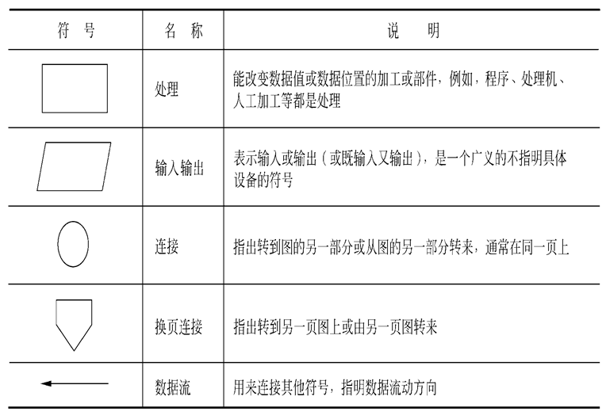
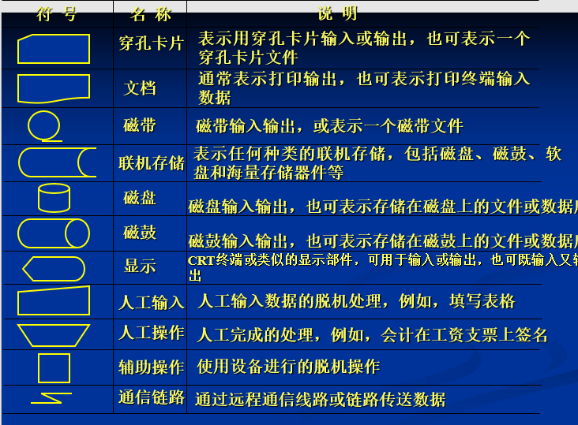

# 软件工程

## 一. 可行性研究

**目的:** 用最小的代价在尽可能短的时间内确定问题是否能够解决

**实质:** 一次压缩简化了的系统分析和设计过程

路线: 分析定义,导出模型,探索解法,可行性研究,指定实现进度

__根本任务__: 对以后的行动方针提出建议

### 1. 系统流程图

是概括的描绘物理系统的传统工具,它的基本思想使用图形符号以黑盒子的形式描绘组成系统的每个部件

