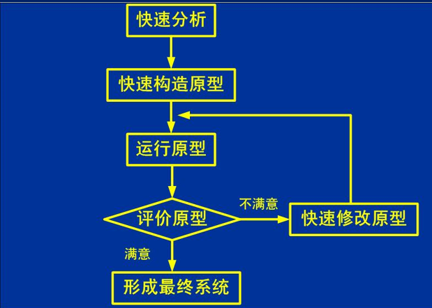
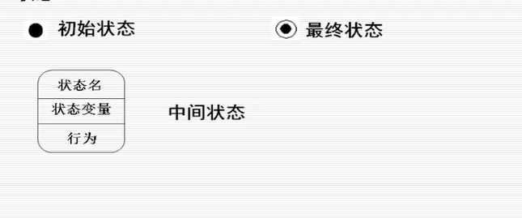
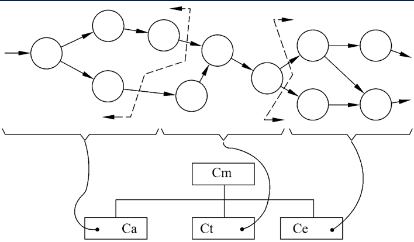
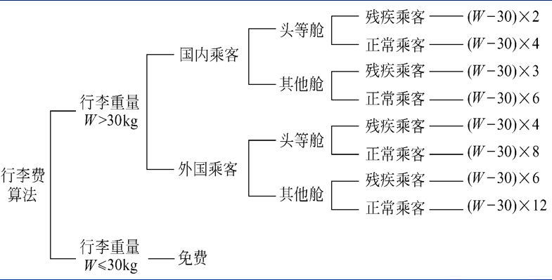
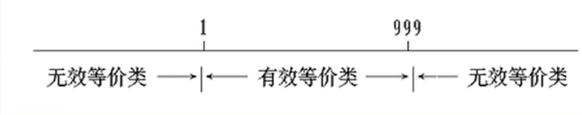
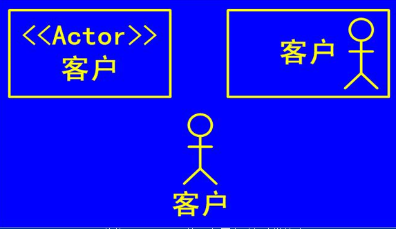

# ]软件工程

## 绪. 软件

__软件的定义__: 程序+文档+数据

### 1. 软件发展

1. <u>程序设计阶段:</u> 个体化,无文档
2. <u>程序系统阶段</u>: 作坊,软件危机
3. <u>软件工程阶段:</u> 软件危机得到缓解

### 2. 软件危机

__定义__: 软件开发和维护中一系列严重问题

__主要表现__:

* 对**开发成本和进度**估计不准确
* **用户**对已交付的软件不满意
* 软件**产品质量**靠不住
* 软件**可维护性**差
* 没有适当的**文档资料**
* **软件成本**在计算机系统总成本中比例上升
* **软件开发生产率**的提升比不上计算机应用普及的趋势

### 3. 软件工程

IEEE定义:  

1. 把**系统化,规范化,可度量**的途径应用于软件**开发运行和维护.**
2. 研究1所用到的途径

**软件工程**是指导计算机软件开发和维护的一门工程学科。

采用**工程的概念、原理、技术和方法**来开发与维护软件，把经过时间考验而证明正确的**管理技术**和当前能够得到的最好的**技术方法**结合起来，以经济地**开发**出高质量的软件并有效地**维护**它，这就是软件工程。

__软件工程基本原理__:

1. 用**分阶段**的生命周期计划严格管理
2. 坚持进行**阶段评审**
3. 实行严格的**产品控制**(基准配置管理)
4. 采用**现代程序设计技术**
5. **结果**应能清楚地审查
6. 开发**小组成员**小而精
7. 承认**不断改进**软件工程实践的必要性

### 4. 软件生存周期

**定义->开发->维护**

1. <u>**可行性研究**</u> : 问题是否值得,可行
2. <u>**需求分析**->需求规格说明书:</u> 需要什么功能
3. <u>**总体设计**->总体设计说明书</u>: 怎样实现目标系统(设计方案)
4. **<u>详细设计</u>**: 具体实现,数据结构和算法
5. <u>**实现**(编码,单元测试)</u>
6. **<u>集成测试</u>**->测试报告
7. <u>**确认测试**(验收测试)</u>: 由用户进行,按照需求规格说明书
8. **<u>使用和维护</u>**: 

* 常见维护类型:
  * <u>改正性维护</u>: 运行发生**错误,**改正
  * <u>适应性维护</u>: 软硬件**环境**变化,适应
  * <u>完善性维护</u>: 用户有**新的需求**,完善
  * <u>预防性维护</u>: 为了**将来**的维护做准备,预防

## 一. 可行性研究

**目的:** 用最小的代价在尽可能短的时间内确定问题是否能够解决

**实质:** 一次压缩简化了的系统分析和设计过程

路线: 分析定义,导出模型,探索解法,可行性研究,指定实现进度

__根本任务__: 对以后的行动方针提出建议

### 1. 系统流程图

是概括的描绘物理系统的传统工具,它的基本思想使用图形符号以黑盒子的形式描绘组成系统的每个部件

## 二. 常用软件过程模型

过程是产生某种预定输出的可预测的步骤

使用**资源**将输入转换成输出所构成的系统

### 1. 软件过程

**软件过程定义**: 为建造高质量软件**所需完成的任务的框架**,它规定了完成各项任务的工作步骤

### 2. 瀑布模型

需求分析-规格说明-设计-编码-综合测试-维护

* 特点:
  * 阶段具有**顺序性和依赖性**
  * 推迟实现(编码)
  * 质量保证观点:
    * 每个阶段拥有**完整准确的文档**
    * 每个阶段之间都具有评审

* 优点:
  * 提高软件质量,减低维护成本
* 缺点:
  * 缺乏**灵活性**
  * 无法解决**需求不明确**的问题
  * 用户不经过实践提出完整准确需求不切实际

### 3. V模型

单元测试/集成测试: 程序设计

系统测试: **校验**系统设计

验收测试: **确认**需求分析

### 4. 快速原型模型

__原型__: 是一个实际可运行的模型,最终产品的子集

快速原型模型对于瀑布模型的特点是: 需求分析步骤是通过**建立快速原型**实现的

* 优点:
  * 在确定需求上优于瀑布模型
  * 提供了学习手段,对于**开发者和使用者了解系统**有积极作用
* 缺点:
  * 反复修改可能导致质量低下

### 5. 增量模型

增量模型和迭代模型都是**演化模型**的种类软件系统随着时间变化

__增量模型__: 增量模型将软件产品作为一系列增量来设计编码集成和测试

* 优点:
  * 用户有充裕的时间学习和适应新产品
  * 管理技术风险
  * 短时间可提交
* 缺点:
  * 结构必须非常开放
* 风险:
  * 风险整体较少,如果确定需求后**并行构建**则导致的风险更大(对于时间非常短的情况)

### 6. 螺旋模型

特点: 加入了**风险分析**

> 风险: 人员,硬件设备,项目生存能力

#### 6.1 四个任务区域

1. __制定计划__: 确定目标,选定方案
2. __风险分析__: 分析,考虑识别和消除风险
3. __实施工程__: 软件开发
4. __客户评估__: 评价

* 优点:
  * 对于大型软件有较好的风险控制
* 缺点:
  * 需要风险评估经验
  * 只适合大型软件
  * 只适合内部开发

### 7. RUP(Rational)

二维生命周期模型

纵轴:

1. 业务建模
2. 需求
3. 分析与设计
4. 实现
5. 测试
6. 部署
7. 配置与变更管理
8. 项目管理
9. 环境

横轴:

1. 初始Inception

2. 精化Elaboration
3. 构建Construction
4. 移交Transition

### 8. 敏捷过程

价值观:

1. **个体与交互** > **过程和工具**
2. 可以工作的**软件** > **文档**
3. 客户**合作** > **合同**谈判
4. 响应**变化** > 遵循**计划**

## 三. 需求分析

### 1. 需求分析的任务

__数据模型__: 由数据关系模型和**实体联系图**构成

__功能模型__: 由**数据流图**和处理规格说明构成

__行为模型__: 由**状态转换图**和控制规格说明构成

__数据字典__: 核心

### 2. 系统的综合需求

1. 功能需求
2. 性能需求
3. 可靠性和可用性需求
4. 出错处理需求
5. 接口需求
6. 约束
7. 逆向需求
8. 将来可能提出的需求

### 3. 沟通获取需求的方法

访谈

面向数据流自顶向下求精

建议的应用规格说明技术

快速建立软件原型

### 4. 数据模型

数据模型__包含__:

1. **数据对象**: 包含复合信息的数据表示
2. 数据对象的**属性**:定义性质
3. 数据对象的**关系**: 一对多,一对一,多对多

ER图:

#### 4.1 范式

第一范式: 属性为原子值

第二范式: 所有关键字属性由主码(而不是主码的一部分)决定

第三范式: 非主属性之间相互独立,消除传递依赖

### 5. 功能模型

**DFD数据流图**

#### 5.1 符号

源点/终点, 数据处理,数据流

### 6. 行为模型

行为模型: 状态,事件,行为

状态: 被观察到的系统行为模式

事件: 改变状态的事件,用箭头表示

行为: 保持状态的行为

### 7. 数据字典

系统数据流图中包含的元素的集合

__组成__:

1. **数据流**
2. **数据元素**
3. **数据储存**
4. **数据处理**

#### 7.1 数据流

数据流:

* 数据流名

* 说明
* 数据流来源
* 数据流去向
* 数据流组成

#### 7.1 数据元素

数据元素:

* 类型
* 长度
* 取值范围
* 相关的数据元素以及数据结构

* 

#### 7.3 数据存储

数据存储:

* 简述
* 输入数据
* 输出数据
* 文件组成
* 存储方式
* 存取频率

#### 7.4 处理

处理:

* 处理编号
* 简要描述
* 输入数据流
* 输出数据流
* 加工逻辑

#### 7.5 定义数据

**自顶向下定义数据**:

* **顺序**
* **选择**
* **重复**
* **可选**

## 四. 总体设计

### 1. 过程和原理

* 数据设计+总体结构设计+过程设计

__概要设计__: 将软件需求转化为数据结构和软件的系统结构,即**系统的模块划分**

__详细设计__: 通过对系统的结构表示进行细化,得到软件详细的数据结构和算法

* 原理
  * **模块化**
  * **抽象**
  * **逐步求精**
  * **信息隐藏和局部化**
  * **模块独立性**

### 2. 模块化

__模块__: 可单独命名和编址的部分

__模块化__: 程序划分成独立命名且可独立访问的模块

### 3. 抽象+逐步求精

__抽象__: 抽取出事务的本质特征而暂时不考虑细节

* 类别:
  * __过程抽象__: 把特定功能抽象成过程名和参数表
  * __数据抽象__:  把数据定义抽象成抽象类别名

__逐步求精__: 抽象过后细化的过程

### 4.信息隐藏

隐藏每个模块的实现细节

通过接口调用模块

### 5. 模块独立

__模块独立__: 每个模块完成一个相对独立的子功能

> 是模块化,抽象,信息隐藏和局部化的直接结果

1. 容易分工合作
2. 容易维护和测试

<u>高内聚低耦合</u>

__耦合__: 衡量**不同模块间连接**的紧密程度

__内聚__: 衡量模**块内部各个元素**彼此结合的紧密程度

#### 5.1 耦合

无耦合->松散耦合->紧密耦合

__取决于__:

1. 接口的复杂程度
2. 进入或者访问一个模块的点
3. 通过接口的数据

常见类别:

* __非直接耦合__: 能独立工作,没有直接关系

* __数据耦合__: 两模块通过**简单数据参数**交换数据信息

* __标记耦合__: 通过参数表传递记录信息,即传递**一种数据结构**

* **控制耦合**: 两个模块交换**控制信息**

  * 即一个模块传递的信息会改变另一个模块的**内部功能,**控制结构

    

* __外部耦合__: 访问**同一全局简单变量**
* __公共耦合__: 访问**同一公共数据环境**

* __内容耦合__: 模块内部耦合,代码重叠(现代高级语言基本不出现),比如goto到另一个模块的某处

> 原则:
>
> 尽量数据耦合
>
> 少用控制耦合,标记耦合
>
> 限制外部耦合,公共耦合
>
> 完全不用内容耦合

#### 5.2 内聚

* __功能内聚__: **各个元素缺一不可**,并且**只做一件事**

* __顺序内聚__: 模块内元素和同一个功能**密切相关**,并且**顺序执行**

* __通信内聚__: 模块内的各个部分使用**相同的输入数据**,或者产生了**相同的输出数据**(数据流图)

* __过程内聚__: 模块处理元素相关,**按照进行**
  * 比如把程序流图中分为**循环,分支,计算三个模块**,三个模块都是过程内聚模块

* __时间内聚__: 多功能模块所有功能都在**同一时间内执行完成**

* __逻辑内聚__: 逻辑功能组合关系相同或相似
  * 不是执行一种功能，而是若干功能中的一种，因此它不易修改；
* **偶然内聚**: 没有关系

### 6. 启发规则

1. **改进软件结构**提高模块独立性

   * 分解或合并

   * 降低耦合提高内聚

2. **模块规模**应该适中
   * 过大: 分解不充分
   * 过小: 接口复杂
3. __深度,宽度,扇入,扇出__应该适当
   * 深度: 层数
   * 宽度: 同一层数上模块总数的最大值
   * **扇出**: 调用的模块数
   * **扇入**: 多少上级调用

避免**扁平结构**

4. 模块的**作用域在控制域之内**
   * __作用域__: 受该模块内一个判定**影响的所有模块的集合**
   * __控制域__: 这个<u>模块本身以及所有直接或者间接从属于它(它调用)的模块的集合</u>
   * 方法: 合并,上移下移

5. 力争降低**接口**的复杂程度
6. 设计**单入口单出口**的模块
7. 模块功能应该**可以预测**,避免对模块施加过多限制

## 四. 总体设计 二

### 1. 结构图

表达模块之间的调用关系和接口

### 2. 信息流类型

* __变换流__: 信息由通路进入系统,由外部形势转换为内部形势,通过中心加工处理后再沿输出通路变换为外部形势离开软件系统
  * 取得数据,变换数据,给出数据
  * 处理中心

* __事务流__: 信息沿着输入通路到一个处理T,由处理T根据输入信息类型在若干动作序列中选一个执行
  * 事务中心: 接收事务,确定类型,选择通路

### 3. 面向数据流设计

#### 3.1 变换分析

映射成变换软件结构的过程

1. 复查基本系统模型
2. 复查并精化数据流图(分解和合并)
3. 确定数据流具有变换特性还是事务特性
4. 确定输入流和输出流的边界,从而孤立出**变换中心**

5. 完成__一级分解__

**Cm**：协调下述从属的控制功能

**Ca**：输入信息处理控制模块，协调对所有输入数据的接收；

**Ct**：变换中心控制模块，管理对内部形式的数据的所有操作；

**Ce**：输出信息处理控制模块，协调输出信息的产生过程。

6. 完成__二级分解__

将数据流图的每个处理映射成为软件模块

每个模块细化,倒着往上摆

7. 使用启发式规则优化

#### 3.2 事务分析

### 4. 人机界面交互

1. 系统响应时间:
   * 长度
   * 易变性
2. 用户帮助措施
   * 集成
   * 附加
   * 请求帮助方式+组织形式
3. 出错信息处理
4. 命令交互

## 五. 过程设计

### 1. 任务

1. 确定算法和数据结构
2. 确定接口

### 2. 图形工具

#### 2.1 程序流程图

#### 2.2 盒图N-S

#### 2.3 PAD

### 3. 表格工具

#### 3.1 判定表

#### 3.2 判定树

### 4. 语言工具

PDL伪代码

### 5. 复杂度度量

度量程序复杂度的__McCabe方法__

结果称为__程序的环形复杂度__

#### 5.1 流图

**E: 边数**

**N: 节点数**

**V: 区域数**

#### 5.2 环形复杂度

环形复杂度:

1. 等同于区域个数
2. $E-N+2$
3. $P+1$,P为判断的数目

## 六. 编码

编码阶段的任务是把详细设计阶段中用伪代码写成的程序转换成用程序设计语言实现的程序。

语言选择:

n**系统用户的要求**

n**可以使用的编译程序**

n**可以得到的软件工具**

n**工程规模**

n**程序员的知识**

n**软件可移植性要求**

n**软件的应用领域**

### 1. 编码风格

编码风格涵盖五个方面:

1. 程序内部文档
2. 数据说明
3. 语句构造
4. 输入输出方法
5. 效率问题

#### 1.1 程序内部文档

* **标识符命名**
  * 含义鲜明
  * 规则一致
  * 长短适中
  * 缩写一致
* 适当的**注释**
  * **序言性注释,功能性注释(解释做了什么工作)**
* 视觉组织(空格,空行)

#### 1.2 数据说明

* 说明**次序规范化**
* 语句中**变量安排有序化**
* **注释**说明复杂数据结构

#### 1.3 语句构造

1. 避免把多个语句写在**同一行**
2. 避免**复杂条件测试**
3. **减少"非"**条件测试
4. 避免大量**循环和条件嵌套**
5. 利用**括号**使运算清晰
6. 不用goto
7. 代码块加大括号

#### 1.4 输入输出

1. 校验
2. 检查输入组合合理性
3. 输入格式简单

#### 1.5 效率

* 程序运行时间
* 存储器
* 输入输出

### 2. 软件测试基础

1. 测试的目的是为了**发现错误**
2. 好的测试方案能发现**尚未发生的错误**
3. 成功的测试是发现了迄今**尚未发现错误的测试**

* 测试方法:
  * 黑盒测试: 已知**功能**检查功能是否可用
  * 白盒测试: 已知**内部**,检查内部动作是否按照规格说明书进行(程序的所有逻辑路径)

### 3. 白盒测试: 逻辑覆盖

逻辑覆盖是按照程序内部逻辑结构**设计测试用例**的技术

* 等级:
  * **语句覆盖/点覆盖**: 每个<u>语句</u>至少一次
  * __判定覆盖/边覆盖__: 不仅每个语句覆盖,每个<u>**判定**</u>的每个结果至少一次
  * __条件覆盖__: <u>**判定的每个条件**</u>至少取值一次,不需要笛卡尔积
  * __判定条件覆盖__: 结合上两者
  * __条件组合覆盖__: 笛卡尔积组合
  * __路径覆盖__: 每个路径至少走一次

### 4. 白盒测试: 控制结构测试

根据控制结构设计测试数据

#### 4.1 基本路径测试

画出流图=>计算环形复杂度

然后覆盖流图的路径,路径数量为**环形复杂度**

有的测试路径不能独立测试,那就作为路径的一部分测试

### 5. 黑盒测试

* 想要发现的错误:
  * 功能是否正确全面
  * 界面错误
  * 数据结构,外部数据库访问错误
  * 性能错误
  * 初始化和终止错误
* 方法:
  * 等价划分
  * 边界值分析
  * 错误推测

#### 5.1 等价划分

等价划分方法把所有可能的输入数据，即程序的<u>输入域划分成若干部分</u>，据此导出测试用例，一个理想的测试用例能够独自发现一类错误。

等价划分法的一个假设：每类中的一个典型值在测试中的作用与这一类中所有其他值的作用相同。

在确定输入数据的等价类时，常常还需要确定输出数据的等价类，以便根据输出数据的等价类导出对应的输入数据的等价类

* **有效等价类:** 有意义的数据输入集合
* **无效等价类:** 没有意义的数据输入集合

划分原则:

1. 数值范围: 见上图
2. 布尔值: 有效无效各一个
3. 规定输入一组值,确定无效等价类
4. 自定义规则: 一个有效,若干个无效

5. 划分等价类中的元素在程序中的处理不同,应该划分更小的等价类

* 确定测试用例:
  * 设计用例,尽可能覆盖更多的有效等价类,直到没有为止
  * 设计用例,尽可能覆盖更多的无效等价类,直到没有

### 6. 测试步骤

1. **单元测试:** 每个模块作为实体测试
2. **集成测试**: 单元测试的模块放一起测试,注重<u>接口</u>
3. __系统测试__: 把子系统装配并测试,注重测试<u>系统设计</u>
4. __验收测试__: 用户+程序员进行确认,注重<u>需求</u>

#### 6.1 单元测试

* 测试重点:
  * **模块接口**
  * **局部数据结构**
  * **重要执行通路**
  * **出错处理通路**
  * **边界条件**

* 测试方法:
  * 代码审查(人工)
  * **计算机测试**: 编写<u>驱动程序</u>和<u>存根程序</u>
    * 驱动程序: 主程序
    * 存根程序: 即对子程序形成**代理,**输入之前输出之后可以打印一定的信息

#### 6.2 集成测试

* 两类方法:
  * 非渐增式: 先测试每个小系统,然后整个测
  * 渐增式: 每个模块加入已经测试的模块测试

* 集成策略:

  * **一次性**:

    * 缺点: 不能应对复杂情况+会发现大量错误

    

  * **自顶向下(建增)**: 从主控制开始,向下一层一层集成

    * 特点: <u>不需要主程序,但需要存根程序</u>,且存根程序数量多
    * 自下往上的数据流丢失

    

  * **自底向上(渐增)**:

    * 不需要存根,需要主程序

    

  * **三明治**: 

    * 选定基准层,在基准层之上自顶向下,基准层之下自底向上

* __回归测试__:

  回归测试是指<u>重新执行已经做过的测试的某个子集</u>，以保证由于调试或其他原因引起的变化，不会导致非预期的软件行为或额外错误。

  * 代表性测试用例
  * 受修改影响的模块
  * 被修改过的功能

#### 6.3 确认测试

__软件有效性__: 软件功能和用户预期的一样,软件有效

> <u>确认</u>: 确保软件满足用户需求
>
> <u>验证</u>: 确保软件按照预期进行

* 要求:
  * 功能;要求
  * 性能要求
  * 文档要求
  * 其他要求

* <u>Alpha测试</u>: 用户在开发者指导下进行测试,受控
* <u>Beta测试</u>: 用户在真实情况下进行测试 

### 7. 调试

进一步诊断和改进程序中潜在的错误

* 蛮干法: 打印整个内存
* 回溯法: 分析回溯错误
* 原因排除法: 归纳假设演绎,对分查找(在程序中间点附近注入正确值)

### 8. 软件可靠性

__定义__: **程序在给定时间间隔内,按照规格说明书成功运行的概率**

> 可用性: 给定时间点,按规格说明书成功运行的概率

$$
A=\frac{MTTF}{MTTF+MTTR} \\
MTTF: 平均无故障时间,MTTR: 平均维修时间
$$

平均无故障时间的计算方式:

$E_T$——**测试之前程序中错误总数**

$I_t$——**程序长度(机器指令总数)**

τ——**测试(包括调试)时间**

**E**d(τ)——**在0至τ期间发现的错误数**

**E**c(τ)——**在0至τ期间改正的错误数**

基本假设:

* 单位长度错误数近乎常数
* **MTTf与(单位长度)剩余错误数正比**
* 假设Ed=Ec,剩余错误数可记为Er = Et-Ec

$$
MTTF = \frac{1}{K(\frac{E_T-E_c}{I_T})}
$$

**估算错误总数:**

1. **植入错误法(**标记重补): 随机植入错误,测试后发现的植入错误的比例

   取植入/取整个 = 植入/整个

2. **分别测试法:**

   由甲乙两人分别测试,**一个人发现的错误被做上标记**,另一个人重捕,计算方式和上面一样

## 七. 面向对象方法学

### 1. 四个要素

**对象**

**类**

**继承**

**信息通信**

### 2. UML

统一建模语言

* 关系: 依赖关联泛化实现

* 种类:
  * __用例图__: 基于用例,actor
  * __类图__: 类,接口
  * __顺序图__: 执行顺序
  * __协作图__
  * __活动图__
  * __对象图__
  * __构件图__
  * __配置图__

#### 2.1 用例图

元素: 用例(功能)和actor(外部系统/用户)

系统边界: 用例在内,actor在外

* 执行者之间的关系: **泛化**
* 用例之间的关系: **泛化,拓展extend,包含include**
  * 泛化: 特殊化
  * 拓展: 将常规动作放在用力中,将非常规动作放在别的用例中
    * 特殊事件指向非特殊事件

#### 2.2 类图

可见性: 公有+,私有-,保护#

* 边界类: 交互的边界类
* 控制类: 控制顺序
* 实体类
* 接口类

#### 2.3 顺序图

#### 2.4 活动图

### 3. UML拓展机制

* **标记值**: {标签=值}, 记录某些属性的值

  

* __约束__:{约束条件}

* __构造型__stereotype: 在已有模型元素基础上构造一种新的模型元素,**增加新的语义**,使用书名号表示

### 4. UML视图

1. __用例视图__: 

   * 分析系统行为

   * 静态表现: 用例图
   * 动态表现: 交互,状态,活动

2. __逻辑视图__:

   * 问题及解决方案
   * 静态视图: 类图,对象图
   * 动态: 交互,状态,活动

3. __进程视图__:

   * 性能,吞吐量
   * 静态: 类图,对象图

4. __实现视图__:

   * 配置,发布
   * 静态: 构件图

5. __实施视图__:

   * 配置图
   * 发布,交付,安装

### 5. 面向对象需求分析

__用例__: 一个用例是用户与计算机之间为了达到某个目的的一次典型交互作用

## 八. 面向对象分析

### 1. 用例(需求获取)

* __场景__: 是用例的具体例子,重在可理解性
  * 用例比较抽象,场景比较具体