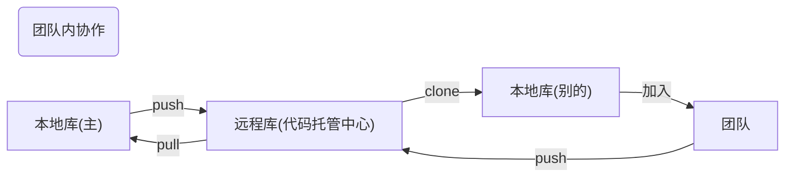
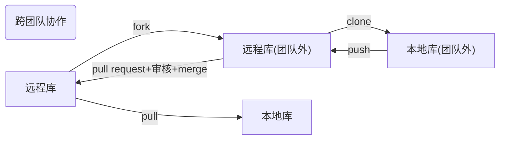

# GIT/GITHUB

> [TOC]
>
> 

## 一. GIT简介

Linus(linux创始人)用C语言做了一个__分布式版本控制系统GIT__

> Linus: Talks cheap,show me your code.

### 1. 优势

* 大部分操作在本地完成,不需要联网
* 完整性保证
* 尽可能添加数据而不是删除或修改
* 分支操作更流畅
* 与linux命令兼容

### 2. 本地结构


* 工作区 : 写代码
* 暂存区 : 打算提交,可以撤回的暂存地
* 本地库 : 历史版本

### 3. GIT和代码托管中心

代码托管中心的任务是__维护远程库__

* 局域网环境下,我们有__GitLab__代码托管中心
* 外网环境下,我们有__Github和码云__

### 4. 本地库和远程库

两者的交互场景分为__团队内部协作__,__跨团队协作__.

---------------



-----------------



## 二. GIT命令行操作

### 1. 本地库初始化

* __命令__: 

#### 1.1 初始化

* 可以在任意目录右键打开`git bash`,在里面可以使用linux命令

```bash
git init #本地库初始化 创建.git/目录

$ ls .git/
config  description  HEAD  hooks/  info/  objects/  refs/
#存放与本地库相关的子目录和文件,不要删改


```

#### 1.2 设置签名

* __形式__: 
  * 用户名:TOm
  * email地址: good@bala
* __作用__ : 区分开发人员身份
* 和登录的账号密码没关系
* __分类__:
  * __项目级别/仓库级别 __:  仅在当前本地库范围有效
  * __系统用户级别 __: 登录当前操作系统的用户范围
  * _项目级别优先于系统用户级别(就近原则)_
  * 二者必须有其一

* __命令__

  ```bash
  git config user.name 用户名 
  git config user.emai 邮箱
  #项目级别
  
  git config --global  user.name 用户名
  git config --global user.email 邮箱
  #系统用户级别
  
  ```

* __信息位置__:`.git/config的user栏`(项目级别

  ) 或 `家目录的.gitconfig`(系统用户级别)

----

### 2. 具体的git命令

* 基础操作

```bash
git status  #查看当前状态
git add 文件名 #将文件放到暂存区,会改变换行符
git rm --cached 文件名 #将文件从暂存区撤回
git commit 文件名 #提交文件,进入注释页面(vim编辑器)
```

* 提交后操作

  ```bash
  git add 文件名-->
  git commit -m "标题" 文件 #不进文本编辑器
  #
  git commit -a
  ```

  

### 3. 版本的前进后退

```bash
git log #查看历史提交信息,head指向当前版本
git log --pretty=oneline # 美观输出
git reflog #一样,显示指针移动数
```

本质: head指向谁,谁就是当前版本

#### 3.1 基于索引值的操作

```bash
git reset --hard 索引值 #到xx版本
git reset --hard f85183c #举例
```


#### 3.2 使用^符号

```bash
git reset --hard head^^^ #有几个^退几行
```

只能回退

#### 3.2 使用~符号

```bash
git reset --hard head~n #回退n步
```

#### 3.3 reset选项说明

`--soft` :仅在本地库移动指针

`--mixed`: 在本地库移动,重置暂存区

`--hard`:在本地库移动,重置暂存区和工作区

#### 3.4 文件比较

```bash
git diff 文件 #在工作区改后,未交暂存区时,显示改变
git diff 历史版本(比如HEAD^^^) 文件名 #两者比较
```

----

### 4. 分支管理

__分支__(brench): 在版本控制过程中,使用多条线同时推进多个任务.

特点: 同时进行,互不影响 ; 失败了也不影响主干


在`git status`的第一行就是分支信息`on branch master`

#### 4.1 分支操作

```bash
git branch -v #查看分支
git branch 分支名 #创建分支

git checkout 分支名 #切换分支 
```

* __合并操作__:

  ```bash
  #切换到接收修改的分支上
  git checkout master
  
  #合并
  git merge 分支名
  ```

* __解决冲突__:

  ```bash
  Auto-merging aaa.txt
  CONFLICT (content): Merge conflict in aaa.txt
  Automatic merge failed; fix conflicts and then commit the result.
  #合并时报错信息,切换为手动合并
  carrzhou@DESKTOP-0HHSOG5 MINGW64 /e/gitwork/WeChat (hoy_fix|MERGING)
  #新的状态:(hoy_fix|MERGING)
  ```

  ```bash
  #打开文件,手动选择
  aaaaa
  bbbbb
  ccccc
  ddddd
  edit by hotfix
  <<<<<<< HEAD
  edit by hoyfix
  =======             #6-8行是当前文件的状态
  edit by master
  
  >>>>>>> master      #9-11行是另一个分支的内容
  
  #此时文件内容
  #将文件的内容编辑保存即可
  ```

  ```bash
  #编辑完成后,用git add解决
  git add 文件
  git commit #结束合并状态
  ```

  --------

## 三. Git的基本原理

### 1. hash

* 加密

  ```mermaid
  graph LR
  A(明文)-->B[加密算法]
  B-->C(密文)
  ```

* __hash__属于加密算法.其__特点__:

  > 1. 不管输入数据量多大,同一个hash算法,得到的<u>结果长度固定</u>
  > 2. 算法具有确定性,同一个数据,<u>输出数据不变.</u>
  > 3. 算法确定的前提下,输入数据变化,输出数据<u>一定有变化.</u>(可以用于检验文件损坏)
  > 4. hash算法是<u>不可逆</u>的.

* 包括:`SHA-1`,`md5`,`CRC32`

---

### 2. Git保存版本的机制

#### 2.1 ICN集中式版本控制工具的文件管理机制

(并非git)每个版本保存所做的修改,想要某个历史版本,就拿当前版本修改+历史版本+原始文件拼在一起

__增量式保存__


#### 2.2 git的文件管理机制

保存的是小型文件的一组快照,提交更新时会制作快照并添加索引

---

## 四. 和github远程库

github上创建远程库并进入,记住一个网址


### 1. 在本地库连接远程库

```bash
git remote -v #查看连接的远程库
git remote add 别名 地址 #将远程库添加到git并赋予别名
```

### 2. 推送

```bash
git push 别名 分支名 #把分支推送到远程库
```

### 3. 克隆

```bash
#把远程库克隆到别人的本地库
git clone 远程地址 #在别人的本地库使用(远程地址在clone/download界面)

```

三个效果:

* 完整的把远程库下载到本地
* 创建远程地址别名origin
* 初始化本地库

### 4. 加入团队

在github里用.

### 5. 拉取(pull)

fetch和merge的结合体

```BASH
git fetch 别名 分支 #从远程库抓取分支
git checkout '别名/分支名' #检查分支

git merge '别名/分支名' #合并,拉取完毕

git pull 别名 分支 #一步到位 
```

* __冲突的解决__:
  * 不是最新版的远程库版本就推送不上去
  * 当先git pull拉取,就进入了merge状态
  * 之后用上面的冲突解决
  * 提交时不带文件名

### 6. 跨团队协作

在远程库点一下fork,再clone到本地

推送回来后点pull request,new pull request

然后主远程库看pull request观察

-----

在家目录下使用.gitignore文件使git忽略一些文件


然后在gitconfig加这个


------------

## Git流

