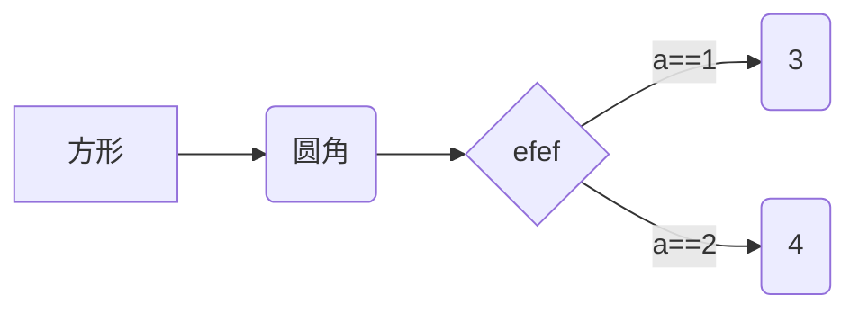
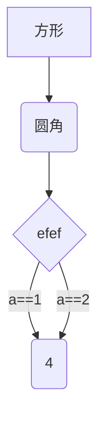

# Hello world

我么知道
违反  


啊,马真美

## 马

:horse:

|      |      |      |
| ---- | ---- | ---- |
|      |      |      |

`dfef`

`` zuogerenba1``

```C
#include<stdio.h>
int main()
{
    
    print("Hello world");
    return 0;
}
```


```SQL
select * from uni
where i==1
order by id;
```

[jaaa]:www.baidu.com

a[^1]

[^1]:aaaaa

**********

## 段落,字体,下划线


*斜体*

_斜体_
**cuti**
__bold__

***cuxieti***

___cuxieti___

*********

~~shanchu~~

<u>下划线</u>

--------------

## 列表

* 啊

* 啊

* 啊

+ 啊

  1. a
  2. ef
  3. 3
  4. ef
  5. ef
  6. ef
  7. ef
  8. e
     - ef
     - efs
     - +
       	+ ef

  

  #### 区块

> efefefeefefefeefefefe
>
> fefaefasef
>
> > kjkjk
> >
> > >fdafsdaf
> > >
> >
> > dfadfdsfdsafdfd

```C
inclue
dfafasd
asdfasd
```


	ruguodfefase
	
	efaefae
	* efefe
	efesfafa
* efef

* Sefsefse

* aesfesf

* seafseafse

* 1

* 2. 343

  3. 234234

  4. 2342342

  5. 3423

  6. 423

  7. 4

  8. 234

  9. 234

  10. 32

  11. 4

  12. 3423 `efefe`efefefefefe

      | rewerewr           |      |      |
      | :-----------------:| ---- | ---- |
      | ewrwerwerweerwerwe |      |      |
      | rwerwer           -: |      |      |
      |                    |      |      |

      

  13. aefesfaesfsfe[^efsefesfes`]

  14. [efefefef](www.baidu.com)

  15. <baidu.com>[efefefe][1]

  16. 

  17. 

efsefesfes` fefefefefe

[1]:www.baidu.com

_3434343_

*23423432423*

__2234234__


___23432423___

\*\*

$$a+b$$


[TOC]





