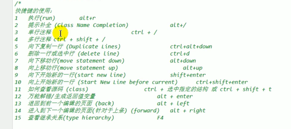
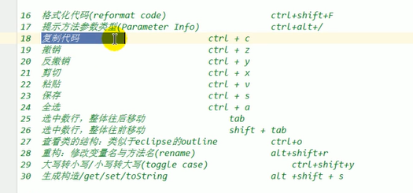
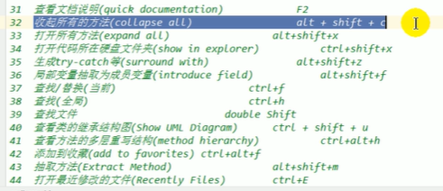
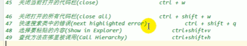

## 一. 快捷键









## 二. 模板

```java
main;
sout;
soutp; //打印出该方法的实参
soutm; //打出方法名字
souty; //打出上一个变量值
xxx.sout;


```

循环:

```java

fori;
iter; // 增强for
itar; // 普通for循环带赋值

list.for; // 生成增强for
list.fori;
list.forr; //反向普通遍历
```

if:

```java
ifn;xx.null //if(..==null)
inn;xx.nn //if(..!=null)
```

成员:

```java
prsf; //private static final
psf; // public static final
psfi; //int类型
psfs; //String 类型
```

## 三. Debug

