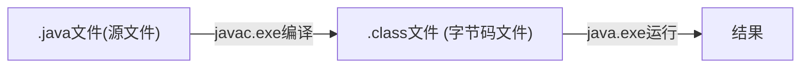
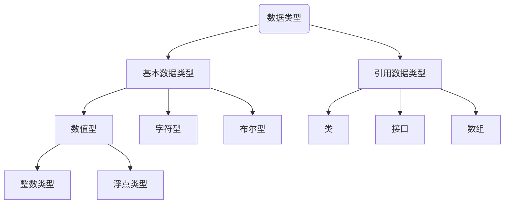
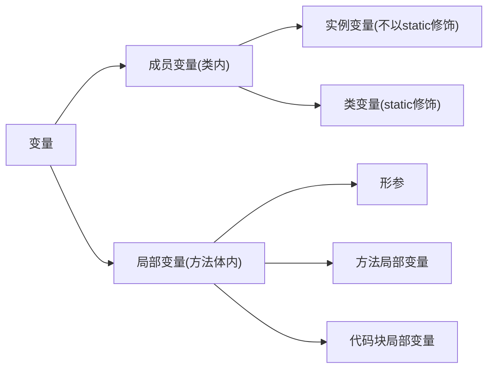

****

# JAVA

[TOC]

-------------


## 一. 绪论

### 1. java概论

* 由sun(斯坦福大学)公司开发,后归属oracle.

* 开发jdk版本1.x,也可以称为x.0,在9.0以后变成时间为版号.,6个月更新一次.

* `javaSE`:标准版(可看做java基础)

  `javaEE`:企业版

  `javaME`:小型版(移动终端)

* __特点__: 面向对象 健壮性 跨平台性

* 不同操作系统的java虚拟机(__JVM__)帮助java实现了跨平台性

* __核心机制__: 垃圾回收机制,java虚拟机

#### 1.1 JDK和JRE

* __JDK是什么:__(java development kit)直译为 `java开发工具包`,内含包括JRE在内的开发工具.还有编译工具(javac.exe),打包工具(jar.exe)
* __JRE是什么__:(java runtime environment)直译为`java开发环境` 包括java虚拟机和核心类库等.
* JDK开发的java程序,由JRE运行


#### 1.2 一个简单的.java运行方法



* 字节码文件的名字是源文件中的__类名__.

### 2. HelloWorld

* public只能加在和源文件同名的类前.
* System.out.println输出后自动换行,print不换
* 运行的class是包含main的class

#### 2.1 文档注释

文档注释是java特有的注释方式

* 语法:

```java
/**
	@author 指定java程序作者
	@ version 指定源文件版本
*/
```

* __特殊性__: 文档注释可以被JDK工具`javadoc`解析,生成一套以网页文件形式体现的该程序的说明文档.

* 解析方法:

  ```doc
  javadoc -d 文件夹名 -author -version 源文件
  ```

  

#### 2.2 API(应用程序编程接口)

在文件夹里有API文档

----

### 3. Eclipse快捷键

```java
/*
 * Eclipse中的快捷键：
 * 1.补全代码的声明：alt + /
 * 2.快速修复: ctrl + 1  
 * 3.批量导包：ctrl + shift + o
 * 4.使用单行注释：ctrl + /
 * 5.使用多行注释： ctrl + shift + /   
 * 6.取消多行注释：ctrl + shift + \
 * 7.复制指定行的代码：ctrl + alt + down 或 ctrl + alt + up
 * 8.删除指定行的代码：ctrl + d
 * 9.上下移动代码：alt + up  或 alt + down
 * 10.切换到下一行代码空位：shift + enter
 * 11.切换到上一行代码空位：ctrl + shift + enter
 * 12.如何查看源码：ctrl + 选中指定的结构   或  ctrl + shift + t
 * 13.退回到前一个编辑的页面：alt + left 
 * 14.进入到下一个编辑的页面(针对于上面那条来说的)：alt + right
 * 15.光标选中指定的类，查看继承树结构：ctrl + t
 * 16.复制代码： ctrl + c
 * 17.撤销： ctrl + z
 * 18.反撤销： ctrl + y
 * 19.剪切：ctrl + x 
 * 20.粘贴：ctrl + v
 * 21.保存： ctrl + s
 * 22.全选：ctrl + a
 * 23.格式化代码： ctrl + shift + f
 * 24.选中数行，整体往后移动：tab
 * 25.选中数行，整体往前移动：shift + tab
 * 26.在当前类中，显示类结构，并支持搜索指定的方法、属性等：ctrl + o
 * 27.批量修改指定的变量名、方法名、类名等：alt + shift + r
 * 28.选中的结构的大小写的切换：变成大写： ctrl + shift + x
 * 29.选中的结构的大小写的切换：变成小写：ctrl + shift + y
 * 30.调出生成getter/setter/构造器等结构： alt + shift + s
 * 31.显示当前选择资源(工程 or 文件)的属性：alt + enter
 * 32.快速查找：参照选中的Word快速定位到下一个 ：ctrl + k
 * 
 * 33.关闭当前窗口：ctrl + w
 * 34.关闭所有的窗口：ctrl + shift + w
 * 35.查看指定的结构使用过的地方：ctrl + alt + g
 * 36.查找与替换：ctrl + f
 * 37.最大化当前的View：ctrl + m
 * 38.直接定位到当前行的首位：home
 * 39.直接定位到当前行的末位：end
 */
```


## 二. 基本语法(划水)

### 1. 关键字和保留字(划水)


* __保留字__:JAVA没有使用的关键字,如`goto`,`const`,命名的时候避开.

### 2. 标识符(Identifier)

标识符就是名字,JAVA有特殊的起名规范:

1. 由26字母,0-9,`_`和`$`构成
2. 数字不开头
3. 不能用关键字和保留字
4. 不能含有空格

#### 2.1 命名规范

* __包名__: 所有字母小写xxyyzz
* __类名__:单词首字母大写,驼峰 XxYyZz
* __变量,方法__:第一个单词首字母小写,后面大写xxYyZz
* __常量__:所有字母大写,用下划线连接XX_YY_ZZ

---

### 3. 变量

#### 3.1 数据类型



> 八大__基本数据类型__(primitive type):
>
> 整型: `byte`,`short`,`int `,`long`
>
> 浮点:`float`,`double`
>
> 字符型:`char`(单个字符类型)
>
> 布尔型:`boolean`
>
> 
>
> 三个__引用数据类型__(reference type):
>
> 类:`class`
>
> 接口:`interface`
>
> 数组:`[]`

#### 3.2 按声明位置的变量分类



#### 3.3 整型(划水)

* 整型常量默认为int型,想要long加`l/L`

* 通常我们只用int

* 大小表:

  | 类型  | 存储空间 | 表数                  |
  | ----- | -------- | --------------------- |
  | byte  | 1字节    | -128~127              |
  | short | 2字节    | $-2^{15}\sim2^{15}-1$ |
  | int   | 4字节    | $-2^{31}\sim2^{31}-1$ |
  | long  | 8字节    | $-2^{63}\sim2^{63}-1$ |

#### 3.4 浮点型(划水)

| 类型             | 空间  | 表数                 |
| ---------------- | ----- | -------------------- |
| float(精确到7位) | 4字节 | -3.403E38~3.403e38   |
| double(14位)     | 8字节 | -1.798E308~1.798E308 |

默认为`double`,float常量需要以`F/f`结尾

一般定义`double`

#### 3.5 字符型(和C的char一样)(划水)

* __大小__:char,一个字符=`2byte`
* 标志:==单引号==,一个字符

#### 3.6 boolean(划水)

显然只能取`true`,`false`

#### 3.7 自动类型提升

* 大小同种数据运算,结果为大类型(提升).否则__编译失败__
* 整型转浮点型随便转(浮点是比整型大的类型)

* char,short,byte大小并列,互相作运算时都为int类型

#### 3.8 强制类型转换(C划水)

属于自动提升的逆运算,从大的类转到小的类

```java
double 12.3;
int i1=(int) d1;
```

语法类似C++,会导致精度损失

----

### 4. 内置引用数据类型(部分)

#### 4.1 String

* 定义

```java
String s1="Hello world!";
```

* __运算__:

  可以和<u>所有基本数据类型</u>作__连接运算__(+),结果是`String`类型

* 不能强制转换成数字

### 5. 运算符(超划水)

`a instanceof b`:返回a是否是b类的对象

* 逻辑运算符:
  * `&`逻辑与 `&&`短路与 `或` 
  * `双与`在不需要判断时停止,`单或`啥的同理
* `>>>`位运算,无符号右移

### 6.Scanner 输入

```java
/*具体实现步骤*/
//1. 导包
import java.util.Scanner;
//2. scanner实例化
Scanner scan=new Scanner(System.in);
//3. 调用nextXx方法接受相应类型的值
//若是字符串直接next,不是则类型首字母大写
int num=scan.nextInt();
```

### 7. 随机数

```java
Math.random() //返回0-1之间的浮点数,不需要import
    //[0,1) 左闭右开
```

### 8. 分支结构(划水)

和c语言一样,switch中不能放boolean类,能放String类.

### 9. 时间的方法

```java
System.currentTimeMillis();
//返回long
```

### 10. break/continue指定结束for循环

```java
label: for(;;)
{
	for(;;)
    {
        break label;//指定break外层for循环
    }
}
```

---

## 三. 数组

和C语言大多差不多

>  __特点__: 有序排列
>
> 是一个__引用数据类型__,可以保存任何类型.
>
> 长度一旦确定,不可以更改

### 1. 基本操作

* __声明和初始化__

```java
int[] ids;//声明
ids = new int[]{1001,1002};//静态初始化,指定元素值
int ikk[]={100,101};//也行

String[] names = new String[4]; //动态初始化,不指定元素值

//左边的另一种写法
String names[] = ...;
```

* __长度__

  ```bash
  names.length属性
  ```

* __默认初始化值__

  * 整型: `0`
  * 浮点型: `0.0`
  * char: `\u0000`
  * 布尔型: `false`
  * String : `null`

* __内存解析__


* new出来的结构放在堆中
* __但是指向结构的变量本身存在栈中,值为堆中的地址__
* 地址是jvm的虚拟地址,跟C指针直接显示内存地址不同

------

### 2. 二维数组

* __声明和初始化__:

  ```java
  int [][] arr1 = new int[][] {{1,2,3},{4,5},{6,7}};//静态初始化
  int [][] arr1 = {{1,2,3},{4,5},{6,7}}; //也是正确的写法(类型推断,只能在声明时省略new)
  
  int [][] arr2 = new int[3][2];//动态初始化,指定元素长度
  int [][] arr2 = new int[3][];//动态初始化,不指定元素长度
  
  //左边的另一种写法
  int[] arr3[] = ...;
  ```

* __默认初始化值__

  * 在指定二维大小时: 二维每个元素为地址值,内层为0(见一维)
  * 在new int\[3\]\[\]时: 二维每个元素为null

### 3. 排序

* __分类__:

  > 内部排序: 在内存中完成的排序;
  >
  > 外部排序: 在磁盘中完成的排序;

* 十个排序算法

  > * 选择排序
  >   * 直接选择排序,堆排序
  > * 交换排序
  >   * 冒泡排序,快速排序
  > * 插入排序
  >   * 直接插入排序,这般插入排序,shell排序
  > * 归并排序
  > * 桶式排序
  > * 基数排序

----

### 4. Arrays工具类

* __导入__: 

  ```java
  import java.util.Arrays;
  ```

* __方法__:

  | 方法                  | 作用                               | 返回类型 |
  | --------------------- | ---------------------------------- | -------- |
  | equals(arr1,arr2)     | 比较两个数组是否相同(大多类型可用) | boolean  |
  | toSting(arr)          | 输出数组信息([括起])               | String   |
  | fill(arr,value)       | 将指定值填充到arr中                | void     |
  | sort(arr)             | 将arr排序                          | void     |
  | binarySearch(arr,key) | 在arr找key,返回索引                | int      |
  |                       |                                    |          |
  |                       |                                    |          |

* __使用举例__:

  ```java
  int [] arr1 = new int[] {1,2,3,4};
  int [] arr2 = new int [] {1,3,2,4};
  		
  boolean isqu = Arrays.equals(arr1,arr2);
  //返回false
  ```

  

### 5. 相关异常

* __ArrayIndexOutOfBoundsException__ 数组越界
* __NullPointerException__ 空指针异常

------

## 四. 异常处理

### 1. 概述

在Java中,将程序执行中发生的不正常的情况称为__异常__(语法错误和逻辑错误不算)

程序在执行过程中出现异常,会在异常代码处抛出一个对应异常类对象

分类:

* ==Error==: Java虚拟机无法解决的严重问题.如 JVM系统内部错误,资源耗尽
  * 举例: `StackOverFlowError`,`OOM`
  * 一般不编写针对性的代码处理(不改源代码不能用,异常处理也处理不了)
* ==Exception==: 其他编程错误或偶然外在因素造成的一般性问题,可以进行处理

### 2. 异常体系结构


* 红色也叫编译时异常,蓝色也叫运行时异常
* 总父类是`Throwable`,属于java.lang

---------

### 3. 异常处理机制一(try)

`try-catch-finally`结构

```java
try{
    //可能异常的代码
}catch(异常类型1 变量名1){
	//处理方式1
}catch(异常类型2 变量名2){
	//处理方式2
}finally{
    //一定会执行的代码
}
```

* `try`中,出现异常后的语句不会执行
* `catch`只执行一个(或0个),执行完直接跳出`try-catch`结构(没有finally)
* 一般父类异常往后放
* 在开发时主要针对编译时异常.

* __异常对象的方法__:
  * getMessage() //返回字符串,显示信息
  * printStackTrees() //void,显示信息和具体结构
* finally:可选的
  * 就算catch中出现异常,也能执行
  * try和catch中return退出函数之前,finally也能执行
  * 若return后执行的finally也有return,按finally的来

### 4. 异常处理机制二(throws)

将异常扔给上一级处理.

* 语法: 在函数声明后,指明可能出现的异常类型
* 执行时出现异常会生成异常类对象,若此对象满足throws后的内容,抛出(给调用者)
* 运行时异常可以不写throws

```java
public class ThrowsTest {
	
	public static void main(String[] args) {
		try {
			method2();
		}catch(Exception e) {
			System.out.println("ahh;a");
		}
	}
	
	public static  void method2() throws FileNotFoundException,IOException{//出问题向上抛
		method1();
	}
	
	public static void method1() throws FileNotFoundException,IOException{
        //指明可能出现的异常类型
		File file = new File("hello.txt");
		FileInputStream fis = new FileInputStream(file);
		
		int data = fis.read();
		while(data != -1) {
			System.out.println((char)data);
			data = fis.read();
		}
		fis.close();
	}
}

```

-----------

### 5. 手动抛出异常(throw)

之前的异常都是系统自动生成的,你还可以手动生成抛出__(throw)__

```java
throw new RuntimeException("aaa")//生成异常对象并抛出
    //参数称为message(对应的get方法为getMessege)
```

---------

### 6. 用户自定义异常类

# 面向对象编程(上)

## 一. 绪论

* 主要内容:

  > 1. JAVA类及类成员: 属性,方法,构造器;代码块,内部类
  > 2. 面向对象的三大特征: 封装,继承,多态,(抽象)
  > 3. 其他关键字: this super static....

### 1. POP(过程)与OOP(对象)

* 对比:

  面向过程以__函数__为最小单位,强调__功能行为(怎么做)__

  面向对象以__类/对象__为最小单位,强调__具备功能的对象__,考虑__谁来做__

### 2. 类和对象

__类和对象__是面向对象的两大要素.

* __类__: 对一类事务的描述,是抽象的,概念的

* __对象__ :是实际存在的类事物的每个个体,也称为__实例(instance)__ 

面向对象的重点是类的设计; 

---

## 二. 类

设计类,就是设计类的成员

* __常见类成员:__

  > 属性 (field,成员变量) 
  >
  > 方法 (method)
  
* 在同一个包(package)里的类可以互相调用

### 1. 对象

对象的<u>值</u>是__堆中地址__;对象<u>本身</u>存在__栈__中;

* 默认值为null,属性的默认值同数组

* __实例化__:

  ```java
  类名 变量名 = new 类名(); //没有构造器的实例化
  ```

* __浅拷贝__:

  ```java
  对象1 = 对象2; //指向同一个对象地址
  ```

### 2. java内存解析


* __栈(虚拟机栈)__: 存放局部变量,包括<u>编译期可知长度</u>的各种基本数据类型(包括存地址的变量),自动释放
* __堆(heap)__: 存放<u>对象实例,</u>jvm要求所有的对象实例和数组在堆上分配
* __方法区__: 存放已经被虚拟机加载的<u>类信息,常量,静态变量,即时编译器编译后代码</u>等数据

---

### 3. 方法

刻画 类应该具有的功能

> 注意点:
>
> 1. 方法内可以调用类的属性和方法;特殊的,调用自己叫递归

----

### 4. 匿名对象(划水)

new完不赋值就是匿名对象,不能复用.

可以作为参数传.

----

## 三. 方法

### 1. 重载(overload)

* __概念__: 在同一个类中,允许存在一个或以上的同名方法,只要__参数个数或类型不同__即可.

* __细节__:

  *  需要非常明确的指令,指定使用哪个版本的重载. 

  * 若无匹配的重载,会使用自动类型提升

-----

### 2. 可变个数形参(varagrs)

jdk5.0新增

* __概念__:允许和多个实参相匹配的形参

* __语法__:

  ```java
  public void show(String ...strings strs) {//定义
  		
  	}
  ```

* 可以和__0个或一到多个__指定类型的实参匹配

* 和同名方法基本可以构成重载, 但和数组不可以重载`(编译器认为可变参和数组没有区别)`.

* __参数使用__: 将实参看做数组使用,**甚至可以直接传入数组**;

* __注意__: 
  * 只能声明在末尾
  * 只能有一个
  * 确定个参数的优先于可变参

---

### 3. 参数的值传递机制

我们已经知道,对于<u>基本数据类型</u>,直接传入的是变量的值,是不能做改变的.

而<u>引用数据类型</u>(类对象,数组)的值是地址,可以改变值.

----

## 四. 封装与隐藏/封装性(encapsulate)

* __封装思想__:

  * <u>高内聚</u>: 类的内部数据操作细节自己完成,不允许外部干涉
  * <u>低耦合</u>: 仅对外暴露少量的方法用于使用

  综上: 隐藏对象内部的复杂性,只对外公开简单的接口,便于外界使用.从而提高系统的可扩展性,可维护性.这就是__封装性的设计思想__

* 体现之一: 属性私有化,提供公共的方法来获取(get)和设置(set)属性值(`Alt`+`shift`+`s`)

### 1. 权限修饰符

Java规定了4种权限,从大到小排列: 

> **private**
>
> **缺省**
>
> **protected**
>
> **public**

* 含义:

| 修饰符    | 类内部 | 同一个包 | 不同包的子类 | 同一个工程 |
| --------- | ------ | -------- | ------------ | ---------- |
| private   | Yes    |          |              |            |
| 缺省      | Yes    | Yes      |              |            |
| protected | Yes    | Yes      | Yes          |            |
| public    | Yes    | Yes      | Yes          | Yes        |

* __修饰什么__:
  * 对于`class`(外部类)只能用__public和缺省__: 分别能被任意地方访问,和只能被同一个包内部访问
  * 对于类的内部结构(属性,方法,构造器,内部类):都可使用

-------

## 五. 构造器

任何类都有构造器(constructor).

* __作用__: 用来创建对象,初始化属性

* __说明__: 未显式定义,系统默认提供空参构造器.

* __格式__:

  ```java
  权限修饰 类名(形参列表){
  }
  ```

* 细节:

  * 可以重载(参数列表变化)
* 在显式定义构造器以后,默认的空参构造器不予提供
  
* 默认构造器的权限和类权限一致
  
* __属性赋值的顺序__:
  * 默认初始化值
  * 显式默认初始化值(int age =1;)
  * 构造器
  * 方法赋值

-----

## 附. JavaBean

`JavaBean`是一种java语言写成的可重用组件.

* 所谓__JavaBean__,是满足以下条件的标准Java类:
  * <u>类是公共的</u>
  * <u>有一个无参的公共构造器</u>
  * <u>有属性,且有对应的get,set方法</u>

* 用户可以使用JavaBean将功能,处理,值,数据库访问和其他任何可以用Java代码创造的对象打包.

~~未完待续~~

----

## 附. UML类图


---

## 六. this,package,import关键字

### 1. this

`this`是当前对象的代表.在类方法自己使用,跟C++一样.

在形参和属性重名时使用.

* __调用构造器__:

  * 在初始化时需要考虑的事可能重复,可以在构造器中调用本类的其他构造器
  * <u>不能调用自己</u>
  * <u>有n个构造器,则至多n-1个构造器能调用其他构造器,不可形成循环调用</u>
  * <u>必须声明在首行</u>

  * <u>不能一个构造器调用两个</u>

  * 语法为 `this(形参列表)`

    ```java
    public Person(){
    	
    }
    public Person(String name){
        this.name = name;
    }
    public Person(String name ,int age){
        this(name);//调用构造器,防止动作冗余
        age = age;
    }
    ```

    ---------

### 2. package,import

  `package`是为"包"

* 作用:
  * 为了更好的实现项目中类的管理
  * 使用package声明类或接口所属的包,在源文件的首行
* 点结构: 包名中每`.`一次,代表一层文件目录
* 同一个包下不能有同名类或接口

`import`在源文件中显示的导入指定包下的类或接口(只能从同一个包)

* java.lang默认已经被导入,可以省略.
* 本包下定义也可以省略
* 若不同包导入了重名类,,只能把类名包名写全.(全类名)
* 如果使用xxx.*表示可以调用xxx下的所有结构,但<u>xxx子包</u>内的结构仍然需要显示调用.
* `import static`可以导入类中的静态结构(方法或属性)


#### 2.1 MVC设计模式

MVC是常用设计模型,将程序分为三个层次: __视图模型层(View),控制器层(Control),数据模型层(Model)__降低了程序耦合性.


--------------


# 面向对象编程(中)

## 一. 继承性(extends)

* __先说语法__:

```java
class 子类 extends 父类{

	//继承
}
```

### 1. 继承性( is a关系)

继承的为__子类,派生类__(subclass),被继承的为__父类,超类,基类__(superclass).

* __优势__:
  * 提高<u>代码复用性</u>
  * 便于功能扩展
  * 为多态性提供前提
* __体现__:
  * 子类 is a 父类
  * 一旦子类A继承父类B以后,子类A就获得了父类B声明的结构: 属性,方法
  * <u>包括私有(private)的属性方法也被继承,但封装性使得子类(及子类内部)不能直接用点(.)调用.(**只能用父类非私有方法调用**)</u>
  * 继承以后,还可以定义自己特有的属性和方法.

### 2. java的继承规则

* 允许__单继承,多层继承__,不允许多重继承
  * 一个子类只能有一个父类
  * 一个父类可以派生出多个子类
* 多重继承下,直接继承的叫__直接父类__,间接继承的叫__间接父类__
* __所有类除它本身(object)都继承于`java.lang.Object`__,没有显式继承则自动直接继承于Object类

------

### 3. 方法的重写(overwrite/override)

* __定义__: 在子类中可以根据需要对从父类中继承来的方法进行改造,也称__重置,覆盖__.程序执行时,子类的方法覆盖父类的方法
* __要点__: 在重写后,子类无论如何调用(包括使用父类方法调用)重写的方法,执行的都是重写后的,而不是重写前的.
* __要求__:
>  * <u>==同名同参数==才称为重写(overwrite)</u>
>  * <u>子类重写的方法的权限修饰__不小于__父类的被重写方法的权限修饰</u>
>  * <u>对子类看不到的方法(权限修饰低),用同名同参数也不构成重写</u>
>  * __返回值类型__: 
>    * 如果父类是void,子类只能是void
>    * 如果父类是基本数据类型,子类和父类类型必须相同
>    * 父类为A类型(引用),则子类的返回值可以是A类或A类的子类
>  * 子类抛出的异常类型不大于父类抛出的异常类型
>  * 要么**都是**static(static不可重写),要么**都是**非static的
>  * <u>可变参和数组认为是相同的,构成重写</u>

-----------

### 4. super关键字

意思就是`父类的` 可以用这个关键字调用父类的: 方法,属性,构造器

用法类似于`this`

* __用途__:
  * 在父子类出现同名属性时,若不指名默认选择子类的属性,只有用super可以调用
  * 调用重写前的父类方法

```java
	public void eat() {
		System.out.println(super.age);
		System.out.println("No!!!");
	}
```

* __调用父类构造器__
  * 必须声明在首行
  * 只能用一个,并且this和super调用构造器只能选一个
  * 默认存在调用`super()`.

```java
//在子类构造器中调用父类的构造器
public Student(int age){
    super(age);
    ...
}
```


-----------------

### 5. 子类的实例化过程

* 通过子类的构造器构造对象:
  * 一定会直接或间接的调用父类的构造器.这也是子类能获取父类结构的原因.
  * 但是调用父类构造器,并不意味着创建多个对象.

---

## 二. 多态性(polymorphism)

### 1. 多态性

* __理解__:多态性可以理解为一个事物的多种形态.

* __语法本质__: <u>父类的引用指向子类的对象</u>

  ```java
  Person s2 = new Man();
  ++给父类形参赋值子类实参也是这种情况
  ```

* 使用细节:

  	* __虚拟方法调用__: 多态条件下,多态对象调用子父类同名同参(重写)的方法时,执行的是子类重写的方法
  	* 不能调用子类特有的方法,只能<u>调用父类中存在的方法</u>.
  	* 不适用于属性,什么类型的就调用谁的属性.

* __总之__: 在编译期只能调用父类声明的方法,但运行时调用的却是子类重写的版本.(编译看左边.运行看右边)
  
  * 多态是__运行时__行为

### 2. 作用

1. 允许父类形参赋值子类,增加代码复用.

### 3. 虚拟方法调用

* 在多态情况下,父类被重写的方法称为__虚拟方法__.
* 在编译期间无法确定使用哪个,而在运行时确定,故为_虚_

### 4. 向下转型/instanceof

#### 4.1 向下转型

* 前提: 多态条件下,该对象其实指向了一个子类的空间(new 子类),但是因为多态性无法调用子类特有的方法和属性.

* __所以__: 使用强制类型转化可以将多态对象变为子类对象,而因为多态对象指向的空间本就是子类空间所以成立

  ```java
  Person p1 = new Man();
  Man m1 = (Man)p1;
  ```

* 向下转型后的对象可以访问子类特有方法属性.

* 各种情况:

  * **编译通过,运行不通过**: 强制转换成了同一个父类的另一个子类

  * **编译通过,运行通过**:

    ```java
    //obj>person>woman
    Object obj = new Woman();
    Person p = (Person) obj;
    //自行理解
    ```

    

#### 4.2 instanceof关键字

```java
a instance of B 
//instance表达式,如果a是类B(或B的子类)的实例,返回true,否则false
```

用来判断向下转型,如果true,则a可以强转为B类型.

----------------

## 附. Object类的使用

`Object`是所有Java类的根父类.,未显式声明`extends`的默认为`java.lang.Object`的子类.

### 1. Object的功能

Object的方法和属性(没有属性)具有通用性.

* Object只有空参__构造器__.
* __方法__

| 方法                           | 含义                                                |
| ------------------------------ | --------------------------------------------------- |
| protected Object **clone**()   | 创建并返回对象的复制                                |
| boolean **equals**(Object obj) | 比较两个对象是否相同                                |
| protected void **finalize**()  | 当没有引用指向这个对象,就会调用这个方法然后垃圾回收 |
| Class<?> __getClass__()        | 获取自己的类                                        |
| int __hashCode()__             | 返回当前对象的hash值                                |
| void **notify**()              | ~~待续~~                                            |
| void **notifyAll**()           | ~~待续~~                                            |
| void **wait**()                | ~~待续~~                                            |
| String **toString**()          | 对象打印时调用                                      |

#### 1.1 equals方法

* __==和equals的比较__
  1. `==`可用在基本数据变量和引用数据类型中
  2. `==`是运算符,基本数据类型可用自动类型提升
  3. `==`对于引用类型,比较地址值是否相同(包括String).
  4. `equals`是一个方法,需要使用对象调用,不能作用于基本数据类型之间
  5. `equals`在Object中和`==`效果相同,String,Date,File重写比较内容是否相等.
     * return (this == obj);

#####  重写

* eq+自动补全 
* shirt+alt+s自动生成
* __重写原则__:(等价关系准则)

  * 对称性: x.equals(y) <=>y.equals(x)
  * 自反性:x.equals(x) <=> true
  * 传递性: x.equals(y),y.equals(z) ==> x.equals(z)

  * 一致性: x.equals(y),当x和y内容不变时,返回的布尔值也不会变
  * <u>x.equals(null) 是false</u>
  * <u>x.equals(不同类型对象)是 false(包括继承类)</u>

#### 1.2 toString

在Object中,默认输出类型的引用.

```java
 return getClass().getName() + "@" + Integer.toHexString(hashCode());
//类名+@+hashcode值
```

-------

## 附. JUnit单元测试

### 1. 添加单元测试方法

* 添加步骤: __(适用于JUnit4)__

  * 

  * 创建Java类满足以下要求:

    * 类是public的
    * 有public的无参构造器

  * 在此类中声明<u>public</u>单元测试方法<u>,没有返回值(void)</u>,<u>没有形参</u>,函数名随意,一般以`test`为前缀

  * ==在此方法上注解`@Test`==,导入`import org.junit.Test`

    ```java
    //示例
    import org.junit.Test;
    public class JUnitTest {
    	@Test
    	public void testEquals() {
    		String s1 = "MM";
    		String s2 = "MM";
    		System.out.println(s1.equals(s2));
    	}
    }
    ```

    

### 2. 执行结果:

* 无异常则为__绿条__
* 执行失败或出现异常为__红条__

可以直接执行测试方法中的内容,不需要main了

------------------

## 三. 包装类/封装类

__包装类__是针对基本数据类型定义相应的引用数据类型.

### 1. 对应关系

| 基本数据类型 | 包装类        |
| ------------ | ------------- |
| byte         | Byte          |
| short        | Short         |
| int          | **Integer**   |
| long         | Long          |
| float        | Float         |
| double       | Double        |
| boolean      | Boolean       |
| char         | **Character** |

* 数值型对应包装类都有父类`Number`

### 2. 基本数据类型与包装类转换

* **基本-->包装类**

1. 调用包装类构造器<u>(基本已经被弃用了)</u>

```java
Integer in1 = new Integer(num);//int转数字
Integer in1 = new Integer("123");//把字符串转数字,布尔型不是"true"都是false
//其他类型同理
```

* __包装类-->基本__

  1. 调用`xxxValue`方法

     ```java
     in1.intValue()
     b1.booleanVaule()
     ```

     

### 3. 自动装箱与拆箱

对于赋值和函数传参有效.

* 自动装箱: 基本数据类型直接赋给对应引用为自动装箱

```java
//自动装箱演示
int num1 = 10;
Integer in1 = num1;
```

* 自动拆箱: 直接把包装类对象赋给基本数据类型

```java
//自动拆箱
int num2 = in1;
```

--------

### 4.String和包装/基本类的转化

有了自动拆箱和装箱,基本类和包装类看做一个整体.

* __基本/包装-->String__

  1. 连接运算

     ```java
     String = num1 + "";
     ```

  2. 调用String重载的`ValueOf(任意基本/包装)`

  ```java
  String haha = String.valueOf(12.3);
  ```

* __String-->基本/包装__

  1. 调用包装类的`parseXxx`方法

  ```java
  Integer.parseInt("123");
  ```

---------------


# 面向对象编程(下)

## 一. static(静态)

### 1. static概述

> 我们编写一个类时,其实就是在描述对象的属性和行为,没有实际产生对象,只有`new`可以产生新的对象,分配内存,供外部调用.
>
> 我们有时候希望无论是否产生对象或无论产生多少对象的情况下,==**某些特定的数据在内存空间中只有一份**==,例如中国人共享中国这一个国家名称,而不是每人单独分配一个名称.

------

### 2. static使用

* `static`可以用来修饰 <u>属性,方法,代码块,内部类</u>

#### 2.1 修饰属性

```java
static String nation;//类内声明属性
//***************
//main内使用:
c1.nation = "chinese"; //* 用对象可以直接调用(不计封装性时)
System.out.println(c2.nation);//chinese
```

此时的属性又称作__静态变量/类变量__.没有static修饰的可以称为__实例变量__.

* __细节__:

  * 静态变量随着类的加载而加载,早于对象对象的创建.

  * 可以用类名直接调用(类.静态变量)

    ```java
    System.out.println(Chinese.nation);//Chinese是类名
    ```

  * 静态变量在内存中只有一份,在方法区的__静态域(static field)__中.S

#### 2.2 修饰方法

```java
public static void show() { //静态方法
		System.out.println("haha");
}
/**********
//在main中
Chinese.show();
c1.show();
```

__静态方法__:

* 细节:
  * 随着类的加载而加载
  * 用类名可以调用
  * __静态方法中只能调用静态方法或属性__.静态变量默认是由类名调用的.
  * 不能使用this和super关键字

### 3. 使用的情景

* 共享的属性
* 操作static属性的方法
* 工具类的方法
* 常量属性

------------

## 附: static应用:单例设计模式

* 什么是__设计模式__: <u>是在大量实践中总结和理论化之后的优选代码结构,编程风格以及解决问题的思考方式</u>.避免重复的思考和摸索,也可以看做一种"套路" .现存23种设计模式,单例设计是其中一种.

* __单例(Singleton)设计模式__:在整个软件系统中,对某个类__只能存在一个对象实例__,并只提供一个取得该对象实例的方法.

### 1. 步骤

* 将构造器访问权限设为private
  * 这样就不能用new缠身个,而只能再累内部产生
* 调用静态方法返回内部创建的对象
* 由于静态方法只能访问静态变量,所以该对象也必须定义成静态的.

### 2. 饿汉式单例

迫不及待先造好

```java
class Bank {
	//私有化构造器
	private Bank() {
	}
	//内部创建对象
	private static Bank instance = new Bank();
	//提供公共方法返回
	public static Bank getInstance() {
		return instance;
	}
	
}
```

### 3. 懒汉式单例

啥时候用啥时候造

```java
class Order{
	//私有化构造器
	private Order{
		
	}
	//声明当前列对象,没有初始化
	private static Order instance = null;
	
	//在方法中创建实例
	public static Order getInstance() {
		if(instance == null) instance = new Order();
		return instance;
	}
}
```

### 6. public饿汉法

```java
public static final xxx = new Order();
//然后用类.xxx即可访问单例
```


### 5. 比较

* 懒汉式:
  * 好处: 延迟对象创建
* 饿汉式:
  * 坏处: 对象加载时间过长
  * 好处: 是线程安全的

----------------------

## 附. main方法

main方法是程序的入口,也可以看做一个普通的静态方法

```java

public class MainTest {
	public static void main(String[] args) {
		Main.main(new String[100]); //调用main方法
	}
}
```

其形参可以作为控制台交互的方式:

```java
public static void main(String[] args) {
		for (int i = 0; i < args.length; i++) {
			System.out.println(args[i]);
		}
	}

/**
在eclipse中选run as的 run configuration,选择编译后的文件
在arguments栏填入参数(program arguments)即可,用空格隔开各个参数.
*/
```

---------------

## 二. 代码块(block)

__代码块__也叫<u>初始化块</u>

###  1. 作用和语法

* __作用__: 用来**初始化**类和对象.

  * 非静态代码块可以设置属性的默认值,执行在构造器之前,.

* __语法__:分为静态和非静态.

  ```java
  //在类中
  //静态代码块,可以调用静态的属性和方法
  static{
  
  }
  //非静态代码块,可以调用属性和方法
  {
      
  }
  ```

* __特点__:

  * 静态代码块: 随着类的加载而__执行__(基本只执行一次)
  * 代码块: 随着对象的加载而__执行__(造一个执行一次)
  * 两种类型都可以声明多个代码块,按照声明的先后顺序执行.

### 2. 父子构造顺序

> 由父及子,静态先行
>
> * 先加载再构造
>
> * ******
>
> * 加载时,先加载父类,再子类
> * 构造时,先调用父类非静态代码块,后构造器,再子类

### 3. 执行顺序

* 代码块执行在构造器之前;
* 代码块与显示初始化__平级__,谁在前就谁先执行

----------------

## 三. final关键字

### 1. 修饰什么?

* **类**     : 不能被继承,即不能拥有子类,如String类.
* **方法** : 不能被重写
* **属性** : 此时的变量不能改变,成为__常量属性__,
  * 可以在<u>显示初始化,代码块和构造器</u>中赋值(对象创建过程),按顺序来.

* **局部变量和形参**:
  * 局部变量: 即__常量__.
  * 形参: <u>说明传入的是常量,不能修改实参.</u>

* static final 修饰属性: __全局常量__,

------------------

## 四. 抽象类和抽象方法

### 1. 概述

随着继承层次中一个个新子类的定义,类变得越来越具体,而父类更一般.更通用.类的设计应该保证父类和子类能够共享特征,有时这样的<u>父类</u>设计的非常抽象,以至于<u>没有具体实例</u>,这样的类叫__抽象类__.

### 2. abstract关键字

* $\color{red} {abstract}$可以形容:
  * **类** 
  * **方法**

> 对于修饰__类__:
>
> * 不能实例化,但有构造器便于子类调用
> * 其设计目的是**被继承**
> * 一般必须提供其子类
> * 抽象类可以继承抽象类

> 对于修饰__方法__:
>
> * $\color{red}必须在抽象类中$
>
> * 没有<u>方法体</u>
> * 不能被调用,而应该**被重写**
> * 所在抽象类被继承并需要实例化时__必须重写__,不然必为抽象类.

------

#### 2.1 使用注意点

* 不能修饰属性,构造器,代码块等
* 不能修饰<u>私有方法,静态方法</u>(联动重写的知识点,静态方法不能重写),<u>final方法\类</u>

-------

### 3. 匿名子类

话不多说,上语法:

```java
//前情提要: Person是抽象类,eat是抽象方法
public static void main(String[] args) {
		method(new Student());//匿名对象
		method1(new Worker());//非匿名的类,匿名的对象
		
//**************************************************
		//创建了匿名类的对象
		Person p = new Person() {

			@Override
			public void eat() {//在匿名类中重写方法
				// TODO Auto-generated method stub
				
			}
			
		};
    //匿名子类定义现场
//****************************************************	
    //匿名子类配合匿名对象(传参)
    method1(new Person() {

			@Override
			public void eat() {//在匿名类中重写方法
				// TODO Auto-generated method stub
				
			}
			
		};)
	}
```

意义: 只用一次,省事.

-----

## 附. abstract应用: 模板方法设计模式

__模板方法设计模式__(TemplateMethod)

抽象类作为多个子类的通用模板,子类在抽象类的基础上扩展,改造.

* 解决的问题:
  * 功能内部一部分是确定的,一部分实现是不确定的,可以把不确定的部分暴露出去让子类实现.

--------

## 五. 接口(interface)

### 1. 理解

一方面,有时必须从几个类中派生出一个子类,继承它们的所有属性和方法,但java不支持多重继承.但通过__接口__可以东达到多重继承的效果.

另一方面,有时必须从几个类中抽取出一些共同的行为特征,但是没有`is-a`关系,仅仅具有相同特征..比如一些设备都具有USB连接的特征,鸟和蝙蝠都有可以飞的特征.

__接口__就是规范,定义的是一组规则,体现了现实世界中"如果你要/是...则必须能.."的思想.继承是__是不是__,而接口是__能不能__

接口的本质是__契约,标准,规范__,制定后大家都要遵守.

### 2. 定义和使用

#### 2.1 定义

* 使用`interface`关键字定义
* 接口和类是并列的结构
* **定义**: 定义接口的成员
  * JDK 7 及以前: 只能定义__全局常量__和__抽象方法__
    * public static final(可以省略,默认接口中都为全局常量)
    * public abstract(可以省略,默认抽象)
  * JDK 8: 除JDK 7 的以外还能定义**静态方法,默认方法**

> 不能定义构造器,不可以实例化

### 2.2 使用

接口通过让类__实现__(implements)的方式来使用.语法类似于继承

```java
class Plane implements Flyable{}
```

* 如果实现类覆盖了接口中所有抽象方法则可以实例化,否则实现类需要声明为抽象类.

### 2.3 示例

```java
interface Flyable{
	
	//全局常量
	public static final int MAX_SPEED = 7900;
	int MIN_SPEED = 1;
	
	public abstract void fly();
	void stop();
}

class Plane implements Flyable{

	@Override
	public void fly() {
		System.out.println("fly");
		
	}

	@Override
	public void stop() {
		System.out.println("stop");
		
	}
	
}
```

----------

### 3. 多实现/接口继承

#### 3.1 多实现

一个Java类可以实现__多个__接口,弥补了单继承的局限性.

```java
class Bullet extends Object implements Flyable,Attackable{//可以继承并同时实现多个接口
```

### 3.2 接口继承

接口之间也可以继承,并且<u>可以多继承</u>

```java
interface CC extends AA,BB{
```

### 3.3 对多继承冲突的(个人)理解

* 对于方法,因为接口中都是抽象类,不在乎哪个,如果接口和继承有冲突,继承优先级最高
* 对于全局常量和继承属性,会出现冲突,建议用类名/接口名调用.

------

### 4. 接口实现多态

接口在多态的使用下和抽象类的情况基本相同

只是最终赋值的必须是已经实现的类的实例.

```java
interface AA{
}
interface BB extends AA{}
class CC implements BB{}
main{
    AA a = new CC();//可以
    USE(new CC());//可以
}
void USE(AA a){}
```

* 只要实现就可以,无关多重不多重

-----------

### 5. 匿名实现类

和匿名类差不多,直接上语法

```java
public class Anoy {
	AA aa = new AA() {

		@Override
		public void haha() {
			// TODO Auto-generated method stub
			
		}
		
	};
}
interface AA{
	void haha();
}
```

---------

### 6. jdk8接口

#### 6.1 静态方法和默认方法

jdk8让接口中可以出现方法体

```java
interface NetWork{
	public void browse();
	//静态方法,用接口直接调用,但实现类拿不到.
    //接口完全可成为工具类
	public static void method() {
		System.out.println("haha");
	}
	//默认方法,实现时可以不重写
    //继承/实现多个接口的同名同参默认方法且不重写时,报错
	public default void method3() {
		System.out.println("hahaha");
	}
    
    //调用
    class Ha implements NetWork{
    	public void method3(){
        
			   NetWork.super.method3();//调用接口中的默认方法
        }
    }
}
```


---------------

## 附. 接口应用: 代理模式

__代理模式(proxy)__,意为 为其他对象提供一种代理以控制对这个对象的访问.


````java
interface NetWork{
	public void browse();
}

//被代理类
class Server implements NetWork{

	@Override
	public void browse() {
		System.out.println("true netework");
		
	}
	
}

//代理类
class ProxyServer implements NetWork{
	private NetWork work;//获得被代理对象
	public ProxyServer(Network work) {
		this.work = work;
	}
	public void check() {
		System.out.println("check");
	}

	@Override
	public void browse() {
		// TODO Auto-generated method stub
		check();
		work.browse();//代理访问
	}
	
}
````

-------------

## 附. 工厂模式

创建和使用分离,为简单工厂模式

------

## 六. 内部类

当一个事物的部分需要一个完整的结构进行描述,而这个内部的完整的结构又只为外部事务服务,那么可以声明成__内部类__(inner class)

* 不能和外部类名相同

* 会生成字节码文件

* 分类:

  > * 成员内部类(成员变量)(静态/非静态)
  > * 局部内部类(局部变量)
  > * 匿名内部类

```java
class Person{
    class Dog{
		//成员内部类
	}
    static class Bird{
        //静态成员内部类
    }
    
	public void method() {
		class AA{
			//局部内部类
		}
	}
	
	{//代码块
		class BB() {
			//局部内部类
		}
	}
}
```

### 1. 成员内部类

一方面,作为外部类成员

* 可以被static修饰
* 可以调用类的结构(包括内部类)
* 可以被四种权限修饰符修饰

一方面是一个类

* 定义属性方法构造器代码块
* 可以是abstract,final
* 静态的内部类内部不能调用外部的非静态属性/方法

### 2. 实例化成员内部类

使用成员内部类时需要加上类名(静态)/对象名(非静态)

```java
	public static void main(String [] args){
	    Person p = new Person();
	    Person.Dog d = p.new Dog();//非静态
	    Person.Bird b = new Person.Bird();//静态
	}
```

* 内部类显式调用外部类的结构

  ```java
  class Person{
      int age;
  	 class Dog{
  		void method(){
              System.out.println(Person.this.age); //
          }
  	}
  	 static class Bird{
  		 
  	 }
  }
  ```

  

### 3. 局部内部类

* 在局部方法中调用外部方法的局部变量,外部这个局部变量必须是final的,或者jdk会帮你自动弄成final.


--------------------------

# JAVA高级

## 一. idea入门

### 1. module模块

idea中的project对应于eclipse的workspace

idea中的module对应于eclipse中的project

### 2. idea快捷键

可以在keymap中搞

--------

## 二. 线程

当有一个问题在你面前,你可以考虑:

* 是否是多线程问题?
* 是否有共享数据问题?是哪个?
* 线程安全问题是否存在?
* 如何解决安全问题?
* 是否涉及线程通信?

### 1. 程序,进程,线程

* __程序(program)__: 是为了完成特定任务,用某种预言编写的一组指令的集合. 即指__一段静态的代码__,<u>静态</u>对象.
* __进程(process)__: 是程序的一个执行过程,或者是__正在运行的程序__,<u>动态</u>过程,有产生,存在和消亡的过程(__生命周期__)
  * 进程作为资源分配的单位.在运行时会为每个进程分配不同的内存区域.

* __线程(thread)__: 进程可以进一步细化为线程,是一个程序内部的一条执行路径
  * 若一个进程同一时间并行执行多个线程,称为__支持多线程的__
  * ==线程作为调度和执行的单位,每个线程拥有独立的运行栈和程序计数器(PC)==,线程切换的开销小
  * 一个进程中的线程共享 堆 和 方法区 ,  使得线程间通信更高效.但多个线程操作贡献系统资源可能带来安全隐患.

### 2. CPU和并行并发

* 单核CPU : 假多线程,在一个时间单元只能执行一个线程的任务.相当于很多条车道但只有一个收费站人员.可以使用`挂起`提高效率
* 多核CPU : 真多线程.

> 一个Java程序至少有三个线程: <u>main()主线程,gc()垃圾回收线程,异常处理线程</u>

* __并行__: 多个CPU同时执行多个任务
* __并发__: 一个CPU(使用时间片)"同时"执行多个任务

-----

### 3. 多线程优点

对于单核CPU,先后顺序完成比多个线程更快,为什么需要多线程?

1. 提高应用程序的相应,对图形界面比较有意义,增强用户体验
2. 提高计算机系统CPU的利用率
3. 改善程序结构,将长而复杂的进程分为多个线程,利于理解和修改

什么时候需要多线程?

1. 程序需要同时执行两个或多个任务
2. 程序需要实现一些需要等待的任务时(如用户输入)
3. 需要后台运行的程序时

----

### 4. 线程的创建和使用

JVM允许java拥有多线程,通过`java.lang.Thread`类来体现

#### 4.1 声明Thread的子类

声明一个类继承`Thread`并重写`run()`方法

通过该类对象调用`start()`启动线程

* __run()__类似于main,是执行的主体

```java
class MyThread extends Thread{
    @Override
    public void run() {
        for(int i = 0 ; i < 100 ; i++){
            if(i % 2 == 0){
                System.out.println(i);
            }
        }
    }
}
public class ThreadTest {
    public static void main(String[] args) {
        MyThread t1 = new MyThread();
        t1.start();
        System.out.println(1111);
    }
}
```

* start()同一个线程类对象只可以执行一次,否则异常

* 通过__Thread.currentThread().getName()__获取当前进程名

#### 4.2 实现Runnable接口

实现接口,提供/实现构造器和`run()`方法

然后将该类的对象传给Thread构造器,调用`start()`

```java
public class ThreadTest1 {
    public static void main(String[] args) {
        MThread mThread = new MThread();
        Thread t1 = new Thread(mThread);
        t1.start();
    }
}
class MThread implements Runnable{

    @Override
    public void run() {
        for (int i = 0; i < 100; i++) {
            if( i % 2 == 0){
                System.out.println(i);
            }
        }
    }
}
```

==源码解释:==

```java
    public Thread(Runnable target) {
        this(null, target, "Thread-" + nextThreadNum(), 0);
    }//给target赋值

   public void run() {
        if (target != null) {
            target.run();//调用target的run
        }
    }
```

线程以Thread为准,不同线程可以共享target

#### 4.3 比较

优先使用接口实现的方法:

* Java没有多继承,线程和类也不是is-a关系
* 更适合多个线程共享数据的情况

#### 4.4 实现Callable接口(5.0+)

功能比Runnable更强大一些

* call方法可以有返回值,抛异常,而run不行
* 支持泛型返回值
* 需要借助FutureTask类,比如获取返回结果

__Future接口__:

* 可以对具体Runnable,Callable任务的执行结果进行取消,查询是否完成,获取结果等
* ==FutherTask是Future接口的唯一实现类==
* FutureTask还实现了Runnable接口,也可以作为Runnable被线程执行,也可以作为Future获取Callable的返回值

```java
class Number implements Callable {//实现Callable接口

    @Override
    public Object call() throws Exception {//有返回值,可以抛出异常
        int sum = 0;
        for (int i = 0; i < 100; i++) {
            if( i % 2 == 0){
                System.out.println(i);
                sum += i;
            }
        }
        return sum;
    }
}
public class ThreadNew {
    public static void main(String[] args) {
        Number numThread = new Number(); //实例化Callable的实现call()的类

        FutureTask futureTask = new FutureTask(numThread);
        //将该类传给FutureTask构造器
        new Thread(futureTask).start();//调用Thread的方法开始线程

        try {
            Object sum = futureTask.get();//调用FutureTask的方法获取返回值
            System.out.println(sum);
        } catch (InterruptedException e) {
            e.printStackTrace();
        } catch (ExecutionException e) {
            e.printStackTrace();
        }

    }
}

```

#### 4.5 线程池(5.0+)

* 背景: 经常创建和销毁,使用量特别大的资源,比如并发性的线程,对性能影响较大
* 思路: 提前创建好多个线程,放入线程池中,使用时直接获取,使用完放回池中.重复利用.
* 好处: 提高响应速度,降低资源消耗,便于线程管理.

* __相关API__: `ExecutorService`和`Executors`

  * `ExecutororService`: 真正的线程池接口
  * `Executors`: 工具类,线程池的工厂类.

  ```java
  //返回线程池
  Executors.newCachedThreadPool(); //创建一个可根据需要创建新线程的线程池
  Executors.newFixedThreadPool(n); //创建一个可重用固定线程数的线程池
  Executors.newSingleThreadExecutor(); //创建只有一个线程的线程池
  Executors.newScheduledThreadPool(n); //创建一个线程池.它可安排在给定延迟后运行命令或定期执行
  ```

* __实例__:

  ```java
  public class ThreadPool {
      public static void main(String[] args) {
          ExecutorService service = Executors.newFixedThreadPool(10);
  
          //接下来开始线程,一个execute开始一个线程
          service.execute(new NumberThread());//适合于Runnable
  //        service.submit();//适合于Callable
  		//传入接口实现的实例
          service.shutdown();//关闭线程池
      }
  }
  //通过ExecutorService的实例可以修改属性,管理线程
  ```

  

-----------------

### 4.1.1. Thread类方法

| 方法                 | 作用                                                         | 静态?  |
| -------------------- | ------------------------------------------------------------ | ------ |
| **start()**          | 开始线程,调用run()                                           | 非     |
| **run()**            | 需要重写Thread类中的run方法,声明执行的操作                   | 非     |
| **currentThread()**  | 返回代码执行的Thread对象                                     | 是     |
| __getName()__        | 获取当前线程的名字                                           | 非     |
| __setName()__        | 设置当前线程的名字(在start之前)                              | 非     |
| Thread(String)       | 给线程提供名字的构造器,需要重写                              | 构造器 |
| __yield()__          | 暂时释放CPU的执行权,各位线程随便抢(包括自己)                 | 非     |
| __join()__           | 在一个线程中调用另一个线程的join方法,意味着把资源让给另一个线程执行完再继续线程 | 非     |
| **sleep(long n)**    | 一个进程睡n毫秒再进行..有编译时异常,需要try catch            | 是     |
| **isAlive()**        | 该进程是否存活                                               | 否     |
| InterruptedException | 在调用wait(Object的方法)或sleep后会出现的编译异常            |        |

-------------

### 4.1.2. 线程调度/优先级

#### 6.1 调度策略

* __时间片__: 均匀分布,一个线程一段时间,来回切换
* __抢占式__: 高优先级线程抢占CPU

JAVA调度:

* 对同优先级,使用队列的时间片策略
* 对高优先级,使用优先调度的抢占式策略

#### 6.2 优先级等级

| 等级          | 内含数字 |
| ------------- | -------- |
| MAX_PRIORITY  | 10       |
| MIN_PRIORITY  | 1        |
| NORM_PRIORITY | 5        |

方法:

* **getPriority()** 获取优先级
* **setPriority()** 设置优先级

-----------------------

### 5. 生命周期

`Thread.State`是Thread的内部枚举类,存储了线程的生命状态

> State的值
>
> __NEW__: 
>
> __RUNNABLE__: 
>
> __BLOCKED__:
>
> __WAITING__:
>
> __TIMED_WAITING__:
>
> __TERMINATED__: 

* __生命周期的五种状态:__
  * ==新建:== 当一个Thread类或子类对象被声明并创建时,新生的线程对象处于new(新建)状态
  * ==就绪==: 处于新建状态的线程<u>被start()后</u>,将进入线程队列等待CPU时间片,此时他已经具备了运行的条件,只是没分配到CPU资源
  * ==运行==: 当就绪的线程<u>被调度并获得CPU资源</u>时,便进入运行状态,run()方法定义了线程的操作和功能
  * ==阻塞==: 在某种特殊情况下被 <u>人为挂起</u> 或 <u>执行输入输出时</u> ,让出CPU并临时中止自己的执行
  * ==死亡==: <u>线程完成了全部工作</u> 或 <u>线程被提前强制性中止</u> 或 <u>出现异常</u> 导致的结果


--------------

### 6. 线程的同步/安全问题

经典案例: 若账户里有3000,两个人(线程)同时取出2000,那一瞬间会出现线程安全问题

> 总结: 类似于卖票时出现了__重票__,__错票__
>
> 原因: 在某个线程操作车票的过程中,尚未完成时,其他线程参与进来也操作车票.
>
> 如何解决: 当一个线程在操作票的时候,其他线程不能参与,直到该线程操作完.即使出现阻塞也不能改变.

Java中使用__同步机制__来解决线程安全问题,分为__同步代码块__和__同步方法__两种方式(5.0以前)

#### 6.1 同步代码块(synchronized)

* 整体语法:

```java
synchronized(同步监视器){
    //需要被同步的代码
    
}
//说明: 操作共享数据的代码即为需要被同步的代码
//共享数据: 多个线程共同操作的变量
//同步监视器: 俗称 锁 ,任何类的对象都可以充当锁,具体要求如下
```

__锁(同步监视器)__: 多个线程要求使用同一把锁,方可锁住这些线程,**谁拿到锁谁就执行**

* 本质: 在同步块内不存在线程并行,只有单线程.

无论怎么实现线程,遵守原则都可以,可以使用当前`类本身对象`(类名.class),比较通用.

可以嵌套

#### 6.2 同步方法(synchronized)

如果操作共享数据的代码完整声明在一个方法中,不妨把该方法声明为同步的.

* 具体操作: 在返回值前加关键字__synchronized__ 
* 同步监视器: 同步方法的同步监视器是当前对象,或者当前类(静态).

#### 6.3 同步锁(Lock接口)

```java
//1. 实例化一个Lock接口类,如内置的ReetrantLock
//2. 用try finally包住需要锁的代码
//3.在try中先用对象调用接口的lock方法
//4. 在finally中调用接口的unlock方法
```

#### 6.4 Lock和synchronized的不同

* Lock必须手动锁和解锁.

-------

### 7. 死锁

若不同线程分别占用对方需要的同步资源不放,但都在等待对面放弃自己需要的资源,形成了__线程的死锁__.

相关线程处于阻塞状态,无法继续.无异常,无提示.

示例见idea的`day01的ThreadTest`

* 解决:
  * 专门的算法,原则
  * 尽量减少同步资源的定义
  * 避免嵌套同步

----------

### 8. 线程的通信

* __引例__: 使用两个线程打印1-100,线程1,线程2交替打印
* __工具__: 
  * Object类的方法`wait()`: 使得调用wait()方法的线程进入阻塞状态
  * Object类的方法`notify()/notifyAll()`: 唤醒别的睡着的线程
    * notify(): 由线程调度器选择唤醒一个线程(会按优先级考虑)
    * notifyAll(): 唤醒所有线程
* 结果:
  * 在`线程1`执行到wait时,将锁释放给`线程2`
  * `线程2`拿到锁,在锁区域内唤醒`线程1`,但`线程2`拿着锁,所以执行到wait才将锁释放
  * `线程1`执行,循环往复
* __注意__:
  * **wait()**会$释放锁​
  * 这三个方法__只能出现在同步代码块或同步方法中__
  * 这三个方法的调用者为==__同步监视器__==,否则出现`IllegalMonitorStateException`异常

## 附. 懒汉式安全单例模式(用同步)

```java
class Bank{//使用同步方法解决懒汉式的线程不安全问题
    private Bank(){

    }

    private static Bank instance = null();

    public static synchronized Bank getInstance(){
        if(instance == null){
            instance = new Bank();
        }
        return instance;
    }

}
//**********************
class Bank {//更高效率
    private Bank() {

    }

    private static Bank instance = null;

    public static synchronized Bank getInstance() {
        if (instance == null) { //仅当为null时会发生同步问题,先判断
            synchronized (Bank.class) {
                if (instance == null) {
                    instance = new Bank();
                }
            }
        }
        return instance;
    }

}
```

-----

## 附. 生产者-消费者问题

* 是一个经典问题,具体内容如下:

<u>生产者</u>(Productor)将产品交给<u>店员</u>(cleck),而<u>消费者</u>(Customer)从店员处取走商品.店员一次只能持有固定数量的商品(比如: 20),
如果生产者试图生产更多的商品,店员会叫生产者停一下.如果店中有空位了再通知生产者继续生产.
若店中没有商品了,店员会告诉消费者等一下.有产品了再来通知消费者取走

* 解答的代码在javaidea的`day01的java2的ProductTest`中

-----

## 三. Java常用类

### 1. 字符串系列

#### 1.1 String类

`String`类是一个final类,代表的内容是__不可变的字符序列__,以一对双引号为标志
其值存在属性value(final的byte数组,永不为null)中.

```java
public final class String
    implements java.io.Serializable, Comparable<String>, CharSequence,
               Constable, ConstantDesc {


    @Stable
    private final byte[] value;
```

* 从源码分析:
  * 字符串继承了"可序列化(Serializable)"接口,所以其可序列化
  * 实现了Comparable\<String\>接口,可以同类间比较大小

* __字面量__都存在<u>方法区的字符串常量池</u>(JDK7以后几个版本有各种变化)中
  * 可以用字面量给字符串变量赋值
  
  * 常量池中不会有一模一样(equals)的两个字符串

  * 连接和修改操作会重新指定字符串变量指定的字面量内存区域(体现不可变性)
  
##### 1.1.1 String对象的创建:

  ```java
  String str = "hello";
  
    String s1 = new String(); //this.value = new char[0];
    String s2 = new (String original);//this.value = original.value
    String s3 = new String(char [] a);//this.value =     Arrays.copyOf(value,value.length)
    String s4 = new String (char[] a , int startIndex,int count);
  
    //and so on
  ```

  * 所以 字面量赋值和构造器传入字面量的方式并不相同.
    * 字面量赋值,变量直接指向字面量地址
    * 而构造器传值,变量不指向字面量,只是` value`指向字面量地址

##### 1.1.2 拼接与字面量地址:

```java
		String s1 = "javaEE";
        String s2 = "hadoop";
        String s3 = "javaEEhadoop";
        String s4 = "javaEE" + "hadoop"; //因为s4是两个常量.所以在常量池声明
        String s5 = s1 + "hadoop";
        String s6 = "javaEE" + s2;
        String s7 = s1 + s2;
		String s8 = (s1 + s2).intern(); //直接返回该字符串value的地址(即字面量的地址)

        System.out.println(s3 == s4);//true
        System.out.println(s3 == s5);//false
        System.out.println(s3 == s6);//false
        System.out.println(s3 == s7);//false
        System.out.println(s5 == s6);//false
		System.out.println(s3 == s8);//false
```

* 若拼接的是两个常量,则结果<u>返回的变量</u>指向常量池
* 若拼接含有变量.则<u>结果的value</u>指向常量池,新变量出现在__堆__中
* 若拼接含有的变量都是final变量,则看做常量拼接


##### 1.1.3 常用方法

| 方法                                               | 作用                                                      |
| -------------------------------------------------- | --------------------------------------------------------- |
| int **length**()                                   | 返回字符串长度                                            |
| char **charAt**(int index)                         | 返回index索引的字符                                       |
| boolean **isEmpy**()                               | 判断是否为空(数组length是否为0)                           |
| String **toLowerCase**()                           | 返回一个小写版字符串                                      |
| String **toUpperCase(**)                           | 返回一个大写版字符串                                      |
| String **trim**()                                  | 返回一个忽略前后空白的字符串                              |
| boolean **equals**(Object obj)                     | 返回是否equals                                            |
| boolean **equalsIgnoreCase**(String another)       | 忽略大小写的equals                                        |
| String **conca**t(String)                          | 拼接,等价于"+"                                            |
| int **CompareTo**(String an)                       | 比较两个字符串大小,涉及到排序                             |
| String **substring**(int beginindex)               | 返回从begin截到末尾的字符串子串                           |
| String **substring**(int beginindex,int endindex)  | 返回begin(含)到end(不含)的子串                            |
| boolean **endsWith**(String suffix)                | 字符串是否以指定字符串结束                                |
| boolean **startsWith**(String prefix)              | 字符串是否已指定前缀开始                                  |
| boolean **startsWith**(String prefix, int toffset) | 测试此字符串从某索引开始是否以prefix为前缀                |
| boolean **contains**(String)                       | 该字符串是否包含那个子串                                  |
| int **indexOf**(String str)                        | 查看字符串中是否有子串str,有则返回第一次起始索引,否则-1   |
| int **indexOf**(String str,int fromIndex)          | 同上,不过原字符串从from找起                               |
| int **LastIndexOf**(String str)                    | 查看字符串中是否有子串str,有则返回最后一次起始索引,否则-1 |
| int **LastIndexOf**(String str,int fromIndex)      | 同上,从from开始__向左搜索__,找最后一个(索引大)            |
| String **replace(**char a,char b)                  | 把字符串a字符替换成b字符                                  |
| String **replace**(CharSequence a,CharSequence b)  | 把子串a都改成子串b                                        |
| regex                                              | 正则表达式参数                                            |
| String **replaceAll**(String regex,String re)      | 把符合正则表达式的替换成re                                |
| boolean **matches**(String regex)                  | 检查字符串是否符合正则表达式                              |
| String [] **split**(String regex)                  | 用正则表达式分割字符串                                    |
| String [] **split**(String regex,int limit)        | 最多分limit个                                             |
|                                                    |                                                           |
|                                                    |                                                           |

##### 1.1.4 String和char[]/byte[]的转换

String --> char[]:

* 调用`toCharArray()`方法

char[] --> String:

* 使用String构造器

String --> byte[]:(编码)

* 调用String的`getBytes()`(使用默认字符集)

* 或者getBytes(String charsetName)改变字符集

  ```jva
  str1.getBytes("gbk");
  //编码: 字符串-->字节(看得懂-看不懂)
  //解码: 字节-->字符串(看不懂-看得懂)
  ```

byte[] -->String(解码):

* 使用构造器String(byte[])
* String(byte[], charsetName)

---------

#### 1.2 StringBuffer / StringBuilder类

| String                  | StringBuffer       | StringBuilder      |
| ----------------------- | ------------------ | ------------------ |
| 1.0                     | 1.0                | 1.5                |
| 不可变的字符序列(final) | 可变的字符序列     | 可变的字符序列     |
|                         | 线程安全.效率低    | 线程不安全.效率高  |
| 底层使用char[]数组      | 底层使用char[]数组 | 底层使用char[]数组 |
|                         |                    |                    |

StringBuffer和StringBuilder大抵相同,就是线程和效率方面不同

##### 1.2.1 创建StringBuffer和添加字符

```java
StringBuffer sb1 = new StringBuffer(); //底层创建了一个16长度的char[]
StringBuffer sb2 = new StringBuffer(String);
//创建一个(string长度+16)长度的char[],调用append方法
StringBuffer sb3 = new StringBuffer(int);//用int指定底层value长度
//要求参数不为null

sb1.append('a');//向字符串末尾添加字符
sb1.append(str);//向字符串末尾添加Strong
sb1.append(任意类型); //向末尾添加: 基本数据类型用拼接操作, 引用类型调用toString并拼接
sb1.length(); // 返回字符串有意义的长度
```

* 如果一开始创建的char[]装不下了会考虑扩容*(原长度*2 + 2)

##### 1.2.2 常用方法

除了append以外,很多和String重复

| 方法                                  | 作用                                      | 是否修改 |
| ------------------------------------- | ----------------------------------------- | -------- |
| **delete**(int start,int end)         | 删除指定范围内容(左闭右开),并返回         | 是       |
| **replace**(int start,int end,String) | 替换指定范围内容,并返回                   | 是       |
| **insert**(int offset,任意类型)       | 在offset位置插入toString或拼接内容,并返回 | 是       |
| **reverse**()                         | 翻转字符串,并返回                         | 是       |
| **indexOf**(String str)               | 返回str首次出现位置或-1                   | 否       |
| **subString**(int,int)                | 返回子串                                  | 否       |
| **charAt**(index)                     | 返回index的字符                           | 否       |
| **setCharAt**(index,char)             | 设置index的字符                           | 是       |
|                                       |                                           |          |

--------------------

### 2. 日期时间系列

#### 2.1 System的方法

System中有`public static long currentTimeMillis()`方法,返回当前时间与1970-01-01 00:00:00之间的毫秒差.

当前时间与1970-01-01 00:00:00之间的毫秒差,俗称__时间戳__

#### 2.2 Date类

`java.util.Date` 还有其<u>子类</u>`java.sql.Date`(对应数据库日期类型),这里主要说util中的那个

##### 2.2.1 两个构造器的使用

```java
new Date(); //当前时间构造器
//toString()的返回值:
//Sun May 10 20:10:45 CST 2020 类似这种格式

new Date(long date);//传入时间戳即可
```

##### 2.2.2 方法

| 方法      | 作用                   |
| --------- | ---------------------- |
| getTime() | 返回当前时间戳(毫秒数) |
|           |                        |
|           |                        |

-----

#### 2.3 java.text.SimpleDateFormate

可格式化的日期,其操作分为__格式化__(日期(Date)->文本)和__解析__(反之)

有种工具类的感觉

* __实例化__

  ```java
  SimpleDateFormat sdf = new SimpleDateFormat(); //按照默认格式格式化和解析
  //2020/5/12 下午6:53
  
  SimpleDateFormat sdf = new SimpleDateFormat(String);//按照模板字符串格式化和解析;
  ```

* 方法:

  ```java
  sdf.format(Date) ; //格式化date并返回字符串
  sdf.parse(String); //解析string并返回date,会抛异常
  ```

* 格式字符串:

  | 字符 | 代表     | 1个连续          | 两个     | 三个         | 四个                             |
  | ---- | -------- | ---------------- | -------- | ------------ | -------------------------------- |
  | y    | 年       | 填充到位         | 两位     | 四位         | 四位                             |
  | M    | 月       | 填充到位         | 至少两位 | 出现汉字"月" | 完全用汉字表示(匹配时可以用数字) |
  | d    | 日       | 填充到位         | 至少两位 | 至少三位     | 以此类推                         |
  | h    | 时       | 有几个填充到几位 |          |              |                                  |
  | m    | 分       | 同上             |          |              |                                  |
  | s    | 秒       | 同上             |          |              |                                  |
  | G    | 显示公元 | 几位没区别?      |          |              |                                  |

  

--------------

#### 2.4 Calendar抽象类

java.util.Calenda

* __创建__:

可以调用其子类__GregorianCalendar__的构造器实例化

还能调用__Calendar.getInstance()__静态方法获得一个子类(就是上一行那个)对象(用Calendar接收)

* __常用方法__:

  ```java
  //默认创建的Calendar对象针对当前时间
  //get()
  calendar.get(int);//这个参数指的是Calendar的静态属性,自己查
  //返回一个int
  
  //set()
  calendar.set(静态属性int值,新数字);//把某时间属性改值
  
  //add()
  calendar.add(属性int值,数字);//把属性加上数字,如果超出月份/年份会按常理进入下个月/年
  
  //getTime()
  calendar.getTime(); //返回一个Date
  //setTime()
  calendar.setTime(Date);// 把时间变成Date的时间
  ```

* 注意:

  * 一月是0,12月是11
  * 周日是1,周六是7

------------

#### 2.4 java.time系列(JDK8)

新日期处理有如下几个包:

> **java.time** : 包含值对象的基础包
> java.time.chrono : 提供对不同的日历系统的访问
> **java.time.format** : 格式化和解析
> java.time.temporal : 包括底层框架和扩展特性
> java.time.zone :包含时区支持的类

##### 2.4.1 Local系列

`LocalDate`,`LocalTime`,`LocalDateTime`


```java

public void testDate(){
    //实例化相关: now,of
        LocalDate localDate = LocalDate.now();
        LocalTime localTime = LocalTime.now();
        LocalDateTime localDateTime = LocalDateTime.now();
    	
    	LocalDate ee = LocalDate.of(2020,10,6);//of的参数看API,无偏移量指定日期和时间
    //**********************
    	//get系列:看表格自己用,不需要参数,带Value的返回数字,不带的返回单词
    	//with系列: 设置就完事了,不改变原日期,返回一个新的Local系列对象
    	//plus/minus系列: 你懂的,不改变原日期,只返回
    
    }
```

--------------

##### 2.4.2 Instant类

跟时间戳类似,但这个以纳秒为单位,更精确

```java
//toString: 返回给人类看的时间字符串
//实例化
Instant haha = Instant.now();
Instant haha2 = Instant.ofEpochMilli(long);//用毫秒数指定
    
//
haha.atOffset(Zone对象);//设置时区
haha.atOffset(ZoneOffset.ofHours(8));//东8区
```

##### 2.4.3 DateTimeFormatter类

在java.time.format中

****

-------

### 3. 比较器

Java比较器指的是两个__接口__.

* __分类__:
  * 自然排序: `java.lang.Comparable` 接口
  * 定制排序: `java.util.Comparator` 类

#### 3.1 Comparable接口的使用

1. 像String,包装类等实现了`Comparable`接口,重写了compareTo()方法,就可以用`Arrays.sort`和`Collections.sort`排序了

2. 重写compareTo()的规则:
   * 如果this大于(排序在后)形参obj则返回正整数,等于则0,小于则负数

3. **自定义类实现Comparable接**__口__
   * 实现Comparable接口
   * 重写public int CompareTo(Object o)

```java

class Goods implements Comparable{
    String name;
    int price;

    public Goods(String name, int price) {
        this.name = name;
        this.price = price;
    }

    @Override
    public int compareTo(Object o) {
        if(o instanceof Goods){
            Goods goods = (Goods)o;
            if(this.price > goods.price){
                return 1;
            }else if(this.price < goods.price){
                return -1;
            }else{
                return 0;
            }//或者return Double.compare(price,o.price)
        }
    }
```

-------

#### 3.2 Comparaor定制排序

若Comparable没有实现(且不方便修改代码)或者不希望按Comparable排序,就用Comparator

* 实现接口以后要重写的方法:

  * ```java
    int compare(T o1, T o2);
    //返回值原则和Comparable一致
    ```

* __对应使用的排序方法__:

  * ```java
    public static <T> void sort(T[] a, Comparator<? super T> c);
    //Arrays类中的方法
    //传入数组和对应Comparator可以排序
    //看不懂可以无视泛型
    ```

-------------

### 4. System系统类

System类有三个属性,跟流有关:


System的方法都是静态的:

| 方法                                | 作用                            |
| ----------------------------------- | ------------------------------- |
| native long **currentTimeMillis**() | 返回时间戳                      |
| void **exit**(int status)           | 退出程序,反0位正常              |
| void **gc**()                       | 请求垃圾回收,至于是否回收看系统 |
| String **getProperty**(String key)  | 根据key获取相应值(key见下图)    |


--------------

### 5. Math数学类

一般是double进double出


---------

### 6. BigInteger和BigDecimal

在`java.math`包中,表示任意精度的不可变的整数或浮点数


---------

浮点型


---------------------------

## 四. 枚举类

这个枚举类适用于__类的对象只有有限个确定的__,特别是__一组常量__

### 1. 自定义枚举类

步骤:

> 1. 私有化构造器 并给对象属性赋值
> 2. 声明属性(private且final)
> 3. 提供当前枚举类的多个对象
>    * **在类声明中提供公开的static的final的类对象(作为属性)**
> 4. 其他诉求: 获得对象的属性(getter,setter),toString之类的

```java
class Season{
    //
    private final String seasonName;
    private final String seasonDesc;

    private Season(String seasonName,String seasonDesc){
        this.seasonDesc = seasonDesc;
        this.seasonName = seasonName;
    }


    public static final Season SPRING = new Season("spring","haha");
    public static final Season SUMMER = new Season("summer","re");
    public static final Season AUTUMN = new Season("autumn","haiing");
    public static final Season WINTER = new Season("winter","leng");

}
```

---------

### 2. enum关键字定义枚举类

enum声明的类都默认继承于`java.lang.Enum`,可以实现接口.

* **定义步骤**:

  * 把class改成enum
  * 提供枚举类对象(在枚举类的**最上面**),格式如下

  ```java
     SPRING("spring","haha"),
      SUMMER("summer","re"),
      AUTUMN("autumn","haiing"),
      WINTER("winter","leng");
  //括号内为对应构造器的参数,没属性可以不写
  //各个变量之间用逗号,末尾用分号
  ```

  * 提供属性和构造器之类的,toString已经被重写过.
  * 使用:

```java

   public static void main(String[] args) {
        Season summer = Season.SUMMER;
        System.out.println(summer);//输出SUMMER
    }//跟自定义一样
```

* **整体代码演示**:

```java
public class EnumTest2 {
    public static void main(String[] args) {
        Season summer = Season.SUMMER;
        System.out.println(summer);
    }
}

enum Season {


    //    public static final Season1 SPRING = new Season1("spring","haha");
//    public static final Season1 SUMMER = new Season1("summer","re");
//    public static final Season1 AUTUMN = new Season1("autumn","haiing");
//    public static final Season1 WINTER = new Season1("winter","leng");
    SPRING("spring","haha"),
    SUMMER("summer","re"),
    AUTUMN("autumn","haiing"),
    WINTER("winter","leng");

    private final String seasonName;
    private final String seasonDesc;

    private Season(String seasonName, String seasonDesc) {
        this.seasonDesc = seasonDesc;
        this.seasonName = seasonName;
    }

}
```

* **常用方法:**

| 方法         | 作用                                  | 静态? |
| ------------ | ------------------------------------- | ----- |
| values()     | 返回一个对象数组,存储了所有枚举的对象 | 静态  |
| valueOf(str) | 把字符串转成对象                      | 静态  |
| toString     | 返回当前对象对应的名称                | 非    |

* __实现接口__:
  * 总的实现和普通类一致
  * 不过还能做操作
  * 每个枚举类对象都能重写接口中的方法

```java
 SPRING("spring","haha"){
        @Override
        public void show() {
            
        }
    },//在对象后面加个大括号就开始重写
    SUMMER("summer","re"){
        @Override
        public void show() {
            
        }
    },
    AUTUMN("autumn","haiing"){
        @Override
        public void show() {
            
        }
    },
    WINTER("winter","leng"){
        @Override
        public void show() {
            
        }
    };
```

---------

## 五. 注解(Annotation)

Jdk5.0开始增加了对__元数据(MetaData)__的支持,也就是__注解(Annotation)__

注解其实就是代码中的特殊标记,这些标记可以在编译,类加载,或者运行时被读取,并执行相应的处理.通过使用注解,程序员可以在不改变原有逻辑的情况下,在源文件中嵌入一些补充信息.代码分析工具,开发工具,部署工具可以根据注解进行验证或部署

Annotation可以像修饰符一样被使用,修饰包,类,构造器,方法,成员变量,参数,局部变量的声明.

$\color\red{框架=注解+反射+设计模式}$

### 1. 生成文档相关的注解

```java
@author  标明作者,多个作者用逗号分开
@version 该类模块的版本
@see    参考转向,也就是相关主题
@since 从哪个版本开始增加的
    //*************以下只用于方法
@param+形参名+说明 对参数的说明,没参数不能写
@return+类型+说明 对返回值的说明,没返回值不能写
@exception+异常类型+说明 对异常的说明,没有throws不能写

```

### 2. 编译时格式检查注解

```java
@Override 限定重写父类方法
@Deprecated 表示修饰的元素已过时,一般有更好的选择或者修饰的结构危险
@SuppressWarnings 抑制编译器警告
```

### 3. 跟踪代码依赖性,替代配置文件

### 4. 自定义注解

1. 声明为`@interface`,自动继承`java.lang.annotation.Annotation`接口

   ```java
   public @interface
   ```

2. Annotation的成员变量以无参数方法的形式声明.方法名和返回值制定了变量名和类型,称为__配置参数__,其类型只能是: `String`,`Class`,`enum`,`Annotation`,`基本数据类型`,和`以上类型的数组`

3. 如果只有一个成员变量,建议叫做`value`

4. 可以用`default`指定成员变量默认值

5. 若没有成员变量,只有表识作用

   ```java
   public @interface AnnotationTest {
       String value() default "hello";
   }
   
   @AnnotationTest(value = "haha")
   class Person{
   
   }
   ```

------

### 5. 元注解

对现有的注解进行解释说明的注解为__元注解__(meta-annotation),在声明注解的时候加的注解

* 四个元注解:

  ```java
  @Retention: 只能用于修饰一个Annotation,指明该注解的声明周期.包含一个RetentionPolicy类型(枚举类)的变量,必须指定值;
  //枚举值: 
  //   RetentionPolicy.SOUCE:源文件有效(在源文件保留),编译器直接丢弃
  //   RetentionPolicy.CLASS: 在class文件(类加载)保留,JVM不会保留注解,这是默认值
  //   RetentionPolicy.RUNTIME: 运行时有效,JVM会保留注释,注释可以通过反射获取
  
  @Target: 指定被修饰的注解能修饰那些元素,包含一个value变量(枚举类数组);
  //如下图:
  //@Target(value={FIELD,CONSTRUCTOR}) 举例
  @Documented: 用于指定修饰的注解将被javadoc工具提取成文档.(RetentionPolicy必须为RUNTIME)
     ;
  @Inherited: 指定该注解有继承性,被其修饰的类的子类自动拥有该注解
  ```

  


### 6. 可重复注解(8.0)

之前的注解不能一种注解写两个,以前想这样得建一个注解包含value为这个注解的数组.

8.0以后就重复就完事了:

```java
@Repeatable(包含想要修饰的注解数组的注解.class) //作为想要修饰的注解的元注解\
//要求里面外面声明周期一致 target一致,inherit一致
```

### 7. 类型注解(8.0)

@target元注解的参数又多了:

1. TYPE_PARAMETER: 表示该注解能写在类型变量的声明语句中
2. TYPE_USE: 表示该注解能卸载使用类型的任何语句中


-------------

## 六. 集合

### 1. 集合框架概述

集合和数组都能存储(指内存)和操作多个对象,统称为__Java容器__

在`java.util`中

* __数组的弊端__:
  * 长度不可修改
  * 提供的方法有限,不能满足插入删除操作
  * 对于数组实际元素的个数要自己找
  * 有序且可重复,对于某些需求不好

### 2. 集合API体系

* __Collection__体系: 单列数据,定义了存储一组对象的方法的集合
  * List接口 :有序且可重复(动态数组)
  * Set接口 : 无序且不可重(集合)
* __Map__体系: 双列数据,__"Key-Value"__映射关系的集合

### 3. Collection接口


接口中的方法:

| 方法                                  | 规范                                                         |
| ------------------------------------- | ------------------------------------------------------------ |
| boolean **add**(Object o)             | 添加元素                                                     |
| int **size**()                        | 元素个数                                                     |
| boolean **addAll**(Collection c)      | 把另一个集合的元素加过来                                     |
| boolean **isEmpty**()                 | 是否为空                                                     |
| void **clear**()                      | 清空集合元素                                                 |
| boolean **contains**(Object o)        | 用equals()查看是否含有对象                                   |
| boolean **remove**(Object o)          | 用equals删除对象(移除相等的第一个)                           |
| boolean **containsAll**(Collection c) | 是否包含所有c中的元素                                        |
| boolean **removeAl**l(Collection c)   | (差集)移除在c中的所有元素,没有变就返回false                  |
| boolean **retainAll**(Collection c)   | (交集)移除不在c中的所有元素,如果没变就返回false              |
| boolean **equals**(Object o)          | 就看看元素是不是完全一样(跟有无序有关)                       |
| long **hashCode**()                   | 返回对象的hash值                                             |
| Object [] **toArray**()               | 转换为数组                                                   |
| 数组-->集合                           | List Arrays.asList(数组) //建议用addAll或者构造器构造后使用,不然无法正常使用 |
| **iterator**()                        | 返回Iterator接口的实例,用于遍历集合元素                      |
|                                       |                                                              |
|                                       |                                                              |

### 4. Iterator接口

Iterator接口也称为**迭代器(设计模式**),主要用于遍历Collection的元素.

是一种能访问容器对象中的各个元素,而又不暴露对象的内部细节

* 方法

| 方法      | 作用                            |
| --------- | ------------------------------- |
| next()    | 取下一个数据,到底以后再取报异常 |
| hasNext() | 检查next()会不会异常            |
| remove()  | 把当前的元素移除                |

```java
//推荐遍历方法
while(iterator.hasNext()){
    iterator.next();
}
```

* __next/remove注意事项__:
  * 指针先下移,然后返回元素
  * remove必须在一次next后且不能再一次next后remove两次

### 5. foreach/增强for(5.0)

__增强for循环__可以用于遍历集合和数组.

```java
for (Object o : coll) {//for(集合/数组中元素类型 对象: 集合/数组)
}
```

理解过程: 自动的取元素一个一个赋给o.

**对于集合,内部调的还是迭代器.**

### 6. List接口

数组通常被__List__替代,其元素__有序可重__,每个元素有其对应顺序索引

其常用实现类有`ArrayList`,`LinkedList`,`Vector`

#### 6.1 实现类比较

同:

* 都实现了List接口,存储特点相同

异:

|      | ArrayList    | LinkedList           | Vector       |
| ---- | ------------ | -------------------- | ------------ |
| 头衔 | 主要实现类   |                      | 古老实现类   |
| 线程 | 不安全       |                      | 安全         |
| 效率 | 高           | 对插入删除操作效率高 | 低           |
| 备注 | 底层Object[] | 底层双向链表         | 基本没人用了 |

#### 6.2 ArrayList

* JDK7环境:

  * 构造器:

    * 空参构造器底层创建了长度为10的数组
    * 有参构造器指定数组长度,或者把集合转换成ArrayList
  * add满时扩容1.5倍并拷贝
* JDK8环境:
  * 构造器:
    * 空参构造器创建空的数组
  * 在add才时创建10长度的数组,要满了扩容1.5倍

#### 6.2 LinkedList

add的时候加在链表最后

#### 6.3 List接口常用方法

| 方法                                        | 作用                                          |
| ------------------------------------------- | --------------------------------------------- |
| void **add**(int index,Object)              | 把对象插入索引的位置                          |
| boolean **addAll**(int index,Collection)    | 把集合的所有元素插入索引,不写index则加到最后  |
| Object **get**(int index)                   | 获取索引的元素                                |
| int **indexOf**(Object obj)                 | 返回对象首次在集合中出现的位置(equals),不然-1 |
| Object **remove**(int index)                | 删除索引的元素,并把元素返回                   |
| Object **set**(int index,Object ele)        | 把索引的元素设置成ele,并返回之前的元素        |
| List **subList**(int fromIndex,int toIndex) | 左闭右开的返回子List                          |
|                                             |                                               |
|                                             |                                               |

### 7. Set接口

无序的,不可重的Set,==Set接口没有声明新的方法==

实现类有`HashSet`,`LinkedHashSet`,`TreeSet`

#### 7.1 实现类对比

|           | HashSet           | LinkedHashSet        | TreeSet               |
| --------- | ----------------- | -------------------- | --------------------- |
| 头衔      | 主要实现类        | HashSet的子类        |                       |
| 线程安全  | 不                | 不                   |                       |
| 存储null? | 可以,只能一个null | 可以,只能一个null    | 不行                  |
| 遍历      | 不能按照顺序      | 可以按照添加顺序遍历 | 排序后遍历            |
| 底层      | hashMap,哈希表    | hashMap,哈希表       | 红黑树                |
| 排序      | 不                | 不                   | 可以排序,需要比较接口 |

#### 7.2 什么叫无序不可重

* 无序性:(以hashSet为例)
  * 不等于随机性
  * 存储数据根据`hashCode`方法(Object方法)寻找索引
* 不可重复性:
  * 先取决于`hashCode`方法的返回值而不是equals
  * 原则上,属性相同则应该返回同样的哈希值(看你的类如何重写了)
  * 哈希值一样,再equals判断,若一样则一样

* __HashSet添加元素流程__:
  * 先hash
  * 若hashCode遇到占用,则链式存储
  * 7.0是用新元素放在数组中,而原元素被链出去;8.0则新元素加载链表后面
* LinkedHashSet元素本质:
  
* 可以**有序遍历,**因为**每个元素有前驱后继指针**
  
* __HashCode方法__:

  * Object内的`hashCode`类似于随机值

  * Object内的`toString`:

    ```java
    public String toString() {
        return getClass().getName() + "@" + Integer.toHexString(hashCode());
    }//后面接的就是hashCode
    ```

  * 重写时<u>最好保证属性一样时hashCode一样</u>,<u>属性不一样时hashCode不一样</u>

#### 7.3 TreeSet

1. 向TreeSet中添加数据要求是**相同类的对象**.
2. TreeSet的元素在迭代器中是__排好序的__(正序)(Comparable自然排序)
3. **自然排序compareTo反回0的时候,判为重复.**
4. 在TreeSet构造器中传入comparator构造器进行定制排序,判重标准为compare方法

### 8. Map系列


`Map`是双列数据.存储内容为`KV键值对`

其中,value可以重复,而key不能重复

#### 8.1 实现类对比

|      | HashMap               | LinkedHashMap         | TreeMap     | Hashtable  | Properties                    |
| ---- | --------------------- | --------------------- | ----------- | ---------- | ----------------------------- |
| 头衔 | 主要实现类            | HashMap的子类         |             | 古老实现类 |                               |
| 线程 | 不安全                | 不安全                |             | 安全       |                               |
| 效率 | 高                    | 海星                  |             | 低         |                               |
| null | 能存null的K和V        |                       |             | 不能存null |                               |
| 特点 |                       | 可以按照添加顺序遍历! | 会对key排序 |            | 处理配置文件,KV都是String类型 |
| 底层 | 数组+链表+(红黑树8.0) |                       |             |            |                               |
|      |                       |                       |             |            |                               |

#### 8.2 HashMap底层

`key`是由不可重复的<u>Set</u>存储,而`value`无序可重,用<u>Collection</u>存储.

* 所以key的类型需要hashCode和equals
* value的类型需要equals

一个K<u>V键值对</u>在Map中记作一个`Entry`,拥有两个属性Key和Value

* Entry:
  
* 无序不可重,整体用<u>Set</u>存放
  
* __jdk7__:

  ```java
  HashMap map = new HashMap();
  //实例化以后,底层创建了长度是16的Entry数组(Entry [] table)
  //若指定长度.则底层数组的长度是不小于指定长度的2的指数
  
  map.put(key1,value1);
  //首先调用key的hashCode,得到在Entry数组中的存放位置
  //情况1:如果此位置为空,则添加成功
  
  //如果此位置数据不为空,则比较(添加用链表方式,七(放在数组里)上八下):
  //情况2: 若key的hashCode和已有key的hashCode都不同,则添加成功
  
  //若存在key的hashCode相同:
  //情况3: 若equals不同,则添加成功
  //情况4: 若equals相同,则新值覆盖旧值
  //扩容: 2倍并拷贝 在总数超过threshold且不是情况1的时候扩容
  ```

* **jdk8和7的不同:**

  1. new HashMap()底层不创建16长度的数组

  2. 底层是Node[]数组而不是Entry[]\(LinkedHashMap依然是Entry\)

  3. 首次put是创建16长度的数组

  4. jdk7的底层结构只有:<u>数组+链表</u>,而8有:<u>数组+链表+红黑树</u>

     当数组某一个索引位置上的元素以链表形式存在的个数大于8且数组长度超过64,则此索引的数据用**红黑树**存储

```JAVA
threshold = DEFAULT_LOAD_FACTOR(加载因子)*DEFAULT_INITIAL_CAPACITY(初始容量)
```

常量术语:

| **英文**                     | **中文译名**                            | **默认值**    |
| ---------------------------- | --------------------------------------- | ------------- |
| **DEFAULT_LOAD_FACTOR**      | 默认加(负)载因子                        | 0.75          |
| **DEFAULT_INITIAL_CAPACITY** | 默认容量                                | 16            |
| **threshold**                | 扩容临界值(几个元素)                    | 容量*加载因子 |
| **TREEIFY_THRESHOLD**        | Bucket中链表长度大于此值转化为红黑树    | 8             |
| **MIN_TREEIFY_CAPACITY**     | 桶中Node被树化的最小hash表容量,否则扩容 | 64            |

负(加)载因子大小决定了HashMap的数据密度.越大则发生碰撞的几率越大,链表越容易唱.越小越容易触发扩容密度也小,可能浪费一点空间.

#### 8.3 Map常用方法

| 方法                                        | 作用                                                       |
| ------------------------------------------- | ---------------------------------------------------------- |
| Object **put**(Object key,Object value)     | 将制定KV添加(或修改)当前map对象中,返回V                    |
| void **putAll**(map m)                      | 把m的所有对象添加(修改)到当前map                           |
| Object **remove**(Object key)               | 根据key删除KV,返回V或者null                                |
| void **clear**()                            | 清空map                                                    |
|                                             |                                                            |
| Object **get**(Object key)                  | 获取指定key的value或null                                   |
| boolean **containsValue**(Object value)     | 是否包含指定value                                          |
| boolean **containsKey**(Object key)         | 是否包含指定key                                            |
| int **size**()                              | 元素个数                                                   |
| boolean **isEmpty**()                       | 是否为空(size0)                                            |
| boolean __equals__(Object obj)              | 是否相等                                                   |
| **元视图操作方法**,获取以后可以用迭代器遍历 |                                                            |
| Set **keySet**()                            | 返回所有key构成的set集合                                   |
| Collection **values**()                     | 返回所有value构成的Collection集合<u>(两者顺序是契合的)</u> |
| Set **EntrySet**()                          | 返回放entry(Map的内部接口)的set                            |
| __Entry的方法__                             |                                                            |
| **getKey**()                                | 获得Key                                                    |
| **getValue**()                              | 获得Value                                                  |
|                                             |                                                            |

#### 8.4 TreeMap

key类型必须相同.

自然排序和定制排序和TreeSet基本相同

#### 8.5 Properties

读取配置文件,可以是`.properties`后缀

```txt
#jdbc.properties
name=Tom
password=abc123
```

```java
public static void main(String[] args) throws IOException {
    Properties pros = new Properties();
    FileInputStream fis;

    fis = new FileInputStream("jdbc.properties");
    pros.load(fis);
    String name = pros.getProperty("name");
    String password = pros.getProperty("password");
    System.out.println(name + " " + password);
}
```

### 9. Collections工具类

都是静态方法,针对的对象为集合类`Set`,`List`,`Map`

| 方法                                               | 作用                            |
| -------------------------------------------------- | ------------------------------- |
| **reverse**(List)                                  | 翻转List元素                    |
| **shuffle**(List)                                  | 对List的集合元素随机排序        |
| **sort**(List)                                     | 排序(自然)/要求类型之间可以比较 |
| **sort**(List,Comparator)                          | 排序(定制)/要求同上             |
| **swap**(List,int,int)                             | 交换指定索引的元素              |
|                                                    |                                 |
| Object **max**(Collection)                         | 获取最大值(自然)/要求同sort     |
| Object **max**(Collection,Comparator)              | 获取最大值(定制)/要求同sort     |
| Object **min**(Collection)                         | 获取最小值(自然)/要求同sort     |
| Object **min**(Collection,Comparator)              | 获取最小值(定制)/要求同sort     |
| int **frequency**(Collection,Object)               | 查看某元素出现了几次            |
| void **copy**(List dest,List src)                  | 把src复制到dest中               |
| boolean **replaceAll**(List,Object old,Object new) | 把旧值换新,返回有没有换         |
| 同步控制                                           |                                 |
| synchronized类型名(对象)                           | 返回一个线程安全的对应集合对象  |
|                                                    |                                 |
|                                                    |                                 |

```java
//copy函数注意事项
//1. 需要dest比src的size大
//2. src从dest最开始覆盖元素
//3. 创建同样size的List的方法如下:
List dest = Arrays.asList(new Object[list.size()]);//放着null的List
```

---------

## 七. 泛型(Generic)

### 1. 为何有泛型

集合容器类在设计阶段和声明阶段不能确定这个容器到底实际存的是什么类型,在`1.5`前只能用Object,在此之后可以使用泛型.

因为只有元素的类型不确定,而其管理方式之类的都是确定<u>的,所以把元素的类型设计成一个==参数==</u>,这个类型<u>类型参数</u>就叫**泛型**

.诸如`Collection<E>`,`List<E>`,这个E就是类型参数,也即泛型.

这个参数可以标识 类中的<u>某个属性的类型,</u>或者<u>某个方法的参数</u> 或 <u>返回值</u> 类型.

* 为什么有泛型,无泛型的问题:
  * 类型不安全
  * 使用时需要强转,强转时可能出现`ClassCastException`

泛型举例: 集合类,Comparator,Comparable都有泛型

* **分类:**
  * **泛型类/接口**
  * **泛型方法**

### 2. 使用泛型类/接口

注意:

1. 只能用Object的子类
2. 拥有泛型的类型,由`类名<类型参数>`合成一个真正能用的类名
3. 一个类可以有多个泛型,比如map键值
4. 可以嵌套,比如`entrySet()`返回的`Set<Map.Entry<K,V>>`
5. 没实例化默认`Object`
6. jdk7开始,new后面的构造器可以省略泛型参数

* __集合中使用泛型举例__:

  ```java
  //使用:
  // 1. 在实例化时可以指定具体的泛型类型
  // 2. 指明完后,在集合类或是接口中,凡是定义接口或类时用到泛型的位置,泛型都指定为实例化时的类型
  
  @Test
      public void test2(){
          ArrayList<Integer> list = new ArrayList<Integer>();
          list.add(123);
          list.add(44);
          list.add(23);
          list.add(11);
          list.add(133);
  
  //        list.add("Tom");
          for (Integer integer : list) {
              System.out.println(integer);
          }
      }
  
  	//用map说明泛型可以不止一个
      @Test
      public void test3(){
          Map<String ,Integer> map = new HashMap<String,Integer>();
      }
  ```

### 3. 自定义泛型类

通常用大写的`T` `E` `KV(键值)`表示泛型

有泛型建议就用泛型,Object太麻烦.

```
public class Order<T> {
    String orderName;
    int orderId;
    T orderT;

    public Order(){

    }
    public Order(String orderName,int orderId,T orderT){
        this.orderName = orderName;
        this.orderId = orderId;
        this.orderT = orderT;
    }

    public T getOrderT(){
        return orderT;
    }
    public void setOrderT(T orderT){
        this.orderT = orderT;
    }
}
```

>==细节:==
>
>* 定义构造器不要尖括号泛型,实例化调用的时候需要
>
>* 泛型不同的引用不能互相赋值
>
>* 这里指的是:
>
> ```java
>  //举例:
>  ArrayList<Integer>;
>  ArrayList<String>; //这两个虽然都是ArrayList类,但不能互相赋值
> ```
>
>
>* **静态方法/属性**不能用自己类/接口的泛型
>
>* **异常类**不能用泛型
>
>* 创建泛型类数组:
>
>  ```java
>  T[] arr = (T[]) new Object[10];
>  //不能直接按原来的方法造
>  //就是一个Object数组只能放T和T子类的对象
>  //也就是可以用T[],但不能直接造T数组
>  ```
>
>  
>
>

#### 3.1 继承有泛型的类 

有以下几种情况:

* __在继承的时候指明泛型参数__,重写方法之类的也需要把泛型写成具体类型,继承方法和属性等结构时泛型自动被指定类型,子类不再有泛型

  ```java
  class SubOrder extends Order<Integer>
  //什么都不写就默认Object类型了
  ```

* __子类也是泛型__,在声名时子类和父类后面加同一个名字,那么子类也是泛型了

  ```java
  public class SubOrder1<T> extends Order<T> {
  ```

* __子类保留一部分泛型__,实现一部分泛型:

  ```java
  class Son<T2> extends Father<Integer,T2>{
  ```

* __子类额外提出了泛型需求__:

  ```java
  class Son<A,B> extends Father...{
  //右边不重要
  //左边Son可以按原语法继承或实现泛型,然后在尖括号内增加自己的泛型
  class Son<T,A,B> extends Father<Integer,T>{
  //之类的
  ```

  

### 4. 自定义泛型方法

* 有自己的新泛型的方法叫泛型方法
  * 只用了所属类/接口的泛型的不算
  * 可以不在泛型类/接口中
  * 可以__静态__

```java
public <E> List<E> copyFromArrayToList(E[] arr){//在权限修饰符后面声明泛型
    ArrayList<E> list = new ArrayList<>();
    for(E e : arr){
        list.add(e);
    }
    return list;
}
```

### 5. 应用场景

DAO(数据库处理)可以使用泛型类,针对不同的表有不同的类(元组)

### 6. 在继承方面的体现

```java
//赋值也适用于传参
//有多态关系的数组是可以赋值的
Object[] obj = null;
String[] str = null;
obj = str; //ok
//泛型有多态关系是不能赋值的(实际不具有多态关系)
List<Object> lobj = null;
List<String> lstr = null;
lobj = lstr; //报错
//如果主要类有关系,且泛型相同,还可以多态
List<String> ll= null;
ArrayList<String> kk = null;
ll = kk; //可以
```

### 7. 泛型通配符

考虑到上一个知识点不能体现泛型的子父类关系,又不想失去多态的优势(调用同名对象,参数同传)

所以引用通配符`?`作为泛型

```java
    public void test1() {
        List<Object> list1 = null;
        List<String> list2 = null;

        List<?> list = null; //这个List<?>可以作为所有带泛型List的父类,实现多态
        
        list = list1;
        list = list2;
        
        //这个东西可赋给Object 或者 你用到的泛型的公共父类
        Object obj = list.get(1);
    }
```

* ==注意==

  * 通配符形成的变量__不能添加数据__,例外: 可以添加null

  * __允许读取数据__,返回类型为`Object`

  * 多个泛型可以灵活运用

    ```java
        public void test2(){
            HashMap<String, String> mm1 = new HashMap<>();
            Map<String,?> mm = mm1;
            Map<?,String> mm2 = mm1;
            Map<?,?> mm4 = mm1;
            Map<?,?> mm3 = mm2;
        }
    ```

* ==有限制条件的通配符==

  ```java
  List<? extends Person> list = null; //泛型只能是Person的子类或本身
  List<? super Person> list1 = null; //泛型只能Person的父类或本身
  ```

  读: 和普通`?`一样,但可以用公共父类(例如Person接收),这里extends改变了编译情况

  写: extends不能写,因为父类不能赋给子类,如果现实类比传入类小,则会出现问题

  ​	   super可以写,但是要小于等于super后面的类.

### 8. 泛型擦除

​           1):泛型编译之后就消失了(泛型自动擦除);

​           2):**当把带有泛型的集合赋给不带泛型的集合,此时泛型被擦除(手动擦除)**.

## 八. IO流(上)

### 1. File类的使用

`java.io.File`: 文件和文件目录路径的抽象表示形式,与平台无关.

File能新建,删除,重命名文件和目录,但不能访问文件内容本身.访问需要IO流.

想要在Java中表示一个真实存在的文件或目录就需要一个对应的File对象.

File对象可以作为参数传给流的构造器.

**File对象对应的文件不一定需要真实存在**

* __构造器__:

  ```java
  File file = new File("Hello.txt"); //字符串参数的构造器,传入文件或目录绝对/相对路径
  //idea的相对路径
  //Test是相对于module下而言的(E:\\javaidea\\day07)
  //main是相对当前Project的
  //unix和url用正斜杠"/"
  //跨平台时要慎用
  //File提供了分隔符常量File.separator,可以跨平台用
  File file3 = new File("E:\\javaidea","day07");//传入上一级目录,和本体目录/文件(都是String)
  File file4 = new File(file3,"src"); //File类型的上一级目录和String类本体
  ```

* __常用方法__:

| 方法                                   | 功能                                                         |
| -------------------------------------- | ------------------------------------------------------------ |
| public String **getAbsolutePath**()    | 获取绝对路径                                                 |
| public String **getPath**()            | 获取你写的路径                                               |
| public String **getName**()            | 获取当前文件/目录名字                                        |
| public String **getParent**()          | 获取父目录路径                                               |
| public long **length**()               | 获取文件长度,不存在反0                                       |
| public long  **lastModified**()        | 获取最近修改时间,不存在反0                                   |
| **下面这两个适用于目录**               |                                                              |
| public String [] **list**()            | 获取指定目录下所有文件或者文件目录的名称数组                 |
| public File[] **listFiles**()          | 获取指定目录下所有文件或文件目录的File数组                   |
|                                        |                                                              |
| public boolean **renameTo**(File dest) | 把文件重命名为指定文件路径(dest),dest不能存在(**相当于剪切**) |
|                                        |                                                              |
|                                        |                                                              |
|                                        |                                                              |

* __常用判断方法__:

  | 方法                     | 作用                 |
  | ------------------------ | -------------------- |
  | boolean **isDiectory**() | 是否为目录,不存在反F |
  | boolean **isFile**()     | 是否为文件,不存在反F |
  | boolean **exists**()     | 是否存在             |
  | boolean **canRead**()    | 是否可读,不存在F     |
  | boolean **canWrite**()   | 是否可写,不存在F     |
  | boolean **isHidden**()   | 是否隐藏,不存在F     |
  |                          |                      |

* __创建删除方法__

  | 方法                               | 作用                                             |
  | ---------------------------------- | ------------------------------------------------ |
  | public boolean **createNewFile**() | 创建自己文件,如果自己存在就返回false(不递归创建) |
  | public boolean **mkdir**()         | 创建自己目录,如果存在就false,(不递归创建)        |
  | boolean **mkdirs**()               | 递归创建自己目录,存在反false                     |
  | boolean **delete**()               | 删除自己文件或空目录(不走回收站),不存在返回false |
  |                                    |                                                  |
  |                                    |                                                  |
  |                                    |                                                  |
  |                                    |                                                  |
  |                                    |                                                  |

  

### 2. IO流原理和流的分类

`I/O`技术是非常实用的技术__用于处理设备之间的数据传输__,如文件读写,网络通讯.

Java程序中,对数据的输入输出操作用`流(Stream)`的方式进行

`java.io`包下提供了各种流类和接口,以获取不同种类数据,并通过<u>标准的方法</u>输入输出数据

* 按**流向**分类
  * __输出__: 将程序(内存)数据输出到磁盘光盘等存储设备 
  * __输入__: 读取外部数据到程序(内存)中

* 按__操作数据单位__分类
  * __字节流(8bit)__: 适合图片等
  * __字符流(16bit)__ : 适合文本
* 按__流的角色__分类
  * **节点流** : 直接作用在文件上的流
  * **处理流** : 包在节点流外面的流(作用在流的基础之上),不直接处理文件

IO流的==抽象基类==:

| (抽象基类) | 字节流           | 字符流     |
| ---------- | ---------------- | ---------- |
| 输入流     | **InputStream**  | **Reader** |
| 输出流     | **OutputStream** | **Writer** |

从四个类派生出的体系都是以这些类为后缀的


着重关注: `文件流(节点流)File`,`缓冲流Buffered`,`转换流`,`对象流Object`

### 3. FileReader/FileWriter的使用

#### 3.1 读入数据的基本操作

> 1. 实例化File对象,指明要操作的文件
>
> 2. 提供具体的流FileReader
>
> 3. 使用提供的read()方法 **能读一个字符**,到末尾读出-1
>
> 4. **关闭流** 调用close()方法,有try catch的时候放到finally里(不建议用throws)
>
>    `Alt+Shift+Z`环绕

```java
//实例,文件字符输入流FileReader
  @Test
    public void test1() {//读入内容输出到控制台
        File file = new File("hello.txt");
        FileReader fr = null;
        try {
            fr = new FileReader(file);//可以用file,也可以用String路径

            //要抛异常

            int data = fr.read();
            //要抛异常,如果达到末尾返回1
            while (data != -1) {
                System.out.println((char) data);
                data = fr.read();
            }

//            fr.close();
        } catch (IOException e) {
            e.printStackTrace();
        } finally {
            if (fr != null) {
                try {
                    fr.close();//关闭流,有异常
                } catch (IOException e) {
                    e.printStackTrace();
                }
            }
        }
    }
}
```

* 另:
  * `read(char[] cbuf)`重载方法能代替`read()`
    * 读到__填满cbuf__,并返回读的字符个数
    * 如果直接读文件末尾,返回 -1
    * __注意__: __这个对cbuf是覆盖操作,如果读入5个,长度为7,则只有前五个会被覆盖,后面的两个不动__
  * 还有`read(char[]cbuf,int off,int len)`指定cbuf偏移量和填充长度

#### 3.2 FileWriter的使用

> 1. 提供file对象,不一定需要存在,**分追加和覆盖模式**
> 2. 提供FileWriter对象,异常之类的和Reader差不多
> 3. 用write()方法
> 4. close()关闭

* `write()`方法可以传: `(String)`,`(char[])`,`(字符(int))`,`(Stirng/char[],off,len`)
* `FileWrite()`构造器可以传入第二个参数指明是否是append

```java
@Test
public void test3(){
    //提供file对象,不一定存在
    File file = new File("hello1.txt");
    //提供流
    FileWriter fw = null;
    try {
        fw = new FileWriter(file,true);//提供文件流,用追加模式
        fw.write("I have a dream");
        fw.write('c');
    } catch (IOException e) {
        e.printStackTrace();
    }finally{
        if(fw != null){
            try {
                fw.close();
            } catch (IOException e) {
                e.printStackTrace();
            }
        }
    }

}
```

#### 3.3 多个流的关闭

我把多个流的关闭放在一个try catch中是错误的而,因为有一个异常别的就关不掉.

应该:

* 一个关闭放在另一个关闭的finally中
* 或者两个关闭调用的try catch并列而行

### 4. FileOutputStream/InputStream

使用基本差不多,就是char(字符流)变成byte(字节流)

> 读入:(和Reader差不多)
>
> 1. 文件
> 2. 传入文件,使用FileInputStream构造器
>
> ```java
> FileInputStream fis = new FileInputStream(file);
> //处于trycatch考虑,最好先初始化null
> ```
>
> 3. 使用和Reader差不多的read()方法`唯一不同就是传入byte[] buf`


### 5. 四个文件流(节点流)总结

读能读: 都用read()方法,可以空参,也可传入__对应数组__,还可以__传入数组的偏移量和填充长度__

* 对于utf8文本,字节流可能出现乱码,字符流不会
* 非文本用字符流

写也一样

一般用处理流,节点流不常用

### 6. 缓冲流(字节型)

<u>作用: 提高流的读取,写入速度</u>

> 1. 造文件File
> 2. 提供节点流(FileXxx)
> 3. **提供处理流(缓冲流Buffered),构造器传入节点流**
> 4. 然后调用和节点流一模一样的read(),write()方法
> 5. 然后把所有流关了,**先关外层(缓冲),再关内层(节点)**
>    * 其实关闭外层的同时内层也会关闭
> 6. 写到一半可以调用bos的方法flush()手动清空缓冲区 

```java
@Test
    public void test1(){

        //造文件
        File file1 = new File("fe.jpg");
        File file2 = new File("fe1.jpg");
        FileInputStream fis = null;
        FileOutputStream fos = null;

        //开流,只有节点流抛异常
        BufferedInputStream bis = null;
        BufferedOutputStream bos = null;
        try {
            fis = new FileInputStream(file1);
            fos = new FileOutputStream(file2);
            bis = new BufferedInputStream(fis);
            bos = new BufferedOutputStream(fos);

            byte [] buffer = new byte[10];

            //复制
            int len;
            while((len = bis.read(buffer))!= -1){
                bos.write(buffer,0,len);
            }
        } catch (IOException e) {
            e.printStackTrace();
        } finally {
            //关闭
            if(bos != null) {
                try {
                    bos.close();
                } catch (IOException e) {
                    e.printStackTrace();
                }
            }
            if(bis != null) {
                try {
                    bis.close();
                } catch (IOException e) {
                    e.printStackTrace();
                }
            }
        }

//        可以省略
//        fis.close();
//        fos.close();
    }
```

### 7. 缓冲流(字符)

显然跟字节一样,我们来说不同

> 可以用String接收读入的东西,使用`readline()`方法,到末尾返回null,不读换行符
>
> 可以用输出流的`newline()`方法写入换行符

## 九. IO流(中)

### 8. 转换流

提供了__字节流和字符流__的转化,根据后缀,两个都属于**字符流**,__处理流__

他们用的一样是`read`,`write`,参数和上面一样,注意自己用的是什么(字符/节)流.

关闭的时候也可以只管处理流(转换流)

`InputStreamReader`: InputSteam转成Reader(字节转字符)

`OutputStreamWriter`: Writer转成OutputStream(字符转字节)

* __说明__:
  * 当字符流都是字符时,转换成字符读入更高效
  * 字符流写入时可能乱码,转换为字节流
  * 输入输出编码不同 时可以使用(读入字节转字符(解码),读出字符转字节(编码))
  * 

#### 8.1 InputStreamReader构造器

```java
InputStreamReader isr0 = new InputStreamReader(InputStream in);//转换字节输入流,按idea默认字符集
InputStreamReader isr1 = new InputStreamReader(InputStream in,String charSetName);
InputStreamReader isr = new InputStreamReader(fis,"UTF-8");
//指定字节流转换的字符集(名字)
InputStreamReader isr2 = new InputStreamReader(InputStream in,CharSet cs);
//指定字节流转换的字符集
```

* 这是读入字节流,编码集__根据文件存储的时候写的编码集__

#### 8.2 OutputStreamWriter

>  这是一个字符流,输出的形式是字符,在内部转换为字节
>
> 它的构造器传入一个`OutputStream`,和要输出的编码集(默认UTF8)
>
> 主要意义就是把已经转换成字符的流转回字节流,是这个意思.所以传入本身要用的字节流就行了

### 9. 字符集

> `ASCII` : 美国标准信息交换码,用一个字节的七位表示
>
> `ISO8859-1`: 拉丁码表,欧洲码表,用一个字符的8位表示
>
> `GB2312`: 中国的中文编码表,最多2个字节编码所有字符
>
> `GBK`: 中国的中文编码表升级,融合了更多中文文字符号,最多两个字节编码
>
> * 如何区分1个或2个字节? 首位为0,说明一个字节;为1说明两个字节
>
> `Unicode`: 国际标准码,融合了人类使用的所有字符,为每个字符分配唯一字符码.所有文字用两个字节表示
>
> `UTF-8`: (UCS Transfer Format,8意味着每8位传输数据)使用变长的1-4字节来表示字符
>
> * 中文3个字节
>
> * 变长说明:
>
>   * 0xxxxxxx 兼容原来的ASCII
>   * **110**xxxxx 10xxxxxx
>   * **1110**xxxx 10xxxxxx 10xxxxxx
>   * **1110**xxx 10xxxxxx 10xxxxxx 10xxxxxx
>
>   * 对应码值见缝插针的放在x上

### 10. 标准输入/输出流

`System.out`: PrintStream

`System.in`: InputStream

* 默认输入输出方法是键盘和显示器

* 可以通过System类的`setIn(InputStream)`,`setOut(PrintStream)`重新指定

  标准输入流和输出流的值

* 可以调用流的方法,`in`也可以传入处理流(缓冲,转换)

### 11. 打印流

`PrintStream`: 字节打印流

`PrintWriter`: 字符打印流

提供了一系列重载的__print()__和__println()__方法,用于多种数据类型的输出

* 不会抛出IOException异常
* 有自动flush功能
* PrintStream打印的字符都被转换为该平台字符编码下的字节,如果需要打印字符建议PrinWriter
* System.out是PrintStream的实例
* 构造器传入文件可以用print往文件写东西

### 12. 数据流

是字节流,方便操作Java的基本数据类型和String的数据

`DataInputStream`

`DataOutputStream`

套在InputStream或者OutputStream的子类上(构造器传入)

* 方法:
  * read类型()/write类型()
  * readUTF()/writeUTF() //这个是字符串
  * readFully(byte[] b)/writeFully(?)

---------

## 十. IO流(下)

### 13. 对象流

是字节流,处理流,考虑到数据流只能处理基本数据类型,我们还得传对象到文件和还原.

后缀名可以是`.dat`

`ObjectInputStream`

`ObjectOutputStream`

* __序列化和反序列化__:
  * 用ObjectOutStream类保存基本类型数据或对象的机制,叫做__序列化__
  * 用ObjectInputStream类读取基本类型数据或对象的机制,叫做__反序列化__
  * 不能序列化`static`和`transient(这就是专门不序列化的关键字)`修饰的成员变量

#### 13.1 对象的序列化机制

对象的序列化机制 允许把内存中的Java对象转成和平台无关的二进制流,从而允许把这种二进制流持久的保存在磁盘上.,或者通过网络讲这种二进制流传输到另一个网络节点.当其他程序获得二进制流,就可以恢复成原来的Java对象.

序列化的好处在于可将任何实现了==Serializable接口==的对象转换为字节数据,使其在保存和传输时可被还原.

序列化是RMI(远程方法调用invoke)过程的参数和返回值都必须实现的机制,而RMI是JAvaEE的基础,所以序列化也是JavaEE平台的基础

如果需要某个对象支持序列化机制,必须__让对象所属的类及其属性可序列化__,否则有`NotSerializableException`异常.

#### 13.2 对象流操作

构造器传节点流.(处理流基操)

注意:__这个处理流创建的时候抛异常__

流要关

* 写操作,写之后记得flush刷新:

  ```java
  
  write(int val);//方法
  write(byte []);
  write(byte[],off,len);
  
  write类型(参数);
  //基本数据类型和处理流差不多,诸如writeInt,writeUTF
  //引用数据类型用writeObject();
  
  read//也一样
  ```

  

#### 13.3 自定义类的序列化和反序列化

需要可序列化

* 要求:

  * 实现`Serializable`或者`Externalizable`,没有需要重写的方法,是标识接口.

  * 提供一个这样的属性(全局常量)

    ```java
    public static final long serialVersionUID = 234234234234223L;
    //值随便写,必须提供
    //这个可以用来表明类的不同版本的兼容性,可以版本控制
    //如果没写会自动生成,但修改时会变,不太好
    //如果序列化一样,就算改了也能用默认值变回来
    ```

  * 保证类的所有属性可序列化,基本数据类型默认可序列化

----

### 14. 随机存取文件流

`RandomAccessFile`在java.io包下,__直接继承Object类__,实现了`DataInput`,`DataOutput`接口,可读可写.

支持"随机访问",程序可以直接跳到文件任意地方来__读写文件__.

* 支持只访问文件的部分内容
* 在默认情况下,写的时候要么创建文件,要么从头开始覆盖

#### 14.1 操作

构造器传入 路径字符串或者file 第二个参数叫__mode__(字符串类型);

要关流,构造器会抛异常

| mode    | 攻能                                  | 说明         |
| ------- | ------------------------------------- | ------------ |
| __r__   | 只读                                  | 不存在就异常 |
| __rw__  | 读取和写入                            | 不存在就创建 |
| __rwd__ | 读取和写入;同步文件内容的更新         |              |
| __rws__ | 读取和写入;同步文件内容和元数据的更新 |              |

* 读写操作:
  * 和别的字节流一样

#### 14.2 实现数据的插入

* 两个方法

  ```java
  (void) raf.seek(Long pos); //将文件记录指针定位到pos位置(0为起始)
  //结合File的length方法可以到末尾
  (long) raf.getFilePointer();//获取当前文件记录指针位置
  ```

  * 注意: 这个东西是__以字节为单位的__,覆盖也是以字节为单位的

### 15. NIO.2

NIO支持面向缓冲区,基于通道(Channel)的IO操作.以更高效的方式进行文件读写操作

`java.nio.channels.Channel`

NIO.2在JDK7被引入,提供了`Path`,`Paths`,`Files`类API,Path可以看做File的升级版本.,用Paths工具类创建Patj对象.

## 十一. 网络编程

Java是Internet的语言,从语言级上提供了对网络应用程序上的支持,程序员能很容易的开发常见网络应用程序.

Java提供的网络类库可以实现无痛网络连接,由jvm控制细节.并且实现了Java实现的一个跨平台结束了,程序员面对的是一个统一的网络编程环境

### 1. 计算机网络概述

把分布在不同地理区域的计算机与专门外部设备用通信线路互联成一个规模大,功能强的网络系统,从而使众多计算机可以方便的互相传递信息,共享硬件,软件,数据信息等资源.

* 网络编程的目的:
  * 直接或间接的通过网络协议与其他计算机实现数据交换,进行通信
* 网络编程的主要问题:
  * 如何准确地定位网络上的一台或多台的主机,定位主机上特定的应用
    * IP和端口号
  * 找到主机后如何可靠高效的数据传输
    * OSI参考模型(未能推广)
    * TCP/IP参考模型(协议)


### 2. IP和端口号

IP和端口号组合得出__网络套接字:Socket__,网络通信也可称为__Socket通信__

#### 2.1IP

* __IP地址__: (`InetAddress`类,一个对象对应一个IP地址)
  * 唯一的标识Internet上的计算机(通信实体)
  * 本地回环地址(hostAddress)`127.0.0.1` 主机名`localhost`
  * 分类1:
    * __IPV4__:4个字节,4个0-255,一共42亿,30亿在北美,2011年初用尽,以点分十进制表示
    * __IPV6__: 128位,16字节,写成8个无符号整数,每个整数4个十六进制,用冒号隔开
  * 分类2:
    * __公网地址(万维网使用)__:
    * __私有地址(局域网使用)__: 192.168开头就是私有地址,专门为内部使用
  * 特点:不易记忆

#### 2.2 InetAddress类

在`java.net`包下

```java
//这个类对应一个IP地址
//它对外不暴露构造器
//以下是获得对象的方法:
InetAddress byName = InetAddress.getByName("192.168.0.111");//输入Ipv4
InetAddress byName1 = InetAddress.getByName("www.baidu.com");//通过域名获取ip
System.out.println(InetAddress.getLocalHost()); // 获取localhost
//会抛异常
```

* 附:域名解析
  * 首先获取域名
  * 发给DNS域名解析服务器获取ip
    * 先找本机hosts是否有输入国的域名地址
    * 再通过DNS服务器找

#### 2.3 端口号(port)

标识正在计算机上运行的进程

不同进程有不同端口号,16位(0-65535)

* 分类:
  * 公认端口: 0-1023
    * 被预先定义的服务通信占用,比如html占用80
  * 注册端口: 1024-49151
    * 分配给用户进程或应用程序,比如mysql3306,tomcat8080,redis6379
  * 动态端口/私有端口:49152-65535

### 3. 网络协议

__网络通信协议__对速率,传输代码,代码结构,传输控制步骤,出错控制制定标准

问题: 网络协议太复杂,涉及内容很多.

解决: __通信协议分层思想__,将复杂成分分为简单成分,再复合起来.同层之间可以通信,上一层可以调用下一层,隔层互不影响

* __传输层有两个重要协议__:
  * TCP协议(transmission Control protocol)传输控制协议
  * UDP协议(User Datagram Protocol)用户数据报协议
* 而TCP和IP层的网络互联协议(IP)是一组协议,称为`TCP/IP`协议簇

#### 3.1 TCP

* 使用TCP协议前,须先建立TCP连接,形成数据通道

* 传输前采用__三次握手__,点对点通信,可靠

  

* TCP协议通信的两个应用进程: 客户端/服务端

* 可以进行大数据量的传输

* 传输完毕,需要释放建立的连接(__四次挥手__),__相对UDP效率低__

* 

#### 3.2 UDP

* 将数据,源,目的封装成数据包,不需要建立数据连接
* 不可靠
* 数据包大小限制在64k内
* 可以广播发送
* 无需释放资源,开销小,速度快

### 4. TCP网络编程

网络编程其实差不多是`流`在网络通信的应用.

#### 4.1 Socket

网络编程需要`java.net.Socket`类,表示封装的ip和端口号

```java
//构造器
Socket(String host,int port);
Socket(InetAddress host ,int port);
//都是将ip和port输入,封装到一个Socket
```

* 客户端尝试向对方发送数据

  ```java
  Socket socket = null;
          OutputStream os = null;
          try {
              socket = new Socket(InetAddress.getByName("127.0.0.1"),8899);
              os = socket.getOutputStream();//获得对方的输出流(对己方而言是输出),会抛异常
              os.write("nihao".getBytes());
          } catch (UnknownHostException e) {
              e.printStackTrace();
          } catch (IOException e) {
              e.printStackTrace();
          }finally{
              if(socket != null) {
                  try {
                      socket.close();//socket也要关闭
                  } catch (IOException e) {
                      e.printStackTrace();
                  }
              }
              if(os != null) {
                  try {
                      os.close();
                  } catch (IOException e) {
                      e.printStackTrace();
                  }
              }
          }
  ```

  * socket需要关闭
  * 可以用getOutputStream获取输出字节流,给对方传数据

#### 4.2 服务端接收

```java
new ServerSocket(int port); //指定自己的端口号
//记得关闭
```

```java
public void server(){
        ServerSocket ss = null;
        ByteArrayOutputStream baos = null;
        Socket socket = null;
        InputStream is = null;
        try {
            ss = new ServerSocket(8899); //指定自己端口号
            socket = ss.accept(); //获取发过来的socket
            is = socket.getInputStream();//从socket拿输入流
           byte [] buffer = new byte[20];
            int len;
            while((len = is.read(buffer)) != -1){
                String str = new String(buffer,0,len);
                System.out.println(str);
            }

        } catch (IOException e) {
            e.printStackTrace();
        }finally{

            if(baos != null) {
                try {
                    baos.close();
                } catch (IOException e) {
                    e.printStackTrace();
                }
            }
            if(ss != null) {
                try {
                    ss.close();
                } catch (IOException e) {
                    e.printStackTrace();
                }
            }
            if(socket != null) {
                try {
                    socket.close()
                } catch (IOException e) {
                    e.printStackTrace();
                }
            }
            if(is != null){
                try {
                    is.close();
                } catch (IOException e) {
                    e.printStackTrace();
                }
            }
        }
```

先开服务端,再开客户端

* 接收端可以调用socket的`getInetAddress`获得客户端的ip

#### 4.3 总结和拓展

> 客户端步骤:
>
> 1. 客户端创建socket,指明服务端的ip和端口号
> 2. 获取输出流输出数据
> 3. 关闭资源

> 服务端步骤:
>
> 1. ServerSocket指明自己的端口号
> 2. 调用accept()接收来自客户端的socket
> 3. 获取输入流,读数据

* **另外:**

  * 有一个socket就可以互相通信,在服务端可以用outputstream,客户端也能用inputstream\

  * 在服务端read()其实并不能读到`-1`,所以输出端要提醒接收端已经结束,那就用

    ```java
    socket.shutdownOutPput();//表示结束输出
    ```

    

* 客户端和服务端
  * 客户端:
    * 自定义
    * 浏览器
  * 服务端
    * 自定义
    * Tomcat服务器

### 5. UDP网络编程

`java.net.DatagramSocket`和`DatagramPacket`实现了基于UDP协议的网络程序

UDP不可靠,不确定数据报能送到,也不确定啥时候抵达.

#### 5.1 使用

`DatagramPacket`对象封装UDP数据报,在数据报中包含了发送端的IP地址和端口号,以及接收端的IP和端口号

发送要抛异常,建对象要抛异常,关闭不需要抛异常(?)(socket系列的对象都要关)

```java
//构造注意事项简述
//发送端
ds = new DatagramSocket();//不需要指定细节, 会抛异常
 dp = new DatagramPacket(str.getBytes(),0,str.length(),
                    InetAddress.getLocalHost(),12345);
//dp的构造器可以传byte[]和信息长度,可选偏移量,然后再加上ip和port

//接收端
socket = new DatagramSocket(12345);//socket创建时注明自己的端口号
 byte[] buffer = new byte[100];
 DatagramPacket dp = new DatagramPacket(buffer,buffer.length);//接收时指定要传入的数组,指定长度,可选偏移量
```

```java
//发送方法
socket.send(packet);//传入DatagramPackage对象
socket.receive(packet);//传出DatagramPackage对象,这样数据都放在buffer里了
byte[] rec = packet.getData();//调用方法获取数据,其实数据已经在buffer里了
packet.getLength(); // 获取数据长度
```

* 整体例子

```java
public class UDPTest1 {
    @Test
    public void send(){
        DatagramSocket ds = null;
        DatagramPacket dp = null;
        try {
            ds = new DatagramSocket();

            String str = "UAEFaefajefklasejfkaesf";
            dp = new DatagramPacket(str.getBytes(),0,str.length(),
                    InetAddress.getLocalHost(),12345);

            ds.send(dp);
        } catch (SocketException e) {
            e.printStackTrace();
        } catch (UnknownHostException e) {
            e.printStackTrace();
        } catch (IOException e) {
            e.printStackTrace();
        } finally{
            if (ds != null) {
                ds.close();

            }
        }

    }
    @Test
    public void receive(){
        DatagramSocket socket = null;
        try {
            socket = new DatagramSocket(12345);
            byte[] buffer = new byte[100];
            DatagramPacket dp = new DatagramPacket(buffer,buffer.length);
            socket.receive(dp);
            System.out.println(new String(buffer));
            System.out.println(new String(dp.getData()));
        } catch (SocketException e) {
            e.printStackTrace();
        } catch (IOException e) {
            e.printStackTrace();
        }
    }
}
```

### 6. URL编程

#### 6.1 是什么

__URL(Uniform Resource Locator)__: 统一资源定位符,表示Internet某一资源的地址

URL通常由5各部分组成:

```java
<传输协议>://<主机名>:<端口号>/<文件名>#片段名?参数列表
//参数列表格式: 参数名=参数值&参数名=参数值
```

#### 6.2 使用

用URL类使用url

```java
//创建
URL url = new URL("http://localhost:8080/examples/hello.txt");
```

```java
//方法
public String getProtocol();//获取协议名
public String getHost();  //获取主机名
public String getPort(); //获取端口号 
public String getPath(); //获取文件路径
public String getFile(); //获取文件名
public String getQuery(); //获取查询名
```


#### 6.3 获取资源

```java
HttpURLConnection urlConnection = (HttpURLConnection) url.openConnection();//从url获取连接
urlConnection.connect();//连接上
InputStream is = urlConnection.getInputStream();//获取输入流
```

```java
//关闭资源
is.close();
urlConnection.disconnect();//断开连接
```

## 十二. 反射

### 1. 绪论

==Reflection==是被视为__动态语言__(运行时结构可变)的关键,允许程序在执行期间借助Reflection API获得任何类的内部信息,并能直接操作任意对象的内部属性和方法.

加载完类以后,在堆内存的方法去中就产生了一个Class类型的对象,包含了类的结构信息,可以通过这个对象看到类的结构.

* 功能:
  * 运行时判断对象所属的类
  * 构造一个类的对象
  * 判断任意一个类具有的成员变量和方法
  * 获取泛型信息
  * 调用任意一个对象的成员变量和方法
  * 处理注解
  * 生成动态代理

### 2. 先看个示例(热闹)

```java
@Test
public void test2() throws NoSuchMethodException, IllegalAccessException, InvocationTargetException, InstantiationException, NoSuchFieldException {
    Class clazz = Person.class;
    Constructor cons = clazz.getConstructor(String.class, int.class);

    Object tom = cons.newInstance("Tom", 12); //构造器实例化对象
    System.out.println(tom);

    //用反射调用属性,方法
    Field age = clazz.getDeclaredField("age");
    age.set(tom,10);//设置属性
    Method show = clazz.getDeclaredMethod("show");//获取方法
    show.invoke(tom);//调用


}
```

* 调用私有结构:

  ```java
  Constructor cons1 = clazz.getDeclaredConstructor(String.class);
  cons1.setAccessible(true);//设置为accessible
  Object obj = cons1.newInstance("Tom");
  ```

### 3. 反射和封装性

1. new对象和反射建对象,我选哪个?

根据反射的动态性,确定要那个对象就new,不能确定就反射

2. 反射和封装性矛盾吗

   不矛盾.封装性只是提出不要调用的建议,对于实在想调用的人是拦不住的.

### 4. Class类

**类的加载过程:** 程序经过javac命令以后,会生成一个或多个字节码文件(.class).接着使用java命令对字节码文件解释运行. java命令的过程是类加载过程.

加载到内存中的类称为**运行时类**,此运行时类作为Class的一个实例

Class不止对应于类,还可以对应于 <u>接口,内部类,数组,枚举类,注解,基本数据类型,void,Class类本身</u>

> 只要数组的元素类型,和维度一样,就共享一个Class实例

#### 4.1 获取Class实例的四种方式

```java
//方式1:调用运行时类的属性class
Class<Person> clazz1 = Person.class;//它有泛型,指明操作哪个类
System.out.println(clazz1);//class com.at.Ref.Person
```

```java
//方式2:通过运行时类的对象
Person p1 = new Person();
Class<? extends Person> clazz2 = p1.getClass();//在Object类中
System.out.println(clazz2);
```

```java
//方式3: 调用Class的静态方法forName(String classPath)
Class<?> clazz3 = Class.forName("com.at.Ref.Person");//从src下开始写包名
//会抛异常
System.out.println(clazz3);
System.out.println(clazz1 == clazz2);//true
//加载到内存中的运行时类,会缓存一定时间,在此时间之内,可以通过托尼盖方式获取此运行时类
```

```java
//方式4:使用类的加载器: Classloader,作为了解
ClassLoader classLoader = RefTest.class.getClassLoader();//RefTest是当前类
Class<?> aClass = classLoader.loadClass("com.at.Ref.Person");
```

#### 4.2 创建运行时类的对象

```java
Object o = clazz.newInstance(); //古老用法,可强转,有泛型自动转
//调用空参构造器,要是没有就抛异常,并且访问权限要够
```

调用空参的比较多,因为不确定构造器长啥样

想调用构造器可

```java
Constructor cons = clazz.getConstructor(String.class, int.class);
Object tom = cons.newInstance("Tom", 12); //构造器实例化对象
```
#### 4.3 获取运行时类的完整结构

* __获取属性__:

  * 获取所有属性

    ```java
    Field[] fields = clazz.getFields();
    ```

    只可以获得__public__的自身属性和父类属性(包括静态)

  * 获取所有属性(真)

    ```java
    Field[] declaredFields = clazz.getDeclaredFields();
    ```

    里面有<u>仅属于本类</u>的__任意权限属性__(包括静态)

* __属性Field类获取信息__

  * ```java
    int num = df.getModifiers(); //获取权限修饰
    //对应的数字存在java.lang.reflect.Modifier类中
    //public : 1
    //private: 2
    //protected :4
    //default : 0
    //static : 8
    //注意:会相加
    ```

  * ```java
    Class c = df.getType();//获取属性类型,返回Class
    ```

  * ```java
    String name = df.getName(); //获取变量名
    ```

* __获取方法__:

  ```java
  Method[] methods = pc.getMethods();//获取当前类及父类的pulic方法,包括static
  Method[] declaredMethods = pc.getDeclaredMethods(); //获取当前运行时类声明的所有方法
  ```

* __获取方法的内部结构(Method)__

  ```java
  Annotation[] aa = dm.getAnnotations();//获取注解并遍历
  for (Annotation annotation : aa) {
      System.out.println(annotation);
  }
  
  int num = dm.getModifiers();//和属性一样
  Class rc = dm.getReturnType();//获取返回值类型
  String name = dm.getName();//获取方法名
  Class [] rcc = dm.getParameterTypes();//获取形参类型们,如果返回null,或者返回的length为0,则没有参数
  //早期版本没法获得形参名
  Class [] rccc = dm.getExceptionTypes();
  ```

* __获取构造器__

  ```java
  Constructor [] con = pc.getConstructors();//获取当前类public构造器
  Constructor [] con = pc.getDeclaredConstructors();//获取当前类所有构造器
  ```

* __获取父类和父类泛型__

  ```java
  Class<Person> personClass = Person.class;//获取父类
   Type genericSuperclass = personClass.getGenericSuperclass();//获取带泛型的父类
  //Type是Class实现的接口
  
  ParameterizedType genericSuperclass1 = (ParameterizedType) genericSuperclass;
          Type[] actualTypeArguments = genericSuperclass1.getActualTypeArguments();
          for (Type actualTypeArgument : actualTypeArguments) {//获取类的泛型,看看就好
              System.out.println(actualTypeArgument);
          }
  ```

* __获取实现的接口__,包,注解

  ```java
  Class [] int = pc.getInterfaces();//获取接口
  Package pac = pc.getPackage();//获取包
  Annotation[] a = pc.getAnnotations();//获取注解
  ```

  

### 5. ClassLoader

调用Class实例的`getClassLoader()`方法可以获得类的__系统加载器__,系统加载器调用`getParent()`获取__拓展类加载器__,获取不到拓展类加载器的父亲__引导类加载器(C++编写)__

引导类加载器加载核心类库,无法加载自定义类

* __使用ClassLoader__加载配置文件

```java
ClassLoader cl = RefTest.class.getClassLoader();
InputStream is = cl.getResourceAsStream("jdbc1.properties");//当前目录为src
pros.load(is);

String user = pros.getProperty("user");
String passwd = pros.getProperty("password");
System.out.println(user + passwd);
//跟文件流的效果区别不大
```

### 6. 调用运行时类的结构

#### 6.1 指定属性

```java
Class clazz = Person.class;
Person p = (Person)clazz.newInstance();

//获取属性field
Field name = clazz.getField("name");//指定属性名,会抛异常,只能指定public和父类,通常不用这个
Field age = clazz.getDeclaredField("age");//指定所有运行时类声明的属性

name.set(p,"aaa");//参数1指明哪个对象的属性,第二个指定值\
Object o = name.get(p);//获取属性,如果没有权限不能set或get
System.out.println(o);

age.setAccessible(true);//保证私有属性可访问
age.set(p,1);//设置值

如果是静态,就把p换成null或者Person.class好了
    
```

#### 6.2 指定方法

```java
Class<Person> personClass = Person.class;
Person p = new Person();

Method setAge = personClass.getMethod("setAge", int.class);
Method getAge = personClass.getMethod("getAge");

setAge.setAccessible(true);
//第一个参数为方法名,后面都是形参列表的类型class
setAge.invoke(p, 1);//invoke调用,传入调用对象和参数,
System.out.println(getAge.invoke(p));//invoke的返回值就是返回值
```

```java
//对于静态方法
Method getAge = personClass.getMethod("getAge");
Object o = getAge.invoke(Person.class);//传一个意思意思,传任意对象包括null都能正常调用
```

#### 6.3 指定构造器

```java
Constructor con = clazz.getDeclaredConstructor(参数列表);
Person p = (Person)con.newInstance(参数);
```

### 7. 动态代理

就是根据被代理类动态的构造代理类

#### 7.1 先看静态代理

实现同一个接口,然后由代理类调用被代理类方法

```java
interface ClothFactory{
    public void produceCloth();
}
class ProxyClothFactory implements ClothFactory{
//代理类
    private ClothFactory factory;

    public ProxyClothFactory(ClothFactory factory){
        this.factory = factory;
    }

    @Override
    public void produceCloth() {
        System.out.println("preparing");
        factory.produceCloth();
        System.out.println("shouwei");
    }
}
class NikeClothFactory implements ClothFactory{
    @Override
    public void produceCloth() {
        System.out.println("Nikde");
    }
    //被代理类

}
public class ProxyTest {
    public static void main(String[] args) {
        NikeClothFactory nike = new NikeClothFactory();

        ProxyClothFactory proxyClothFactory = new ProxyClothFactory(nike);
        proxyClothFactory.produceCloth();
    }
}
```

#### 7.2 动态代理

* 如何根据加载到内存的被代理类,动态创建一个代理类对象?
* 当通过代理类对象调用方法时,如何动态的调用被代理类的同名方法

```java
interface Human{
    String getBelief();
    void eat(String food);
}

//被代理类
class SuperMan implements Human{

    @Override
    public String getBelief() {
        return "I am null";
    }

    @Override
    public void eat(String food) {
        System.out.println("I am eating " + food);
    }
}
/*

 */
class ProxyFactory{

    /**
     *
     * @param obj 被代理类对象
     * @return 代理类对象
     */
    public static Object getProxyInstance(Object obj){
        MyInvocationHandler mm = new MyInvocationHandler();
        mm.bind(obj);

       return Proxy.newProxyInstance(obj.getClass().getClassLoader(),obj.getClass().getInterfaces(),mm);

    }
}
class MyInvocationHandler implements InvocationHandler{
    private Object obj;
    public void bind(Object obj){
        this.obj = obj;//设置被代理类对象
    }

    //当我们用代理类对象调用方法a时就会自动调用如下方法
    @Override
    public Object invoke(Object proxy, Method method, Object[] args) throws Throwable {
        //所以这里就是写你要代理的方法的功能
        System.out.println("吃");
        return method.invoke(obj,args);
    }
}

public class DProxyTest {
    public static void main(String[] args) {
        SuperMan superMan = new SuperMan();
        //代理类对象
        Human hm = (Human)ProxyFactory.getProxyInstance(superMan);

        hm.eat("efef");
    }
}

```

# JAVA8

## 一. Lambda表达式

### 1. 示例

```java
@Test
public void test1(){
    Runnable r1 = new Runnable() {
        @Override
        public void run() {
            System.out.println("haha");
        }
    };
    r1.run();

    //Lambda
    Runnable r2 = ()-> System.out.println("wo");
    r2.run();
}
```

* 以上为示例

### 2. 语法

本质: Lambda表达式是一个对象而不是函数(跟python不同)

针对只有一个抽象方法的接口(函数式接口)

`->` 称为Lambda操作符 或者 箭头操作符

* 其左边称为__Lambda的形参列表__(就是接口中的抽象方法的参数列表)
* 其右边称为__Lambda体__(就是重写的抽象方法的方法体)

```java
Comparator<Integer> com2 = (o1,o2) -> Integer.compare(o1,o2);
```


* 使用分为六种情况

  > 1. 无参无返回值
  >
  >    ```java
  >        Runnable r2 = ()-> System.out.println("wo");
  >    ```
  >
  > 2. 单参无返回值
  >
  >    ```java
  >    Comsumer<String> con = (String s) -> System.out.println("haha");
  >    //重载了void accept(T)方法
  >    ```
  >
  > 3. 可以根据"类型推断"省略数据类型
  >
  >    ```java
  >    Comsumer<String> con = (s) -> System.out.println("haha");
  >    ```
  >
  > 4. 参数只有一个,小括号可以省略
  >
  >    ```java
  >    Comsumer<String> con = s -> System.out.println("haha");
  >    ```
  >
  > 5. 两个以上参数,多条语句,有返回值
  >
  >    ```java
  >    Comparator<Integer> com2 = (o1,o2)->{
  >        System.out.println(o1);
  >        System.out.println(o2);
  >        return o1.compareTo(o2);
  >    };
  >    ```
  >
  > 6. 只有一条语句,可以省略大括号和return

## 二. 函数式接口

### 1. 概念

一个接口中只声明了一个抽象方法,称为__函数式接口__(Functional Interface)

可以用Lambda表达式实例函数式接口对象,这也是Lambda表达式的本质

函数式接口一般有`@FunctionalInterface`注解

这是Java在面向函数编程的努力(OOF)

### 2. 内置函数式接口

四大核心函数式接口

| 函数式接口                       | 参数类型 | 返回类型 | 用途                                                         |
| -------------------------------- | -------- | -------- | ------------------------------------------------------------ |
| __Consumer<T\>__<br />消费型接口 | T        | void     | 对类型为T的对象应用操作,包含方法accept(T)                    |
| __Supplier<T\>__<br />供给型接口 | 无       | T        | 返回一个T类型对象,包含 T get();                              |
| __Function<T,R>__<br/>函数型接口 | T        | R        | 对类型为T的对象应用操作并返回结果.结果是R类型的对象,包含方法: R apply(T) |
| __Predicate<T\>__<br/>断定型接口 | T        | boolean  | 确定T是否满足某约束,boolean test(T)                          |

### 3. 方法引用

当要传给Lambda体的操作已经有实现的方法了,可以用__方法引用__,也就是说,方法引用本质就是Lambda表达式.

#### 3.1. 使用格式 

> 1. 对象::非静态方法
> 2. 类::静态方法
> 3. 类::非静态方法

如所选方法参数都是泛型,且个数和Lambda参数数量匹配,则可以用方法引用,参数默认为Lambda参数(抽象方法参数);

总之要求__抽象方法形参列表和返回值与引用的方法形参列表和返回值一致__

在第三种情况下要求第一个参数和类型匹配,然后参数列表可以少一个

#### 3.2 构造器引用

考虑重写的方法只会返回一个new的对象

```java
Supplier <Employee> sup1 = () -> new Employee();
//构造器引用
Supplier <Employee> sup2 = () -> Employee new;
```

形参和构造器形参匹配,返回值要求是对应类的对象

对数组也可以用,叫__数组引用__

```java
Function<Integer,String[]>  func2 = String[]::new;
```


## 三. Stream API

把函数式编程风格引入Java,使用StreamAPI可以对集合进行操作,类似于SQL执行的数据库查询.

Collection是静态的数据结构,Stream是有关计算的,面向CPU.这样的可以处理**NoSql**

Stream是数据渠道,用于操作数据源所生成的元素序列.

注意: 

* Stream自己不会存储元素
* Stream不会改变源对象,而是返回有新结果的Stream
* Stream操作延迟执行,这意味着他们会等到需要结果的时候才执行

### 1. 操作

> 1. 创建Stream
> 2. 中间操作
> 3. 终止操作,之后不会被使用(在这个时候才执行中间操作链)

#### 1.1 创建

方式一: 通过集合

```java
//使用集合接口中的默认方法
deafult Stream<E> stream();//返回一个顺序流
default Stream<E> parallelStream();//返回一个并行流
```

方式二: 通过数组

```java
//调用Arrays工具类的方法
Arrays.stream(T [] array);
//如果是自定义类型,返回Stream<T>
//对应基本类型有惊喜:
//int[] : IntStream
//long[] : LongStream
//double[] : DoubleStream
```

方式三: Stream的of()静态方法

```java

Stream.of(T...values);
//可变参,也可以放数组
```

方式四: 创建无限流

```java
//迭代,静态Stream方法
public static<T> Stream<T> iterate(final T seed,final UnaryOperator<T> f);
//UnartOperator继承于Function<T,T>,意思就是让你传Lambda表达式

//遍历10个偶数,看看就好
Stream.iterate(0, t -> t + 2).limit(10).forEach(System.out::println);
```

```java
//生成
public static<T> Stream<T> generate(Supplier<T> s);
Stream.generate(Math::random).limit(10).forEach(System.out::println);
    
```

#### 1.2 中间操作

不会改变原Stream,都是返回Stream

forEach这种是终止操作,一旦执行就会把Stream关闭,需要重新生成

* __筛选与切片__

`

| 方法                | 作用                                                  |
| ------------------- | ----------------------------------------------------- |
| filter(Predicate p) | 过滤不满足的元素(你看,又是Lambda)(类似于mysql的where) |
| limit(int n)        | 截断流,元素不超过给定数量(类似limit)                  |
| skip(int n)         | 跳过前面n个元素,或者一个空流                          |
| distinct()          | 筛选,通过流生成元素的hashCode()和equals()筛掉重复元素 |

* __映射__

  | 方法                | 作用                                                         |
  | ------------------- | ------------------------------------------------------------ |
  | map(Function f)     | 把每个元素经过function映射并返回                             |
  | flatMap(Function f) | 接收一个函数作为参数,将流中每个值换成另一个流,把所有流连成一个流<br>不是存流的流,单纯把流的内容全部拼接了 |
  |                     |                                                              |

* __排序__

  | 方法                   | 使用                    |
  | ---------------------- | ----------------------- |
  | sorted()               | 产生一个新流,用自然排序 |
  | sorted(Comparator com) | 用定制排序              |
  |                        |                         |

#### 1.3 终止操作

* __匹配与查找__

  | 方法                            | 作用(终止)             |
  | ------------------------------- | ---------------------- |
  | boolean allMatch(Predicate p)   | 检查是否匹配所有元素   |
  | boolean noneMatch(Predicate p)  | 检查是否没有匹配的元素 |
  | boolean anyMatch(Predicate p)   | 检查any满足            |
  | Optinoal <T> findFirst()        | 返回第一个元素         |
  | Optional<T> findAny()           | 返回流中任意元素       |
  | long count()                    | 返回元素个数           |
  | Optional<T> max(Comparator com) | 返回最大               |
  | Optional<T> min(Comparator com) | 返回最小               |
  | forEach(Consumer c)             | 内部迭代               |

* __归约__

  | 方法                                    |                                    |
  | --------------------------------------- | ---------------------------------- |
  | reduce(T identity,BinaryOperator)       | 把流中元素结合起来,得到一个值,返回 |
  | BinaryOperator                          | 传入两个,返回一个(都同类型)        |
  | identity                                | 初始值                             |
  | 作用:把初始值和流中元素每个一个一个操作 |                                    |
  | reduce(BinaryOperator)                  | 不通过identity直接做               |

* __收集__:

  * collect(Collector c)
  * Collectors工具类提供了静态方法,返回一个Collector
    * toList()
    * toSet()
    * toCollection()

## 四. Optinoal类

Optional<T>主要是针对空指针异常诞生的容器类,可以保存T的值,或者保存null表示他不存在.

对T的操作都能看成对Optional的操作

### 1.操作

#### 1.1 创建

```java
Optional.of(T t);//创建一个Optional实例,t非空
Optional.empty();//创建一个空的
Optional.ofNullable(T t); // 创建一个t可以为null的Optional

o.orElse(T) ;//如果调用主体不为empty则返回,不然返回传入的参数
```