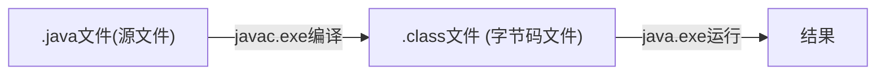
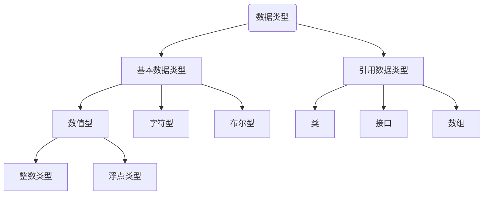
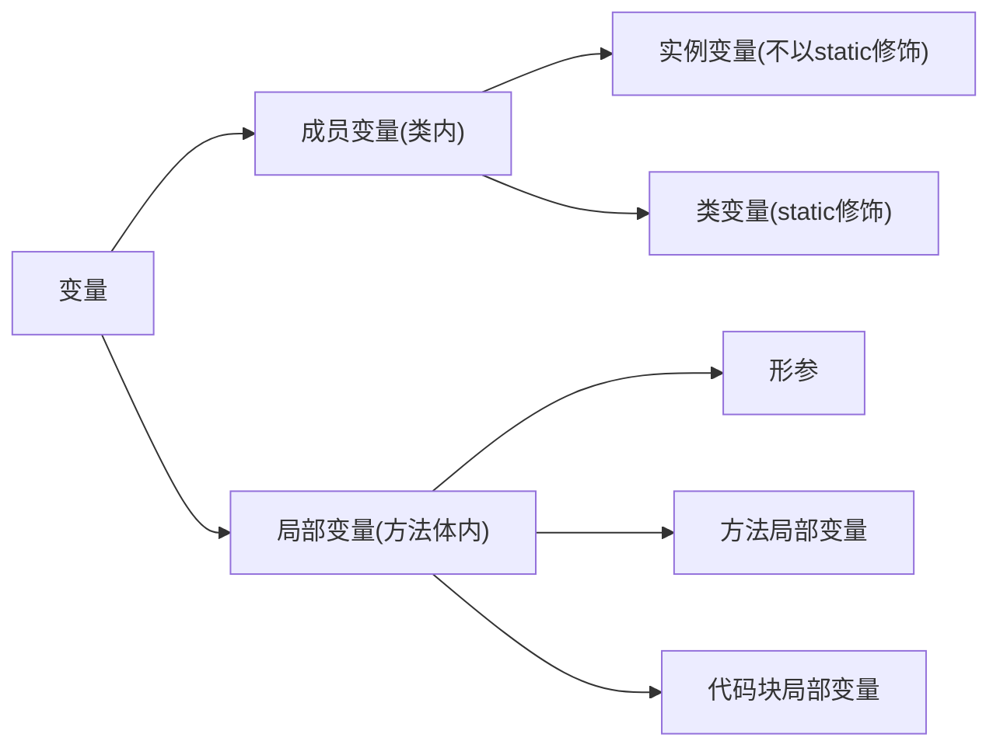

# JAVA

[TOC]

-------------


## 一. 绪论

### 1. java概论

* 由sun(斯坦福大学)公司开发,后归属oracle.

* 开发jdk版本1.x,也可以称为x.0,在9.0以后变成时间为版号.,6个月更新一次.

* `javaSE`:标准版(可看做java基础)

  `javaEE`:企业版

  `javaME`:小型版(移动终端)

* __特点__: 面向对象 健壮性 跨平台性

* 不同操作系统的java虚拟机(__JVM__)帮助java实现了跨平台性

* __核心机制__: 垃圾回收机制,java虚拟机

#### 1.1 JDK和JRE

* __JDK是什么:__(java development kit)直译为 `java开发工具包`,内含包括JRE在内的开发工具.还有编译工具(javac.exe),打包工具(jar.exe)
* __JRE是什么__:(java runtime environment)直译为`java开发环境` 包括java虚拟机和核心类库等.
* JDK开发的java程序,由JRE运行


#### 1.2 一个简单的.java运行方法



* 字节码文件的名字是源文件中的__类名__.

### 2. HelloWorld

* public只能加在和源文件同名的类前.
* System.out.println输出后自动换行,print不换
* 运行的class是包含main的class

#### 2.1 文档注释

文档注释是java特有的注释方式

* 语法:

```java
/**
	@author 指定java程序作者
	@ version 指定源文件版本
*/
```

* __特殊性__: 文档注释可以被JDK工具`javadoc`解析,生成一套以网页文件形式体现的该程序的说明文档.

* 解析方法:

  ```doc
  javadoc -d 文件夹名 -author -version 源文件
  ```

  

#### 2.2 API(应用程序编程接口)

在文件夹里有API文档

----

### 3. Eclipse快捷键

```java
/*
 * Eclipse中的快捷键：
 * 1.补全代码的声明：alt + /
 * 2.快速修复: ctrl + 1  
 * 3.批量导包：ctrl + shift + o
 * 4.使用单行注释：ctrl + /
 * 5.使用多行注释： ctrl + shift + /   
 * 6.取消多行注释：ctrl + shift + \
 * 7.复制指定行的代码：ctrl + alt + down 或 ctrl + alt + up
 * 8.删除指定行的代码：ctrl + d
 * 9.上下移动代码：alt + up  或 alt + down
 * 10.切换到下一行代码空位：shift + enter
 * 11.切换到上一行代码空位：ctrl + shift + enter
 * 12.如何查看源码：ctrl + 选中指定的结构   或  ctrl + shift + t
 * 13.退回到前一个编辑的页面：alt + left 
 * 14.进入到下一个编辑的页面(针对于上面那条来说的)：alt + right
 * 15.光标选中指定的类，查看继承树结构：ctrl + t
 * 16.复制代码： ctrl + c
 * 17.撤销： ctrl + z
 * 18.反撤销： ctrl + y
 * 19.剪切：ctrl + x 
 * 20.粘贴：ctrl + v
 * 21.保存： ctrl + s
 * 22.全选：ctrl + a
 * 23.格式化代码： ctrl + shift + f
 * 24.选中数行，整体往后移动：tab
 * 25.选中数行，整体往前移动：shift + tab
 * 26.在当前类中，显示类结构，并支持搜索指定的方法、属性等：ctrl + o
 * 27.批量修改指定的变量名、方法名、类名等：alt + shift + r
 * 28.选中的结构的大小写的切换：变成大写： ctrl + shift + x
 * 29.选中的结构的大小写的切换：变成小写：ctrl + shift + y
 * 30.调出生成getter/setter/构造器等结构： alt + shift + s
 * 31.显示当前选择资源(工程 or 文件)的属性：alt + enter
 * 32.快速查找：参照选中的Word快速定位到下一个 ：ctrl + k
 * 
 * 33.关闭当前窗口：ctrl + w
 * 34.关闭所有的窗口：ctrl + shift + w
 * 35.查看指定的结构使用过的地方：ctrl + alt + g
 * 36.查找与替换：ctrl + f
 * 37.最大化当前的View：ctrl + m
 * 38.直接定位到当前行的首位：home
 * 39.直接定位到当前行的末位：end
 */
```


## 二. 基本语法(划水)

### 1. 关键字和保留字(划水)


* __保留字__:JAVA没有使用的关键字,如`goto`,`const`,命名的时候避开.

### 2. 标识符(Identifier)

标识符就是名字,JAVA有特殊的起名规范:

1. 由26字母,0-9,`_`和`$`构成
2. 数字不开头
3. 不能用关键字和保留字
4. 不能含有空格

#### 2.1 命名规范

* __包名__: 所有字母小写xxyyzz
* __类名__:单词首字母大写,驼峰 XxYyZz
* __变量,方法__:第一个单词首字母小写,后面大写xxYyZz
* __常量__:所有字母大写,用下划线连接XX_YY_ZZ

---

### 3. 变量

#### 3.1 数据类型



> 八大__基本数据类型__(primitive type):
>
> 整型: `byte`,`short`,`int `,`long`
>
> 浮点:`float`,`double`
>
> 字符型:`char`(单个字符类型)
>
> 布尔型:`boolean`
>
> 
>
> 三个__引用数据类型__(reference type):
>
> 类:`class`
>
> 接口:`interface`
>
> 数组:`[]`

#### 3.2 按声明位置的变量分类



#### 3.3 整型(划水)

* 整型常量默认为int型,想要long加`l/L`

* 通常我们只用int

* 大小表:

  | 类型  | 存储空间 | 表数                  |
  | ----- | -------- | --------------------- |
  | byte  | 1字节    | -128~127              |
  | short | 2字节    | $-2^{15}\sim2^{15}-1$ |
  | int   | 4字节    | $-2^{31}\sim2^{31}-1$ |
  | long  | 8字节    | $-2^{63}\sim2^{63}-1$ |

#### 3.4 浮点型(划水)

| 类型             | 空间  | 表数                 |
| ---------------- | ----- | -------------------- |
| float(精确到7位) | 4字节 | -3.403E38~3.403e38   |
| double(14位)     | 8字节 | -1.798E308~1.798E308 |

默认为`double`,float常量需要以`F/f`结尾

一般定义`double`

#### 3.5 字符型(和C的char一样)(划水)

* __大小__:char,一个字符=`2byte`
* 标志:==单引号==,一个字符

#### 3.6 boolean(划水)

显然只能取`true`,`false`

#### 3.7 自动类型提升

* 大小同种数据运算,结果为大类型(提升).否则__编译失败__
* 整型转浮点型随便转(浮点是比整型大的类型)

* char,short,byte大小并列,互相作运算时都为int类型

#### 3.8 强制类型转换(C划水)

属于自动提升的逆运算,从大的类转到小的类

```java
double 12.3;
int i1=(int) d1;
```

语法类似C++,会导致精度损失

----

### 4. 内置引用数据类型(部分)

#### 4.1 String

* 定义

```java
String s1="Hello world!";
```

* __运算__:

  可以和<u>所有基本数据类型</u>作__连接运算__(+),结果是`String`类型

* 不能强制转换成数字

### 5. 运算符(超划水)

`a instanceof b`:返回a是否是b类的对象

* 逻辑运算符:
  * `&`逻辑与 `&&`短路与 `或` 
  * `双与`在不需要判断时停止,`单或`啥的同理
* `>>>`位运算,无符号右移

### 6.Scanner 输入

```java
/*具体实现步骤*/
//1. 导包
import java.util.Scanner;
//2. scanner实例化
Scanner scan=new Scanner(System.in);
//3. 调用nextXx方法接受相应类型的值
//若是字符串直接next,不是则类型首字母大写
int num=scan.nextInt();
```

### 7. 随机数

```java
Math.random() //返回0-1之间的浮点数,不需要import
    //[0,1) 左闭右开
```

### 8. 分支结构(划水)

和c语言一样,switch中不能放boolean类,能放String类.

### 9. 时间的方法

```java
System.currentTimeMillis();
//返回long
```

### 10. break/continue指定结束for循环

```java
label: for(;;)
{
	for(;;)
    {
        break label;//指定break外层for循环
    }
}
```

---

## 三. 数组

和C语言大多差不多

>  __特点__: 有序排列
>
> 是一个__引用数据类型__,可以保存任何类型.
>
> 长度一旦确定,不可以更改

### 1. 基本操作

* __声明和初始化__

```java
int[] ids;//声明
ids = new int[]{1001,1002};//静态初始化,指定元素值
int ikk[]={100,101};//也行

String[] names = new String[4]; //动态初始化,不指定元素值

//左边的另一种写法
String names[] = ...;
```

* __长度__

  ```bash
  names.length属性
  ```

* __默认初始化值__

  * 整型: `0`
  * 浮点型: `0.0`
  * char: `\u0000`
  * 布尔型: `false`
  * String : `null`

* __内存解析__


* new出来的结构放在堆中
* __但是指向结构的变量本身存在栈中,值为堆中的地址__
* 地址是jvm的虚拟地址,跟C指针直接显示内存地址不同

------

### 2. 二维数组

* __声明和初始化__:

  ```java
  int [][] arr1 = new int[][] {{1,2,3},{4,5},{6,7}};//静态初始化
  int [][] arr1 = {{1,2,3},{4,5},{6,7}}; //也是正确的写法(类型推断,只能在声明时省略new)
  
  int [][] arr2 = new int[3][2];//动态初始化,指定元素长度
  int [][] arr2 = new int[3][];//动态初始化,不指定元素长度
  
  //左边的另一种写法
  int[] arr3[] = ...;
  ```

* __默认初始化值__

  * 在指定二维大小时: 二维每个元素为地址值,内层为0(见一维)
  * 在new int\[3\]\[\]时: 二维每个元素为null

### 3. 排序

* __分类__:

  > 内部排序: 在内存中完成的排序;
  >
  > 外部排序: 在磁盘中完成的排序;

* 十个排序算法

  > * 选择排序
  >   * 直接选择排序,堆排序
  > * 交换排序
  >   * 冒泡排序,快速排序
  > * 插入排序
  >   * 直接插入排序,这般插入排序,shell排序
  > * 归并排序
  > * 桶式排序
  > * 基数排序

----

### 4. Arrays工具类

* __导入__: 

  ```java
  import java.util.Arrays;
  ```

* __方法__:

  | 方法                  | 作用                               | 返回类型 |
  | --------------------- | ---------------------------------- | -------- |
  | equals(arr1,arr2)     | 比较两个数组是否相同(大多类型可用) | boolean  |
  | toSting(arr)          | 输出数组信息([括起])               | String   |
  | fill(arr,value)       | 将指定值填充到arr中                | void     |
  | sort(arr)             | 将arr排序                          | void     |
  | binarySearch(arr,key) | 在arr找key,返回索引                | int      |
  |                       |                                    |          |
  |                       |                                    |          |

* __使用举例__:

  ```java
  int [] arr1 = new int[] {1,2,3,4};
  int [] arr2 = new int [] {1,3,2,4};
  		
  boolean isqu = Arrays.equals(arr1,arr2);
  //返回false
  ```

  

### 5. 相关异常

* __ArrayIndexOutOfBoundsException__ 数组越界
* __NullPointerException__ 空指针异常

------

## 四. 异常处理

### 1. 概述

在Java中,将程序执行中发生的不正常的情况称为__异常__(语法错误和逻辑错误不算)

程序在执行过程中出现异常,会在异常代码处抛出一个对应异常类对象

分类:

* ==Error==: Java虚拟机无法解决的严重问题.如 JVM系统内部错误,资源耗尽
  * 举例: `StackOverFlowError`,`OOM`
  * 一般不编写针对性的代码处理(不改源代码不能用,异常处理也处理不了)
* ==Exception==: 其他编程错误或偶然外在因素造成的一般性问题,可以进行处理

### 2. 异常体系结构


* 红色也叫编译时异常,蓝色也叫运行时异常
* 总父类是`Throwable`,属于java.lang

---------

### 3. 异常处理机制一(try)

`try-catch-finally`结构

```java
try{
    //可能异常的代码
}catch(异常类型1 变量名1){
	//处理方式1
}catch(异常类型2 变量名2){
	//处理方式2
}finally{
    //一定会执行的代码
}
```

* `try`中,出现异常后的语句不会执行
* `catch`只执行一个(或0个),执行完直接跳出`try-catch`结构(没有finally)
* 一般父类异常往后放
* 在开发时主要针对编译时异常.

* __异常对象的方法__:
  * getMessage() //返回字符串,显示信息
  * printStackTrees() //void,显示信息和具体结构
* finally:可选的
  * 就算catch中出现异常,也能执行
  * try和catch中return退出函数之前,finally也能执行
  * 若return后执行的finally也有return,按finally的来

### 4. 异常处理机制二(throws)

将异常扔给上一级处理.

* 语法: 在函数声明后,指明可能出现的异常类型
* 执行时出现异常会生成异常类对象,若此对象满足throws后的内容,抛出(给调用者)

```java
public class ThrowsTest {
	
	public static void main(String[] args) {
		try {
			method2();
		}catch(Exception e) {
			System.out.println("ahh;a");
		}
	}
	
	public static  void method2() throws FileNotFoundException,IOException{//出问题向上抛
		method1();
	}
	
	public static void method1() throws FileNotFoundException,IOException{
        //指明可能出现的异常类型
		File file = new File("hello.txt");
		FileInputStream fis = new FileInputStream(file);
		
		int data = fis.read();
		while(data != -1) {
			System.out.println((char)data);
			data = fis.read();
		}
		fis.close();
	}
}

```

-----------

### 5. 手动抛出异常(throw)

之前的异常都是系统自动生成的,你还可以手动生成抛出__(throw)__

```java
throw new RuntimeException("aaa")//生成异常对象并抛出
    //参数称为message(对应的get方法为getMessege)
```

---------

### 6. 用户自定义异常类

# 面向对象编程(上)

## 一. 绪论

* 主要内容:

  > 1. JAVA类及类成员: 属性,方法,构造器;代码块,内部类
  > 2. 面向对象的三大特征: 封装,继承,多态,(抽象)
  > 3. 其他关键字: this super static....

### 1. POP(过程)与OOP(对象)

* 对比:

  面向过程以__函数__为最小单位,强调__功能行为(怎么做)__

  面向对象以__类/对象__为最小单位,强调__具备功能的对象__,考虑__谁来做__

### 2. 类和对象

__类和对象__是面向对象的两大要素.

* __类__: 对一类事务的描述,是抽象的,概念的

* __对象__ :是实际存在的类事物的每个个体,也称为__实例(instance)__ 

面向对象的重点是类的设计; 

---

## 二. 类

设计类,就是设计类的成员

* __常见类成员:__

  > 属性 (field,成员变量) 
  >
  > 方法 (method)
  
* 在同一个包(package)里的类可以互相调用

### 1. 对象

对象的<u>值</u>是__堆中地址__;对象<u>本身</u>存在__栈__中;

* 默认值为null,属性的默认值同数组

* __实例化__:

  ```java
  类名 变量名 = new 类名(); //没有构造器的实例化
  ```

* __浅拷贝__:

  ```java
  对象1 = 对象2; //指向同一个对象地址
  ```

### 2. java内存解析


* __栈(虚拟机栈)__: 存放局部变量,包括<u>编译期可知长度</u>的各种基本数据类型(包括存地址的变量),自动释放
* __堆(heap)__: 存放<u>对象实例,</u>jvm要求所有的对象实例和数组在堆上分配
* __方法区__: 存放已经被虚拟机加载的<u>类信息,常量,静态变量,即时编译器编译后代码</u>等数据

---

### 3. 方法

刻画 类应该具有的功能

> 注意点:
>
> 1. 方法内可以调用类的属性和方法;特殊的,调用自己叫递归

----

### 4. 匿名对象(划水)

new完不赋值就是匿名对象,不能复用.

可以作为参数传.

----

## 三. 方法

### 1. 重载(overload)

* __概念__: 在同一个类中,允许存在一个或以上的同名方法,只要__参数个数或类型不同__即可.

* __细节__:

  *  需要非常明确的指令,指定使用哪个版本的重载. 

  * 若无匹配的重载,会使用自动类型提升

-----

### 2. 可变个数形参(varagrs)

jdk5.0新增

* __概念__:允许和多个实参相匹配的形参

* __语法__:

  ```java
  public void show(String ...strings strs) {//定义
  		
  	}
  ```

* 可以和__0个或一到多个__指定类型的实参匹配

* 和同名方法基本可以构成重载, 但和数组不可以重载`(编译器认为可变参和数组没有区别)`.

* __参数使用__: 将实参看做数组使用,**甚至可以直接传入数组**;

* __注意__: 
  * 只能声明在末尾
  * 只能有一个
  * 确定个参数的优先于可变参

---

### 3. 参数的值传递机制

我们已经知道,对于<u>基本数据类型</u>,直接传入的是变量的值,是不能做改变的.

而<u>引用数据类型</u>(类对象,数组)的值是地址,可以改变值.

----

## 四. 封装与隐藏/封装性(encapsulate)

* __封装思想__:

  * <u>高内聚</u>: 类的内部数据操作细节自己完成,不允许外部干涉
  * <u>低耦合</u>: 仅对外暴露少量的方法用于使用

  综上: 隐藏对象内部的复杂性,只对外公开简单的接口,便于外界使用.从而提高系统的可扩展性,可维护性.这就是__封装性的设计思想__

* 体现之一: 属性私有化,提供公共的方法来获取(get)和设置(set)属性值(`Alt`+`shift`+`s`)

### 1. 权限修饰符

Java规定了4种权限,从大到小排列: 

> **private**
>
> **缺省**
>
> **protected**
>
> **public**

* 含义:

| 修饰符    | 类内部 | 同一个包 | 不同包的子类 | 同一个工程 |
| --------- | ------ | -------- | ------------ | ---------- |
| private   | Yes    |          |              |            |
| 缺省      | Yes    | Yes      |              |            |
| protected | Yes    | Yes      | Yes          |            |
| public    | Yes    | Yes      | Yes          | Yes        |

* __修饰什么__:
  * 对于`class`(外部类)只能用__public和缺省__: 分别能被任意地方访问,和只能被同一个包内部访问
  * 对于类的内部结构(属性,方法,构造器,内部类):都可使用

-------

## 五. 构造器

任何类都有构造器(constructor).

* __作用__: 用来创建对象,初始化属性

* __说明__: 未显式定义,系统默认提供空参构造器.

* __格式__:

  ```java
  权限修饰 类名(形参列表){
  }
  ```

* 细节:

  * 可以重载(参数列表变化)
* 在显式定义构造器以后,默认的空参构造器不予提供
  
* 默认构造器的权限和类权限一致
  
* __属性赋值的顺序__:
  * 默认初始化值
  * 显式默认初始化值(int age =1;)
  * 构造器
  * 方法赋值

-----

## 附. JavaBean

`JavaBean`是一种java语言写成的可重用组件.

* 所谓__JavaBean__,是满足以下条件的标准Java类:
  * <u>类是公共的</u>
  * <u>有一个无参的公共构造器</u>
  * <u>有属性,且有对应的get,set方法</u>

* 用户可以使用JavaBean将功能,处理,值,数据库访问和其他任何可以用Java代码创造的对象打包.

~~未完待续~~

----

## 附. UML类图


---

## 六. this,package,import关键字

### 1. this

`this`是当前对象的代表.在类方法自己使用,跟C++一样.

在形参和属性重名时使用.

* __调用构造器__:

  * 在初始化时需要考虑的事可能重复,可以在构造器中调用本类的其他构造器
  * <u>不能调用自己</u>
  * <u>有n个构造器,则至多n-1个构造器能调用其他构造器,不可形成循环调用</u>
  * <u>必须声明在首行</u>

  * <u>不能一个构造器调用两个</u>

  * 语法为 `this(形参列表)`

    ```java
    public Person(){
    	
    }
    public Person(String name){
        this.name = name;
    }
    public Person(String name ,int age){
        this(name);//调用构造器,防止动作冗余
        age = age;
    }
    ```

    ---------

### 2. package,import

  `package`是为"包"

* 作用:
  * 为了更好的实现项目中类的管理
  * 使用package声明类或接口所属的包,在源文件的首行
* 点结构: 包名中每`.`一次,代表一层文件目录
* 同一个包下不能有同名类或接口

`import`在源文件中显示的导入指定包下的类或接口(只能从同一个包)

* java.lang默认已经被导入,可以省略.
* 本包下定义也可以省略
* 若不同包导入了重名类,,只能把类名包名写全.(全类名)
* 如果使用xxx.*表示可以调用xxx下的所有结构,但<u>xxx子包</u>内的结构仍然需要显示调用.
* `import static`可以导入类中的静态结构(方法或属性)


#### 2.1 MVC设计模式

MVC是常用设计模型,将程序分为三个层次: __视图模型层(View),控制器层(Control),数据模型层(Model)__降低了程序耦合性.


--------------


# 面向对象编程(中)

## 一. 继承性(extends)

* __先说语法__:

```java
class 子类 extends 父类{

	//继承
}
```

### 1. 继承性( is a关系)

继承的为__子类,派生类__(subclass),被继承的为__父类,超类,基类__(superclass).

* __优势__:
  * 提高<u>代码复用性</u>
  * 便于功能扩展
  * 为多态性提供前提
* __体现__:
  * 子类 is a 父类
  * 一旦子类A继承父类B以后,子类A就获得了父类B声明的结构: 属性,方法
  * <u>包括私有(private)的属性方法也被继承,但封装性使得子类(及子类内部)不能直接用点(.)调用.(**只能用父类非私有方法调用**)</u>
  * 继承以后,还可以定义自己特有的属性和方法.

### 2. java的继承规则

* 允许__单继承,多层继承__,不允许多重继承
  * 一个子类只能有一个父类
  * 一个父类可以派生出多个子类
* 多重继承下,直接继承的叫__直接父类__,间接继承的叫__间接父类__
* __所有类除它本身(object)都继承于`java.lang.Object`__,没有显式继承则自动直接继承于Object类

------

### 3. 方法的重写(overwrite/override)

* __定义__: 在子类中可以根据需要对从父类中继承来的方法进行改造,也称__重置,覆盖__.程序执行时,子类的方法覆盖父类的方法
* __要点__: 在重写后,子类无论如何调用(包括使用父类方法调用)重写的方法,执行的都是重写后的,而不是重写前的.
* __要求__:
>  * <u>==同名同参数==才称为重写(overwrite)</u>
>  * <u>子类重写的方法的权限修饰__不小于__父类的被重写方法的权限修饰</u>
>  * <u>对子类看不到的方法(权限修饰低),用同名同参数也不构成重写</u>
>  * __返回值类型__: 
>    * 如果父类是void,子类只能是void
>    * 如果父类是基本数据类型,子类和父类类型必须相同
>    * 父类为A类型(引用),则子类的返回值可以是A类或A类的子类
>  * 子类抛出的异常类型不大于父类抛出的异常类型
>  * 要么**都是**static(static不可重写),要么**都是**非static的
>  * <u>可变参和数组认为是相同的,构成重写</u>

-----------

### 4. super关键字

意思就是`父类的` 可以用这个关键字调用父类的: 方法,属性,构造器

用法类似于`this`

* __用途__:
  * 在父子类出现同名属性时,若不指名默认选择子类的属性,只有用super可以调用
  * 调用重写前的父类方法

```java
	public void eat() {
		System.out.println(super.age);
		System.out.println("No!!!");
	}
```

* __调用父类构造器__
  * 必须声明在首行
  * 只能用一个,并且this和super调用构造器只能选一个
  * 默认存在调用`super()`.

```java
//在子类构造器中调用父类的构造器
public Student(int age){
    super(age);
    ...
}
```


-----------------

### 5. 子类的实例化过程

* 通过子类的构造器构造对象:
  * 一定会直接或间接的调用父类的构造器.这也是子类能获取父类结构的原因.
  * 但是调用父类构造器,并不意味着创建多个对象.

---

## 二. 多态性(polymorphism)

### 1. 多态性

* __理解__:多态性可以理解为一个事物的多种形态.

* __语法本质__: <u>父类的引用指向子类的对象</u>

  ```java
  Person s2 = new Man();
  ++给父类形参赋值子类实参也是这种情况
  ```

* 使用细节:

  	* __虚拟方法调用__: 多态条件下,多态对象调用子父类同名同参(重写)的方法时,执行的是子类重写的方法
  	* 不能调用子类特有的方法,只能<u>调用父类中存在的方法</u>.
  	* 不适用于属性,什么类型的就调用谁的属性.

* __总之__: 在编译期只能调用父类声明的方法,但运行时调用的却是子类重写的版本.(编译看左边.运行看右边)
  
  * 多态是__运行时__行为

### 2. 作用

1. 允许父类形参赋值子类,增加代码复用.

### 3. 虚拟方法调用

* 在多态情况下,父类被重写的方法称为__虚拟方法__.
* 在编译期间无法确定使用哪个,而在运行时确定,故为_虚_

### 4. 向下转型/instanceof

#### 4.1 向下转型

* 前提: 多态条件下,该对象其实指向了一个子类的空间(new 子类),但是因为多态性无法调用子类特有的方法和属性.

* __所以__: 使用强制类型转化可以将多态对象变为子类对象,而因为多态对象指向的空间本就是子类空间所以成立

  ```java
  Person p1 = new Man();
  Man m1 = (Man)p1;
  ```

* 向下转型后的对象可以访问子类特有方法属性.

* 各种情况:

  * **编译通过,运行不通过**: 强制转换成了同一个父类的另一个子类

  * **编译通过,运行通过**:

    ```java
    //obj>person>woman
    Object obj = new Woman();
    Person p = (Person) obj;
    //自行理解
    ```

    

#### 4.2 instanceof关键字

```java
a instance of B 
//instance表达式,如果a是类B(或B的子类)的实例,返回true,否则false
```

用来判断向下转型,如果true,则a可以强转为B类型.

----------------

## 附. Object类的使用

`Object`是所有Java类的根父类.,未显式声明`extends`的默认为`java.lang.Object`的子类.

### 1. Object的功能

Object的方法和属性(没有属性)具有通用性.

* Object只有空参__构造器__.
* __方法__

| 方法                           | 含义                                                |
| ------------------------------ | --------------------------------------------------- |
| protected Object **clone**()   | 创建并返回对象的复制                                |
| boolean **equals**(Object obj) | 比较两个对象是否相同                                |
| protected void **finalize**()  | 当没有引用指向这个对象,就会调用这个方法然后垃圾回收 |
| Class<?> __getClass__()        | 获取自己的类                                        |
| int __hashCode()__             | 返回当前对象的hash值                                |
| void **notify**()              | ~~待续~~                                            |
| void **notifyAll**()           | ~~待续~~                                            |
| void **wait**()                | ~~待续~~                                            |
| String **toString**()          | 对象打印时调用                                      |

#### 1.1 equals方法

* __==和equals的比较__
  1. `==`可用在基本数据变量和引用数据类型中
  2. `==`是运算符,基本数据类型可用自动类型提升
  3. `==`对于引用类型,比较地址值是否相同(包括String).
  4. `equals`是一个方法,需要使用对象调用,不能作用于基本数据类型之间
  5. `equals`在Object中和`==`效果相同,String,Date,File重写比较内容是否相等.
     * return (this == obj);

#####  重写

* eq+自动补全 
* shirt+alt+s自动生成
* __重写原则__:(等价关系准则)

  * 对称性: x.equals(y) <=>y.equals(x)
  * 自反性:x.equals(x) <=> true
  * 传递性: x.equals(y),y.equals(z) ==> x.equals(z)

  * 一致性: x.equals(y),当x和y内容不变时,返回的布尔值也不会变
  * <u>x.equals(null) 是false</u>
  * <u>x.equals(不同类型对象)是 false(包括继承类)</u>

#### 1.2 toString

在Object中,默认输出类型的引用.

```java
 return getClass().getName() + "@" + Integer.toHexString(hashCode());
//类名+@+hashcode值
```

-------

## 附. JUnit单元测试

### 1. 添加单元测试方法

* 添加步骤: __(适用于JUnit4)__

  * 

  * 创建Java类满足以下要求:

    * 类是public的
    * 有public的无参构造器

  * 在此类中声明<u>public</u>单元测试方法<u>,没有返回值(void)</u>,<u>没有形参</u>,函数名随意,一般以`test`为前缀

  * ==在此方法上注解`@Test`==,导入`import org.junit.Test`

    ```java
    //示例
    import org.junit.Test;
    public class JUnitTest {
    	@Test
    	public void testEquals() {
    		String s1 = "MM";
    		String s2 = "MM";
    		System.out.println(s1.equals(s2));
    	}
    }
    ```

    

### 2. 执行结果:

* 无异常则为__绿条__
* 执行失败或出现异常为__红条__

可以直接执行测试方法中的内容,不需要main了

------------------

## 三. 包装类/封装类

__包装类__是针对基本数据类型定义相应的引用数据类型.

### 1. 对应关系

| 基本数据类型 | 包装类        |
| ------------ | ------------- |
| byte         | Byte          |
| short        | Short         |
| int          | **Integer**   |
| long         | Long          |
| float        | Float         |
| double       | Double        |
| boolean      | Boolean       |
| char         | **Character** |

* 数值型对应包装类都有父类`Number`

### 2. 基本数据类型与包装类转换

* **基本-->包装类**

1. 调用包装类构造器<u>(基本已经被弃用了)</u>

```java
Integer in1 = new Integer(num);//int转数字
Integer in1 = new Integer("123");//把字符串转数字,布尔型不是"true"都是false
//其他类型同理
```

* __包装类-->基本__

  1. 调用`xxxValue`方法

     ```java
     in1.intValue()
     b1.booleanVaule()
     ```

     

### 3. 自动装箱与拆箱

对于赋值和函数传参有效.

* 自动装箱: 基本数据类型直接赋给对应引用为自动装箱

```java
//自动装箱演示
int num1 = 10;
Integer in1 = num1;
```

* 自动拆箱: 直接把包装类对象赋给基本数据类型

```java
//自动拆箱
int num2 = in1;
```

--------

### 4.String和包装/基本类的转化

有了自动拆箱和装箱,基本类和包装类看做一个整体.

* __基本/包装-->String__

  1. 连接运算

     ```java
     String = num1 + "";
     ```

  2. 调用String重载的`ValueOf(任意基本/包装)`

  ```java
  String haha = String.valueOf(12.3);
  ```

* __String-->基本/包装__

  1. 调用包装类的`parseXxx`方法

  ```java
  Integer.parseInt("123");
  ```

---------------


# 面向对象编程(下)

## 一. static(静态)

### 1. static概述

> 我们编写一个类时,其实就是在描述对象的属性和行为,没有实际产生对象,只有`new`可以产生新的对象,分配内存,供外部调用.
>
> 我们有时候希望无论是否产生对象或无论产生多少对象的情况下,==**某些特定的数据在内存空间中只有一份**==,例如中国人共享中国这一个国家名称,而不是每人单独分配一个名称.

------

### 2. static使用

* `static`可以用来修饰 <u>属性,方法,代码块,内部类</u>

#### 2.1 修饰属性

```java
static String nation;//类内声明属性
//***************
//main内使用:
c1.nation = "chinese"; //* 用对象可以直接调用(不计封装性时)
System.out.println(c2.nation);//chinese
```

此时的属性又称作__静态变量/类变量__.没有static修饰的可以称为__实例变量__.

* __细节__:

  * 静态变量随着类的加载而加载,早于对象对象的创建.

  * 可以用类名直接调用(类.静态变量)

    ```java
    System.out.println(Chinese.nation);//Chinese是类名
    ```

  * 静态变量在内存中只有一份,在方法区的__静态域(static field)__中.S

#### 2.2 修饰方法

```java
public static void show() { //静态方法
		System.out.println("haha");
}
/**********
//在main中
Chinese.show();
c1.show();
```

__静态方法__:

* 细节:
  * 随着类的加载而加载
  * 用类名可以调用
  * __静态方法中只能调用静态方法或属性__.静态变量默认是由类名调用的.
  * 不能使用this和super关键字

### 3. 使用的情景

* 共享的属性
* 操作static属性的方法
* 工具类的方法
* 常量属性

------------

## 附: static应用:单例设计模式

* 什么是__设计模式__: <u>是在大量实践中总结和理论化之后的优选代码结构,编程风格以及解决问题的思考方式</u>.避免重复的思考和摸索,也可以看做一种"套路" .现存23种设计模式,单例设计是其中一种.

* __单例(Singleton)设计模式__:在整个软件系统中,对某个类__只能存在一个对象实例__,并只提供一个取得该对象实例的方法.

### 1. 步骤

* 将构造器访问权限设为private
  * 这样就不能用new缠身个,而只能再累内部产生
* 调用静态方法返回内部创建的对象
* 由于静态方法只能访问静态变量,所以该对象也必须定义成静态的.

### 2. 饿汉式单例

迫不及待先造好

```java
class Bank {
	//私有化构造器
	private Bank() {
	}
	//内部创建对象
	private static Bank instance = new Bank();
	//提供公共方法返回
	public static Bank getInstance() {
		return instance;
	}
	
}
```

### 3. 懒汉式单例

啥时候用啥时候造

```java
class Order{
	//私有化构造器
	private Order{
		
	}
	//声明当前列对象,没有初始化
	private static Order instance = null;
	
	//在方法中创建实例
	public static Order getInstance() {
		if(instance == null) instance = new Order();
		return instance;
	}
}
```

### 6. public饿汉法

```java
public static final xxx = new Order();
//然后用类.xxx即可访问单例
```


### 5. 比较

* 懒汉式:
  * 好处: 延迟对象创建
* 饿汉式:
  * 坏处: 对象加载时间过长
  * 好处: 是线程安全的

----------------------

## 附. main方法

main方法是程序的入口,也可以看做一个普通的静态方法

```java

public class MainTest {
	public static void main(String[] args) {
		Main.main(new String[100]); //调用main方法
	}
}
```

其形参可以作为控制台交互的方式:

```java
public static void main(String[] args) {
		for (int i = 0; i < args.length; i++) {
			System.out.println(args[i]);
		}
	}

/**
在eclipse中选run as的 run configuration,选择编译后的文件
在arguments栏填入参数(program arguments)即可,用空格隔开各个参数.
*/
```

---------------

## 二. 代码块(block)

__代码块__也叫<u>初始化块</u>

###  1. 作用和语法

* __作用__: 用来**初始化**类和对象.

  * 非静态代码块可以设置属性的默认值,执行在构造器之前,.

* __语法__:分为静态和非静态.

  ```java
  //在类中
  //静态代码块,可以调用静态的属性和方法
  static{
  
  }
  //非静态代码块,可以调用属性和方法
  {
      
  }
  ```

* __特点__:

  * 静态代码块: 随着类的加载而__执行__(基本只执行一次)
  * 代码块: 随着对象的加载而__执行__(造一个执行一次)
  * 两种类型都可以声明多个代码块,按照声明的先后顺序执行.

### 2. 父子构造顺序

> 由父及子,静态先行
>
> * 先加载再构造
>
> * ******
>
> * 加载时,先加载父类,再子类
> * 构造时,先调用父类非静态代码块,后构造器,再子类

### 3. 执行顺序

* 代码块执行在构造器之前;
* 代码块与显示初始化__平级__,谁在前就谁先执行

----------------

## 三. final关键字

### 1. 修饰什么?

* **类**     : 不能被继承,即不能拥有子类,如String类.
* **方法** : 不能被重写
* **属性** : 此时的变量不能改变,成为__常量属性__,
  * 可以在<u>显示初始化,代码块和构造器</u>中赋值(对象创建过程),按顺序来.

* **局部变量和形参**:
  * 局部变量: 即__常量__.
  * 形参: <u>说明传入的是常量,不能修改实参.</u>

* static final 修饰属性: __全局常量__,

------------------

## 四. 抽象类和抽象方法

### 1. 概述

随着继承层次中一个个新子类的定义,类变得越来越具体,而父类更一般.更通用.类的设计应该保证父类和子类能够共享特征,有时这样的<u>父类</u>设计的非常抽象,以至于<u>没有具体实例</u>,这样的类叫__抽象类__.

### 2. abstract关键字

* $\color{red} {abstract}$可以形容:
  * **类** 
  * **方法**

> 对于修饰__类__:
>
> * 不能实例化,但有构造器便于子类调用
> * 其设计目的是**被继承**
> * 一般必须提供其子类
> * 抽象类可以继承抽象类

> 对于修饰__方法__:
>
> * $\color{red}必须在抽象类中$
>
> * 没有<u>方法体</u>
> * 不能被调用,而应该**被重写**
> * 所在抽象类被继承并需要实例化时__必须重写__,不然必为抽象类.

------

#### 2.1 使用注意点

* 不能修饰属性,构造器,代码块等
* 不能修饰<u>私有方法,静态方法</u>(联动重写的知识点,静态方法不能重写),<u>final方法\类</u>

-------

### 3. 匿名子类

话不多说,上语法:

```java
//前情提要: Person是抽象类,eat是抽象方法
public static void main(String[] args) {
		method(new Student());//匿名对象
		method1(new Worker());//非匿名的类,匿名的对象
		
//**************************************************
		//创建了匿名类的对象
		Person p = new Person() {

			@Override
			public void eat() {//在匿名类中重写方法
				// TODO Auto-generated method stub
				
			}
			
		};
    //匿名子类定义现场
//****************************************************	
    //匿名子类配合匿名对象(传参)
    method1(new Person() {

			@Override
			public void eat() {//在匿名类中重写方法
				// TODO Auto-generated method stub
				
			}
			
		};)
	}
```

意义: 只用一次,省事.

-----

## 附. abstract应用: 模板方法设计模式

__模板方法设计模式__(TemplateMethod)

抽象类作为多个子类的通用模板,子类在抽象类的基础上扩展,改造.

* 解决的问题:
  * 功能内部一部分是确定的,一部分实现是不确定的,可以把不确定的部分暴露出去让子类实现.

--------

## 五. 接口(interface)

### 1. 理解

一方面,有时必须从几个类中派生出一个子类,继承它们的所有属性和方法,但java不支持多重继承.但通过__接口__可以东达到多重继承的效果.

另一方面,有时必须从几个类中抽取出一些共同的行为特征,但是没有`is-a`关系,仅仅具有相同特征..比如一些设备都具有USB连接的特征,鸟和蝙蝠都有可以飞的特征.

__接口__就是规范,定义的是一组规则,体现了现实世界中"如果你要/是...则必须能.."的思想.继承是__是不是__,而接口是__能不能__

接口的本质是__契约,标准,规范__,制定后大家都要遵守.

### 2. 定义和使用

#### 2.1 定义

* 使用`interface`关键字定义
* 接口和类是并列的结构
* **定义**: 定义接口的成员
  * JDK 7 及以前: 只能定义__全局常量__和__抽象方法__
    * public static final(可以省略,默认接口中都为全局常量)
    * public abstract(可以省略,默认抽象)
  * JDK 8: 除JDK 7 的以外还能定义**静态方法,默认方法**

> 不能定义构造器,不可以实例化

### 2.2 使用

接口通过让类__实现__(implements)的方式来使用.语法类似于继承

```java
class Plane implements Flyable{}
```

* 如果实现类覆盖了接口中所有抽象方法则可以实例化,否则实现类需要声明为抽象类.

### 2.3 示例

```java
interface Flyable{
	
	//全局常量
	public static final int MAX_SPEED = 7900;
	int MIN_SPEED = 1;
	
	public abstract void fly();
	void stop();
}

class Plane implements Flyable{

	@Override
	public void fly() {
		System.out.println("fly");
		
	}

	@Override
	public void stop() {
		System.out.println("stop");
		
	}
	
}
```

----------

### 3. 多实现/接口继承

#### 3.1 多实现

一个Java类可以实现__多个__接口,弥补了单继承的局限性.

```java
class Bullet extends Object implements Flyable,Attackable{//可以继承并同时实现多个接口
```

### 3.2 接口继承

接口之间也可以继承,并且<u>可以多继承</u>

```java
interface CC extends AA,BB{
```

### 3.3 对多继承冲突的(个人)理解

* 对于方法,因为接口中都是抽象类,不在乎哪个,如果接口和继承有冲突,继承优先级最高
* 对于全局常量和继承属性,会出现冲突,建议用类名/接口名调用.

------

### 4. 接口实现多态

接口在多态的使用下和抽象类的情况基本相同

只是最终赋值的必须是已经实现的类的实例.

```java
interface AA{
}
interface BB extends AA{}
class CC implements BB{}
main{
    AA a = new CC();//可以
    USE(new CC());//可以
}
void USE(AA a){}
```

* 只要实现就可以,无关多重不多重

-----------

### 5. 匿名实现类

和匿名类差不多,直接上语法

```java
public class Anoy {
	AA aa = new AA() {

		@Override
		public void haha() {
			// TODO Auto-generated method stub
			
		}
		
	};
}
interface AA{
	void haha();
}
```

---------

### 6. jdk8接口

#### 6.1 静态方法和默认方法

jdk8让接口中可以出现方法体

```java
interface NetWork{
	public void browse();
	//静态方法,用接口直接调用,但实现类拿不到.
    //接口完全可成为工具类
	public static void method() {
		System.out.println("haha");
	}
	//默认方法,实现时可以不重写
    //继承/实现多个接口的同名同参默认方法且不重写时,报错
	public default void method3() {
		System.out.println("hahaha");
	}
    
    //调用
    class Ha implements NetWork{
    	public void method3(){
        
			   NetWork.super.method3();//调用接口中的默认方法
        }
    }
}
```


---------------

## 附. 接口应用: 代理模式

__代理模式(proxy)__,意为 为其他对象提供一种代理以控制对这个对象的访问.


````java
interface NetWork{
	public void browse();
}

//被代理类
class Server implements NetWork{

	@Override
	public void browse() {
		System.out.println("true netework");
		
	}
	
}

//代理类
class ProxyServer implements NetWork{
	private NetWork work;//获得被代理对象
	public ProxyServer(Network work) {
		this.work = work;
	}
	public void check() {
		System.out.println("check");
	}

	@Override
	public void browse() {
		// TODO Auto-generated method stub
		check();
		work.browse();//代理访问
	}
	
}
````

-------------

## 附. 工厂模式

创建和使用分离,为简单工厂模式

------

## 六. 内部类

当一个事物的部分需要一个完整的结构进行描述,而这个内部的完整的结构又只为外部事务服务,那么可以声明成__内部类__(inner class)

* 不能和外部类名相同

* 会生成字节码文件

* 分类:

  > * 成员内部类(成员变量)(静态/非静态)
  > * 局部内部类(局部变量)
  > * 匿名内部类

```java
class Person{
    class Dog{
		//成员内部类
	}
    static class Bird{
        //静态成员内部类
    }
    
	public void method() {
		class AA{
			//局部内部类
		}
	}
	
	{//代码块
		class BB() {
			//局部内部类
		}
	}
}
```

### 1. 成员内部类

一方面,作为外部类成员

* 可以被static修饰
* 可以调用类的结构(包括内部类)
* 可以被四种权限修饰符修饰

一方面是一个类

* 定义属性方法构造器代码块
* 可以是abstract,final
* 静态的内部类内部不能调用外部的非静态属性/方法

### 2. 实例化成员内部类

使用成员内部类时需要加上类名(静态)/对象名(非静态)

```java
	public static void main(String [] args){
	    Person p = new Person();
	    Person.Dog d = p.new Dog();//非静态
	    Person.Bird b = new Person.Bird();//静态
	}
```

* 内部类显式调用外部类的结构

  ```java
  class Person{
      int age;
  	 class Dog{
  		void method(){
              System.out.println(Person.this.age); //
          }
  	}
  	 static class Bird{
  		 
  	 }
  }
  ```

  

### 3. 局部内部类

* 在局部方法中调用外部方法的局部变量,外部这个局部变量必须是final的,或者jdk会帮你自动弄成final.


--------------------------

# JAVA高级

## 一. idea入门

### 1. module模块

idea中的project对应于eclipse的workspace

idea中的module对应于eclipse中的project

### 2. idea快捷键

可以在keymap中搞

--------

## 二. 线程

当有一个问题在你面前,你可以考虑:

* 是否是多线程问题?
* 是否有共享数据问题?是哪个?
* 线程安全问题是否存在?
* 如何解决安全问题?
* 是否涉及线程通信?

### 1. 程序,进程,线程

* __程序(program)__: 是为了完成特定任务,用某种预言编写的一组指令的集合. 即指__一段静态的代码__,<u>静态</u>对象.
* __进程(process)__: 是程序的一个执行过程,或者是__正在运行的程序__,<u>动态</u>过程,有产生,存在和消亡的过程(__生命周期__)
  * 进程作为资源分配的单位.在运行时会为每个进程分配不同的内存区域.

* __线程(thread)__: 进程可以进一步细化为线程,是一个程序内部的一条执行路径
  * 若一个进程同一时间并行执行多个线程,称为__支持多线程的__
  * ==线程作为调度和执行的单位,每个线程拥有独立的运行栈和程序计数器(PC)==,线程切换的开销小
  * 一个进程中的线程共享 堆 和 方法区 ,  使得线程间通信更高效.但多个线程操作贡献系统资源可能带来安全隐患.

### 2. CPU和并行并发

* 单核CPU : 假多线程,在一个时间单元只能执行一个线程的任务.相当于很多条车道但只有一个收费站人员.可以使用`挂起`提高效率
* 多核CPU : 真多线程.

> 一个Java程序至少有三个线程: <u>main()主线程,gc()垃圾回收线程,异常处理线程</u>

* __并行__: 多个CPU同时执行多个任务
* __并发__: 一个CPU(使用时间片)"同时"执行多个任务

-----

### 3. 多线程优点

对于单核CPU,先后顺序完成比多个线程更快,为什么需要多线程?

1. 提高应用程序的相应,对图形界面比较有意义,增强用户体验
2. 提高计算机系统CPU的利用率
3. 改善程序结构,将长而复杂的进程分为多个线程,利于理解和修改

什么时候需要多线程?

1. 程序需要同时执行两个或多个任务
2. 程序需要实现一些需要等待的任务时(如用户输入)
3. 需要后台运行的程序时

----

### 4. 线程的创建和使用

JVM允许java拥有多线程,通过`java.lang.Thread`类来体现

#### 4.1 声明Thread的子类

声明一个类继承`Thread`并重写`run()`方法

通过该类对象调用`start()`启动线程

* __run()__类似于main,是执行的主体

```java
class MyThread extends Thread{
    @Override
    public void run() {
        for(int i = 0 ; i < 100 ; i++){
            if(i % 2 == 0){
                System.out.println(i);
            }
        }
    }
}
public class ThreadTest {
    public static void main(String[] args) {
        MyThread t1 = new MyThread();
        t1.start();
        System.out.println(1111);
    }
}
```

* start()同一个线程类对象只可以执行一次,否则异常

* 通过__Thread.currentThread().getName()__获取当前进程名

#### 4.2 实现Runnable接口

实现接口,提供/实现构造器和`run()`方法

然后将该类的对象传给Thread构造器,调用`start()`

```java
public class ThreadTest1 {
    public static void main(String[] args) {
        MThread mThread = new MThread();
        Thread t1 = new Thread(mThread);
        t1.start();
    }
}
class MThread implements Runnable{

    @Override
    public void run() {
        for (int i = 0; i < 100; i++) {
            if( i % 2 == 0){
                System.out.println(i);
            }
        }
    }
}
```

==源码解释:==

```java
    public Thread(Runnable target) {
        this(null, target, "Thread-" + nextThreadNum(), 0);
    }//给target赋值

   public void run() {
        if (target != null) {
            target.run();//调用target的run
        }
    }
```

线程以Thread为准,不同线程可以共享target

#### 4.3 比较

优先使用接口实现的方法:

* Java没有多继承,线程和类也不是is-a关系
* 更适合多个线程共享数据的情况

#### 4.4 实现Callable接口(5.0+)

功能比Runnable更强大一些

* call方法可以有返回值,抛异常,而run不行
* 支持泛型返回值
* 需要借助FutureTask类,比如获取返回结果

__Future接口__:

* 可以对具体Runnable,Callable任务的执行结果进行取消,查询是否完成,获取结果等
* ==FutherTask是Future接口的唯一实现类==
* FutureTask还实现了Runnable接口,也可以作为Runnable被线程执行,也可以作为Future获取Callable的返回值

```java
class Number implements Callable {//实现Callable接口

    @Override
    public Object call() throws Exception {//有返回值,可以抛出异常
        int sum = 0;
        for (int i = 0; i < 100; i++) {
            if( i % 2 == 0){
                System.out.println(i);
                sum += i;
            }
        }
        return sum;
    }
}
public class ThreadNew {
    public static void main(String[] args) {
        Number numThread = new Number(); //实例化Callable的实现call()的类

        FutureTask futureTask = new FutureTask(numThread);
        //将该类传给FutureTask构造器
        new Thread(futureTask).start();//调用Thread的方法开始线程

        try {
            Object sum = futureTask.get();//调用FutureTask的方法获取返回值
            System.out.println(sum);
        } catch (InterruptedException e) {
            e.printStackTrace();
        } catch (ExecutionException e) {
            e.printStackTrace();
        }

    }
}

```

#### 4.5 线程池(5.0+)

* 背景: 经常创建和销毁,使用量特别大的资源,比如并发性的线程,对性能影响较大
* 思路: 提前创建好多个线程,放入线程池中,使用时直接获取,使用完放回池中.重复利用.
* 好处: 提高响应速度,降低资源消耗,便于线程管理.

* __相关API__: `ExecutorService`和`Executors`

  * `ExecutororService`: 真正的线程池接口
  * `Executors`: 工具类,线程池的工厂类.

  ```java
  //返回线程池
  Executors.newCachedThreadPool(); //创建一个可根据需要创建新线程的线程池
  Executors.newFixedThreadPool(n); //创建一个可重用固定线程数的线程池
  Executors.newSingleThreadExecutor(); //创建只有一个线程的线程池
  Executors.newScheduledThreadPool(n); //创建一个线程池.它可安排在给定延迟后运行命令或定期执行
  ```

* __实例__:

  ```java
  public class ThreadPool {
      public static void main(String[] args) {
          ExecutorService service = Executors.newFixedThreadPool(10);
  
          //接下来开始线程,一个execute开始一个线程
          service.execute(new NumberThread());//适合于Runnable
  //        service.submit();//适合于Callable
  		//传入接口实现的实例
          service.shutdown();//关闭线程池
      }
  }
  //通过ExecutorService的实例可以修改属性,管理线程
  ```

  

-----------------

### 4.1.1. Thread类方法

| 方法                 | 作用                                                         | 静态?  |
| -------------------- | ------------------------------------------------------------ | ------ |
| **start()**          | 开始线程,调用run()                                           | 非     |
| **run()**            | 需要重写Thread类中的run方法,声明执行的操作                   | 非     |
| **currentThread()**  | 返回代码执行的Thread对象                                     | 是     |
| __getName()__        | 获取当前线程的名字                                           | 非     |
| __setName()__        | 设置当前线程的名字(在start之前)                              | 非     |
| Thread(String)       | 给线程提供名字的构造器,需要重写                              | 构造器 |
| __yield()__          | 暂时释放CPU的执行权,各位线程随便抢(包括自己)                 | 非     |
| __join()__           | 在一个线程中调用另一个线程的join方法,意味着把资源让给另一个线程执行完再继续线程 | 非     |
| **sleep(long n)**    | 一个进程睡n毫秒再进行..有编译时异常,需要try catch            | 是     |
| **isAlive()**        | 该进程是否存活                                               | 否     |
| InterruptedException | 在调用wait(Object的方法)或sleep后会出现的编译异常            |        |

-------------

### 4.1.2. 线程调度/优先级

#### 6.1 调度策略

* __时间片__: 均匀分布,一个线程一段时间,来回切换
* __抢占式__: 高优先级线程抢占CPU

JAVA调度:

* 对同优先级,使用队列的时间片策略
* 对高优先级,使用优先调度的抢占式策略

#### 6.2 优先级等级

| 等级          | 内含数字 |
| ------------- | -------- |
| MAX_PRIORITY  | 10       |
| MIN_PRIORITY  | 1        |
| NORM_PRIORITY | 5        |

方法:

* **getPriority()** 获取优先级
* **setPriority()** 设置优先级

-----------------------

### 5. 生命周期

`Thread.State`是Thread的内部枚举类,存储了线程的生命状态

> State的值
>
> __NEW__: 
>
> __RUNNABLE__: 
>
> __BLOCKED__:
>
> __WAITING__:
>
> __TIMED_WAITING__:
>
> __TERMINATED__: 

* __生命周期的五种状态:__
  * ==新建:== 当一个Thread类或子类对象被声明并创建时,新生的线程对象处于new(新建)状态
  * ==就绪==: 处于新建状态的线程<u>被start()后</u>,将进入线程队列等待CPU时间片,此时他已经具备了运行的条件,只是没分配到CPU资源
  * ==运行==: 当就绪的线程<u>被调度并获得CPU资源</u>时,便进入运行状态,run()方法定义了线程的操作和功能
  * ==阻塞==: 在某种特殊情况下被 <u>人为挂起</u> 或 <u>执行输入输出时</u> ,让出CPU并临时中止自己的执行
  * ==死亡==: <u>线程完成了全部工作</u> 或 <u>线程被提前强制性中止</u> 或 <u>出现异常</u> 导致的结果


--------------

### 6. 线程的同步/安全问题

经典案例: 若账户里有3000,两个人(线程)同时取出2000,那一瞬间会出现线程安全问题

> 总结: 类似于卖票时出现了__重票__,__错票__
>
> 原因: 在某个线程操作车票的过程中,尚未完成时,其他线程参与进来也操作车票.
>
> 如何解决: 当一个线程在操作票的时候,其他线程不能参与,直到该线程操作完.即使出现阻塞也不能改变.

Java中使用__同步机制__来解决线程安全问题,分为__同步代码块__和__同步方法__两种方式(5.0以前)

#### 6.1 同步代码块(synchronized)

* 整体语法:

```java
synchronized(同步监视器){
    //需要被同步的代码
    
}
//说明: 操作共享数据的代码即为需要被同步的代码
//共享数据: 多个线程共同操作的变量
//同步监视器: 俗称 锁 ,任何类的对象都可以充当锁,具体要求如下
```

__锁(同步监视器)__: 多个线程要求使用同一把锁,方可锁住这些线程,**谁拿到锁谁就执行**

* 本质: 在同步块内不存在线程并行,只有单线程.

无论怎么实现线程,遵守原则都可以,可以使用当前`类本身对象`(类名.class),比较通用.

可以嵌套

#### 6.2 同步方法(synchronized)

如果操作共享数据的代码完整声明在一个方法中,不妨把该方法声明为同步的.

* 具体操作: 在返回值前加关键字__synchronized__ 
* 同步监视器: 同步方法的同步监视器是当前对象,或者当前类(静态).

#### 6.3 同步锁(Lock接口)

```java
//1. 实例化一个Lock接口类,如内置的ReetrantLock
//2. 用try finally包住需要锁的代码
//3.在try中先用对象调用接口的lock方法
//4. 在finally中调用接口的unlock方法
```

#### 6.4 Lock和synchronized的不同

* Lock必须手动锁和解锁.

-------

### 7. 死锁

若不同线程分别占用对方需要的同步资源不放,但都在等待对面放弃自己需要的资源,形成了__线程的死锁__.

相关线程处于阻塞状态,无法继续.无异常,无提示.

示例见idea的`day01的ThreadTest`

* 解决:
  * 专门的算法,原则
  * 尽量减少同步资源的定义
  * 避免嵌套同步

----------

### 8. 线程的通信

* __引例__: 使用两个线程打印1-100,线程1,线程2交替打印
* __工具__: 
  * Object类的方法`wait()`: 使得调用wait()方法的线程进入阻塞状态
  * Object类的方法`notify()/notifyAll()`: 唤醒别的睡着的线程
    * notify(): 由线程调度器选择唤醒一个线程(会按优先级考虑)
    * notifyAll(): 唤醒所有线程
* 结果:
  * 在`线程1`执行到wait时,将锁释放给`线程2`
  * `线程2`拿到锁,在锁区域内唤醒`线程1`,但`线程2`拿着锁,所以执行到wait才将锁释放
  * `线程1`执行,循环往复
* __注意__:
  * **wait()**会$释放锁​
  * 这三个方法__只能出现在同步代码块或同步方法中__
  * 这三个方法的调用者为==__同步监视器__==,否则出现`IllegalMonitorStateException`异常

## 附. 懒汉式安全单例模式(用同步)

```java
class Bank{//使用同步方法解决懒汉式的线程不安全问题
    private Bank(){

    }

    private static Bank instance = null();

    public static synchronized Bank getInstance(){
        if(instance == null){
            instance = new Bank();
        }
        return instance;
    }

}
//**********************
class Bank {//更高效率
    private Bank() {

    }

    private static Bank instance = null;

    public static synchronized Bank getInstance() {
        if (instance == null) { //仅当为null时会发生同步问题,先判断
            synchronized (Bank.class) {
                if (instance == null) {
                    instance = new Bank();
                }
            }
        }
        return instance;
    }

}
```

-----

## 附. 生产者-消费者问题

* 是一个经典问题,具体内容如下:

<u>生产者</u>(Productor)将产品交给<u>店员</u>(cleck),而<u>消费者</u>(Customer)从店员处取走商品.店员一次只能持有固定数量的商品(比如: 20),
如果生产者试图生产更多的商品,店员会叫生产者停一下.如果店中有空位了再通知生产者继续生产.
若店中没有商品了,店员会告诉消费者等一下.有产品了再来通知消费者取走

* 解答的代码在javaidea的`day01的java2的ProductTest`中

-----

## 三. Java常用类

### 1. 字符串系列

#### 1.1 String类

`String`类是一个final类,代表的内容是__不可变的字符序列__,以一对双引号为标志
其值存在属性value(final的byte数组,永不为null)中.

```java
public final class String
    implements java.io.Serializable, Comparable<String>, CharSequence,
               Constable, ConstantDesc {


    @Stable
    private final byte[] value;
```

* 从源码分析:
  * 字符串继承了"可序列化(Serializable)"接口,所以其可序列化
  * 实现了Comparable\<String\>接口,可以同类间比较大小

* __字面量__都存在<u>方法区的字符串常量池</u>(JDK7以后几个版本有各种变化)中
  * 可以用字面量给字符串变量赋值
  
  * 常量池中不会有一模一样(equals)的两个字符串

  * 连接和修改操作会重新指定字符串变量指定的字面量内存区域(体现不可变性)
  
##### 1.1.1 String对象的创建:

  ```java
  String str = "hello";
  
    String s1 = new String(); //this.value = new char[0];
    String s2 = new (String original);//this.value = original.value
    String s3 = new String(char [] a);//this.value =     Arrays.copyOf(value,value.length)
    String s4 = new String (char[] a , int startIndex,int count);
  
    //and so on
  ```

  * 所以 字面量赋值和构造器传入字面量的方式并不相同.
    * 字面量赋值,变量直接指向字面量地址
    * 而构造器传值,变量不指向字面量,只是` value`指向字面量地址

##### 1.1.2 拼接与字面量地址:

```java
		String s1 = "javaEE";
        String s2 = "hadoop";
        String s3 = "javaEEhadoop";
        String s4 = "javaEE" + "hadoop"; //因为s4是两个常量.所以在常量池声明
        String s5 = s1 + "hadoop";
        String s6 = "javaEE" + s2;
        String s7 = s1 + s2;
		String s8 = (s1 + s2).intern(); //直接返回该字符串value的地址(即字面量的地址)

        System.out.println(s3 == s4);//true
        System.out.println(s3 == s5);//false
        System.out.println(s3 == s6);//false
        System.out.println(s3 == s7);//false
        System.out.println(s5 == s6);//false
		System.out.println(s3 == s8);//false
```

* 若拼接的是两个常量,则结果<u>返回的变量</u>指向常量池
* 若拼接含有变量.则<u>结果的value</u>指向常量池,新变量出现在__堆__中


##### 1.1.3 常用方法

| 方法                                               | 作用                                                      |
| -------------------------------------------------- | --------------------------------------------------------- |
| int **length**()                                   | 返回字符串长度                                            |
| char **charAt**(int index)                         | 返回index索引的字符                                       |
| boolean **isEmpy**()                               | 判断是否为空(数组length是否为0)                           |
| String **toLowerCase**()                           | 返回一个小写版字符串                                      |
| String **toUpperCase(**)                           | 返回一个大写版字符串                                      |
| String **trim**()                                  | 返回一个忽略前后空白的字符串                              |
| boolean **equals**(Object obj)                     | 返回是否equals                                            |
| boolean **equalsIgnoreCase**(String another)       | 忽略大小写的equals                                        |
| String **conca**t(String)                          | 拼接,等价于"+"                                            |
| int **CompareTo**(String an)                       | 比较两个字符串大小,涉及到排序                             |
| String **substring**(int beginindex)               | 返回从begin截到末尾的字符串子串                           |
| String **substring**(int beginindex,int endindex)  | 返回begin(含)到end(不含)的子串                            |
| boolean **endsWith**(String suffix)                | 字符串是否以指定字符串结束                                |
| boolean **startsWith**(String prefix)              | 字符串是否已指定前缀开始                                  |
| boolean **startsWith**(String prefix, int toffset) | 测试此字符串从某索引开始是否以prefix为前缀                |
| boolean **contains**(String)                       | 该字符串是否包含那个子串                                  |
| int **indexOf**(String str)                        | 查看字符串中是否有子串str,有则返回第一次起始索引,否则-1   |
| int **indexOf**(String str,int fromIndex)          | 同上,不过原字符串从from找起                               |
| int **LastIndexOf**(String str)                    | 查看字符串中是否有子串str,有则返回最后一次起始索引,否则-1 |
| int **LastIndexOf**(String str,int fromIndex)      | 同上,从from开始__向左搜索__,找最后一个(索引大)            |
| String **replace(**char a,char b)                  | 把字符串a字符替换成b字符                                  |
| String **replace**(CharSequence a,CharSequence b)  | 把子串a都改成子串b                                        |
| regex                                              | 正则表达式参数                                            |
| String **replaceAll**(String regex,String re)      | 把符合正则表达式的替换成re                                |
| boolean **matches**(String regex)                  | 检查字符串是否符合正则表达式                              |
| String [] **split**(String regex)                  | 用正则表达式分割字符串                                    |
| String [] **split**(String regex,int limit)        | 最多分limit个                                             |
|                                                    |                                                           |
|                                                    |                                                           |

