# 设计模式/七大原则

> [TOC]

## 一. 绪论

### 1. 重要性

软件工程中,设计模式(design-pattern)是对软件中**普遍存在(反复出现)**的各种问题提出的**解决方案**

是从建筑领域引入计算机的.

* **代码重用性**(相同功能不用多次编写)
* **可读性**(编程规范性)
* **可扩展性**
* **可靠性**
* **高内聚,低耦合**


------------------

# 七大原则

## 一. 七大原则

设计 设计模式 的七大原则

> * ==单一职责原则==
> * ==接口隔离原则==
> * ==依赖倒转原则(倒置)==
> * ==里氏替换原则==
> * ==开闭原则(OCP)==
> * ==迪米特法则==
> * ==合成复用原则==

核心思想:

* 找出可能变换之处,不和不需要变化的混在一起
* 针对接口编程,而不是针对实现
* 为了交互对象之间松耦而努力

## 二. 单一职责原则

`single responsibility principle`

### 1. 理念

对类来说,每个类应该只负责一个职责.

如果A负责不同职责: 1,2. 因为职责1改变A会使得职责2出问题.

所以应当把A的粒度分解为A1,A2

### 2. 实例

* __反例__:

  
  * 承担多种交通工具都在公路上跑的职责,违反单一职责原则

  * ```java
    class Vehicle{
        public void run(String vehicle){
            System.out.println(vehicle + "在公路上运行...");
        }
    }
    ```

* 改进的代码1

  ```java
  class RoadVehicle{
      public void run(String vehicle){
          System.out.println(vehicle + "在公路上运行...");
      }
  }
  class AirVehicle{
      public void run(String vehicle){
          System.out.println(vehicle + "在空中上运行...");
      }
  }
  class WaterVehicle{
      public void run(String vehicle){
          System.out.println(vehicle + "在水中上运行...");
      }
  }
  ```

  * 符合单一职责原则
  * 但是需要修改客户端,不好

* 改进的代码2:

  ```java
  class Vehicle2{
      ublic void run(String vehicle){
          System.out.println(vehicle + "在公路上运行...");
      }
      public void runFly(String vehicle){
          System.out.println(vehicle + "在公路上运行...");
      }
      public void runWater(String vehicle){
          System.out.println(vehicle + "在空中上运行...");
      }
  }
  ```

  * 改进开销不是很大
  * 在类层面没有实现单一职责原则,但在方法层面实现了

### 3. 注意事项和细节

1. 降低类的复杂度,一个类只负责一项职责
2. 提高类的可读性,可维护性
3. 降低变更带来的风险
4. 只有在代码实在简单的时候才能违反这个原则,不然最好保持单一职责

----------

## 二. 接口隔离原则

`Interface Segregation Principle`

 ### 1. 理念

客户端不应该依赖它不需要的接口,即一个类对另一个类的__依赖(使用)__应该建立在最小的接口上

### 2 理解问题

>  比如B实现了接口1的5个方法,A依赖了B(A中方法需要用到B),但只要用到B中的3个方法,违反了接口隔离原则
>
> 所以此时需要将Interface1拆小,只和他们需要依赖的接口产生依赖关系

> A通过接口1依赖B,如果接口对于A来说不是最小接口,**那B必须额外实现不需要的方法**,这并不是很好的体现


### 2 改进类图


将接口拆分以达到__最小__的目的

## 三. 依赖倒转原则

`Dependence Inversion Principle`

### 1. 理念

1. 高层模块不应该依赖低层模块,二者都应依赖于抽象(抽象类,接口)
2. 抽象不应该依赖细节(实现类),细节需要依赖抽象
3. 中心思想就是面向接口编程
4. 相对于细节的多变,抽象的东西要稳定得多.
5. 抽象类和接口制定规范,细节交给实现类

### 2. 理解问题

考虑如下类:

```java
class Person{
    public void receive(Email email){
        System.out.println(email.getInfo());
    }
}
```

* 问题在于:
  * 方法直接参数**传入了一个类对象**(对具体类的依赖),是一个细节实现类,如果需要新增短信类,会__影响扩展性__

### 3. 解决

引入一个**接口**(抽象),让People对这个接口产生依赖

```java
class Person{
    public void receive(Ireceive ir){
        System.out.println(ir.getInfo());
    }
}
```

### 4. 三种方法

* __接口传递依赖__:

  * 用类实现接口,方法参数多态调用

* __通过构造方法依赖传递__

  * 依然是接口,但用的不是参数多态

    ```java
    interface ITV{
        void play();
    }
    class OpenandClose{
        ITV tv; //接口作为实现类的属性
       
        public OpenandClose(ITV tv){
       		 this.tv = tv;//在构造器传入实现类对象
        }
        public void open(){
            tv.play();//用属性调用
        }
    }
    ```

* __通过setter方法实现__

  * 也是把接口当成属性,然后用setter设置具体对象

## 四. 里氏替换原则

`Liskov Substitution Principle`

### 1. 继承的问题

继承包含这样一层含义: 父类凡是定好的方法,实际上是在**设定规范和契约**,虽然不强制要求所有子类必须遵守这些契约,但是如果对已经实现的方法任意修改,就会对整个继承体系**造成破坏**

* 继承在给程序带来便利的同时,带来了弊端.:
  * 增强了程序的侵入性,降低移植性
  * 增加对象耦合性
    * 如果一个类被继承,修改时需要考虑所有子类

### 2. 理念

* __里氏替换原则__: <u>如果</u>对于每个类型为T1的对象O1,<u>都有</u>类型为T2的对象O2,<u>使得</u>以T1定义的所有程序P在所有对象o1都代换成o2时,程序p的行为没有发生变化,<u>那么</u>T2是T1的子类型
  * 所有引用基类的地方必须能透明的使用其子类对象

* 理解:
  * 使用继承时,尽量不要重写父类方法
  * 继承会让耦合性增强,适当情况下可以用__聚合,组合,依赖__解决问题


## 五. 开闭原则(OCP)

`Open Close Principle`

### 1. 理念

开闭原则编程中最基础最重要的设计原则

* __概念__: 一个软件实体比如类,==对拓展开放,对修改关闭==.用抽象构建开放,用事先拓展细节.

实现和依赖倒转很像

## 六. 迪米特法则

`Demeter Principle`

### 1. 理念

也叫最少知道原则

* 一个对象应该对其他对象保持最少的了解
* 类与类关系越密切,耦合越大
* 一个类对自己依赖的类知道的越少越好,即不管被依赖的累多么复杂,都应尽量逻辑封装在类的内部.对外除了public方法不透露任何信息
* **陌生类最好不要以局部变量出现**

## 七. 合成复用原则

`Composite Reuse Principle`

### 1. 理念

尽量使用合成/聚合,少继承

--------

# UML类图

UML就是统一建模语言,有一套符号用于描述各个元素和他们的关系

## 一. 类间关系概述

* __依赖__: 

使用关系,代表A使用了B

* __关联__:

  

  表示**一对一,多对一,一对多**关系

* __泛化__(继承):

  表示A类继承B类

* __实现__:

  表示实现接口

* __聚合__: 关联关系的特例,如果A有属性B类且B类属性通过set方法传入称为聚合

  

* __组合__: 关联关系的特例,B类是A类的属性.A初始化时B也被初始化
  
  * b指向A
* 

## 二. 依赖

A对B的依赖,A使用了B(是属性,是参数,是返回值),并且如果B没有定义则无法度过编译

所以UML中是A指向B

## 三. 泛化

是依赖的特例,A泛化B暗含A对B的依赖,实际就是继承

所以A指向B

## 四. 实现

是依赖的特例,A实现B接口暗含A对B的依赖

A指向B


## 五. 关联

关联关系就是类与类的联系,是依赖关系的特例

* 具有导航性: 有双向或单向
* 具有多重性:  
  * 1: 有且仅有一个
  * 0...: 表示0个或多个
  * 0,1表示0个或1个
  * n..m: 表示n到m个都可以
  * m..: 至少m个


<center>单向一对一(左连接,一个人可以有卡也可以没有)</center>

## 六. 聚合关系

是整体和部分的关系,这个整体和部分__可以分开__,是关联关系的特例

也具有导航性和多重性

一般B类是作为属性出现,B指向A

一般使用setter设置B属性,表现可分离的特点

## 七. 组合

是整体和部分的关系,这个整体和部分__不可以分开__,是关联关系的特例

一般B类是作为属性出现,A指向B

一般在A初始化时即初始化B,体现不可分离

如果有级联删除(A删时对应B也删),那也叫组合关系


# 设计模式(上)

## 一. 二十三种设计模式

> **创建型模式:** 单例模式,抽象工厂模式,原型模式,建造者模式,工厂模式
>
> **结构型模式:** 适配器模式,桥接模式,装饰模式,组合模式,外观模式,享元模式,代理模式
>
> **行为型模式:** 模板方法模式,命令模式,访问者模式,迭代器模式,观察者模式,中介者模式,备忘录模式,解释器模式,状态模式,策略模式,职责链模式

## 二. 单例模式

`Singleton`

采取一定方法保证在整个软件系统中,对某个类**只能存在一个对象实例**,并且该类只提供一个获取其对象实例的方法

使用场景: 频繁创建和销毁的对象,创建时耗资源过多还常用的重量级对象, 工具类对象,访问次数过多的数据库或者文件对象

单例模式有__八种方式__:

> 2个饿汉式
>
> 3个懒汉式
>
> 双重检查
>
> 静态内部类
>
> 枚举

### 1. 静态常量饿汉式

> 1. 构造器私有化
> 2. 类的内部创建静态对象(私有)
> 3. 向外暴露一个静态的公共方法

```java
class Singleton{
    //私有化构造器
    private Singleton(){

    }

    private final static Singleton instance = new Singleton();

    public static Singleton getInstance(){
        return instance;
    }
}
```

* 优点: 实现简单,在类装载的时候实现了实例化,避免了线程安全问题
* 缺点: 实例化太早,没有懒加载(lazy loading)效果,可能造成资源浪费

### 2. 代码块饿汉式

和上面就差一个代码块

> 1. 构造器私有化
> 2. **静态代码块**的内部创建静态对象(私有)
> 3. 向外暴露一个静态的公共方法

```java
class Singleton2{
    //私有化构造器
    private Singleton2(){

    }

    private final static Singleton2 instance; //可以用final

    static{
        instance = new Singleton2();
    }

    public static Singleton2 getInstance(){
        return instance;
    }
}
```

* 优缺点: 同上

### 3. 线程不安全懒汉式

> 1. 私有化构造器
> 2. 声明自身类的静态属性
> 3. 在获得实例的方法中创建实例

```java
class Singleton3{
    private Singleton3(){

    }

    private static Singleton3 instance; //不能用final

    public Singleton3 getInstance(){
        if(instance == null){
            instance = new Singleton3();
        }
        return instance;
    }


}
```

* 优点: 懒加载
* 缺点: 线程不安全

### 4. 同步方法懒汉式

> 在上述情况下,把getInstance变成同步方法

```java
public class LazySynchronized {
}
class Singleton4{
    private Singleton4(){

    }

    private static Singleton4 instance;

    public synchronized  Singleton4 getInstance(){ //就加一个synchronized
        if(instance == null){
            instance = new Singleton4();
        }
        return instance;
    }
}
```

* 优点: 懒加载,线程安全
* 缺点: 效率太低,每个线程get的时候都不能同步执行

### 5. 同步代码块懒汉式(不能用)

> 在线程不安全的基础上,把null的判断执行语句加上同步代码块
>
> <span style="color:red">注意!这是错误示范,这个本身不能解决线程安全问题</span>

```java\
class Singleton5{
    private Singleton5(){

    }

    private static Singleton5 instance;

    public Singleton5 getInstance(){
        if(instance == null){
            synchronized(Singleton5.class) {
                instance = new Singleton5();
            }
        }
        return instance;
    }
}
```

### 6. 双重检查(推荐)

>私有化构造器
>
>把属性设置为volatile,保证程序有序性
>
>在方法中声明双重if检查
>
>

```java
class Singleton6{
    private Singleton6(){

    }

    private static volatile Singleton6 instance;//volatile: 让修改立即更新到主存

    public Singleton6 getInstance(){
        if(instance == null){ // 只有为null的时候需要
            synchronized(Singleton6.class) {
                if(instance == null)//进同步代码块再判断一次
                    instance = new Singleton6();
            }
        }
        return instance;
    }
}
```

优点: 线程安全

### 7. 静态内部类(推荐)

* 静态内部类的特点:
  * 在类加载时不会被加载
  * 在使用时加载,并且加载自带线程安全

> 私有化构造器
>
> 声明静态内部类并在内部类中声明Instance静态属性
>
> 提供获取内部类属性的静态方法.

```java

class Singleton7{
    private Singleton7(){

    }

    private static class SingletonInstance{
        public static Singleton7 Instance = new Singleton7();
    }


    public Singleton7 getInstance(){
        return  SingletonInstance.Instance;
    }
}
```

### 8. 枚举

```java
enum Singleton8{
    INSTANCE;// Singleton8.INSTANCE就行了
}
```

## 三. 工厂模式

"为开闭原则而生" ----我自己

在大量创建某种,某类,或者某批对象时就会用工厂模式

### 1. 简单/静态工厂模式

简单工厂模式是工厂模式的一种.很显然是最简单的一种

* 思想: 由一个工厂对象决定创建出哪一种产品的实例
* 定义: 定义了一个**创建对象的类,**由这个类来封装**实例化对象的行为.**
  * 在其他类中仅使用工厂制造指定对象
  * 一个工厂类包揽所有实例化是简单工厂

```java

//创建工厂类,里面用if-else来判断创建的对象
 public Pizza createPizza(String type){//提供对象
        Pizza pizza = null;
        System.out.println("简单工厂制造中");

        char[] chs = type.toLowerCase().toCharArray();
        if(chs[0] <= 'z' && chs[0] >= 'a'){
            chs[0] = (char) (chs[0] - 32);
        }

        try {
            Class clazz = Class.forName("com.at.factory." + new String(chs) + "Pizza");
            pizza = (Pizza) clazz.newInstance();
        } catch (ClassNotFoundException e) {
            System.out.println("pizza not found");
        } catch (IllegalAccessException e) {
            e.printStackTrace();
        } catch (InstantiationException e) {
            e.printStackTrace();
        }
        return pizza;
    }
```

* 对工厂的使用

  ```java
      SimpleFactory sf;
  
      public OrderSimple(SimpleFactory sf){ //只要一个工厂
          this.sf = sf;
          String type;
          Pizza pizza= null;
          do{
              type = getType();
              pizza = sf.createPizza(type);//使用工厂创造对象
              if(pizza == null){
                  break;
              }
              System.out.println(pizza.getPizzaName());
          }while(pizza != null);
      }
  
      public String getType(){
          Scanner scanner = new Scanner(System.in);
          return scanner.next();
      }
  ```

### 2. 工厂方法模式

* 思想: 在前面基础上__把实例化功能抽象成抽象方法__,在不同子类中实现,一个种类对应一个子类
* 简单地说,实现一个接口/抽象类,但是让实现类决定提供哪些种类的实例
* 
* UML示例: ORder系列的都是工厂类,最下面是抽象类配抽象方法

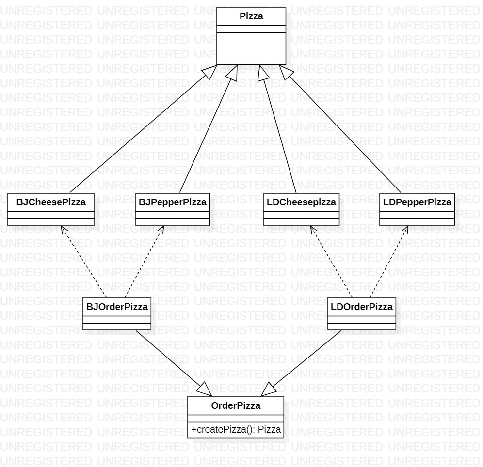

### 3. 抽象工厂模式

* 思想: 定义了一个interface用于创建相关或有依赖关系的__对象簇__,无需指明具体的类.
  * 是对简单工厂模式的改进
  * 抽象工厂分为两层: `AbsFactory`和`具体实现的工厂子类`
  * 工厂成为工厂簇,方便管理和拓展
* __个人理解__: 
  * 这个接口是所有工厂的__基石__,在创建简单工厂类时都要以抽象接口为模板
  * 和工厂方法不一样的是,派生的工厂可以任选产品族,但工厂方法只能选一族祖先产品

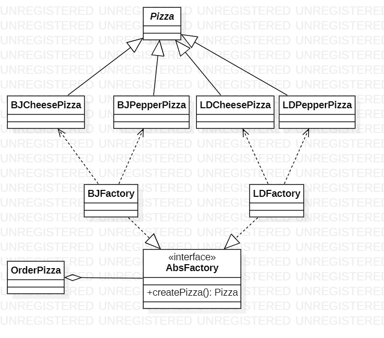

## 四. 原型模式

`prototype`

* 思想: 原型实例指定创建对象的种类,并通过拷贝这些原型创建新的对象
* 允许一个对象创建另一个可定制对象
* 原理: 通过将一个**原型对象传给那个要发动创建的对象,**这个要发动创建的对象请求**原型对象拷贝他们自己**来实施创建.即Object.clone()方法
* 缺点: 对于已经写好的类,违反了ocp原则(一定要实现接口)

### 1. clone浅拷贝

让需要拷贝的原型类实现**Cloneable接口**,然后用clone()就可以拷贝

```java
class Sheep implements Cloneable{
    @Override
    protected Object clone() throws CloneNotSupportedException {
        Sheep sheep = null;
        sheep = (Sheep)super.clone();
        return sheep;
    }
}
```

### 2. 深拷贝1: 重写clone

显然上面是浅拷贝,如果属性有对象,那就多个对象共享一个属性了

在clone调用引用的克隆,需要克隆的类实现Cloneable,并且不能出现死循环

### 3. 深拷贝: 序列化

自己写个方法,要求被拷贝类实现`Serializable`

```java
public Object deepClone(){
    ByteArrayOutputStream bos = null;
    ObjectOutputStream oos = null;
    ByteArrayInputStream bis = null;
    ObjectInputStream oos = null;
    
    try{
        //序列化
    	bos = new ByteArrayOutputStream();
    	oos = new  ObjectOutputStream (bos);
        oos.writeObject(this);
        
        //反序列化
    	bis =  new ByteArrayInputStream(bos.toByteArray()) ;
    	oos = new ObjectInputStream(bis);
        DeepPrototype dep = (DeepPrototype) ois.readObject();
        
        
    }catch(Exception e){
        
    }

}
```

## 五. 建造者模式

`Builder\生成器`

* 思想: 将复杂对象的**建造过程**抽象出来,不和产品本身耦合,这个抽象的建造过程的实现可以构造出不同的对象
* __四个角色__:
  * Product产品对象
  * Builder抽象建造者: 接口/抽象类
  * ConcreteBuilder具体建造者: 实现接口,构建和装配部件
  * Director指挥者: 构建一个使用Builder接口的对象; 隔绝了客户和对象的生产过程,控制负责产品对象的生产过程
  * 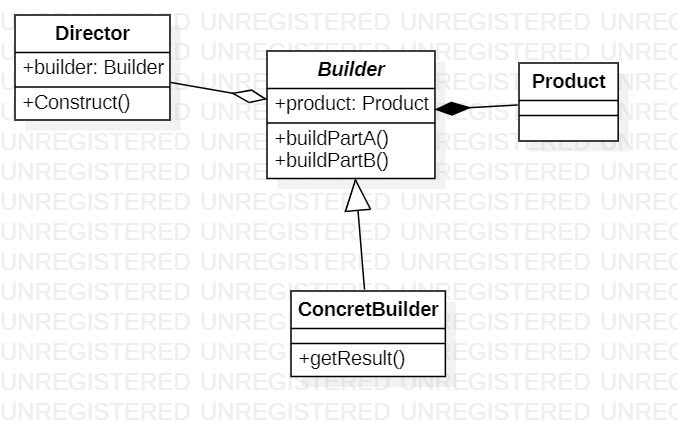


## 六. 适配器模式

`Adapter`

* 思想: 将某个类的接口转换成客户端期望的另一个接口表示,主要目的是兼容性.也可以叫包装器-__Wrapper__

* 用户调用适配器的接口方法,适配器再调用被适配方法,用户看不到里面,耦合度低

### 1. 类适配器

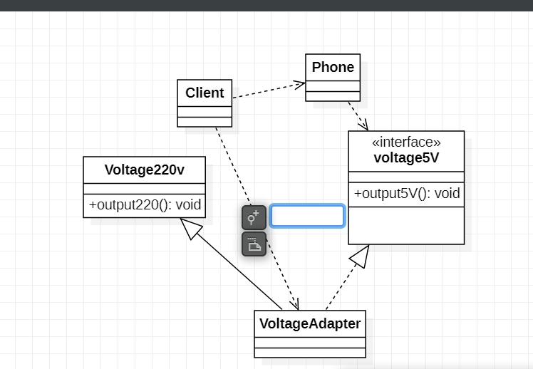

### 2. 对象适配器

继承并不符合语义,我们要把适配器的实现方式修改一下

* **Adapter**不再继承被适配类,而是**持有被适配的实例**'
* 只需实现适配类的接口,就能建立起适配转换
* 符合合成复用原则

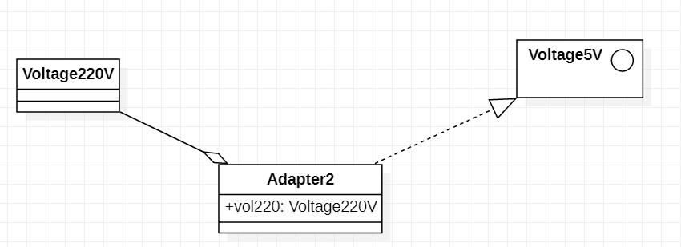

客户持有适配器和220V,把220V赋给适配器,调用接口方法就能获得5V类

### 3. 接口适配器

当不需要实现接口(src)全部方法时可以先实现个**抽象类(适配器)**实现部分方法(其他假装实现/空方法),然后用子类完善(dst)

## 七. 桥接模式

`Bridge`

防止太多相同的类蹦出导致类爆炸

* 思想: 将实现与抽象放在__不同层次中__,使得两个层次可以独立改变
* 结构型设计模式,基于类的最小设计原则.能保持各个部分的独立性以及他们的功能拓展

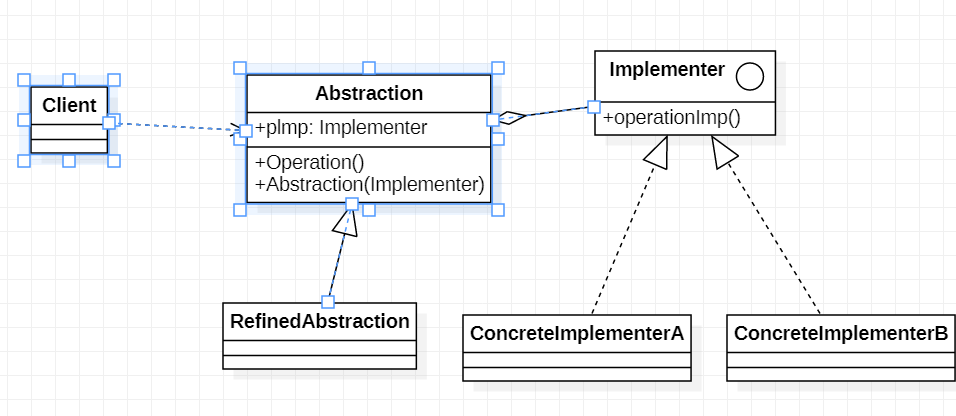

### 1. 类图说明

`Abstraction`: 桥接类,维护了Implementor,即实现类

`RefinedAbstraction`: 抽象类的子类

`Implementer`: 行为实现类的接口

`Concrete...`: 行为的具体实现类

左面是抽象,右面是具体,用聚合桥接在一起

### 2. 手机问题类图


品牌是一个实现,手机样式是一个抽象,分离,不会导致样式品牌相互牵制类爆炸

品牌在phone构造时实现,具体方法是子类通过调用phone,phone调用brand的实现方法来完成

```java
super.open();//FoldedPhone.open

Brand.open();//Phone.open
```

## 八. 装饰者模式

`Decorator`

问题: 

​	咖啡有很多种

​	调料有很多种

在点咖啡时,可以选择加(0/1/多)调料. 在咖啡类中应当提供一个能计算咖啡和调料总费用的方法

你把组合全都放出来就类__爆炸__了

### 1. 装饰者模式

* 思想: __动态的__将新功能附加到对象上. 它比继承更有弹性,体现了开闭原则

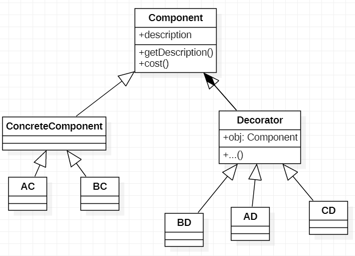<

Decorator拥有Component属性,解决一切烦恼.

### 2. 咖啡问题解决:

定义Drink类对应Component,Coffee对应ConcreteComponent,Decorator不变

我们继承Coffee获得种类,继承Decorator获得调味品

当我们希望向Coffee加牛奶时,就把它变成Milk的属性,我们给他命名为MCoff

再想加别的东西,就可以往别的调料的属性传自己.最后获得的就是多层套娃的coffee

然后用递归就可以把各个调料和咖啡的价格算出来

### 3. 装饰者模式在IO的应用

希望你没忘记,所谓__处理流(FilterInputStream子类)__,一定是包裹在__节点流(文件流)__外面的,这种包裹就是装饰者(套娃)模式.所以处理流也可以包着处理流.

## 九. 组合模式

`Composite`也叫部分整体模式

### 1. 概述

* 创建对象组的__树形结构__,把组合用树形表示"整体-部分"关系.
* 组合模式依据树形来组合独享,表示部分以及整体层次
* 其使得用户对单个对象和组合对象的访问具有一致性
  * 即: 组合能让客户以一致的方式处理单个和组合对象

解决的问题是__树形结构__关系

### 2. 构建:

创建一个接口/抽象类`Component`,**它是所有节点的实现接口/抽象类**,规定了一些共有的操作

然后定义叶子`Leaf`

和`Composite`非叶子节点,实现了子部件相关(管理)操作,可以管理自己的子节点

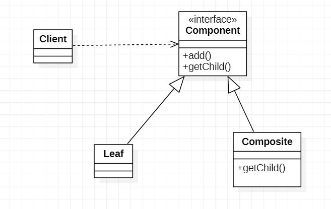

### 3. 实例: 校-院-系 表

我们要用Java实现一个校-院-系 体系

#### 3.1 uml

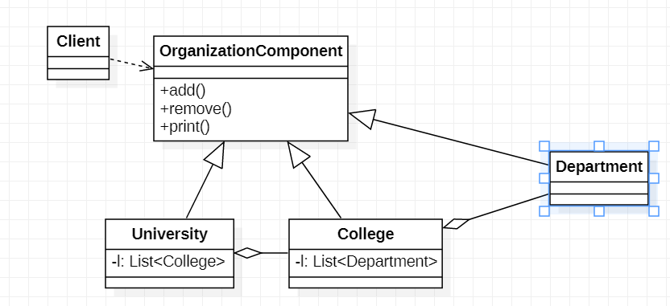

## 十. 外观模式

`Fecade`,也叫过程模式

### 1.引例:

你看我们家庭影院有好多设备,每个设备有一个遥控器,拿了一堆遥控器,手里感觉很烦.

### 2. 思想

我们需要一个高层接口,__聚合__子系统接口,给子系统中的一组接口提供一个__一致的界面__,用来访问子系统中的一群接口.

也就是说定义一个一致的接口,用以屏蔽内部子系统的细节,使调用段之和这个接口发生调用,无需探明内部细节,就是__外观模式__

### 3. 思想UML

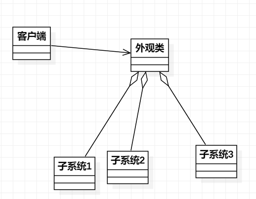

**外观类: facade为**调用端提供统一的调用接口. 知道哪些子系统负责处理请求,从而将调用端的请求代理给适当的子系统对象

Client: 外观接口的调用者

子系统集合: 指模块或者子系统,处理Facade对象指派的任务

### 4. 用例UML

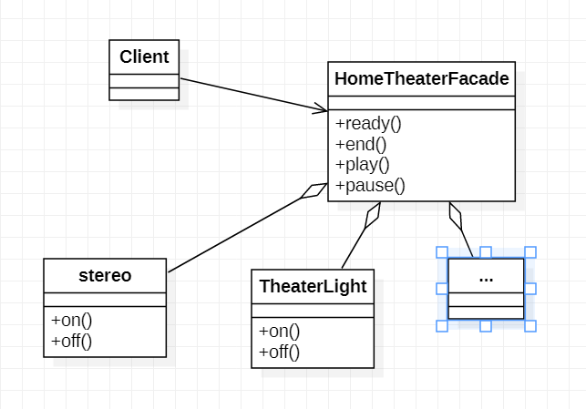

就是用户发出简单指令,由facade完成开开关关各种任务

# 设计模式(中)

## 十一. 享元模式

`Flyweight`蝇亮模式

### 1. 引例:

小型外包项目,给客户A做一个产品展示网站,别的客户也想要这样的网站:

​	有客户要求以新闻形式发布

​	有客户要求以博客形式发布

​	有客户希望以公众号形式发布

### 2. 思路:

不一定需要都搞一个网站,整合到一个网站之中,共享其相关的数据和代码,减少服务器资源

* 享元模式
  * 运用共享技术邮箱的支持大量细粒度对象
  * 比如<u>数据库连接池,String常量池</u>
  * 能解决__重复对象的内存浪费问题__,系统中有大量相似对象可以从缓冲池里拿,提高效率

### 3. 思路UML

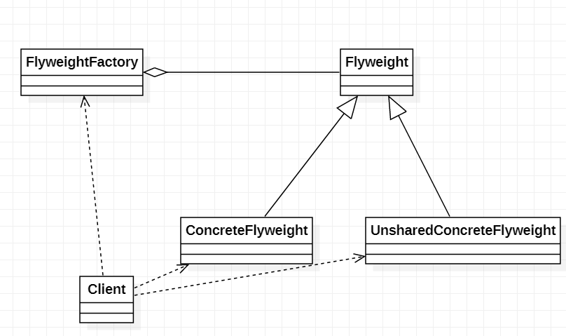

* Flyweight是抽象享元角色,它是产品的抽象类,同时<u>定义出对象的外部状态和内部状态</u> 的接口或实现
* ConcreteFlyweight是具体的享元角色,是具体产品类,实现抽象角色定义的相关业务
* UnsharedConcreteFlyweight不可共享,一般不会出现在享元工厂中
* FlyweightFactory享元工厂,用于构造一个池容器(集合),同时提供从池中获取对象的方法

> **外部状态**: 值对象得以依赖的一个标记,<u>随环境而改变,</u><u>不可共享</u>
>
> **内部状态**: 指对象共享出来的信息,存储在享元对象内部且<u>不会随环境的改变而改变</u>

## 十二. 代理模式

`Proxy`

### 1. 思想

* 代理模式: 为对象提供一个__替身__,控制对这个对象的访问. 即通过代理对象访问目标对象:
* 好处: 可以在目标对象实现的基础上增强额外的功能操作,扩展目标对象的功能
* 被代理的可以是: 远程对象,创建开销大的对象,或者是需要安全控制的对象
* 分类: __静态代理,动态代理(JDK代理,接口代理),Cglib代理(可以在内存中动态的创建对象,不需要实现接口,属于动态代理)__

### 2. 思想类图

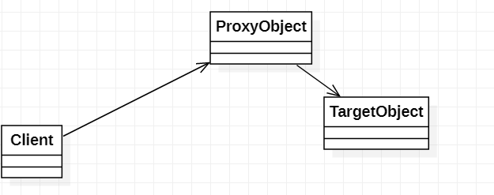

### 3. 静态代理

静态代理在使用时需要定义接口或者父类, 目标对象与代理对象一起实现相同的接口或者是继承相同的父类

* 代理对象与目标对象要实现__相同的接口__,然后通过调用和目标对象相同的对象来调用目标对象额方法

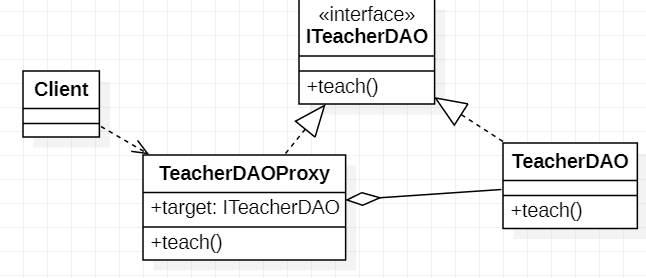

* 优点: 不需要修改目标对象,可以拓展
* 缺点; 需要和目标对象实现一样的接口,会有很多代理类一旦接口增加方法,代理和目标都得维护

### 4. 动态代理

1. 代理对象不需要实现接口,目标对象依然需要实现接口
2. 代理对象的生成利用到了JDK的API反射机制,动态的在内存中构建代理对象
3. 也可以叫JDK代理,接口代理

* 核心方法: `java.lang.reflect.Proxy newProxyInstance(参数)`
  * 传入的对象就是目标对象
  * 利用反射机制返回一个代理对象
  * 通过代理对象调用目标方法
  * 
  * 参数有三个,下面细说

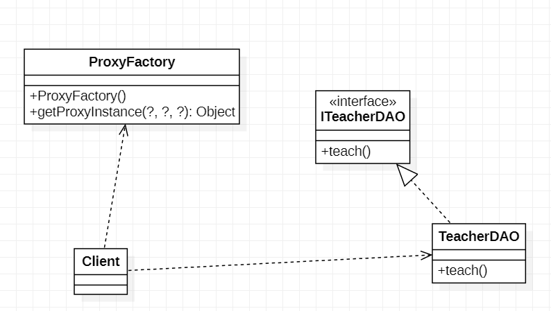

* ProxyFactory详解:
  * 它有一个属性target存目标对象
  * 它的构造器传入目标对象
  * 它的getProxyInstance没有参数,调用Proxy.newProxyInstance(?,?,?)返回代理对象

* newProxyInstance()详解:

  ```java
  public static Object newProxyInstance(ClassLoader loader,
                                            Class<?>[] interfaces,
                                            InvocationHandler h)
      //loader: 目标对象的类的类加载器
      //interfaces: 目标对象实现的接口类型,使用泛型方法确认类型
      //h: 是事件处理,执行目标对象的方法时触发事件处理器的方法; 会把当前执行的目标对象方法作为参数传入
  ```

  

* InvocationHandler:

  ```java
  new InvocationHandler() {
      @Override
      public Object invoke(Object proxy, Method method, Object[] args) throws Throwable {
          //第一个参数: 对象; 第二个参数: 执行的方法; 第三个参数: 方法的参数;
          //一般这么写:
          System.out.println("start!");
          Object res = method.invoke(proxy,args);//调用方法
          System.out.println("end");
          return res;
      }
  }
  ```

  

* 完整的获取代理对象的方法展示:

  ```java
     public Object getProxyInstance(){
          return Proxy.newProxyInstance(target.getClass().getClassLoader(),
                  target.getClass().getInterfaces(),
                  new InvocationHandler() {
                      @Override
                      public Object invoke(Object proxy, Method method, Object[] args) throws Throwable {
                          System.out.println("start!");
                          Object res = method.invoke(target,args);//注意这里要放target而不是代理对象
                          System.out.println("end");
                      }
                  }
          );
      }
  ```

  

### 5. cglib代理

静态代理和JDK代理都要求目标对象实现一个接口,但是有时候目标对象啥都没实现,这个时候可以使用**目标对象的子类**来完成代理,称为cglib代理.

它也可以归属到动态代理,因为是在内存中构建子类对象来实现目标对象工嗯呢该

cglib是一个高性能__代码生成包,__它可以在运行期拓展java类与实现java接口,它广泛的被使用在AOP框架中.

底层通过字节码处理框架ASM来转换字节码生成新的类.

注意: 目标对象的类不能final,代理的方法不能static或final

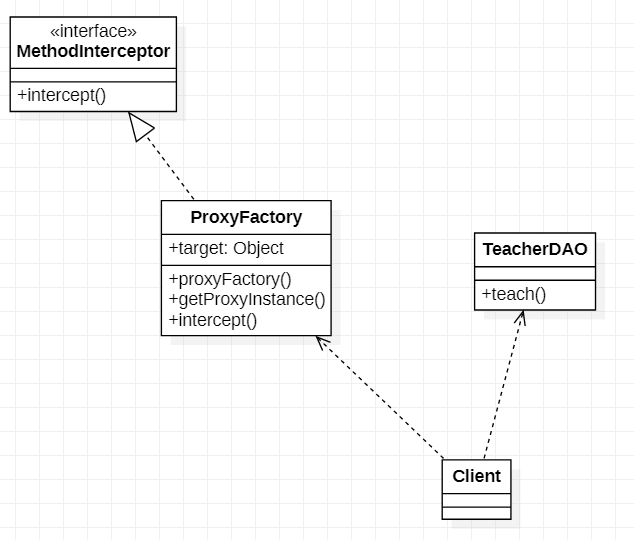

* 说明:

  * 重写Intercept(拦截)方法来调用目标对象的方法
  * 最上面的接口在jar包里

* 重写的方法:

  * 获取的代理对象调用方法时会触发intercept

  ```java
  @Override
  public Object intercept(Object arg0,Method arg1,Object[] arg2,MethodProxy arg3){
      //arg0: 代理对象
      //arg1: 方法
      //arg2: 方法的参数
      //arg3: 好像不用管
      arg1.invoke(target,arg2);
      
  }
  ```

* getProxyInstance具体内容

  ```java
  //创建工具类 + 设置父类 + 设置回调函数 + 创建子类对象(代理对象)
  public Object getProxyInstance(){
  	//创建工具类
      Enhancer enhancer = new Enhancer();
      //设置父类
      enhancer.setSuperClass(target.getClass());//目标对象的类
      //设置回调函数
      enhancer.setCallback(this);//调用它自己
      //返回子类对象
      return enhancer.create();
  }
  ```

  

### 6. 几种变体

防火墙代理: 内网通过代理穿过防火墙访问外网

缓存代理: 当请求图片时先到缓存代理取,如果没有就到公网或者数据库

远程代理: 远程对象的本地代表,可以把远程对象当本地用,

同步代理: 主要多线程,多线程同步


## 十三. 模板方法模式

`Template Method`

### 1. 思想

一个抽象类公开定义了执行它的方法模板

它的子类可以按照方法重写实现,但调用会以抽象类中定义的方石之幸

属于行为型模式

就是父类定下模板,子类跟着做,就是具体实现的区别.

### 2. 钩子方法

在这个抽象类里将你要用的那个方法设置为abstract,其它方法进行空实现，然后你再继承这个抽象类，就不需要实现其它不用的方法，这就是钩子方法的作用。

```java
public abstract class AbstractClass {

	public abstract boolean isOpen();

	public final void operating() {
		if(isOpen()) { //一旦实现就进入这里
			System.out.println("钩子方法开启");
		}else {
			System.out.println("钩子方法关闭");
		}
	}
}
```

## 十四. 命令模式

`command`

### 1. 引例

我们有好多家电,我们不想针对每个家电都装一个APP,我想一个控制所有

每个家电厂家都要提供一个统一的接口给app调用

命令模式将动作请求者(app)和动作执行者解耦出来

### 2. 思想

在软件设计中我们经常需要向用户发一些请求,但是不知道请求的接受者是谁,也不知道被操作的是那个.

我们只需要在程序运行时指定具体的接受者即可,可以用命令模式设计


在命令模式中会将一个请求封装为一个对象,以便不同<u>参数</u>表示不同请求,同时命令也支持<u>可撤销</u>的操作

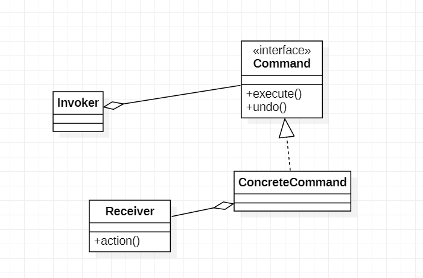

Command有Receiver属性,真正的内容在Command的方法中由Receiver执行

Invoker拥有Command属性,

不同命令有不同接收者,在命令创建时就被确定

## 十五. 访问者模式

`visitor`

### 1. 引例

将观众分为男和女,对一个歌手评价

### 2. 访问者思想

访问者模式封装了一些作用于某种数据结构的各元素的操作,它可以在不改变数据结构的前提下定义作用于这些元素的新操作

主要将数据结构和操作耦合的问题

基本工作原理: 在被访问的类里面加一个对外提供接待访问者的接口

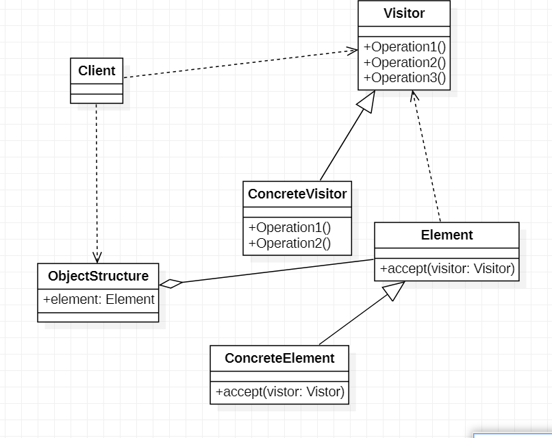

visitor: 抽象访问者,为ConcreteElement声明一个访问者

ConcreteVisitor: 实现由每个visitor声明一个操作,是Element本应该有的操作

ObjectStructure: 提供一个高层的接口,用来允许访问者访问它的元素

Element: 不建议拓展的部分

### 3. 歌手问题的解决

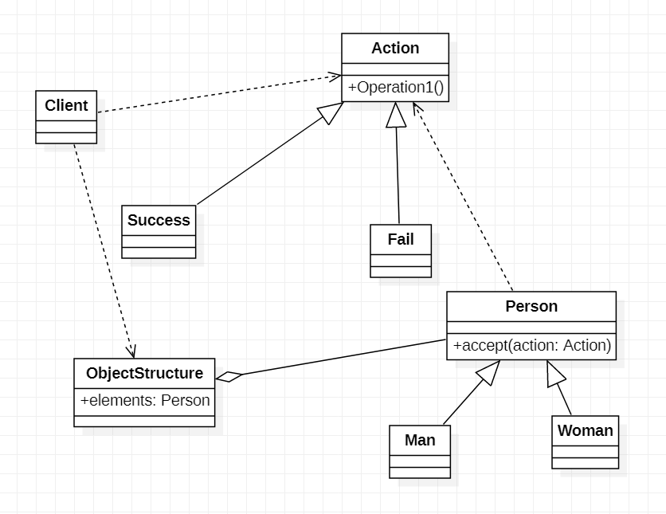

Action的子类可以拓展,里面有一个使用Man和Woman的方法(getManPoint,getWomanPoint),耦合度高,违背迪米特法则

### 4. 

如果一个系统有稳定的数据结构,又要经常修改需求,可以用这个模式

## 十六. 迭代器模式

`iterator`

### 1. 统一遍历

一个体系中有数组有集合,如何才能做到统一遍历?

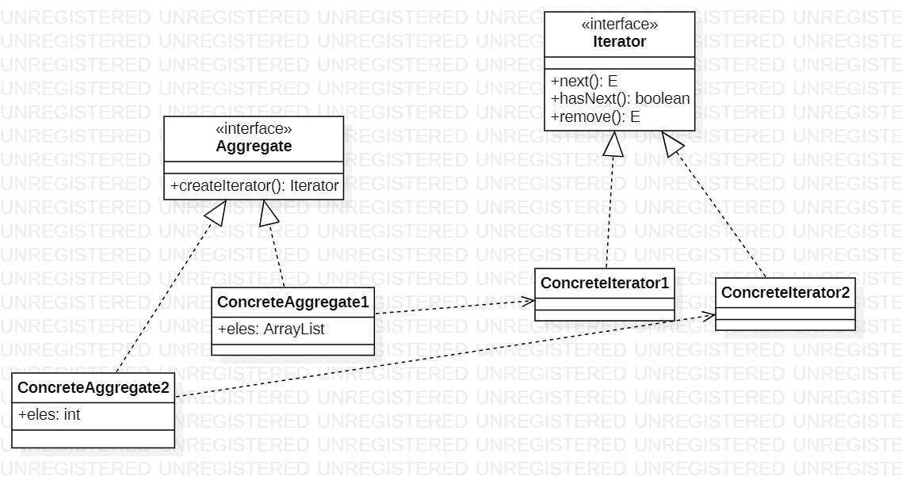

迭代器握有要遍历的内容,它是从聚合类中获得的

## 十七. 观察者模式

`Observer`

### 1. 引例

气象站每天测量到的信息以公告方式传出去,需要一个开放型API以便第三方获取

数量一旦更新,需要实时通知第三方

### 2. 思想

观察者模式类似于订牛奶业务

奶站: Subject,能登记移除,和通知(notify)Observer

用户: Observer

观察者模式适用于__多对一__对象依赖的设计方案,被依赖对象为Subject(一),依赖对象为Observer(多)

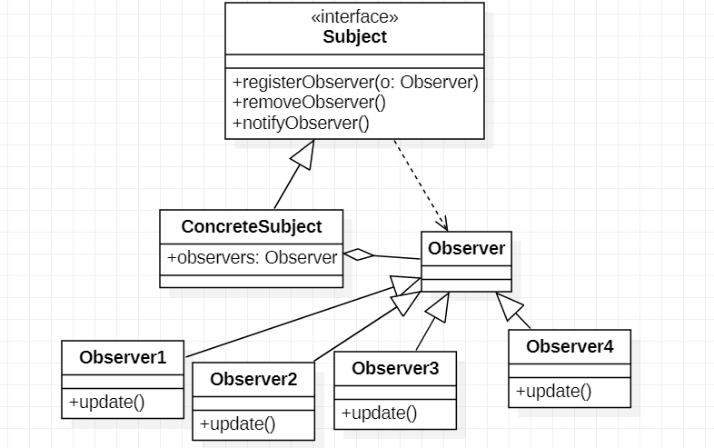

## 十八. 中介者模式

`Mediator`

### 1.引例:

你看我们家庭影院有好多设备,但是流程固定,如何安排?

### 2. 中介者模式

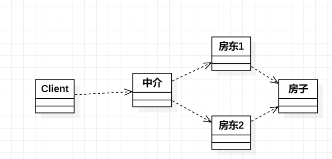

中介者模式用一个中介对象来封装一系列的对象交互,使各个对象不需要显式的互相引用,来解耦,独立的改变他们之间的交互.

MVC中,view和model,view之间的交互由中介controller完成

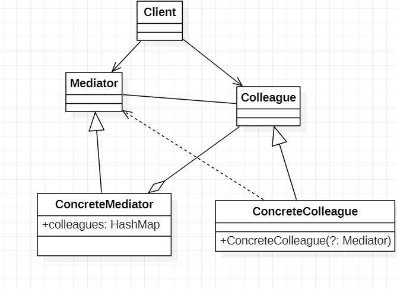

同事之间相互独立,同事和中介相互依赖

__在创建同事对象的时候,构造器直接把对象塞进中介__

然后当需要发送信息的时候,就调用中介的方法,让中介协调

## 十九. 备忘录模式

`memento`

### 1. 引例

就是你要改变状态,但之后又要回到之前的状态,怎么弄?

### 2. 思想

在不破坏封装性的前提下捕获一个对象的内部状态并在该对象之外保存这个状态,便于恢复

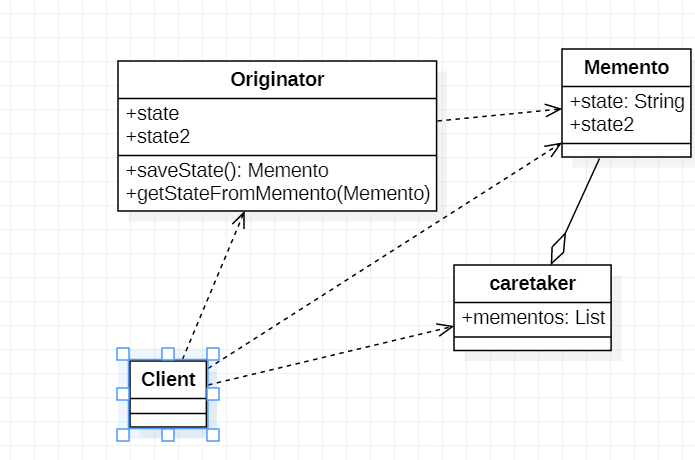**

## 二十. 解释器模式

`interpreter`

### 1. 引例

用解释器模式来实现四则运算.

> 先输入表达式的形式,比如a+b+c-d+e
>
> 再输入abcde的值
>
> 输出结果

### 2. 思想

在编译原理中,一个算术表达式通过__词法分析器__形成词法单元,而后这些此法单元通过语法分析器构建语法树,最终形成一颗抽象的语法分析树. 这里的两种分析器都可以看做解释器

`解释器模式`: 给定一个语言(表达式),定义它的文法的一种表示,并定义一个解释器,使用该解释器来解释语言中的句子

### 3. 类图

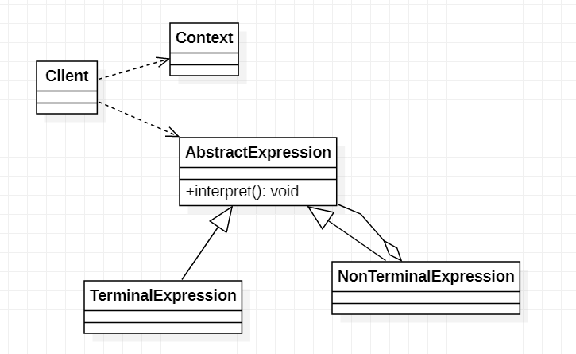

Context: 环境角色,有解释器之外的全局信息

AbstractExpression: 抽象表达式,声明一个抽象的解释操作,这个方法为抽象语法中所有节点共享

TerminalExpression: 终结符表达式,实现与文法中的终结符相关的解释操作

NonTerminalExpression: 非终结表达式,为文法中的非终结符实现解释操作

通过Client向Context和TerminalExpression输入信息

### 3. 引例类图

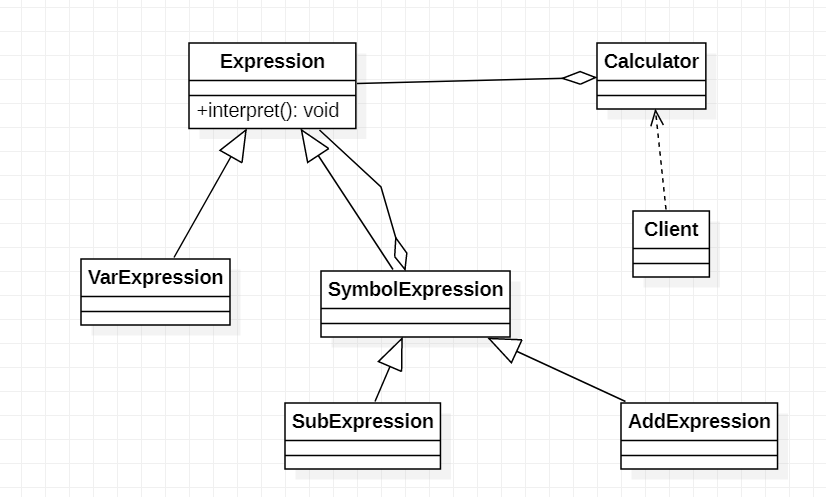

引例会用到Stack

> interpret(HashMap<String,Integer\>) : 一个方法,传入变量名和数值的对应关系,让实现类自由发挥
>
> VarExpression: 一个对象对应一个变量,存有变量名属性,通过interpret方法获得相应值
>
> SymbolExpression: 抽象运算符号解析器,运算符都只和自己的左右数字有关系:
>
> * 左右也可能是解析结果,反正是Expression就对了
> * 存储左右Expression作为属性
> * 其本身抽象,不实现interpret
>
> SymbolExpression的子类,比如AddExpression:
>
> * interpret(HashMap): 调用left的interpret,调用right的interpret 相加;
>   * 蓦然间就完成了递归调用

## 二十一. 状态模式

`state`

### 1. 引例

通过各种事件来完成对各种状态的转换,如何进行?

### 2. 状态模式

主要用来解决对象在多种状态转换时需要对外输出不同行为的问题.

状态和行为是一一对应的.

一个对象内在状态改变时,可以改变其行为

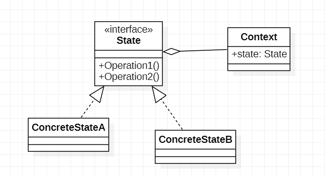

## 二十二. 策略模式

`strategy`

### 1. 问题

如果子类重写了不需要实现的父类方法,那是不正确的.

如果对父类局部改动,子类就莫名其妙需要改动,这是__溢出效应__

### 2. 思想

策略模式定义算法组,分别封装起来,让他们之间可以互相替换,此模式让算法的变化独立于使用算法的用户

体现了设计原则:

* 把变化的代码从不变的代码中分离
* 针对接口编程而不是类
* 少用继承,多组合和聚合

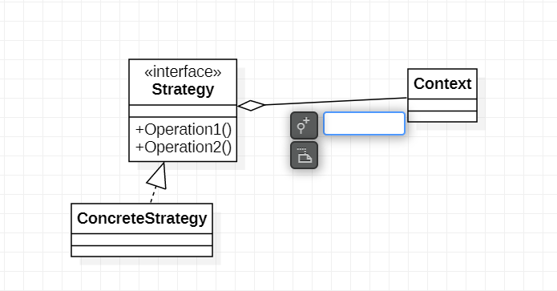

用构造器指定策略