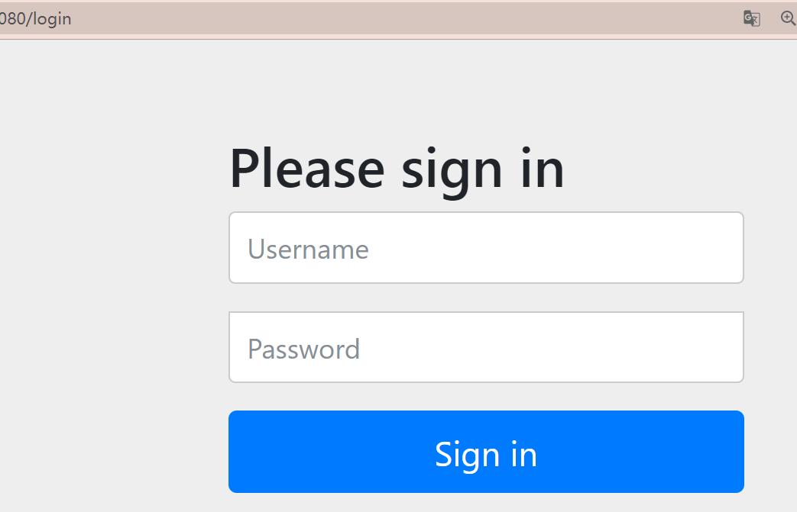

# Spring Security

## 一. 介绍

Spring Security基于Spring,提供了一套Web应用安全性完整解决方案

__认证__: 通俗认为用户能否登陆

__授权__: 判断用户有无权限

## 二. 整合springboot-helloworld

### 1. 

场景启动器

```java
<dependency>
    <groupId>org.springframework.boot</groupId>
    <artifactId>spring-boot-starter-security</artifactId>
</dependency>
    
```

导入之后就直接生效了

### 2. 生效:

我们不需要动其他的,只需要访问一个controller的url,进去就发现认证已经生效了

其中,用户名默认user,密码生成在控制台上




```
021-06-19 16:33:51.079  INFO 12228 --- [           main] o.s.s.web.DefaultSecurityFilterChain     : Creating filter chain: any request, [org.springframework.security.web.context.request.async.WebAsyncManagerIntegrationFilter@60e9c3a5, org.springframework.security.web.context.SecurityContextPersistenceFilter@788ddc1f, org.springframework.security.web.header.HeaderWriterFilter@64d4f7c7, org.springframework.security.web.csrf.CsrfFilter@52f57666, org.springframework.security.web.authentication.logout.LogoutFilter@7c8c70d6, org.springframework.security.web.authentication.UsernamePasswordAuthenticationFilter@7fb66650, org.springframework.security.web.authentication.ui.DefaultLoginPageGeneratingFilter@6812fa3a, org.springframework.security.web.authentication.ui.DefaultLogoutPageGeneratingFilter@7e5843db, org.springframework.security.web.authentication.www.BasicAuthenticationFilter@26d41711, org.springframework.security.web.savedrequest.RequestCacheAwareFilter@254f906e, org.springframework.security.web.servletapi.SecurityContextHolderAwareRequestFilter@2a4f5433, org.springframework.security.web.authentication.AnonymousAuthenticationFilter@459f703f, org.springframework.security.web.session.SessionManagementFilter@17f3eefb, org.springframework.security.web.access.ExceptionTranslationFilter@268cbb86, org.springframework.security.web.access.intercept.FilterSecurityInterceptor@55d58825]
```

## 三. 过滤器原理

如上面所输出的,spring security默认注册了一条过滤器链

该过滤器即`servlet容器的Filter`

### 1.  FilterSecurityInterceptor

```java
public class FilterSecurityInterceptor extends AbstractSecurityInterceptor implements Filter {
//...
    public void doFilter(ServletRequest request, ServletResponse response,
			FilterChain chain) throws IOException, ServletException {
		FilterInvocation fi = new FilterInvocation(request, response, chain);
		invoke(fi);
	}
//...
}
```

```java
public void invoke(FilterInvocation fi) throws IOException, ServletException {
   if ((fi.getRequest() != null)
     // 这里是判断是不是执行过了,即once-per-request
   }
   else {
      // first time this request being called, so perform security checking
      if (fi.getRequest() != null && observeOncePerRequest) {
         fi.getRequest().setAttribute(FILTER_APPLIED, Boolean.TRUE);
      }

       //这里是重点
      InterceptorStatusToken token = super.beforeInvocation(fi);

      try {
         fi.getChain().doFilter(fi.getRequest(), fi.getResponse());
      }
      finally {
         super.finallyInvocation(token);
      }

      super.afterInvocation(token, null);
   }
}
```

### 2. UsernamePasswordAuthenticationFilter

就是登录

### 3. 加载流程

Spring Boot对Spring security提供了自动化配置

1. DelegatingFilterProxy: 老朋友,在shiro即使用过,代理过滤器链

   * 注册为**servlet容器**的filter

   * init时在**容器**中获取Filter并配置进代理链

## 四. 核心组件: Realm和Encoder

### 1. UserDetailsService

这类似于Realm,自然是我们Security的核心;

```java
public interface UserDetailsService {
   UserDetails loadUserByUsername(String username) throws UsernameNotFoundException;
}
```

```java
//UserDetails,一般我们会使用User实现类
public interface UserDetails extends Serializable {
   Collection<? extends GrantedAuthority> getAuthorities();
   String getPassword();
   String getUsername();
   boolean isAccountNonExpired();
   boolean isAccountNonLocked();
   boolean isCredentialsNonExpired();
   boolean isEnabled();
}
```

### 2. PasswordEncoder

```java
public interface PasswordEncoder {
   String encode(CharSequence rawPassword);
   boolean matches(CharSequence rawPassword, String encodedPassword);
   default boolean upgradeEncoding(String encodedPassword) {
      return false;
   }
}
```

## 五. 认证

基于springboot+springsecurity

### 1. 内置数据来源

1. 配置文件,即application.yml/properties
2. 配置类
3. 自定义实现类UserDetailsService

<u>配置文件:</u>

此处密码没有加密

```properties
spring.security.user.name=user
spring.security.user.password=123456
```

<u>配置类</u>:

让配置类继承`WebSecurityConfigurerAdapter`

然后覆盖一个方法

```java
@Configuration
public class SecurityConfig extends WebSecurityConfigurerAdapter {
    @Override
    protected void configure(AuthenticationManagerBuilder auth) throws Exception {
        super.configure(auth);
    }
}
```

使用auth向内存添加认证/权限信息

```java
    @Override
    protected void configure(AuthenticationManagerBuilder auth) throws Exception {
        BCryptPasswordEncoder b = new BCryptPasswordEncoder();
        String encode = b.encode("123123");
  		auth.inMemoryAuthentication()
        	.passwordEncoder(b)
            .withUser("user2")
            .password(encode)
            .roles("nana");
    }
```

### 1.1 自定义编写实现类

步骤:

1. 配置类,注入UserDetailsService实现类
2. 编写实现类,返回User对象,其包含用户名密码权限等信息

具体:

1. 编写配置类.依然继承`WebSecurityConfigurerAdapter`,并配置进auth(auth.userDetailsService)

```java
@Autowired
private UserDetailsService userDetailsService;

@Override
protected void configure(AuthenticationManagerBuilder auth) throws Exception {
    auth.userDetailsService(userDetailsService).passwordEncoder(password());
}
```

2. 实现类,可以添加数据库查询

```java
@Service
public class MyUserDetailsService implements UserDetailsService {
    @Override
    public UserDetails loadUserByUsername(String username) throws UsernameNotFoundException {
        List<GrantedAuthority> auths = AuthorityUtils.createAuthorityList("rule");
        return new User("xiaoming",new BCryptPasswordEncoder().encode("123123"),auths);
    }
}
```

### 2. 认证的其他行为配置

依然在实现`WebSecurityConfigurerAdapter`的配置类中,使用configure(HttpSecurity),该参数可以设置并且可以链式调用

```java
@Override
protected void configure(HttpSecurity http) throws Exception {
    http.formLogin().loginPage("").loginProcessingUrl("").defaultSuccessUrl("").permitAll().and().authorizeRequests()
}
```

## 六. 权限

### 1. 基于权限的访问

`hasAuthority`,`hasAnyAuthority`

```java
http.formLogin().loginPage("").loginProcessingUrl("").defaultSuccessUrl("").permitAll()
        .and().authorizeRequests().
        antMatchers("/","/a").permitAll()
        .antMatchers("/b").hasAuthority("admin");
```

### 2. 基于角色

`hasRole`,`hasAnyRole`

在权限列表中,以`ROLE_`开头的即为角色,在验证时不需要添加这个前缀

### 3. 注解权限

总注解: `@EnableGlobalMethodSecurity(securedEnabled=true)`

`@Secured`: value为String数组,指定需要角色/权限访问方法

`@PreAuthorize`: 进入方法前的权限验证,可以使登录用户的roles/permissions传入方法

```java
@PreAuthorize("hasAnyAuthority('menu:system')")
```

`@PostAuthorize`: 在方法执行之后

`@PreFilter`:

`@PostFilter`: