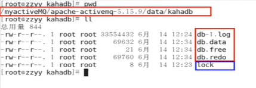

# ActiveMQ

[TOC]

## 一. MQ的意义

### 1. 宏观上

1. 解决耦合 **解耦**
2. 异步模型 **异步**
3. **削峰** 抵御洪峰流量,达到保护主服务的目的

### 2. 技术背景

__微服务__的生产者调用消费者,链式模块调用; RPC的交互变得复杂而耦合

同时面对大流量并发时,容易被冲垮

## 二. helloworld

### 1. 安装和使用

从官网`activemq.apache.org`可以下载到压缩包

然后解压运行`./activemq start`最普通的启动,`activemq stop关闭`

默认端口是`61616`

### 2. 控制台cli

跟rabbitmq的15672类似,端口为`8161`,访问路径为`/admin`

用户名密码都是admin 默认

## 三. Active javaAPI

### 1. 大致理念

* 核心依赖

  ```xml
  <dependency>
      <groupId>org.apache.activemq</groupId>
      <artifactId>activemq-all</artifactId>
      <version>5.15.9</version>
  </dependency>
  <dependency>
      <groupId>org.apache.xbean</groupId>
      <artifactId>xbean-spring</artifactId>
      <version>3.16</version>
  </dependency>
  ```

* __JMS总体架构__:

  

* __Destination__称为目的地,分为Queue和Topic两种
  * Queue: 点对点
  * Topic: 发布订阅pubsub

### 2. 连接

1. <u>创建连接工厂</u>

   ```java
   ActiveMQConnectionFactory activeMQConnectionFactory = new ActiveMQConnectionFactory(...);
   //参数: 
   // 1. username 可选,和password同时可选
   // 2. password
   // 1. String/URI brokerURL 代理,即broker的资源定位符 
   ```

> 空参构造器: 传入一个默认URL
>
> ```url
> failover://tcp://localhost:61616
> ```
>
> URL注意点:
>
> 1. 采用tcp协议而不是http

举例: 

```java
public static final String ACTIVE_URL = "tcp://192.168.92.128:61616";
public static void main(String[] args) {
    ActiveMQConnectionFactory activeMQConnectionFactory = new ActiveMQConnectionFactory(ACTIVE_URL);
}
```

2. <u>获取连接并start</u>

```java
Connection connection = activeMQConnectionFactory.createConnection();
connection.start();
```

> 这个Connection没有实现AutoCloseable,但是需要关闭

3. <u>创建session</u>

```java
Session session = connection.createSession(false, Session.AUTO_ACKNOWLEDGE);
//参数为 事务 签收,后面讲
```

4. 操作

5. 关闭

   ```java
   producer.close();//生产者消费者也要关
   session.close();
   connection.close();
   ```
```
   
   

### 4. session操作: 生产

**创建队列/Topic**: 

​```java
Queue queue = session.createQueue("sealll.news");
Topic topicing = session.createTopic("topicing");
```

这两个都是`Destination`的子接口


__创建生产者__:

```java
MessageProducer producer = session.createProducer(queue);
//传入Destination,告知消息生产后放在哪
```

__创建(文本)消息__:

```java
TextMessage textMessage = session.createTextMessage("msg" + i);
```

__生产者发布消息__:

```java
producer.send(textMessage);
```

__完整:__

```java
public static final String ACTIVE_URL = "tcp://192.168......:61616";
public static void main(String[] args) throws JMSException {
    //创建Connection工厂
    ActiveMQConnectionFactory activeMQConnectionFactory = new ActiveMQConnectionFactory(ACTIVE_URL);
    
    //创建并开启连接
    Connection connection = activeMQConnectionFactory.createConnection();
    connection.start();

    //创建会话
    Session session = connection.createSession(false, Session.AUTO_ACKNOWLEDGE);
    //创建Destination
    Queue queue = session.createQueue("sealll.news");
    Topic topicing = session.createTopic("topicing");

    //创建生产者
    MessageProducer producer = session.createProducer(queue);

    for (int i = 0; i <= 3; i++) {
        //创建消息并发送
        TextMessage textMessage = session.createTextMessage("msg" + i);
        producer.send(textMessage);
    }
    //关闭连接,不关闭他就不停了
    connection.close();
    session.close();
}
```

### 3. session操作: 消费

__创建Destination__:(指定接收什么目的地的消息)

```java
Queue queue = session.createQueue("sealll.news");
Topic topicing = session.createTopic("topicing");
```

__创建消费者__:

```java
//获取对应Destination的消费者
MessageConsumer consumer = session.createConsumer(queue);
```

__监听接收消息__

```java
//这个不是轮询结构,而是一次循环接收一个消息
while(true){
    //没有收到receive时会阻塞
    TextMessage receive = (TextMessage)consumer.receive();
    //receive空参: 一直运行
    //参数long timeout: 等待时间有限,到时间返null
}
```

__完整__:

```java
public static void main(String[] args) throws JMSException {
   //获取连接省略...
    Queue queue = session.createQueue("sealll.news");
    Topic topicing = session.createTopic("topicing");

    consumer = session.createConsumer(queue);
            while (true) {
                System.out.println("start receiving");
                TextMessage receive = (TextMessage) consumer.receive(3000);
                if (receive != null) {

                    System.out.println(receive.getText());
                }
            }
}
```

### 5. 消费者监听消息

`receive`方法显然可以用异步来优化

* `MessageListener接口`

  ```java
  public interface MessageListener {
      void onMessage(Message message);
  }
  ```

* 消费者设置监听器

  ```java
  void setMessageListener(MessageListener listener) throws JMSException;
  ```

```java
//设置监听器
consumer.setMessageListener(new MessageListener() {
    @Override
    public void onMessage(Message message) {
        //收到就处理消息
        if( null != message && message instanceof TextMessage){
            TextMessage message1 = (TextMessage) message;
            try {
                System.out.println(message1.getText());
            } catch (JMSException e) {
                e.printStackTrace();
            }
        }
    }
});
```

> 注意: 异步的,主线程会立刻继续,别直接把session,connection之类的关了

## 附. 消息分配

消息队列的分配带有一种负载均衡的感觉**,消费者轮流分配**

## 四. Topic

### 1.  要点

* 先订阅后发布,即消费者比发布者先启动才能收到消息,
* Topic不保存消息,无状态
* JMS允许持久订阅

### 2. 编程

将上面的Queue换成Topic即可

## 五. JMS

JMS即**java消息服务**,指的是两个应用程序之间异步通信的API.

### 1. JMS四大元素

* **JMS provider**: 对JMS规范的实现产品,JMS服务器
* __JMS Producer__: 消息生产者
* __JMS Consumer__: 消息消费者
* __JMS Message: __ 消息

### 2. 消息

消息由__消息头__ __消息体__ __消息属性__构成

#### 2.1 消息头

消息头包含了一些消息的描述信息,可以调用生产者的setter进行设置,也可以作为send方法的参数

* `JMSDestination`: 就是Destination,发到哪里
* `JMSDeliveryMode`: 持久模式/非持久模式,传入DeliveryMode的枚举对象
  * 持久: 传送仅一次,意味着JMS提供者出现故障,消息也应该被持久化,等到下一次服务器恢复
  * 非持久: 服务器故障,该消息消失
* `JMSExpiration`: 消息过期时间
  * 仅在send中通过timeToLive属性指定
  * 设置为0就不过期
* `JMSPriority`: 默认4,数字越高越紧急
  * 0-4为普通消息,5-9是加急消息,加急消息要比普通消息先到达
* `JMSMessageID`: 唯一标识消息

#### 2.2 五种消息体

* `TextMessage`: 包含一个String
* `MapMessage`: 包含一个Map
* `BytesMessage`: 包含字节数组
* `StreamMessage`: 包含流
* `ObjectMessage`: 包含可序列化Java对象

#### 2.3 消息属性

如果需要除了消息头字段以外的值,可以用消息属性

`属性名(String)-属性值(任意基本类型)`

使用`message.setxxx(类型)Property`

## 六.  可靠性

考虑Provider宕机的行为

### 1. 队列持久化设置

```java
messageProducer.setDeliveryMode(DeliveryMode.NON_PERSISTENT);//非持久,宕机重启后消息丢失

messageProducer.setDeliveryMode(DeliveryMode.PERSISTENT);//持久,默认
```


### 2. (重要)持久化Topic

显然这种consumer先启动,producer后启动的方式不够持久化

我们需要引入__发布订阅机制__

#### 2.1 生产者/消费者代码修改

* 生产者方面:

  * connection.start放在producer创建和设置之后

  * producer设置为DeliveryMode.PERSISTENT(持久化)

    ```java
    Connection connection =
            factory.createConnection();
    Session session = connection.createSession(false, Session.AUTO_ACKNOWLEDGE);
    Topic topic1 = session.createTopic("topic1");
    MessageProducer producer = session.createProducer(topic1);
    producer.setDeliveryMode(DeliveryMode.PERSISTENT);
    //放在这
    connection.start();
    ```

* 消费者方面

  * 设置客户端Id(即设置订阅者的标识)

    ```java
    Connection connection =
            factory.createConnection();
    connection.setClientID("z3");
    ```

  * 创建Topic以后,创建持久化的`TopicSubscriber`,替代consumer

    ```java
    Topic topic1 = session.createTopic("topic1");
    TopicSubscriber subscriber = session.createDurableSubscriber(topic1, "我是备注...");
    ```

  * 直接connection.start();

  * 用subscriber接收消息

    ```java
    Message message = subscriber.receive(); // 直接receive,和consumer逻辑一样
    subscriber.setMessageListener(message1 -> {}); // 设置监听,逻辑一样
    ```

#### 2.2 订阅者

订阅者一旦订阅就会以client id 为标识**持久**保存在activemq服务端

订阅者订阅以后下线,再次上线时会收到被订阅者发送的消息


### 3. 事务

事务在MQ中是偏向生产者的约束,在session创建时第一个参数设置布尔值来决定是否开启

#### 2.1 生产者事务

目的是如果发送多个消息途中出现异常,所有消息可以一起回滚

```java
Session session = connection.createSession(false, Session.AUTO_ACKNOWLEDGE);
```

`false`: 执行send以后直接进入到队列中

* 需要将签收参数设置有效

`true`: 先执行send再commit,才能将消息提交到队列中

```java
session.commit();
session.close();
// session.rollback();
```

#### 2.2 消费者事务

如果不commit,消息虽然消费了,但依然会被回退到队列中

所以开启了一定要commit

### 4. 签收

亲自签收才叫收到消息,就是签收的含义

#### 4.1 非事务签收

* 分类:

  * 自动签收(默认)`Session.AUTO_ACKNOWLEDGE`

  * 手动签收`Session.CLIENT_ACKNOWLEDGE`

    * 需要对每一条消息反馈,不然不算消费过

    * 调用message.acknowledge来签收

      ```java
      message.acknowledge();
      ```

      

  * 允许重复消息`Session.DUPS_OK_ACKNOWLEDGE`

#### 4.2 事务签收

对于自动签收,不提交就意味着重复消费

对于手动签收,提交就意味着签收,不提交就意味着回滚(会将签收状态一起回滚)

所以综上,必须写commit或者rollback

## 七. Broker

Broker相当于一个ActiveMQ服务器实例

实现了用代码形式启动MS并将MQ嵌入到Java代码中,节省资源

### 1. 配置文件指定

* 指定启动的配置文件

  ```bash
  ./activemq start xbean:file:/myactive/apache-activemq-5.15.9/conf/activemq02.xml
  ```

### 2. 嵌入式broker

1. 添加依赖

   ```xml
   <dependency>
       <groupId>com.fasterxml.jackson.core</groupId>
       <artifactId>jackson-databind</artifactId>
       <version>2.11.2</version>
   </dependency>
   ```

2. 写代码启动

   ```java
   public class EmbbedBroker {
       public static void main(String[] args) throws Exception {
           BrokerService brokerService = new BrokerService();
           brokerService.setUseJmx(true);
           brokerService.addConnector("tcp://localhosy:61616");
           brokerService.start();
       }
   }
   ```

# Spring整合

## 一. 依赖

* Active javaAPI

  ```xml
  <dependency>
      <groupId>org.apache.activemq</groupId>
      <artifactId>activemq-all</artifactId>
      <version>5.15.9</version>
  </dependency>
  <dependency>
      <groupId>org.apache.xbean</groupId>
      <artifactId>xbean-spring</artifactId>
      <version>3.16</version>
  </dependency>
  <dependency>
      <groupId>com.fasterxml.jackson.core</groupId>
      <artifactId>jackson-databind</artifactId>
      <version>2.11.2</version>
  </dependency>
  ```

* 整合依赖

  ```xml
  <dependency>
      <groupId>org.springframework</groupId>
      <artifactId>spring-jms</artifactId>
      <version>4.3.0.RELEASE</version>
  </dependency>
  <dependency>
      <groupId>org.apache.activemq</groupId>
      <artifactId>activemq-pool</artifactId>
      <version>5.15.9</version>
  </dependency>
  ```

## 二. 容器组件

1. 连接池工厂

```java
@Bean
public PooledConnectionFactory connectionFactory(){
    PooledConnectionFactory fa = new PooledConnectionFactory();
    fa.setConnectionFactory(new ActiveMQConnectionFactory(URL)); // 在填URL
    fa.setMaxConnections(100);
    return fa;
}
```

2. 配一个目的地Destination(细节可以自己写)

   ```java
   @Bean
   public ActiveMQQueue queue(){
       return new ActiveMQQueue("spring-queue");
   }
   ```

3. jmsTemplate

   ```java
   @DependsOn({"connectionFactory","queue"})
   @Bean
   public JmsTemplate jmsTemplate(ConnectionFactory factory, ActiveMQQueue queue){
       JmsTemplate jmsTemplate = new JmsTemplate();
       jmsTemplate.setConnectionFactory(factory);
       jmsTemplate.setDefaultDestination(queue); //将默认的destination注入
       jmsTemplate.setMessageConverter(new SimpleMessageConverter());
       return jmsTemplate;
   }
   
   ```

## 三. 生产者/消费者

```java
//生产者
@Service
public class SpringProducer {
    @Autowired
    private JmsTemplate jmsTemplate;//注入jmsTemplate

    public static void main(String[] args) {
        ApplicationContext ioc = new AnnotationConfigApplicationContext(MyConfiguration.class);
        SpringProducer producer = ioc.getBean(SpringProducer.class);
        producer.jmsTemplate.send(new MessageCreator() { 
            // 利用jmsTemplate发送消息到queue
            // 可以用参数指定不同destination
            @Override
            public Message createMessage(Session session) throws JMSException {
                return session.createTextMessage("整合");
            }
        });
    }
}
```

## 四. 监听

```java
//注入DefaultMessageListenerContainer
@DependsOn({"connectionFactory","queue"})
@Bean
public DefaultMessageListenerContainer container(ConnectionFactory factory, ActiveMQQueue queue){
    DefaultMessageListenerContainer con = new DefaultMessageListenerContainer();
    con.setConnectionFactory(factory);
    con.setDestination(queue);
    con.setMessageListener(new MessageListener() {
        @Override
        public void onMessage(Message message) {
            if(message != null && message instanceof TextMessage){
                System.out.println(((TextMessage) message).getText());
            }
        }
    });
}
```

## 五. springboot整合

### 1. 启动器

```xml
<dependency>
    <groupId>org.springframework.boot</groupId>
    <artifactId>spring-boot-starter-activemq</artifactId>
    <version>2.1.5.RELEASE</version>
</dependency>
```

### 2. yml配置

```yml
spring:
  activemq:
    broker-url: tcp://192.168.82.128:61616
    user: admin
    password: admin
  jms:
    pub-sub-domain: false # false: 队列; true= topic

# 自己定义的队列名称
myqueue: bootactive
```

### 3. 生产者放进容器

```java
@Component
@EnableJms
public class QueueProduce {
    @Autowired
    private JmsMessagingTemplate jmsMessagingTemplate;

    @Autowired
    private Queue queue;

    public void produceMsg(){
        jmsMessagingTemplate.convertAndSend("12345");
    }
}

```

直接Autowire就可以用

* 间隔定投

  ```java
  @Scheduled(fixedDelay = 3000)
  public void produceMsgScheduled(){
      jmsMessagingTemplate.convertAndSend(queue,"12345");
  }
  ```

### 4. 消费者

使用@JmsListener("队列名")就行,然后把消息作为参数传递

# 机制

## 一. 传输协议

默认使用TCP,但官网说NIO传输协议能提供更好的性能

其他支持的还有如 TCP,NIO,UDP,SSL,Http,VM

### 1. 配置

配置位于`/conf/activemq.xml`

默认使用的是第一个,即TCP协议,端口61616

> openwire: active的默认消息协议

```xml
 <transportConnectors>
     <!-- DOS protection, limit concurrent connections to 1000 and frame size to 100MB -->
     <transportConnector name="openwire" uri="tcp://0.0.0.0:61616?maximumConnections=1000&amp;wireFormat.maxFrameSize=104857600"/>
     <transportConnector name="amqp" uri="amqp://0.0.0.0:5672?maximumConnections=1000&amp;wireFormat.maxFrameSize=104857600"/>
     <transportConnector name="stomp" uri="stomp://0.0.0.0:61613?maximumConnections=1000&amp;wireFormat.maxFrameSize=104857600"/>
     <transportConnector name="mqtt" uri="mqtt://0.0.0.0:1883?maximumConnections=1000&amp;wireFormat.maxFrameSize=104857600"/>
     <transportConnector name="ws" uri="ws://0.0.0.0:61614?maximumConnections=1000&amp;wireFormat.maxFrameSize=104857600"/>
</transportConnectors>
```

配置uri格式: **`协议://hostname:port?key=value`**,keyvalue见[文档](http://activemq.apache.org/tcp-transport-reference)

### 2. 协议

tcp文档: [文档](http://activemq.apache.org/tcp-transport-reference)

nio文档: [wendang][http://activemq.apache.org/configuring-version-5-transports.html]

### 3. NIO

NIO比TCP性能更好,我们来使用NIO

* 步骤

  * 修改配置文件,添加nio连接

    ```xml
    <transportConnector name="nio" uri="nio://0.0.0.0:61618?trace=true"></transportConnector>
    ```

    

  * 然后把URI改一下就行

### 4. NIO增强

现在这个nio开头的协议只支持TCP协议的Openwire模型,我们想要支持其他协议

* 开启协议自动匹配机制`auto+nio`,在生产消费时就可以任意适配,比如依然使用tcp协议

  ```xml
  <transportConnector name="nio" uri="auto+nio://0.0.0.0:61618?trace=true"></transportConnector>
  ```

  

## 二. 持久化

此处的持久化也是**可靠性**的一部分,但和MQ自带的持久化不是一个概念

这里的持久化指的是保存到另一台主机上,比如数据库服务器

默认持久化为KahaDB,后面推荐Replicated LevelDB

### 1. 持久化插件实现形式

`AMQ Message Store` 文件消息存储机制,已经废弃

`KahaDB` :

* 基于日志文件的持久化插件
* 使用一个__事务日志__和__索引文件__来存储所有地址
  * 
  * 日志文件: db-shuzi.log,最大32MB,超过就会另起一个db.log文件
  * 当不再有引用到数据文件中的任何消息时,文件会被删除或者归档
  * 索引文件: db.data,BTree索引

`LevelDb`: 和KehaDB相似,使用LevelDB的索引,持久化更快

### 2. Mysql - JDBC存储

> 使用的时候程序打开持久化

需要往activemq的lib添加mysql驱动

再修改active的配置

```xml
<persistenceAdapter>
    <!--<kahaDB directory="${activemq.data}/kahadb"/>-->
    <jdbcPersistenceAdapter dataSource="#mysql-ds">
</persistenceAdapter>
```

* 属性
  * dataSource: 指定将要引用的持久化数据库的bean的名称.`#`即类似ref
  * createTablesOnStratUp: 在启动的时候创建表,每次启动创建一个表,第一次启动后手动修改为false,默认为true

* 创建对应名字的dataSource

```xml
 <bean id="mysql-ds" class="org.apache.commons.dbcp2.BasicDataSource" destroy-method="close">
     <property name = "driverClassName" value="com.mysql.jdbc.Driver"></property>
     <property name="url" value="jdbc:mysql://localhost:3306/activemq?relaxAutoCommit=true"></property>
     <property name="username" value="sealll"></property>
     <property name="passowrd" value="6MxnmR3DbzSksBW3"></property>
     <property name="maxTotal" value="200"></property>
</bean>
```

然后配mysql

创建对应的数据库和几张表

* 表:
  * `ACTIVEMQ_MSGS`: 消息表
  * `ACTIVEMQ_ACKS`: 订阅关系
  * `ACTIVEMQ_LOCK`: 

* 现象
  * 队列生产: 数据出现在MSGS表中
  * 队列消费: MSGS表中数据被删除