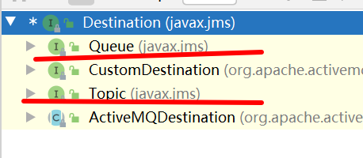
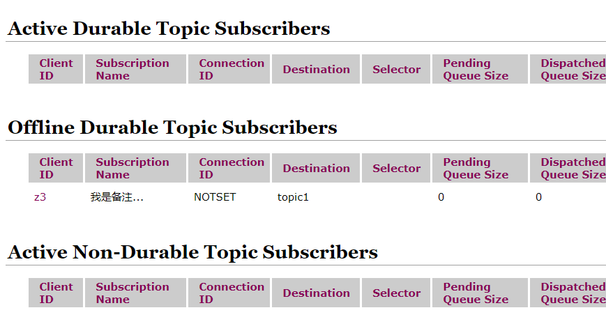

# ActiveMQ

## 一. MQ的意义

### 1. 宏观上

1. 解决耦合 **解耦**
2. 异步模型 **异步**
3. **削峰** 抵御洪峰流量,达到保护主服务的目的

### 2. 技术背景

__微服务__的生产者调用消费者,链式模块调用; RPC的交互变得复杂而耦合

同时面对大流量并发时,容易被冲垮

## 二. helloworld

### 1. 安装和使用

从官网`activemq.apache.org`可以下载到压缩包

然后解压运行`./activemq start`最普通的启动,`activemq stop关闭`

默认端口是`61616`

### 2. 控制台cli

跟rabbitmq的15672类似,端口为`8161`,访问路径为`/admin`

用户名密码都是admin 默认

## 三. Active javaAPI

### 1. 大致理念

* 核心依赖

  ```xml
  <dependency>
      <groupId>org.apache.activemq</groupId>
      <artifactId>activemq-all</artifactId>
      <version>5.15.9</version>
  </dependency>
  <dependency>
      <groupId>org.apache.xbean</groupId>
      <artifactId>xbean-spring</artifactId>
      <version>3.16</version>
  </dependency>
  ```

* __JMS总体架构__:

  

* __Destination__称为目的地,分为Queue和Topic两种
  * Queue: 点对点
  * Topic: 发布订阅pubsub

### 2. 连接

1. <u>创建连接工厂</u>

   ```java
   ActiveMQConnectionFactory activeMQConnectionFactory = new ActiveMQConnectionFactory(...);
   //参数: 
   // 1. username 可选,和password同时可选
   // 2. password
   // 1. String/URI brokerURL 代理,即broker的资源定位符 
   ```

> 空参构造器: 传入一个默认URL
>
> ```url
> failover://tcp://localhost:61616
> ```
>
> URL注意点:
>
> 1. 采用tcp协议而不是http

举例: 

```java
public static final String ACTIVE_URL = "tcp://192.168.92.128:61616";
public static void main(String[] args) {
    ActiveMQConnectionFactory activeMQConnectionFactory = new ActiveMQConnectionFactory(ACTIVE_URL);
}
```

2. <u>获取连接并start</u>

```java
Connection connection = activeMQConnectionFactory.createConnection();
connection.start();
```

> 这个Connection没有实现AutoCloseable,但是需要关闭

3. <u>创建session</u>

```java
Session session = connection.createSession(false, Session.AUTO_ACKNOWLEDGE);
//参数为 事务 签收,后面讲
```

4. 操作

5. 关闭

   ```java
   producer.close();//生产者消费者也要关
   session.close();
   connection.close();
   ```
```
   
   

### 4. session操作: 生产

**创建队列/Topic**: 

​```java
Queue queue = session.createQueue("sealll.news");
Topic topicing = session.createTopic("topicing");
```

这两个都是`Destination`的子接口



__创建生产者__:

```java
MessageProducer producer = session.createProducer(queue);
//传入Destination,告知消息生产后放在哪
```

__创建(文本)消息__:

```java
TextMessage textMessage = session.createTextMessage("msg" + i);
```

__生产者发布消息__:

```java
producer.send(textMessage);
```

__完整:__

```java
public static final String ACTIVE_URL = "tcp://192.168......:61616";
public static void main(String[] args) throws JMSException {
    //创建Connection工厂
    ActiveMQConnectionFactory activeMQConnectionFactory = new ActiveMQConnectionFactory(ACTIVE_URL);
    
    //创建并开启连接
    Connection connection = activeMQConnectionFactory.createConnection();
    connection.start();

    //创建会话
    Session session = connection.createSession(false, Session.AUTO_ACKNOWLEDGE);
    //创建Destination
    Queue queue = session.createQueue("sealll.news");
    Topic topicing = session.createTopic("topicing");

    //创建生产者
    MessageProducer producer = session.createProducer(queue);

    for (int i = 0; i <= 3; i++) {
        //创建消息并发送
        TextMessage textMessage = session.createTextMessage("msg" + i);
        producer.send(textMessage);
    }
    //关闭连接,不关闭他就不停了
    connection.close();
    session.close();
}
```

### 3. session操作: 消费

__创建Destination__:(指定接收什么目的地的消息)

```java
Queue queue = session.createQueue("sealll.news");
Topic topicing = session.createTopic("topicing");
```

__创建消费者__:

```java
//获取对应Destination的消费者
MessageConsumer consumer = session.createConsumer(queue);
```

__监听接收消息__

```java
//这个不是轮询结构,而是一次循环接收一个消息
while(true){
    //没有收到receive时会阻塞
    TextMessage receive = (TextMessage)consumer.receive();
    //receive空参: 一直运行
    //参数long timeout: 等待时间有限,到时间返null
}
```

__完整__:

```java
public static void main(String[] args) throws JMSException {
   //获取连接省略...
    Queue queue = session.createQueue("sealll.news");
    Topic topicing = session.createTopic("topicing");

    consumer = session.createConsumer(queue);
            while (true) {
                System.out.println("start receiving");
                TextMessage receive = (TextMessage) consumer.receive(3000);
                if (receive != null) {

                    System.out.println(receive.getText());
                }
            }
}
```

### 5. 消费者监听消息

`receive`方法显然可以用异步来优化

* `MessageListener接口`

  ```java
  public interface MessageListener {
      void onMessage(Message message);
  }
  ```

* 消费者设置监听器

  ```java
  void setMessageListener(MessageListener listener) throws JMSException;
  ```

```java
//设置监听器
consumer.setMessageListener(new MessageListener() {
    @Override
    public void onMessage(Message message) {
        //收到就处理消息
        if( null != message && message instanceof TextMessage){
            TextMessage message1 = (TextMessage) message;
            try {
                System.out.println(message1.getText());
            } catch (JMSException e) {
                e.printStackTrace();
            }
        }
    }
});
```

> 注意: 异步的,主线程会立刻继续,别直接把session,connection之类的关了

## 附. 消息分配

消息队列的分配带有一种负载均衡的感觉**,消费者轮流分配**

## 四. Topic

### 1.  要点

* 先订阅后发布,即消费者比发布者先启动才能收到消息,
* Topic不保存消息,无状态
* JMS允许持久订阅

### 2. 编程

将上面的Queue换成Topic即可

## 五. JMS

JMS即**java消息服务**,指的是两个应用程序之间异步通信的API.

### 1. JMS四大元素

* **JMS provider**: 对JMS规范的实现产品,JMS服务器
* __JMS Producer__: 消息生产者
* __JMS Consumer__: 消息消费者
* __JMS Message: __ 消息

### 2. 消息

消息由__消息头__ __消息体__ __消息属性__构成

#### 2.1 消息头

消息头包含了一些消息的描述信息,可以调用生产者的setter进行设置,也可以作为send方法的参数

* `JMSDestination`: 就是Destination,发到哪里
* `JMSDeliveryMode`: 持久模式/非持久模式,传入DeliveryMode的枚举对象
  * 持久: 传送仅一次,意味着JMS提供者出现故障,消息也应该被持久化,等到下一次服务器恢复
  * 非持久: 服务器故障,该消息消失
* `JMSExpiration`: 消息过期时间
  * 仅在send中通过timeToLive属性指定
  * 设置为0就不过期
* `JMSPriority`: 默认4,数字越高越紧急
  * 0-4为普通消息,5-9是加急消息,加急消息要比普通消息先到达
* `JMSMessageID`: 唯一标识消息

#### 2.2 五种消息体

* `TextMessage`: 包含一个String
* `MapMessage`: 包含一个Map
* `BytesMessage`: 包含字节数组
* `StreamMessage`: 包含流
* `ObjectMessage`: 包含可序列化Java对象

#### 2.3 消息属性

如果需要除了消息头字段以外的值,可以用消息属性

`属性名(String)-属性值(任意基本类型)`

使用`message.setxxx(类型)Property`

## 六.  可靠性

考虑Provider宕机的行为

### 1. 队列持久化设置

```java
messageProducer.setDeliveryMode(DeliveryMode.NON_PERSISTENT);//非持久,宕机重启后消息丢失

messageProducer.setDeliveryMode(DeliveryMode.PERSISTENT);//持久,默认
```


### 2. (重要)持久化Topic

显然这种consumer先启动,producer后启动的方式不够持久化

我们需要引入__发布订阅机制__

#### 2.1 生产者/消费者代码修改

* 生产者方面:

  * connection.start放在producer创建和设置之后

  * producer设置为DeliveryMode.PERSISTENT(持久化)

    ```java
    Connection connection =
            factory.createConnection();
    Session session = connection.createSession(false, Session.AUTO_ACKNOWLEDGE);
    Topic topic1 = session.createTopic("topic1");
    MessageProducer producer = session.createProducer(topic1);
    producer.setDeliveryMode(DeliveryMode.PERSISTENT);
    //放在这
    connection.start();
    ```

* 消费者方面

  * 设置客户端Id(即设置订阅者的标识)

    ```java
    Connection connection =
            factory.createConnection();
    connection.setClientID("z3");
    ```

  * 创建Topic以后,创建持久化的`TopicSubscriber`,替代consumer

    ```java
    Topic topic1 = session.createTopic("topic1");
    TopicSubscriber subscriber = session.createDurableSubscriber(topic1, "我是备注...");
    ```

  * 直接connection.start();

  * 用subscriber接收消息

    ```java
    Message message = subscriber.receive(); // 直接receive,和consumer逻辑一样
    subscriber.setMessageListener(message1 -> {}); // 设置监听,逻辑一样
    ```

#### 2.2 订阅者

订阅者一旦订阅就会以client id 为标识**持久**保存在activemq服务端

订阅者订阅以后下线,再次上线时会收到被订阅者发送的消息



### 3. 事务

事务在MQ中是偏向生产者的约束,在session创建时第一个参数设置布尔值来决定是否开启

#### 2.1 生产者事务

目的是如果发送多个消息途中出现异常,所有消息可以一起回滚

```java
Session session = connection.createSession(false, Session.AUTO_ACKNOWLEDGE);
```

`false`: 执行send以后直接进入到队列中

* 需要将签收参数设置有效

`true`: 先执行send再commit,才能将消息提交到队列中

```java
session.commit();
session.close();
// session.rollback();
```

#### 2.2 消费者事务

如果不commit,消息虽然消费了,但依然会被回退到队列中

所以开启了一定要commit