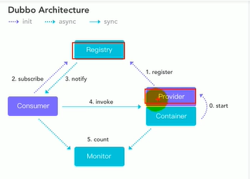

# Dubbo

## 一. 分布式

### 1. 分布式简介

什么是分布式?

分布式系统是若干独立计算机的集合,这些计算机对于用户来说就像单个相关系统.

是建立在网络上的软件系统

### 2. 架构演变

* `单一应用架构`: 以ORM层为核心, all in one
  * 复制应用来负载均衡
  * 不利于协同开发,扩展,修改
* `垂直应用架构`: 以MVC为例,将多个应用分开,但垂直构造一致
  * 界面和业务逻辑耦合
  * 应用不可能完全独立
* `分布式架构`: 服务开始分布在不同server上
  * 进程间调用被破坏,需要远程过程调用,即`RPC`
* `流动计算架构`: 引入调度中心,管理集群容量和压力,提高集群利用率

### 3. RPC

RPC(Remote Procedure Call)指的是远程过程调用,一种进程间的通信方式,是思想而不是规范

* 需要序列化机制
* 需要Socket连接

### 4.  Dubbo

1. 面向接口代理的高性能RPC调用
2. 智能负载均衡
3. 服务自动发现(注册中心)
4. 流量调度
5. 可视化服务治理

### 5. 基本架构

注册中心-----消费者/服务提供者 ------dubbo容器------监控中心

* 流程
  * 容器启动,将provider注册到注册中心
  * consumer订阅注册中心中的服务,当provider有状态变化时会提醒消费者
  * consumer调用provider
  * 各种数据都会发到监控中心