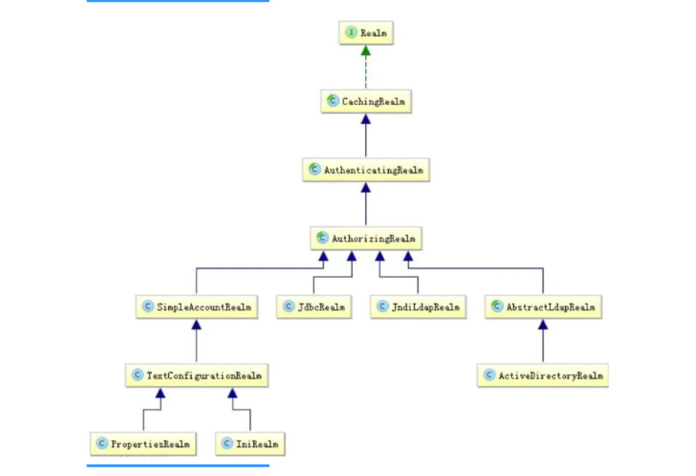
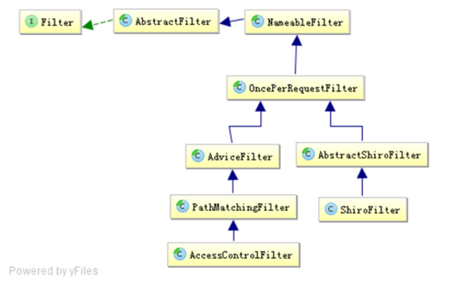
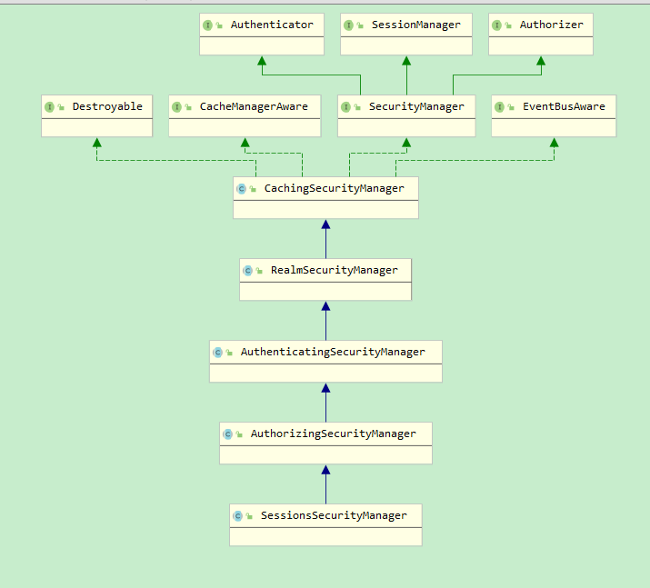

# Shiro

## 一. 介绍

Java权限框架

### 1. 概念:


* 核心功能: 

**Authentication**：身份认证 / 登录，验证用户是不是拥有相应的身份；

**Authorization**：授权，即权限验证，验证某个已认证的用户是否拥有某个权限；即判断用户是否能做事情，常见的如：验证某个用户是否拥有某个角色。或者细粒度的验证某个用户对某个资源是否具有某个权限；

**Session** **Management**：会话管理，即用户登录后就是一次会话，在没有退出之前，它的所有信息都在会话中；会话可以是普通 JavaSE 环境的，也可以是如 Web 环境的；

**Cryptography**：加密，保护数据的安全性，如密码加密存储到数据库，而不是明文存储；


**Subject**：主体，代表了当前 “用户”，这个用户不一定是一个具体的人，与当前应用交互的任何东西都是 Subject，如网络爬虫，机器人等；即一个抽象概念；所有 Subject 都绑定到 SecurityManager，与 Subject 的所有交互都会委托给 SecurityManager；可以把 Subject 认为是一个门面；SecurityManager 才是实际的执行者；

**SecurityManager**：安全管理器；即所有与安全有关的操作都会与 SecurityManager 交互；且它管理着所有 Subject；可以看出它是 Shiro 的核心，它负责与后边介绍的其他组件进行交互，如果学习过 SpringMVC，你可以把它看成 DispatcherServlet 前端控制器；

**Realm**：域，Shiro 从从 Realm 获取安全数据（如用户、角色、权限），就是说 SecurityManager 要验证用户身份，那么它需要从 Realm 获取相应的用户进行比较以确定用户身份是否合法；也需要从 Realm 得到用户相应的角色 / 权限进行验证用户是否能进行操作；可以把 Realm 看成 DataSource，即安全数据源。

## 二. 身份验证

身份验证由两个要素构成

`principals(身份)`: 表示主体的属性,比如用户名

`credentials`(凭证):只有主体知道的安全值 

* ini配置操作

```ini
#ini配置
[users]
zhang=123
san=123
```

```java
public class ShiroTest {
    @Test
    public void test1(){
        // 获取Ini初始化的Security Manager工厂
        IniSecurityManagerFactory factory = new IniSecurityManagerFactory("classpath:shiro.ini");
        //获取manager并注册给utils
        SecurityManager instance = factory.createInstance();
        SecurityUtils.setSecurityManager(instance);

        //获得subject
        Subject subject = SecurityUtils.getSubject();
        UsernamePasswordToken token = new UsernamePasswordToken("zhang", "123");
        try{
            //登录!
            subject.login(token);
        } catch (AuthenticationException e) {
            //身份验证失败
            System.out.println("不认识!");
        }
        if(subject.isAuthenticated()){
            System.out.println("我要登出");
            subject.logout();
        }
    }
```


```java
// manager底层,使用authenticator来验证
return this.authenticator.authenticate(token);
// authenticator底层,使用realm验证
 AuthenticationInfo info = realm.getAuthenticationInfo(token);
```

### 2. 指定realm

Realm是shiro获取有关安全数据的地方,上一节使用的是IniRealm,显然不够开发需求

```java
public interface Realm {
    String getName(); // 获取realm名字

    boolean supports(AuthenticationToken var1);// 支不支持解析这个token

    AuthenticationInfo getAuthenticationInfo(AuthenticationToken var1) throws AuthenticationException;// 解析token
}
```

* 自定义realm

  * 实现Realm后在ini中配置,逗号分隔,有先后顺序

    ```ini
    #声明一个realm
    myRealm1=com.github.zhangkaitao.shiro.chapter2.realm.MyRealm1
    myRealm2=com.github.zhangkaitao.shiro.chapter2.realm.MyRealm2
    #指定securityManager的realms实现
    securityManager.realms=$myRealm1,$myRealm2
    ```

### 3. 指定验证策略

当拥有多个Realm时,底层会调用`AuthenticationStrategy`来验证

* 三个实现类:

  * **`FirstSuccessfulStrategy`**：只要有一个 `Realm` 验证成功即可，只返回第一个 `Realm` 身份验证成功的认证信息，其他的忽略；

    `AtLeastOneSuccessfulStrategy`：只要有一个 `Realm` 验证成功即可,返回所有 `Realm` 身份验证成功的认证信息(默认)

    `AllSuccessfulStrategy`：所有 `Realm` 验证成功才算成功，且返回所有 `Realm` 身份验证成功的认证信息，如果有一个失败就失败了。

* ```ini
  allSuccessfulStrategy=org.apache.shiro.authc.pam.AllSuccessfulStrategy
  securityManager.authenticator.authenticationStrategy=$allSuccessfulStrategy
  ```


## 三. 授权

### 1. 关键词

`Subject`: 主体, 可以狭义的理解成用户

`Resource`: 资源, 要访问的资源,比如页面

`Permission`: 权限

`Role`: 角色 , 权限的集合

* 隐式角色: 不明显区分角色,只按照主体分配权限
* 显示角色: 区分角色,将主体置于角色中

### 2. 判断权限

Shiro 支持三种方式的授权：

编程式：通过写 if/else 授权代码块完成：

```java
Subject subject = SecurityUtils.getSubject();
if(subject.hasRole(“admin”)) {
    //有权限
} else {
    //无权限
}
```

注解式：通过在执行的 Java 方法上放置相应的注解完成：

```java
@RequiresRoles("admin")
public void hello() {
    //有权限
}
```

### 3. 授予/判断角色

> 本节根据角色名来判断权限,属于隐式角色

iniRealm: 

```ini
[user]
zhang=123,role1,admin
用户名=密码,角色1,...
```

判断是否拥有角色:

```java
subject.hasRole("role1");//返回一个布尔值
subject.hasRoles(Arrays.asList("role1","role2"));//返回一个布尔数组
subject.hasRoles(Arrays.asList("role1","role2"));//返回一个布尔值
```

断言角色权限(抛出UnauthorizedException异常)

```java
subject.checkRole();
subject.checkRoles();
```


### 4. ini定义角色

> 本节起属于显示角色

```ini
[roles]
role1=user:create,user:update
role2="user:create",user:delete
角色名=权限1,权限2...
# 如果操作中有逗号,那权限就用引号括起
```

权限: 一般为`资源标识:操作`格式

### 5. 权限判断

采用`subject.isPermitted("权限字符串")`,`subject.isPermittedAll(Collection)`来判断是否符合权限

或者断言(抛出UnauthorizedException异常)

```java
//断言拥有权限：user:create
subject().checkPermission("user:create");
//断言拥有权限：user:delete and user:update
subject().checkPermissions("user:delete", "user:update");
//断言拥有权限：user:view 失败抛出异常
subject().checkPermissions("user:view");
```

### 6. 权限定义

#### 6.1 通配符

`资源:操作:实例`

通配符:(对于配置和验证都有效)

`:` 表示资源,操作,实例之间的分割

`,`表示操作之间的分割

`*` 表示任意资源/实例/操作

#### 6.2 通配符的例子

在判断中也一样,注意 system:user是资源,实例在前四个例子中没有表示出来

* 单个资源单个权限

  ```ini
  role1=system:user:update
  ```

* 单个资源多个权限(逗号分隔版本)

  ```ini
  role1=system:user:update,delete
  ; 就算是写了很多权限,对system:user:*也不能通过判断
  ```

* 单个资源所有权限

  ```ini
  role1=system:user:*
  ```

* 所有资源的n个权限

  ```ini
  role1=*:view,update
  ```

* 实例

  ```ini
  role=user:view:1
  role=*:view:1
  role=user:*:*
  ```

* 缺省

  默认没有写的就是`*`

### 7. 流程/原理/进阶


核心组件: `Authorizer`

组件: 

`Permission`: WildcardPermission 权限接口,定义了implies(Permission)来判断是否符合权限

`PermissionResolver`: 把字符串转换成Permission,默认使用 WildcardPermissionResolver

是**AuthorizingRealm**的属性,由ModularRealmAuthorizer调用来解析字符串

```java
public interface PermissionResolver {
    Permission resolvePermission(String permissionString);
}
```

`RolePermissionResolver`: 解析角色拥有的权限

通过身份信息获取AuthorizationInfo后,获取不到用户的ObjectPermission,StringPermission,就会调用RolePermissionResolver来解析角色权限(然后我嗯是找不到它的实现类)

```java
public interface RolePermissionResolver {
    Collection<Permission> resolvePermissionsInRole(String var1);
}
```

```ini
[main]
\#自定义authorizer
authorizer=org.apache.shiro.authz.ModularRealmAuthorizer
\#自定义permissionResolver
\#permissionResolver=org.apache.shiro.authz.permission.WildcardPermissionResolver
permissionResolver=com.github.zhangkaitao.shiro.chapter3.permission.BitAndWildPermissionResolver
authorizer.permissionResolver=$permissionResolver
\#自定义rolePermissionResolver
rolePermissionResolver=com.github.zhangkaitao.shiro.chapter3.permission.MyRolePermissionResolver
authorizer.rolePermissionResolver=$rolePermissionResolver
securityManager.authorizer=$authorizer
\#自定义realm 一定要放在securityManager.authorizer赋值之后（因为调用setRealms会将realms设置给authorizer，并给各个Realm设置permissionResolver和rolePermissionResolver）
realm=com.github.zhangkaitao.shiro.chapter3.realm.MyRealm
securityManager.realms=$realm
```

## 四. 配置的本质

到现在为止,我们用配置做这些事:

IniRealm,还有给SecurityManager组件及其子组件注入; **本质就是调用他们的setter来赋值POJO**,和Spring的IOC十分相似;

## 五. 加密

### 1. Base64/Hex

Base64加密 输入一个byte数组, 输出一个字符串

Base64解码,输入字符串,输出结果

```java
String s1 = Base64.encodeToString("123456".getBytes());
String s = Base64.decodeToString(s1);
```

Hex也类似,输入输出都是byte数组

```java
String str = "hello"; String base64Encoded = Hex.encodeToString(str.getBytes()); 
String str2 = new String(Hex.decode(base64Encoded.getBytes()));
```


### 2. 散列算法

不可逆加密,如MD5,SHA等

可以添加salt来增加散列的复杂性, 比如直接存密码的md5可能很容易破解,但如果是用户名+密码的字符串就比较困难.

```java
String source = "123456";
String salt = "user";
Md5Hash md5Hash = new Md5Hash(source, salt);
//Sha256类似
```

这些Md5Hash,Sha256Hash都是SimpleHash的实现类,通过属性指定SimpleHash的算法

```java
String simpleHash = new SimpleHash("SHA-1", str, salt).toString();  
```

后面的我不会用,想用的时候去看看

## 六. Realm

大多是Realm的实现类是Authorizer也是Authenticator,方便在验证和授权时使用



# Shiro-Web-Spring

## 一. 注册Filter代理和Filter

与Spring和web集成,首先要在webcontext注册`DelegatingFilterProxy`(过滤器)

```java
static class ServletConfig implements ServletContextAware{
    @Override
    public void setServletContext(ServletContext servletContext) {

        FilterRegistration.Dynamic shiroFilter = servletContext.addFilter("shiroFilter", DelegatingFilterProxy.class);
  shiroFilter.addMappingForServletNames(EnumSet.of(DispatcherType.REQUEST),true,"/*");

    }

}
```

然后把ShiroFilterFactoryBean放进容器,id为shiroFilter, 这个DelegatingFliterProxy就会找到容器中的shiroFilter并将Filter操作委托给它

后面细说

## 二. url配置(ini)

```ini
[urls]
/login=anno
/role=authc,roles[admin]
url名=拦截器,拦截器[参数]...
```

1. url支持 `?`,`*`,`**`匹配模式
2. 在匹配精度上没有顺序, 一般匹配到的第一个就是匹配结果

### 2. 示例: 基于表单的拦截器配置

> authc是FormAuthenticationFilter的实例

```ini
[main]
authc.loginUrl=/formfilterlogin
authc.usernameParam=username
authc.passwordParam=password
authc.successUrl=/
authc.failureKeyAttribute=shiroLoginFailure ; 指定失败后存储在request的attribute
[url]
/role=authc
```

## 三. 拦截器

### 1. 拦截器介绍

众所周知,shiro拦截器都是由filter实现的



* NameableFilter: 给Filter起名字,比如之前的authc

* **OncePerRequestFilter**: 保证一次请求只走一次拦截器链,并提供开启关闭Filter的enable属性

* ShiroFilter: shiro拦截入口

* **AdviceFilter**: 提供了类似AOP的接口

  ```java
  boolean preHandle(ServletRequest request, ServletResponse response) throws Exception
  void postHandle(ServletRequest request, ServletResponse response) throws Exception
  void afterCompletion(ServletRequest request, ServletResponse response, Exception exception) throws Exception;
  ```

* **PathMatchingFilter**: 匹配Ant风格路径

* **AccessControlFilter**

  AccessControlFilter 提供了访问控制的基础功能；比如是否允许访问/当访问拒绝时如何处理等：

  ```java
  abstract boolean isAccessAllowed(ServletRequest request, ServletResponse response, Object mappedValue) throws Exception;
  // mappedValue即拦截器参数
  boolean onAccessDenied(ServletRequest request, ServletResponse response, Object mappedValue) throws Exception;
  abstract boolean onAccessDenied(ServletRequest request, ServletResponse response) throws Exception;
  ```

  并且提供了LoginUrl的getter,setter

  ```java
   private String loginUrl = "/login.jsp"; // 属性
  ```

  以及Subject的getter; 判断是否为登录请求的方法(是否匹配loginurl)

  还有这个

  ```java
  void saveRequestAndRedirectToLogin(ServletRequest request, ServletResponse response) throws IOException //将当前请求保存起来并重定向到登录页面
  void saveRequest(ServletRequest request) //将请求保存起来，如登录成功后再重定向回该请求
  void redirectToLogin(ServletRequest request, ServletResponse response) //重定向到登录页面
  ```

### 2. 拦截器链

Shiro拦截器链会在Servlet的拦截器链之前执行

> 所以想要配置到Shiro拦截器链,应当在shiro配置文件中进行而不是在webContext中注册

每次请求来到时,会由FilterChainResolver通过url解析出一条代理拦截器链ProxiedFilterChain

* PathMatchingFilterChainResolver内部的DefaultFilterChainManager 维护url和拦截器的关系

* 并且DefaultFilterChainManager会将一些默认的过滤器加入链条

  ```java
  public enum DefaultFilter {
      anon(AnonymousFilter.class),
      authc(FormAuthenticationFilter.class),
      authcBasic(BasicHttpAuthenticationFilter.class),
      logout(LogoutFilter.class),
      noSessionCreation(NoSessionCreationFilter.class),
      perms(PermissionsAuthorizationFilter.class),
      port(PortFilter.class),
      rest(HttpMethodPermissionFilter.class),
      roles(RolesAuthorizationFilter.class),
      ssl(SslFilter.class),
      user(UserFilter.class);
  }
  ```

  

#### 附. 自定义FilterChainResolver

自定义FilterChainResolver可以手动配置url和拦截器的映射关系,手动注册filter

普通web: 

1. 实现WebEnvironment

   ```java
   public class MyIniWebEnvironment extends IniWebEnvironment {
       @Override
       protected FilterChainResolver createFilterChainResolver() {
           //在此处扩展自己的FilterChainResolver
           //1、创建 FilterChainResolver
           PathMatchingFilterChainResolver filterChainResolver =
                   new PathMatchingFilterChainResolver();
           //2、创建 FilterChainManager
           DefaultFilterChainManager filterChainManager = new DefaultFilterChainManager();
           //3、注册 Filter
           for(DefaultFilter filter : DefaultFilter.values()) {
               filterChainManager.addFilter(
                   filter.name(), (Filter) ClassUtils.newInstance(filter.getFilterClass()));
           }
           //4、注册 URL-Filter 的映射关系
           filterChainManager.addToChain("/login.jsp", "authc");
           filterChainManager.addToChain("/unauthorized.jsp", "anon");
           filterChainManager.addToChain("/**", "authc");
           filterChainManager.addToChain("/**", "roles", "admin");
           //5、设置 Filter 的属性
           FormAuthenticationFilter authcFilter =
                    (FormAuthenticationFilter)filterChainManager.getFilter("authc");
           authcFilter.setLoginUrl("/login.jsp");
           RolesAuthorizationFilter rolesFilter =
                     (RolesAuthorizationFilter)filterChainManager.getFilter("roles");
           rolesFilter.setUnauthorizedUrl("/unauthorized.jsp");
           filterChainResolver.setFilterChainManager(filterChainManager);
           return filterChainResolver;
       }
   }
   ```

2. 配置环境到ContextParam

Spring: 

配置一个ShiroFilterFactoryBean并给它赋值属性,后面细说

### 3. 默认拦截器

[xmid导图](file:///E:\learning\shiro\默认Filter.xmind)

~~打开需要时间,不建议多点~~

## 四. Session

(shiro的session)不依赖任何容器

### 1. session api

登录成功后使用subject.getSession()即可获得会话

```java
Session session = subject.getSession();
// DelegatingSubject返回一个内部类的StoppingAwareProxiedSession
```

* api:
  * getId(): 获取唯一标识
  * get/setTimeOut: 查看/设置过期时间
  * session.getStartTimestamp(); 开始的时间戳 
  * session.getLastAccessTime(); 上次访问的时间戳
  * session.stop(); 销毁会话,在Session.invalidate和subject.logout时会销毁
  * setArrtibute(): 设置域属性

### 2. SessionManager

**作为SecurityManager的属性存在**

```java
public interface SessionManager {
    Session start(SessionContext var1);
    Session getSession(SessionKey var1) throws SessionException;
}
```

默认配置DefaultSessionManager

web环境应当使用**ServletContainerSessionManager**,直接使用servlet的session机制,但是操作的还是shiro的session


如果不满意默认的Session-Cookie机制,可以继承DefauktWebSessionManager定制

# Shiro源码观察

## 一. ini读取

```java
new IniSecurityManagerFactory("classpath:shiro.ini");
//这一步其实只是创建了一个工厂,然后将Ini载入到工厂的属性中
```

所以我们可以看看Ini的读取: 

### 1. 调用栈

```java
Ini.fromResourcePath(iniResourcePath);// 利用静态方法读取
ini.loadFromPath(resourcePath); // 调用非静态方法给ini加载内容
this.load(is); // ini加载InputStream
this.load((Reader)isr); //ini包装InputStream为Reader读取
this.load(scanner); // 包装为Scanner
```

### 3. ini数据结构

```java
private final Map<String, Ini.Section> sections;
```

`Section`: ini中会有以`[]`分隔的区域,而[]中的内容就是后面几行的section

`sections`: 即存储`section名-内容`的映射,是`LinkedHashMap`

* `Ini.Section`: Map<String,String\>实现类,维护了一个LinkedHashMap<String,String\>

  

### 4. ini读取核心: 添加Section

```java
while(scanner.hasNextLine()) {
	//...
    //读取一行并clean处理
    if (line != null && !line.startsWith("#") && !line.startsWith(";")) {
        // 判断是不是[]型的一行,如果是就迎接新的section
        String newSectionName = getSectionName(line); 
        if (newSectionName != null) {
            //遇到新的section,就把旧section放进map中,后面详解
            this.addSection(sectionName, sectionContent);
            // 清空名字和内容
            sectionContent = new StringBuilder();
            sectionName = newSectionName;
            //..日志,省略
        } else {
            //不是section头就嗯加内容
            sectionContent.append(rawLine).append("\n");
        }
    }
}
```

### 5. ini读取核心: 解析section内容

```java
Ini.Section section = new Ini.Section(name, contentString);
// 对Section内容解析由构造器完成
```

核心代码:

```java
private static Map<String, String> toMapProps(String content) {
    Map<String, String> props = new LinkedHashMap();
    StringBuilder lineBuffer = new StringBuilder();
    // 注意,它把字符串放进Scanner来一行一行读
    Scanner scanner = new Scanner(content);

    while(scanner.hasNextLine()) {
        String line = StringUtils.clean(scanner.nextLine());
        if (isContinued(line)) { // 判断这一行是否和下一行连续(即判断末尾反斜杠是否为奇数)
            line = line.substring(0, line.length() - 1);
            lineBuffer.append(line); // 连接
        } else {
            lineBuffer.append(line);
            line = lineBuffer.toString();
            lineBuffer = new StringBuilder();
            // 简单地说就是以:或者=分隔key和value
            String[] kvPair = splitKeyValue(line);
            props.put(kvPair[0], kvPair[1]);
        }
    }

    return props;
}
```

## 一+. 创建SecurityManager

### 1. 

如果ini读入为空,则返回一个`DefaultSecurityManager`实例

如果ini有内容,

**调用栈:**

```java
instance = this.createInstance(ini);
SecurityManager securityManager = this.createSecurityManager(ini);
return this.createSecurityManager(ini, mainSection);
// mainSection: 如果ini有[main],即为main,不然为空串

```

```java
private SecurityManager createSecurityManager(Ini ini, Section mainSection) {
    //这里返回了一个map,里面首先有DefaultSecurityManager
    //然后若ini里有roles或者users section,则会再放一个IniRealm
    Map<String, ?> defaults = this.createDefaults(ini, mainSection);
    // 把他们和EventBus放进ReflectionBuilder中,然后处理一些配置?(里面看不懂了)
    Map<String, ?> objects = this.buildInstances(mainSection, defaults);
    // 把刚刚处理好的DefaultSecurityManager拿出来
    SecurityManager securityManager = this.getSecurityManagerBean();
    //判断有没有realm了,没有的话就把之前配置的加进来
    boolean autoApplyRealms = this.isAutoApplyRealms(securityManager);
    if (autoApplyRealms) {
        Collection<Realm> realms = this.getRealms(objects);
        if (!CollectionUtils.isEmpty(realms)) {
            this.applyRealmsToSecurityManager(realms, securityManager);
        }
    }

    return securityManager;
}
```

### 2. DefaultSecurityManager构造栈

这个SecurityManager虽然叫默认,但是不简单



#### 2.1 SecurityManager接口

```java
public interface SecurityManager extends Authenticator, Authorizer, SessionManager {
    //这三个是SecurityManager带的方法
    Subject login(Subject var1, AuthenticationToken var2) throws AuthenticationException;

    void logout(Subject var1);

    Subject createSubject(SubjectContext var1);
    
    //这是sessionManager的方法
    Session start(SessionContext var1);

    Session getSession(SessionKey var1) throws SessionException;
    
    // Authenticator验证器的方法
    AuthenticationInfo authenticate(AuthenticationToken var1) throws AuthenticationException;
    
    //Authorisor方法
    //...一堆hasRole,checkRole,isPermitted方法
}
```

#### 2.2 CachingSecurityManager

空参构造器设置一个`DefaultEventBus`,此时CacheManager被声明了却没有被赋值

#### 2.3 RealmSecurityManager

声明了一个Realm集合,什么也没做

#### 2.4 AuthenticatingSecurityManager

给类中加入了` Authenticator`

```java
private Authenticator authenticator = new ModularRealmAuthenticator();
```

#### 2.5 AuthorizingSecurityManager

给类中加入了`Authorizer`

```java
private Authorizer authorizer = new ModularRealmAuthorizer();
```

#### 2.6 SessionsSecurityManager

给类中增加了`SessionManager`

```
private SessionManager sessionManager = new DefaultSessionManager();
```

#### 2.7 DefaultSecurityManager

声明`RememberMeManager`但未赋值

声明`SubjectFactory`并赋值Default(利用context创造DelegatingSubject)

声明`SubjectDAO`并赋值Default

对于Web子类,这三项分别是:

```java
setSubjectFactory(new DefaultWebSubjectFactory());
setRememberMeManager(new CookieRememberMeManager());
setSessionManager(new ServletContainerSessionManager());
```

## 一++. 创建Subject

就是用SecurityManager的方法创建一个,传入一个平平无奇的SecurityContext

在DefaultSecurityManager中会给它做包装,

返回一个`DelegatingSubject`,并给他设置默认状态

并将subject保存在SubjectDao中

```java
public Subject createSubject(SubjectContext subjectContext) {
    //context备份
    SubjectContext context = copy(subjectContext);
    //确保有,不然就加一个
    context = ensureSecurityManager(context);

    //Resolve an associated Session (usually based on a referenced session ID), and place it in the context before
    //sending to the SubjectFactory.  The SubjectFactory should not need to know how to acquire sessions as the
    //process is often environment specific - better to shield the SF from these details:
    context = resolveSession(context);

    //Similarly, the SubjectFactory should not require any concept of RememberMe - translate that here first
    //if possible before handing off to the SubjectFactory:
    context = resolvePrincipals(context);

    Subject subject = doCreateSubject(context);

    //save this subject for future reference if necessary:
    //(this is needed here in case rememberMe principals were resolved and they need to be stored in the
    //session, so we don't constantly rehydrate the rememberMe PrincipalCollection on every operation).
    //Added in 1.2:
    save(subject);

    return subject;
}
```

## 二. Login

DelegatingSubject调用login, 首先清除session的RUN_AS_PRINCIPALS_SESSION_KEY内容

然后调用<u>SecurityManager的login</u> ---- SecurityManager调用<u>Authenticator的authenticate方法</u>

---- 调用<u>ModularRealmAuthenticator的doAuthenticate方法</u>

> **若单个Realm:**
>
> 先检查Realm是否support token, 在把token传入realm的方法获取AuthenticateInfo
>
> 最终落实到`doGetAuthenticationInfo`方法上(可以自己实现)
>
> > 以SimpleAccountRealm为例:
> >
> > 其直接从自己存的map中获取一个SimpleAccount并返回
>
> 然后获得了token后由doAuthenticate调用Realm中的(Simple)CredentialMatcher来判断密码是否正确,密码不对就抛**IncorrectCredentialsException**
>
> 成功就放入缓存(if impossible)
>
> __若多个Realm__:
>
> 首先获取验证策略AuthenticationStrategy,默认为AtLeastOneSuccessfulStrategy
>
> ~~验证策略的原理不太能看懂,就记住他们的结果吧,以后再来补充~~

获取Info后返回到SecurityManager,按以下代码创建或设置Subject并放进SubjectDAO

```java
protected Subject createSubject(AuthenticationToken token, AuthenticationInfo info, Subject existing) {
    SubjectContext context = createSubjectContext();
    context.setAuthenticated(true);
    context.setAuthenticationToken(token);
    context.setAuthenticationInfo(info);
    context.setSecurityManager(this);
    if (existing != null) {
        context.setSubject(existing);
    }
    return createSubject(context); // 根据Context内容获取Subject
}
```

## 二+. Subject-HttpSession绑定原理

### 1. 创建Subject时注入session

在AbstractShiroFilter中创建Subject时已经使用了Session

```java
protected WebSubject createSubject(ServletRequest request, ServletResponse response) {
    return new WebSubject.Builder(getSecurityManager(), request, response).buildWebSubject();
}
```

__流程__:

> **createSubject**: Builder创建时将SecurityManager,Request,Response放进Context中,
>
> 再调用SecurityManager的createSubject方法
>
> 在context = resolveSession(context);这一步拿到HttpSession并转换为shiro.Session
>
> 后面的Principal之类的都是从session中获取

### 2. Subject绑定线程

Subject从结果上来看被**绑定在对应线程的ThreadLocal**上

__流程__: 

> 在AbstractShiroFilter的doInternalFilter中的
>
> ```java
> subject.execute(new Callable() {
>     public Object call() throws Exception {
>         updateSessionLastAccessTime(request, response);
>         executeChain(request, response, chain);
>         return null;
>     }
> });
> ```
>
> execute内部流程:
>
> 首先将Callable转换成SubjectCallable,对于execute中的情况,其将**ThreadState**设置了subject和SecurityManager; 然后执行ThreadContext.bind(this.subject);将subject绑定在线程上


### 3. 登录时创建/修改session

第一次登录时创建session(假设此时cookie也没有携带任何sessionID)

如果request携带了session,则去掉创建的部分,其他一样

__流程:__ 

> 在SecurityManager登录后创建(设置)新Subject时, 通过save(subject)这一步,SubjectDao检查是否SessionCreation被开启,检查session为null后向其中添加session
>
> __添加Session__:
>
>  <u>第一步: 加入principal</u>
>
> 创建session并将**httpSession**和host注入(通过WebSessionContext)(由SecurityManager调用start来创建session)
>
> 将principal放入session域
>
> ```java
> session.setAttribute(DefaultSubjectContext.PRINCIPALS_SESSION_KEY, currentPrincipals);
> ```
>
> <u>第二步: 加入验证信息</u>
>
> 先检查session域中有没有`DefaultSubjectContext.AUTHENTICATED_SESSION_KEY`的域信息,有的话就不做任何操作,没有就给其赋一个Boolean.TRUE
>
> 

### 4. SessionManager的作用

本质上它就这两个作用

```java
public interface SessionManager {
    Session start(SessionContext context); //在Subject的getSession(true)时调用(暂时目测只有session为null,创建session时使用了)

    Session getSession(SessionKey key) throws SessionException;
}
```

实现类为`ServletContainerSessionManager`,如果想要自己定制可以用DefaultWebSessionManager

* 根据SessionKey获取Session: 
  * 时机: 在创建Subject并且SessionKey不为null时,调用SessionManager获取session

__创建流程__:

> 从request中获取httpsession然后根据这个和host创建session

### 5. DefaultWebSessionManager的流程

该实现类提供了更加丰富的定制内容

__getSession流程__

> 一路向上来到retrieveSession((DefaultSessionManager): 
>
> 获取SessionId:
>
> > 从key中获取sessionId未果,便拿到`sessionIdCookie`组件(Cookie类型,默认为SimpleCookie,name为'JSESSIONID'),根据Cookie的name获取value返回为ID
> >
> > 然后设置了四个域属性
> >
> > ```java
> > request.setAttribute(ShiroHttpServletRequest.REFERENCED_SESSION_ID_SOURCE,
> >         ShiroHttpServletRequest.COOKIE_SESSION_ID_SOURCE);
> > request.setAttribute(ShiroHttpServletRequest.REFERENCED_SESSION_ID, id);
> > request.setAttribute(ShiroHttpServletRequest.REFERENCED_SESSION_ID_IS_VALID, Boolean.TRUE);
> > request.setAttribute(ShiroHttpServletRequest.SESSION_ID_URL_REWRITING_ENABLED, isSessionIdUrlRewritingEnabled());
> > ```
>
> 调用`sessionDao`(MemorySessionDao,底层一个Map)的readSession(id)获取Session
>
> 之后校验了一下有没有超时什么的,就返回了
>
> 

__start流程__:

> 创建session对象:
>
> > 获取`sessionFactory`(默认simple),创建一个SimpleSession并将host注入
> >
> > 使用`sessionDao`丰富并保存这个session
> >
> > > sessionDao.create(session):
> > >
> > > 生成SessionId(即randomUUID)并设置给Session,将session放进map中
> >
> > 根据`globalSessionTimeout`设置过期时间,并将改变让sessionDao响应
> >
> > 放对应sessionIdCookie的Cookie进response
> >
> > ```java
> > // 调整域对象
> > request.removeAttribute(ShiroHttpServletRequest.REFERENCED_SESSION_ID_SOURCE);
> > request.setAttribute(ShiroHttpServletRequest.REFERENCED_SESSION_IS_NEW, Boolean.TRUE);
> > ```
> >
> > 末了就唤醒`SessionListener`们执行onStart方法
> >
> > 最后为了安全,暴露一个代理session而不是原session出去(但sessionId和sessionDao中保持一致)


## 三. Spring整合Filter内容

### 1. DelegatingFilterProxy

这是一个加入到Web容器中的Filter, 它实际上作为我们shiro的Filter的代理(入口)而存在

* 执行流程:
  1. 在初始化阶段,根据targetName参数或者Filtername,从**ioc容器**中获取一个Filter并将它赋值给delegate属性
  2. 然后在doFilter时候直接执行代理的doFilter

### 2. ShiroFilterFactoryBean

这就是上一节我们希望配置到的代理; 是一个FactoryBean,也是后置处理器

#### 2.1 FactoryBean

先创建了一个默认的**FilterChainManager**,把默认Filter和路径映射关系都加进去

然后弄了个**PathMatchingFilterChainResolver**,把FilterChainManager加了进去

把SecurityManager和FilterChainResolver都放进**SpringShiroFiler**并返回

最终我们DelegatingFilterProxy得到的就是这个Filter代理

#### 2.2 后置处理器

对进入容器的Filter进行处理:

* 如果是AccessControlFilter, 给他们附加LoginUrl
* 如果是验证器Filter,加上successUrl
* 如果是鉴权器Filter,加上UnauthorizedUrl

### 3. SpringShiroFilter

是AbstractShiroFilter的子类,只定义了构造器(传入Securitymanager和FilterResolver),基本就只有父类的流程

> 创建了一个WebDelegatingSubject(结合前面subject-session绑定原理看)
>
> 由subject将自己绑定到线程上,并启动Callable__(但是并没有启动一个新的线程)__
>
> ```java
> subject.execute(new Callable() {
>     public Object call() throws Exception {
>         updateSessionLastAccessTime(request, response);
>         executeChain(request, response, chain); // 真 调用Filter链
>         return null;
>     }
> });
> ```
>
> 

### 3. Filter链调用

#### 3.1 获取Filter链

注意,Callable不是另开线程调用的

```java
// 出自AbstractShiroFilter
protected FilterChain getExecutionChain(ServletRequest request, ServletResponse response, FilterChain origChain) {
```

* 步骤:
  * 获取`FilterChainResolver`(PathMatchingFilterChainResolver,根据路径匹配返回FilterChain)
  * 调用其getChain方法

> **getChain**:
>
> 获取`FilterChainManager`: 其保存了filter的别名信息和路径-filter映射信息
>
> 对路径处理一下就使用`PathMatcher`(默认为AntPathMatcher)进行路径匹配,匹配后由FilterChainManager.proxy返回一个FilterChain,一路交给FilterChainResolver

FilterChain维护了一个List\<Filter> filters 管理涉及到的Filter和顺序,Resolver调用其方法doFilter

> __doFilter__:
>
> ```java
> this.filters.get(this.index++).doFilter(request, response, this);
> ```
>
> 以AdviceFilter为中心,AdviceFilter会先执行preHandle,以boolean返回值决定是否继续调用链条
>
> 每次调用会将FilterChain传递,当需要调用链条下一端时会使用FilterChain进行调用
>
> ```java
> if (continueChain) {
>     executeChain(request, response, chain);
> }
> ```
>
> 调用回来会执行postHandle

## 四. remember me流程研究

万物根源都是`RememberMeManager`,默认实现`CookieRememberMeManager`

rememberMe作为RememberMeAuthenticationToken的布尔参数(getter方法)存在并构建

* 记录principal(在)

  * 在登录成功执行onSuccessfulLogin时会触发RememberMe

    > 清除前一个cookie记住的内容forgetIdentity,无论token是否设置rememberMe
    >
    > 如果设置了rememberMe,就记住当前principal
    >
    > 将当前principal base64加密后放入"rememberMe"cookie(可以定制RememberMeManager的cookie属性,设置name即可),放进response

* 获取principal
  * 在一开始创建Subject时,会resolvePrincipal,此时会调用`getRememberedIdentity`,读出并转换cookie中的base64,放入SubjectContext
  * __注意,读出以后subject的状态还是没有认证的,不能通过authc的验证,但可以通过user的验证__

## 五. 鉴权

### 1. 检查权限

以

```
isPermitted(String permission)
```

为例

> subject.ispermitted:
>
> 需要拥有principal并通过**SecurityManager**的isPermitted
>
> SecurityManager调用**Autorizer**的isPermitted
>
> Authorizer调用__Realm__(Authorizer的适配子类)的isPermitted
>
> > __AuthorizingRealm__: isPermitted 传入Principal和permission
> >
> > 1. 使用PermissionResolver将String转换为Permission(可以自定义)
> >
> >    默认为WildCardPermissionResolver和WildCardPermission(即`:`分隔内容,`,`分隔权限这种字串)
> >
> > 2. 获取AuthorizationInfo,接着拿info和permission进行匹配
> >
> >    ```java
> >    getAuthorizationInfo(principals);
> >    doGetAuthorizationInfo(PrincipalCollection principalCollection)
> >    //需要自己实现
> >    ```
> >
> >    ```java
> >    public interface AuthorizationInfo extends Serializable {
> >        Collection<String> getRoles();
> >        Collection<String> getStringPermissions();
> >        Collection<Permission> getObjectPermissions();
> >    }
> >    ```
> >
> > > 匹配:
> > >
> > > 从Info中获取Permission集合
> > >
> > > 即将ObjectPermissions,StringPermission,<u>Role对应的permission</u>都获取放在集合中返回
> > >
> > > __根据Role解析Permission__: 
> > >
> > > 会试着获取RolePermissionResolver(默认为null)
> > >
> > > ```java
> > > public interface RolePermissionResolver {
> > >     Collection<Permission> resolvePermissionsInRole(String roleString);
> > > }
> > > ```
> > >
> > > 获取Permission后一个一个implies请求的permission,有就true,没有就false

## 六. 缓存

默认没有CacheManager

```java
public interface CacheManager {
    <K, V> Cache<K, V> getCache(String var1) throws CacheException;
}
```

暂时只要知道将Realm中两个缓存Enabled设置为true,然后使用对应的CacheManager,SessionDao,就能缓存session,info之类的

### 1. CachingRealm

CachingRealm提供的API: 

在AuthorizerRealm和Authenticator的使用下,只要不能从缓存中获取,就会把查到的放进缓存

```java
public abstract class CachingRealm implements Realm, Nameable, CacheManagerAware, LogoutAware {
    protected void afterCacheManagerSet() {}
    public void onLogout(PrincipalCollection principals) {} // 在此时清除缓存,即清除缓存唯一对外暴露接口
    protected void clearCache(PrincipalCollection principals) {}
    protected void doClearCache(PrincipalCollection principals) {
    }
    protected Object getAvailablePrincipal(PrincipalCollection principals) {
    }
}
```

# 组件用途探究

## 一. Realm继承树

* __Realm__: realm最初提供了 获取名字,查看是否支持,是否能登录成功 这三个方法
* __CachingRealm__:
  * 除了Realm之外,实现了 CacheManagerAware, LogoutAware
    * CacheManagerAware: 传入并设置CacheManager