```
@SpringBootApplication
@EnableConfigServer
public class ConfigMain3344 {
    public static void main(String[] args) {
        SpringApplication.run(ConfigMain3344.class);
    }
}
```

# SpringCloud(Hoxton)介绍

[TOC]

## 一. SpringCloud和SpringBoot版本适配/微服务技术栈

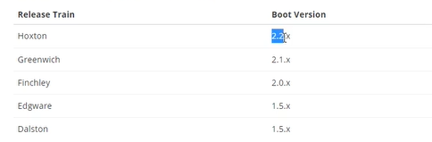

版本选择: 

Springboot: 2.2.2

SpringCloud: Hoxton.SR1

Cloud Alibaba: 2.1.0

### 1. 组件停更

SpringCloud老组件: 已经停更, 只修复bug,不再接受PullRequest,不在发布新版本

### 2. 微服务维度

1. 服务注册与发现
2. 服务负载和调用
3. 服务熔断降级
4. 服务网关
5. 服务分布式配置
6. 服务开发

## 二. 构建父工程

### 1. 创建/依赖版本选择

1. 创建一个maven工程

2. 添加依赖

* **Springboot依赖 **2.2.2

```xml
<dependency>
        <groupId>org.springframework.boot</groupId>
        <artifactId>spring-boot-dependencies</artifactId>
        <version>2.2.2.RELEASE</version>
        <type>pom</type>
        <scope>import</scope>
      </dependency>
```

* __SpringCloud依赖__ H.SR1

```xml
<dependency>
  <groupId>org.springframework.cloud</groupId>
  <artifactId>spring-cloud-dependencies</artifactId>
  <version>Hoxton.SR1</version>
  <type>pom</type>
  <scope>import</scope>
</dependency>
```

* **Spring-cloud-阿里巴巴** 2.1.0

```xml
<dependency>
        <groupId>com.alibaba.cloud</groupId>
        <artifactId>spring-cloud-alibaba-dependencies</artifactId>
        <version>2.1.0.RELEASE</version>
        <type>pom</type>
        <scope>import</scope>
      </dependency>
```

### 2. 其他依赖

```xml
<dependency>
    <groupId>mysql</groupId>
    <artifactId>mysql-connector-java</artifactId>
    <version>${mysql.version}</version>
</dependency>
<dependency>
  <groupId>com.alibaba</groupId>
  <artifactId>druid</artifactId>
  <version>${druid.version}</version>
</dependency>
<dependency>
  <groupId>org.mybatis.spring.boot</groupId>
  <artifactId>mybatis-spring-boot-starter</artifactId>
  <version>${mybatis.spring.boot.version}</version>
</dependency>
<dependency>
  <groupId>org.projectlombok</groupId>
  <artifactId>lombok</artifactId>
  <version>${lombok.version}</version>
</dependency>
```

## 三. 支付模块构建

### 1. 依赖实现

```xml
<dependencies>
    <dependency>
        <groupId>org.springframework.boot</groupId>
        <artifactId>spring-boot-starter-web</artifactId>
    </dependency>
    <dependency>
        <groupId>org.springframework.boot</groupId>
        <artifactId>spring-boot-starter-actuator</artifactId>
    </dependency>
    <dependency>
        <groupId>org.mybatis.spring.boot</groupId>
        <artifactId>mybatis-spring-boot-starter</artifactId>
    </dependency>
    <dependency>
        <groupId>com.alibaba</groupId>
        <artifactId>druid-spring-boot-starter</artifactId>
        <version>1.1.10</version>
    </dependency>
    <dependency>
        <groupId>mysql</groupId>
        <artifactId>mysql-connector-java</artifactId>
    </dependency>
    <dependency>
        <groupId>org.springframework.boot</groupId>
        <artifactId>spring-boot-starter-jdbc</artifactId>
    </dependency>
    <dependency>
        <groupId>org.projectlombok</groupId>
        <artifactId>lombok</artifactId>
    </dependency>
    <dependency>
        <groupId>org.springframework.boot</groupId>
        <artifactId>spring-boot-starter-test</artifactId>
    </dependency>
</dependencies>
```
### 2. web构建

一层层构建就行了

### 3. dev热部署

* 引入依赖

  ```xml
  <dependency>
      <groupId>org.springframework.boot</groupId>
      <artifactId>spring-boot-devtools</artifactId>
      <scope>runtime</scope>
      <optional>true</optional>
  </dependency>
  ```

* 给父工程引入插件

```xml
<build>
  <plugins>
    <plugin>
      <groupId>org.springframework.boot</groupId>
      <artifactId>spring-boot-maven-plugin</artifactId>
      <configuration>
        <fork>true</fork>
        <addResources>true</addResources>
      </configuration>
    </plugin>
  </plugins>
</build>
```

* 给idea添加选项: setting-compiler

  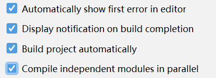

  按下ctrl+alt+shift+/ 选择registry,打钩

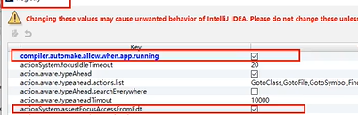

## 四. 订单模块**调用**支付模块

### 1. RestTemplate

最简单的方法就是用httpClient直接调用

`RestTemplate`来自spring-web,对httpclient进行封装

```java
@RestController
@Slf4j
public class OrderController {
    public static final String PAYMENT_URL = "http://localhost:8001";
    @Autowired
    private RestTemplate restTemplate;

    @GetMapping("/consumer/payment/create")
    public CommonResult<Payment> create(Payment payment){
        return restTemplate.postForObject(PAYMENT_URL + "/payment/create",payment,CommonResult.class);
    }
}
```

restTemplate默认发送json,所以接收方应该加上ResponseBody

## 技巧. 提取服务共享内容

先前两个工程共有entities包,造成冗余

提取一个模块来保存公有部分

### 1. 公用依赖:

提取进公有模块的pom

### 2. 共用代码:

提取进共用的模块

### 3. install并依赖

# 注册中心Eureka

## 一. 概念

### 1. 服务治理

在传统RPC远程调用框架中,管理每个服务和服务之间的依赖关系比较复杂,管理复杂,所以需要使用**服务治理**,管理服务与服务之间的依赖关系.可以实现<u>服务调用,负载均衡,容错</u>等,实现<u>服务发现和注册</u>

### 2. 服务注册与发现

* **服务注册:** 将服务信息注册进注册中心
* **服务发现:** 从注册中心上获取服务信息
* 本质: key-value存取服务
* **调用**: 底层就是httpClient

Eureka采用**CS的设计架构**,Server作为服务注册功能的服务器,作为<u>服务注册中心</u>

系统中的其他微服务使用<u>Eureka客户端</u>链接到<u>服务器</u>并维持心跳连接,这样维护人员就可以通过Duraka Server来监控系统中的微服务是否正常运行

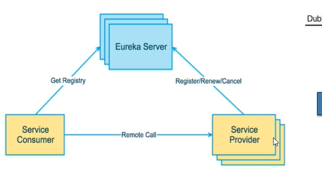

* **EurekaServer:** 各个微服务节点通过配置启动后在Server中进行注册,这样EurakaServer中的服务注册表中将存储所有可用服务节点的信息,可以在界面中直观看到
* __EurekaClient__: 是JAva客户端,用于简化和EurekaServer的交互; 客户端内置一个轮询负载算法的负载均衡器. 在应用启动后,将会向EurekaServer 发送心跳(默认30秒). 如果EurekaServer在多个周期内没收到心跳,会将该节点从服务注册中心移除(默认90s)

## 二. 服务端安装

### 1. 步骤

1. 建maven模块

2. 引入eureka Server依赖

   ```xml
   <dependency>
       <groupId>org.springframework.cloud</groupId>
       <artifactId>spring-cloud-starter-netflix-eureka-server</artifactId>
   </dependency>
   ```

3. 配置yml

   ```yml
   server:
     port: 7001
   eureka:
     instance:
       hostname: localhost
     client:
       # 不注册自己
       register-with-eureka: false
   #     自己是注册中心,维护服务,不检索
       fetch-registry: false
       service-url:
         # 设置服务端地址, 处理包括查询和注册服务
         defaultZone: http://${eureka.instance.hostname}:${server.port}/euraka
   ```

4. 给主启动类加`@EnableEurekaServer`

   ```java
   @SpringBootTest
   @EnableEurekaServer
   public class EurekaMain7001 {
       public static void main(String[] args) {
           SpringApplication.run(EurekaMain7001.class);
       }
   }
   ```

### 2. 启动

启动并访问7001页面观察是否成功

### 3. 注册支付模块(Provider)

* 引入pom

  ```xml
  <dependency>
      <groupId>org.springframework.cloud</groupId>
      <artifactId>spring-cloud-starter-netflix-eureka-client</artifactId>
  </dependency>
  ```

* 添加yml配置

  ```js
  eureka:
    client:
  	# 注册自己
      register-with-eureka: true
  	# 查找服务
      fetch-registry: true
      service-url:
        defaultZone: http://localhost:7001/eureka
  ```

* 给主启动类添加`@EnableEurekaClient`注解

* 注册的服务名即为配置的

  ```yml
  spring:
    application:
      name: cloud-payment-service
  ```

### 4. 注册消费模块(consumer)

* 引入客户端pom

  ```xml
  <dependency>
      <groupId>org.springframework.cloud</groupId>
      <artifactId>spring-cloud-starter-netflix-eureka-client</artifactId>
  </dependency>
  ```

* 修改yml

```yml
eureka:
  client:
    # 自己是否注册进eureka
    register-with-eureka: true
    # 抓取已有的注册信息,以便实现负载均衡
    fetch-registry: true
    service-url: http://localhost:7001/eureka
```

* 给主启动类添加`@EnableEurekaClient`注解
* 服务名为spring.application.name配置

### 5. 检查服务注册

进入localhost:7001查看

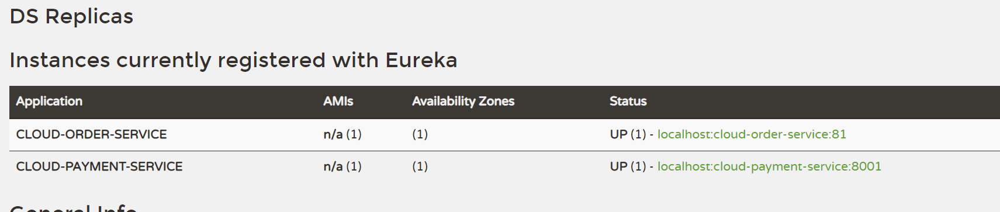

## 三. Eureka集群原理

### 1. 集群

微服务RPC远程服务调用最依赖__高可用__, 而Eureka最核心的部分是服务器,所以

首先要保证Server没有宕机,再保证Provider不会宕机

* 原理: 搭建Eureka服务器集群的原理, 即服务器之间__互相注册__,对外暴露出一个整体


### 2. 构建集群

创建7002模块,引入和7001相同的pom依赖

* 配置yml:

  * 主机名修改

    * 找到C:\Windows\System32\drivers\etc\hosts映射文件并添加映射

      ```
      127.0.0.1 eureka7001.com
      127.0.0.1 eureka7002.com
      ```

  * defaultZone改成要守望的服务域名(相互注册)

    ```yml
    server:
      port: 7002
    
    eureka:
      instance:
        hostname: eureka7002.com
      client:
        # 不注册自己
        register-with-eureka: false
    #     自己是注册中心,维护服务,不检索
        fetch-registry: false
        service-url:
          # 设置服务端地址, 守望另一台服务器
          defaultZone: http://eureka7001.com:7001/euraka
    ```

    

### 3. 服务配置进集群

需要对yml进行的修改:

在`eureka.service-url.defaultZone`需要注册集群中所有服务器的url,url之间用逗号分隔

```yml
eureka:
  client:
    register-with-eureka: true
    fetch-registry: true
    service-url:
      defaultZone: http://eureka7001.com:7001/eureka,http://eureka7002.com:7002/eureka
```

## 四. provider集群

### 1. 构建

创建module

将provider的pom复制进来

将yml也复制过去,修改端口,不用修改应用名

将业务逻辑复制过来

启动,eureka会按照应用名注册集群

### 2. 调用+负载均衡

对于服务的调用暂时只说一点点

就是将restTemplate访问的url从主机端口号形式,改为`服务名`形式

```java
//public static final String PAYMENT_URL = "http://localhost:8001";
  public static final String PAYMENT_URL = "http://CLOUD-PAYMENT-SERVICE";
```

然后根据服务名,restTemplate会前去查找

当服务提供一个集群时,需要配置restTemplate的负载均衡,以达到服务的负载均衡

```java
@Bean
@LoadBalanced
public RestTemplate getRestTemplate(){
    return new RestTemplate();
}
```

## 五. 服务发现

功能: 通过服务发现来获取eureka中的微服务信息

### 1.获取信息

在Controller中向外提供信息内容

1. 使用@Resource向**服务提供者**Controller中注入**DiscoveryClient**
2. 然后调用DiscoveryClient的方法即可获得信息

```java
// 获取服务列表
List<String> services = discoveryClient.getServices();
for (String service : services) {
    log.info("*****element" + service);
}
// 根据服务名获取服务信息, ServiceInstance接口
List<ServiceInstance> instances = discoveryClient.getInstances("CLOUD-PAYMENT-SERVICE");

```

```java
// ServiceInstance接口
public interface ServiceInstance {
    default String getInstanceId() {
        return null;
    }
    String getServiceId();
    String getHost();
    int getPort();
    boolean isSecure();
    URI getUri();
    Map<String, String> getMetadata();
    default String getScheme() {
        return null;
    }
}
```

3. 给**服务提供者**的主配置类添加`@EnableDiscoveryClient`

## 六. 自我保护

保护模式主要用于一组客户端和Eureka Server之间存在网络分区场景下的保护. **一旦进入保护模式,Eureka将会尝试保护服务注册表中的信息,不再删除服务信息**

也就是没有回复心跳的不会立即剔除,保证系统稳定性

### 1. 关闭自我保护

服务器配置: 

```yml
eureka.server.enable-self-perservation: false
eureka.server.eviction-interval-timer-in-ms: 2000
```

# 注册中心Zookeeper

跳过

# 服务调用Ribbon

### 1. 介绍

Ribbon是基于Netflix Ribbon实现的一套__客户端__,是__负载均衡的工具__

主要功能是提供__客户端的软件负载均衡算法和服务调用__

### 2.  与Nginx负载均衡的区别

Nginx是服务器负载均衡,所有请求终究会交给nginx

Ribbon是本地负载均衡,在调用微服务接口的时候,会在注册中心上获取注册信息服务列表之后缓存到JVM本地,从而在本地实现RPC远程服务调用技术

* __进程内LB__: 将LB逻辑集成到消费方,消费方从服务注册中心获知哪些地址可以用,然后自己再从地址选出一个合适的服务器,__集成于消费方__

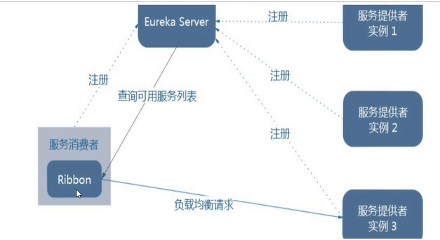

### 2. 工作流程

1. **选择EurekaServer(注册中心服务器)**,优先选择同一个区域负载比较少的server
2. 再根据用户指定的策略,在从server取到的服务注册列表中**选择一个地址**

## 二. 使用

### 1. 引入

pom: 引入`spring-cloud-starter-netflix-eureka-client`(之前引入eureka客户端的时候会一起引入,所以那时就已经形成ribbon负载均衡了)

单纯引入可以改成netflix-ribbon

### 2. 结合restTemplate

在配置RestTemplate上加@LoadBalanced就能实现负载均衡

## 三. 负载均衡算法

### 1. 接口

`IRule`接口

```java
public interface IRule {
    Server choose(Object var1);

    void setLoadBalancer(ILoadBalancer var1);

    ILoadBalancer getLoadBalancer();
}
```

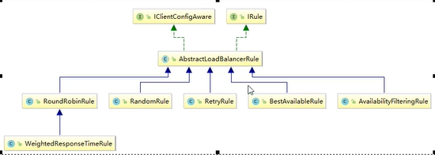

### 2. 替换

自定义一个配置类,但是不能成为子容器,即不能放在spring-boot能扫到的地方

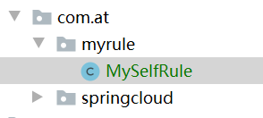

配置一个IRule

```java
@Configuration
public class MySelfRule {
    @Bean
    public IRule rule(){
        return new RandomRule();
    }
}
```

给主启动类添加RibbonClient注解

```java
@EnableEurekaClient
@RibbonClient(name="CLOUD-PAYMENT-SERVICE",configuration = MySelfRule.class)
//name: 要均衡的服务名,configuration: 那个配置类
@SpringBootApplication
public class OrderMain80 {
    public static void main(String[] args) {
        SpringApplication.run(OrderMain80.class);
    }
}
```

## 四. 负载均衡算法原理

### 1. 轮询原理

```
轮询: rest接口请求次数 % 服务器集群总数 = 实际调用服务器位置下标
// 从1开始
```

本地从客户端获取了ServiceInstance的List,然后用以上原理进行轮询

# 服务调用OpenFeign

## 一. 介绍

Feign是一个声明式WebService客户端,使用Fiegn能让编写WebService更简单

使用方法是定义一个服务接口然后在上面添加注解

OpenFeign在此前基础上增加了SpringMVC注解

## 二. 使用

引入feign的starter依赖,然后添加Enable注解

```java
@SpringBootApplication
@EnableFeignClients
public class CloudConsumerFeign81Application {

    public static void main(String[] args) {
        SpringApplication.run(CloudConsumerFeign81Application.class, args);
    }

}
```

# 服务熔断/降级Hystrix

## 一. 介绍

### 1. 简介

复杂分布式体系结构中依赖复杂,扇出大,容易失败超时,以至于雪崩

`NetFlex Hystrix`是一个用于处理分布式系统的**延迟和容错**的开源库; Hysrtrix能够保证在一个依赖出现问题的情况下不会导致整体服务失败,避免级联故障,提高分布式系统的弹性;

断路器本身是一种开关装置,当某个服务单元故障之后,向调用方放回一个符合预期的,可处理的备选响应(FallBack),而不是长时间的等待或者抛出调用方无法处理的异常

### 2. 概念

__服务降级__: **fallback**; 服务端不可用, 不让客户端等待并且能返回一个友好提示

* 情况: 异常,超时,服务熔断导致,线程池过量,信号量过量

**服务熔断**: **break**; 类似于保险丝达到最大访问服务后直接拒绝访问,然后调用服务降级

**服务限流**: **flowLimit**; 把一窝蜂的访问变成有序排队访问

## 二. 使用

### 1. 引入依赖并配置

依赖就是hystrix的springboot依赖

```yml
server:
  port: 8001

spring:
  application:
    name: cloud-provider-hystrix-payment

eureka:
  client:
    register-with-eureka: true
    fetch-registry: true
    service-url:
      defaultZone: http://eureka7001.com:7001/eureka
```

### 2. 服务降级

服务降级就是在超时,出错的情况下保证有一个默认的回复

在服务提供者主启动类上加`@EnableCircuitBreaker`

`@HystrixCommand`注解

* 情况1:超时降级

加在可能超时的<u>服务提供者</u>的方法上

```java
@HystrixCommand(
        fallbackMethod = "timingout", //处理的方法
        commandProperties = { //超时阈值
@HystrixProperty(name="execution.isolation.thread.timeoutInMilliseconds",value="2000")
        }
)
@GetMapping("/payment/hystrix/bad/{id}")
public String OUT(@PathVariable("id") Integer id){
    String s = paymentService.paymentInfo_OUT(id);
    log.info("*** result " + s);
    return s;
}

public String timingout(Integer id){
    return "ooooooooooooooooooooooooooooo";
}
```

* 情况2 错误降级

  如果按照上面的配置,那已经包含错误降级了

### 3. 调用者服务降级

即在等待的时候自己也在计时

在主启动类上添加@EnableHystrix

然后@HystrixCommand用法一模一样

### 4. 熔断

降级次数过多会引发熔断,到时候直接执行fallback方法

当删除链路的某个微服务出错不可用或者响应太长时间,会进行服务的降级,进而熔断该节点微服务的调用,快速返回错误的响应信息

当检测到该节点微服务调用影响正常后,恢复调用链路

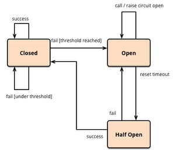

熔断的配置: 在之前@HystrixCommand注解中添加更多的@HystrixProperty即可完成配置

```java
 @HystrixCommand(
     fallbackMethod = "timingout",
     commandProperties = {
//是否开启
@HystrixProperty(name="circuitBreaker.enabled",value="true"),
//请求次数阈值
@HystrixProperty(name="circuitBreaker.requestVolumeThreshold",value="10"),
//时间窗口期
@HystrixProperty(name="circuitBreaker.sleepWindowInMilliseconds",value = "10000"),
//失败率达到多少跳闸
@HystrixProperty(name="circuitBreaker.errorThresholdPercentage",value="60")
 }
    )
// 解释: 在时间窗口期的n次以上访问 失败率达到多少跳闸
```

# 服务网关GateWay

## 一. 理论

### 1. 介绍

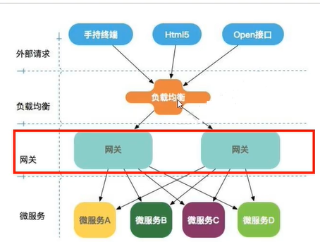

Gateway是基于异步非阻塞模型开发的

特点:

* 基于Spring5,Project Reactor,boot2.0
* 动态路由: 能够匹配任何请求属性
* 支持断言(Predicate)和过滤器

### 2. 概念

**Route(路由)**: 路由是构建网关的基本模块,由id,目标uri等构成

__Predicate断言__: 可以匹配HTTP请求中的所有内容,如果匹配则选择路由转发

__Filter过滤__: 指的是GatwayFilter使用过滤器可以在请求被路由前或者之后对请求修改

### 3. 引入依赖

首先将starter-web改成starter-webflux

```xml
<dependency>
    <groupId>org.springframework.cloud</groupId>
    <artifactId>spring-cloud-starter-gateway</artifactId>
</dependency>
```

### 

## 二. 路由

### 2. 路由

```yml
spring:
  application:
    name: cloud-gateway-service

  cloud:
    gateway:
      routes: # 以数组形式配置路由
        - id: payment_routt # 标识
          uri: http://localhost:8001 # 断言匹配后提供服务的uri地址
          predicates:
            - Path=/payment/lb/**
```

然后访问9527端口即可让其转发到8001

### 3. 硬编码配置路由

```java
@Bean
public RouteLocator routes(RouteLocatorBuilder routeLocatorBuilder){
    RouteLocatorBuilder.Builder routes = routeLocatorBuilder.routes();
    routes.route(
            "path_route1", //id
            r -> r.path("/guonei").uri("http://news.baidu.com/guonei")
    ).build();
    return routes.build();
}
```

### 4. 微服务名动态路由

我们想要使用网关来实现负载均衡,代替ribbon的中间件作用

所以不能将地址写死

```yml
cloud:
  gateway:
    discovery:
      locator:
        enabled: true # 开启创建动态路由的功能
    routes:
      - id: payment_routt
        uri: lb://cloud-payment-service
        predicates:
          - Path=/payment/hystrix/ok/**
```

## 三. predicate断言

### 1. 简介

Predicate限定拦截转发的请求,属性有多种,配置的模板如下:

```yml
spring:
	cloud:
		gateway:
			routes:
				- id:
				  url:
				  predicates:
				    - 属性名=属性值
```

### 2. 属性来源

属性来源于`RoutePredicateFactory`接口的实现类,每个实现类对应一种属性

### 3. 属性

* `After`: 满足在某某时间点之后的请求

> 时间的配置: 
>
> ```java
> public void main1() {
>     ZonedDateTime now = ZonedDateTime.now();
>     System.out.println(now);
> }
> ```

* `Before`: 在时间点之前,同理
* `Between`: 时间点之间,逗号分隔时间,同理
* `Cookie`: 携带Cookie的请求
  * 需要两个参数: 一个是Cookie名,一个是正则表达式,逗号分隔

```yml
predicates:
  - Path=/payment/hystrix/ok/**
  - After=2021-07-25T23:17:27.376923400+08:00[Asia/Shanghai]
  - Cookie=abc,1234
```

* `Header`: 请求头,两个参数,一个Header名,一个正则表达式

* `Host`:\*\*,\*匹配的主机路径
* `Method`
* `Path`
* `Query`

## 四. 过滤器

过滤器是Gateway中的实例,可以在请求被路由前后对请求修改

### 1. 分类

* pre前
* post后
* GatewayFilter局部
* GlobalFilter全局

### 2. 配置

局部filter的配置和predicate同级

```yml
cloud:
  gateway:
    discovery:
      locator:
        enabled: true # 开启创建动态路由的功能
    routes:
      - id: payment_routt
        uri: lb://CLOUD-PROVIDER-HYSTRIX-PAYMENT
        predicates:
          - Path=/payment/hystrix/ok/**
          - After=2021-07-25T23:17:27.376923400+08:00[Asia/Shanghai]
          - Cookie=abc,1234
        filters:
          - AddRequestParameter=abc,123
```

### 3. 自定义过滤器

编写放进容器就可以直接用全局过滤器了

```java
@Component
@Slf4j
public class MyLogGatewayFilter implements GlobalFilter, Ordered {
    @Override
    public Mono<Void> filter(ServerWebExchange exchange, GatewayFilterChain chain) {
        log.info("*******aa" + new Date());
        String uname = exchange.getRequest().getQueryParams().getFirst("uname");
        if(uname == null){
            log.info("????");
            exchange.getResponse().setStatusCode(HttpStatus.NOT_ACCEPTABLE);
            return exchange.getResponse().setComplete();
        }
        return chain.filter(exchange);

    }

    @Override
    public int getOrder() {
        return 0;
    }
}
```


# 配置中心Config

## 一. 是什么

大量的服务都需要必要的配置信息才能运行,所以一套集中式的,动态的配置管理设施必不可少

Config为微服务架构中的微服务提供集中化的外部配置支持,配置服务器位各个不同的微服务应用的所有环境提供了一个**中心化的外部配置**

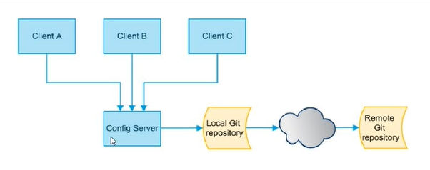


### 2. 内容

Config分为服务端和客户端两部分

服务端为分布式配置中心,是一个独立的微服务应用

整合GITHUB仓库使用全局配置中心

## 二. 使用

### 1. 准备工作

创建新的Github仓库

clone到本地

```xml
<dependency>
    <groupId>org.springframework.cloud</groupId>
    <artifactId>spring-cloud-config-server</artifactId>
</dependency>
```

配置:

```yml
server:
  port: 3344

spring:
  application:
    name: cloud-config-center
  cloud:
    config:
      server:
        git:
          uri: https://github.com/coolcheng222/springcloud-config.git
          username:
          password:
          search-paths:
            - springcloud-config
eureka:
  client:
    service-url:
      defaultZone: http://localhost:7001
```

```java
@SpringBootApplication
@EnableConfigServer
public class ConfigMain3344 {
    public static void main(String[] args) {
        SpringApplication.run(ConfigMain3344.class);
    }
}
```

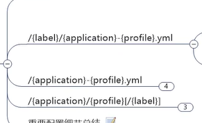

# 消息总线bus

## 一. 

bus能够解决config不能动态刷新的问题,所以Config一般和bug一起使用

就是用消息中间件通知bus发送post请求,替代手动post请求

# 消息驱动Stream

## 一. 介绍

### 1. 解决的问题

MQ(消息中间件)有多种实现,一个系统中可能存在多种MQ,对切换和维护增加了难度

消息驱动让我们不再关注MQ的细节,我们只需要一种适配绑定方式,自动给我们在MQ中切换; 类似jdbc

### 2. 绑定器Binder

Binder是一个接口,由各种厂商实现,目前仅有RabbitMQ,Kafka

### 3. 设计思想

