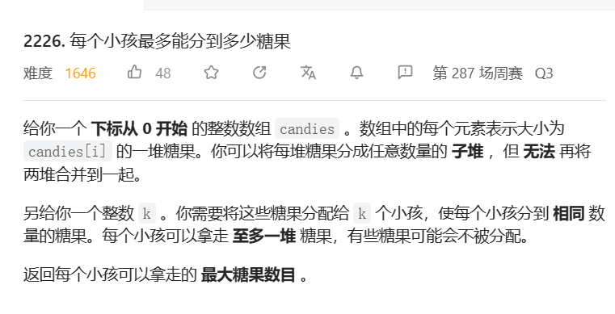

[TOC]

# 0. 二分查找通用

问题: 单调有序数组num,寻找小于target的最大值的位置

1. 首先提出`mid`

   * 如果mid的数字已经大于等于target,则不符合条件,往左寻找更小的值right = mid - 1
   * 不然就已经满足条件,向又寻找更大的值left = mid,不设置mid+1是考虑到mid已经符合条件,所以不能排除掉

2. 边界条件:

   由于每次只有+1-1,所以最后一次循环一定满足left == right

   如果此时仍然大于等于,则说明根本没有小于的位置,在进行一次改变后,right == -1

   如果此时小于target,说明已经找到,循环以后right == mid

3. 综上,最大值在right处取一定是正确的

```java
int left = 0;
int right = num.length;
int mid;
while(left <= right){
	mid = (left + right) / 2;
	if(num[mid] >= target){
		right = mid - 1;
	}else{
		// 这里可以舍弃mid的原因是,如果mid是满足条件的最大值,则最后一次匹配一定是在
        // left == right == mid+1,经过运作后,right--成为mid,满足条件
		left = mid + 1;
	}
}
return right;
```

4. 同样的,最小值应该在left处取,如果left值大于长度(等于数组长度+1),说明没有大于target的数

# 1. t1760袋子里最少数目的球

tag: `二分`

time: 2023年5月6日

[1760. 袋子里最少数目的球 - 力扣（LeetCode）](https://leetcode.cn/problems/minimum-limit-of-balls-in-a-bag/)


## 1.1 思考思路

首先,操作的一定是最大数,因为你永远不操作最大数的话,那最大值也不会变,如果你后续再操作最大数,那不如第一步就操作了,没有差别的.

难点在于如何操作最大数,盲目折半肯定是不行的,连示例1都过不了,枚举对这个数据量来说时间也是比较紧张

思考以下:(其实一般题目的题解真没有这么复杂的,只能说想的很痛苦)

`nums.length(后文简写为n)`代表数字的数量,

`maxOperations(后文简为o)`代表增加数字的数量

而`sum(nums)`是不变的

理论上来说,最理想的数字分配是`sum(nums) / (n + o)`(+1)

将这个值记为`avg`,准确的来说,是分配i个avg和j个avg+1,(i+j == length)可以达到非常平均的效果

但是实际上,有很多值已经低于了avg,无法达到指定的效果,那就需要其他地方进行补偿

* 如果有x个值小于avg,则,计算补偿值(其实这x个值可以直接开除出数组,因为绝不会影响最大值)

$$
comp = sum(nums) - \Sigma^x(avg+(1)-nums[x])
$$

* 补偿到哪里? 补偿到n+o-x的所有元素上

$$
avg_2 = (sum(nums)  - sum(x))/(n+o-x)
$$

再对n+o-x和avg_2再计算补偿,一直循环直到没有需要补偿为止

* 接下来将剩余的元素如下操作,循环直到操作数量截止:
  1. 取出最大值max
  2. 将max分成avg_n和max-avg_n

## 1.2 实现细节

其实吧,我就这么想想,我也没证明,先编码再说吧,不然完全没思路啊

### 1.2.1 计算补偿

从剩下的元素中,首先计算avg

```java
sum = 0;// 在完成补偿后,循环中sum的初值为comp
for(Integer num: list){
    sum += num;
}
avg = sum / (list.length + maxOperations);
extra = sum % avg; // 实际上计算了avg + 1的数量,
number = list.length + maxOperations - extra; // 计算了avg的数量
```

算一算,有x个值小于等于avg

如果x <= number,则comp = $\Sigma^x(avg - num[i])$=$x*avg-sum(num[i])$

如果x > number,则comp = $number * avg-sum(num[..number])$+$(x-number)(avg+1)-sum(num[number..x])$

=$x * avg+x-number-sum(num[i])$

```java
int count = 0;
Iterator iterator = list.iterator();
int sum1 = 0;
while(iterator.hasNext()){
    num = iterator.next();
    // 寻找小于等于avg的
    if(num <= avg){
        count++;
        sum1 += num;
        iterator.remove();
    }
    // 在题目中需要额外实现一个细节: 如果未进入if,则退出循环
}
int comp = count * avg - sum1;
if(count > number){
    comp += (count - number);
}
```

### 1.2.2 现状(待以后补完,现在依然不会)

令人震撼的是,虽然方法没有证明,但是剪枝的过程是毋庸置疑的正确,我们通过平均值把问题的规模缩小了很多,我们现在应该面对了一个比nums小得多的子数组,操作数不变,计算他需要的值

我们注意到,其实平均值大都可以被分裂取出,但是会在很多数字上出现"边角料",导致数字比平均值大

我们要保证剩余的边角料达到最小化

## 1.3 题解:二分查找

~~没有二分做题经验,再给我24小时也想不出来用二分解~~

https://leetcode.cn/problems/minimum-limit-of-balls-in-a-bag/solution/dai-zi-li-zui-shao-shu-mu-de-qiu-by-leet-boay/

问题转换: 给定maxOperation操作数,**能否**使得袋子里球最大数不超过y

> 根据评论区看,二分查找本质上能作用于有上下界的单调函数,在这题中,我们发现
>
> f(y) = maxOperation的映射是单调递减的,我们通过二分枚举y,来找到小于等于maxOperation的最大值
>
> 理论上来说__最大最小值,最小最大值__都可以用二分

> 其实仔细一想,能二分就能顺序遍历,但是二分更节省时间

f(y)如何计算呢?取任意一个数nums[i]

如果 (n-1)y< nums[i] <= ny,则maxOperation = n - 1

所以题解说,
$$
f(y) = \Sigma_i(\lfloor \frac{nums[i] - 1}{y}\rfloor)
$$
映射出来了,二分查找的方法就出来了:

由于是单调递减

如果f(y)的值小于等于maxOperation,**就暂定y是最优解(此时y必然是已遍历中的最优解)**,把左边的区间继续二分了

如果f(y)的值大于maxOperation,就向右寻找

当left > right时循环停止

```java
public int minimumSize(int[] nums, int maxOperations) {
    int left = 1;
    int right = Arrays.stream(nums).max().getAsInt();
    int y,fy;
    int res = 0;
    while(left <= right){
        y = (left + right) / 2;
        fy = 0;
        for(int i = 0;i < nums.length;i++){
            fy += (nums[i] - 1) / y;
        }
        if(fy <= maxOperations){
            res = y;
            right = y - 1;
        }else{
            left = y + 1;
        }
    }
    return res;
}
```

趁热打铁,再随机一道二分题

# 2. t300 最长递增子序列

tag: `二分`

[300. 最长递增子序列 - 力扣（LeetCode）](https://leetcode.cn/problems/longest-increasing-subsequence/)


## 2.1 思考编码: 动规

本来想找个二分题的,这题怎么看怎么动态规划,就先做一做吧

其实这题和那个"最长子字符串链"有那么一点像

对于任何位置nums[i],我要找到的是__nums[0..i]中小于nums[i]且以其为末尾的链最长__的那个值并加1
$$
dp[i] = max(dp[i],dp[j] + 1)
$$
这就随便做了,动规题里算简单的,数据实在太大还可以找个数据结构来排序,但是我是来做二分的

```java
class Solution {
    public int lengthOfLIS(int[] nums) {
        int[] dp = new int[nums.length];
        dp[0] = 1;
        int max = 1;
        for(int i = 1;i < nums.length;i++){
            dp[i] = 1;
            for(int j = 0;j < i;j++){
                if(nums[j] < nums[i]){
                    dp[i] = Math.max(dp[i],dp[j] + 1);  
                }
                
            }
            if(dp[i] > max){
                max = dp[i];
            }
        }
        return max;
    }
}
```

## 2.2 题解: 二分+贪心

~~这也太难想到了吧~~

我看了半天也看不出来二分在哪,还是看看题解罢

https://leetcode.cn/problems/longest-increasing-subsequence/solution/zui-chang-shang-sheng-zi-xu-lie-dong-tai-gui-hua-2/

重新设计一个状态`tails`,tails[k]代表**k+1长度的递增子序列的末尾数字**

状态转移的关键: 保证每次遍历中tails的数字都保持最小(贪心)

单调性质: k->tails[k]单调递增

---

迭代方式:

当迭代到nums[k],**二分**寻找到第一个tails[i] < nums[k],可以直接将nums[k]填入tails[i].如果nums[k] > tails[最大值],那直接填进tails去就行

**为什么它正确:**

tails并非是一个子序列数组,它的含义是任意k+1长度递增子序列的末尾数字,当找到数字大于前面的数字但小于当前末尾数字时,说明tails确实可以替换了,其他tails值都是不受影响的

---

二分详解:

这里找的是(**tails中大于等于num的最小值,等于代表可以直接原地替换,不用在找了**)

```java
public int lengthOfLIS(int[] nums) {
    int[] tails = new int[nums.length];
    tails[0] = nums[0];
    int res = 0;
    for (int i = 1; i < nums.length; i++) {
        // 二分找到最小的tails[x] >= nums[i]
        // tails单调增
        int left = 0;
        int right = res;
        int mid;
        int x = -1;
        while (left <= right) {
            mid = (left + right) / 2;
            if (tails[mid] < nums[i]) {
                left = mid + 1;
            } else {
                right = mid - 1;
            }
        }
        tails[left] = nums[i];
        if (left > res) {
            res++;
        }
    }
    return res + 1;
        }
```

## 3. t81 搜索旋转排序数组II

问题t33是它的子问题

[81. 搜索旋转排序数组 II - 力扣（LeetCode）](https://leetcode.cn/problems/search-in-rotated-sorted-array-ii/)

## 3.1 思考

这肯定要O(n)以内了,也就是直接二分

但是这个顺序也不是很顺序啊,不On也判断不出点来,怎么二分呢

现有信息: 数组,数组长度,目标数字,数组有序但是裂开了

1. 二分找出分歧点(分歧点x满足num[x] > num[x + 1],如果num数字都一样,不存在分歧点)

   我们来想想,一开始num[right] <= num[left],

   如果num[mid] > num[left]说明分歧点在mid右边

   如果num[mid] > num[right]也说明分歧点在右边

   反之,num[mid] < num[left]和num[mid] < num[right]都说明在左边

   只有一种情况,num[mid] == num[left] == num[right]比较离谱,把左右都遍历了得了

```java
public int findSep(int[] nums,int left,int right){
    if(right - left <= 1){
        //边界条件
        if(nums[left] > nums[right]){
            return left;
        }else{
            return -1;
        }
    }
    int mid = (left + right) / 2;
    if(nums[mid] > nums[mid + 1]){
        return mid;
    }
    // 情况1 确定在右边
    if(nums[mid] > nums[left] || nums[mid] > nums[right]){
        return findSep(nums,mid + 1,right);
    }else if(nums[mid] < nums[left] || nums[mid] < nums[right]){
        //情况2 确定在左边
        return findSep(nums,left,mid - 1);
    }else{
        // 情况3 可能左可能右
        int res1 = findSep(nums,mid + 1,right);
        int res2 = findSep(nums,left,mid - 1);
        if(res1 + res2 == -1){
            return -1;
        }else{
            return res1 + res2 + 1;
        }
    }
}
```

```java
public boolean search(int[] nums, int target) {
    int sep = findSep(nums, 0, nums.length - 1);
    //二分查找,f(x) = nums[(x + sep) % nums.length]
    //查找等于target的数
    int left = 0;
    int right = nums.length - 1;
    int mid;
    while(left <= right){
        mid = (left + right) / 2;
        if(nums[(mid + sep + 1) % nums.length] == target){
            return true;
        }else if(nums[(mid + sep + 1) % nums.length] < target){
            left = mid + 1;
        }else{
            right = mid - 1;
        }
    }
    return false;
}
```

执行用时：0 ms, 在所有 Java 提交中击败了100.00%的用户

内存消耗：42 MB, 在所有 Java 提交中击败了5.05%的用户

# 3. t1898 可移除字符的最大数目

tag: `二分`

time: 2023年5月7日

[1898. 可移除字符的最大数目 - 力扣（LeetCode）](https://leetcode.cn/problems/maximum-number-of-removable-characters/)


## 3.1 思考与思考

哈哈,这是我去年写的题目了,是属于提交但未通过,洋洋洒洒写了200多行,然后未通过

今年补了一些基础来看,这找最大k,很可能是二分问题,我们挖掘一下**映射关系** 吧

首先我们要求一个最大值是k,我们一般把k看成一种自变量

题目又有什么条件要满足? __p不是s的子序列__的条件下,取k的最小值
$$
f(k)=p\; sub\; s * 1
$$
单调递减,找等于1(为true)的k最大值

---

判断remove后是否为子串的代码:

```java
public boolean isIn(char[] s,char[] p){
    int pc = 0;
    if(s.length < p.length){
        return false;
    }
    // 简单粗暴的逐位匹配
    for(int i = 0;i < s.length;i++){
        if(p[pc] == s[i]){
            pc++;
        }
        if(pc >= p.length){
            return true;
        }
    }
    return false;
}
```

"移除"范围字母的代码

```java
public void toggle(char[] s,int[] removable,int left,int right){
    for(int i = left;i <= right;i++){
        // 异或一次就算移除了,再异或一次就移回来了
        s[removable[i]] ^= 0b111000;
    }
}
```

二分查找代码

```java
public int maximumRemovals(String s, String p, int[] removable) {
    int left = 0;
    int right = removable.length - 1;
    int mid;
    char[] s1 = s.toCharArray();
    char[] p1 = p.toCharArray();
    while(left <= right){
        mid = (left + right) / 2;
        // 开始的时候移除
        toggle(s1,removable,left,mid);
        if(isIn(s1,p1)){
            left = mid + 1;
        }else{
            right = mid - 1;
        }
        // 结束的时候移回来
        toggle(s1,removable,left,mid);
    }
    //最小值用left
    return left;
}
```

执行用时：39 ms, 在所有 Java 提交中击败了100.00%的用户

内存消耗：54.9 MB, 在所有 Java 提交中击败了36.57%的用户

* 好像是leetcode中这题题解最快的,第一次最快,骄傲自豪


# 4. m1708 马戏团人塔

[面试题 17.08. 马戏团人塔 - 力扣（LeetCode）](https://leetcode.cn/problems/circus-tower-lcci/)

tag: `贪心`,`二分`

time: 2023年5月8日

> 跟__最长递增子序列__相似的一题


## 4. 最长递增子序列

将身高降序排序,一样的身高按体重升序排序

然后求最长递减子序列

或者反过来求最长递增子序列

```java
class Solution {
    public int bestSeqAtIndex(int[] height, int[] weight) {
        List<Person> p = IntStream.range(0,height.length).mapToObj(i->new Person(height[i],weight[i])).
        collect(Collectors.toList());
        Collections.sort(p);
        int[] nums = p.stream().mapToInt(a->a.height).toArray();
        return lengthOfLIS(nums);
    }
        public int lengthOfLIS(int[] nums) {
        //..这里是最长递增子序列的代码
        }
}
```

# 5. o51 数组中的逆序对

tag: `线段树`,`二分查找`

time: 2023年5月21日

#### [剑指 Offer 51. 数组中的逆序对](https://leetcode.cn/problems/shu-zu-zhong-de-ni-xu-dui-lcof/)


## 5.1 思考: 线段树+排序+二分查找

21年做的,那时冒泡排序记录了一下次数,毫无疑问超时了

现在我掌握了更坚实的基础,可以来做一下了

> 构建线段树,储值为区间中逆序对的数量,最后树根的值就是结果
>
> 如果区间长度为1,返回0
>
> 如果不是这样的话,就:
>
> 1. 对左右两边分别进行__归并排序__(因为每一侧的区间必然已经一半一半的排好序了,只要从中间分开然后归并即可)
> 2. 对于每一个左边的数字num,使用二分法在右边寻找__比num小的最大值的坐标__

### 5.1.1  线段树的构建

参考`数据结构.md`对线段树的讲解

```java
public void build(int[] num,int left,int right,int index){
    // 长度为1的区间
    if(left == right){
        segment[index] = 0;
        return;
    }
    int mid = (left + right) / 2;
    build(num,left,mid,index * 2);
    build(num,mid + 1,right,index * 2 + 1);
    // 自底向上计算逆序数,除了两边的逆序数外,还有合成产生的逆序数(calc方法)
    // 会对num进行修改排序,如果不允许的话创建副本即可
    // 注意,我们已经保证left!=right
    segment[index] = segment[index * 2] + segment[index * 2 + 1] + calc(num,left,right);
}
```

### 5.1.2 归并排序

当方法来到calc(num,left,right),首先要对[left,mid],[mid+1,right]分别进行排序,由于这两个区间都折半排序过,归并排序应该是最快的

```java
// 升序排序
public void merge(int[] num,int left,int right){
    if(left == right) return;
    int mid = (left + right) / 2;
    int i = left,j = mid + 1;
    int[] temp = new int[right - left + 1];
    int cur = 0;
    // 一起移动阶段
    while(i <= mid && j <= right){
        if(num[i] < num[j]){
            temp[cur++] = num[i];
            i++;
        }else{
            temp[cur++] = num[j];
            j++;
        }
    }
    //单独移动阶段
    if(i > mid){
        while(j <= right){
            temp[cur++] = num[j++];
        }
    }
    if(j > right){
        while(i <= mid){
            temp[cur++] = num[i++];
        }
    }
    if (temp.length >= 0) System.arraycopy(temp, 0, num, left, temp.length);
}
```

### 5.1.3 二分查找

在右子树里寻找__大于等于number的最小数的坐标__,右子树升序排序

1. jdk api:

   jdk在Arrays和Collections中都提供了`binarySearch`

参数: `(数组,[from,to],key,[Comparator])`

其中Collections不能指定from,to,  Arrays的只能对对象使用Comparator

如果有key,返回坐标,不然返回这个:

```
res = -(insertion point) - 1
```

insertion point就是它应该插入的点,该点位有__大于key的最小值__,也就是说左边的点是__小于等于key的最大值__

所以在这里代码就是这样的

```java
for(int i = left;i <= mid;i++){
    number = num[i];
    // 寻找mid+1,right中>=number的最小数的坐标
    int i1 = Arrays.binarySearch(num, mid + 1, right + 1, number);
    // 存在i1,则i1为满足条件的
    if(i1 > 0){
        res += i1 - mid - 1;
    }else{
        i1 = -(i1 + 1);
        res += i1 - mid - 1;
    }
}
```

但是<u>很遗憾</u>,这个找的是大于number的最小值,未能去除重复的number,应该找**大于等于number的最小值才好**

2. 自己实现,升序数组寻找大于等于number的最小值

```java
/**
         * 寻找大于等于key的最小值
         * @param num
         * @param left
         * @param right
         * @param key
         * @return
         */
public int binarySearch(int[] num,int left,int right,int key){
    int mid;
    while(left <= right){
        mid = (left + right) / 2;
        if(num[mid] >= key){ //num都大于等于key了,说明是该位置或者左边的位置
            right = mid - 1;
        }else{
            left = mid + 1;
        }
    }
    return left ;
}
```

### 5.1.5 运行效果

执行用时：149 ms, 在所有 Java 提交中击败了5.03%的用户

内存消耗：52.7 MB, 在所有 Java 提交中击败了14.66%的用户

非常的慢啊非常慢,我换Arrays.sort看看,没什么差别

## 5.2 思考优化1: 归并查找同时进行

我们可以在归并的过程中,计算出两个之间的逆序数

另一方面,线段树是一次性的,我们不需要额外空间去存储结果

> 也就是在不用存储的情况下,线段树实质上就是子问题(区间)的归并过程罢了

归并状态下记录数量:

归并基本的代码保持

在选中左边时,说明右边的都比较大,正常进行

选中右边时,说明右边比左边的要小,这时需要把[i..mid]的数量加入res中

```java
public int binary(int[] nums,int left,int right){
    if(left == right){
        return 0;
    }
    int mid = (left + right) / 2;
    return binary(nums, left, mid)
        + binary(nums,mid + 1,right)
        + merge(nums,left,right);
}

private int merge(int[] nums, int left, int right) {
    if(left == right) return 0;
    int mid = (left + right) / 2;
    int i = left;
    int j = mid + 1;
    int[]temp = new int[right - left + 1];
    int cur = 0;
    int res = 0;
    while(i <= mid && j <= right){
        if(nums[i] <= nums[j]){

            temp[cur++] = nums[i];
            i++;
        }else{
            temp[cur++] = nums[j];
            j++;
            res += mid - i + 1;
        }
    }
    if(i > mid){
        while(j <= right){
            temp[cur++] = nums[j];
            j++;
        }
    }
    if(j > right){
        while(i <= mid){
            temp[cur++] = nums[i];
            i++;
        }
    }
    if (temp.length >= 0) System.arraycopy(temp, 0, nums, 0 + left, temp.length);
    return res;
}
```

执行用时：30 ms, 在所有 Java 提交中击败了88.82%的用户

内存消耗：53 MB, 在所有 Java 提交中击败了8.54%的用户

漂亮,很漂亮的解决了一道困难

# 6. t1439有序矩阵中的第 k 个最小数组和(未解决)

tag: 

time: 2023年5月28日

[1439. 有序矩阵中的第 k 个最小数组和](https://leetcode.cn/problems/find-the-kth-smallest-sum-of-a-matrix-with-sorted-rows/)


## 6.1 思考: 堆

第一项是显而易见的,求完后,我们用堆存储下__选取每行下一个值带来的差值__并按这个排序放进堆中

每次取出差值最小的,记为一个数组和,并把下一个项带来的数组和差值放入堆中

如此k-1次即可获得结果

> 每次放出之后,先记下差值,作为第x个数组和
>
> 然后的操作是:
>
> 1. 把

# 7. t2517 礼盒的最大甜蜜度

[2517. 礼盒的最大甜蜜度 - 力扣（LeetCode）](https://leetcode.cn/problems/maximum-tastiness-of-candy-basket/)


## 7.1 思考1: 二分

最小最大值,考虑二分

二分的内容:

以__甜蜜值__为二分内容,如果能找到k个数字的甜蜜度(绝对值差的最小值)大于mid,就往大找,不然往小找

> 寻找的过程:
>
> 需要k个数字,他们之间两两的差大于mid,首先我们可以排序,
>
> 从数字t开始,寻找后面第一个>mid+t的,记录下来
>
> 如果能找到k个这样的数字,说明存在k个两两差大于mid的,不然就是不存在

```java
class Solution {
    public int maximumTastiness(int[] price, int k) {
        if(price.length <= 1){
            return 0;
        }
        Arrays.sort(price);
        int left = 0,right = price[price.length - 1] - price[0];
        
        int pre,cur,count,mid;
        while(left <= right){
             mid = (left + right) / 2;
            pre = -1000000000;
            count = 0;
            for(int i = 0;i < price.length;i++){
                if(price[i] - pre > mid){
                    count++;
                    pre = price[i];
                }
            }
            if(count >= k){
                left = mid + 1;
            }else{
                right = mid - 1;
            }
        }
        return left;
    }
}
```

# 8. t2226 每个小孩最多能分到多少糖果

tag: `二分`

time: 2023年6月8日

[2226. 每个小孩最多能分到多少糖果 - 力扣（LeetCode）](https://leetcode.cn/problems/maximum-candies-allocated-to-k-children/)



## 8.1 思考: 二分

> 和第一道做的二分题十分的相似

问题转换:

每堆o个糖果数量和糖果的堆数y

f(o) = y,o越大y越小
$$
y=\Sigma(nums[i]/o)
$$
二分查找:

寻找y>=k时o的最大值

o从0到min(nums),特殊的,如果每堆糖果为0,说明找不到y>=k,则直接返回0

> 二分思维梳理:
>
> o->y单调递减,要求y>=k,寻找o最大值
>
> 也就是说,当我计算出y>=k时(也就是满足条件,我们应该得寸进尺),需要增大o,减小y(left = mid + 1)
>
> 否则我们就放宽条件right = mid - 1
>
> 最后我们应该停留在哪个位置? left一定会停留在一个不符合的位置,所以我们应该挑选right作为结果

```java
class Solution {
    public int maximumCandies(int[] candies, long k) {
        int right = 0;
        int left = 1;
        for(int i = 0;i < candies.length;i++){
            right = Math.max(candies[i],right);
        }
        int res = 0;
        int mid;
        long fo;
        while(left <= right){
            mid = (left + right) / 2;
            fo = calc(candies,mid);
            if(fo >= k){
                res = mid;
                // 符合条件
                left = mid + 1;
            }else{
                // 不符合条件
                right = mid - 1;
            }
        }
        return res;// 直接返回right也可
    }
    public long calc(int[]candies,int o){
        long res = 0;
        for(int i = 0;i < candies.length;i++){
            res += candies[i] / o;
        }
        return res;
    }
}
```

# 9. t668 [乘法表中第k小的数 

[乘法表中第k小的数 - 乘法表中第k小的数 - 力扣（LeetCode）](https://leetcode.cn/problems/kth-smallest-number-in-multiplication-table/solution/cheng-fa-biao-zhong-di-kxiao-de-shu-by-l-521a/)


## 9.1 思考: 二分

映射关系:

num数字大小->比num小的数字数量,正相关

自变量: num

因变量: 数量

* 子问题: 计算比num少的数量

1. 对于每一行i: 如果i * m<num,则m个全部计入

   也就是比num / m小的直接计入m

2. 对于i >= num / m,则可以用(num - 1) / i来计算

```java

class Solution {
    public int findKthNumber(int m, int n, int k) {
        int left = 1;
        int right = m * n;
        while(left <= right){
            int mid = (left + right) / 2;
            int count = 0;
            int extra = 0;
            for(int i = 1;i <= m;i++){
                if(n < mid / i){
                    count += n;
                }else{
                    count += (mid - 1) / i;
                    // System.out.println(mid + " " + i + " " + count);
                    if(mid % i == 0){
                        extra++;
                    }
                }
               
                if(count > k) break;

            }
            if(count < k){
                if(count + extra >= k){
                    return mid;
                }else{
                    left = mid + 1;
                }
            }else{
                right = mid - 1;
            }
        }
        return -1;
    }
}
```

执行用时：23 ms, 在所有 Java 提交中击败了6.47%的用户

内存消耗：38.1 MB, 在所有 Java 提交中击败了87.06%的用户

# 10. t2234 花园的最大总美丽值 

[2234. 花园的最大总美丽值 - 力扣（LeetCode）](https://leetcode.cn/problems/maximum-total-beauty-of-the-gardens/)


## 10.1 思考1: 二分查找

* 最少full的数量用以下方法计算:

已经full的踢出计算,对于每个flower[i],计算newFlowers -= target - 1 - flower[i],剩下的就是full的最小数量

* 最多full的数量用以下方式计算:

倒序排序,对于每一个flower[i],newFlowers -= target - flower[i],减完为止

---

枚举full的数量,确定full的数量和消耗之后剩余的记为`nf`,前`index`个未成为full

接下来使用二分查找确定最大的最小值

> 单调性映射: 分数y->花朵数量k

flower[0]<=k<target
$$
k=f(y)=\Sigma_i(y-arr[i]),arr[i]<y
$$

优化寻找y的方案:

预处理计算前缀和,用二分法找到__比y小的最大数的下标x__,满足
$$
x * y<=pre[x] + nf
$$
y即可成立,否则不成立

```java
class Solution{
    long[] pre;
    public long maximumBeauty(int[] flowers, long newFlowers,
                              int target, int full, int partial) {
        Arrays.sort(flowers);
        pre = new long[flowers.length];
        int n = flowers.length;
        int minC = 0,maxC = 0;
        long minF = newFlowers,maxF = newFlowers;
        for(int i = 0;i < flowers.length;i++){
            pre[i] = (i == 0?0:pre[i - 1]) + flowers[i];
        }
        boolean a = false;
        for(int i = n - 1;i >= 0;i--){
            if(flowers[i] >= target){
                minC++;
                maxC++;
            }else{
                a = true;
                minF -= target - 1 - flowers[i];
                maxF -= target - flowers[i];
                if(maxF >= 0){
                    maxC++;
                }
            }
        }
        if(minF > 0){
            minC += minF;
        }
        if(minC >= n) {
            if(!a) return (long) full * n;
            // System.out.println("aa");
            return Math.max(n * (long)full,(n - 1) * (long)full + (long)partial * (long)(target - 1));
        }
        long max = 0;
        long nf = newFlowers;
        for(int i = 0;i <= maxC;i++){
            if(i != 0){
                if(flowers[n - i] < target) nf -= target - flowers[n - i];
            }
            if(i >= minC){
                long res;
                long r = cal(flowers,nf,n - i - 1,target);
                res =  i * (long)full + (long)partial * r;
                max = Math.max(res,max);
            }
        }
        return max;
    }

    /**
         *
         * @param flower
         * @param nf
         * @param index
         * @return
         */
    public long cal(int[] flower,long nf,int index,int target){
        if(index < 0) return 0;
        long left = flower[0];
        long right = target - 1;
        while(left <= right){
            long mid = (left + right) / 2;
            int l = 0,r = index;
            int m;
            while(l <= r){
                m = (l + r) / 2;
                if(flower[m] < mid){
                    l = m + 1;
                }else{
                    r = m - 1;
                }
            }
            if(r == -1 || (r + 1) * mid <= pre[r] + nf){
                left = mid + 1;
            }else {
                right = mid - 1;
            }
        }
        return right;
    }
}
```

执行用时：330 ms, 在所有 Java 提交中击败了9.09%的用户

内存消耗：55.4 MB, 在所有 Java 提交中击败了22.73%的用户

对比一下大佬的做法

```java
for (int i = 0, x = 0; i <= n; ++i) { // 枚举后缀长度 n-i
    if (leftFlowers >= 0) {
        // 计算最长前缀的长度
        while (x < i && (long) flowers[x] * x - sumFlowers <= leftFlowers)
            sumFlowers += flowers[x++]; // 注意 x 只增不减，二重循环的时间复杂度为 O(n)
        var beauty = (n - i) * full; // 计算总美丽值
        if (x > 0) beauty += Math.min((leftFlowers + sumFlowers) / x, (long) target - 1) * partial;
        ans = Math.max(ans, beauty);
    }
    if (i < n) leftFlowers += target - flowers[i];
}

作者：endlesscheng
链接：https://leetcode.cn/problems/maximum-total-beauty-of-the-gardens/solution/by-endlesscheng-10i7/
来源：力扣（LeetCode）
著作权归作者所有。商业转载请联系作者获得授权，非商业转载请注明出处。
```

# 11. t4 寻找两个正序数组的中位数 


[4. 寻找两个正序数组的中位数 - 力扣（LeetCode）](https://leetcode.cn/problems/median-of-two-sorted-arrays/)

## 11.1 思考: 二分查找

首先,从`nums1`中二分查找挑选数字,假设我们需要第`k`小的数字,我们从nums1中挑选了`nums1[index]`

也就是说num前民已经有index个数字,而在两个数组中,num前有k-1个数字,nums2中应该有k-1-index个数字小于num

换言之,我们要找出`nums2`中下标`k-1-index`数字并对比,只要满足:

```java
(k-1-index <= 0 || nums2[k-1-index - 1] <= num) 
    && nums2[k-1-index] >= num
```

即可证明该数字是第k位

```java
class Solution {
    public double findMedianSortedArrays(int[] nums1, int[] nums2) {

        int n = nums1.length,m = nums2.length;
        if((n + m) % 2 == 0){
            return (((double)getK((n + m) / 2,nums1,nums2)) + getK((n + m) / 2 + 1,nums1,nums2)) / 2;
        }else{
            return (double)getK((n + m + 1) / 2,nums1,nums2);
        }
    }
    public int getK(int k,int[]nums1,int[] nums2){
        // 先找nums1
        int a1 = get2(k,nums1,nums2);
        // System.out.println(a1);
        if(a1 > -0.1) return a1;
        return get2(k,nums2,nums1);
    }
    public int get2(int k,int[]nums1,int[]nums2){
         // 先找nums1
        int left = 0,right = nums1.length - 1;
        int mid;
        int n = nums1.length,m = nums2.length;
        while(left <= right){
            mid = left + (right - left) / 2; 
            int num = nums1[mid];

            if(mid > k - 1){
                right = mid - 1;
            }else if(mid + m < k - 1){
                left = mid + 1;
            }else if(mid + m == k - 1 && (m == 0 || nums2[m - 1] <= num)){
                return num;
            }else{
                if((k-1-mid == 0 || nums2[k-1-mid - 1] <= num) 
    && nums2[k-1-mid] >= num){
                    return nums1[mid];
                }else if(k - 1 - mid != 0 && nums2[k - 1 - mid - 1] > num){
                    left = mid + 1;
                }else{
                    right = mid - 1;
                }
            }
        }
        return -9999;
    }
}
```

执行用时：1 ms, 在所有 Java 提交中击败了100.00%的用户

内存消耗：43.7 MB, 在所有 Java 提交中击败了7.48%的用户