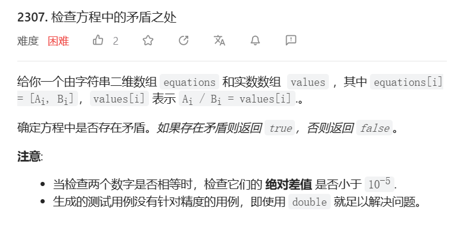

# 1. t201 数字范围按位与

tag: `位运算`

time: 2023年4月30日

[201. 数字范围按位与](https://leetcode.cn/problems/bitwise-and-of-numbers-range/)

### 1.1 思考与编码

每一位上只要有一个0就是0

> 若right - left >= 2^a,则结果必有a位为0
>
> 剩余位直接将left和right进行按位与即可

```java
class Solution {
    public int rangeBitwiseAnd(int left, int right) {
        int minus = right - left;
        int i;
        for(i = 0;;i++){
            if(minus == 0){
                break;
            }
            minus >>= 1;

        }
        int result = (left >> i) & (right >> i);
        result <<= i;
        return result;
    }

}
```

执行用时：3 ms, 在所有 Java 提交中击败了100.00%的用户

内存消耗：41.6 MB, 在所有 Java 提交中击败了5.07%的用户

### 1.2 题解: Brian Kernighan 算法

[数字范围按位与 - 数字范围按位与 - 力扣（LeetCode）](https://leetcode.cn/problems/bitwise-and-of-numbers-range/solution/shu-zi-fan-wei-an-wei-yu-by-leetcode-solution/)

算法名字:`Brian Kernighan 算法`

算法功能: 清除一个二进制数中最右边的1(将最右边的1置为0)

算法:

```java
x = x & (x - 1)
```

在本题中,题解使用Brian Kernighan 算法计算公共前缀,计算方法如下:

```java
while(m < n){
    n = n &(n - 1);
}
return n;
```

解释: 

1. 如果n的长度大于m,则这个过程只能进行到n == 0的情况下,也就是答案为0,事实也确实如此

2. 如果n的长度等于m,则他们应有一个公共前缀,n通过不断地将右边的1置为0来计算公共前缀

   >假设 m = 101101,n=10111,对其运算
   >
   >1: n=10110 > m
   >
   >2: n=10100 < m 此时的n为公共前缀,因为n此时代表这个前缀所拥有的最小值

# 2. t12 整数转罗马数字

[12. 整数转罗马数字](https://leetcode.cn/problems/integer-to-roman/)


### 2.1 就直接写呗

```java
class Solution {
    char[][] table = new char[][]{
        {'M','C','X','I',},
        {'\0','D','L','V'}
    };
    public String intToRoman(int num) {
        int division = 1000;
        StringBuilder stringBuilder = new StringBuilder();
        for (int i = 0;; i++) {
            int i1 = num / division;
            num = num % division;
            if(i1 == 9){
                stringBuilder.append(table[0][i]).append(table[0][i - 1]);
                i1 = 0;
            }else if(i1 == 4){
                stringBuilder.append(table[0][i]).append(table[1][i]);
                i1 = 0;
            }else if(i1 >= 5){
                stringBuilder.append(table[1][i]);
                i1 -= 5;
            }
            while(i1-- != 0){
                stringBuilder.append(table[0][i]);
            }
            if((division /= 10) <= 0){
                break;
            }
        }
        return stringBuilder.toString();
    }
}
```


# 3. t1275 井字棋的获胜者

tag: `位运算`

time 2023年5月3日


## 3.1 题解: 位运算

[Java - 位运算详解（使用位运算记录结果，代码简洁，0ms） - 找出井字棋的获胜者 - 力扣（LeetCode）](https://leetcode.cn/problems/find-winner-on-a-tic-tac-toe-game/solution/java-wei-yun-suan-xiang-jie-shi-yong-wei-yun-suan-/)

题目不难,我也懒于动手,但是社区题解真的让人眼前一亮

将棋盘转换为9位的二进制数000000000,每个选手的棋子对应一个数字1

当选手下在[i\]\[j]时,将i * 3 + j位转为1

```java
a |= 1 << (i * 3 + j)
```

在判断输赢时,横着赢是111000000,000111000,000000111,也就是7,56,56 * 8

竖着赢是100100100,010010010,001001001,也就是73,73 * 2,73 * 4

斜着赢是100010001,001010100也就是273,84

# 4. t149 直线上最多的点数

tag: `暴力`

time: 2023年5月5日

[149. 直线上最多的点数 - 力扣（LeetCode）](https://leetcode.cn/problems/max-points-on-a-line/)


## 4.1 数学性质思考

虽然题目里没说一定点是int,但是形参是这么定义的,所以点应该都是整数点

基本的数学原理: 平面点两两形成直线

* 一沓点能连成直线的充要条件:

  * 或者,计算出两两之间的函数式,符合函数式的能够落在直线上
    $$
    \frac{x-x_1}{x_2-x_1}=\frac{y-y_1}{y_2-y_1}
    $$

  不过这条件形成的方法乍一看都属于是一个枚举,暴力在困难题肯定是不可行的,我们还得再多想想.

那有没有简单方法证明点一定不在另外两个点形成的直线上呢?

算了,咱先把充要条件那个实现一下吧,感觉会超时,但再看吧

## 4.2 线性函数方法实现

建立一个类存储一条线的信息,那在最差条件下需要存储**299!**条线的信息,想想就离谱,不太可能这样解

但是可以试试:

```java
class Line{
    int x1;
    int x2;
    int y1;
    int y2;
    public Line(int[] a1,int[]a2){
        x1 = a1[0];
        y1 = a1[1];
        x2 = a2[0];
        y2 = a2[1];
    }
    public boolean isOn(int x,int y){
        return (x - x1) * (y2 - y1) == (y - y1) * (x2 - x1);
    }
    /**
         * 用这个方法在Map中匹配,一匹配一个准
         * @param o
         * @return
         */
    @Override
    public boolean equals(Object o) {
        if (this == o) return true;
        if (o == null || getClass() != o.getClass()) return false;
        Line line = (Line) o;
        int dx1 = this.x2 - this.x1;
        int dy1 = this.y2 - this.y1;
        int dx2 = line.x2 - line.x1;
        int dy2 = line.y2 - line.y1;
        if (dx1 * dy2 == dx2 * dy1 && this.isOn(line.x1,line.y1)) {
            return true;
        } else {
            return false;
        }
    }

    @Override
    public int hashCode() {
        if(x1 == x2){
            return Objects.hash(0);
        }
        double v = ((double) (y1 - y2)) / ((double) (x1 - x2));
        //            if(0.0 - v < 10e-6){
        //                v = 0.0;
        //            } // 嗯??我用这个不能过,用abs能过
        return Objects.hash(Math.abs(v));
    }
```

经过高人提点,知道了如果一条线上有一半以上点就能确定线了

```java
class Solution {
    Map<Line,Integer> map = new HashMap<>();
    public int maxPoints(int[][] points) {
        int max = 1;
        HashSet<Line> set = new HashSet<>();
        Line only = null;
        for(int i = 1;i < points.length;i++){
            set.clear();
            if(max > points.length / 2 && max > 2){
                boolean on = only.isOn(points[i][0], points[i][1]);
                if(on) max++;
                continue;
            }
            for(int j = 0;j < i;j++){
                Line line = new Line(points[i], points[j]);
                if(set.contains(line)){
                    continue;
                }
                if(map.containsKey(line)){
                    Integer res = map.get(line);
                    map.put(line,res + 1);
                    if(res + 1 > max){
                        max = res + 1;
                        if(max > points.length / 2 ){
                            only = line;
                        }
                    }
                }else{
                    if(max < 2){
                        max = 2;
                    }
                    map.put(line,2);
                }
                set.add(line);
            }
        }
        return max;
    }
}
```

执行用时：38 ms, 在所有 Java 提交中击败了18.52%的用户

内存消耗：46.2 MB, 在所有 Java 提交中击败了5.03%的用户

* 震惊,居然过了

## 4.2 优化方法

https://leetcode.cn/problems/max-points-on-a-line/solution/gong-shui-san-xie-liang-chong-mei-ju-zhi-u44s/

如这个题解,我们可以将Line中x的差值和y的差值取最大公约数,然后约去,就是斜率的最终形态,就可以用String替换Line对象,省了很多时间

# 5. t319 灯泡开关

tag:???

time: 2023年5月5日

[319. 灯泡开关 - 力扣（LeetCode）](https://leetcode.cn/problems/bulb-switcher/)


## 5.1 思考与编码

d[i]亮不亮取决于有多少因数,有偶数个因数就是灭的,否则亮的

考虑一个数字,它啥时候有奇数个因数?能开根为整数的时候!

so 问亮着的灯泡还有几个,就是1到n能开根的数量,也就是sqrt(n)

```java
class Solution {
    public int bulbSwitch(int n) {
        return (int)Math.sqrt((double)n);
    }
}
```

# 6. t829 连续整数求和

[829. 连续整数求和 - 力扣（LeetCode）](https://leetcode.cn/problems/consecutive-numbers-sum/)


## 6.1 思考与数学

这题我做了好多好多次,之前一次也没做出来,太笨了

已知我们要寻找`k`使得(等差数列求和)
$$
\frac{(x+y)k}{2} = n\\
x+y = 2n/k\\
x-y=k-1
$$

$$
x = (2n/k + k - 1)/2\\
y = (2n/k-k+1) / 2
$$

->
$$
2n >k^2-k\\
k < \sqrt{2n}+1/2\\
k <=\sqrt{2n}
$$

```java
class Solution {
    public int consecutiveNumbersSum(int n) {
        int count = 0;
        for(int k = 1;k * k <= 2 * n;k++){
            if((2 * n) % k != 0){
                continue;
            }
            if(((2 * n) / k - k) % 2 == 1){
                count++;
            }
        }
        return count;
    }
}
```

## 6.2 评论区题解1: 等差数列推导

https://leetcode.cn/problems/consecutive-numbers-sum/solution/lian-xu-zheng-shu-qiu-he-by-leetcode-sol-33hc/1593628

该评论提到了,所有x..x+i的和实际上等同于([0..i] + ix) == n

i就是数量k+1,同样是一种枚举数量的思路,上限也是$\sqrt{2n}$

## 6.3 评论区题解2: 很厉害的简化思路

```angelscript
int consecutiveNumbersSum(int N) {
    int res = 0;
    for (int i = 1; N > 0; N -= i++)
        res += (N % i == 0);
    return res;
}
```

这是一种什么思想呢,我们注意到`i`代表的实际上是长度

当i == 1 时,x = n,我们将n = n - i,进入下一次循环

当i == 2 时,x + x + 1 == n, n-1 = 2 * x,所以当n-1%2 == 0时,表明存在

后面同理

# 7. t1015 可被k整除的最小整数

tag: `数论`

time: 2023年5月10日

[1015. 可被 K 整除的最小整数 - 力扣（LeetCode）](https://leetcode.cn/problems/smallest-integer-divisible-by-k/)


## 7.1 题解

不会,看题解

基本理论:


第一个式子很好理解,第二个式子很好证明但是不符合直观印象

解题:

枚举(10x+1)mod k = (10x mod k+1 mod k) mod k

=(10 mod k * x mod k + 1) mod k

其中10mod k值固定,只有x需要枚举

算到这里就会了

moding[x+1] = (10 mod k * moding[x] + 1) mod k

然后就过了

```java
class Solution {
    public int smallestRepunitDivByK(int k) {
        if(k % 10 != 3 && k % 10 != 7 && k % 10 != 1 && k % 10 != 9){
            return -1;
        }
        if(k == 1){
            return 1;
        }
        int pre = 1;
        int count = 1;
        int ten = 10 % k;
        while(true){
            pre = (ten * pre + 1) % k;
            count++;
            if(pre == 0){
                return count;
            }
        }
        //            return -1;
    }
}
```

# 8. t2344 使数组可以被整除的最少删除次数

tag: `数论`

time: 2023年5月11日

[2344. 使数组可以被整除的最少删除次数 - 力扣（LeetCode）](https://leetcode.cn/problems/minimum-deletions-to-make-array-divisible/)


并不是困难题,用简单暴力就能解决

```java
class Solution {
    public int minOperations(int[] nums, int[] numsDivide) {
        Arrays.sort(nums);
        int pre = numsDivide[0];
        // 两两求出公约数,公约数的公约数为共同公约数
        for(int i = 0;i < numsDivide.length - 1;i++){
            int res = gcd(numsDivide[i],numsDivide[i + 1]);
            if(i == 0){
                pre = res;
            }else{
                pre =gcd(pre,res);
            }
        }
        for(int i = 0;i < nums.length;i++){
            if(pre % nums[i] == 0){
                return i;
            }
        }
        return -1;
    }
    public int gcd(int a,int b){
        return b == 0? a: gcd(b,a % b);
    }
}
```

# 9. t1330 翻转子数组得到最大的数组值 (绝对值)

tag: `数论`

time: 2023年5月12日

[1330. 翻转子数组得到最大的数组值 - 力扣（LeetCode）](https://leetcode.cn/problems/reverse-subarray-to-maximize-array-value/)


## 9.1 思考

假设翻转区域为*[left,right]*

翻转前的数组值为*res*

翻转结果为
$$
\begin{aligned}
res_n=&res\\-&abs(n[left]-n[left-1])+abs(n[right]-n[left-1])\\-&abc(n[right+1]-n[right])+abs(n[right+1]-n[left])
\end{aligned}
$$
然后..枚举一下不就行了吗z

然后就超时了,O(n^2)不行

## 9.2 社区题解

https://leetcode.cn/problems/reverse-subarray-to-maximize-array-value/solution/bu-hui-hua-jian-qing-kan-zhe-pythonjavac-c2s6/

根据社区题解,对于这四个值的绝对值有24种情况,对称性上除以2就是12种

(在边缘的情况单独枚举)

a=num[i-1]

b=num[i]

x=num[j]

y=num[j+1]

然后是一些引理:
$$
a+b-|a-b|=2min(a,b)\\
a+b+|a-b|=2max(a,b)
$$
于是简化为一组**最大值**和一组**最小值**的比较,一次给出4个,就是12/4=3种

1. max(a,b)<=min(x,y)
2. max(a,x)<=min(b,y)
3. max(a,y)<=min(b,x)

第一种:
$$
\begin{aligned}
res &= (x-a) + (y-b)+a+b-2max(a,b)-x-y+2min(x,y)\\
&=2min(x,y)-2max(a,b)
\end{aligned}
$$
第二种:
$$
\begin{aligned}
res&=(a-b)+(x-y)-a-x+2max(a,x)+b+y-2min(b,y)<=0
\end{aligned}
$$
第三种:
$$
0
$$
所以只有第一种会引发改变,枚举即可

# 10. t1072 按列翻转得到最大值等行数

tag: `位运算`

time: 2023年5月15日

[1072. 按列翻转得到最大值等行数 - 力扣（LeetCode）](https://leetcode.cn/problems/flip-columns-for-maximum-number-of-equal-rows/)


## 10.1 位运算思考

对于每一行,进行全1的位运算和全0的位运算可获得改变为题目要求的状态对应的值

但是题目规模太大,难以用整数来表示

我打算每8位用一个字符表示,合成字符串

```java
public int maxEqualRowsAfterFlips(int[][] matrix) {

    Map<String,Integer> map = new HashMap<>();
    int max = 0;
    for (int i = 0; i < matrix.length; i++) {
        StringBuilder sb1 = new StringBuilder();
        StringBuilder sb2 = new StringBuilder();
        // c1取反,c2取正
        int c1 = 0,c2 = 0;
        for (int j = 0; j < matrix[0].length; j++) {
            c1 <<= 1;
            c1 |= 1;
            c1 ^= matrix[i][j];
            c2 <<= 1;
            c2 ^= matrix[i][j];
            // 一个字符的末尾
            if(j % 8 == 7 || j == matrix[0].length - 1){
                sb1.append(c1);
                sb2.append(c2);
                c1 = 0;
                c2 = 0;
            }
        }
        String s1 = new String(sb1);
        String s2 = new String(sb2);
        Integer i1 = map.getOrDefault(s1, 0);
        if(i1 + 1 > max){
            max = i1 + 1;
        }
        map.put(s1,i1 + 1);
        Integer i2 = map.getOrDefault(s2, 0);
        if(i2 + 1 > max){
            max = i2 + 1;
        }
        map.put(s2,i2 + 1);
    }
    return max;
}
        
```

# 11. t1073 负二进制数相加

tag: `位运算`

time: 2023年5月18日

[1073. 负二进制数相加](https://leetcode.cn/problems/adding-two-negabinary-numbers/)


## 11.1 思考:真值表

1+0=1

0+0=1

1+1=?

没错,1+1=110直接进了两位啊,就比较可怕,我们来找个例子算算

然后发现还有一个,11+1=0,那就也有11+11=10

11111+101

=11100+100

=10000

算法:

> 长的在上,短的在下
>
> 从右往左两位一算
>
> 00+00=00
>
> 00+01=01
>
> 00+10=10
>
> 00+11=11
>
> 01+00=00
>
> 01+10=11
>
> 01+01=10 进位01
>
> 11+01=00
>
> 11+11=10
>
> 11+10=01 进位11
>
> 10+10=00 进位11
>
> 看式子,两个进位都不会重复出现,但是可以同时出现

真值表

| cd\ab | 00   | 01   | 10   | 11   |      |
| ----- | ---- | ---- | ---- | ---- | ---- |
| 00    | 0    | 0    | 1    | 1    |      |
| 01    | 0    | 1    | 1    | 0    |      |
| 10    | 1    | 1    | 0    | 0    |      |
| 11    | 1    | 0    | 0    | 1    |      |
|       |      |      |      |      |      |
|       |      |      |      |      |      |

高位:
$$
/a/bc+/ab(c\oplus d)+a/b/c+ab/(c\oplus d)
$$
低位:

| cd\ab | 00   | 01   | 10   | 11   |      |
| ----- | ---- | ---- | ---- | ---- | ---- |
| 00    | 0    | 1    | 0    | 1    |      |
| 01    | 1    | 0    | 1    | 0    |      |
| 10    | 0    | 1    | 0    | 1    |      |
| 11    | 1    | 0    | 1    | 0    |      |
|       |      |      |      |      |      |
|       |      |      |      |      |      |

$$
b\oplus d
$$

```java
public int abcd(int a,int b,int c,int d){
    int r1 = ~a&~b&c|~a&b&(c^d)|a&~b&~c|a&b&~(c^d);
    int r2 = b ^ d;
    return r1 *10 + r2;
}
```

```java
public int[] calc(int left1,int left2,boolean zo,boolean oo){
    int[] res = new int[3];
    if(left1 == 1 && left2 == 1){
        res[1] = 1;
    }
    if(left1 + left2 == 21 || left1 + left2 == 20){
        res[2] = 1;
    }
    //            if(res[1] + res[2] == 2){
    //                res[1] = 0;
    //                res[2] = 0;
    //            }
    int a = left1 / 10,b = left1 % 10,c = left2 / 10,d = left2 % 10;
    int res1 = abcd(a,b,c,d);
    a = res1 / 10;
    b = res1 % 10;
    if(zo){
        res1 = abcd(a,b,0,1);
        if(a == 0 && b == 1){
            res[1] = 1;
        }
    }
    a = res1 / 10;
    b = res1 % 10;
    if(oo){
        res1 = abcd(a,b,1,1);
        if(a == 1 && b == 0){
            res[2] = 1;
        }
    }
    if(res[1] + res[2] == 2){
        res[1] = 0;
        res[2] = 0;
    }
    res[0] = res1;
    return res;
}
```

```java
public int[] addNegabinary(int[] arr1, int[] arr2) {
    List<Integer> list = new LinkedList<>();
    boolean oo = false,zo = false;
    for(int i = 1;i <= arr1.length || i <= arr2.length;i += 2){
        int a = arr1.length - i >= 0? arr1[arr1.length - i]:0;
        int b = arr1.length - i - 1 >= 0? arr1[arr1.length - i - 1]:0;
        int c = arr2.length - i >= 0? arr2[arr2.length - i]:0;
        int d = arr2.length - i - 1 >= 0? arr2[arr2.length - i - 1]:0;
        int[] calc = calc(b * 10 + a, d * 10 + c, zo, oo);
        zo = calc[1] == 1;
        oo = calc[2] == 1;
        list.add(0,calc[0] % 10);
        list.add(0,calc[0] / 10);
    }
    if(zo){
        list.add(0,1);
    }
    if(oo){
        list.add(0,1);
        list.add(0,1);
    }
    while(list.size() > 1 && list.get(0) == 0){
        list.remove(0);
    }
    return list.stream().mapToInt(a->a).toArray();
}
```

# 12. t923 三数之和的多种可能

tag: `双指针`

[923. 三数之和的多种可能](https://leetcode.cn/problems/3sum-with-multiplicity/)


## 12.1 思考1

3个相同数的情况下: 最多一个解,需要target % 3 == 0且列表里有3个以上target / 3
$$
res = C_{count(i)}^3
$$
2个相同数:(需要保证第三个数和两个数不一样)

需要两个数且target-2i在数字中
$$
res=sum(C_{count(i)}^2*count(j))
$$
没有相同数:(需要保证递增,不然会重复)

找三个数相乘

```java
// 3个的
if(target % 3 == 0 && map.containsKey(target / 3) && map.get(target / 3) >= 3){
    result += combination(3,map.get(target / 3));
}
```

```java
// 2个的,1个的也放进去吧
for (Map.Entry<Integer, Integer> entry : map.entrySet()) {
    int count = entry.getValue();
    if(count >= 2 && map.containsKey(target - 2 * entry.getKey()) && target - 2 * entry.getKey() != entry.getKey()){
        result += combination(
            2,entry.getValue()
        ) * map.get(target - 2 * entry.getKey());
    }
    // 1个
    for (Map.Entry<Integer, Integer> entry2 : map.entrySet()) {
        if(entry2.getKey() <= entry.getKey()){
            continue;
        }
        int j = target - entry.getKey() - entry2.getKey();
        if(map.containsKey(j) && j > entry.getKey() && j > entry2.getKey()){
            result += entry.getValue() * entry2.getValue() * map.get(target - entry.getKey() - entry2.getKey());
        }
    }
}
```

## 12.2 社区题解1: 双指针

https://leetcode.cn/problems/3sum-with-multiplicity/solution/san-shu-zhi-he-de-duo-chong-ke-neng-by-leetcode/

`两数之和`问题:假设有序arr中元素互不相同,求i < j对,使得arr[i]+arr[j] = target

使用双指针可以在线性时间解决:

> i从左边开始,j从右边
>
> 如果arr[i]+arr[j] <target,则i+1
>
> 如果arr[i]+arr[j] > target,则j-1
>
> 如果arr[i]+arr[j]==target,记录,并i+1,j-1
>
> (i<j)

而在这题中,使用三指针,其中一个指针固定,另外两个指针形成双指针问题(记得先排序)

对于每个i,计算`T=target-arr[i]`,然后用剩下两个指针计算双指针问题

> 双指针,前两个操作同以前,不用考虑重复问题
>
> 但如果匹配上了,arr[j]+arr[k] == T,
>
> 1. 如果两者不相等,就要将j向右移,k向左移,计算arr[j]和arr[k]的数量

```java
https://leetcode.cn/problems/3sum-with-multiplicity/solution/san-shu-zhi-he-de-duo-chong-ke-neng-by-leetcode/
```

> 2. 如果两者相等,k在右端点,j在左端点,算组合数

$$
C_{(k-j+1)}^2
$$

> 我自己的想法:
>
> 1. 这相同的arr[i]的情况完全一样啊,可以记录然后复用
> 2. 单纯学一学这种思路,还是有用的
> 3. 看完了官方的方法3,就是我第一点说的那种差不多

# 13. 通用问题: 下一个排列

下一个排列是指:


数学上,我们知道,越靠前的数字对大小的影响越大,在我们尽量不缩小高位数字的同时,才能找到下一个排列

从右开始找`nums[i - 1] < nums[i]`,当找到时说明i-1的位置可以被换到后面去,换到__i..n中恰好比nums[i-1]大__的数字的位置上,然后对i..n进行__正序排序__可以保证获得最小值

# 14. 通用问题: 矩阵快速幂

## 14.1 快速幂

`a^n`计算

快速幂是一种分治思路,与其给n个a相乘,不如先a\*a,再a^2 \*a^2

比如:
$$
a^{10}=a^2*a^8
$$
步骤:

1. 将n二进制化,1位对应的就是二的倍数

2. 从右向左比较n

   如果是1,就乘上现在的a,不然就跳过

   无论如何,a*=a,n>>=1

```java
// 快速幂
int pow(int a,int n){
    int res = 1;
    while(n > 0){
        if((n & 1) == 1){
            res *= a;
        }
        a *= a;
        n >>= 1;
    }
}
```


## 14.2 矩阵快速幂

矩阵的幂次用快速幂思想计算,就是矩阵快速幂

由于矩阵满足结合律,所以是一样的

首先需要准确定义矩阵乘法

```java
class Matrix{
    int[][] matrix = null;
    int col;
    int row;
    public Matrix(int[][] matrix){
        if(martrix == null || matrix[0] == null || matrix[0].length == 0){
            return;
        }
       	this.matrix = matrix;
        row = matrix.length;
        col = matrix[0].length;
    }
    public Matrix mult(Matrix n){
        if(col != n.row) return null;
        int[][] res = new int[row][n.col];
        for(int i = 0;i < row;i++){ // 行
            for(int j = 0;j < n.col;j++){ //n.列
                for(int k = 0;k < col;k++){
                    res[i][j] = this.matrix[i][k] * n.matrix[k][j];
                }
            }
        }
		return new Matrix(res);
    }
    
}
```

## 14.3 应用: 斐波那契数列

F(n-1)+F(n) = F(n+1)

想找到一个矩阵A,使得
$$
[F(n)\;F(n-1)]A=[F(n+1)\;F(n)]
$$
易得

A = 1 1; 1 0

所以
$$
[F(n+1)\;F(n)]=[F(1)\;F(0)][11;10]^n
$$

```java
public int fib(int n) {
    if(n <= 1){
        return n;
    }
    Matrix a = new Matrix(new int[][]{
        {1,1},
        {1,0}
    });
    Matrix start = new Matrix(new int[][]{
        {1,0},
        {0,1}
    });
    Matrix res = new Matrix(new int[][]{
        {1,0}
    });
    while(n > 0){
        if((n & 1) == 1){
            start = start.mult(a);
        }
        a = a.mult(a);
        n >>= 1;
    }
    res = res.mult(start);
    return res.matrix[0][1];
}
```

# 15. t1835 所有数对按位与结果的异或和

tag: `位运算`

time: 2023年5月26日

[1835. 所有数对按位与结果的异或和](https://leetcode.cn/problems/find-xor-sum-of-all-pairs-bitwise-and/)

## 15.1 思考

$$
a\oplus b=/ab+a/b
$$

$$
(ab)\oplus(cd)=/(ab)cd+ab/(cd)=/acd+/bcd+ab/c+ab/d
$$

$$
/acd+/bcd+ab/c+ab/d,把c=b代入\\
/abd+ab/d=\\
b(a\oplus d)
$$

我们看到,这异或是有分配率的,异或也满足交换律结合律,所以确定第一个数组中的值,可以

(第二个数组异或的结果)&(第一个数组异或的结果)

# 16. t891 子序列宽度之和

[891. 子序列宽度之和 - 力扣（LeetCode）](https://leetcode.cn/problems/sum-of-subsequence-widths/)


## 16.1 思考: 排序+硬算

排序然后枚举最大值以及最小值,乘以中间的2^n即可

```java
int mod = (int)(1e9 + 7);
public int sumSubseqWidths(int[] nums) {
    Arrays.sort(nums);
    long count = 0;
    int n;
    long num = 1;
    for(int i = 0;i < nums.length - 1;i++){
        for(int j = i + 1;j < nums.length;j++){
            num = (nums[j] - nums[i]) % mod;
            for(int k = 0;k < j - i - 1;k++){
                num = num * 2;
                num = num % mod;
            }
            count += num % mod;
            count = count % mod;
            // System.out.println(num + " " + " " + count);
        }
    }
    return (int)count;
}
```

是超时的,因为O(n^2)

## 16.2 思考+评论区: 转化为线性

n^2是因为需要考虑nums[i]为最小值的情况,我们只需要提前把nums[i]的份减去即可

> 结果的构成: 
>
> 大的减去小的 * 2^i次方

> 当遍历到i时,需要做两件事:
>
> 1. 自己作为最大值: $+nums[i] *2^(012345...i-1)=nums[i]*(2^i-1)$
> 2. 自己作为最小值: -nums[i]*2(123...(n-i-2))

# 17. t446 等差数列划分 II - 子序列

[446. 等差数列划分 II - 子序列 - 力扣（LeetCode）](https://leetcode.cn/problems/arithmetic-slices-ii-subsequence/)


## 17.1 思考: 暴力匹配

每当一个数字进场时,它可以:

1. 和之前的每个数字组成一个有潜力的2长度子序列
2. 和之前的子序列组成等差序列

我们需要一个表,它可以满足:

1. 精确匹配下一个需要的数字
2. 保存等差数列中的差值
3. 保存当前长度

就选定一个`Map<Long,List<Long>>`

适当剪枝,先计算出数组的最大最小值,以便排除

```java
public int numberOfArithmeticSlices(int[] nums) {
    Map<Long,List<Long>> map = new HashMap<>();
    long min = 0x80000000;
    long max = 0x7fffffff;
    for(int i = 0;i < nums.length;i++){
        min = Math.min(min,nums[i]);
        max = Math.max(max,nums[i]);
    }
    List<Long> temp;
    int count = 0;
    for(int i = 1;i < nums.length;i++){
        if(map.containsKey((long)nums[i])){
            temp = map.get((long)nums[i]);
            map.remove((long)nums[i]);
            for(long t:temp){
                long next = nums[i] + t;
                count++;
                if(!(next > max || next < min)){
                    add(map,next,t);
                }
            }
            if(map.containsKey((long)nums[i])){
                temp.addAll(map.get((long)nums[i]));
            }

            map.put((long)nums[i],temp);
        }
        for(int j = 0;j < i;j++){
            long diff = (long)(nums[i]) - nums[j]; 
            long next = (long) nums[i] + diff;
            if(!(next > max || next < min)){
                add(map,next,diff);
            }
        }
    }
    return count;
}
```

答案正确的,但是内存爆了

## 17.2 思考2: 优化一下

[1,1,1,1,1,1,1,1,1,1,1,1,1,1,1,1,1,1,1,1,1,1,1,1]

考虑这样重复的,我们应不应该直接记录

__需要nums[i]的(数量,差值)数对__来减少开销

`Map<Integer,Map<Integer,Integer>>`: nums[i]->diff->count

```java
public int numberOfArithmeticSlices(int[] nums) {
    Map<Long,Map<Long,Integer>> map = new HashMap<>();
    long min = 0x80000000;
    long max = 0x7fffffff;
    for(int i = 0;i < nums.length;i++){
        min = Math.min(min,nums[i]);
        max = Math.max(max,nums[i]);
    }
    Map<Long,Integer> temp;
    int count = 0;
    for(int i = 1;i < nums.length;i++){
        if(map.containsKey((long)nums[i])){
            temp = map.get((long)nums[i]);
            map.remove((long)nums[i]);
            for (Map.Entry<Long, Integer> entry : temp.entrySet()) {
                long next = nums[i] + entry.getKey();
                count += entry.getValue();
                if(!(next > max || next < min)){
                    add(map,next,entry.getValue(),entry.getKey());
                }
            }
            if(map.containsKey((long)nums[i])){
                for (Map.Entry<Long, Integer> entru : map.get((long) nums[i]).entrySet()) {
                    if(temp.containsKey(entru.getKey())){
                        temp.put(entru.getKey(),temp.get(entru.getKey()) + entru.getValue());
                    }else{
                        temp.put(entru.getKey(),entru.getValue());
                    }
                }
            }

            map.put((long)nums[i],temp);
        }
        for(int j = 0;j < i;j++){
            long diff = (long)(nums[i]) - nums[j];
            long next = (long) nums[i] + diff;
            if(!(next > max || next < min)){
                add(map,next,1,diff);
            }
        }
    }
    return count;
}
public void add(Map<Long,Map<Long,Integer>> map,long next, int count, long diff){
    if(!map.containsKey(next)){
        map.put(next,new HashMap<>());
    }
    map.get(next).put(diff,count + map.get(next).getOrDefault(diff,0));
}
```


执行用时：187 ms, 在所有 Java 提交中击败了60.81%的用户

内存消耗：172 MB, 在所有 Java 提交中击败了5.40%的用户

# 18. t2307 检查方程中的矛盾之处

[2307. 检查方程中的矛盾之处 - 力扣（LeetCode）](https://leetcode.cn/problems/check-for-contradictions-in-equations/)



## 18.1 思考: 暴力

记录一个5*5的记录除法结果,由于没有0.0,计算结果一定有倒数

每次遇到一个式子a/b,检查正反面的计算有无结果,如果有则对比,出现矛盾返回false

检阅以a为底的每一个结果c/a,组合成为c/b,加入队列,执行相同的判断操作

检阅每一个以b为头的结果b/d,组合为a/d,加入队列,执行相同操作

# 19. t89 格雷编码

tag: `位运算`

time: 2023年7月26日

[89. 格雷编码 - 力扣（LeetCode）](https://leetcode.cn/problems/gray-code/)


## 19.1 思考:回溯

第一位是0,1

第二位是_第一位+1+第一位倒序_

以此类推

## 19.2 思考2: 直接映射

题解来自我去年写得代码

```java
class Solution {
    public List<Integer> grayCode(int n) {
        n = n + 1;
        int []arr = new int[n];
        int count1 = 1;
        for(int i = 0;i < n;i++){
            arr[i] = count1;
            count1 <<= 1;
        }
        List<Integer> res = new ArrayList<>();
        res.add(0);
        int pre = 0;
        for(int i = 1;i < arr[n - 1] ;i++){
            for(int j = 0;;j++){
                if((arr[j] & i) != 0){
                    pre ^= arr[j];
                    break;
                }
            }
            res.add(pre);
        }
        return res;
    }
}
```

这个结果暴力的使用了格雷码的定义,每次改变一位

对于第index个(从0开始,但0不用计算)数字所需要改变的位置,那就是该下标index最右边一个1的位置

$$
res[i] = res[i-1]\oplus lowbit(i)
$$

## 19.3 思考3: 推导公式

我们得到了res的递推公式,能否直接映射呢
$$
res[i]=0\oplus lowbit(1)\oplus lowbit(2)..,.\oplus lowbit(i) 
$$
我们推算一下,第二(从1开始)位的数字

该位数字和`i及以下xmod4..2`的数量的奇偶性有关

1. 如何检查`i mod 4`有没有大于等于2?

   只需要判断i第二位是否为1

2. 如何检查结果的奇偶性?

   |               | i的第三位为:1 | 0    |
   | ------------- | ------------- | ---- |
   | i的第二位为:1 | 0             | 1    |
   | 0             | 1             | 0    |

也就是说,__结果的第二位=i第二位^i第三位__
$$
res=i\oplus i>>1
$$
