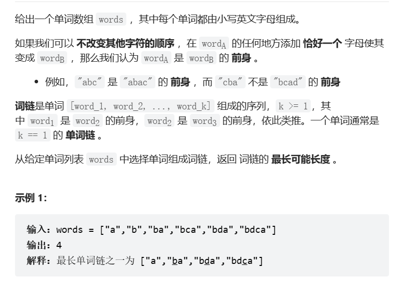
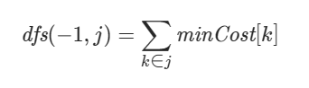

[TOC]


 # 1. t1105 填充书架

tag:`DP`,`DFS`

time: 2022-04-23


## 1.1 题目信息 

> 时间: 2023年4月23日
>
> 性质: 每日一题

[1105. 填充书架 - 力扣（LeetCode）](https://leetcode.cn/problems/filling-bookcase-shelves/)


## 1.2 尝试

### 1.2.1 简单DFS

一开始看到题目,就能想到运用DFS的方法,

对每一本书都进行一次"放这一层(放得下)/放下一层"的枚举,然后进行递归(每次递归都能遍历完一层的容量).

但是掐指一算,2^n的时间复杂度应该会导致超时,先写出代码试试,之后再优化

* 递归代码实现:

```java
//start: 计算从start位置的书开始
//[thickness, height]
public int minHeight(int[][] books, int start, int shelfWidth){
```

```java
    // 边界条件检查
	if(start >= books.length){
        return 0;
    }
    if(start + 1 >= books.length){
        return books[start][1];
    }
```

```java
    int remained = shelfWidth; // 剩余的width
    int thisHeight = 0; // 当前层的高度
    int result = 0xffffff; // 结果(当前层高度加下一层最低高度)
    int temp; // 万能temp

	//这里将当前书本放到新的一层上(第一层必然拥有第一本书)
    remained -= books[start][0];
    thisHeight = books[start][1];
```

```java
int i;
for (i = start + 1; i < books.length; i++) {
    if(remained < books[i][0]){
        //如果当前书都放不下了,直接转交给下一层
        return Math.min(result,thisHeight + minHeight(books,i,shelfWidth));
    }else{
        //如果放的下,可以选择性交给下一层
        temp = thisHeight + minHeight(books,i,shelfWidth);
        if (temp < result){
            result = temp;
        }
        //也可以放这一层
        remained -= books[i][0];
        thisHeight = Math.max(books[i][1], thisHeight);

    }
}
```

```java
// 边界: 最后一层,可能返回自身的高度
if(result > thisHeight){
    return thisHeight;
}
return result;
```

* 实现中曾出现的错误:
  * 将start和i混淆
  * 忘记最后一层的边界条件,忘记将每层的首本书固定
* 代码运行结果: 超时,第七个样例

### 1.2.2 DP(优解)

一开始想到DFS而不是DP是因为我对DP的思维模式还不熟悉,还需努力

创造一个数组DP[k]代表前k本书能够获取的最小值

> DP[0] = books\[0\]\[1\]
>
> DP[i + 1] = min{max(书本高度,层高度)(条件是能放下) + DP[pre],放这一层:DP[i] + books[i+1\]\[1]}

整理一下得

> DP[i + 1] = min{DP[pre] + max{books[pre..i +1]},DP[i] +books[0]\[1]}}
>
> 其中,books[pre..i + 1]的总宽度不大于maxWidth

在编码过程中,发现问题并修改

>1. 在求解过程中,对是否**和第一本书共用一层**的判断非常复杂(会导致pre=-1),所以将DP[0] = 0,书本从DP[1]开始计算,其他不用修改

```java
//保持提供的函数
public int minHeightShelves(int[][] books, int shelfWidth) {
    int[] dp = new int[books.length + 1];
    dp[0] = 0;//初始化

    int next; // 表示留到下一层
    int stay; // 表示放在这一层
    int remained;
    int height;
```

```java
for(int i = 1; i < dp.length; i++){ //i-1是当前书本的books序号
    // 下一层值简单
    next = dp[i - 1] + books[i - 1][1];
    //保留在这一层就要枚举出pre的值
    remained = shelfWidth - books[i - 1][0]; // 除去当前书,该层还能留下多少
    stay = 0xffffff;
    height = books[i - 1][1]; // 保存当前层高度
    for(int j = i - 2;j >= 0;j--){ // j是当前选择书的序号!j+1才是dp对应的序号
        if(remained < books[j][0]){
            //剩余的小于书的宽度,结束循环
            if(height + dp[j + 1] < stay){
                stay = height + dp[j + 1];
            }
            break;
        }else{
            // j书被迭代到就意味着被放入下一个架子,
            if(books[j][1] > height){
                height = books[j][1];
            }
            remained -= books[j][0];
            if(height + dp[j] < stay){
                stay = height + dp[j];
            }
        }
    }
    dp[i] = Math.min(next,stay);
}
return dp[books.length];
```

> 遇到的问题:
>
> 1. 在修改dp序号后,dp的序号和books的序号存在不对应问题(i<-->i-1),这让j的使用令我产生了巨大的困惑,应该在定义前清晰认识每个变量的实际含义

> 运行结果:
>
> 执行用时：0 ms, 在所有 Java 提交中击败了100.00%的用户
>
> 内存消耗：41 MB, 在所有 Java 提交中击败了38.93%的用户

官方题解: 思路基本一致

# 2. t1048 最长子字符串链

tag: `DP`

time: 2023年4月27日

[1048. 最长字符串链 - 力扣（LeetCode）](https://leetcode.cn/problems/longest-string-chain/)



## 2.1 思考与编码

### 2.1.1 动态规划推断

散乱想法:

* 假设words[0..i-1]的长链已经计算完毕,则words[i]所在的最长字母链一定在
  $$
  max(dp[前身]) + 1
  $$
  其中,dp[k]为words[0..k]中dp[k]所在最长字母链的长度

* 所以是否只要对dp数组倒序排序排序就行?

  数据结构: dp:{int index,int length}

* ~~但是我不知道这是不是严格的动态规划~~
* 补充: 题目没有保证words从短到长排序,需要先对words排序

> 伪代码:(O(n^2 * m(单词最大长度)))
>
> 遍历 i 从 0 到 words.length:
>
> ​	对已经排序的dp数组进行遍历(j):
>
> ​		如果words[dp[j].index]是words[i]的前身:
>
> ​			dp[i].length =  dp[j].length + 1;
>
> ​			将dp[i]按序插入
>
> 到最后,dp[0].length就是最大串的长度

```java
class Solution {
    public int longestStrChain(String[] words) {
        if(words.length == 0){
            return 0;
        }
        Arrays.sort(words, Comparator.comparingInt(String::length));
        // 倒序排序
        LinkedList<DP> dps = new LinkedList<>();
        for(int i = 0;i < words.length;i++){
            // 最大前身
            int max = 1;
            boolean flag = true;
            DP dp = null;
            for(int j = 0;j < dps.size() && flag;j++){
                dp = dps.get(j);
                if(isBefore(words[dp.index],words[i])){
                    max = dp.length + 1;
                    flag = false;
                }
            }
            enList(dps,new DP(i,max));
        }
        return dps.get(0).length;
    }
```

运行结果:

执行用时：1320 ms, 在所有 Java 提交中击败了5.23%的用户

内存消耗：41.9 MB, 在所有 Java 提交中击败了7.33%的用户

* 评价与问题:
  * 基本等于超时,时间空间方面全败
  * 第一次编码时未考虑到words长度没有排序
* 问题原因猜想:
  * 在两重循环内进行长度为m的比较,时间达到了n\*n\*m的级别,确实太大了,在查找前身过程中消耗了O(mn)的时间水平

### 2.1.2 优化前身查找

考虑到每个word的长度最大为16,,也就是对于任意word,它的前身最多只有16种可能

如果将word[0..i-1]都放入HashSet中,只需要比较O(m)次即可获得所有前身,远胜过之前的O(nm)次

转换为HashMap的val值存储length即可,而按序存储的dp数组也可以被放弃,因为只需要从16次中寻找最大值即可

```java

public int longestStrChain(String[] words) {
    if(words.length == 0){
        return 0;
    }
    Arrays.sort(words, Comparator.comparingInt(String::length));
    HashMap<String, Integer> map = new HashMap<>();
    // 定义一个总领全局的max,以便最后返回最大值
    Integer max = 1;
    for(int i = 0;i < words.length;i++){
        Integer tempMax = 1;
        Integer val;
        for (int j = 0;j < words[i].length();j++){
            //从可能性中枚举前身
            val = map.get(words[i].substring(0,j) + words[i].substring(j + 1));
            if(val != null && val + 1 > tempMax){
                tempMax = val + 1;
            }
        }
        map.put(words[i],tempMax);
        if(tempMax > max){
            max = tempMax;
        }
    }
    return max;
}
```

运行结果:

执行用时：39 ms, 在所有 Java 提交中击败了74.87%的用户

内存消耗：41.6 MB, 在所有 Java 提交中击败了24.60%的用户

* 评价与问题: 
  * 效果还行,就是substring可能占用太多空间了
  * 出现过问题,对去掉一个字符的操作的边界判断出错

# 3. t213 打家劫舍II

tag:`DP`

time: 2023年5月1日

[213. 打家劫舍 II - 力扣（LeetCode）](https://leetcode.cn/problems/house-robber-ii/)


## 3.1 思考与编码(DP)

说实在的,我看了题目给的tag才知道用动态规划的,然后还想了好久才想出来怎么冬天规划

### 3.1 子问题1: 去掉0和n-1的相邻计算

先做一个子问题,如果没有这个"围成一圈",只是线性相邻的数组nums[n],该如何计算呢

这也是动态规划问题,设置数组`dpSub[n + 1]`,其中dpSub[i]代表该问题输入nums[0..i - 1]时打家劫舍获得的最大值
$$ {left}
\begin{aligned}
&dpSub[0] = 0\\
&dpSub[1] = nums[0]\\
&dpSub[i + 1] = max(dpSub[i],dpSub[i - 2] + nums[i])
\end{aligned}
$$

### 3.2 动态规划1(错误思路)

该题本身亦使用动态规划:

设`dp[i]` 为该问题输入nums[0..i-1]时打家劫舍获得的最大值,当nums[i]加入问题后,出现这样的选择:

* 选择nums[i]加入计算,但是nums[i]会将nums[i - 1]和nums[0]屏蔽,最终最大值为`num[1..i-2]的子问题1的解`加上nums[i\]\(可见i的值应该从3计算起)
* nums[i]不加入计算,dp[i + 1] = dp[i]

设`dpSub[i]`为__子问题1__输入nums[1..i]时打家劫舍获得的最大值
$$
\begin{aligned}
&dpSub[0] = 0\\
&dpSub[1] = nums[1]\\
&dpSub[i + 1] = max(dpSub[i],dpSub[i - 1] + nums[i + 1])
\end{aligned}
$$

$$
\begin{aligned}
&dp[0] = 0\\
&dp[1] = nums[0]\\
&dp[2] = max(nums[0],nums[1])\\
&dp[i + 1] = max(dp[i],dpSub[i - 2] + nums[i])
\end{aligned}
$$

> 须注意,当nums遍历到i序号时,应该更新dp[i + 1]和dpSub[i]的值,注意对应

**但是想法错了,其实nums[i]不加入计算的dp[i+1]=dpSub0[i-1],其中dpSub0[i]是nums[0..i -1]的子问题1的解**

### 3.2 动态规划2

将上一个思路的dpSub原封不动搬过来,改名为dpSub1;

设`dpSub1[i]`为__子问题1__输入nums[1..i]时打家劫舍获得的最大值
$$
\begin{aligned}
&dpSub1[0] = 0\\
&dpSub1[1] = nums[1]\\
&dpSub1[i + 1] = max(dpSub1[i],dpSub1[i - 1] + nums[i + 1])
\end{aligned}
$$
设`dpSub0[i]`为__子问题1__输入nums[0..i]时获得的最大值

总有:
$$
\begin{aligned}
&dpSub0[0] = nums[0]\\
&dpSub0[1] = max(nums[0],nums[1])\\
&dpSub0[i + 1] = max(dpSub0[i],dpSub0[i - 1] + nums[i + 1])
\end{aligned}
$$
最终结果对nums[0..n]:
$$
result = max(dpSub1[n-2] + nums[n],dpSub0[n-1])
$$

```java
class Solution {
    public int rob(int[] nums) {
        int[] dpSub1 = new int[nums.length];
        int[] dpSub0 = new int[nums.length];
        for(int i = 0;i < nums.length;i++){
            if(i == 0){
                dpSub1[0] = 0;
                dpSub0[0] = nums[0];
            }else if(i == 1){
                dpSub1[1] = nums[1];
                dpSub0[1] = Math.max(nums[1],nums[0]);
            }else{
                dpSub1[i] = Math.max(dpSub1[i - 1],dpSub1[i - 2] + nums[i]);
                dpSub0[i] = Math.max(dpSub0[i - 1],dpSub0[i - 2] + nums[i]);
            }
        }
        if(nums.length <= 2){
            return dpSub0[nums.length - 1];
        }
        return Math.max(dpSub1[nums.length - 3] + nums[nums.length - 1],dpSub0[nums.length - 2]);
    }
}
```

执行用时：0 ms, 在所有 Java 提交中击败了100.00%的用户

内存消耗：39.1 MB, 在所有 Java 提交中击败了13.63%的用户

* 问题与评价:
  * 这题的样例太水了,完全错误的答案能过前几十个样例
  * 3.2中的错误答案出现的原因是没有将问题考虑周全,忽略了i-1去掉边界会解放0的特性

# 4. t198 打家劫舍

tag: `DP`

[198. 打家劫舍 - 力扣（LeetCode）](https://leetcode.cn/problems/house-robber/)


### 4.1 该问题即3.1解决的子问题

```java
class Solution {
    public int rob(int[] nums) {
        int []dp = new int[nums.length];
        for(int i = 0;i < nums.length;i++){
            if(i == 0){
                dp[0] = nums[0];
            }else if(i == 1){
                dp[1] = Math.max(nums[0],nums[1]);
            }else{
                dp[i] = Math.max(dp[i - 1],dp[i - 2] + nums[i]);
            }
        }
        return dp[nums.length - 1];
    }
}
```

# 5. t1553 吃掉N个橘子的最少天数

tag: `DFS`,`贪心`

time: 2023年5月2日

[1553. 吃掉 N 个橘子的最少天数 - 力扣（LeetCode）](https://leetcode.cn/problems/minimum-number-of-days-to-eat-n-oranges/)


### 5.1 暴力和推导

#### 5.1.1 暴力DFS

困难题用暴力肯定是解决不了的,但是代码先写一写

```java
class Solution {
    public int minDays(int n) {
        if(n == 0){
            return 0;
        }
        int a = 0,b = 0,c = 0;
        if(n % 2 == 0){
            a = minDays(n / 2) + 1;
        }
        if(n % 3 == 0){
            b = minDays(n - 2 * (n / 3)) + 1;
        }
        c = minDays(n - 1) + 1;
        int min = Arrays.stream(new int[]{a,b,c}).max().getAsInt();
        return min;
    }
}
```

n输入670多的时候就超时了,改成记忆化的搜索能达到九百万,然后爆栈了

也就是说需要挖掘题目的数学性质再来做才行

#### 5.1.2 数学性质推导1

先整理一下minDays[i]拥有什么样的性质吧

1. 操作:
   * 操作1: 可以-1,
   * 操作2: 如果是偶数可以直接削掉二分之一,变为二分之一
   * 操作3:如果是3n可以直接削掉三分之二,变为三分之一

---

**问题1: minDays[n + 1] < minDays[n]的情况是否存在?**

取n = 5,n + 1 = 6

minDays[6] < minDays[5]

所以,存在,**没有单调不减的说法**

---

那问题就大了,再试试别的

---

**问题2: 只用除以2,minDays[2n]会不会比minDays[2n - 2] + 2大**

> 也就是求,minDays[n] + 1 ?? minDays[n - 1] + 3
>
> 而minDays[n] + 1 <= minDays[n - 1] + 2,

所以当输入2n+1时,尽可以向左移动一格然后除以2,再向左的除以2操作都没有意义

**附加: 同样的问题对minDays[3n]和minDays[3n-3] + 3**

> 也就是minDays[n] + 1 和 minDays[n - 1] + 4
>
> 同理已知minDays[n] + 1 <= minDays[n - 1] + 2,故成立

**综上: 可以贪心!**

### 5.2 贪心

3.1中的理论已经证明贪心的正确性

只需要向左找到最近的偶数和三的倍数即可
$$
minDays[n] = min(n \% 3 + minDays[n/3] + 1,n\%2 + minDays[n/2]+1)
$$
已经贪了不少了,写代码看看

```java
private Map<Integer,Integer> records = new HashMap<>();
public int minDays(int n) {
    if(n == 0){
        return 0;
    }else if(n == 1){
        return 1;
    }
    Integer integer = records.get(n);
    if(integer != null){
        return integer;
    }
    int res = 1 + Math.min((n % 2) + minDays(n / 2),(n % 3) + minDays(n / 3));
    records.put(n,res);
    return res;
}
```

执行用时：3 ms, 在所有 Java 提交中击败了83.92%的用户

内存消耗：39.9 MB, 在所有 Java 提交中击败了80.42%的用户

* 问题与总结:
  * 在贪心的证明上陷入过误区,很早就想出贪心做法但是没想清楚证明方法.
  * 在思考方面耗费时间太长,数学性质不熟悉,总结较慢.

# 6. t730 统计不同回文子序列**

tag: `DP`

time: 2023年5月3日

[730. 统计不同回文子序列 - 力扣（LeetCode）](https://leetcode.cn/problems/count-different-palindromic-subsequences/)

## 6.1 尝试动态规划1(错误)

困难题不太可能一蹴而就,我想出了一个DP的思路,先试试

> __DP[n]__是取字符串str[0..n]计算出的结果
>
> DP[0] = 1;
>
> 对于DP[i+1],有这几种可能增加回文字串数目:
>
> * 其本身算一个,+1
> * 所有以str[i]为末尾的最大回文字串,如果加上str[i+1]和另一边对称的字符依然是回文串,就+1
> * 以str[i]为中心的回文子串,或者str[i] == str[i-1]形成回文串

$$
DP[i + 1] = DP[i] + 1 + com(2) * n + com(3)
$$

> 其他具体操作:
>
> * 当确认str[i]为中心的回文子串成立后,添加指针指向str[i - 1];
>
> * 如果相邻成为回文串,则加入str[i]
>
> * 遍历以str[i]为末尾的最大回文子串,一般来说,获得的是与str[i]对称的字符的指针`cur`
>
>   如果cur == 0,则从列表中去掉cur
>
>   不然: 比较str[i + 1]和str[cur],如果相同则用cur-1替换cur,并让计数器加1;否则去掉cur

---

在编码过程中,发现有一个操作在实现过程中容易出错的,就是:

* 在遍历过程中删掉list的元素

逆序遍历可以完美解决remove造成的影响,不过可以看情况使用,也可以正序使用index--

---

```java
public int countPalindromicSubsequences(String s) {
    char[] chars = s.toCharArray();
    int[] dp = new int[chars.length];
    List<Integer> cursors = new LinkedList<>();
    Integer cur;
    dp[0] = 1;
    for (int i = 1; i < chars.length; i++) {
        // 先对cursor动手,cur保存的是以i - 1为末尾的回文子串的起始下标
        Iterator<Integer> iterator = cursors.iterator();
        int count = 0;
        for (int j = 0; j < cursors.size();j++) {
            cur = cursors.get(j);
            if(cur == 0 || chars[cur - 1] != chars[i]){
                cursors.remove(j);
                j--;
            }else{
                count++;
                cursors.set(j,cur - 1);
            }
        }
        // 然后是前一个
        int com3 = 0;
        if(i > 1 && (chars[i] == chars[i - 2])){
            cursors.add(i - 2);
            com3++;
        }
        if(chars[i] == chars[i - 1]){
            cursors.add(i - 1);
            com3++;
        }
        dp[i] = (dp[i - 1] + 1 + com3 + count) % 1000000007;
    }
    return dp[chars.length - 1];
}
```

### 6.1.1 错误点: 误以为子串连续

字串是在串中删除任意字符形成的字符串

我就说困难题怎么这么简单,没有好好审题

## 6.2 尝试动态规划2(错误)

1. 思路方面

虽然之前审题出现了偏差,但是没关系,我们可以沿用之前的思路

我们记录`DP[i,j]`为str\[i..j\](包含str[i],str[j])中包含的子回文串数量

我们的主要目标是要计算**DP[0,n]**,我们来推导一下

> DP[i,j]: 若i > j,返回0
>
> DP[i,i] = 1(i>=0)
>
> DP[i,j] = 1 + DP[i,j - 1] + k(待定),j > 0

> 待定k的推算:
>
> k是指str[j]加入带来的回文子串数量
>
> str[j]所在的回文子串,必然是由与str[j]字符相同的str[j~0~]开头的
>
> 而str[j~0~]和str[j]联动所带来的子串数量,为相当于$1 +DP[j_0 + 1,j - 1]$

所以,对于正常的i,j(i <= j)来讲:
$$
DP[i,j] = 1 + DP[i,j-1] + (1 + DP[j_0+1,j-1]) for(str[j_0] == str[j])
$$
很帅的式子,我真的真的不希望他出错,但是我对困难题还是挺恐惧的,会不会有漏算的例子呢

2. 代码实现方面

* 用一个Map<Integer,Integer\>记录DP的值,其中key=1001 * i + j
* 使用Map<Character,List\>记录字符所处的位置,由于题目中只有4个字符1000长度不会导致太大,所以这样感觉能省很多时间(只在start为0的时候更新,因为此时遍历到的一定是最新的)

> 问题1: 
>
> 这里字符记录还是草率了,更多情况用到的是从start开始寻找的,用记录寻找反而浪费了很多时间
>
> 但是还是看问题规模,如果子问题规模还挺大的,那用二分找到一个范围还是挺省时间的,但是有时候真不如直接遍历字符串start到end之间
>
> 那这样,我们给问题规模设置一个阈值x,规模大于x的用字符记录查找,小于x的直接遍历

```java
// 全局的属性声明定义
Map<Integer,Integer> dp = new HashMap<>();
Map<Character, List<Integer>> record = new HashMap<>();
int threshold = 50;
// 外层套壳函数
public int countPalindromicSubsequences(String s) {
    for(char c = 'a';c < 'e';c++){
        record.put(c,new ArrayList<>());
    }
    char[] chars = s.toCharArray();
    return resolve(chars,0,chars.length - 1);
}
```

> 问题2: 
>
> 竟然会有重复的情况,我悟了,完了,这下要一道题想一天了

先把错误代码贴上,待会儿就在这基础上改

```java
private int resolve(char[] arr,int start,int end){
    // 边界条件
    if(start > end){
        return 0;
    }
    if(start == end){
        return 1;
    }
    // 记忆化搜索手段,或者可能是dp的一部分
    if(dp.containsKey(1001 * start + end)){
        return dp.get(1001 * start + end);
    }
    // 错误条件,一般不会进入
    if(start < 0 || end >= arr.length){
        throw new RuntimeException("???");
    }
    // 开始
    char c;
    List<Integer> list;
    int left;
    int right;
    int k;
    for(int i = start + 1;i <= end;i++){
        c = arr[i];
        // 查找每一个与c相同的字符
        k = 0;
        if(end - i > threshold){
            list = record.get(c);
            // 找到大于等于start的index值
            left = Collections.binarySearch(list, start);
            if(left < 0){
                left = -left - 1;
            }
            // 找到小于等于i的index值
            right = Collections.binarySearch(list,i);
            if(right != -1 && left < i){
                // 如果是-1,就说明,其实i比list的最小值都小,那就没什么必要遍历了
                //如果left过大,那说明就没有,不用计算了
                if(right < 0){
                    right = -right - 2;
                }
                for(int j = left;j <= right;j++){
                    k += 1 + resolve(arr,j + 1,i - 1);
                }
            }

        }else{
            for(int j = start;j < i;j++) {
                if (arr[j] == c) {
                    k += 1 + resolve(arr, j + 1, i - 1);
                }
            }
        }
        dp.put(1001 * start + i,(1 + k + resolve(arr,start , i - 1)) % 1000000007);
        if(start == 0){
            record.get(c).add(i);
        }
    }
    return dp.get(1001 * start + end);
}
```


## 6.3 核心问题1: 子序列去重

### 6.3.1 Trie前缀去重

有一个想法就是`Trie`(字典树),记录回文串的前半部分,如果前半部分包括中间值,就在中间值对应节点处做一个特殊标记.最大深度可以达到500,而每个节点有四个子节点,感觉空间应该够的

1. 根部只放置指针,在递归之间传递Trie节点
2. 去重影响到两个1
   * 1代表该字符本身形成回文数,如果该字符本身已经被标记,那就不用添加到新dp上
   * 1代表该字符和一个先前相同字符形成一组回文数,如果该组合被标记,就不用添加到dp上

$$
\begin{aligned}
&i代表Trie上第i层到i+1层的路径\\
&DP[i,i] = !str[j]在i层节点被记录 * 1\\
&DP[i,j] = DP[i,j-1] + !str[j]在i层节点被记录 * 1 + (!str[c_0]<>str[j]在节点i处被记录 + DP[c_0+1,j+1])\\
&for...
\end{aligned}
$$

Trie节点记录属性:

1. 4个子节点
2. 本身是否已经为子回文串的末尾
3. 本身是否已经为子回文串的中间字符

伪代码:

> 输入arr,start,end,node,计算如下:
>
> start > end,就返回0
>
> 其他情况无论如何,先从记忆化搜索结果中得到结果(防止有些输入时第二次操作被清空导致误差)
>
> 无需单独判断start == end,因为逻辑是一致的

出现问题: 记忆化搜索失效

## 6.4 遇到困难,看题解


[统计不同回文子序列 - 统计不同回文子序列 - 力扣（LeetCode）](https://leetcode.cn/problems/count-different-palindromic-subsequences/solution/tong-ji-bu-tong-hui-wen-zi-xu-lie-by-lee-7slg/)

### 6.4.1 题解1: DP

https://leetcode.cn/problems/count-different-palindromic-subsequences/solution/tong-ji-butong-by-jiang-hui-4-q5xf/

基本思路: 把S[i..j]拆分成s[i] + s[i + 1,j - 1] + s[j]

1. 当s[i] == s[j]:

* 如果s[i + 1,j - 1]中没有s[i],则不会有重复 ,s[i]和s[i]s[j]组合各计算一次,就是这样
  $$
  DP[i,j] = 2(DP[i+1,j-1] + 1)
  $$

* 如果s[i+1,j-1]中有一个s[i],则少计入一个单体s[i]
  $$
  DP[i,j] = 2DP[i+1,j-1] + 1
  $$

* 如果s[i+1,j-1]中有不止一个s[i],则最外围两个s[left],s[right]中间的子串就可以忽略不计
  $$
  DP[i,j] = 2DP[i+1,j-1]-DP[left+1,right-1]
  $$
  

2. 当s[i] != s[j],则ij放一起反正不会生成回文串,可以分开用于DP,重复的直接减就好了

$$
DP[i,j] = DP[i,j-1] +DP[i+1,j] - DP[i+1,j-1]
$$

遍历: 按长度遍历,从2开始,短的是长的的子问题

要开long才能过

```java
class Solution {
    long[][] dp;
    public int countPalindromicSubsequences(String s) {
        dp = new long[s.length()][s.length()];
        char[] chars = s.toCharArray();
        for (int i = 0; i < dp.length; i++) {
            dp[i][i] = 1;
        }
        for (int len = 2; len <= s.length(); len++) {
            for (int i = 0; i <= s.length() - len; i++) {
                if(chars[i] == chars[i + len - 1]){
                    int left = i + 1;
                    int right = i + len - 2;
                    while(left <= right && left < i + len - 1 && right > i && !(chars[i] == chars[left] && chars[i] == chars[right])){
                        if(chars[i] != chars[left]){
                            left++;
                        }
                        if(chars[right] != chars[i]){
                            right--;
                        }
                    }
                    if(left > right){
                        dp[i][i + len - 1] = (2 * dp[i + 1][i + len - 2] + 2 + 1000000007) % 1000000007;
                    }else if(left == right && chars[left] == chars[i]){
                        dp[i][i + len - 1] = (2 * dp[i + 1][i + len - 2] + 1 + 1000000007) % 1000000007;
                    }else{
                        dp[i][i + len - 1] = (2 * dp[i + 1][i + len - 2] - dp[left + 1][right - 1] + 1000000007) % 1000000007;
                    }
                }else{
                    dp[i][i + len - 1] = (dp[i + 1][i + len - 1] +
                                          dp[i][i + len - 2] - dp[i + 1][i + len - 2] + 1000000007) % 1000000007;
                }
            }
        }
        return (int)(dp[0][s.length()-1]);
    }
}
```

# 7. t940 不同的子序列

是t730的相关问题,比t730简单一些

tag:`DP`

time: 2023年5月4日


## 7.1 思考尝试:DP(正确)

直接DP,做完t730就是自豪

DP[i] = 1

DP[j]:

1. 如果s[0..j-1]中有s[j],则找到最右边的j0
   $$
   DP[j] = 2 * DP[j -1] - DP[j0 - 1]
   $$

2. 如果没有,就不担心重复问题
   $$
   DP[j] = 2 * DP[j-1]+1
   $$
   

```java
class Solution {
    public int distinctSubseqII(String s) {
        long dp[] = new long[s.length()];
        dp[0] = 1;
        int mod = 1000000007;
        char[] chars = s.toCharArray();
        Map<Character,Integer> map = new HashMap<>();
        map.put(chars[0],0);
        for(int i = 1;i < s.length();i++){
            if(!map.containsKey(chars[i])){
                dp[i] = 2 * dp[i - 1] + 1;
            }else{
                int index = map.get(chars[i]).intValue();
                if(index > 0){
                    dp[i] = 2 * dp[i - 1] - dp[index - 1];
                }else{
                    dp[i] = 2 * dp[i - 1];
                }
            }
            dp[i] = (dp[i] + mod) % mod; 
            map.put(chars[i],i);
        }
        return (int)(dp[s.length() - 1] + mod) % mod;
    }
}
```

执行用时：9 ms, 在所有 Java 提交中击败了20.92%的用户

内存消耗：42.5 MB, 在所有 Java 提交中击败了5.02%的用户

* 额,晚点看看题解,其实我没想明白,我就遍历了一遍,也没什么耗时的内容啊


## 7.2 题解

题解思路和我的一致,但是在实现细节上有优化:

1. 没有使用DP数组,而是只记录CurAns(当前answer)和preAns[26]\(每个字母记录一个answer)

结果是:
$$
curAns = ((curAns + newCount) \% mod - preCount[chs[i] - 'a'] % mod + mod) % mod;
$$
其实计算方式和我的方法一致,就是我写的复杂了(x

下次遇到这种题一定要联想到

# 8. t837 新21点

[837. 新 21 点 - 力扣（LeetCode）](https://leetcode.cn/problems/new-21-game/)

tag: `DP`

time: 2023年5月9日


## 8.1 思考(错误): 动态规划

P[x]作为i数字出现的概率

x<=k时,P等同于所有加法路径的概率之和

maxPts简写为m
$$
P[0] = 1\\
P[1] = 1 / m\\
P[x] = \Sigma(P(x-i) * P(x))\\
其中i>=1且i <=m,除非 x - i<0,则i<x
$$
当x > k时,只能由 x - i <= k产生变化

i >= x-k,右界不变

* 错误原因: 实际上只用考虑px+1/m,p(x)+p(x-i)会导致__重复计算__

## 8.2 思考2: 动态规划

`P[x]`作为i数字被经过的概率,对于x >= k,P[x]即为最终停留在x的概率
$$
P[0] = 1\\
P[x] = \Sigma(P[x-i] * 1 /m)\\
i的范围保证1<=i<=m,且i<=x,i>x-k
$$
最终结果就是P[k..n]\(包含两端)

## 8.3 优化1: 滑动窗口

https://leetcode.cn/problems/new-21-game/solution/huan-you-bi-zhe-geng-jian-dan-de-ti-jie-ma-tian-ge/

思路跟8.2基本一致,但是在操作上优化一些

注意到P[x]的值其实就是过去几个P累加再乘上1/m

我们提前把sum算好不就行了

```java
class Solution {
    public double new21Game(int n, int k, int maxPts) {
        double[] p = new double[n + 1];
        p[0] = 1;
        int up;
        boolean kp = false;
        double ans = 0.0;
        double sum = 0.0;
        for (int x = 0; x <= n; x++) {
            if(x <= k && x > 0){
                sum += p[x - 1];
            }
            if(x > maxPts && sum - 0.0 > 10e-6){
                sum -= p[x - maxPts - 1];
            }
            if(x > 0){
                p[x] = sum / maxPts;
            }
            if(x >= k){
                ans += p[x];
            }
        }
        return ans;
    }
}
```

# 9. t552 学生出勤记录II

tag: `DP`

time: 2023年5月9日

[552. 学生出勤记录 II - 力扣（LeetCode）](https://leetcode.cn/problems/student-attendance-record-ii/)


## 9.1 思考: 动态规划(失败)

我们现在假设已经有n-1的数据

简单的说: 

n位置选择P:$DP[n-1]$

n位置选择L: $DP[n-1]-DP_L[n-1] * DP_L[n-2]$

n位置选择A: $DP[n - 1] - DP_A[0..n-1]$

也就是说,我们要储存:

* DP[n-1]
* 前两个数字的L情况
* 前面所有数字的A情况

乍一看还挺简单的,但是困难题必然不能一簇而就,先编码,失败了再回来看看

* 问题纠正:
  * 前面数字A的情况会随遍历而增大,也就是乘以2(后面的每个位只有两个字母可以选择)
  * L要比想的复杂,再多想想

### 9.1.1 L的数量

字母n想要取L,必须:

dp[n - 1],然后去掉前面两位是LL的数量

考虑另一个字母k,它前面一个字母是L的情况有x种,它取L形成LL的情况也就是x种,**这数量是平移不变的**

所以
$$
DP_L[n] = DP[n-1] - DP_L[n - 2]
$$

## 9.2 题解 动态规划

https://leetcode.cn/problems/student-attendance-record-ii/solution/tong-ge-lai-shua-ti-la-yi-ti-liu-jie-dfs-s5fa/

状态定义: `dp[i][j][k]`意味着,第i天,共j次缺席,k连续迟到

状态转移:

P: i-1天的任何状态都转移过来,k为0,j保持

A: i-1天中j < 1的状态转移过来,j+1,k为0

L: i-1天中k < 2的状态转移过来,k+1

然后的话,这题先不通过了,下次遇到再看看能不能解出来

# 10. t1621 大小为k的不重叠线段的数目

tag: `DP`

time: 2023年5月10日

[1621. 大小为 K 的不重叠线段的数目 - 力扣（LeetCode）](https://leetcode.cn/problems/number-of-sets-of-k-non-overlapping-line-segments/)


## 10.1 思考:动态规划

dp[i]为点数为i时的运算结果

我们来思考一下状态转移:

1. 当多出一个点时,可以将原来的1长度移到末尾,有1长度的项可以顺延
2. 可以置之不理,空着,值顺延
3. 可以把末尾的延长,要求有末尾,顺延

---


i = k+1时,dp[i] = 1

dp[i + 1] = dp[i\](最后一个空着) + dp[i]\(限定: 末尾有一段) + dp[i\](限定: 有长度段为1)

**状态定义**:

dp[i\]\[j\][m]是固定k值下的运算结果

* i: 点的数量
* j: 末尾有无一段,0或1
* m: 长度为1的数量

# 11. t216 组合总和III

tag: `DP`

time: 2023年5月11日


## 11.1 思考

首先吧,最大的数字肯定在n / k及以上,我们把数字从大到小枚举即可

思路:

递归,如果遇上k=1,查看n是不是列表中最小的,如果不是就返回空,不然就填进数字

如果遇上n<=0,不符合条件,返回空

从前一个数字倒着遍历到n/k,每个都递归一下,做标记

```java
boolean[] b = new boolean[10];
int pre = 9;
public List<List<Integer>> combinationSum3(int k, int n) {

    List<List<Integer>> list = new LinkedList<>();
    if(n <= 0){
        return list;
    }
    if(k == 1){
        if(n >= pre){
            return list;
        }
        if(!b[n]){
            List<Integer> a = new LinkedList<>();
            a.add(n);
            list.add(a);
        }
        return list;
    }
    int temp = pre;
    for(int i = pre;i >= n / k && i >= 1;i--){
        if(n < i || b[i]){
            continue;
        }
        b[i] = true;
        pre = i;
        List<List<Integer>> c = combinationSum3(k - 1,n - i);
        temp = pre;
        b[i] = false;
        for(List<Integer> i1:c){
            i1.add(i);
            list.add(i1);
        }
    }
    return list;
}
```

执行用时：0 ms, 在所有 Java 提交中击败了100.00%的用户

内存消耗：39.5 MB, 在所有 Java 提交中击败了8.89%的用户

根据题解指导,可以用二进制记录,然后用带k个1的mask去枚举,还是很有趣的思路

https://leetcode.cn/problems/combination-sum-iii/solution/zu-he-zong-he-iii-by-leetcode-solution/

# 12. t351 安卓手势解锁

tag: `DFS`

time: 2023年5月15日

[351. 安卓系统手势解锁](https://leetcode.cn/problems/android-unlock-patterns/)


## 12.1 dfs

没想出简单的dp方法,因为我们需要记录哪些走过,并且还要根据走过的点判断下一个能不能走

dfs其实挺简单,问题规模也不大

输入问题的最小最大规模,在最大规模时作为临界返回,最小规模以上时计数器增加

```java
public boolean isOk(int start,int end,boolean[] b){
    if(b[end]){
        return false;
    }
    int left1 = start / 3;
    int left2 = start % 3;
    int right1 = end / 3;
    int right2 = end % 3;
    if((left1 + right1) % 2 == 0 && (left2 + right2) % 2 == 0){
        return b[(left1 + right1) / 2 * 3 + (left2 + right2) / 2];
    }
    return true;
}
```

```java
public void dfs(int depth,int m,int n,int pre,boolean[] b){
    if(depth > n){
        return;
    }
    for (int i = 0; i < 9; i++) {
        if(pre == -1 || isOk(pre,i,b)){
            b[i] = true;
            dfs(depth + 1,m,n,i,b);
            b[i] = false;
            if(depth >= m){
                count++;
            }
        }
    }
}
```

```java
int count = 0;
public int numberOfPatterns(int m, int n) {
    boolean[] b = new boolean[9];
    dfs(1,m,n,-1,b);
    return count;
}
```

# 13. t126 单词接龙II(未解决)

tag: `BFS`

time: 2023年5月15日

[126. 单词接龙 II - 力扣（LeetCode）](https://leetcode.cn/problems/word-ladder-ii/)


## 13.1 早先的代码

三年前做过这题,用的bfs

bfs: 先把初单词入队,然后遍历整个wordlist,能放就放进去,然后用map记录一下新单词的最大距离

如此迭代

但是超时了,当暴力解法已经进行到极致的时候,就说明问题的特殊性质应该被考虑到解题中

```java
class Solution8 {
    public List<List<String>> findLadders(String beginWord, String endWord, List<String> wordList) {
        Tree tree = new Tree(wordList,beginWord,endWord);
        return tree.rees;
    }
}
class Tree{
    private TreeNode root;
    private List<TreeNode> ans = new ArrayList<>();
    public List<List<String >> rees = new ArrayList<>();
    public Tree(List<String> words,String beginWord,String endWord){
        Map<String,Integer> reference = new HashMap<>();
        Queue<TreeNode> queue = new LinkedList<>();

        root = new TreeNode(beginWord,0);

        queue.add(root);
        int curH = 0;
        boolean canStop = false;
        TreeNode cur;
        TreeNode next;
        while(!queue.isEmpty()){
            if(canStop){
                cur = queue.poll();

                while(cur != null){
                    if(curH + 1 == cur.getDepth()){
                        return ;
                    }
                    if(canBeOK(cur,endWord)){
                        next = cur.add(endWord);
                        endSomething(next);
                    }
                    cur = queue.poll();
                }
                break;
            }
            cur = queue.poll();
            if(cur.getDepth() != curH){
                if(canStop){
                    break;
                }
                curH += 1;
            }
            Iterator<String> iterator = words.iterator();
            String word;
            while (iterator.hasNext()) {
                word = iterator.next();
                if(reference.containsKey(word) && reference.get(word) <= curH ){
                    iterator.remove();
                    continue;
                }

                boolean b = canBeOK(cur,word);
                if(b){

                    next = cur.add(word);
                    reference.put(word,next.getDepth());
                    queue.add(next);
			
                    if(word.equals(endWord)){
                        endSomething(next);
                        ans.add(next);
                        canStop  = true;
                    }
                }
            }
        }
    }
    public boolean canBeOK(TreeNode next,String word){
        return canBeOK(next.getWord(),word);
    }
    public boolean canBeOK(String a,String b){
        int sum = 0;
        for (int i = 0; i < a.length(); i++) {
            if(a.charAt(i) != b.charAt(i)){
                sum++;
            }
            if(sum >= 2){
                return false;
            }
        }
        return true;
    }
    public void  endSomething(TreeNode next){
        TreeNode haha;
        List<String > tmp = new ArrayList<>();
        haha = next;
        while(haha != null){
            tmp.add(0,haha.getWord());
            haha = haha.getParent();
        }
        rees.add(tmp);
    }
}

```

## 13.2 优化1: 字符串匹配优化

我在思考性质的时候忽然想起来以前有一道题跟这道题类似

就是**t1048 最长子字符串链**,那道题也是变化为一个字符,所以题解枚举所有变化的可能,然后放到列表里去匹配,节省了很多时间

这个问题如果枚举相邻串的话,最多也就125种可能,比问题规模小一半不止,hash匹配也快不少

~~就是以前这个代码草稿丢了,也没有注释,我吐了~~

* 进展: 没有有效削减节点数量,我看了一下,大的样例给的最短长度是26,一般我们很难bfs到第26层,随着每一层下去,节点数目都会变得更庞大

```java
// 循环寻找下一个word,这里可以优化
for(int i = 0;i < current.length;i++){
    for (int j = 0; j < 26; j++) {
        char temp = current[i];
        current[i] = (char)('a' + j);
        word = new String(current);
        current[i] = temp;
        if(words.contains(word)){
            if(reference.containsKey(word) && reference.get(word) <= curH ){
                words.remove(word);
                continue;
            }
            // 获得下一个节点,记忆单词深度,放入队列
            next = cur.add(word);
            reference.put(word,next.getDepth());
            queue.add(next);
            if(word.equals(endWord)){
                endSomething(next);
                ans.add(next);
                canStop  = true;
            }
        }
    }
}
```

## 13.3 优化2: 双向的bfs

削减层数想到的方法就这一种了,理论上能把层数削掉一半,快很多

但是代码太难写了

* 粗略思路:

> 先由左边(start)层序遍历,当完成一层的遍历后,由右边开始遍历,同样遍历一层
>
> 当左边第一次遍历到右边遍历过的节点,或者右边第一次遍历到左边的节点时:
>
> 说明已经到达所需要的方向,做一个已找到合适层的标记,正在遍历一边的将当前的层遍历完
>
> 生成链表时,先将左边倒序输入,再将右边正序输入

* 调整:

> 在左边找到右边后,将该层左边能碰到右边的节点记录下来(实际上,左边和右边的每一层都应该记录一遍,在遍历下一层之前清空)
>
> 然后设置canReach,由右边检索左边

嗯,还是超时,但是ide上运行真的快不少

# 14. t1335 工作计划的最低难度

tag:`dp`

time: 2023年5月16日

[1335. 工作计划的最低难度 - 力扣（LeetCode）](https://leetcode.cn/problems/minimum-difficulty-of-a-job-schedule/)


## 14.1 思考: dfs

这不是和最上面那个填充书架差不多嘛,好像要更简单

就是把数字分成d份,然后每份里面最大值相加吧

首先用dfs的思路来思考:

> 切下一刀后,将刀数减一,把剩下的刀数和数组传给下一层,就是dfs的思路

```java
public int result(int[] jobs,int start,int d){
    if(aa[start][d] != -2){
        return aa[start][d];
    }
    if(start + d - 1 > jobs.length){
        return -1;
    }
    if(d == 1){
        int max = -1;
        for(int i = start;i < jobs.length;i++){
            if(jobs[i] > max){
                max = jobs[i];
            }
        }
        return max;
    }
    int max = -1;
    int res = 0x7fffffff;
    int ans = -1;
    for(int i = start;i < jobs.length;i++){
        if(jobs[i] > max){
            max = jobs[i];
        }
        ans = result(jobs,i + 1,d - 1);
        if(ans == -1){
            continue;
        }else if(ans + max < res){
            res = ans + max;
        }
    }
    if(res == 0x7fffffff) res = -1;
    aa[start][d] = res;
    return res;
}
```

执行用时：41 ms, 在所有 Java 提交中击败了15.49%的用户

内存消耗：39.1 MB, 在所有 Java 提交中击败了91.55%的用户

只能赢空间,赢不了时间

## 14.2 思考2: 动态规划

设计状态`dp[i][j]`意味着第j个job在第i + 1层时能满足的最小值

状态转移:
$$
\begin{aligned}
dp[i][j]=min(max(jobs[pre+1..j]) + dp[i-1][pre])
\end{aligned}
$$
初始化:

dp\[0]\[0]= jobs[0]

dp[x][0\]=-1

dp[i]\[j]有值当且仅当i<=j

笑死了,写完更慢了,其实这整个流程和上面的dfs是完全一致的

注意,这种只使用dp[i-1]的可以倒序排序制造滚动数组

## 14.3 题解: 单调栈

https://leetcode.cn/problems/minimum-difficulty-of-a-job-schedule/solution/jiao-ni-yi-bu-bu-si-kao-dong-tai-gui-hua-68nx/

为了了解单调栈的知识,我先做一下t1019,放在数据结构类型里

经过练习,我们发现单调栈是用来解决__某个值在顺序下找到下一个更大的值__问题的

假设left[i]为jobs[i]左侧第一个更大元素的下标


使用该式子化简dp运算,也就是说从右到左遍历,遍历到left[j]的时候,jobs[j]就不会再受left[j]以后的元素影响

# 15. t1079 活字印刷

tag: `DP`

time: 2023年5月19日

[1079. 活字印刷 - 力扣（LeetCode）](https://leetcode.cn/problems/letter-tile-possibilities/)


## 15.1 早先代码研究

一年前的昨天我提交了这样的代码,但是我没看懂,等我做完再回来研究下;

好吧,就是逐位枚举选和不选

```java
public int numTilePossibilities(String tiles) {
    if(tiles.length() == 0){
        return 0;
    }
    if(tiles.length() == 1){
        return 1;
    }
    Map<Character,Integer> map = new HashMap<>();
    map.put('\n',1);
    for(int i = 0; i < tiles.length();i++){
        char c = tiles.charAt(i);
        if(map.containsKey(c)){
            Integer num = map.get(c);
            map.put(c,num + 1);
        }else{
            map.put(c,1);
        }
    }
    return count(map,true);
}
public int count(Map<Character,Integer> map,boolean start){
    int count = 0;
    for(Character c: map.keySet()){
        Integer num = map.get(c);
        if(num <= 0){
            continue;
        }
        if(c == '\n' && !start){
            count += 1;
            continue;
        }
        map.put(c, num - 1);
        int temp = count(map,false);
        count += temp;
        map.put(c,num);
    }
    return count;
}
```

## 15.2 思考1: 动态规划1

设置滚动数组dp,先给字母计数,然后每输入一种字符,数组滚动一次

`dp[i]`代表着计算该字母后,不同i长度序列的数量
$$
dp[i] =  \Sigma(dp[i-k]*C_i^k) \\
0<=k<=count(c),k<=i\\
且有i-k<=count(pre),k>=count(pre) - i
$$

* 额外说明

1. 倒序更新
2. 初始化为1,最大长度值为titles的长度

最后非0的加起来就是结果

```java
public int numTilePossibilities(String tiles) {
    if(tiles.length() <= 1){
        return tiles.length();
    }
    int[] dp = new int[tiles.length() + 1];
    // 计数
    Map<Character,Integer> map = new HashMap<>();
    for(int i = 0; i < tiles.length();i++){
        char c = tiles.charAt(i);
        map.put(c,map.getOrDefault(c,0) + 1);
    }
    dp[0] = 1;
    int count = 0;
    for (Map.Entry<Character, Integer> entry : map.entrySet()) {

        for(int i = count + entry.getValue();i > 0;i--){
            int res = 0;
            for(int k = 0;k <= entry.getValue() && k <= i;k++){

                res += dp[i - k] * combination(k,i);
            }
            dp[i] = res;
        }
        count += entry.getValue();
    }
    int result = 0;
    for (int i = 1; i < dp.length; i++) {
        result += dp[i];
    }
    return result;
}
```

# 16. t1223掷骰子模拟 

[1223. 掷骰子模拟 - 力扣（LeetCode）](https://leetcode.cn/problems/dice-roll-simulation/)


## 16. 思考:动态规划

之前有一道学生出勤题跟这题有类似的地方,按照那道题的思路来做,我们可以定义这样的状态:

`dp[i][j][k]`意味着第i + 1次掷骰子,并且最后k次投掷都是j

* 状态转换:

dp[i\][j\][k]

若k+1 <= rollMax[j],则$dp[i+1][j][k+1]=dp[i][j][k]$

而dp[i+1\][j\][1]的值为dp[i]中除了dp[i\][j\]以外所有值的累加(?这样好像..不太好)

初始化:

dp[0\][j\][1] = 1

> 鉴于使用的都是离散的j,k对,感觉用HashMap来好过数组
>
> 一次只需要声明两个hashmap,用**滚动的**方式来推进投掷
>
> 提前把sum算好,需要用到的时候减去[j]相关即可

```java
public int dieSimulator(int n, int[] rollMax) {
    HashMap<Integer,Integer> current = new HashMap<>();
    HashMap<Integer,Integer> next = new HashMap<>();
    // 记录每一轮的投掷次数
    int sum = 0;
    for(int i = 0;i < rollMax.length;i++){
        current.put(getIndex(i,1),1);
        sum += 1;
    }
    int key,j,k,val;
    // i(投掷次数的轮转)
    int nextSum = 0;
    // 记录j的数量,方便最后减去
    int[] occupyed = new int[rollMax.length];
    for (int i = 1; i < n; i++) {
        for (Map.Entry<Integer, Integer> entry : current.entrySet()) {
            key = entry.getKey();
            j = key / 20;
            k = key % 20;
            val = entry.getValue();
            occupyed[j] += val;
            occupyed[j] = occupyed[j] % mod;
            // 投掷自己
            if(k + 1 <= rollMax[j]){
                next.put(getIndex(j,k + 1),val % mod);
                nextSum += val % mod;
                nextSum = nextSum % mod;
            }
        }
        // 把新投掷的加进去
        for (int l = 0; l < rollMax.length; l++) {
            int v = (sum - occupyed[l] + mod) % mod;
            next.put(getIndex(l,1), v);
            nextSum += v;
            nextSum = nextSum % mod;
            occupyed[l] = 0;
        }
        sum = nextSum % mod; // 收尾工作
        nextSum = 0;
        HashMap<Integer,Integer> temp; // 交换map
        temp = current;
        current = next;
        next = temp;
        next.clear();
    }
    return (sum) % mod;
}
```

执行用时：52 ms, 在所有 Java 提交中击败了9.83%的用户

内存消耗：42.4 MB, 在所有 Java 提交中击败了36.53%的用户

* 时间上不行,但是好歹算一次过困难了,考虑一下如何优化
* 看了一圈题解,感觉把滚动去掉就是时间最优解了emm,但是我浪费的空间也很多啊

# 17. t416 分割等和子集

tag: `回溯`,`dp`

time: 2023年5月24日

[416. 分割等和子集 - 力扣（LeetCode）](https://leetcode.cn/problems/partition-equal-subset-sum/)


## 17.1 思考:分治/回溯

都超时咧,不用看了

```java
class Solution {
    public boolean canPartition(int[] nums) {
        int sum = 0;
        for(int i = 0;i < nums.length;i++){
            sum += nums[i];
        }
        if(sum % 2 != 0) return false;
        return part(nums,0,nums.length - 1,sum / 2);
    }
    // 强行分治
    public boolean part(int[] nums,int left,int right,int target){
        if(left == right){
            return target == nums[left] || target == 0;
        }
        int mid = (left + right) / 2;
        boolean b1,b2;
        // 枚举左边的和
        for(int i = 0;i <= target;i++){
            b1 = part(nums,left,mid,i);
            b2 = part(nums,mid + 1,right,target - i);
            if(b1 && b2) return true;
        }
        return false;
    }
}
```

## 17.2 思考2: 动态规划

标签上有动态规划,我感觉这很接近0-1背包问题了,但是如果把数字当做weight,什么当做score呢?

我们假设dp[weight]意味着weight上有先前的值好了(boolean)

先试试

```java
class Solution {
    boolean[]dp;
    public boolean canPartition(int[] nums) {
        int sum = 0;
        for(int i = 0;i < nums.length;i++){
            sum += nums[i];
        }
        if(sum % 2 != 0) return false;
        dp = new boolean[sum / 2 + 1];
        dp[0] = true;
        for(int i = 0;i < nums.length;i++){
            for(int j = dp.length - 1;j >= nums[i];j--){
                if(dp[j]) continue;
                if(dp[j - nums[i]]) dp[j] = true;
                if(dp[sum / 2]) return true;
            }
        }
        return false;
    }
}
```

执行用时：19 ms, 在所有 Java 提交中击败了96.60%的用户

内存消耗：39.7 MB, 在所有 Java 提交中击败了99.19%的用户

* 数据真漂亮,算一算时间大概是O(n^2*m),确实比回溯强多了

# 18. t329 最长递增路径

tag: `dp`,`dfs`

time: 2023年5月28日

[剑指 Offer II 112. 最长递增路径 - 力扣（LeetCode）](https://leetcode.cn/problems/fpTFWP/)


## 18.1 思考1: 记忆化dfs

对每个点进行dfs,已经进行过dfs的点答案是固定的,所以记忆以后不用再dfs

```java
class Solution {
    int[][] record;
    int[] move = {-1,0,1,0,-1};
    public int longestIncreasingPath(int[][] matrix) {
        record = new int[matrix.length][matrix[0].length];
        int max = 1;
        for(int i = 0;i < matrix.length;i++){
            for(int j = 0;j < matrix[0].length;j++){
                max = Math.max(max,dfs(matrix,i,j));
            }
        }
        return max;
    }
    public int dfs(int[][] matrix,int i,int j){
        if(record[i][j] > 0){
            return record[i][j];
        }
        int max = 1;
        for(int i1 = 0;i1 < 4;i1++){
            if(isOk(matrix,i + move[i1],j + move[i1 + 1],matrix[i][j])){
                max = Math.max(max,1 + dfs(matrix,i + move[i1],j + move[i1 + 1]));
            }
        }
        record[i][j] = max;
        return max;
    }
    public boolean isOk(int[][] matrix,int i,int j,int pre){
        try{
            return matrix[i][j] > pre;
        }catch(Exception e){
            return false;
        }
    }
}
```

## 18.2 题解: 拓扑排序+动态规划

https://leetcode.cn/problems/fpTFWP/solution/zui-chang-di-zeng-lu-jing-by-leetcode-so-1chr/

* 题解指出:

memo*\[*i*][*j*]=max{*memo*\[*x*][*y*]}+1

其中 (*x*,*y*) 与 (*i*,*j*) 在矩阵中相邻，并且 *matrix*\[*x*][*y*\]>*matrix*[*i*]\[*j*]

* 边界条件: 

路径长度为1的单元格,也就是该单元格比四周都要大

* 拓扑排序

在遍历时,给每个点设置好__入度__=四周比它大的数字的数量

而边界条件的单元格入度为0,放入__入读为0队列__中

循环(拓扑排序): 每次取出入度为0的节点,给四周节点的入度-1,如果四周有入度为0,放入队列中

> 注意: 一次循环对当前队列中所有元素进行考察,才能count++,最终结果返回count

# 19. t276 栅栏涂色

tag: `dp`

time: 2023年5月30日

[276. 栅栏涂色 - 力扣（LeetCode）](https://leetcode.cn/problems/paint-fence/)


## 19.1 思考: 动态规划

我们设计dp[i]\[j]

i代表涂第i-1个栅栏,而j代表是否继承i-2的颜色(0或1)

状态转换有:
$$
dp[i][1] = dp[i-1][0]\\
dp[i][0] = dp[i-1][1] * (k-1)+ dp[i][0] * (k-1)
$$

# 20. t656 金币路径

tag: `dp`

time: 2023年5月30日

[656. 金币路径](https://leetcode.cn/problems/coin-path/)


## 20.1 思考1:动态规划(险些成功)

dp[i]定义为到下标i最小花费

边界条件:

dp[0]=num[0]

状态转换也很简单
$$
dp[i]=min(dp[j])+num[i](i-B<=j<i)
$$
但是每次都检索B个dp[j]的值不太明智,我们来思考一下这个子问题:

### 20.1.1 滑动窗口的最小值问题

长度为B的窗口在arr上逐位,求出每一步中窗口中的最小值(且提前不知道数组的内容)

* 单调栈+队列:(单调双端队列)

  创造一个兼具队列和栈结构的一种数据结构,其储存的元素严格__单调不减__(储存下标和值,值单调不减)

  当每次循环开始时,检查队首元素,若index<i-B,则poll出来,循环

  当每一个dp[i]进入栈顶(队尾)时,若栈顶元素大于dp[i],则pop,循环

  如此,队首总是为需要查找的最小元素

> 由于要保持字典序,须要严格大于dp[i]而不能等于

最麻烦的就是存下标+值了,一般100050*i+j能存,但是麻烦得很,但别的方法又显得浪费空间,嗨呀

记得写一个`cursor`数组,存储每个dp上一个指向的位置,方便最后给出链表

```java
dp[0] = coins[0];
deque.push(dp[0]);
for(int i = 1;i < coins.length;i++){
    if(coins[i] == -1){
        dp[i] = MX;
        continue;
    }
    // 检查队首元素,脱离窗口就弹出
    Integer first = deque.peekFirst();
    while(first != null && first / mod < i - maxJump){
        deque.poll();
        first = deque.peekFirst();
    }
    if(deque.peekFirst() == null){
        return new ArrayList<>();
    }
    dp[i] = deque.peekFirst() % mod + coins[i];
    cursor[i] = deque.peekFirst() / mod;
    // 压入栈中
    while(!(deque.size() == 0) && deque.peekLast() % mod > dp[i]){
        deque.pollLast();
    }
    deque.offerLast(dp[i] + mod * i);
}
```

### 20.1.2 字典序答案

题目的字典序先后让人真犯难

我们应该记录队头的同样小的元素,然后制作列表放入cursor

最后用dfs的方式找到最小字典序

----

算了,既然要从前面往后面排,我dp直接往回跳算了,反正计算起来也一样

## 20.2 思考2: 反向动态规划

方向相反,具体来说就是把`i-B`改成`i+B`还有遍历顺序变为倒序其他的毫无变化

调整:

1. deque中,相同大小应该由后来的(index小的)顶掉先来的
2. cursor变回int数组,直接取值即可

```java
int mod = 1000000;
int MX = 0x7fffffff;
public List<Integer> cheapestJump(int[] coins, int maxJump) {
    if(coins[coins.length - 1] == -1){
        return new ArrayList<>();
    }
    Deque<Integer> deque = new ArrayDeque<>();
    int[] dp = new int[coins.length];
    int[] cursor = new int[coins.length];
    dp[coins.length - 1] = coins[coins.length - 1];
    deque.push(dp[coins.length - 1] + mod * (coins.length - 1));
    for(int i = coins.length - 2;i >= 0;i--){
        if(coins[i] == -1){
            dp[i] = MX;
            continue;
        }
        // 检查队首元素,脱离窗口就弹出
        Integer first = deque.peekFirst();
        while(first != null && first / mod > i + maxJump){
            deque.poll();
            first = deque.peekFirst();
        }
        if(deque.peekFirst() == null){
            return new ArrayList<>();
        }
        dp[i] = deque.peekFirst() % mod + coins[i];
        cursor[i] = deque.peekFirst() / mod;
        // 压入栈中
        while(!(deque.size() == 0) && deque.peekLast() % mod >= dp[i]){
            deque.pollLast();
        }
        deque.offerLast(dp[i] + mod * i);
    }
    List<Integer> list = new LinkedList<>();
    list.add(1);
    int n = 0;
    while(n < coins.length - 1){
        n = cursor[n];
        list.add(n + 1);
    }
    // System.out.println(Arrays.toString(dp));
    return list;
}
```

执行用时：4 ms, 在所有 Java 提交中击败了37.50%的用户

内存消耗：42.8 MB, 在所有 Java 提交中击败了12.50%的用户

# 21. t516 最长回文子序列

tag: `dp`

time: 2023年6月1日


## 21.1 思考: 动态规划

和t730的思路基本一致
$$
dp[i][i] = 1\\
$$
当s[i]==s[j]
$$
dp[i][j]=dp[i+1][j-1] + 2
$$
当s[i]!=s[j]
$$
dp[i][j]=Math.max(dp[i+1][j],dp[i][j-1])
$$
i从大到小,j从小到大

```java
class Solution {
    public int longestPalindromeSubseq(String s) {
        int [][]dp = new int[s.length()][s.length()];
        char[] chars = s.toCharArray();
        for(int i = 0;i < s.length();i++){
            dp[i][i] = 1;
        }
        for(int i = s.length() - 1;i >= 0;i--){
            for(int j = i + 1;j < s.length();j++){
                if(chars[i] == chars[j]){
                    dp[i][j] = 2 + dp[i + 1][j - 1];
                }else{
                    dp[i][j] = Math.max(dp[i + 1][j],dp[i][j - 1]);
                }
            }
        }
        return dp[0][s.length() - 1];
    }
}
```

# 22. t1425  带限制的子序列和

tag:

time: 2023年6月2日

[1425. 带限制的子序列和 - 力扣（LeetCode）](https://leetcode.cn/problems/constrained-subsequence-sum/)


## 22. 思考1: 动态规划

由于正整数一定会导致和上升,是一定要踩的

0是一个安全的踏板,也是一定要踩得

但是负数只能酌情去踩,可能出现连成一片大于k的负数,我们应当踩出最小路径到另一端(如果另一端没有正整数,就放弃)

我们只需要一个`dp[]`
$$
dp[0]=num[0]\\
dp[i]=max(dp[i-j],0)+num[i];
k>=j>0\\
$$
经典问题:滑动窗口的最大值

解法: 单调不增的双端队列(见t656 金币路径)

* 在编码过程中的微调:
  * 使用deque储存一个int数组,保存下标和dp值
  * 选取前一个dp值时,如果前面的最大值是负数,应直接放弃,选择0

```java
public int constrainedSubsetSum(int[] nums, int k) {
    int[]dp = new int[nums.length + 1];
    dp[0] = 0;
    int max = 0x80000000;
    Deque<int[]> queue = new ArrayDeque<>();
    queue.offerLast(new int[]{0,0});
    int[] temp;
    for(int i = 1;i < nums.length + 1;i++){
        temp = queue.peekFirst();
        while(temp[1] < i - k){
            queue.pollFirst();
            temp = queue.peekFirst();
        }
        dp[i] = Math.max(temp[0],0) + nums[i - 1];
        if(dp[i] > max) max = dp[i];
        temp = queue.peekLast();
        while(temp != null && temp[0] < dp[i]){
            queue.pollLast();
            temp = queue.peekLast();
        }
        queue.offerLast(new int[]{dp[i],i});
    }
    return max;
}
```

执行用时：32 ms, 在所有 Java 提交中击败了94.90%的用户

内存消耗：57.4 MB, 在所有 Java 提交中击败了19.39%的用户

# 23. o43  1～n 整数中 1 出现的次数

[剑指 Offer 43. 1～n 整数中 1 出现的次数 - 力扣（LeetCode）](https://leetcode.cn/problems/1nzheng-shu-zhong-1chu-xian-de-ci-shu-lcof/)


## 23.1 思考1: 动态规划(看错题)

分为比n少一个十进制位的数量

和100000-n之间存在1的数量

----

dp[i][j\]记为i位数中有1的数量和无1的数量(无1不包括0)
$$
dp[0][0]=0,dp[0][1]=1;\\
dp[i][0]=sum(dp[j][0] *(9-1)),0<=j<i\\
dp[i][1]=sum(dp[j][1]*(9-1))+sum(dp[j][0]*1)
$$
当到达n所在位时,需要修改乘法权重

9改成当前所在位大小

若当前位为0,则将后面的1改成0

---

换一种dp

(在i<n位数的情况)dp[i\][j]意味着i位及以下数字带或不带1的数量
$$
dp[0][0]=0,dp[0][1]=1;
dp[i][0] = dp[i-1][0]+dp[i-1][0] *8;\\
dp[i][1] = dp[i - 1][1] + dp[i-1][1] * 9+dp[i-1][0]*8
$$
在i==n位数情况:

问题就变了,我们要求x位数中小于n且包含1的数字的数量

如果n的最高位大于1,则假设n最高位为t

至少有
$$
res +=dp[i-1][0]+(t-2)*dp[i-1][1]
$$
如果t==1,则res+=n-100000(位数)

计算完以后,n的最高位就固定为t,再看下一位,记为s

如果s为0,就跳过

如果s>1
$$
res+=dp[i-2][0]+(s-2)*dp[i-1][1]
$$
如果s==1

res+= %100000

* 算法:

>  用一个列表按顺序记录每一位,记为`list`
>
> 从下标i开始:
>
> 下标i:
>
> list[i]>1,则$res+=dp[count-2-i][0]+(list[i]-2)dp[count-3-i]$[1]
>
> list[i]==1,则res+= n % 10^(count - i) + 1;break;
>
> list[i] == 0,跳过
>
> 特别的,当i == count - 1:
>
> 根据最后一位是大于等于1增加1或不增加1

发现是计算1的数量,还以为是计算包含1的数字的数量

## 23.2 题解

https://leetcode.cn/problems/1nzheng-shu-zhong-1chu-xian-de-ci-shu-lcof/solution/mian-shi-ti-43-1n-zheng-shu-zhong-1-chu-xian-de-2/

```java
class Solution {
    public int countDigitOne(int n) {
        int digit = 1, res = 0;
        int high = n / 10, cur = n % 10, low = 0;
        while(high != 0 || cur != 0) {
            if(cur == 0) res += high * digit;
            else if(cur == 1) res += high * digit + low + 1;
            else res += (high + 1) * digit;
            low += cur * digit;
            cur = high % 10;
            high /= 10;
            digit *= 10;
        }
        return res;
    }
}
```

按每位出现1的次数来计算

出现次数为

```java
 if(cur == 0) res += high * digit;
            else if(cur == 1) res += high * digit + low + 1;
            else res += (high + 1) * digit;
```

太难了,以后点进连接看吧

# 24. t600 不含连续1的非负整数

tag: `dp`

time: 2023年6月5日

[600. 不含连续1的非负整数 - 力扣（LeetCode）](https://leetcode.cn/problems/non-negative-integers-without-consecutive-ones/)


## 24.1 思考1:动态规划

震惊,我想出了和上一道题一模一样的方案

只不过上一题读错题了

动态规划:

我们假设n为x二进制数,设计`dp[i][j]`数组,i代表i+1位的不含连续1的二进制数,j为0时说明有前导0.可以放心放1上去,只能作为下一位计算的辅助,j为1时不能放1

当i<x - 1时
$$
dp[0][0] = 1,dp[0][1]=1\\
dp[i][0] = dp[i-1][0]+dp[i-1][1]\\
dp[i][1] = dp[i-1][0]
$$
当i=x - 1时:

首先最高位肯定是1,考察第二位,如果为1,则res+=dp[i-2][0\] + dp[i-2\][1\]

如果第二位为0,则往前再找到1,并再次视为高位考察,如此循环

当i<2时不必继续

---

重新整理一下:

k = size - 1

当i=0时,最高位一定是1,所以当第二位为1时,我们直接添加dp[k-i-2][0\]+dp[k-i-2\][1\]并break,如果i == size -2,则加1并break

当i不是最高位时: 

先将i设置为0: 如果i<size - 1则添加$dp[k-i-1][0]+dp[k-i-1][1]$,如果i == size - 1,则直接+1

然后将i设置为1: 判断前一个位,如果是1就: 只能选择0,后面的遍历没有意义,结束循环

,不然如果i == size - 1直接+1或者i<size - 1,将此位固定为1然后继续遍历,如果此位为最后一个1(也就是n最后一位为0),则+1

```java
class Solution {
    public int findIntegers(int n) {
        if(n <= 1){
            return n + 1;
        }
        // 储存每一位
        List<Integer> list = new LinkedList<>();
        int temp = n;
        while(temp > 0){
            list.add(0,(temp & 1));
            temp >>= 1;
        }
        //*********
        int[][] dp = new int[list.size()][2];
        dp[0][0] = 1;
        dp[0][1] = 1;
        int res = 2;
        // x-1位dp
        for(int i = 1;i < list.size() - 1;i++){
            dp[i][0] = dp[i - 1][0] + dp[i - 1][1];
            dp[i][1] = dp[i - 1][0];
            res += dp[i][1];
        }
        //最高位dp
        int k = list.size() - 1;
        for(int i = 0;i < list.size();i++){
            if(i == 0){
                if(i == list.size() - 2){
                    res += 1;
                    break;
                }
                if(list.get(i + 1) == 1){
                    res += dp[k - i - 2][0] + dp[k - i - 2][1];
                    break;
                }
                continue;
            }
            if(list.get(i) == 0){
                if(i == list.size() - 1) res += 1;
                continue;
            }
            if(i == list.size() - 1) {
                res += 1;
            }else{
                res += dp[k - i - 1][0] + dp[k - i - 1][1];
            }
            if(list.get(i - 1) != 1){
                if(i == list.size() - 1){
                    res++;
                }else{
                    continue;
                }
            }else{
                break;
            }
        }
        return res;
    }
}
```

## 24.2 题解: 字典树dp

https://leetcode.cn/problems/non-negative-integers-without-consecutive-ones/solution/bu-han-lian-xu-1de-fei-fu-zheng-shu-by-l-9l86/

# 25. t1411 给Nx3网格图涂色的方案数

tag: `冬天规划`

time: 2023年6月10日

[1411. 给 N x 3 网格图涂色的方案数 - 力扣（LeetCode）](https://leetcode.cn/problems/number-of-ways-to-paint-n-3-grid/)


## 25.1 思考: 动态规划

我们以颜色数量为条件:

当N=1时,2颜色6种,3颜色6种

---

3颜色延伸:

延伸2颜色: 2种,两边颜色固定.N-1中间颜色一定为两边颜色,所以两种

延伸3颜色: 2种,第一格挑选另外两种,第二格只能挑选第三格,第三格只能挑选第一格

---

2颜色延伸:

延伸2颜色: 3种,边上颜色2种选择,如果选择了中间的颜色,则中间有2种,如果没选择,则中间有1中

延伸3颜色: 2种,边上颜色铁定放中间,剩下的放两边
$$
dp[i+1][0] = 3 * dp[i][0] + 2 * dp[i][1]\\
dp[i + 1][1] = 2 * dp[i][1] + 2 * dp[i][0]
$$

```java
int mod = (int)(1e9 + 7);
public int numOfWays(int n) {
    long[][]dp = new long[n][2]; 
    dp[0][0] = 6;
    dp[0][1] = 6;
    for(int i = 1;i < n;i++){
        dp[i][0] = (3 * dp[i - 1][0] % mod + 2 * dp[i - 1][1] % mod) % mod;
        dp[i][1] = (2 * dp[i - 1][0] % mod + 2 * dp[i - 1][1] % mod) % mod;
    }
    return (int)(dp[n - 1][0] + dp[n - 1][1]) % mod;
    // dp[]
}
```

执行用时：5 ms, 在所有 Java 提交中击败了54.55%的用户

内存消耗：40.3 MB, 在所有 Java 提交中击败了50.91%的用户

# 26. t1177 构建回文串检测

tag: `动态规划`

time: 2023年6月15日

[1177. 构建回文串检测 - 力扣（LeetCode）](https://leetcode.cn/problems/can-make-palindrome-from-substring/)


## 26.1 思考1: 区间dp(看错题)

`dp[i][j]`记为i,j之间的回文修改结果,i<=j
$$
dp[i][i]=0\\
dp[i][i+1]=(s[i]==s[j]?0:1)\\
dp[i][j] = dp[i+1][j-1]+(s[i]==s[j]?0:1)
$$
i从大到小,j从小到大

```java
    public List<Boolean> canMakePaliQueries(String s, int[][] queries) {
        char[]chars = s.toCharArray();
        int [][]dp = new int[chars.length][chars.length];
        for(int i = chars.length - 2;i >= 0;i--){
            for(int j = i + 1;j < chars.length;j++){
                if(j == i + 1){
                    dp[i][j] = (chars[i] == chars[j])?0:1;
                }else{
                    dp[i][j] = dp[i + 1][j - 1] + ((chars[i] == chars[j])?0:1);
                }
                
            }
        }
        List<Boolean> list = new ArrayList<>();
        for(int i = 0;i < queries.length;i++){
            list.add(dp[queries[i][0]][queries[i][1]] <= queries[i][2]);
        }
        return list;
    }
```

实现以后发现是可以重新排列的,算了

## 26.2 思考2: 前缀+异或

前缀和计数,但是只记奇偶性(也就是使用二进制计数)

$x[i,j]=x[i-1]\oplus x[j]$

需要改的字母数量为bitcount / 2的下界

```java
public List<Boolean> canMakePaliQueries(String s, int[][] queries) {
    char[]chars = s.toCharArray();
    List<Boolean> list = new ArrayList<>();
    int []x = new int[chars.length];
    x[0] = (1 << (chars[0] - 'a'));
    for(int i = 1;i < chars.length;i++){
        x[i] = x[i - 1] ^ (1 << (chars[i] - 'a'));
    }
    for(int i = 0;i < queries.length;i++){
        int l = queries[i][0],r = queries[i][1],k = queries[i][2];
        int res;
        if(l == 0){
            res = x[r];
        }else{
            res = x[r] ^ x[l - 1];
        }

        list.add((Integer.bitCount(res)) / 2 <= k);
    }
    return list;
}
```

# 27. t828 统计子串中的唯一字符

tag: `dp`

time: 2023年6月15日

[828. 统计子串中的唯一字符 - 力扣（LeetCode）](https://leetcode.cn/problems/count-unique-characters-of-all-substrings-of-a-given-string/)


## 27.1 思考: 滚动的动态规划

遍历字符串,更新两个变量:

`pre[]`代表26个字母前一个出现的位置,默认为-1

`dp[i]`表示第i位贡献的结果数量(并非前i位的贡献数量)

每更新一个index,该位置产生的cuc():

先前的子字符串在出现新字母以后产生新的数量:

1. 包含index的子字符串一共有index + 1个,原则上,如果之前没有出现过该字符,则在每个index+1加1即可

$$
dp[i]=dp[i-1] + i +1
$$

2. 包含1个与index相同的字符的时候也不要慌,也就是说开头<=pre[index]的,都要减去2的数量

$$
dp[i] = dp[i-1] + index + 1 - 2 *(pre[c] + 1)\\
=dp[i-1]+index-2*pre[c]-1
$$

3. 对于已经出现过两次以上的

从pre[index]减到prepre[index]之后,减去两个(包括本身和前一个)

对于prepre[c]及以前,减去1个(也就是本身)
$$
dp[i]=dp[i-1]+i+1-2*(pre[c] - prepre[c])-(prepre[c]+1)\\
=dp[i-1]+i-2*pre[c]+prepre[c]
$$
最后给dp求和就是结果,可以在迭代过程中求和,节省一个数组

```java
public int uniqueLetterString(String s) {
    int[] pre = new int[26];
    int[] prepre = new int[26];
    Arrays.fill(pre,-1);
    Arrays.fill(prepre,-1);
    char[]chars = s.toCharArray();
    int temp;
    // 求和结果,已经计入chars[0]
    int sum = 1;
    int cur = 0; // 当前求得dp值
    int res = 1; // 前一个dp值
    pre[chars[0] - 'A'] = 0;
    for(int i = 1;i < chars.length;i++){
        temp = chars[i] - 'A';
        if(pre[temp] == -1){ // 之前没出现
            cur = res + i + 1;
        }else if(prepre[temp] == -1){ // 出现一次
            cur = res + i + 1 - 2 * (pre[temp] + 1);
        }else{ // 出现两次及以上
            cur = res + i + 1 - 2 * (pre[temp] - prepre[temp]) - (prepre[temp] + 1);
        }
        sum += cur;
        res = cur;
        prepre[temp] = pre[temp];
        pre[temp] = i;
    }
    return sum;
}
```

执行用时：6 ms, 在所有 Java 提交中击败了96.19%的用户

内存消耗：43.1 MB, 在所有 Java 提交中击败了60.95%的用户

## 27.2 题解: 计算贡献

https://leetcode.cn/problems/count-unique-characters-of-all-substrings-of-a-given-string/solution/tong-ji-zi-chuan-zhong-de-wei-yi-zi-fu-b-h9pj/

这种求和题还有一种思路就是分别计算贡献

在这里,一个字符所做的贡献就是以其为单独字符的子串的数量

寻找到上一个相同的位置j和下一个相同的字符k
$$
contribute=(i-j)*(k-i)
$$
就这么简单,你想到了吗

# 28. t1494 并行课程II

tag: `dp`,`dfs`

time: 2023年6月16日

#### [1494. 并行课程 II](https://leetcode.cn/problems/parallel-courses-ii/)


## 28.1 思考1: dfs写法

其他的并不复杂,就是每个学期要从accessible的x中挑出k个上课

每一层递归,对应一个mask,该mask代表着所有accessible且未上过的课程的位

枚举所有数字,$bitCount(num\&mask)==k$的被选中(bitCount(mask)<=k时不用枚举)

---

1. accessible的判定:

储存一个"已经访问过的"数字visited,每一位表示该序号被访问过

并且储存一个数组,每一个元素的各个位保存对应位的前置信息,

2. mask的制作:

```java
public int buildMask(int[]prece,int visited){
    int mask = 0;
    for(int i = 1;i < prece.length;i++){
        if((visited & (1 << i)) == 0 && (prece[i] & visited) == prece[i]){
            mask |= 1 << i;
        }
    }
    return mask;
}
```

3. 枚举过程:

已知mask的1位数为x,我们枚举2..2^(x+1),选出其中位数为k的,然后按照mask的位填入visited

```java
public Integer checkAndConvert(int mask,int num,int k){
    int b = Integer.bitCount(num);
    if(b > k){
        return null;
    }
    int i = 1,j = 1;
    int res = 0;
    while(num > 0 && mask > 0){
        while(mask > 0 && (mask & 2) != 2){
            mask >>= 1;
            j++;
        }
        res |= (num & 2) << (j - 1);
        num >>= 1;
        mask >>= 1;
        j++;
    }
    return res;
}
```

```java
public int dfs(int[]prece,int visited,int k){
            if(visited == (1 << (n + 1)) - 2){
                return 0;
            }
            int mask = buildMask(prece, visited);
            int x = Integer.bitCount(mask);
            if(x <= k){
                return 1 + dfs(prece,mask | visited,k);
            }
            Integer con;
            int min = 0x7fffffff;
            for(int i = 2;i < (1 << (x + 1)) - 2;i+=2){
                con = checkAndConvert(mask, i, k);
                if(con != null){
                    min = Math.min(1 + dfs(prece,con | visited,k),min);
                }
            }
            return min;
        }
```

结果是 超时了,因为有很多重复的枚举没有必要发生,对mask不产生变化的组合实际上不需要任何枚举,它是一定要经过的过程

## 28.2 思考2: 优化dfs

注意到,可以使用visited记忆化搜索

```java
if(map.containsKey(visited)){
    return map.get(visited);
}
```

就过了

执行用时：126 ms, 在所有 Java 提交中击败了79.59%的用户

内存消耗：43.6 MB, 在所有 Java 提交中击败了8.16%的用户

那既然都记忆化了,理论上是可以dp的,但是我懒

# 29. t1595 连通两组点的最小成本

[1595. 连通两组点的最小成本 - 力扣（LeetCode）](https://leetcode.cn/problems/minimum-cost-to-connect-two-groups-of-points/)


## 29.1 题解: 从dfs到dp状态压缩

https://leetcode.cn/problems/minimum-cost-to-connect-two-groups-of-points/solution/jiao-ni-yi-bu-bu-si-kao-dong-tai-gui-hua-djxq/

状态定义:


讲解:

1. 也就是顺序第一组,状压第二组的(选中/未选中)情况
2. 为什么i和k一定对应,那是因为j\\{k}并不是孤立的,而是有很多情况的,可能i+1,j就包含了缺失的情况,所以状态是一定可以全覆盖的



3. 改成dp时,需要增加额外的行
4. 可以转换为滚动数组,倒序安排即可

# 30. t1681 最小不兼容性 

[1681. 最小不兼容性 - 力扣（LeetCode）](https://leetcode.cn/problems/minimum-incompatibility/)


## 30.1 思考1: 状态压缩

.`n`: nums.length

`num`: 每个子集的大小,n/k

数据范围肯定是要状压动规了

---

$$
dp[0]=0;\\
dp[i]=max(dp[i/(num个1)])+cal(num个1)
$$

* 预处理数据如下:

小于2^n,x*num个1的数据

```java
Set<Integer>[] sets = new Set[n];
for(int i = 0;i < n;i++){
    sets[i] = new HashSet<>();
}
int bitCount;
for(int i = 0;i < (1 << n);i++){
    bitCount = Integer.bitCount(i);
    if(bitCount % num == 0){
        sets[bitCount / num].add(i);
    }
}
```

* cal()根据num位1计算兼容性值

```java
public int calc(int[]nums,int mask){
    int m = 1;
    int index = 0;
    int min = 20;
    int max = -1;
    int pre = -1;
    while(mask > 0){
        if((m & mask) != 0){
            if(nums[index] == pre){
                return -1;
            }
            max = Math.max(max,nums[index]);
            min = Math.min(min,nums[index]);
            pre = nums[index];
        }
        index++;
        mask >>= 1;
    }
    return max - min;
}
```

状态压缩计算:

```java
public int minimumIncompatibility(int[] nums, int k) {
    int n = nums.length;
    int num = n / k;
    Set<Integer>[] sets = new Set[k + 1];
    Arrays.sort(nums);
    for(int i = 0;i < k + 1;i++){
        sets[i] = new HashSet<>();
    }
    int bitCount;
    for(int i = 0;i < (1 << n);i++){
        bitCount = Integer.bitCount(i);
        if(bitCount % num == 0){
            sets[bitCount / num].add(i);
        }
    }
    int[] dp = new int[1<<n];
    mem = new int[1<<n];
    for(int i = 1;i <= k;i++){
        for (Integer next : sets[i]) {
            dp[next] = 9999;
            if(i == 1){
                dp[next] = calc(nums,next);
            }else{
                for (Integer base : sets[1]) {
                    if((base & next) == base){
                        if(dp[next ^ base] == -1) continue;
                        int res1 = calc(nums,base);
                        if(res1 == -1) continue;
                        dp[next] = Math.min(dp[next],res1 + dp[next ^ base]);
                    }
                }
                if(dp[next] == 9999) dp[next] = -1;
            }

        }
    }
    return dp[dp.length - 1];
}
```

执行用时：1223 ms, 在所有 Java 提交中击败了11.11%的用户

内存消耗：52.7 MB, 在所有 Java 提交中击败了5.56%的用户

## 30.2 思考2: 状态压缩的思路转换

预处理目标:

所有mask对应的值及所有num位的数字

遍历目标:

从1遍历到2^n,因为大数的前置项一定已经被计算,所以其实可以顺序遍历

## 30.3 技巧: 枚举子集

```java
// 降序遍历 x 的非空子集
for (int sub = x; sub; sub = (sub - 1) & x) {
    // sub 是 x 的一个非空子集
}
```

[二进制集合操作 - OI Wiki (oi-wiki.org)](https://oi-wiki.org/math/binary-set/)

# 31. t72 编辑距离

tag: `dp`

time: 2023年7月21日

[72. 编辑距离 - 力扣（LeetCode）](https://leetcode.cn/problems/edit-distance/)


## 31.1 题解: 二维dp

状态定义:

`dp[i][j]`代表`word1[0..i]`转变为`word2[0..j]所需要的步数`

初始化:
$$
dp[0][i]=dp[i][0]=i
$$
状态转换:

当`word1[i]==word2[j]`,`dp[i][j]=dp[i-1][j-1]`

不然,`dp[i][j] = min(dp[i-1][j-1], dp[i-1][j], dp[i][j-1]) + 1`

# 32. t87 扰乱字符串

tag: `dp`

time: 2023年7月25日

[87. 扰乱字符串 - 力扣（LeetCode）](https://leetcode.cn/problems/scramble-string/)


## 32.1 思考1: 思路推导

能想到一个子问题:

对于s1和s2为扰乱字符串的充要条件,是能够找到$s1=x1+y1$,$s2=x2+y2$或$s2'=x2'+y2'$满足其中之一:

1. x1是x2的扰乱字符串,y1是y2的扰乱字符串
2. x1是x2'的扰乱字符串,y1是y1'的扰乱字符串('代表reverse)

> 扰乱字符串是"等价关系"

## 32.2 题解: 动态规划

https://leetcode.cn/problems/scramble-string/solution/miao-dong-de-qu-jian-xing-dpsi-lu-by-sha-yu-la-jia/


* 状态定义:

`dp[i][j][len]`代表s1[i]开始和s2[j]开始的len长度字符串的扰乱关系

* 状态转换:


分别代表正向匹配和交换后匹配

* 初始化:

长度为1的通过字符比较获得结果,i==j的为true

i,j,len都正序遍历

,注意将len套在外层即可

## 33. t97 交错字符串

[97. 交错字符串 - 力扣（LeetCode）](https://leetcode.cn/problems/interleaving-string/)


## 33.1 思考1: 动态规划

状态定义:

`dp[m][n]`定义为s3前m+n位能否由s1[0,m),s2[0,n)交错组成

状态转换:
$$
dp[m][n]=\\
s3[m + n - 1]==s1[m-1]\;and\;dp[m-1][n]\\
or\\
s3[m + n - 1]==s1[n-1]\;and\;dp[m][n - 1]\\
$$
滚动:

由于dp只与m-1和n-1有关,可以滚动,只保留一维

初始化: 

1. 第一行只需要将or上面去掉即可,`dp[0][0]`为true
2. 后面的对于0单独处理即可

```java
class Solution {
    public boolean isInterleave(String s1, String s2, String s3) {
        if(s1.length() + s2.length() != s3.length()){
            return false;
        }
        boolean[] dp = new boolean[s1.length() + 1];
        dp[0] = true;
        for(int i = 1;i < dp.length;i++){
            dp[i] = (s3.charAt(i - 1) == s1.charAt(i - 1)) && dp[i - 1];
        }
        // System.out.println(Arrays.toString(dp));
        for(int i = 1;i < s2.length() + 1;i++){
            
            for(int j=0;j < s1.length() + 1;j++){
                boolean res = false;
                if(j != 0){
                    res = res || (s3.charAt(i + j - 1) == s1.charAt(j - 1) && dp[j - 1]);
                }
                res = res ||  (s3.charAt(i + j - 1) == s2.charAt(i - 1) && dp[j]);
                dp[j] = res;
            }
            // System.out.println(Arrays.toString(dp));
        }
        return dp[dp.length - 1];
    }
}
```

# 33. t115 不同的子序列

[115. 不同的子序列 - 力扣（LeetCode）](https://leetcode.cn/problems/distinct-subsequences/)


## 33.1 思考: 动态规划

`dp[i][j]`表示s[0..i]中t[0..j]子序列的数目

状态转移:
$$
dp[i][j]=dp[i-1][j]+(s[i]==t[j])dp[i-1][j-1]
$$
可以滚动

只有i>=j时有意义

初始化:

`dp[0][0]`=`s[0]==t[0]`,`dp[0][j]`=0

# 34. t124 二叉树中的最大路径和

[124. 二叉树中的最大路径和 - 力扣（LeetCode）](https://leetcode.cn/problems/binary-tree-maximum-path-sum/)


## 34.1 思考：子问题

后序遍历递归处理：

1. 全局记录最大和，和树节点的最大值
2. 边界条件： 叶子节点，如果值大于0就返回值，不然返回null
3. 返回：以根节点为端点的路径和最大值，如果小于0，则返回null

处理细节：

1. 将左树的返回值+根+右树返回值，与全局最大值比较并替换

```java
class Solution {
    int maxL = -2000,maxI = -2000; 
    public int maxPathSum(TreeNode root) {
        Integer res = calc(root);
        if(maxL == -2000){
            return maxI;
        }
        return maxL;
    }
    public Integer calc(TreeNode root){
        if(root == null){
            return null;
        }
        maxI = Math.max(root.val,maxI);
        Integer left = calc(root.left);
        Integer right = calc(root.right);
        left = left == null? 0: left;
        right = right == null?0:right;
        maxL = Math.max(left + right + root.val,maxL);
        Integer next = Math.max(right,left) + root.val;
        if(next < 0){
            return null;
        }else{
            return next;
        }
    }
}
```

