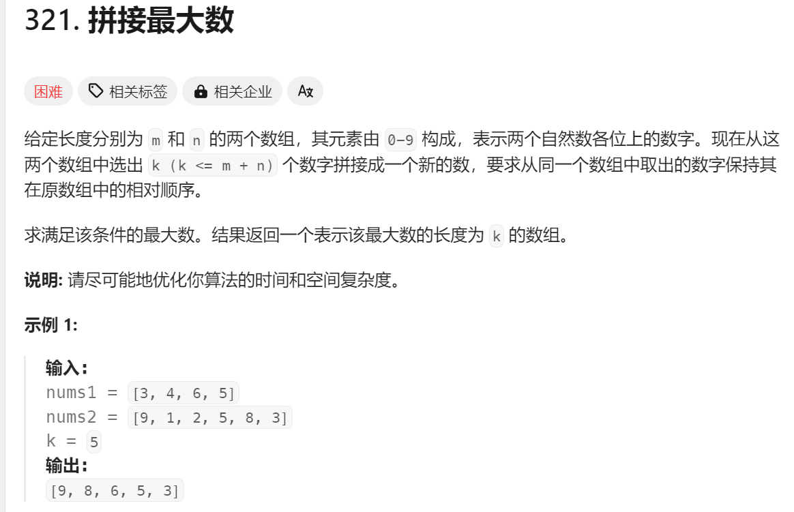

# 1. t46 全排列(无重复/有重复)

tag: `回溯`

time: 2023年5月19日

[47. 全排列 II - 力扣（LeetCode）](https://leetcode.cn/problems/permutations-ii/)


## 1.1 无重复: 记录并回溯

遍历未记录的,进入下一个排列

```java
public List<List<Integer>> dfs(int[]nums){
    List<List<Integer>> res = new ArrayList<>();
    boolean hello = false;;
    for(int i = 0;i < nums.length;i++){
        //经典用b[i]记录是否使用
        if(!b[i]){
            hello = true;
            b[i] = true;
            List<List<Integer>> next = dfs(nums);
            for(List<Integer> n:next){
                n.add(nums[i]);
                res.add(n);
            }
            b[i] = false;
        }
    }
    if(!hello){
        // 如果没有可以放进去的了,就放个空的给长度为1的使用
        res.add(new ArrayList<>());
    }
    return res;
}
```

## 1.2 有重复: 回溯2

> 其实这不是我想出来的,这个以前应该在哪看过,我后来想起来也没找到来源

回溯步骤出现了一点麻烦: 会出现重复,当前一个被选择过后,后一个再被并列的情况选择一次,就重复了

所以我们用一种方法来规避这样的重复:

1. 排序,排序能把重复元素归到一起

2. 当选择字母时,我们保证所选择的字母__是重复字母中第一个未被使用的字母__

   换言之,如果nums[i-1] == nums[i] 并且!b[i - 1]时,该下标弃用

```java
public List<List<Integer>> dfs(int[]nums){
    List<List<Integer>> res = new ArrayList<>();
    boolean hello = false;;
    for(int i = 0;i < nums.length;i++){
        if(!b[i]){
            // ********************
            // 就这里有差距
            if(i > 0 && nums[i - 1] == nums[i] && !b[i - 1]){
                continue;
            }
            // ********************
            hello = true;
            b[i] = true;
            List<List<Integer>> next = dfs(nums);
            for(List<Integer> n:next){
                n.add(nums[i]);
                res.add(n);
            }
            b[i] = false;
        }
    }
    if(!hello){
        res.add(new ArrayList<>());
    }
    return res;
}
```

## 1.3 代码简化

1. 我们用后序遍历的方式,以至于我们需要一直调用循环和add

实际上,只需要用先序遍历,在每一次进入下一层前放入元素,在最底层将list放进结果,回来之后把元素拿出来就行

```java

if (idx == nums.length) {
    ans.add(new ArrayList<Integer>(perm));
    return;
}

perm.add(nums[i]);
vis[i] = true;
backtrack(nums, ans, idx + 1, perm);
vis[i] = false;
perm.remove(idx);

//作者：LeetCode-Solution
//链接：https://leetcode.cn/problems/permutations-ii/solution/quan-pai-lie-ii-by-leetcode-solution/
//来源：力扣（LeetCode）
//著作权归作者所有。商业转载请联系作者获得授权，非商业转载请注明出处。
```

# 2. t40 组合总和II

tag: `回溯`

time: 2023年6月1日

[40. 组合总和 II - 力扣（LeetCode）](https://leetcode.cn/problems/combination-sum-ii/)


## 2.1 思考: 计数+回溯

先计数(可以给计数进行排序),再回溯

# 3. t1240 铺瓷砖(不会)

#### [1240. 铺瓷砖](https://leetcode.cn/problems/tiling-a-rectangle-with-the-fewest-squares/)


## 3.1 思考1: 枚举

首先将客厅用1大小的方块填满,此时方块数量为`nm`我们可以将其中的部分n组合成完整的方块,减少的数量为x*x - 1

# 4. t1799  N 次操作后的最大分数和 

tag: 

time: 2023年5月18日

[1799. N 次操作后的最大分数和 - 力扣（LeetCode）](https://leetcode.cn/problems/maximize-score-after-n-operations/)


## 4.1 思考1: 动态规划(放弃)

这直观上看应该低的放前面,高的放后面,但也不尽然

动态规划方面能找到子问题,就是2x对x,但是状态转换怎么转呢?

首先吧,填入空缺的gcd一定是单调递增的,才能保证最大

## 4.2 思考2/题解: 暴力回溯+动态规划


n <= 7,给了暴力一丝希望

我们使用二进制visited来表示访问的状态

制造一个记忆化数组,来动态规划

其中dp[x]的x的每一位表示对应i的访问情况
$$
dp[0]=0\\
dp[x]=max(dp[比x少2位的数] + 二位的gcd)
$$

```java
// 带记忆的gcd
public int gcd(int a,int b){
    if(gc.containsKey(a + b * 1000001)){
        return gc.get(a + b * 1000001);
    }
    int res = b == 0?a:gcd(b,a % b);
    gc.put(a + b * 1000001,res);
    return res;
}
```

```java
public int maxScore(int[] nums) {
    n = nums.length;
    dp = new int[1 << n];
    dp[0] = 0;
    for(int i = 1;i < dp.length;i++){
        int c = Integer.bitCount(i);
        if((c & 1) == 1){
            continue;
        }
        c = c / 2;
        int temp;
        // 就使用两重循环好了
        for(int j = 0;j < n - 1;j++){
            if((i & (1 << j)) != 0){
                for(int k = j + 1;k < n;k++){
                    if((i & (1 << k)) != 0){
                        temp = i ^ (1 << j) ^ (1 << k);
                        // System.out.println(temp);
                        dp[i] = Math.max(dp[i],dp[temp] + c * gcd(nums[j],nums[k]));
                    }
                }
            }
        }
    }
    // System.out.println(Arrays.toString(dp));
    return dp[(1 << n) - 1];
}
```

执行用时：104 ms, 在所有 Java 提交中击败了35.82%的用户

内存消耗：42.4 MB, 在所有 Java 提交中击败了11.94%的用户

# 5. t37 解数独

tag: `回溯`

time: 2023年6月13日


## 5.1 思考1: 记录+回溯

将行,列的占用分别用两个数组保存起来,以二进制的形式,1为占用,0为空闲

将区域也用一个数组保存,但是区域的判断需要单独的函数

将空闲格子用list保存起来,逐个枚举回溯

```java
private int ares(int i,int j){
    return (i / 3)  * 3 + j / 3;
}
```

定义和统计的过程:

```java
int[]row = new int[9];
int[] col = new int[9];
int[] ar = new int[9];
List<Integer> acc = new ArrayList<>();
for(int i = 0;i < board.length;i++){
    for(int j = 0;j < board[0].length;j++){
        if(board[i][j] == '.'){
            acc.add(10 * i + j);
        }else{
            int temp = board[i][j] - '0';
            row[i] |= 1 << temp;
            col[j] |= 1 << temp;
            ar[area(i,j)] = 1 << temp;
        }
    }
}
```

回溯过程:

```java
public boolean dfs(char[][]board,int index){
    if(index >= acc.size()){
        return true;
    }
    int x = acc.get(index) / 10;
    int y = acc.get(index) % 10;
    int valid = row[x] | col[y] | ar[area(x,y)];
    for(int i = 1;i <= 9;i++){
        if((valid & (1 << i)) == 0){
            board[x][y] = (char)(i + '0');
            row[x] |= 1 << i;
            col[y] |= 1 << i;
            ar[area(x,y)] |= 1 << i;
            boolean res = dfs(board,index + 1);
            if(res){
                return true;
            }
            row[x] ^= 1 << i;
            col[y] ^= 1 << i;
            ar[area(x,y)] ^= 1 << i;
            board[x][y] = '.';
        }

    }
    return false;
}
```

执行用时：7 ms, 在所有 Java 提交中击败了28.80%的用户

内存消耗：38.7 MB, 在所有 Java 提交中击败了85.91%的用户

# 6. t321 拼接最大数

time: 2024年2月22日



## 6.1 思考1: 动态规划(失败,但可以从回溯中看到方案)

有一个想法: f[i,j,k]代表从a1[i],a2[j]开始k位能代表的最大数字

但是空间好像太大了,我们先简单想一下初始条件和状态转移

* 初始状态:

f[m,n-1,1] = a2[n-1]

f[m - 1,n,1] = a1[m-1]

f[m - i,n,i] = a1[m-i..m-1]

f[m,n-i,i]=a2[n-i..n-1]

* 状态转移

f[x - 1,y,k] = max(a1[x-1],f[x,y,1])

f[x,y - 1,k] = 8max(a2[y-1],f[x,y,1])

## 6.2 思考2: 回溯(超时)

我们加以区分的将数字从9-1放入map中,区分开两个数组,顺序排序

每次回溯开始,我们拥有两个当前指针位置i,j,以及剩余需要的数字k

边界条件:

k == 0时可以记录结果成功并退出

i,j都溢出时,记为失败并退出

根据两个指针寻找最大数字: 

i指针: 如果i找到最大数字,设置选定数字为i,dfs(i,j,k-1),如果成功则停止并记录,如果失败则寻找下一个大数字,如果没有,则记录一个失败,如果成功,想办法记录后面的数字

j指针: 相同

i指针派系同j指针派系比较,获得一个更大值,返回给上一层

### 1. 实现要点记录

1. 分开记录数字位置的数据结构,初拟定为两个List<List\<Integer\>>

> 遍历,将数字填入对应位置即可
>
> 使用时,降序遍历第一层,正序遍历第二层

否决! 既然我们注定以那个顺序遍历,不如获取一个 "降序排序,数字相同时先到先得"的索引排序

2. 现在有一个问题要思考: 相同数字索引升序,在数组中我总是要快速获得大于i的第一个元素,能实现吗

> 当然可以,我们已经拥有了相对顺序,在保持相对顺序的情况下进行排序,然后用二分找到第一个大于i的数字(存疑,我得思考一下是怎么回事)
>
> 至少我们已经知道了在每个数字的范围内是有指定顺序的,那么可能原来的方法好一点,可以根据每个数字进行二分排序

3. 如何记录和比较两个子函数所提供的值

> 使用String和string的比较()

4. 记忆化搜索,使用简便的map而不是三维数组,因为其稀疏
5. 0: 对于非第一位的数字,0可以是起始值


### 2. 超时的应对方法

记忆化搜索,已经实现但没有什么效用

我突然想起来,每个数字应该只需要检验第一个就可以了

## 6.3 思考: 动态规划

我们可以分开处理两个num:

对于每个num,我们计算各个i<=k的最大值

计算使用动态规划:

* 状态定义:

$$
f[i][j]为从i位开始j位数字的最大值(String),满足i+j<=n
$$

* 初始值:

`f[n][0]= ""`

`f[i][n-i]=后面数字`

* 状态转换:

$$
f[i-1][j]=max(f[i][j],num[i-1]+f[i][j-1])
$$

计算出两个数组,枚举长度然后用归并的方式放入

### 1. 归并操作

归并操作有雷:

67

604

如果是平时归并,两个6都可以选,这里为了获得7,需要先选择上面的. 所以当遇到相等,需要向后看到未来即可

如果后一位为空,优先选另一个,如果后一个更大,优先选这个

```java
class Solution {
        public int[] maxNumber(int[] nums1, int[] nums2, int k) {
            String[][] r1 = calcDp(nums1,Math.min(k,nums1.length));
            String[][] r2 = calcDp(nums2,Math.min(k,nums2.length));
            String res = null;
            for(int i = 0;i <= k;i++){
                if(i <= nums1.length && k - i <= nums2.length){
                    res = larger(res,merge(r1[0][i],r2[0][k - i]));
                }

            }

            int[]result = new int[res.length()];
            for(int i = 0;i < res.length();i++){
                char c = res.charAt(i);
                result[i] = (int)c - 48;
            }
            return result;
        }
        public String[][] calcDp(int []nums,int k){
            int n = nums.length;
            String[][] dp = new String[nums.length + 1][k + 1];
            // init
            dp[n][0] = "";
            for(int i = 1;i <= k;i++){
                dp[n - i][i] = nums[n - i] + dp[n - i + 1][i - 1];
            }
            for(int i = 0;i < n;i++){
                dp[i][0] = "";
            }
            // start
            for(int i = 1;i <= k;i++){
                for (int j = n - i; j > 0; j--) {
                    dp[j-1][i] = larger(dp[j][i],nums[j-1]+dp[j][i-1]);
                }
            }
            return dp;
        }
        public String larger(String r1, String r2){
            if(r1 == null) return r2;
            if(r2 == null) return r1;
            return r1.compareTo(r2) > 0? r1:r2;
        }
        public String merge(String r1,String r2){
            StringBuilder res = new StringBuilder();
            int cur1 = 0,cur2 = 0;
            int index = 0;
            while(cur1 < r1.length() && cur2 < r2.length()){
                char c1 = r1.charAt(cur1);
                char c2 = r2.charAt(cur2);
                if(c1 > c2){
                    res.append(c1);
                    cur1++;
                }else if(c1 < c2){
                    res.append(c2);
                    cur2++;
                }else{
                    int curr1 = cur1,curr2 = cur2;
                    while(curr1 < r1.length() && curr2 < r2.length()){
                        char cc1 = r1.charAt(curr1);
                        char cc2 = r2.charAt(curr2);
                        if(cc1 == cc2){
                            curr1++;
                            curr2++;
                        }
                        if(cc1 < cc2){
                            res.append(c2);
                            cur2++;
                            break;
                        }
                        if(cc1 > cc2){
                            res.append(c1);
                            cur1++;
                            break;
                        }
                    }
                    if(curr1 >= r1.length()){
                        res.append(c2);
                        cur2++;
                    }
                    if(curr2 >= r2.length()){
                        res.append(c1);
                        cur1++;
                    }

                }
            }
            while(cur1 < r1.length()){
                char c1 = r1.charAt(cur1);
                res.append(c1);
                cur1++;
            }
            while(cur2 < r2.length()){
                char c2 = r2.charAt(cur2);
                res.append(c2);
                cur2++;
            }
            return res.toString();
        }
    }
```

## 6.4 题解: 单调栈

归并部分同题解基本一致,而题解使用单调栈获得最大i位而不是动态规划

```java
public int[] maxSubsequence(int[] nums, int k) {
    int length = nums.length;
    int[] stack = new int[k];
    int top = -1;
    int remain = length - k;
    for (int i = 0; i < length; i++) {
        int num = nums[i];
        while (top >= 0 && stack[top] < num && remain > 0) {
            top--;
            remain--;
        }
        if (top < k - 1) {
            stack[++top] = num;
        } else {
            remain--;
        }
    }
    return stack;
}

作者：力扣官方题解
链接：https://leetcode.cn/problems/create-maximum-number/solutions/505931/pin-jie-zui-da-shu-by-leetcode-solution/
来源：力扣（LeetCode）
著作权归作者所有。商业转载请联系作者获得授权，非商业转载请注明出处。
```

每次遇到数字:

先看看栈顶的数字,踢走直到剩下的数字不够填或者比不过栈顶的数字

如果踢完stack还是满的,则直接下一个