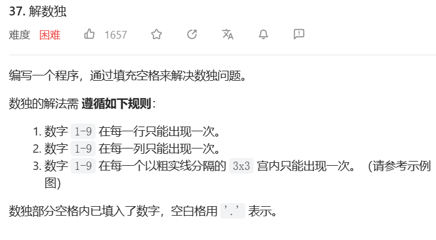

# 1. t46 全排列(无重复/有重复)

tag: `回溯`

time: 2023年5月19日

[47. 全排列 II - 力扣（LeetCode）](https://leetcode.cn/problems/permutations-ii/)


## 1.1 无重复: 记录并回溯

遍历未记录的,进入下一个排列

```java
public List<List<Integer>> dfs(int[]nums){
    List<List<Integer>> res = new ArrayList<>();
    boolean hello = false;;
    for(int i = 0;i < nums.length;i++){
        //经典用b[i]记录是否使用
        if(!b[i]){
            hello = true;
            b[i] = true;
            List<List<Integer>> next = dfs(nums);
            for(List<Integer> n:next){
                n.add(nums[i]);
                res.add(n);
            }
            b[i] = false;
        }
    }
    if(!hello){
        // 如果没有可以放进去的了,就放个空的给长度为1的使用
        res.add(new ArrayList<>());
    }
    return res;
}
```

## 1.2 有重复: 回溯2

> 其实这不是我想出来的,这个以前应该在哪看过,我后来想起来也没找到来源

回溯步骤出现了一点麻烦: 会出现重复,当前一个被选择过后,后一个再被并列的情况选择一次,就重复了

所以我们用一种方法来规避这样的重复:

1. 排序,排序能把重复元素归到一起

2. 当选择字母时,我们保证所选择的字母__是重复字母中第一个未被使用的字母__

   换言之,如果nums[i-1] == nums[i] 并且!b[i - 1]时,该下标弃用

```java
public List<List<Integer>> dfs(int[]nums){
    List<List<Integer>> res = new ArrayList<>();
    boolean hello = false;;
    for(int i = 0;i < nums.length;i++){
        if(!b[i]){
            // ********************
            // 就这里有差距
            if(i > 0 && nums[i - 1] == nums[i] && !b[i - 1]){
                continue;
            }
            // ********************
            hello = true;
            b[i] = true;
            List<List<Integer>> next = dfs(nums);
            for(List<Integer> n:next){
                n.add(nums[i]);
                res.add(n);
            }
            b[i] = false;
        }
    }
    if(!hello){
        res.add(new ArrayList<>());
    }
    return res;
}
```

## 1.3 代码简化

1. 我们用后序遍历的方式,以至于我们需要一直调用循环和add

实际上,只需要用先序遍历,在每一次进入下一层前放入元素,在最底层将list放进结果,回来之后把元素拿出来就行

```java

if (idx == nums.length) {
    ans.add(new ArrayList<Integer>(perm));
    return;
}

perm.add(nums[i]);
vis[i] = true;
backtrack(nums, ans, idx + 1, perm);
vis[i] = false;
perm.remove(idx);

//作者：LeetCode-Solution
//链接：https://leetcode.cn/problems/permutations-ii/solution/quan-pai-lie-ii-by-leetcode-solution/
//来源：力扣（LeetCode）
//著作权归作者所有。商业转载请联系作者获得授权，非商业转载请注明出处。
```

# 2. t40 组合总和II

tag: `回溯`

time: 2023年6月1日

[40. 组合总和 II - 力扣（LeetCode）](https://leetcode.cn/problems/combination-sum-ii/)


## 2.1 思考: 计数+回溯

先计数(可以给计数进行排序),再回溯

# 3. t1240 铺瓷砖(不会)

#### [1240. 铺瓷砖](https://leetcode.cn/problems/tiling-a-rectangle-with-the-fewest-squares/)


## 3.1 思考1: 枚举

首先将客厅用1大小的方块填满,此时方块数量为`nm`我们可以将其中的部分n组合成完整的方块,减少的数量为x*x - 1

# 4. t1799  N 次操作后的最大分数和 

tag: 

time: 2023年5月18日

[1799. N 次操作后的最大分数和 - 力扣（LeetCode）](https://leetcode.cn/problems/maximize-score-after-n-operations/)


## 4.1 思考1: 动态规划(放弃)

这直观上看应该低的放前面,高的放后面,但也不尽然

动态规划方面能找到子问题,就是2x对x,但是状态转换怎么转呢?

首先吧,填入空缺的gcd一定是单调递增的,才能保证最大

## 4.2 思考2/题解: 暴力回溯+动态规划


n <= 7,给了暴力一丝希望

我们使用二进制visited来表示访问的状态

制造一个记忆化数组,来动态规划

其中dp[x]的x的每一位表示对应i的访问情况
$$
dp[0]=0\\
dp[x]=max(dp[比x少2位的数] + 二位的gcd)
$$

```java
// 带记忆的gcd
public int gcd(int a,int b){
    if(gc.containsKey(a + b * 1000001)){
        return gc.get(a + b * 1000001);
    }
    int res = b == 0?a:gcd(b,a % b);
    gc.put(a + b * 1000001,res);
    return res;
}
```

```java
public int maxScore(int[] nums) {
    n = nums.length;
    dp = new int[1 << n];
    dp[0] = 0;
    for(int i = 1;i < dp.length;i++){
        int c = Integer.bitCount(i);
        if((c & 1) == 1){
            continue;
        }
        c = c / 2;
        int temp;
        // 就使用两重循环好了
        for(int j = 0;j < n - 1;j++){
            if((i & (1 << j)) != 0){
                for(int k = j + 1;k < n;k++){
                    if((i & (1 << k)) != 0){
                        temp = i ^ (1 << j) ^ (1 << k);
                        // System.out.println(temp);
                        dp[i] = Math.max(dp[i],dp[temp] + c * gcd(nums[j],nums[k]));
                    }
                }
            }
        }
    }
    // System.out.println(Arrays.toString(dp));
    return dp[(1 << n) - 1];
}
```

执行用时：104 ms, 在所有 Java 提交中击败了35.82%的用户

内存消耗：42.4 MB, 在所有 Java 提交中击败了11.94%的用户

# 5. t37 解数独

tag: `回溯`

time: 2023年6月13日



# 5.1 思考1: 记录+回溯

将行,列的占用分别用两个数组保存起来,以二进制的形式,1为占用,0为空闲

将区域也用一个数组保存,但是区域的判断需要单独的函数

将空闲格子用list保存起来,逐个枚举回溯

```java
private int ares(int i,int j){
    return (i / 3)  * 3 + j / 3;
}
```

定义和统计的过程:

```java
int[]row = new int[9];
int[] col = new int[9];
int[] ar = new int[9];
List<Integer> acc = new ArrayList<>();
for(int i = 0;i < board.length;i++){
    for(int j = 0;j < board[0].length;j++){
        if(board[i][j] == '.'){
            acc.add(10 * i + j);
        }else{
            int temp = board[i][j] - '0';
            row[i] |= 1 << temp;
            col[j] |= 1 << temp;
            ar[area(i,j)] = 1 << temp;
        }
    }
}
```

回溯过程:

```java
public boolean dfs(char[][]board,int index){
    if(index >= acc.size()){
        return true;
    }
    int x = acc.get(index) / 10;
    int y = acc.get(index) % 10;
    int valid = row[x] | col[y] | ar[area(x,y)];
    for(int i = 1;i <= 9;i++){
        if((valid & (1 << i)) == 0){
            board[x][y] = (char)(i + '0');
            row[x] |= 1 << i;
            col[y] |= 1 << i;
            ar[area(x,y)] |= 1 << i;
            boolean res = dfs(board,index + 1);
            if(res){
                return true;
            }
            row[x] ^= 1 << i;
            col[y] ^= 1 << i;
            ar[area(x,y)] ^= 1 << i;
            board[x][y] = '.';
        }

    }
    return false;
}
```

执行用时：7 ms, 在所有 Java 提交中击败了28.80%的用户

内存消耗：38.7 MB, 在所有 Java 提交中击败了85.91%的用户