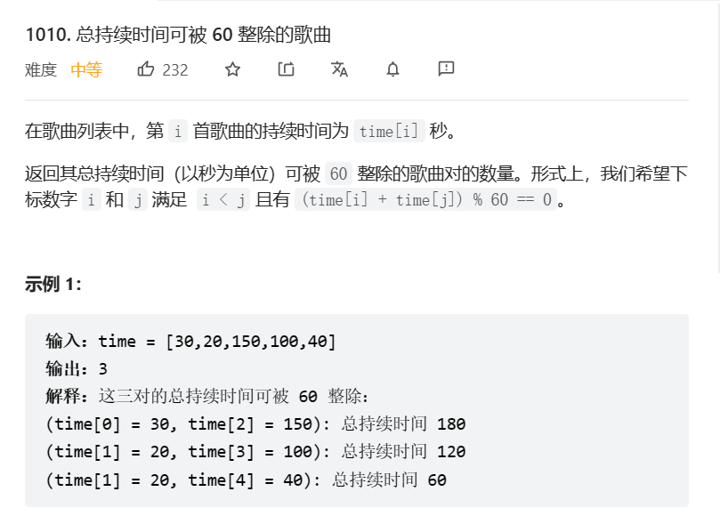

> 本文针对一些比较简单的题目,虽然题简单但是能学到大佬的简化算法/简化代码思路

[TOC]

# 1. t1010 总时间可被60整除的歌曲

tag:`哈希表`

日期: 2023年5月7日

[1010. 总持续时间可被 60 整除的歌曲 - 力扣（LeetCode）](https://leetcode.cn/problems/pairs-of-songs-with-total-durations-divisible-by-60/)



## 1.1 我的思路和代码

创建hash表,取60模计数

最后0和30算组合数,其他配对相乘

```java
class Solution {
    public int numPairsDivisibleBy60(int[] time) {
        int[] map = new int[60];
        long count = 0;
        for(int i = 0;i < time.length;i++){
            int mod = time[i] % 60;
            map[mod]++;
        }
        for(int i = 0;i <= 30;i++){
            if(map[i] == 0){
                continue;
            }
            if(i == 0 || i == 30){
                count += ((long)map[i] * (map[i] - 1)) / 2;
            }else{
                count += map[i] * map[60 - i];
            }
        }
        return (int)count;
    }
}
```

## 1.2 大佬的思路和代码

https://leetcode.cn/problems/pairs-of-songs-with-total-durations-divisible-by-60/solution/liang-shu-zhi-he-de-ben-zhi-shi-shi-yao-bd0r1/

只用了一次循环,在循环过程中就可以直接配对了,对于0和30也不需要特别考虑

```java

class Solution {
    public int numPairsDivisibleBy60(int[] time) {
        int ans = 0;
        var cnt = new int[60];
        for (int t : time) {
            // 先查询 cnt，再更新 cnt，因为题目要求 i<j
            // 如果先更新，再查询，就把 i=j 的情况也考虑进去了
            ans += cnt[(60 - t % 60) % 60];
            cnt[t % 60]++;
        }
        return ans;
    }
}

//作者：endlesscheng
//链接：https://leetcode.cn/problems/pairs-of-songs-with-total-durations-divisible-by-60/solution/liang-shu-zhi-he-de-ben-zhi-shi-shi-yao-bd0r1/
//来源：力扣（LeetCode）
//著作权归作者所有。商业转载请联系作者获得授权，非商业转载请注明出处。
```

# 2. 排序的溢出问题

自定义排序会遇到溢出问题

[[-2147483646,-2147483645],[2147483646,2147483647]]

sort的时候不要用`a-b`来比较，要用`Integer.compare(a, b)`!!!