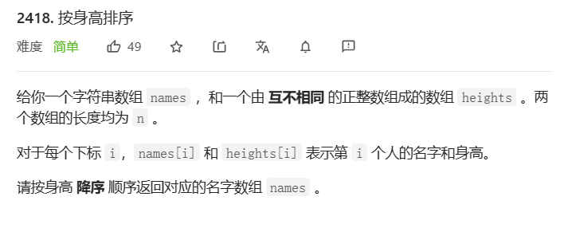
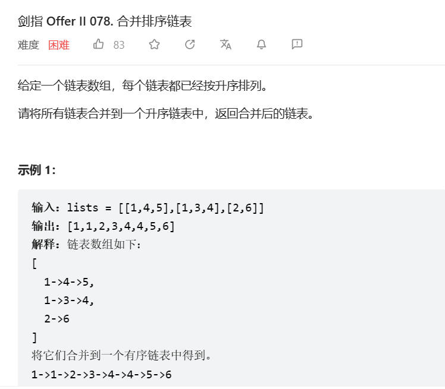

# 1. t2418 按身高排序

tag:`排序`

time:2023-04-23

[2418. 按身高排序 - 力扣（LeetCode）](https://leetcode.cn/problems/sort-the-people/)



## 1.1 思考与编码

嗯..应该是简单的排序题,照理说身高用桶排挺好的,但是这题的身高给了1到10^5的范围,好气

思路就是简单的排序,可以记录最终id的位置,也可以把身高和姓名组成元组放在一起

直接用Arrays.sort可以,不过我毕竟是复健,写一个堆排序试试

```java
class Heap<T>{
    private List<T> heap = new ArrayList<>();
    private Comparator<T> comparator;
    public Heap(List<T> list, Comparator<T> comparator){
        this.comparator = comparator;
        // 把初始操作办好
        heap.add(null);
        for(int i = 0;i < list.size();i++){
            this.insert(list.get(i));
        }
    }
	//插入
    private void insert(T t) {
        this.heap.add(t);
        this.percolateUp(this.heap.size() - 1);
    }
    // 弹出
    public T pop(){
        T result = this.heap.get(1);
        this.heap.set(1,this.heap.get(this.heap.size() - 1));
        this.heap.remove(this.heap.size() - 1);
        if(heap.size() > 1){
            percolateDown(1);
        }

        return result;
    }
    private T top(){
        return this.heap.get(1);
    }

    //插入时上滤
    private void percolateUp(int i){
        int cur = i;
        int pre = i / 2;
        T val = heap.get(i);
        while(pre > 0 && cur > 0){
            if(comparator.compare(heap.get(pre),val) < 0){
                heap.set(cur,heap.get(pre));
                cur = pre;
                pre = cur / 2;
            }else{
                break;
            }
        }
        heap.set(cur,val);
    }
    //删除时下滤
    private void percolateDown(int i){
        int cur = i;
        int next = i * 2;
        T val = heap.get(i);
        while(cur < heap.size() && next < heap.size()){
            if(next < heap.size() - 1){
                if(comparator.compare(heap.get(next),heap.get(next + 1)) < 0){
                    next = next + 1;
                }
            }
            if(comparator.compare(val,heap.get(next)) < 0){
                heap.set(cur,heap.get(next));
                cur = next;
                next = cur * 2;
            }else{
                break;
            }
        }
        heap.set(cur,val);
    }
}
```

```java
Heap<Integer> integerHeap = new Heap<>(indexes, Comparator.comparingInt(a -> heights[a]));
```

# 2. o078 合并排序链表

tag: `排序`

[剑指 Offer II 078. 合并排序链表 - 力扣（LeetCode）](https://leetcode.cn/problems/vvXgSW/)



## 2.1 思考:堆

总感觉是大型归并,先把表头的数字都放进堆中,每次取出最小,然后将取出的节点对应列表的下一个节点放入即可

会超时吗,我感觉不会吧,这困难题真能这么做完吗

```java
public ListNode mergeKLists(ListNode[] lists) {
    if(lists.length == 0){
        return null;
    }
    PriorityQueue<ListNode> heap = new PriorityQueue<>(Comparator.comparingInt(a->a.val));
    for(ListNode l: lists){
        if(l != null){ // 令人困惑的边界检查
            heap.offer(l);
        }
    }
    ListNode head = null;
    ListNode temp = null;
    while(!heap.isEmpty()){
        ListNode next = heap.poll();
        if(head == null){
            head = next;
            temp = head;
        }else{
            temp.next = next;
            temp = next;
        }
        if(next.next != null){
            heap.offer(next.next);
            next.next = null;
        }
    }
    return head;
}
```

执行用时：6 ms, 在所有 Java 提交中击败了29.21%的用户

内存消耗：42.4 MB, 在所有 Java 提交中击败了90.02%的用户

## 2.2 题解: 归并和归并的方法

虽然用堆也算归并,但是我们传统归并排序还是得好好复习以下

### 2.2.1 自顶向下(分治)归并

简而言之,就是递归

归并链表算法:

```java
void merge(lists,l,r){ // 这个是包在外面归并法,自顶向下
    if(l < r){
        int mid = (l + r) / 2;
        merge(l,mid);
        merge(mid +1,r);
        lists[l] = merge(list[l],list[mid+1]); // 这个是两节点归并
    }
}
```

### 2.2.2 自底向上归并

也就是两个两个找节点,一个个归并

```java
class Solution {
    public ListNode mergeKLists(ListNode[] lists) { // 自底向上迭代合并
        if(lists.length == 0) return null;
        int n = lists.length, gap = 1;
        for(; gap < n; gap *= 2){ // 自底向上归并排序
            for(int l = 0; l < n - gap; l += 2 * gap){
                // 这里题解使用了gap *= 2的形式,在不改变原数组长度的情况下匹配
                lists[l] = merge(lists[l], lists[l + gap]);
            }
        }
        return gap < n - 1 ? merge(lists[0], lists[gap]) : lists[0]; // 若有剩余还要再合并一次
    }
    // merge 方法和前面一样，此处省略
}
```

### 2.2.3 归并算法

链表的归并倒也不复杂,就是大家都不为空,就比较,小的摘出来放进总队,下一个置入比较

一旦有一个空了,就把没空的那个直接接入队伍即可

```java
private ListNode merge(ListNode node1, ListNode node2){ // 合并链表标准写法
    ListNode dummy = new ListNode(), cur = dummy;
    while(node1 != null && node2 != null){
        if(node1.val <= node2.val){
            cur.next = node1;
            node1 = node1.next;
        }
        else{
            cur.next = node2;
            node2 = node2.next;
        }
        cur = cur.next;
    }
    cur.next = node1 != null ? node1 : node2;
    return dummy.next;
}
```

# 3. 知识:快排

基本步骤:

1. 选出pivot,将pivot放到最右边
2. 左右指针移动,左指针移动到大于pivot,右指针移动到小于pivot,交换左右指针的值,移动直到left >=right

3. 将pivot与left交换,然后对左边和右边做同样的事

```java
public void quickSort(int[]arr,int left,int right){
    if(right < left){
        return;
    }
    if(right - left < 3){
        insertSort(arr,left,right);
        return;
    }
    int pivot = 3;
    arr[pivot] ^= arr[right];
    arr[right] ^= arr[pivot];
    arr[pivot] ^= arr[right];
    int l = left,r = right - 1;
    while(l < r){
        while(l <= right && arr[l] < arr[right]){l++;}
        while(r >= left && arr[r] > arr[right]){r--;}
        if(l < r){
            arr[l] ^= arr[r];
            arr[r] ^= arr[l];
            arr[l] ^= arr[r];
        }
    }
    arr[l] ^= arr[right];
    arr[right] ^= arr[l];
    arr[l] ^= arr[right];
    quickSort(arr,left,l - 1);
    quickSort(arr,l + 1,right);
}
```

