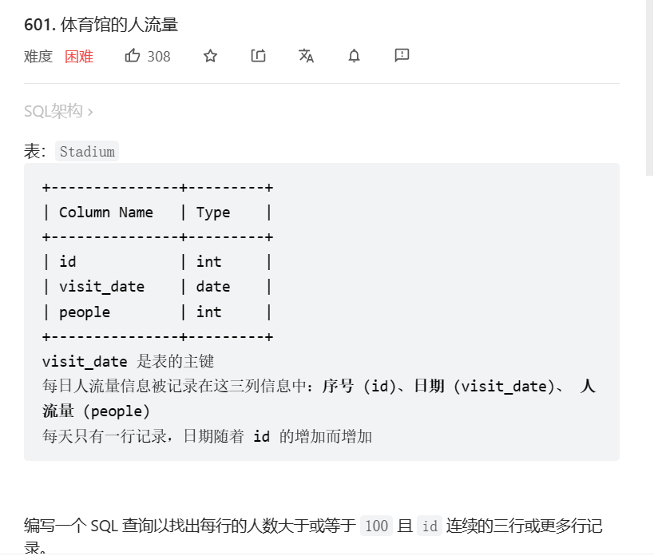
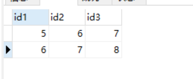
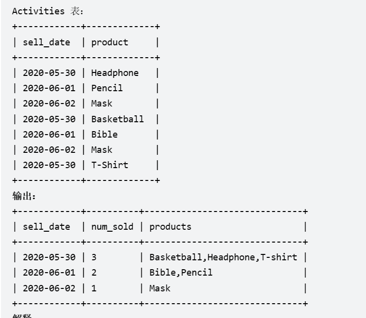

# 1. d601 体育馆的人流量

[601. 体育馆的人流量 - 力扣（LeetCode）](https://leetcode.cn/problems/human-traffic-of-stadium/)



## 1.1 思考与编码

### 1.1.1 初次过

~~真的好久没写sql了~~

先连接出一张连续三天大于100的表再说

```sql
select s1.id as id1,s2.id id2,s3.id id3
from Stadium s1 left join Stadium s2
on s1.id + 1 = s2.id
left join Stadium s3 
on s2.id + 1 = s3.id
where s1.people > 100 and s2.people > 100 and s3.people > 100
```



这里可以看到,我们需要的词条5,6,7,8都出现了,现在需要将它们都放取在结果中

先来个暴力手段:整n次子查询(大于应该改成大于等于)

```sql
select * 
from Stadium s4
where s4.id = any(
	select s1.id
from Stadium s1 left join Stadium s2
on s1.id + 1 = s2.id
left join Stadium s3 
on s2.id + 1 = s3.id
where (s1.people > 100 and s2.people > 100 and s3.people > 100)

) or s4.id - 1 in (
	select s1.id
from Stadium s1 left join Stadium s2
on s1.id + 1 = s2.id
left join Stadium s3 
on s2.id + 1 = s3.id
where (s1.people > 100 and s2.people > 100 and s3.people > 100)

) or s4.id - 2 in(
	select s1.id
from Stadium s1 left join Stadium s2
on s1.id + 1 = s2.id
left join Stadium s3 
on s2.id + 1 = s3.id
where (s1.people > 100 and s2.people > 100 and s3.people > 100)

)
```

执行用时：410 ms, 在所有 MySQL 提交中击败了16.24%的用户

内存消耗：0 B, 在所有 MySQL 提交中击败了100.00%的用户

### 1.1.2 优化

想了很久,不会

## 1.2 题解

[图解——连续日期及难点分析 - 体育馆的人流量 - 力扣（LeetCode）](https://leetcode.cn/problems/human-traffic-of-stadium/solution/tu-jie-lian-xu-ri-qi-ji-nan-dian-fen-xi-xnj58/)

## 1.3 mysql知识

### 1.3.1 with语句

```mysql
with 子查询名 as (子查询语句)
select * from 子查询名
```

### 1.3.2 over函数

Over函数是mysql在2018(8.0.2)新引入的`window function`,它们对一组行(row)执行特定的计算（例如总和、计数、平均值等）;这组行(row)称为“窗口”

* 使用场景:

  当你想要统计一组行的计算数据时,比如一个部门的平均工资,你或许可以使用group by,但是使用了group by之后,表中将不存在个体,只存在部门和平均工资,

  而over可以将个体和部门的平均工资更方便的一起显示

# 2. d1484 按日期分组销售产品

[1484. 按日期分组销售产品 - 力扣（LeetCode）](https://leetcode.cn/problems/group-sold-products-by-the-date/)




## 2.1 group_concat函数

本题完美契合group_concat函数的用法

`group_concat(distinct 字段 separator 字符)`将组内字段用separator连接成为一个字符串

默认separator为逗号`,`

```sql
select sell_date,
	count(distinct product) as num_sold,
	group_concat(distinct product) as products
from activities
group by sell_date
order by sell_date
```

