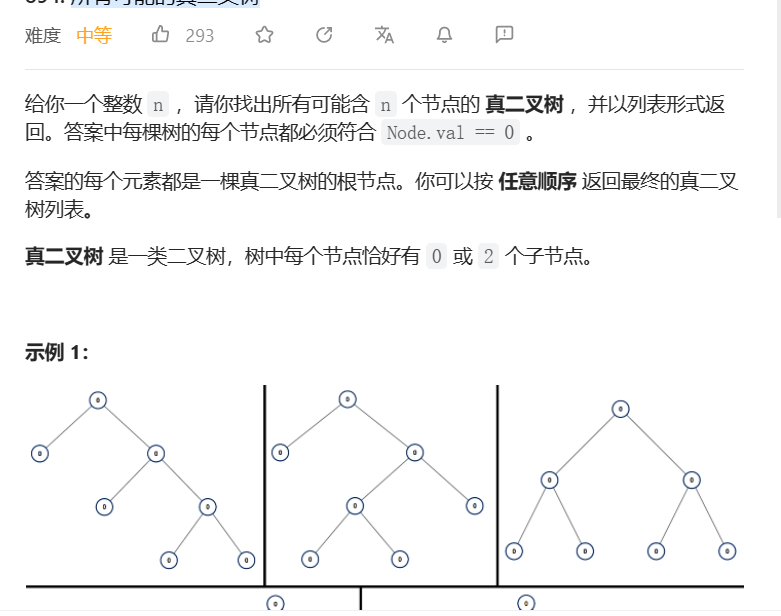

# 1. t331 验证二叉树的前序序列化

[ 验证二叉树的前序序列化](https://leetcode.cn/problems/verify-preorder-serialization-of-a-binary-tree/)


## 1.1 思考与编码

乍一看还挺简单的,前序遍历不成立的情况仅仅在一个节点找不到两个子节点的时候出现

可以用栈记录暂无右子节点的节点,然后慢慢回溯

然后发现可以把栈去掉,仅保留需要右节点的节点数量即可

>需要寻找右节点的节点数count=0,是否左节点标记lefting = false
>
>当遇到null时: 判断是否为左节点,如果是则,lefting = false;如果不是,则count--(与0比较判断),继续
>
>当遇到数字时: 判断是否为左节点,如果是则,count++,并且在之后无论是不是都需要判断count是否大于0,lefting=true
>
>判断count是否大于零的原因: 因为如果不是左节点,那其实count会进行一次-1操作然后再一次+1操作,在-1的时候可能count小于0

````java
class Solution{
    public boolean isValidSerialization(String preorder) {
        int lackRight = 0; //这就是count
        char[] chars = preorder.toCharArray();
        boolean lefting = true; // 表示正在寻找左节点
        for (int i = 0; i < chars.length + 1; i++) {
            if(i == chars.length || chars[i] == ','){
                if(chars[i - 1] == '#'){ // 遇到空节点
                    if(!lefting){ // 不是左节点就放右边
                        lackRight--;
                        if(lackRight < 0){
                            return false;
                        }
                    }
                    lefting = false;
                }else{
                    if(lefting){
                        lackRight++;
                    }
                    if(lackRight == 0){
                        return false;
                    }
                    lefting = true;
                }
            }
        }
        if(lackRight == 0){
            return true;
        }else{
            return false;
        }
    }
}
````

运行结果:

执行用时：1 ms, 在所有 Java 提交中击败了99.45%的用户

内存消耗：39.8 MB, 在所有 Java 提交中击败了90.42%的用户

* 遇到的问题和评价:
  * 在"遇到数字"->"非左节点"的路径上,只考虑了count--和count++的综合结果,忘记考虑count--可能导致count出界
  * 思维上还是比较乱,得把思路写出来才能写出正确代码
  * 思路和官方题解基本一致,我很高兴(虽然题很简单就是了)

# 2. t2418 --堆介绍--

堆排序,参考`排序.md`序号1

## 2.1 堆

`二叉堆(binary heap)`是一种特殊的二叉树,它的特点是根部的数据一定是最大(大根堆)/最小(小根堆)

### 2.1.1 特点

* 一定是完全二叉树,所以使用线性表也是比较容易实现的
* 根部数据(在对应的比较条件下)一定是最值
* 子节点的值一定大于/小于父节点的值

### 2.1.2 实现

> 以小根堆为例

实现细节:

1. 线性表实现,其中对于每一个节点索引i,对应索引`2*i`和`2*i+1`是其子节点(如果存在的话)
2. 线性表的第一个位置[0]置空或者添加一个无法达到的最值

辅助操作:

1. __上滤__: 将一个"新"节点从下层向上移动的过程,一般会用在插入和建堆的环节

> 对于需要上滤的节点cur和其值val
>
> 其父节点索引pre
>
> 循环操作:
>
> ​	如果heap[pre] > val,则子节点需要上滤,交换pre节点和cur节点的值
>
> ​    不然,则说明cur是val的合适位置,退出循环
>
> ​    将cur = pre,向上再与其父节点比较
>
> ​	如果pre出界,说明cur已到根部,退出循环
>
> ​    __实际上,并不需要交换pre和cur的值,因为pre被赋值val之后也将参与上滤,所以只需要将pre的值赋给cur即可__
>
> 无论是哪种情况,都说明cur是val的合适位置,heap[cur] = val

```java
//i: 需要上滤的节点索引
void percolateUp(int i){
	int cur = i;
    int pre = i / 2;
    int val = heap[cur];
    while(pre > 0 && val > 0){
        if(heap[cur] < heap[pre]){
            heap[cur] = heap[pre];
            cur = pre;
            pre = cur / 2;
        }else{
            break;
        }
    }
}
```

2. **下滤**: 将节点向下过滤,一般用在删除情况

下滤的逻辑类似于反向上滤

> 对于需要下滤的节点cur,考察其子节点中__值较小__的节点next,
>
> 如果heap[cur] > heap[next],则将cur对应值下滤,next的值交给cur(heap[cur] = heap[next])
>
> 然后将cur = next,反复考察直到快溢出即可

```java
void percolateDown(int i){
	int cur = i;
    int next = i * 2;
    int val = heap[cur];
    while(cur < currentSize && next < currentSize){
        // 一个if选择一下子节点
        if(next + 1 < currentSize && heap[next] > heap[next + 1]){
            next = next + 1;
        }
        if(heap[cur] > heap[next]){
            heap[cur] = heap[next];
            cur = next;
            next = cur * 2
        }else{
            break;
        }
    }
    heap[cur] = val;
}
```

基本操作:

1. 插入/建堆:

   插入值时,首先将值放在线性表的末尾(即完全二叉树的末尾)

   然后对该值进行__上滤__即可

   建堆类似,循环对每一个值进行上滤即可

2. 删除

   当需要删除位置i上的值时,先将末尾的值填入i位置,对其进行__下滤__,并直接移除末尾位置

3. update

   先删除再插入就是update

# 3. t1172 餐盘栈

tag:``

time:2023年4月28日

[1172. 餐盘栈 - 力扣（LeetCode）](https://leetcode.cn/problems/dinner-plate-stacks/)


## 3.1 思考与编码

### 3.1.1 思考1: 双指针

乍一看好像挺简单的,没有一种困难题的压迫感.

有这几种搜索需求:

* 从左往右,第一个没有满的,记为需求1
* 从右往左,第一个非空的,记为需求2

有这几种操作:

* 入栈(push),会导致空栈变成非空栈,非满栈变成满栈
* 出栈(pop),会导致非空栈变成空栈,满栈变为非满栈

1. 思路1: 我们可以用`i(pushIndex)`记录需求1的解,用`j(popIndex)`记录需求2的解,一般有`i - 1 <= j`

   > i = 0;j = -1;任何时候,若不存在则置为-1

   * 当出现pop时,j的位置有一个值弹出,如果j位置此时为空,j需要向左寻找第一个非空节点
   * 出现push时,i位置加入一个值,
     * 若i > j,则i=j
     * 若i位置已满,则i需要向右寻找第一个非满栈,若溢出,则添加栈
   * 出现pop(index)时
     * 若index < i,则i = index,必有弹出值
     * 若index > j,则-1
     * 若index == j, 和pop操作一致,逻辑直接调用pop
     * 其余都正常进行判断,弹出

代码如下,基本与思路吻合:

```java
    class DinnerPlates {
        int capacity;
        int popIndex = -1;
        int pushIndex = 0;
        List<List<Integer>> stacks = new ArrayList<>();
        public DinnerPlates(int capacity) {
            this.capacity = capacity;
            stacks.add(new ArrayList<>());
        }

        public void push(int val) {
            int feedback = pushList(stacks.get(pushIndex), val);
            if(feedback < 0){
                System.out.println("出大问题,检查代码:" + val);
            }
            //若i > j,则i=j
            if(pushIndex > popIndex){
                popIndex = pushIndex;
            }
            //若i位置已满,则i需要向右寻找第一个非满栈,若溢出,则添加栈
            if(feedback == 0){
                for(int i = pushIndex;i <= stacks.size();i++){
                    if(i == stacks.size()){
                        stacks.add(new ArrayList<>());
                        pushIndex = i;
                        return;
                    }else if(stacks.get(i).size() < capacity){
                        pushIndex = i;
                        return;
                    }
                }
            }

        }

        public int pop() {
            if(popIndex < 0){
                return -1;
            }
            //当出现pop时,j的位置有一个值弹出,如果j位置此时为空,j需要向左寻找第一个非空节点
            List<Integer> list = stacks.get(popIndex);
            int res = popList(list);
            if(list.size() == 0){
                for (int j = popIndex; j >= 0; j--) {
                    if(stacks.get(j).size() != 0){
                        popIndex = j;
                        break;
                    }
                }
            }
            return res;
        }

        public int popAtStack(int index) {
            if(index < 0){
                return -1;
            }
            // 在j后面的都空,溢出退出
            if(index > popIndex){
                return -1;
            }else if(index == popIndex){
                return this.pop();
            }else if(index >=pushIndex){
                return this.popList(stacks.get(index));
            }else{
                int res = this.popList(stacks.get(index));
                pushIndex = index;
                return res;
            }
        }
        private int popList(List<Integer> stack){
            if(stack.size() == 0){
                return -1;
            }
            return stack.remove(stack.size() - 1);
        }
        private int pushList(List<Integer> stack,int val){
            if(stack.size() + 1 > this.capacity){
                return -999;
            }else{
                stack.add(val);
                return capacity - stack.size();
            }
        }
    }
```

运行结果:

12/15超时

问题和评价:

* 不愧是困难题,这都能超时,超时的点应该在于向前寻找popAtStac和向后寻找pushIndex上,有且仅有这一种可能性,时间上必然只能在这部分优化
* 空间上也应该考虑一下Array存一堆空的是否太浪费了,可能可以用TreeMap这种有序哈希来代替

### 3.1.2 优化1

注意到,pop和push本来理应是有序的,但是popIndex的加入让push和pop出现了更多的可能性

> push(加入数据)操作自始至终都是有迹可循的,不会凭空出现在某个位置

popAtStac取出一个位于满栈的值后,该栈就出现了缺口,对push造成了影响

popAtStac将一个位置取空后,会对pop的移动造成影响

我们可以牺牲一点空间,将popAtStac的影响用TreeMap将空缺记录下来

TreeMap(int index, int leftSize)

***

但是这样popIndex依然很难计算,没有实质的提升,所以我们再把餐盘栈的数据结构改造成TreeMap

TreeMap(int index,List stack)

当popAtStac制造出空栈,则直接把该项移走

> stacks的性质: TreeMap,只存stack不为空的项
>
> hole的性质: TreeMap,存有缺口的项,0<val<=capacity

> push(): 寻找第一个缺口并填补,若缺口值归0,则移除缺口
>
> 若无缺口,则判断stacks中最右的stack是否已满,未满则直接加入,已满则增加新列表
>
> pop(): 从最右stacks中去除元素,判断最右是否为空,为空则去除
>
> popAtStac(index):
>
> 先判断index是否在stacks中,若不在则-1
>
> 若index == 最右元素,pop()
>
> 若index < 最右元素,则记录缺口+1并返回

代码:

```java
class DinnerPlates {
    private int capacity;
    //private int popIndex = -1; popindex被stacks.floorEntry(100001).getKey()取代
    private int pushIndex = 0;
    // 数据结构和记录数据结构大小的结构
    private TreeMap<Integer,List<Integer>> stacks = new TreeMap<>();
    // 记录缺口<索引,剩余的空间>
    private TreeMap<Integer,Integer> hole = new TreeMap<>();
    public DinnerPlates(int capacity) {
        this.capacity = capacity;
        stacks.put(0,new ArrayList<>());
    }

    public void push(int val) {
        Map.Entry<Integer, Integer> entry = hole.ceilingEntry(0);
        if(entry != null){
            List<Integer> haha = stacks.getOrDefault(entry.getKey(), new ArrayList<>());
            pushList(haha,val);
            stacks.put(entry.getKey(),haha);
            if(entry.getValue() - 1 == 0){
                hole.remove(entry.getKey());
            }else{
                hole.put(entry.getKey(),entry.getValue() - 1);
            }
        }else{
            Map.Entry<Integer, List<Integer>> entry1 = getEntry();
            if(entry1 == null || entry1.getValue().size() >= capacity){
                ArrayList<Integer> objects = new ArrayList<>();
                objects.add(val);
                stacks.put(entry1 == null?0:(entry1.getKey() + 1),objects);

            }else{
                pushList(entry1.getValue(),val);
            }
        }
    }

    public int pop() {
        Map.Entry<Integer, List<Integer>> entry = getEntry();
        if(entry == null){
            return -1;
        }
        int res = popList(entry.getValue());
        if(entry.getValue().size() == 0){
            stacks.remove(entry.getKey());
        }
        return res;
    }

    public int popAtStack(int index) {
        List<Integer> integers = stacks.get(index);
        Map.Entry<Integer, List<Integer>> entry = getEntry();
        if(integers == null){
            return -1;
        }
        if(entry.getKey().equals(index)){
            return pop();
        }else{
            int i = popList(integers);
            if(integers.size() == 0){
                stacks.remove(index);
            }
            hole.put(index,capacity - integers.size());
            return i;
        }
    }
    private int popList(List<Integer> stack){
        if(stack.size() == 0){
            return -1;
        }
        return stack.remove(stack.size() - 1);
    }
    private int pushList(List<Integer> stack,int val){
        if(stack.size() + 1 > this.capacity){
            return -999;
        }else{
            stack.add(val);
            return capacity - stack.size();
        }
    }
    private Map.Entry<Integer, List<Integer>> getEntry(){
        return this.stacks.floorEntry(100001);
    }
}
```

运行结果:

执行用时：165 ms, 在所有 Java 提交中击败了18.18%的用户

内存消耗：123.9 MB, 在所有 Java 提交中击败了74.38%的用户

问题和反思:

* 在运行时间里低空划过,但是赢一手空间占用(震惊,竟然占得空间比较少)
* 那应该还有空间换时间的操作空间
* 注意一定要有确切的思路,写出伪代码再编码,不然容易焦头烂额
* 实际上使用了"奇技淫巧",我并不会自己实现TreeMap,且TreeMap似乎并不广泛存在在其他语言的库中,容易翻车;
* TreeMap在查找最小值的时间方面并没有做到最好,理应O(1)的查找被延长到了O(logn),这方面表现并不如数组和堆


## 3.2 题解

[与其维护第一个未满栈，不如维护所有未满栈（Python/Java/C++/Go） - 餐盘栈 - 力扣（LeetCode）](https://leetcode.cn/problems/dinner-plate-stacks/solution/yu-qi-wei-hu-di-yi-ge-wei-man-zhan-bu-ru-sphs/)

题解使用一个`小根堆`维护所有未满栈,本质上其实与3.1.2中的hole性质相仿

但是stacks依然使用ArrayList,在pop操作置空后,向前遍历寻找到新的非空栈

# 4. t1376 通知所有员工所需时间

tag:`dps`

time: 2023年5月1日

[1376. 通知所有员工所需的时间 - 力扣（LeetCode）](https://leetcode.cn/problems/time-needed-to-inform-all-employees/)


### 4.1 思考与编码

这题贪心不得,多半是需要把所有节点的通知时间算出来的

来看看输入结构:

* manager给出的是父节点,而informTime给出的是到子节点所需要的时间
* 对于每个节点`node`,其时间time[node] = 父节点时间 + informTime[父节点]

一想,就建个timeList然后记忆化搜索?试试看

> 对于每个节点`i`:
>
> 如果manager[i]存在且timeList[manager[i]]存在,则
>
> $$timeList[i] = timeList[manager[i]] + informTime[manager[i]]$$
>
> 不然,则设置循环算出`i`所在分支所有节点的time,循环方法如下(这我是不是该用递归):
>
> ```java
> int getI(int i){
>     if(timeList[i] != -1){
>     	return timeList[i];    
>     }else{
>         if(manager[i] == -1){
>             return 0;
>         }
>         int result = getI(manager[i]) + informTime[manager[i]];
>         timeList[i] = result;
>         return result;
>     }
> }
> ```
>
> 

```java
class Solution {
    int max = 0;
    int[] manager;
    int[] informTime;
    int[] timeList;
    public int numOfMinutes(int n, int headID, int[] manager, int[] informTime) {
        this.manager = manager;
        this.informTime = informTime;
        timeList = new int[n];
        for(int i = 0;i < n;i++){
            timeList[i] = -1;
        }
        for(int i = 0;i < n;i++){
            timeList[i] = getI(i);
        }
        return max;
    }
    public int getI(int i){
    if(timeList[i] != -1){
    	return timeList[i];    
    }else{
        if(manager[i] == -1){
            return 0;
        }
        int result = getI(manager[i]) + informTime[manager[i]];
        if(result > max){
            max = result;
        }
        return result;
    }
}
}
```

执行用时：29 ms, 在所有 Java 提交中击败了78.36%的用户

内存消耗：60.8 MB, 在所有 Java 提交中击败了20.43%的用户

* 问题与评价:
  * 代码格式和结构稀烂,算了,今天五一,能过就行

# 5. j066 --字典树

tag: `字典树`

time: 2023年5月1日

[剑指 Offer II 066. 单词之和 - 力扣（LeetCode）](https://leetcode.cn/problems/z1R5dt/)


## 5.1 字典树介绍

`字典树(Trie)`是一种树结构,又被称为前缀树,是一种方便计算机使用前缀来检索字符串的数据结构

其结构特点如下:

* 根节点不包含字符,子节点包含一个字符
* 节点使用map存储子节点,检索当前位置字符以找到精确的子节点

节点和树的属性如下:

```java
class Node{
    //int weight; 存储一个附带值,一般可能是频率之类的,没有需要的话可以不写
    Map<Character,Node> next = new HashMap<>();
    public Node getNext(char c){
        return next.get(c);
    }
    public Node addNext(char c){
        Node node = new Node();
        next.put(c,node);
        return node;
    }
}
class Trie{
    Node root;
}
```

插入信息:

```java
public void insert(char[] arr){
    Node node = root;
    Node next;
    for (int i = 0; i < arr.length; i++) {
        next = node.getNext(arr[i]);
        if(next == null){
            node = node.addNext(arr[i]);
        }else{
            node = next;
        }
    }
}
```

根据前缀检索:

```java
public Object search(char[] prefix){
    Node node = root;
    Object failed = null;
    for (int i = 0; i < prefix.length; i++) {
        node = node.getNext(prefix[i]);
        if(node == null){
            return failed;
        }
    }
    return doSomething(node);
}
```

## 5.2 在题目中运用

```java
class MapSum {
    Trie trie = new Trie() {
        @Override
        public Object doSomething(Node node) {
            if(node == null){
                return 0;
            }
            Integer result = node.val;
            if(node.weight == -1){
                for (Node value : node.next.values()) {
                    result += (Integer)doSomething(value);
                }
            }
            return result;
        }
    };
    /** Initialize your data structure here. */
    public MapSum() {
    }

    public void insert(String key, int val) {
        trie.insert(key,val);
    }

    public int sum(String prefix) {
        Object search = trie.search(prefix);
        System.out.println(search);
        return (Integer)search;
    }
}
```

执行用时：15 ms, 在所有 Java 提交中击败了4.04%的用户

内存消耗：41 MB, 在所有 Java 提交中击败了97.53%的用户

之所以时间这么慢是因为没有记忆化搜索,我给题目留下了记忆化搜索的空间,但是今天五一懒得写了,就这样吧

# 6. t1003 检查替换后的词是否有效(栈)

tag: `栈`

time: 2023年5月3日

[1003. 检查替换后的词是否有效 - 力扣（LeetCode）](https://leetcode.cn/problems/check-if-word-is-valid-after-substitutions/)


## 6.1 关于栈解法的思考和编码

乍一看和括号匹配差不多,细节上有一点区别:

* 对于`aabbcc`,用栈只计数的话能成功,但是其实它不是
* 如果遇到`abc`,这个abc有没有可能由多步操作组成? 没有可能,连续的abc必然是一步操作放入的

所以栈的用法是这样的:

* 每当输入字母后,如果栈顶能形成abc,则去掉,扫到最后为空就是成功

```java
class Solution {
    public boolean isValid(String s) {
        char[] arr = s.toCharArray();
        char[] stack = new char[arr.length];
        int top = 0;
        for (int i = 0; i < arr.length; i++) {
            if(arr[i] == 'c'){
                if(top >= 2 && stack[top - 1] == 'b' && stack[top - 2] == 'a'){
                    top -= 2;
                }else{
                    // 这里按照逻辑应该直接return false,疏忽了
                    //return false之后时间能击败100%
                    stack[top++] = arr[i];
                }
            }else{
                stack[top++] = arr[i];
            }
        }
        return top == 0;
    }
}
```

执行用时：3 ms, 在所有 Java 提交中击败了89.95%的用户

内存消耗：42.4 MB, 在所有 Java 提交中击败了8.04%的用户

# 7. t1905 统计子岛屿

tag: `DFS`,`BFS`

time: 2023年5月3日

> 关联问题: t200 岛屿数量[200. 岛屿数量 - 力扣（LeetCode）](https://leetcode.cn/problems/number-of-islands/)

[1905. 统计子岛屿 - 力扣（LeetCode）](https://leetcode.cn/problems/count-sub-islands/)


## 7.1 并查集+bfs的思考

并查集真是好久没写了,不过记得一个简易并查集还挺好实现的,反正并和查总有一个O(n)

在这道题里,咱们先用广度优先搜索生成grid1的岛屿并查集,

然后用广度优先搜索检索子岛屿的数量

### 7.1 bfs代码

先写个本题通用bfs代码,坐标用i * 501 + j表示(i,j最大值500)

```java
public Object bfs(int[][] grid, int i, int j, Function<Integer,Object> function){
    if(grid[i][j] == 0){
        return null;
    }
    ArrayDeque<Integer> queue = new ArrayDeque<>();
    queue.addLast(i * 500 + j);
    Integer temp;
    int left,right;
    while(!queue.isEmpty()){
        temp = queue.removeFirst();
        left = temp / 500;
        right = temp % 500;
        if(grid[left][right] == 1){
            grid[left][right] = 2;
            try{
                function.apply(temp);
            }catch (RuntimeException r){
                return null;
            }
            
            queue.addLast((left + 1) * 501 + right);
            queue.addLast((left) * 501 + right + 1);
        }
    }
    return null;
}
```

### 7.2 并查集实现

第一次用Map实现,其实知道原理实现起来都挺方便

不在map里说明没有父元素

```java
class FindUnion<T>{
    private HashMap<T,T> fu = new HashMap<>();
    public T find(T target){
        if(!fu.containsKey(target)){
            return target;
        }else{
            T result = find(fu.get(target));
            // 优化并查集: 递归完后直接指向根部
            fu.put(target,result);
            return result;
        }
    }
    public T union(T t1,T t2){
        T tt = find(t1);
        T ttt = find(t2);
        if(tt.equals(ttt)){
            return ttt;
        }
        fu.put(tt,ttt);
        return ttt;
    }
    public boolean isConnected(T t1,T t2){
        return find(t1).equals(t2);
    }
}
```

### 7.1.3 最终代码

```java
public int countSubIslands(int[][] grid1, int[][] grid2) {
    FindUnion<Integer> findUnion = new FindUnion<>();
    //第一步,grid1放并查集
    for (int i = 0; i < grid1.length; i++) {
        for (int j = 0; j < grid1[0].length; j++) {
            if (grid1[i][j] == 1) {
                int finalI = i;
                int finalJ = j;
                bfs(grid1, i, j, a -> {
                    return findUnion.union(finalI * 501 + finalJ, a);
                });
            }
        }
    }
    //第二步 检索grid2
    boolean[] res = new boolean[]{true};
    int count = 0;
    for (int i = 0; i < grid2.length; i++) {
        for (int j = 0; j < grid2[0].length; j++) {
            if (grid2[i][j] == 1) {
                boolean result = true;
                int finalJ = j;
                int finalI = i;
                if(grid1[i][j] >= 1){
                    bfs(grid2, i, j, a -> {
                        Integer now = findUnion.find(finalI * 501 + finalJ);
                        if (!findUnion.find(a).equals(now)) {
                            res[0] = false;
                            //                                throw new RuntimeException();
                        }
                        return true;
                    });
                }else{
                    bfs(grid2,i,j,a->a);
                    res[0] = false;
                }

                if (res[0]) {
                    count++;
                }
                res[0] = true;
            }
        }
    }
    return count;
}
```

执行用时：219 ms, 在所有 Java 提交中击败了5.13%的用户

内存消耗：84.8 MB, 在所有 Java 提交中击败了5.02%的用户

* 问题和评价:
  * 过是过了,就是没想到这么慢,剪剪枝好了

## 7.2 优化1(失败)

全局有这几个耗时的点:

* 遍历两个图,照理来说这很必要
* 对第一个岛屿进行bfs,每遇到一个点放进并查集,理论上来讲,实际上每个子树的节点(即每个岛屿节点)都指向了根节点(在图中第一个遍历到的土地),find操作应该不花时间才对

**优化1: 不对grid2的所有岛屿节点进行遍历,只查找grid2中和grid1中的岛屿节点重合的节点:**

结论: 经过一顿操作,快了十几毫秒,排名没变

```java
boolean[] res = new boolean[]{true};
int count = 0;
for (int i = 0; i < grid2.length; i++) {
    for (int j = 0; j < grid2[0].length; j++) {
        if (grid1[i][j] == 2 && grid2[i][j] == 1) {
            boolean result = true;
            int finalJ = j;
            int finalI = i;
            Integer now = findUnion.find(i * 501 + j);
            bfs(grid2, i, j, a -> {
                if (!findUnion.find(a).equals(now)) {
                    res[0] = false;
                    //throw new RuntimeException();
                }
                return true;
            });
            if (res[0]) {
                count++;
            }
            res[0] = true;
        }
    }
}
```

## 7.3 优化2: 去除并查集(有提升)

仔细一想好像没有必要总结grid1的岛屿,在遍历grid2时保证grid1的值也为1即可啊!

所以思路变成这样:

* 遍历grid2,遇到岛屿则进入bfs,bfs过程中,如果grid1同样的位置为1,则继续,不然,则标记一个false,到最后不计数(bfs不中断)

```java
public int countSubIslands(int[][] grid1, int[][] grid2) {
    boolean[] res = new boolean[]{true};
    int count = 0;
    for (int i = 0; i < grid2.length; i++) {
        for (int j = 0; j < grid2[0].length; j++) {
            if (grid1[i][j] == 1 && grid2[i][j] == 1) {
                // bfs基本类似,但是和grid1比较,记录了布尔值
                boolean bfs = bfs(grid1, grid2, i, j);
                if(bfs){
                    count++;
                }
            }
        }
    }
    return count;
}
```

* 运行效果

内存消耗：73.1 MB, 在所有 Java 提交中击败了26.75%的用户

* 评价: 震惊,改了这么多,提升了一百多毫秒,只多击败了13%

## 7.4  优化3: bfs改成dfs

```java
public boolean dfs(int[][] grid1,int[][] grid2, int i, int j){
    if(i < 0 || i >= grid1.length || j >= grid1[0].length || j < 0 || grid2[i][j] != 1){
        // 无效节点不应影响结果,所以为true;
        return true;
    }
    grid2[i][j] = 2;
    boolean b = true;
    if(grid1[i][j] != 1){
        b =  false;
    }
    return b &
        dfs(grid1,grid2,i + 1,j) &
        dfs(grid1,grid2,i,j + 1) &
        dfs(grid1,grid2,i - 1,j) &
        dfs(grid1,grid2,i,j - 1);

}
```

执行用时：21 ms, 在所有 Java 提交中击败了64.80%的用户

内存消耗：78.8 MB, 在所有 Java 提交中击败了10.52%的用户

* 问题与总结:
  * 没想到啊,dfs比dfs提升了这么多,是因为我写的bfs太差还是怎么回事??

# 8. t1382 AVL树

[1382. 将二叉搜索树变平衡 - 力扣（LeetCode）](https://leetcode.cn/problems/balance-a-binary-search-tree/)


## 8.1 二叉查找树

有被感动到,竟然有题目专门帮忙回忆AVL树,那就来回忆一下吧

AVL树是一种二叉查找树,它的特点是任何节点的左右节点高度差都小于等于1

先回忆一下二叉树的操作吧:

1. **插入**: 按照大小搜索到叶子节点,然后插入为叶子节点的子节点
2. __删除__: 
   * 如果是叶子,就直接删除
   * 有一个子节点,就让子节点直接代替
   * 有两个子节点,就跟右子节点的最左子节点交换,然后删掉那个值

## 8.2 AVL树

AVL树对二叉查找树的插入和删除行为进行平衡,在节点被操作后,对树结构进行旋转来达到平衡的效果

* 四种情况:
  * `LL`: 左子树较高,且左子树的左子树比左子树的右子树高
  * `RR`: 右子树较高,右子树的右子树较高
  * `LR`: 左子树较高,左子树的右子树较高
  * `RL`: 右子树较高,右子树的左子树较高

`LL`和`RR`使用单旋转来平衡,分别称为右单旋和左单旋


<center>右单旋,左旋同理</center>

`LR`和`RL`使用双旋转,LR对子节点进行一次左单旋,再对自身进行右单旋

```java
// LL 右单旋代码示范
TreeNode rightRotate(TreeNode root){
    TreeNode k2 = root.left;
    root.left = k2.right;
    k2.right = root;
    return k2;
}
```

```java
// LR 右双旋转示范
TreeNode right2Rotate(TreeNode root){
    TreeNode k2 = root.left;
    root.left = leftRotate(k2);
    return rightRotate(root);
}
```

~~哎呦我的天哪,题目里的TreeNode不自带高度,难写~~

## 8.2 完全二叉树

没关系,这题AVL太难,就用完全二叉树的思想好了

就是用遍历把数字放进list,然后一股脑排序,中间值mid作为树根,左边的递归就行

```java
class Solution {
    List<TreeNode> nodes = new ArrayList<>();
    public TreeNode balanceBST(TreeNode root) {
        enList(root);
        nodes.sort((a,b) -> a.val - b.val);
        return build(0,nodes.size() - 1);
    }
    public TreeNode build(int left,int right){
        if(left == right){
            return new TreeNode(nodes.get(left).val);
        }else if(right > left){
            int mid = (right + left) / 2;
            TreeNode node = new TreeNode(nodes.get(mid).val);
            if(left != mid){
                node.left = build(left,mid - 1);
            }
            if(right != mid){
                node.right = build(mid + 1,right);
            }
            return node;
        }else{
            return null;
        }
        
    }
    public void enList(TreeNode root){
        if(root == null){
            return;
        } 
        nodes.add(root);
        enList(root.left);
        enList(root.right);
    }
}
```

# 9. t1263 推箱子

tag: ``

time: 2023年5月8日

[1263. 推箱子 - 力扣（LeetCode）](https://leetcode.cn/problems/minimum-moves-to-move-a-box-to-their-target-location/)


## 9.1 思考

如果没有任何限制的话,一般用深搜或者广搜来找路,好在问题规模只有`20`

但是在这题里,是存在限制的,<u>一个节点想要移动到下一个节点当且仅当同时满足:</u>

* 条件1: 下一个节点非墙
* 条件2: 下一个节点相反方向非墙
* 条件3: S和下一个节点相反方向连通

> 本题中,存在往回推的可能性,考虑下面的例子:

```
###t###
#***#S#
#*#*#*#
#**B**#
#*#*###
#***###
```

> 这个例子中,B必须先往左,再往右,才能向上
>
> 那就要考虑到如何规避来回推了,晚一点考虑

### 9.1 关于连通性的思考

什么情况下,推箱子会破坏连通性?

推箱子后,箱子周围至少有两个围墙才能破坏连通性

什么情况下,推箱子会增加连通性?

推完箱子后,前一个点的四个方向存在不与S连通的点,那__必然增加了连通性__

### 9.2 关于反复推箱子的思考

在**增加连通性**后可以往回推,不然没有意义

但是遍历过的地方是会被推过第二次的,所以没有办法完全杜绝反复(比如绕着圈推)

### 9.3 解题思路

bfs思路更优,可以避免绕圈推的影响

~~其实我这么复杂的思路,一次都没正确过,反而题解的思路都是很简单的~~

> 首先算出与S连通的点,放进一个Set里
>
> 考察箱子的位置: 如果和T重合,就返回0
>
> 考察与箱子相邻的四个点:
>
> * 如果为墙,放弃
> * 如果反方向为墙,放弃
> * 如果反方向不连通,放弃
> * 如果是前一个点,前一推且连通性没有增加,放弃
>
> 然后满足条件的1+bfs(...)即可

* 结果: 正确的,但是超时的

## 9.2 题解: 01bfs

> **01bfs:** 用于bfs边权值为0和1的图
>
> 操作: 从队伍中抽出节点,如果边权值为0,对他的操作不会改变权值(<u>权值等价于当前节点</u>),**把它放在队首**,让它操作接下来的节点,如果权值为1就正常进行判断即可

https://leetcode.cn/problems/minimum-moves-to-move-a-box-to-their-target-location/solution/python3javacgotypescript-yi-ti-yi-jie-sh-xgcz/

题解普遍提到了**01bfs(双端bfs)**

有这一些要点

1. <u>状态记录</u>: 设置[箱子坐标\][任务坐标]的数对为__状态__,利用<u>二维数组</u>储存*状态是否被考察过,*达到剪枝(省去重复操作)的效果
2. <u>移动玩家(而非箱子):</u> 

过程: 

题解首先将初始状态和深度d=0放入队列中,是bfs的初始化操作

开始循环, 如果箱子在T上, 那就返回d

在bfs的过程中,我们首先要移动的是**玩家的位置**而非箱子的位置

检索相邻的四个位置,在保证在图内的情况下:

* 如果箱子和玩家位置重合,则推动了,
  * 如果新的位置状态没被访问过且在保证在地图中,d+1并更新到新位置并入队(末尾)
* 如果没有访问过,就判断有没有访问过,如果没访问过就设置为访问,然后放在队头;访问过就放弃

> 具体的, 其实是当取出一个状态时,在循环内进行如下操作:
>
> 玩家检索四面的格子,能走的就记录一下放进队列里,待会儿很快就能取出
>
> (这个操作保证在推箱子之前,把所有的条件都先走完,是一种__插队__的感觉)
>
> 如果四面中有一个有箱子,就根据自己当前的位置和箱子的位置往前推,更新自己的箱子位置,d+1放到末尾等待下一轮的遍历

* 画外音:

  大佬使用了[-1,0,1,0,-1],然后遍历取坐标k和k+1,枚举了4个方向的操作,值得学习!
  
* 拙劣模仿代码:

```java
class Solution {
    int n = 30;
    public int minPushBox(char[][] grid) {
        boolean[][] state = new boolean[f(grid.length,grid[0].length)][f(grid.length,grid[0].length)];
        int startx = -1,starty = -1, // 箱子坐标
        sx = -1,sy = -1; //人的坐标
        for (int i = 0; i < grid.length; i++) {
            for (int j = 0; j < grid[0].length; j++) {
                if(grid[i][j] == 'B'){
                    startx = i;
                    starty = j;
                }
                if(grid[i][j] == 'S'){
                    sx = i;
                    sy = j;
                }
            }
        }
        ArrayDeque<int[]> queue = new ArrayDeque<>();
        queue.offerFirst(new int[]{f(sx,sy),f(startx,starty),0});
        int []dirs = new int[]{-1,0,1,0,-1};
        int[] header;
        int starti,startj,si,sj,d = 0;
        state[f(sx,sy)][f(startx,starty)] = true;
        while(!queue.isEmpty()){
            // 出队一个,考察有没有
            header = queue.pollFirst();
            startx = header[1] / n;
            starty = header[1] % n;
            sx = header[0] / n;
            sy = header[0] % n;
            d = header[2];
            if(grid[startx][starty] == 'T'){
                return d;
            }
            // 对人的四个方向遍历
            for(int i = 0;i < dirs.length - 1;i++){
                si = sx + dirs[i];
                sj = sy + dirs[i + 1];
                if(notInGrid(grid, si, sj)){
                    continue;
                }
                if(si == startx && sj == starty){
                    // 如果重合,正常操作
                    starti = startx + dirs[i];
                    startj = starty + dirs[i + 1];
                    if(notInGrid(grid, starti, startj) || state[f(si,sj)][f(starti,startj)]){
                        continue;
                    }
                    queue.offerLast(
                        new int[]{f(si, sj), f(starti, startj), d + 1}
                    );
                    //入队后,应该把当前状态设为已完成
                    state[f(si,sj)][f(starti,startj)] = true;
                }else{
                    //如果不重合,相当经过0权值
                    if(!state[f(si,sj)][f(startx,starty)]){
                        state[f(si,sj)][f(startx,starty)] = true;
                        queue.offerFirst(
                            new int[]{f(si,sj),f(startx,starty),d}
                        );
                    }
                }
            }
        }
        return -1;

    }
    int f(int i,int j){
        return i * n + j;
    }
    public boolean notInGrid(char[][]grid, int i, int j){
        if(i < 0 || i >= grid.length || j < 0 || j >= grid[0].length){
            return true;
        }else{
            return grid[i][j] == '#';
        }
    }
}
```

# 10. t160 相交链表(待解决)

tag: `链表`

time: 2023年5月14日

[160. 相交链表](https://leetcode.cn/problems/intersection-of-two-linked-lists/)


你能否设计一个时间复杂度 `O(m + n)` 、仅用 `O(1)` 内存的解决方案？

## 10.1 思考

我希望利用链表倒转把三段都引向同一个相交节点

我们先把A倒转,获得A最后的节点

再把B倒转,获得A开始的节点


# 11. t1019 链表中的下一个更大节点 

tag: `单调栈`

time: 2023年5月16日

[1019. 链表中的下一个更大节点 - 力扣（LeetCode）](https://leetcode.cn/problems/next-greater-node-in-linked-list/)


## 11.1 单调栈

单调栈的意思是这是个栈,而且自然而然的就单调了

比如这道题,我们用一个栈记录,如果下一个数字比栈顶大就一个个弹出

仔细想想,这个栈保存的数字是不是就__单调不增__了呢

```java
public int[] nextLargerNodes(ListNode head) {
    List<int[]> stack = new LinkedList<>();
    int[] res;
    ListNode root = head;
    int n = 0;
    // 遍历获得长度
    while(root != null){
        n++;
        root = root.next;
    }
    res = new int[n];
    root = head;
    int cur = 0;
    while(root != null){
        while(!stack.isEmpty() && stack.get(0)[0] < root.val){
            int[] a = stack.remove(0);
            res[a[1]] = root.val;
        }
        stack.add(0,new int[]{root.val,cur});
        cur++;
        root = root.next;
    }
    return res;
}
```

# 12. t1950 所有子数组最小值中的最大值 

tag: `单调栈`

time: 2023年5月17日

[1950. 所有子数组最小值中的最大值 - 力扣（LeetCode）](https://leetcode.cn/problems/maximum-of-minimum-values-in-all-subarrays/)


## 12.1 思考:动态规划

暂时只想到一种类似dp的感觉

就是在前一层最小值的基础上算下一层最小值,用滚动数组完成

dp[i]指以i结尾的区间最小值,dp[i]=min(dp[i-1],num[i]),倒序更新

```java
public int[] findMaximums(int[] nums) {
    int n = nums.length;
    int[] res = new int[n];
    int[] dp = new int[n];
    int max = -1;
    // 初始化第一层
    for (int i = 0; i < n; i++) {
        dp[i] = nums[i];
        if(dp[i] > max){
            max = dp[i];
        }
    }
    res[0] = max;
    for(int k = 1;k < n;k++){
        // 外层循环,规定子数组长度为k+1
        max = -1;
        for(int i = n - 1;i - k >= 0;i--){
            // 内层循环,状态转移
            dp[i] = Math.min(dp[i - 1],nums[i]);
            if(dp[i] > max){
                max = dp[i];
            }
        }
        res[k] = max;
    }
    return res;
}
```

结论: 超时,O(nn)肯定超时啦,怎么办呢

## 12.2 思考:单调栈

看了tag才想起来的

首先要找一个最小值延拓,需要让栈__单调不减__

当一个位置x在左边y位置找到更小值时,说明num[y+1..x]之间的所有长度的区间都以num[x]为min值

一个位置:

* 右延拓的尽头: 将它本身踹出栈的数字
* 左延拓的尽头: 它踹不出去的数字 (也就是它被踹出去后,栈顶的下标)

$$
length - 1=x-1-(peek()+1)=x-peek()-2
$$

如果遍历结束还没有被踹出去,就说明右边都是它的延拓

延拓长度的使用: 从k=0到k=length-1都可以更新

```java
class Solution {
    public int[] findMaximums(int[] nums) {
        int n = nums.length;
        Deque<Integer> stack = new ArrayDeque<>();
        int[] res = new int[n];
        for (int i = 0; i < n; i++) {
            while(!stack.isEmpty() && nums[stack.peek()] > nums[i]){
                // 该数字的右延拓是i, 左延拓是peek()
                Integer pop = stack.pop();
                Integer peek = stack.peek();
                if(peek == null){
                    peek = -1;
                }
                for(int j = 0;j <= i - peek - 2;j++){
                    if(res[j] < nums[pop]){
                        res[j] = nums[pop];
                    }
                }
            }
            stack.push(i);
        }
        // 到最后都没排出去,说明右延拓到头
        while(!stack.isEmpty()){
            // 该数字的右延拓是i, 左延拓是peek()
            Integer pop = stack.pop();
            Integer peek = stack.peek();
            if(peek == null){
                peek = -1;
            }
            for(int j = 0;j <= n - peek - 2;j++){
                if(res[j] < nums[pop]){
                    res[j] = nums[pop];
                }
            }
        }
        return res;

    }
}
```

结果: 样例出了一沓大小一致的,也就是一直单调不减走到头,超时了

### 12.2.1 小小优化一下(参考题解)

注意到长的延拓一定包含短子数组的更新,也就是k+i延拓一定能影响k的更新,所以在最后k的结果可以从k+1和k比较选出,而不用计算所有的子延拓
$$
res[k] = max(k延拓值,k+i延拓值)
$$

```java
class Solution {
    public int[] findMaximums(int[] nums) {
        int n = nums.length;
        Deque<Integer> stack = new ArrayDeque<>();
        int[] res = new int[n];
        for (int i = 0; i < n; i++) {
            while(!stack.isEmpty() && nums[stack.peek()] > nums[i]){
                // 该数字的右延拓是i, 左延拓是peek()
                Integer pop = stack.pop();
                Integer peek = stack.peek();
                if(peek == null){
                    peek = -1;
                }
                int j = i - peek - 2;
                if(res[j] < nums[pop]){
                    res[j] = nums[pop];
                }
            }
            stack.push(i);
        }
        // 到最后都没排出去,说明右延拓到头
        while(!stack.isEmpty()){
            // 该数字的右延拓是i, 左延拓是peek()
            Integer pop = stack.pop();
            Integer peek = stack.peek();
            if(peek == null){
                peek = -1;
            }
            int j = n - peek - 2;
            if(res[j] < nums[pop]){
                res[j] = nums[pop];
            }
        }
        for(int i = n - 1;i >= 1;i--){
            res[i - 1] = Math.max(res[i - 1],res[i]);

        }
        return res;

    }
}
```

# 13. t894 所有可能的真二叉树

tag: 

time: 2023年5月18日

[894. 所有可能的真二叉树 - 力扣（LeetCode）](https://leetcode.cn/problems/all-possible-full-binary-trees/)



## 13.1 思考:递归

首先,n是奇数才能运转

当n > 1 时,root必然需要两个子节点,这时剩下的数量为偶数

我们用枚举的方式,给左节点分配1357...个节点任务数量,相应的右边就是n-1-left个任务数量

# 14. t1373 二叉搜索子树的最大键值和 

tag:

time: 2023年5月20日

[1373. 二叉搜索子树的最大键值和 - 力扣（LeetCode）](https://leetcode.cn/problems/maximum-sum-bst-in-binary-tree/)


## 14.1 思考1: 后序遍历

~~一个根节点代表bst当且仅当左子树是二叉搜索树,右子树为二叉搜索树,且对左右子树的大小范围有要求~~

```java
bfs(root,left,right){ // left,right初始为负无穷,正无穷
    // 如果没有子节点,则必为bst
    // 如果只有一个子节点,则只需要判断一个
    bfs(root.left,left,root.val);
    bfs(root.right,root.val,right);
}
```

但是这个想法不对,子树不应该总是被限制,子树可以自成一棵树

那换个想法,子树只要向上提供左右范围,然后具体判断由父节点实施

```java
public Integer[] dfs(TreeNode root){
    Integer[] l,r;
    Integer[] res = new Integer[3];
    if(root.left == null && root.right == null){
        // 必然是,结算
        if(root.val > max){
            max= root.val;
        }
        return new Integer[]{root.val,root.val,root.val};
    }else if(root.left == null){
        r = dfs(root.right);
        if(r != null){
            if(r[1] > root.val){
                res[0] = r[0] + root.val;
                res[1] = root.val;
                res[2] = r[2];
                if(res[0] > max){
                    max = res[0];
                }
                return res;
            }else{
                return null;
            }

        }
        return null;
    }else if(root.right == null){
        l = dfs(root.left);
        if(l != null){
            if(l[2] < root.val){
                res[0] = l[0] + root.val;
                res[2] = root.val;
                res[1] = l[1];
                if(res[0] > max){
                    max = res[0];
                }
                return res;
            }else{
                return null;
            }
        }
        return null;
    }else{
        l = dfs(root.left);
        r = dfs(root.right);
        if(l != null && r != null){
            if(l[2] < root.val && r[1] > root.val){
                res[0] = root.val + l[0] + r[0];
                res[1] = l[1];
                res[2] = r[2];
                if(res[0] > max){
                    max = res[0];
                }
                return res;
            } else{
                return null;
            }
        }else{
            return null;
        }

    }
```

执行用时：8 ms, 在所有 Java 提交中击败了13.51%的用户

内存消耗：60.1 MB, 在所有 Java 提交中击败了5.11%的用户

* 问题与评价
  * 基本的解法过了,但是时间空间都不理想
  * 如果需要优化的话,dfs的思路肯定是要保存的,哪里可以更快一些呢?

## 14.2 美化代码

考虑到代码重复,占用空间,我们可以把null节点和非二叉树节点的res[0]都设置成0

但是null节点传上来始终保持父节点的二叉树,而非二叉树节点破坏父节点的二叉树

我们可以:

1. 将null节点的left设置为很大,right设置为很小
2. 将非二叉树节点的left设置很小,right设置很大

```java
public Integer[] dfs(TreeNode root) {
    Integer[] l, r;
    Integer[] res = new Integer[3];
    if(root == null){
        return new Integer[]{0,Integer.MAX_VALUE,Integer.MIN_VALUE};
    }
    l = dfs(root.left);
    r = dfs(root.right);
    // 是二叉树
    if(l[2] < root.val && r[1] > root.val){
        res[0] = l[0] + r[0] + root.val;
        res[1] = Math.min(l[1],root.val);
        res[2] = Math.max(r[2],root.val);
        if(max < res[0]){
            max = res[0];
        }
        return res;
    }else{
        return new Integer[]{0,Integer.MIN_VALUE,Integer.MAX_VALUE};
    }
}
```

代码简化了,算法没变(其实给每个路径加了一层),但是__更慢了__,笑死

## 14.3 看看示例代码

```java
class Solution {

    private int result = 0;
	// 向左找到最小值
    public TreeNode findMin(TreeNode node) {
        while (node.left != null) {
            node = node.left;
        }
        return node;
    }
	// 向右找到最大值
    public TreeNode findMax(TreeNode node) {
        while (node.right != null) {
            node = node.right;
        }
        return node;
    }

    public int helper(TreeNode node) {
        if (node == null) {
            return 0;
        }
		// 递归,返回的是和
        int left = helper(node.left);
        int right = helper(node.right);
		//这个判断需要左右都是二叉树
        if (left != Integer.MAX_VALUE && right != Integer.MAX_VALUE) {
            // 直接去左边找最大值
            if (node.left != null) {
                TreeNode lMax = findMax(node.left);
                if (lMax.val >= node.val) {
                    return Integer.MAX_VALUE;
                }
            }
            //去右边找最小值
            if (node.right != null) {
                TreeNode rMin = findMin(node.right);
                if (rMin.val <= node.val) {
                    return Integer.MAX_VALUE;
                }
            }
            int sum = left + node.val + right;
            result = Math.max(result, sum);
            return sum;
        }
        return Integer.MAX_VALUE;
    }

    public int maxSumBST(TreeNode root) {
        helper(root);
        return result;
    }
}
```

# 15. 线段树

线段树可以以O(logn)的时间复杂度计算一些关于数组区间的信息

以数组区间和为例

## 15.1 结构特点

1. 是一棵__完全二叉树__(所以一般用数组存储),每个节点存储的是与数组的某个__区间__有关的信息
2. 根部储存以整个数组为区间的信息,左节点存储$[left,mid]$,右节点存储$[mid+1,right]$(左右开闭可以自行抉择)

## 15.2 操作

1. 构建:

自底向上,先把叶子节点(即单位长度的区间)放好,再向上处理更长的区间

数组大小应为4n

```java
public void build(int[] num,int left,int right,int index){
    // 长度为1的区间
    if(left == right){
        segment[index] = num[left];
        return;
    }
    int mid = (left + right) / 2;
    build(num,left,mid,index * 2);
    build(num,mid + 1,right,index * 2 + 1);
    // 求和,如果求最小值啥的就改成Math.min
    segment[index] = segment[index * 2] + segment[index * 2 + 1];
}
```

2. 改变数组值num[loc]=val:

不用传入num,找到叶子节点并改变,然后自底向上逐渐修改

```java
private void change(int loc, int val, int left, int right,int index) {
    if(left == right){
        segment[index] = val;
        return;
    }
    int mid = (left + right) / 2;
    if(index <= mid){
        change(loc,val,left,mid,index * 2);
    }else{
        change(loc,val,mid + 1,right,index * 2 + 1);
    }
    segment[index] = segment[index * 2] + segment[index * 2 + 1];
}
```

3. 查询[l,r]区间的求和

如果r<=mid,说明都在左子树,递归左子树返回即可

如果l>mid,说明都在右子树,递归右子树返回即可

不然,就把[l,mid]交给左树,[mid+1,r]交给右树

边界: 当l==left,r\==Right时,完全符合,返回segmeng[index]

```java
public int calc(int l,int r,int left, int right,int index){
    if(l == left && r == right){
        return segment[index];
    }
    int mid = (left + right) / 2;
    if(r <= mid){
        return calc(l,r,left,mid,index * 2);
    }else if(l > mid){
        return calc(l,r,mid + 1,right,index * 2 + 1);
    }else{
        return calc(l,mid,left,mid,index * 2) + calc(mid + 1,r,mid + 1,right,index * 2 + 1);
    }
}
```


# 16. t2662 前往目标的最小代价 

tag: `回溯`

time: 2023年5月24日

[2662. 前往目标的最小代价 - 力扣（LeetCode）](https://leetcode.cn/problems/minimum-cost-of-a-path-with-special-roads/)


## 16.1 思考: 最短路

构造一个图,有这些**节点:**

起点,终点,每条通道的起点,终点

有这些**边:**

起点到每条通道的起点,起点到终点

每条通道的终点到其他通道的起点,通道起点到终点

每条通道的起点到终点(如果起点到终点的cost都大于直接走路,那就省略这个点和边好了)

----

dijkstra算法: 图里有环,但是没关系,没有负边

visited数组: 标明节点有无考察过

distance数组: 每个时间上起点到该点最近的举例

从起始节点开始,查看每一条边,如果distance[v] + cost < distance[v2],则distance[v2] = cost + distance[v]

设置visited[v] = true

提取distance最小的节点并进行下一次迭代

# 17. t1168 水资源分配优化 

tag: `最小生成树`

time: 2023年5月25日

[1168. 水资源分配优化 - 力扣（LeetCode）](https://leetcode.cn/problems/optimize-water-distribution-in-a-village/)


## 17.1 思考1: 最小生成树

图:

节点: 水源1个,房子n个

边: well代表水源到所有房子的边,还有pipes的边

最小生成树即为最终结果

使用prim

* 建图: 使用List<Map<Integer,Integer>>作为图,长度n+1

```java
public List<Map<Integer,Integer>> buildGraph(int n, int[] wells,int[][] pipes){
    List<Map<Integer,Integer>> graph = new ArrayList<>();
    // 搭一个架子,源点记为0,其他站找i+1
    for (int i = 0; i < n + 1; i++) {
        graph.add(new HashMap<>());
    }
    // 源点
    for(int i = 0;i < wells.length;i++){
        enGraph(graph,0,i + 1,wells[i]);
        //                graph.get(0).put(i + 1,wells[i]);
    }
    // 管道边
    for (int[] pipe : pipes) {
        enGraph(graph, pipe[0], pipe[1], pipe[2]);
    }
    return graph;
}
public void enGraph(List<Map<Integer,Integer>> graph,int start,int end,int weight){
    Map<Integer, Integer> map = graph.get(start);
    if(map == null) return;
    if(map.containsKey(end)) map.put(end,Math.min(map.get(end),weight));
    else map.put(end,weight);
}
```

* `prim算法`: prim算法是一种类似于dijkstra的贪心最小生成树算法,不用kruskal是因为我以前写的都是kruskal

> 找到起点,将与其相连的__边__都加入堆中
>
> 每次循环取出最小长度边,将边的另一端设置为visited,将该点相连但另一端没有visited的边放入堆中
>
> 直到所有点被visited

# 18. 树状数组(BIT)

https://oi-wiki.org/ds/fenwick/#%E7%AE%A1%E8%BE%96%E5%8C%BA%E9%97%B4

> 在树状数组中,我们须将数组索引视为1开头

树状数组是一种处理区间计算和单点更新的数组处理数据结构

其底层一般使用__数组__,每一项都存着源数组区间计算的结果

> 单点修改: 在某个位置i增加增量k
>
> 区间计算: 该计算需满足结合律和可差分(即可逆)


## 18.1 区间管辖

从图中注意到,2次方都是管辖从1..i的,而奇数都是管辖自己,偶数管辖范围应该是到前一个二进制数

如何准确地表达出来呢

使用`lowbit`: 找到index二进制中从右往左数的第一个1,并提取出来,比如6=110,就提取出2(10)

计算方式很简单,也就是补码不变的部分:

```java
public int lowbit(int num){
    return num & -num;
}
```

而每个数字管辖的范围就是`x-lowbit(x)..x`

> 这样做的好处是什么:
>
> 1. 对于二的次方,可以管辖整个数组
> 2. 对于非二的次方的偶数,可以利用差分节省一些时间,比如我提取c[16],再取出c[8],这时我不仅能算出1..16和1..8,我还能算出9..16,因为可以相减得出

## 18.2 单点更新

单点更新指对某个单点加上增量k,我们应该对c[x]增加k,但是我们如何确认c[x]有哪些父节点呢

首先是性质保证它的树形态:

1. c[x]和c[y]管辖的区间要么不交要么包含

2. c[x]真包含于c[x+lowbit(x)]

   > lowbit(x+lowbit(x)) >= 2 * lowbit(x)
   >
   > c[x+lowbit(x)] == num[x - lowbit(x) + 1..x+lowbit(x)]

也就是说x+lowbit(x)是它的父节点,循环直到溢出即可

```java
public void update(int index,int k){
    int temp = index;
    while(temp < n){
        c[temp] += k;
        temp = temp + lowbit(temp);
    }
}
```

初始化时使用update即可

```java
public BIT(int[] nums){
    c = new int[nums.length];
    n = nums.length;
    for(int i = 0;i < nums.length;i++){
        update(i + 1,nums[i]);
    }
}
```

## 18.3 区间查询

前缀和教导我们,$sum(l..r)==sum(1..r)-sum(1..l-1)$

在树状数组里,我们可以运用这一点

求解[1..x]的过程:

1. 找到c[x],它管辖的范围是[x-lowbit(x)+1..x],我们给res+=c[x]\(这里我们以区间求和举例)
2. 然后跑到前边去,x=x-lowbit(x),直到x <= 0

```java
public int calc(int x){
    int res = 0;
    while(x > 0){
        res += c[x];
        x -= lowbit(x);
    }
    return res;
}
```

```java
public int search(int l,int r){
    return calc(r) - calc(l - 1);
}
```

## 18.4 初始化trick

* trick1

可以逐个update进行初始化,也可以这样:

由于每个父节点都是由子节点求和产生,我们可以直接由子节点求出父节点,而不是逐位求出

```java
// Θ(n) 建树
void init() {
  for (int i = 1; i <= n; ++i) {
    t[i] += a[i];
    int j = i + lowbit(i);
    if (j <= n) t[j] += t[i];
  }
}
```

* trick2

利用前缀和

```java
// Θ(n) 建树
void init() {
  for (int i = 1; i <= n; ++i) {
    t[i] += a[i];
    int j = i + lowbit(i);
    if (j <= n) t[j] += t[i];
  }
}
```

# 19 t2659 将数组清空

tag: ``

time: 2023年5月31日

[2659. 将数组清空](https://leetcode.cn/problems/make-array-empty/)


## 19.1 思考1:下标的计算(超时)

整理一下,操作就是:

1. 将最小值前的数字正序放到末尾,有n个就操作n次
2. 删除最小值,操作1次

然后重复

* 拼接:

一个简单的想法就是拼接,复制n个数组并拼接在一起

向后遍历,遇到最小值就记录迭代的次数

然后向后迭代到第二个最小值,再记录数目

注意,如果遇到更小的数字就不做记录,因为已经迭代过了

* 简化拼接

可以想象,无论是真的做拼接还是模拟拼接,需要迭代的次数都是非常高的

我们能否利用排序数组的下标来简化拼接的行为呢?

> pre<-(-1)
>
> next<-list[0]
>
> while(next != null){
>
> ​	如果next>pre,就直接相减
>
> ​	如果next<pre,就next+n-pre
>
> ​	然后去掉区间中(pre..next)或者(pre..n-1)+(0..next)已经去掉的元素数量
>
> ​	pre = next;
>
> ​	next = 下一个取出
>
> }

```java
list.sort(Comparator.comparingInt(a -> nums[a]));
Iterator<Integer> iterator = list.iterator();
int pre = -1,next = iterator.next();
int res = 0;
Set<Integer> check = new HashSet<>();
while(true){
    if(pre < next){
        res += next - pre;
        for (Integer c : check) {
            if(c < next && c > pre){
                res--;
            }
        }
    }else{
        res += nums.length - pre + next + 1;
        for (Integer c : check) {
            if(c < next || c > pre){
                res--;
            }
        }
    }
    check.add(next);
    pre = next;
    if(iterator.hasNext()){
        next = iterator.next();
    }else{
        break;
    }
}
return res;
```

超时了,倒在"最坏情况",也就是完全倒序上

## 19.2 思考2: 简化排除(树状数组)

整个过程中,最耗时的就是排除重复

我们考虑一些其他做法来消除重复

* 问题转换: 在nums[pre..next]区间中快速求出已经遍历的数字的数目,需多次查询

区间查询我们考虑组一个树状数组

> 树状数组结构:
>
> 计算: 和
>
> 操作: 当next被涉及到以后,将树状数组update(val=1)

```java
class BIT{
    int[] t;
    public BIT(int length){
        t = new int[length + 1];
    }
    public void update(int index,int val){
        index++;
        while(index < t.length){
            t[index] += val;
            index += lowbit(index);
        }
    }
    public int search(int left,int right){
        if(right < left){
            return 0;
        }
        int sum = 0;
        return search(right) - search(left - 1);
    }
    public int search(int x){
        x++;
        int sum = 0;
        while(x > 0){
            sum += t[x];
            x = x - lowbit(x);
        }
        return sum;
    }
    private int lowbit(int x){
        return x & (-x);
    }
}
```

```java
public long countOperationsToEmptyArray(int[] nums) {
    if(nums.length == 0){
        return 0;
    }
    BIT bit = new BIT(nums.length);
    PriorityQueue<Integer> heap = new PriorityQueue<>(
        Comparator.comparingInt(a->nums[a])
    );
    for(int i = 0;i < nums.length;i++){
        heap.add(i);
    }
    // 计算排除数目
    //下标排序
    int pre = -1;
    int next;
    long res = 0;
    while(!heap.isEmpty()){
        next = heap.poll();
        if(pre < next){
            res += next - pre;
            if(pre != -1)res -= bit.search(pre + 1,next);
        }else{
            res += nums.length - pre + next;
            res -= bit.search(pre + 1,nums.length - 1) + bit.search(0,next);
        }
        bit.update(next,1);
        pre = next;
    }
    return res;
}
}
```

执行用时：187 ms, 在所有 Java 提交中击败了18.13%的用户

内存消耗：55.2 MB, 在所有 Java 提交中击败了34.84%的用户

## 19.3 题解

https://leetcode.cn/problems/make-array-empty/solution/shu-zhuang-shu-zu-mo-ni-pythonjavacgo-by-ygvb/

仍然先把数组长度 �*n* 计入答案，后面只统计移动次数。在统计移动次数时，遇到要删除的元素，相当于可以免费向后移动一步（因为删除操作已经计入答案）。试想一下，如果数组是单调递增的，就没有任何额外的移动次数。

再次考察 nums=[2,4,1,3]*nums*=[2,4,1,3]：

- 从元素 11 移动到元素 22，由于 22 在 11 左侧，说明必须走一整圈才能到 22，减去删除 11 产生的免费移动，移动次数为 �−1=4−1=3*n*−1=4−1=3。
- 从元素 22 移动到元素 33，这里合并到下面计算。
- 从元素 33 移动到元素 44，由于 44 在 33 左侧，说明必须再走一整圈才能到 44，减去删除 2,32,3 产生的免费移动，减去跳过的 11，移动次数为 �−3=4−3=1*n*−3=4−3=1。
- 总共移动 3+1=43+1=4 次，加上删除操作 44 次，故答案为 88。

> 这里说的「走一整圈」指从数组左端走到右端，再回到数组左端。

从上面的例子中可以发现，如果第 �*k* 次要删除的元素在第 �−1*k*−1 次要删除的元素的左侧，那么必须多走一整圈，移动次数为 �−�*n*−*k*。累加，即为总的移动次数。

> 最后如果剩下若干递增元素，直接一股脑删除，无需任何移动次数。

- Python3
- Java
- C++
- Go

```
class Solution:
    def countOperationsToEmptyArray(self, nums: List[int]) -> int:
        ans = n = len(nums)
        id = sorted(range(n), key=lambda x: nums[x])
        for k, (pre, i) in enumerate(pairwise(id), 1):
            if i < pre:  # 必须多走一整圈
                ans += n - k  # 减去前面删除的元素个数
        return ans
```

### 复杂度分析

- 时间复杂度：�(�log⁡�)O(*n*log*n*)，其中 �*n* 为 nums*nums* 的长度。瓶颈在排序上。
- 空间复杂度：�(�)O(*n*)。

# 20. t2158 每天绘制新区域的数量(线段树染色1)

tag: `线段树`

time: 2023年6月4日

[2158. 每天绘制新区域的数量 - 力扣（LeetCode）](https://leetcode.cn/problems/amount-of-new-area-painted-each-day/)


## 20.1 思考1: 线段树

考虑一个一边update一边search的线段树

search的结果不变,但是会将完全匹配(和其所有子节点)的区间值改写为__r - l + 1__,当做染色过程

----

问题1: 寻找线段树中某个节点的所有子节点并更新

```java
public void update(int left,int right,int index){
    if(t[index] == right - left + 1){
        // 如果已经被填完了,就省点时间
        return;
    }
    if(left == right){
        t[index] = 1;
        return;
    }
    int mid = (left + right) / 2;
    update(left,mid,index * 2);
    update(mid + 1,right,index * 2 + 1);
    t[index] = t[index * 2] + t[index * 2 + 1];
}
```

```java
public int search(int left,int right){
    return search(left,right,0,n - 1,1);
}
public int search(int left,int right,int l,int r,int index){
    int cur1,cur2;
    if(l == left && r == right){
        cur1 = t[index];
		// 如果已经填完了,省点时间
        if(t[index] != r - l + 1){
            update(left,right,index);
        } 
        return cur1;
    }
    int mid = (l + r) / 2;
    if(right <= mid){
        cur1 = search(left,right,l,mid,index * 2);
    }else if(left > mid){
        cur1 = search(left,right,mid + 1,r,index * 2 + 1);
    }else{
        cur1 = search(left,mid,l,mid,index * 2) +
            search(mid + 1,right,mid + 1,r,index * 2 + 1);
    }
    t[index] = t[index * 2] + t[index * 2 + 1];
    return cur1;
}
```

执行用时：81 ms, 在所有 Java 提交中击败了55.56%的用户

内存消耗：103.5 MB, 在所有 Java 提交中击败了11.11%的用户

## 20.2 社区题解: 并查集

https://leetcode.cn/problems/amount-of-new-area-painted-each-day/solution/qu-jian-bing-cha-ji-by-981377660lmt-p1zl/

思路很简单,就是一个个union进去,并查集的头一定是最小的那个

```python
from typing import List


class UnionFindArray:
    def __init__(self, n: int):
        self.n = n
        self.count = n
        self.parent = list(range(n))
        self.rank = [1] * n

    def find(self, x: int) -> int:
        if x != self.parent[x]:
            self.parent[x] = self.find(self.parent[x])
        return self.parent[x]

    def union(self, x: int, y: int) -> bool:
        rootX = self.find(x)
        rootY = self.find(y)
        if rootX == rootY:
            return False

        # 大的总是指向小的
        rootX, rootY = sorted([rootX, rootY])
        self.parent[rootY] = rootX
        self.rank[rootX] += self.rank[rootY]
        self.count -= 1
        return True

    def isConnected(self, x: int, y: int) -> bool:
        return self.find(x) == self.find(y)


class Solution:
    def amountPainted(self, paint: List[List[int]]) -> List[int]:
        uf = UnionFindArray(int(5e4) + 10)
        res = []
        for start, end in paint:
            startRoot = uf.find(start)
            endRoot = uf.find(end)
            cur = 0
            while endRoot != startRoot:
                cur += 1
                uf.union(endRoot, endRoot - 1)
                endRoot = uf.find(endRoot)
            res.append(cur)

            return res
```

# 21. t1306 跳跃游戏III(拓扑)

tag: `图`

time: 2023年6月4

[1306. 跳跃游戏 III - 力扣（LeetCode）](https://leetcode.cn/problems/jump-game-iii/)


## 21.1 思考1: 拓扑排序

从start开始拓扑,visited的不要,看看最后有没有没被visited的

# 22. t1793  好子数组的最大分数

> 部分思路同t84

tag: `单调栈`

time: 2023年6月9日

[1793. 好子数组的最大分数 - 力扣（LeetCode）](https://leetcode.cn/problems/maximum-score-of-a-good-subarray/)


## 22.1 思考: 单调栈

分数就是一个最小值乘以管理的最大辖区的长度的乘积

使用单调栈:

1. 单调不减(不能踢出等于的,会影响后面的辖区判断)
2. 每个数字管理的辖区范围是__[它踢出去的管辖范围左界,踢出它的)__
3. 漏看了条件k,只要限定算最大值辖区包含k就可以了, 不影响

> 算法:
> 遍历数组
> 每遍历到一个,循环考察栈顶,如果(peek >= cur),
> 则踢出栈: 踢出栈时,计算该栈顶的管辖范围并计算结果,同最终结果比较大小
> 记录最后一个踢出栈的坐标,放入栈中,作为范围左端点

```java
public int maximumScore(int[] nums, int k) {
    Deque<int[]> stack = new ArrayDeque<>();
    int left;
    int res = 0;
    int[] poll;
    for(int i = 0;i < nums.length;i++){
        left = i;
        while(!stack.isEmpty() && stack.peek()[0] > nums[i]){
            poll = stack.pop();
            if(k <= i - 1 && k >= poll[1]) {
                res = Math.max(res, poll[0] * (i - 1 - poll[1] + 1));
            }
            left = poll[1];
        }
        stack.push(new int[]{nums[i],left});
    }
    while(!stack.isEmpty()){
        poll = stack.pop();
        if(k <= nums.length - 1 && k >= poll[1]) {
            res = Math.max(res,poll[0] * (nums.length - 1 - poll[1] + 1));
        }

    }
    return res;
}
```

执行用时：31 ms, 在所有 Java 提交中击败了21.87%的用户

内存消耗：53.6 MB, 在所有 Java 提交中击败了65.62%的用户

## 22.2 参考题解: 双指针

由于提供了k,可以从k直接开始双指针

https://leetcode.cn/problems/maximum-score-of-a-good-subarray/solution/c-shuang-zhi-zhen-tan-xin-zui-jian-ji-zu-b3vf/

**方法一：双指针+贪心（最快算法）**
*思路：*
区间必须得包含下标k
那么可以从k开始向左向右寻找以 nums[k] 为最小值的好子数组：

1. nums[r] >= nums[k] : r++
2. nums[l] >= nums[k] : l--
3. 直到左右边界都出现比nums[k]小的数，此时计算最大可能分数 res = (r - l - 1) * nums[k]

*贪心：*
更新 nums[k] 为左右边界中的较大者，继续寻找以 nums[k] 为最小值的好子数组
若一边已更新完，直接更新为另一边的边界值即可
直到 l < 0 && r == n

时间复杂度：O(n)
空间复杂度：O(1)

# 23. ST表

[ST 表 - OI Wiki (oi-wiki.org)](https://oi-wiki.org/ds/sparse-table/)

Sparse Table稀疏表,用于处理__可重复贡献__的数据结构

> 比如区间最大/小值(RMQ),区间公因数(GCD)


例题: 给定n个数,有m个询问[l,r]中的最大值

## 23.1 倍增思想

倍增: 利用翻倍将线性转换为对数

引例1: 用多少种砝码可以标识[0,31]的所有重量

解1: 答案是使用 1 2 4 8 16 这五个砝码,如果此时需要的重量翻倍,我们也只需要增加1个砝码

----

例题2:


## 23.2 ST表

ST表基于倍增思想,每一个存储的f(i,j)储存区间[i,i+2^j-1\]的区间计算值(比如最大值)

使用__动态规划__来计算ST表中的值

> 倍增中一个很重要的思路就是i,j可以表示成(i+2^(j-1) + 2^(j - 1) - 1),也就是i+2^(j-1),j-1

$$
f(i,0) = a_i\\
f(i,j)=max(f(i,j-1),f(i+2^{j-1},j-1))
$$

对于每一个询问[l,r],我们将其分为

$[l,l+2^s-1]$和$[r-2^s+1,r]$,也就是f(l,s)和f(r-2^s+1,s)

$s=floor(log_2(r-l+1))$


# 24. t1483 树节点的第 K 个祖先(ST表)

#### [1483. 树节点的第 K 个祖先](https://leetcode.cn/problems/kth-ancestor-of-a-tree-node/)


## 24.1 题解: ST表(倍增)

制作一个数组st\[][\],st[i][j\]代表i的2^j祖先的值

使用动态规划进行赋值:
$$
st[i][0]=parent[i]\\
st[i][j]=st[st[i][j-1]][j-1]\\
特别的,如果st[i][j-1]==-1,则不用进行计算
$$
$i,j=i+2^j=i+2^{j-1}+2^{j-1}$

```java
// 初始化st
public TreeAncestor(int n, int[] parent) {
    st = new int[n][16];
    for(int i = 0;i < st.length;i++){
        Arrays.fill(st[i],-1);
    }
    for(int j = 0;j < st[0].length;j++){ // 需要先初始化列,因为需要用到j-1
        for(int i = 0;i < st.length;i++){
            if(j == 0){
                st[i][j] = parent[i];
            }else if(st[i][j - 1] != -1){
                st[i][j] = st[st[i][j - 1]][j - 1];
            }
        }
    }
}
```

查询i的k父亲节点:

使用一种类似快速幂的方式,一位一位匹配

```java
public int getKthAncestor(int node, int k) {
    int count = 0;
    int cur = node;
    while(k > 0){
        if(cur == -1){
            return -1;
        }
        if((k & 1) == 1){
            cur = st[cur][count];
        }
        count++;
        k >>= 1;
    }
    return cur;
}
```

# 25. t30 串联所有单词的子串

[30. 串联所有单词的子串 - 力扣（LeetCode）](https://leetcode.cn/problems/substring-with-concatenation-of-all-words/)


## 25.1 思考1: 字典树

首先用字典树存储所有words

假设每个单词的长度len

设置len个指针先指向s前len个字母,也就是下标`0..len-1`

设置一个Node数组`list`,每个i下标对应i字母的查找结果

设置len个LinkedHashSet`set`存储每一个开头已经拥有的信息

---

顺序遍历s,下标是index时,做以下操作:

1. 将`index%len`的指针设置回root

2. 每一个非null的指针都根据index的字母向前走一步
3. 而`index%len+1`的节点,如果非null,则将下标加入对应的treeset
   * 对于每一个节点中的下标,判断set中是否存在,如果存在则下一个,直到发现不存在的就加入set
   * 如果没有不存在的,将set首部弹出,直到能让弹出的存在节点中即可,将节点加入set
   * 如果set的大小等于单词的数量,则成立,返回`len*数量`之前的下标$index-len*数量+1$,弹出一个元素

# 26. t1499 满足不等式的最大值

[1499. 满足不等式的最大值 - 力扣（LeetCode）](https://leetcode.cn/problems/max-value-of-equation/)


## 1. 思考: 单调双端队列

元素已经按x排好序了,对于第i项,计算(j>i)
$$
x_j-x_i+y_j+y_i
$$
也就是说,固定下i后,只需要维护一个__x在`xi`到`xi+k`范围内,且x+y最大的那一项__

使用单调队列可以:

1. 队首保证x是大于x_i的
2. 队列单调不减,使用另一个指针right,当right指向的节点(x符合范围条件)指挥出队到符合条件(单调不减),再把right指向的节点入队即可
3. 队首元素即为i节点可以联系到的最大值

4. i++,当重新开始时,如果有right==i,则先将right++;

```java
public int findMaxValueOfEquation(int[][] points, int k) {
        // Arrays.sort(points,(a,b)->a[0]-b[0]);
        int left = 0;
        int right = 1;
        int max = 0x80000000;
        Deque<int[]> queue = new ArrayDeque<>();
        while(left < points.length){
            // System.out.println(left);
            if(left == right){
                right++;
                continue;
            }
            while(!queue.isEmpty() && queue.peekFirst()[0] <= points[left][0]){
                queue.pollFirst();
            }
            while(right < points.length && points[right][0] - points[left][0] <= k){
                while(!queue.isEmpty() && queue.peekLast()[0] + queue.peekLast()[1] < points[right][1] + points[right][0]){
                    queue.pollLast();
                }
                queue.offerLast(points[right]);
                right++;
            }
            if(!queue.isEmpty()){
                // System.out.println(Arrays.toString(queue.peekFirst()));
                max = Math.max(max,points[left][1]- points[left][0] + queue.peekFirst()[1] + queue.peekFirst()[0] );
                // System.out.println(max);
            }
            left++;
        }
        return max;
    }
```

# 27. t85 最大矩形

tag: `单调栈`

[85. 最大矩形 - 力扣（LeetCode）](https://leetcode.cn/problems/maximal-rectangle/)


## 27.1 思考: 单调栈

本来用动态规划做的,但是不对

继承思维自[t1793  好子数组的最大分数][]

对于每一行,创造一个单调不减单调栈,每一位数组值代表"纵向连续1"的数量,而面积就是$min(nums[i..j])*(j-i)$

回顾:

对于每一项,它管理的范围为:`[它踢出的管辖范围的左界,踢出它的)`

```java
public int maximalRectangle(char[][] matrix) {
    int max = 0;
    Deque<int[]> stack = new ArrayDeque<>();
    int[] nums = new int[matrix[0].length];
    int left;
    int[] temp;
    for(int i = 0;i < matrix.length;i++){
        for(int j = 0;j < matrix[0].length;j++){
            nums[j] = matrix[i][j] == '1'? nums[j] + 1:0;
            temp = null;
            while(!stack.isEmpty() && stack.peek()[1] > nums[j]){
                temp = stack.pop();
                max = Math.max((j - 1 - temp[0] + 1) * temp[1],max);
                // if(max == 12){
                //     System.out.println(i + " " + j + " " + Arrays.toString(temp));
                // }
            }
            if(temp != null){
                stack.push(new int[]{temp[0],nums[j]});
            }else{
                stack.push(new int[]{j,nums[j]});
            }

        }
        while(!stack.isEmpty()){
            temp = stack.pop();
            max = Math.max((matrix[0].length - 1 - temp[0] + 1) * temp[1],max);
        }
        stack.clear();
    }
    return max;
}
```

# 28. t2569 更新数组后处理求和查询(--线段树区间修改--)

[2569. 更新数组后处理求和查询 - 力扣（LeetCode）](https://leetcode.cn/problems/handling-sum-queries-after-update/)


## 28.1 线段树的区间修改和懒惰标记

[线段树 - OI Wiki (oi-wiki.org)](https://oi-wiki.org/ds/seg/#线段树的区间修改与懒惰标记)

线段树的补充内容,对于多次区间修改,盲目用单点修改的行为是灾难性的

所以在原来的数组上,我们附加一个`懒惰标记数组`,其index与线段树的index严格对应

* 进行区间修改时

  * 在按照原本步骤递归查询时,要留意当前位置有无__懒惰标记__,如果有,则将懒惰标记__下放(pushdown)__给子节点,并更新子节点的值

    > 注意,拥有懒惰标记的值是最新值

  * 到达对应区间时,先进行下放懒惰标记,然后在计算并赋予懒惰标记

* 进行查询时:

  * 也需要进行下放操作,同区间修改一样

```java
public void pushdown(int i,int l,int r){
    // 无论是删除还是赋予懒惰标记,都要进行翻转运算
    int mid = (l + r) / 2;
    seg[2 * i] = mid - l + 1 - seg[2 * i];
    flag[2 * i] = !flag[2 * i];
    seg[2 * i + 1] = r - mid - seg[2 * i + 1];
    flag[2 * i + 1] = !flag[2 * i + 1];
}
```

```java
public void change1(int index,int l,int r,int left,int right){
    if(right < left){
        return;
    }
    if(l == left && right == r){
        // 懒惰标记转换基本逻辑,pushdown同理
        flag[index] = !flag[index];
        seg[index] = r - l + 1 - seg[index];
        return;
    }
    int mid = (l + r) / 2;
    // 懒惰标记下传
    if(flag[index]){
        pushdown(index,l,r);
        flag[index] = false;
    }
    if(right <= mid){
        change1(index * 2,l,mid,left,right);
    }else if(left > mid){
        change1(index * 2 + 1,mid + 1,r,left,right);
    }else{
        change1(index * 2,l,mid,left,mid);
        change1(index * 2 + 1,mid + 1,r,mid + 1,right);
    }
    seg[index] = seg[index * 2] + seg[index * 2 + 1];
}
```

```java
public long cal(int index,int l,int r,int left,int right){
    if(l == left && r == right){
        return seg[index];
    }
    int mid = (l + r) / 2;
    // 逻辑相同
    if(flag[index]){
        pushdown(index,l,r);
        flag[index] = false;
    }
    if(right <= mid){
        return cal(index * 2,l,mid,left,right);
    }else if(left > mid){
        return cal(index * 2 + 1,mid + 1,r,left,right);
    }else{
        return cal(index * 2,l,mid,left,mid) + cal(index * 2 + 1,mid + 1,r,mid + 1,right);
    }
}
```

# 29. t2050 并行课程 III

tag: `拓扑`

time: 2023年7月28日

[2050. 并行课程 III - 力扣（LeetCode）](https://leetcode.cn/problems/parallel-courses-iii/)


## 29.1 思考1: 拓扑排序

$$
课程开始时间=max(前置课程结束时间)
$$

进行拓扑排序:

1. 统计点的入度,然后记录入度为0的点放入队列

2. 遍历队列中的点,对于每一个以该点v为起点的边:

   * 计算time,更新最晚结束时间res

   * 减少终点的入度,如果入度为0则加入队列

   * 更新终点的"课程开始时间"
     $$
     time=max(time,start[v]+v的持续时间)
     $$
     

```java
public int minimumTime(int n, int[][] relations, int[] time) {
    Map<Integer,List<Integer>> graph = new HashMap<>();
    int[] ind = new int[n];
    int[] start = new int[n];
    int max = 0;
    Deque<Integer> queue = new ArrayDeque<>();
    // 用computeIfAbsent建图
    for(int[] r: relations){
        graph.computeIfAbsent(r[0] - 1,key->new ArrayList<>()).add(r[1] - 1);
        ind[r[1] - 1]++;
    }
    for(int i = 0; i < n;i++){
        if(ind[i] == 0){
            queue.offer(i);
        }
    }
    Integer index;
    List<Integer> temp;
    while(!queue.isEmpty()){
        index = queue.poll();
        // System.out.println(index);
        max = Math.max(max,start[index] + time[index]);
        temp = graph.get(index);
        if(temp != null){
            for(Integer t: temp){
                ind[t]--;
                start[t] = Math.max(start[t],start[index] + time[index]);
                if(ind[t] == 0){
                    queue.offer(t);
                }
            }
        }
    }
    // System.out.println(Arrays.toString(start));
    return max;
}
```

# 30. t142 环形链表II

tag:`快慢指针`

time: 2023年7月30日

[142. 环形链表 II - 力扣（LeetCode）](https://leetcode.cn/problems/linked-list-cycle-ii/)


## 30.1 思考+题解: 快慢指针

1. 快慢指针判定有环:

   left指针速度为1,right指针速度为2,如果踩到null就无环,如果left和right重叠则有环

2. 快慢指针判定环的开始

假设链表长度为`a+b`,a为非环部分,b为环部分

left指针和right指针重合时:
$$
right=left+b,right=2left
$$
所以$left=b$,而left第二次走到起始位置需要`a+b`,也就是还需要走a,而head走到起始位置也是a,此时另一个慢指针从head出发即可

```java
public class Solution {
    public ListNode detectCycle(ListNode head) {
        ListNode left = head,right = head;
        while(left != null && right != null){
            if(right.next == null){
                return null;
            }
            left = left.next;
            right= right.next.next;
            if(left == right){
                break;
            }
        }
        right = head;
        while(left != null && right != null){
            if(left == right){
                return left;
            }
            left = left.next;
            right= right.next;
            
        }
        return null;
    }
}
```

# 31. t143 重排链表

[143. 重排链表 - 力扣（LeetCode）](https://leetcode.cn/problems/reorder-list/)

tag:`快慢指针`

time: 2023年7月31日


## 31.1 思考1: 快慢指针找到中点

1. 快慢指针找中点

一个2步的指针fast,一个1步的指针slow

从head开始,确定中点的位置:

如果长度为奇数,则fast跳步的尽头是链表的末尾节点,此时slow正好在中点位置

如果长度为偶数,则fast跳步的尽头在链表倒数第二个节点,slow在前半的最后一个节点

也就是说,slow的后一个节点才是"后半部分"的开头

```java
ListNode slow = head;
ListNode fast = head;
while(fast.next != null && fast.next.next != null){
    slow = slow.next;
    fast = fast.next.next;
}
```

2. 翻转后半链表

使用头插法即可

```java
ListNode pre = new ListNode();
ListNode temp = slow.next;
slow.next = null;
while(temp != null){
    temp.next = pre.next;
    pre.next = temp;
}
```

3. 合并

```java
// 合并
pre = pre.next;
ListNode t1 = head;
int cur = 0;
ListNode res = new ListNode();
ListNode mark = res;
while(pre != null || t1 != null){
    if(cur % 2 == 0){
        mark.next = t1;
        t1 = t1.next;
    }else{
        mark.next = pre;
        pre = pre.next;
    }
    mark = mark.next;
    cur++;
}
```

执行用时：1 ms, 在所有 Java 提交中击败了99.77%的用户

内存消耗：44.7 MB, 在所有 Java 提交中击败了28.84%的用户

# 32. t99 恢复二叉搜索树

[99. 恢复二叉搜索树 - 力扣（LeetCode）](https://leetcode.cn/problems/recover-binary-search-tree/)


## 32. 1 中序遍历验证和修改二叉树

中序遍历并放入列表,一般来说正常二叉树会形成一个有序数组

而出现两个问题的二叉树,一定是在相邻位置出现了逆序对,且有可能存在两个

检查即可

1. 一个逆序对说明该逆序对两个需要交换
2. 两个逆序对说明左边逆序对的左边和右边逆序对的右边需要交换

```java
class Solution {
    List<TreeNode> list = new ArrayList<>();
    public void recoverTree(TreeNode root) {
        mid(root);
        int t1 = -1;
        int t2 = -1;
        for(int i = 0;i < list.size() - 1;i++){
            if(list.get(i).val > list.get(i + 1).val){
                if(t1 == -1){
                    t1 = i;
                    t2 = i + 1;
                }else{
                    t2 = i + 1;
                }

            }
        }
        int temp = list.get(t1).val;
        list.get(t1).val = list.get(t2).val;
        list.get(t2).val = temp;
        return;
    }
    public void mid(TreeNode root){
        if(root == null) return;
        mid(root.left);
        list.add(root);
        mid(root.right);
    }
}
```

# 33. t105 从前序与中序遍历序列构造二叉树

[105. 从前序与中序遍历序列构造二叉树 - 力扣（LeetCode）](https://leetcode.cn/problems/construct-binary-tree-from-preorder-and-inorder-traversal/)


## 33.1 思考: 递归

先序遍历的第一个节点为根

中序遍历找到跟,其左边的节点为左子树,右边的节点为右子树

在先序遍历中找到第一个节点后,左子树个节点的数量,为左树,剩余为右树

递归即可

```java
class Solution {
    public TreeNode buildTree(int[] preorder, int[] inorder) {
        return build(preorder,inorder,0,preorder.length - 1,0,inorder.length - 1);
    }
    public TreeNode build(int[]pre,int[]in,int preL,int preR,int inL,int inR){
        if(preL > preR || inL > inR){
            return null;
        }
        TreeNode root = new TreeNode(pre[preL]);
        int index = -1;
        for(int i = inL;i <= inR;i++){
            if(in[i] == pre[preL]){
                index = i;
                break;
            }
        }
        if(index == -1){
            return null;
        }
        int len = index - inL;
        root.left = build(pre,in,preL + 1,preL + len,inL,index - 1);
        root.right = build(pre,in,preL+len+1,preR,index + 1,inR);
        return root;
    }
}
```

# 34. t126 单词接龙II

[126. 单词接龙 II - 力扣（LeetCode）](https://leetcode.cn/problems/word-ladder-ii/)


## 34.1 思考：建图+bfs+dfs

先`N*N*n`时间复杂度建图

然后bfs试探深度

最后dfs回溯找出所有路线

建图：

```java
private void buildGraph(String beginWord, List<String> wordList, List<List<Integer>> graph) {
    for(int i = 0;i < wordList.size();i++){
        for(int j = i + 1;j <= wordList.size();j++){
            boolean diff = false;
            boolean ok = true;
            String i1 = (i == 0)?beginWord:wordList.get(i - 1);
            String j1 = wordList.get(j);
            for(int k = 0;k < i1.length();k++){
                if(i1.charAt(k) != j1.charAt(k)){
                    if(diff){
                        ok = false;
                        break;
                    }
                    diff = true;
                }
            }
            if(!diff){
                wordList.remove(j);
                j--;
            }else if(ok){
                graph.get(i).add(j + 1);
                graph.get(j + 1).add(i);
            }
        }
    }
}
```

bfs获取层数

```java
private int getLayer(int end, List<List<Integer>> graph) {
    boolean[]visited = new boolean[graph.size()];
    Deque<Integer> queue = new ArrayDeque<>();
    int curSize = 1,nextSize = 0;
    int layer = 0;
    Integer cur;
    List<Integer> list;
    boolean found = false;
    queue.offer(0);
    while(!queue.isEmpty() && !found){
        for(int i = 0;i < curSize;i++){
            cur = queue.poll();
            list = graph.get(cur);
            for (Integer num : list) {
                if(num == end){
                    found = true;
                    break;
                }
                if(!visited[num]){
                    queue.offer(num);
                    visited[num] = true;
                    nextSize++;
                }
            }
            if(found){
                break;
            }
        }
        layer++;
        curSize = nextSize;
        nextSize = 0;
    }
    if(!found) {
        return -1;
    }else{
        return layer;
    }
}
```

dfs获取列表(超时)

```java
private void dfs(List<List<Integer>> graph,int layers,int curLayer,int index,int end,List<String> wordList,String beginWord){
    if(layers == curLayer){
        if(index == end){
            temp.add(wordList.get(end - 1));
            res.add(new ArrayList<>(temp));
            temp.remove(temp.size() - 1);
        }
        return;
    }
    List<Integer> list = graph.get(index);
    temp.add(index == 0?beginWord:wordList.get(index - 1));
    vis[index] = true;
    for (Integer num : list) {
        if(!vis[num]){
            dfs(graph,layers,curLayer + 1,num,end,wordList,beginWord);
        }
    }
    vis[index] = false;
    temp.remove(temp.size() - 1);
}
```

## 34.2 优化dfs

dfs出现了不能接受的重复计算,我们将dfs改造成返回值类型,

```java
private List<List<String>> dfs1(List<List<Integer>> graph,int layers,int curLayer,int index,int end,List<String> wordList,String beginWord){

```

记忆化:

1. 由于成功的index和layer都是一一对应的,可以记录一下
2. 失败的index和layer也应该记录,防止浪费

```java
private List<List<String>> dfs1(List<List<Integer>> graph,int layers,int curLayer,int index,int end,List<String> wordList,String beginWord){
    List<List<String>> r = new ArrayList<>();
    if(mistake[curLayer][index]){
        return r;
    }
    if(mem[index] != null){
        if(curLayer != mem[index].layer){
            return r;
        }else{
            return mem[index].res;
        }
    }
    if(layers == curLayer){
        if(index == end) {
            ArrayList<String> haha = new ArrayList<>();
            haha.add(wordList.get(index - 1));
            r.add(haha);
            mem[index] = new Node(curLayer,r);
        }
        return r;
    }
    List<Integer> list = graph.get(index);
    String str1 = index == 0? beginWord: wordList.get(index - 1);
    vis[index] = true;
    for (Integer num : list) {
        if(!vis[num]){
            List<List<String>> lists = dfs1(graph, layers, curLayer + 1, num, end, wordList, beginWord);
            for (List<String> strings : lists) {
                ArrayList<String> s = new ArrayList<>(strings);
                s.add(0,str1);
                r.add(s);
            }
        }
    }
    vis[index] = false;
    if(r.size() >= 1) {
        mem[index] = new Node(curLayer, r);
    }else{
        mistake[curLayer][index] = true;
    }
    return r;
}
```

