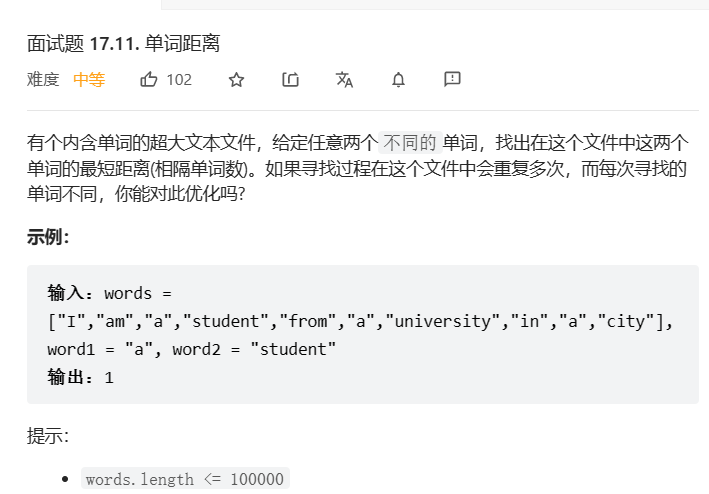

# 1. t1769 移动球的最小操作数

tag:`数组`

[1769. 移动所有球到每个盒子所需的最小操作数 - 力扣（LeetCode）](https://leetcode.cn/problems/minimum-number-of-operations-to-move-all-balls-to-each-box/)


## 1.1 思考和编码

也就是计算所有的1和当前位置的距离之和,暴力求解肯定是超时的

一开始的思路就是遍历boxes,遇到1就给左右的answer进行相加,n^2的时间水平,和暴力没什么两样

### 1.1.1 遍历并增加

```java
public int[] minOperations(String boxes) {
    int[] answer = new int[boxes.length()];
    for(int i = 0;i < boxes.length();i++){
        if(boxes.charAt(i) == '1'){
            for(int j = 0;j < answer.length;j++){
                answer[j] += Math.abs(i - j);
            }
        }

    }
    return answer;
}
```

运行结果:

> 执行用时：35 ms, 在所有 Java 提交中击败了62.91%的用户
>
> 内存消耗：41.8 MB, 在所有 Java 提交中击败了78.95%的用户

### 1.1.2 遍历并修改左右值

另一个想法也是很容易得到,就是在移动过程中根据前一个的情况微调距离情况

需要记录每一个left和right数量,在经过1的时候需要适当进行调整

需要正向和遍历分别记录left和right

时间复杂度On

> answer[i\][left] = answer[i - 1]\[left] + 1 * countLeft(i)
>
> 右边同理

```java
public int[] minOperations(String boxes) {
    int[] answer = new int[boxes.length()];
    int left = 0;
    int leftCount = 0;
    // 正向遍历
    for(int i = 0;i < boxes.length();i++){
        answer[i] += left + leftCount;
        left = left + leftCount;
        if(boxes.charAt(i) == '1'){
            leftCount++;
        }
    }
    int right = 0;
    int rightCount = 0;
    //反向遍历
    for(int i = boxes.length() -  1;i >= 0;i--){
        answer[i] += right + rightCount;
        right = right + rightCount;
        if(boxes.charAt(i) == '1'){
            rightCount++;
        }
    }
    return answer;
}
```

* 代码效果:

  执行用时：3 ms, 在所有 Java 提交中击败了83.71%的用户

  内存消耗：41.8 MB, 在所有 Java 提交中击败了77.69%的用户

* 代码优化细节:

  * 代码中charAt操作消耗的时间过大,可以转换为char[]节省时间
  * 无需对'1'进行判断,可以直接对'0'相减获得更快的效果

# 2. t1163 字典序最大子串

tag:`字符串`,`双指针`

[1163. 按字典序排在最后的子串 - 力扣（LeetCode）](https://leetcode.cn/problems/last-substring-in-lexicographical-order/)

 

## 2.1 思考与编码

### 2.1.2 最大子串有关思考

1. 最大子串一定在字符串末尾

```
证明:
反证
假设n长度的字符串s,最大子串为s[i..j](i < j < n - 1)
则自然有s[i..j+1] >s[i..j]
假设不成立
```

2. 有了这样的支撑,我们固定了子串的末尾,接下来只需要确定startIndex即可

考虑这样一个字符串`cabcbacab`,我们一次遍历能确定子串必然是以`c`开头,这很好思考,字典中最大的字母必然是最大子串的开头

一个朴素的想法就是使用N个指针(N=最大字符的数量),进行完全的横向比较,逐步淘汰获得获胜的起始位置,

或许可以一试,毕竟在等同的情况下,index越靠前,字典序越大,只需要和最前面的index比较即可

> 嗯..我还是想的太简单了,每次遍历都要保存最大值对应的序号,虽说可以制作两个list互相灌数字,但是实在是有些麻烦,我们来想想更简单的方法吧

3. dp的想法

   我们知道s[0..i]的最大子串,一定在字符串的末尾,说不定可以用dp试一试,新的子串一定是比旧的子串要短的,就是感觉依然有n^2的水平,好像和暴力比较后缀没什么两样

## 2.2 题解

### 2.2.1 题解

[[Python3/Java/C++/Go/TypeScript\] 一题一解：双指针（清晰题解） - 按字典序排在最后的子串 - 力扣（LeetCode）](https://leetcode.cn/problems/last-substring-in-lexicographical-order/solution/python3javacgotypescript-yi-ti-yi-jie-sh-3amj/)

好菜,我想不出来更加合适的方法啦,只好求助于题解

题解使用__双指针__的方法,第一个指针`i`指向已经算定的最大子串起始,第二个指针`j`指向当前需要考虑的子串的起始,k作为偏移量使用,初始化

```
i = 0;j = 1;k = 0;
```

每次对比

* s[i + k] == s[j + k],就k+1继续

* s[i + k] < s[j + k],就

  ```java
  i = i + k + 1;
  k = 0;
  if(i >= j){
  	j = i + 1;
  }
  ```

> 这里比较复杂,比较出现大小仅说明i..i+k一定不是最大的子串,所以该方法从i+k+1开始
>
> 至于j的改变,要知道i是设定的最大子串,如果i已经确认在j之后或者处在j的位置,则j没有存在的意义

* s[i + k] > s[j + k],就

  ```java
  j = j + k + 1;
  k = 0;
  ```

> 这里就是一个j被比下去了,它刚刚比的东西都毫无意义了(指j..j+k都可能参与竞争了)

* 临界: 到j+k出界的时候,条件结束

### 2.2.2 思路的代码

```java
class Solution {
    public String lastSubstring(String s) {
        // 吸取教训,改用数组
        char[] arr = s.toCharArray();
        int i = 0;
        int j = 1;
        int k = 0;
        while(true){
            if(j + k >= arr.length){
                break;
            }
            if(arr[i + k] == arr[j + k]){
                k++;
            }else if(arr[i + k] < arr[j + k]){
                i = i + k + 1;
                k = 0;
                if(i >= j){
                    j = i + 1;
                }
            }else{
                j = j + k + 1;
                k = 0;
            }
        }
        return s.substring(i);
    }
}
```

## 2.3 总结

虽然是困难题,但是想不出好办法真是彻底的失败.

双指针的思路有好几个关键点

* 明确已经比较过得不需要比较,i+k和j+k出现大小后,必然有一方全盘都输光
* 始终坚定i是最大,i失败的地方不可能再让j走一次

反正短时间内我是练不出来,呜呜,需要多观察思考题目性质。

# 3. m17.11 单词距离

tag: `数组`

[面试题 17.11. 单词距离 - 力扣（LeetCode）](https://leetcode.cn/problems/find-closest-lcci/)

 


## 3.1 思考与编码

又随到字符串题目了,依然先用暴力的思路来看待问题

### 3.1.1 直接遍历(贪心)

不考虑字符串匹配的问题,当遇到第一个匹配的单词`wordx`开始计数,当再次遇到`wordx`的时候重新计数,遇到`wordy`时,记录数字(如果够小),然后反过来继续匹配即可:

~~说实话的On对思考题也够用了,但是这代码实在是不太美观~~

```java
public int findClosest(String[] words, String word1, String word2) {
    int flag = 0;
    int dis = 0;
    int min = 0xffffff;
    for (int i = 0; i < words.length; i++) {
        if(flag == 0){
            if(words[i].equals(word1)){
                flag = 1;
            }else if(words[i].equals(word2)){
                flag = 2;
            }
        }else{
            dis++;
            if(words[i].equals(word1)){
                if(flag == 2){
                    if(min > dis){
                        min = dis;
                    }

                }
                flag = 1;
                dis = 0;
            }else if(words[i].equals(word2)){
                if(flag == 1){
                    if(min > dis){
                        min = dis;
                    }
                    flag = 2;
                }
                flag = 1;
                dis = 0;
            }
        }
    }
    return min;
}
```

## 3.2 题解

题解也挺简单的,思路基本差不多,就是代码少了,用简单的索引代替了距离,值得借鉴

```java
class Solution {
    public int findClosest(String[] ws, String a, String b) {
        int n = ws.length, ans = n;
        for (int i = 0, p = -1, q = -1; i < n; i++) {
            String t = ws[i];
            if (t.equals(a)) p = i;
            if (t.equals(b)) q = i;
            if (p != -1 && q != -1) ans = Math.min(ans, Math.abs(p - q));
        }
        return ans;
    }
}

作者：AC_OIer
链接：https://leetcode.cn/problems/find-closest-lcci/solution/by-ac_oier-0hv9/
来源：力扣（LeetCode）
著作权归作者所有。商业转载请联系作者获得授权，非商业转载请注明出处。
```

# 4. t2062 统计字符串中的元音字符串

tag: `字符串`

time: 2023年4月30日

[2062. 统计字符串中的元音子字符串 - 力扣（LeetCode）](https://leetcode.cn/problems/count-vowel-substrings-of-a-string/)


## 4.1 思考与编码

乍一看应该是个中等题啊,然后换电脑一看是个简单题

先总结一些性质:

1. 若word[i..j]是子元音字符串,且word[j + 1]是元音,则word[i..j+1]是子元音字符串
2. 若word[i..j]中,word[i + 1..j]包含word[i],则word[i + 1..j]是元音子字符串

> 子问题: 如果一个字符串全由元音组成,那他有多少元音子字符串呢
>
> 对元音进行计数count[letter],然后以左边为外循环,以右边为内循环,枚举

```java
public int subQuest(char[] word, int left, int right, Map<Character,Integer> counter){
    int result = 0;
    // i表示子字符串的起始位置,也就是说i-1已经被去除,除非i == left
    for(int i = left;i < right;i++){
        if(i > left){
            counter.put(word[i - 1],counter.get(word[i - 1]) - 1);
            if(counter.get(word[i - 1]) <= 0){
                break; // 如果左移破坏元音串则退出
            }
        }
        //j表示子字符串的终止位置,也就是j+1被去chu
        int j;
        for(j = right - 1; j > i;j--){
            if(j < right - 1){
                counter.put(word[j + 1],counter.get(word[j + 1]) - 1);
            }
            if(j < right - 1 && counter.get(word[j + 1]) <= 0){
                break;
            }else{
                result++;
            }
        }
        for(int k = j + 1;k < right;k++){
            counter.put(word[k],counter.get(word[k]) + 1);
        }
    }
    return result;
}
```

解题思路:

> 创建一个元音计数器,可以是list也可以是map
>
> 遍历到一个元音word[i]后,放置指针left = i,向右遍历并计数直到非元音:
>
> 1. x先对计数器进行判断,如果没有收集到全部元音,则清空计数器,向后重新寻找
> 2. 若收集到全部元音,则该字符串是元音子字符串,然后转换为子问题

```java
class Solution {
    public int countVowelSubstrings(String word) {
        Map<Character,Integer> counter = new HashMap<>();
        char[] arr = word.toCharArray();
        int left = -1;
        int result = 0;
        boolean isO = false;
        for(int i = 0;i <= arr.length;i++){
            if(i == arr.length ){
                if(left != -1 && counter.size() >= 5){
                    result += subQuest(arr,left,arr.length,counter);
                }
                return result;

            }
            switch(arr[i]){
                case 'a':
                case 'e':
                case 'i':
                case 'o':
                case 'u':
                    isO = true;
                    break;
                default:
                    isO = false;
            };
            if(isO){
                if(left == -1){
                    left = i;
                }
                int count = counter.getOrDefault(arr[i],0);
                counter.put(arr[i],count + 1);
            }else{
                if(left != -1){
                    if(counter.size() >= 5){
                        result += subQuest(arr,left,i,counter);
                    }
                    left = -1;
                    counter.clear();
                }
            }

        }
        return result;
    }
}
```

执行用时：14 ms, 在所有 Java 提交中击败了46.20%的用户

内存消耗：39.5 MB, 在所有 Java 提交中击败了88.30%的用户

# 5. t1122 数组的相对排序

tag: `数组`

time: 2023年5月3日

[1122. 数组的相对排序 - 力扣（LeetCode）](https://leetcode.cn/problems/relative-sort-array/)


## 5.1 思考与编码

一看这题简直是好难,竟然是简单题

转念一想不就写个comparator吗

> comparator:
>
> 如果是两个优先的数(出现在arr2里的数),就返回arr2中的下标的差(先用Map扫描arr2)
>
> 如果是优先数和非优先数比较,就指明优先数在前
>
> 如果是非优先数之间比较,就比大小

浅浅用了下stream,真复杂,能过就行

```java
class Solution {
    public int[] relativeSortArray(int[] arr1, int[] arr2) {
        Map<Integer,Integer> map = new HashMap<>();
        Stream.iterate(0,i-> i+1).limit(arr2.length).forEach(
                i ->{
                    map.put(arr2[i],i);
                }
        );
        return Arrays.stream(arr1).boxed().sorted((a,b)->{
            if(map.containsKey(a)){
                if(!map.containsKey(b)){
                    return -1;
                }
                return map.get(a).intValue() - map.get(b).intValue();
            }else{
                if(map.containsKey(b)){
                    return 1;
                }
                return (int)a - (int)b;
            }
        }).mapToInt(i -> i == null? 0: i.intValue()).toArray();

    }
}
```

执行用时：7 ms, 在所有 Java 提交中击败了6.77%的用户

内存消耗：40.6 MB, 在所有 Java 提交中击败了44.18%的用户

# 6. t187 重复DNA序列

tag:`字符串`

time: 2023年5月5日

[187. 重复的DNA序列 - 力扣（LeetCode）](https://leetcode.cn/problems/repeated-dna-sequences/)


## 6.1 暴力的尝试

今天有点心浮气躁,可能是热的,先写个暴力吧,每遍历到就放进hashSet,如果hashSet里有了就放进list

```java
class Solution {
    public List<String> findRepeatedDnaSequences(String s) {
        Set<String> set = new HashSet<>();
        List<String> list = new ArrayList<>();
        for(int i = 0;i <= s.length() - 10;i++){
            String a = s.substring(i,i+10);
            if(set.contains(a) && !list.contains(a)){
                list.add(a);
            }else{
                set.add(a);
            }
        }
        return list;
    }
}
```

执行用时：18 ms, 在所有 Java 提交中击败了67.92%的用户

内存消耗：50.8 MB, 在所有 Java 提交中击败了6.85%的用户

暴力能解就好

题解给的是一种位运算思想,就是把四种的字母变成两位的数字,来简化时间空间

## 7. t1419 数青蛙

tag: 无

time: 2023年5月6日

[1419. 数青蛙 - 力扣（LeetCode）](https://leetcode.cn/problems/minimum-number-of-frogs-croaking/)


## 6.1 计数

从c开始叫,给croak计数,到k就停

```java
 public int minNumberOfFrogs(String croakOfFrogs) {
     char[] chars = croakOfFrogs.toCharArray();
     int c = 0, r = 0,o = 0,a = 0,k = 0;
     int count = 0;
     int max = 0;
     for(int i = 0;i < chars.length;i++){
         switch(chars[i]){
             case 'c': c++;count++;break;
             case 'r': r++;break;
             case 'o': o++;break;
             case 'a': a++;break;
             case 'k': k++;count--;break;
             default: return -1;
         }
         if(!(r<=c && o <= r && a <= o && k <= a)){
             return -1;
         }
         if(count > max){
             max = count;
         }
     }
     if(!(c == r && r == o && o == a && a == k)){
         return -1;
     }
     return max;
 }
```

# 7 t1392 最长快乐前缀(KMP复健)

tag: `字符串`,`KMP`

time: 2023年5月6日

[1392. 最长快乐前缀 - 力扣（LeetCode）](https://leetcode.cn/problems/longest-happy-prefix/)


## 7.1 思考(KMP算法)

考虑一个字符串s,它要计算**最长**快乐前缀,也就是s[0..i] == s[j..n]

回忆一下kmp算法,kmp算法是一种字符串匹配算法,算法的宗旨是主字符串上的匹配指针永远不需要回溯

```text
当s1[i] != s2[j]时,i固定不动,而j = next[j],进行s1[i]与s2[next[j]]的匹配
```

**next数组:** 基于子字符串计算的一个数组,next[j]满足以下性质:

* (next[j] > 0时)$$s2[0..next[j] - 1] == s2[j - next[j]..j - 1]$$
* $$s2[next[j]] != s2[j]$$

next数组的计算方式(动态规划):

> next[0] = -1;
>
> 对于j > 0,考虑一下客观条件:
>
> 如果s[j - 1] == s2[next[j - 1]],则next[j] = next[j - 1] + 1 ----------定理1
>
> 如果s[j - 1] != s2[next[j - 1]],则考虑s2[next[next[j - 1]]] == s[j - 1],next[j] = next[next[j-1]] + 1 ----- 定理2
>
> 递归调用,但是如果在末尾时,有s[j] == s[next...[next[j-1]] + 1],则说明会走匹配错误的老路,可以在此基础上给答案多next一层优化一下(也可以while到不相等为止)

> 定理1 证明:
>
> s[0..next[j - 1] - 1] == s2[j - 1 - next[j - 1].. j - 2],又有s[j - 1 ]  == s[next[j - 1]]
>
> 所以s[0..next[j - 1]] == s2[j - 1 - next[j - 1].. j - 1],将next[j]= next[j - 1] + 1 代入,成立
>
> 接下来只要用next[j-1]最大证明next[j]最大就证好了,不写了

$$
\begin{aligned}
&定理2 证明:\\\\

&next[next[j-1]] 满足\\ 
&s2[0..next[next[j-1]] - 1] == s2[next[j - 1] - next[next[j - 1]].. next[j - 1] - 1]\\\\
&又因为next[j - 1] - next[next[j - 1]] > 0; \\&且s[0..next[j - 1] - 1] == s2[j - 1 - next[j - 1].. j - 2]\\
&所以s[next[j-1]-next[next[j-1]]..next[j-1]-1] == s[j-1-next[next[j-1]]..j-2]\\
&也就是s[0..next[next[j-1]]-1]==s[j-(1+next[next[j-1]])..j-2]

\\\\
& 又有s[j-1]==s[next[next[j-1]]-1],所以\\
&s[0..next[next[j-1]]]==s[j-(1+next[next[j-1]])..j-1]\\
&可得next[j] = next[next[j-1]]\\
&绕弯子可证明其最大,不正了
\end{aligned}
$$

代码:

```java
public int[] getNext(String s){
    int[] next = new int[s.length()];
    char[] chars = s.toCharArray();
    next[0] = -1;
    next[1] = 0;
    for (int i = 2; i < chars.length; i++) {
        int nextVal = next[i - 1];
        while(nextVal >= 0){
            if(chars[i - 1] == chars[nextVal]){
                if(chars[i] == chars[nextVal + 1]){
                    // 本题中判断这个可以去掉,因为我们需要匹配最后一个字符
                    nextVal = next[nextVal];
                }
                break;
            }else{
                nextVal = next[nextVal];
            }
        }
        next[i] = nextVal + 1;
    }
    return next;
}
```

## 7.2 本题的解

```java
public String longestPrefix(String s) {
    int[] next = getNext(s);
    int i = next[s.length() - 1];
    while(i >= 0 && s.charAt(i) != s.charAt(s.length() - 1)){
        i = next[i];
    }
    if(i < -1){
        return "";
    }else{
        return s.substring(0,i + 1);
    }
}
```

执行用时：13 ms, 在所有 Java 提交中击败了72.34%的用户

内存消耗：43.7 MB, 在所有 Java 提交中击败了10.29%的用户

## 7.3 官方题解:Rabin-Karp 字符串编码

https://leetcode.cn/problems/longest-happy-prefix/solution/zui-chang-kuai-le-qian-zhui-by-leetcode-solution/

`Rabin-Karp算法`是一种将字符串映射为整数的hash算法


简单的说就是将str看做base进制的数,然后计算成整数

* 大数字问题: 取模,挑一个**较大的质数**取模以减少碰撞

题解代码:

```java
class Solution {
    public String longestPrefix(String s) {
        int n = s.length();
        long prefix = 0, suffix = 0;
        long base = 31, mod = 1000000007, mul = 1;
        int happy = 0;
        for (int i = 1; i < n; ++i) {
            prefix = (prefix * base + (s.charAt(i - 1) - 'a')) % mod;
            suffix = (suffix + (s.charAt(n - i) - 'a') * mul) % mod;
            if (prefix == suffix) {
                happy = i;
            }
            mul = mul * base % mod;
        }
        return s.substring(0, happy);
    }
}

//作者：LeetCode-Solution
//链接：https://leetcode.cn/problems/longest-happy-prefix/solution/zui-chang-kuai-le-//qian-zhui-by-leetcode-solution/
//来源：力扣（LeetCode）
//著作权归作者所有。商业转载请联系作者获得授权，非商业转载请注明出处。
```

 

# 8. t38 外观数列

[38. 外观数列 - 力扣（LeetCode）](https://leetcode.cn/problems/count-and-say/)

tag: `字符串`

time: 2023年5月9日


## 8.1 思考和找规律

第一个找到的规律: 末尾不是11就是21

* 因为末尾始终是1,1可以延伸出11,11变为21,21变为1211循环
* 偶数是11,奇数是21

然后...其实没什么规律,打表过吧

```java
class Solution {
    public String countAndSay(int n) {
        if(n == 1) return "1";
        String[] s = new String[n + 1];
        s[1] = "1";
        char cur;
        int count;
        for(int i = 2;i <= n;i++){
            cur = s[i - 1].charAt(0);
            count = 0;
            String res = "";
            for(int j = 0;j < s[i-1].length();j++){
                if(cur == s[i - 1].charAt(j)){
                    System.out.println(count);
                    count++;
                }else{
                    
                    res += "" + count + cur;
                    cur = s[i - 1].charAt(j);
                    count = 1;
                }
            }
            
            res += "" + count + cur;
            s[i] = res;
        }
        System.out.println(Arrays.toString(s));
        return s[n];
    }
}
```

# 9. t137 只出现一次的数字

[只出现一次的数字 II](https://leetcode.cn/problems/single-number-ii/)


## 9.1 思考

题目要求线性无空间,也就是说经过一个数字时,只有常量级别的记录可以使用,该记录一定是关于先前所有数字的

首先想到的是异或,如果其他数字重复两次的话,异或到最后一定是多出来的数字

那我们可不可以找一种跟异或类似的计算方式,比如我们记为`@`(这数电全忘光了)
$$
n@a@a@a=n\\
$$
考虑位运算:

状态转移表格使用代码生成,规模2^4 = 16

满足以下条件:

1. 经过三次运算后,数字回归到0
2. 与0进行后为自己本身

## 9.1 数电(题解)

自己看的时候确实想起来数电了,但是实在是忘了

四种状态: 

遇到0: 维持自身

遇到1: 00->01->10->00(因为需要3步走回自身,所以用两位表示状态)

* 真值表

| (a,b) | x    | res1 | res2 |
| ----- | ---- | ---- | ---- |
| 00    | 0    | 0    | 0    |
| 00    | 1    | 0    | 1    |
| 01    | 0    | 0    | 1    |
| 01    | 1    | 1    | 0    |
| 10    | 0    | 1    | 0    |
| 10    | 1    | 0    | 0    |
|       |      |      |      |


> 真值表的使用: 将res1 == 1对应的情况列出来即可

$$
res1 = /abx+a/b/x\\
res2 = /a/bx+/ab/x=/a(b\oplus x)
$$

由于便面上使用了两位数字,其实实际上应该初始化两个0,分别进行作为

还有优化,以后有兴趣看看吧

https://leetcode.cn/problems/single-number-ii/solution/zhi-chu-xian-yi-ci-de-shu-zi-ii-by-leetc-23t6/

# 10. t1016 子串能表示从 1 到 N 数字的二进制串

tag: 

time: 2023年5月11日

[1016. 子串能表示从 1 到 N 数字的二进制串 - 力扣（LeetCode）](https://leetcode.cn/problems/binary-string-with-substrings-representing-1-to-n/)


## 10.1 思考1(针对子序列情况,不符合这题)

如何复用是一个问题,先总结一些想法:

数字n在s中的**充要条件:** 假设n-2^x = t(x取最大),在s中找到第一个1,在这个1后面如果有x-1位的0-t,那2^x到n则都成立

从第二层开始,需要同时找到0和1每一个进入一次下一层

第一个找到的先放着,第二个先进下一层,如果成功了那就没事了

> 如果n足够大,先算出n的位数x
>
> 找到第一个1的位置i,将i和x-1输入,进入递归
>
> 如果需要找的位数为0,则返回true
>
> 向后找0和1,如果找不到就返回false
>
> 找得到,就选后面一个,进入下一层递归x-2

```java
/**
         *
         * @param chars
         * @param pre 上一个检索到的位置
         * @param x 剩下要检索的位数
         * @return
         */
public boolean dp(char[] chars,int pre,int x){
    if(x == 0){
        return true;
    }
    boolean zero = false;
    boolean one = false;
    int index = -1;
    //找到后一个0或者1
    for (int i = pre + 1; i < chars.length; i++) {
        if(zero && one){
            break;
        }
        if(chars[i] == '0'){
            zero = true;
            index = i;
        }else{
            one = true;
            index = i;
        }
    }
    if(index == -1){
        return false;
    }
    return dp(chars,index,x - 1);
}
}
```

```java
public boolean queryString(String s, int n) {
    char[] chars = s.toCharArray();
    int x = 0;
    // 算位数
    while(n != 0){
        n >>= 1;
        x++;
    }
    int pre = -1;
    // 检索第一个1的位置
    for (int i = 0; i < chars.length; i++) {
        if(chars[i] == '1'){
            pre = i;
            break;
        }
    }
    if(pre == -1){
        return false;
    }
    return dp(chars,pre,x - 1);
}
```

## 10.2 题解: 暴力和优化

https://leetcode.cn/problems/binary-string-with-substrings-representing-1-to-n/solution/san-chong-suan-fa-cong-bao-li-dao-you-hu-nmtq/

直接暴力

```java
class Solution {
    public boolean queryString(String s, int n) {
        for(int i=1;i<=n;i++){if(!s.contains(Integer.toBinaryString(i))){return false;}}
        return true;
    }
}
```

优化:


总之就是从1开始,枚举到n以上就停

```java
    public boolean queryString(String S, int n) {
        var seen = new HashSet<Integer>();
        var s = S.toCharArray();
        for (int i = 0, m = s.length; i < m; ++i) {
            int x = s[i] - '0';
            if (x == 0) continue; // 二进制数从 1 开始
            for (int j = i + 1; x <= n; j++) {
                seen.add(x);
                if (j == m) break;
                x = (x << 1) | (s[j] - '0'); // 子串 [i,j] 的二进制数
            }
        }
        return seen.size() == n;
    }
}

作者：endlesscheng
链接：https://leetcode.cn/problems/binary-string-with-substrings-representing-1-to-n/solution/san-chong-suan-fa-cong-bao-li-dao-you-hu-nmtq/
来源：力扣（LeetCode）
著作权归作者所有。商业转载请联系作者获得授权，非商业转载请注明出处。
```

后面还有为什么暴力的解释,我看不懂

# 11. t1156 单字符重复子串的最大长度

tag: `字符串`

time: 2023年5月16日

[1156. 单字符重复子串的最大长度 - 力扣（LeetCode）](https://leetcode.cn/problems/swap-for-longest-repeated-character-substring/)


## 11.1 思考1: 滑动窗口

交换字符能通过以下几种情况改变字符串长度:

1. 两个相同的字符串之间有一个其他字符,把这个其他字符取缔掉:
   * 第一种: 从别处取缔,长度为a+b+1
   * 第二种: 从该字符串取缔,长度为a+b
2. 单纯给一个串增加一个字符,从别处来

所以我们遍历完一串后,遇到其他字符,先看一眼下一串

我们可以整一个滑动窗口:

> 左端left到右端right都是同一种字符
>
> 当遇到[right]!=[left]的时候,mid=right,如果count[[left]] > right - left,就继续将right右移
>
> 若最终[right]!=[left]时,right - left < count[[left]],则长度为right - left,否则为right-left - 1
>
> 然后将right和left设置到mid的节点,再次遍历

```java
class Solution {
    public int maxRepOpt1(String text) {
        char[] chars = text.toCharArray();
        int[] count = new int[26];
        for(int i = 0;i < chars.length;i++){
            count[chars[i] - 'a']++;
        }
        int left = 0;
        int right = 0;
        int mid;
        int max = 0;
        int counting = 0;
        while(left < chars.length){

            right++;
            if(right >= chars.length){
                if(right - left + ((count[chars[left] - 'a'] > right - left)?1:0 )> max){
                    max = right - left+ ((count[chars[left] - 'a'] > right - left)?1:0 );
                }
                break;
            }
            if(chars[right] != chars[left]){
                mid = right;
                right++;
                while(right < chars.length && chars[right] == chars[left]){
                    right++;
                }
                int len = right - left;
                if(len <= count[chars[left] - 'a'] && len > max){
                    max = len;
                }else if(max < len - 1){
                    max = len - 1;
                }
                left = mid;
                right = mid;
            }
        }
        return max;
    }
}
```

执行用时：2 ms, 在所有 Java 提交中击败了94.09%的用户

内存消耗：39.7 MB, 在所有 Java 提交中击败了91.98%的用户

# 12. m0109 字符串轮转

[面试题 01.09. 字符串轮转 - 力扣（LeetCode）](https://leetcode.cn/problems/string-rotation-lcci/)


解: 当s1,s2长度相同,且s2+s2包含s1时,成立

# 13 t1983 范围和相等的最宽索引对

tag: `前缀和`

time: 2023年5月17日

[1983. 范围和相等的最宽索引对 - 力扣（LeetCode）](https://leetcode.cn/problems/widest-pair-of-indices-with-equal-range-sum/)


## 13.1 思考: 前缀和

众所周知子序列sum(i..j)=preSum(j)-preSum(i-1)

所以我第一个思路是算出前缀和暴力枚举,不过超时是必然了

```java
public int widestPairOfIndices(int[] nums1, int[] nums2) {
    int []prefix1 = new int[nums1.length];
    int[] prefix2 = new int[nums1.length];
    for(int i = 0;i < nums1.length;i++){
        if(i == 0){
            prefix1[i] = nums1[i];
            prefix2[i] = nums2[i];
        }else{
            prefix1[i] = prefix1[i - 1] + nums1[i];
            prefix2[i] = prefix2[i - 1] + nums2[i];
        }
    }
    for(int i = nums1.length;i > 0;i--){
        System.out.println(i);
        if(prefix1[i - 1] == prefix2[i - 1]){
            return i;
        }
        for(int j = 0;j + i < nums1.length;j++){
            if(prefix1[j + i] - prefix1[j] == prefix2[j + i] - prefix2[j]){
                return i;
            }
        }
    }
    return 0;
}
```

## 13.2 思考2: 差值的前缀和

重新构建数组arr[i]=(nums1[i]-nums2[i]),该数组前缀和两个相等的数字,即为结果两端

我们用hashMap记录下某个数字最早出现的位置,更新即可

> prefix数组可以省略,记录前一个即可

```java
public int widestPairOfIndices(int[] nums1, int[] nums2) {
    // 前缀和
    int prefix = 0;
    Map<Integer,Integer> map = new HashMap<>();
    // 记录第-1个,是因为第0个也可能满足条件
    map.put(0,-1);
    int max = 0;
    int next;
    for(int i = 0;i < nums1.length;i++){
        //System.out.println(prefix);
        prefix += nums1[i] - nums2[i];
        if(map.containsKey(prefix)){
            // 要想清楚,左边的是不包含在里面的
            next = i - map.get(prefix);
            if(next > max){
                max = next;
            }
        }else{
            map.put(prefix,i);
        }
    }
    return max;
}
```

执行用时：24 ms, 在所有 Java 提交中击败了57.14%的用户

内存消耗：62.1 MB, 在所有 Java 提交中击败了14.29%的用户

# 14. t1234 替换子串得到平衡字符串

tag: `滑动窗口`

time: 2023年5月19日

[1234. 替换子串得到平衡字符串 - 力扣（LeetCode）](https://leetcode.cn/problems/replace-the-substring-for-balanced-string/)


## 14.1 思考: 滑动窗口

子串能够替换当且仅当: <u>该子串以外的部分,每个字母的数量小于等于4/n</u>

思路很好想,我主要是要记录滑动窗口的用法:

1. 记录数量

2. 从左到右枚举左端点`l`的位置,向右寻找`r`的位置(r永远不用左移)

   记得适时操作数量记录

# 15. t1433 检查一个字符串是否可以打破另一个字符串

tag: `字符串`

time: 2023年5月20日

[1433. 检查一个字符串是否可以打破另一个字符串 - 力扣（LeetCode）](https://leetcode.cn/problems/check-if-a-string-can-break-another-string/)


## 15.1 思考: 排序

拍完序一个个对比不就好了吗

```java
public boolean checkIfCanBreak(String s1, String s2) {
    char[] chars1 = s1.toCharArray();
    char[] chars2 = s2.toCharArray();
    Arrays.sort(chars1);
    Arrays.sort(chars2);
    int l = 0,r = 0;
    for(int i = 0;i < chars1.length;i++){
        if(chars1[i] == chars2[i]){
            continue;
        }else if(chars1[i] < chars2[i]){
            if(r != 0){
                return false;
            }
            l = 1;
        }
        else{
            if(l != 0){
                return false;
            }
            r = 1;
        }
    }
    return true;
}
```

执行用时：7 ms, 在所有 Java 提交中击败了58.87%的用户

内存消耗：43.9 MB, 在所有 Java 提交中击败了9.93%的用户

通过测试用例：103 / 103

# 16. t2145 统计隐藏数组数目

tag: `数组`

time:2023年5月24日

[2145. 统计隐藏数组数目 - 力扣（Leetcode）](https://leetcode.cn/problems/count-the-hidden-sequences/description/)


## 16.1 思考: 最大/小连续和

这题啊,主要考一个连续整数和,

问题的核心在于找到一个__最大值__和一个__最小值__,而最大值和最小值之间,一定有一个最大/最小连续和

使用贪心计算:

> 计算最大连续和时,如果sum<0,就回到0重新计算
>
> 最小和反之

```java
class Solution {
    public int numberOfArrays(int[] differences, int lower, int upper) {
        long maxi = 0,mini = 0x7fffffff;
        long sum1 = 0,sum2 = 0;
        for(int i = 0;i < differences.length;i++){
            sum1 += differences[i];
            sum2 += differences[i];
            if(maxi < sum1) maxi = sum1;
            if(mini > sum2) mini = sum2;
            if(sum1 < 0) sum1 = 0;
            if(sum2 > 0) sum2 = 0;
        }
        long dif = Math.max(maxi,-mini);
        return Math.max(0,(int)((upper - lower + 1) - dif));
    }
}
```

时间4 ms击败90.77%

内存54.8 MB击败15.38%

## 17. t340 至多包含k个不同字符的最长子串

tag: `滑动窗口`

time: 2023年6月2日

[340. 至多包含 K 个不同字符的最长子串 - 力扣（LeetCode）](https://leetcode.cn/problems/longest-substring-with-at-most-k-distinct-characters/)


## 17.1 思考: 滑动窗口

根据本题给滑动窗口设计一个简易板子写法

> 一般算法:
>
> right向右移,将right所在位置加入窗口,直到窗口不再满足要求
>
> 此时将left向右移一格,将left原来的位置扔出窗口,如果此时仍不满足,则left继续左移

```java
int left = 0;
int right = -1; // right初始化为-1,方便右移加入,不用预处理
while(right < s.length()){
    if(map.size() <= k){ // 满足条件
        if(right - left + 1 > max){ // right - left + 1直接为长度
            max = right - left + 1;
        }
        right++; // 先给right++,但是要判断是否溢出,溢出就不需要修改了
        if(right < s.length())
            map.put(s.charAt(right),map.getOrDefault(s.charAt(right),0) + 1);
    }else{
        left++; // 不满足条件就left右移即可
        int temp = map.getOrDefault(s.charAt(left - 1),0);
        if(temp <= 1){
            map.remove(s.charAt(left - 1));
        }else{
            map.put(s.charAt(left - 1),temp - 1);
        }
    }
}
```

板子:

```java
left=0,right=-1
while(right<n){
    if(ok){
        count();
        right++;
        map[right]++;
    }else{
        left++;
        map[left]--;
    }
}
```

# 17. t1277 统计全为 1 的正方形子矩阵

tag:

time: 2023年6月3日

[1277. 统计全为 1 的正方形子矩阵 - 力扣（LeetCode）](https://leetcode.cn/problems/count-square-submatrices-with-all-ones/)


## 17.1 思考1: 按行计数

这是一种类似递推的方式

迭代,对每一行计数:

> 当前行的第i列为1,则count[i]+=1
>
> 当前行的第i列为0,则count[i]=0

每次计数后,计算当前行产生的正方形数量(以当前行为底边的正方形数量)

### 17.1.1 在数组中求出连续大于x的数量

我们要解决一个子问题算出每个行代表的正方形数量

连续大于任何值很难量化

我摆烂了,从小到大枚举算了

```java
public int countSquares(int[][] matrix) {
    int []count = new int[matrix[0].length];
    int res = 0;
    // 这里是循环矩阵
    for(int i = 0;i < matrix.length;i++){
        for(int j = 0;j < matrix[0].length;j++){
            if(matrix[i][j] == 1){
                count[j] += 1;
                // 这里是枚举正方形大小
                for(int k = 1;k <= count[j];k++){
                    boolean flag = true;
                    // 这里是往前论证正方形存在
                    for(int m = 0;m < k;m++){
                        if(j - m < 0 || count[j - m] < k){
                            flag = false;
                            // 一旦发现不对劲,直接break到上上层循环去
                            break;
                        }
                    }
                    if(flag){
                        res += 1;
                    }else{
                        break;
                    }
                }
            }else{
                count[j] = 0;
            }
        }
    }
    return res;
}
```

执行用时：5 ms, 在所有 Java 提交中击败了96.15%的用户

内存消耗：52.9 MB, 在所有 Java 提交中击败了25.16%的用户

## 17.2 题解: 动态规划

https://leetcode.cn/problems/count-square-submatrices-with-all-ones/solution/tong-ji-quan-wei-1-de-zheng-fang-xing-zi-ju-zhen-2/

# 18. t49 字母异位词分组 

tag: `字符串`

time: 2023年6月7日

[49. 字母异位词分组 - 力扣（LeetCode）](https://leetcode.cn/problems/group-anagrams/)


## 18.1 特殊思路: 质数相乘

将26个字母映射成26个质数,每个组合的乘数都是唯一的(但必须考虑到溢出问题)

## 18.2 普通思路: 排序

对每个string排序

```java
char[] ch=s.toCharArray();
Arrays.sort(ch);
String key=String.valueOf(ch);
if(!map.containsKey(key))    map.put(key,new ArrayList<>());
map.get(key).add(s);
```

# 19. t1058 最小化舍入误差以满足目标 

tag: `字符串`,`贪心`

time: 2023年6月9日

[1058. 最小化舍入误差以满足目标 - 力扣（LeetCode）](https://leetcode.cn/problems/minimize-rounding-error-to-meet-target/)


## 19.1 思考: 计算

可以贪心一个,我们先计算好全取floor差多少

然后取出减幅度最大的几个
$$
f = x - (1-x)=2x-1
$$

# 20. t991 坏了的计算器

tag: `数学`

time: 2023年6月9日

[991. 坏了的计算器 - 力扣（LeetCode）](https://leetcode.cn/problems/broken-calculator/)


## 20.1 思考: 数学

$$
target = ((num - x) * 2 - x1) * 2....\\
=2^n * num - 2^{n}x....
$$

找到第一个n,然后推算x即可

```java
class Solution {
    public int brokenCalc(int startValue, int target) {
        if(target <= startValue){
            return startValue - target;
        }
        int num = startValue;
        int count = 0;
        int a = 1;
        // 找到n,也就是count,a == 2^n
        while(num < target){
            num *= 2;
            count++;
            a <<= 1;
        }
        int diff = num - target;
        while(diff > 0){
            count += (diff) / a;
            diff = diff % a;
            a /= 2;
        }
        return count;
    }
}
```

# 21. t1262 可被三整除的最大和 

[1262. 可被三整除的最大和 - 力扣（LeetCode）](https://leetcode.cn/problems/greatest-sum-divisible-by-three/)


## 21.1 思考1: 记忆化搜索

我们分别整一个`mod2list`和`mod1list`,然后根据三种情况进行记忆化搜索:

参数: index2,index1

情况:

1. 提出三个1
2. 提出一个1,一个2
3. 提出三个2

但是爆内存了,换个角度想想感觉应该优先2+1然后三连击

```java
public int dfs( List<Integer> m1, List<Integer> m2,int i1,int i2){
    if(mem[i1][i2] != 0){
        return mem[i1][i2];
    }
    int max = 0;
    int temp;
    if(m1.size() - i1 >= 3){
        temp = m1.get(i1) + m1.get(i1 + 1) + m1.get(i1 + 2) + dfs(m1,m2,i1 + 3,i2);
        max = Math.max(temp,max);
    }
    if(m2.size() - i2 >= 3){
        temp = m2.get(i2) + m2.get(i2 + 1) + m2.get(i2 + 2) + dfs(m1,m2,i1,i2 + 3);
        max = Math.max(temp,max);
    }
    if(m1.size() - i1 >= 1 && m2.size() - i2 >= 1){
        temp = m2.get(i2) + m1.get(i1) + dfs(m1,m2,i1 + 1,i2 + 1);
        max = Math.max(temp,max);
    }
    mem[i1][i2] = max;
    return max;
}
```

## 21.2 思考2: 状态转移方程

其实在dfs代码中状态转移方程已经呼之欲出了

我们考虑`dp[x][y]`中x-1为选取的m1坐标,y-1为m2坐标,有:
$$
dp[x][y]=max(dp[x-1][y-1]+m1[x]+m2[y],\\dp[x-3][y]+m1[x-2]+m1[x-1]+m1[x],\\
dp[x][y-3]+m2[y-2]+m2[y-1]+m2[y])
$$

# 22. t15 三数之和

[15. 三数之和 - 力扣（LeetCode）](https://leetcode.cn/problems/3sum/)


## 22.1 思考: 双指针

先从小到大固定住一个数,然后用双指针做两数之和

为了去掉重复,可以指定固定数为最小数,向右找和

# 23. t41 缺失的第一个正整数

[41. 缺失的第一个正数 - 力扣（LeetCode）](https://leetcode.cn/problems/first-missing-positive/)


## 23.1 思考: 强行占用位空间

所有负数都是可以无视的,也就是说,对于所有计入的数,它们的__最高位__都是空出来的

我们先遍历一遍将所有负数置为0,

第二次遍历时,若为正数,将对应的下标对应的正数 - 1__或上Integer.MIN_VALUE__

如果为负数,就先异或MIN_VALUE再计算

最后遍历找到第一个非负数即可

```java
class Solution {
    public int firstMissingPositive(int[] nums) {
        int min = 0x7fffffff,max = -1;
        for(int i = 0;i < nums.length;i++){
            if(nums[i] < 0){
                nums[i] = 0;
            }
        }
        for(int i = 0;i < nums.length;i++){
            if(nums[i] > 0){
                if(nums[i] - 1 < nums.length){
                    nums[nums[i] - 1] |= Integer.MIN_VALUE;
                }
            }else if(nums[i] < 0){
                int temp = nums[i] ^ Integer.MIN_VALUE;
                if(temp > 0 && temp - 1 < nums.length){
                    nums[temp - 1] |= Integer.MIN_VALUE;
                }
            }
        }
        // System.out.println(Arrays.toString(nums));
        for(int i = 0;i < nums.length;i++){
            if(nums[i] >= 0){
                return i + 1;
            }
            
        }
        return nums.length + 1;
        
    }
}
```

执行用时：1 ms, 在所有 Java 提交中击败了97.49%的用户

内存消耗：57.9 MB, 在所有 Java 提交中击败了28.61%的用户

# 24. t42 接雨水

[42. 接雨水](https://leetcode.cn/problems/trapping-rain-water/)


## 24.1 思考1: 排水

水会流失的原因是因为两边没有高墙,假设两边有墙,并且已经将水灌到齐平最高位

然后撤掉两边墙,计算流失的水量

* 步骤1: 遍历,计算最大值的最左和最右位置,计算总和,计算高墙环境下的总水量
* 步骤2: 从左排水,从左遍历到最左最大值,每遍历到一个"最大值"时,更新__保水墙__,也就是右边的位置在该高度能保住的最大水量

* 步骤3: 从右排水,步骤一致

---

1. 遍历代码:

```java
int minI = Integer.MAX_VALUE,maxI = -1;
int max = -1;
int sum = 0;
int total;
for(int i = 0;i < height.length;i++){
    sum += height[i];
    if(height[i] > max){
        max = height[i];
        minI = i;
        maxI = i;
    }else if(height[i] == max){
        maxI = i;
    }
}
total = max * height.length - sum;
if(total <= 0) return 0;
```

2,3:

```java
int wall = 0;
for(int i = 0;i < minI;i++){
    if(height[i] > wall){
        wall = height[i];
    }
    total -= (max - wall);
}
wall = 0;
for(int i = height.length - 1;i > maxI;i--){
    if(height[i] > wall){
        wall = height[i];
    }
    total -= (max - wall);
}
return total;
```

执行用时：0 ms, 在所有 Java 提交中击败了100.00%的用户

内存消耗：43.6 MB, 在所有 Java 提交中击败了12.63%的用户

# 25. t76 最小覆盖子串

#### [76. 最小覆盖子串](https://leetcode.cn/problems/minimum-window-substring/)


## 26.1 思考1: 双指针

左指针初始化为0,右指针初始化为-1

循环开始,如果不满足条件,右指针向右移动一格(需要判断溢出)并计入

* 计入: 
  * 首先查找map中有无相关字符,如果没有就算了
  * 如果map中数字小于等于0,说明需求已经满足,这个时候继续-1,但是不改变sum,作为一种"预支"
  * 如果map中数字大于0,则sum--,数字--
  * 

如果已经满足条件,先检查是否可以记录,范围为left..right,left将自己移出并left++

* 移出:
  * 查找map中相关字符
  * 如果map中数字小于0,则说明有预支,+1即可
  * 不然,则sum++,数字++;

```java
public String minWindow(String s, String t) {
    Map<Character,Integer> map = new HashMap<>();
    int sum = 0;
    for(int i = 0;i < t.length();i++){
        sum++;
        map.put(t.charAt(i),map.getOrDefault(t.charAt(i),0) + 1);
    }
    int left = 0,right = -1;
    int minL = -10000,minR = 1000000;
    char[] ss = s.toCharArray();
    Integer temp;
    while(right < s.length()){
        if(sum <= 0){
            // 合格
            // 记录
            if(right - left < minR - minL){
                minL = left;
                minR = right;
            }
            temp = map.get(ss[left]);
            if(temp != null){
                if(temp >= 0){
                    sum++;
                }
                map.put(ss[left],temp + 1);
            }
            left++;
        }else{
            // 不合格
            right++;
            if(right >= s.length()) break;
            temp = map.get(ss[right]);
            if(temp != null){
                if(temp > 0){
                    sum--;
                }
                map.put(ss[right],temp - 1);
            }
        }

    }
    if(minL < 0) return "";
    return s.substring(minL,minR + 1);
}
```

执行用时：8 ms, 在所有 Java 提交中击败了74.60%的用户

内存消耗：42.8 MB, 在所有 Java 提交中击败了51.73%的用户

# 26. t2681 英雄的力量 

[2681. 英雄的力量 - 力扣（LeetCode）](https://leetcode.cn/problems/power-of-heroes/)


## 26.1 思考: 贡献

排序后,考虑index为最大值的力量:
$$
index^2*index+index^2*(index-1)+index^2*2*(index-2)...\\
=index^2*index+index^2*\Sigma_{i=index}^12^{i-1}(index-i)
$$
后面的部分是可以累积的,每次循环的末尾先`*2`再加上新值

```java
class Solution {
    int mod = (int)(1e9+7);
    public int sumOfPower(int[] nums) {
        long pre = 0;
        Arrays.sort(nums);
        long res = 0;
        long cur;
        for(int i = 0;i < nums.length;i++){
            cur = nums[i];
            res += (((cur * cur) % mod) * cur) % mod;
            res += (((cur * cur) % mod) * pre) % mod;

            res = res % mod;
            pre = ((pre * 2 % mod) + cur) % mod;
        }
        return (int)(res%mod);
    }
}
```

