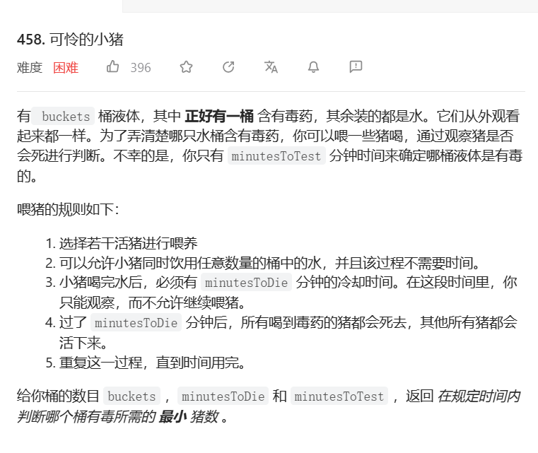
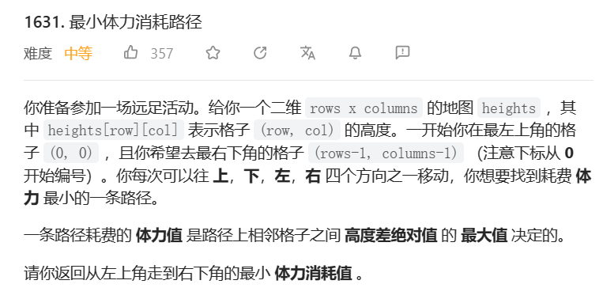
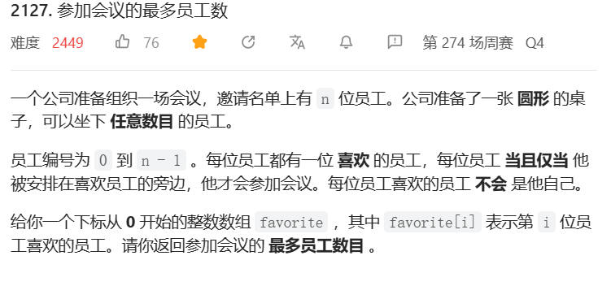

# 9-9-9 t1049 最后一块石头的重量II

tag:

time: 2023年5月11日

[1049. 最后一块石头的重量 II - 力扣（LeetCode）](https://leetcode.cn/problems/last-stone-weight-ii/)

# 7-7-7. t458 可怜的小猪

tag: 

time: 2023年5月19日

[458. 可怜的小猪 - 力扣（LeetCode）](https://leetcode.cn/problems/poor-pigs/)

## 7-7-7.1 思考:海明码

这让我想起了以前有个类似的小鼠题目,是用海明码的思路解决的

> 也就是先让二进制末尾为1的给吃,吃死了说明编号末尾为1
>
> 接着让二进制倒数第二位为1的吃,吃死了说明倒数第二位为1
>
> ...以此类推

也就是说最后的总次数应该>$log_2B$

而(每次只会运转干掉一头猪)

假设猪的数量为n,总次数即为tot

也就是需要满足
$$
\begin{aligned}
tot=(2n - times + 1) * times / 2 &>= log_2B\\
times*2n-times^2+times&>=2*log_2B\\
2n&>=2*log_2B/times+times-1
\end{aligned}
$$
但实际上并不是这样,可能出现一波同时喝死四只的情况,算了,不做了

# 6-6-6. t1631 最小体力消耗路径

tag:

time: 2023年5月23日

[1631. 最小体力消耗路径 - 力扣（LeetCode）](https://leetcode.cn/problems/path-with-minimum-effort/)

## 6-6-6.1 回溯+记忆(错误)

因为固定从左上角开始,所以可以安心地先计算后面的高度差绝对值的最大值,然后选出其中的最小值

回溯: 走上下左右,返回每条路上的最小的最大值,与节点本身值作比较,取四个中的最小值min,然后返回Math.max(min,val)

记忆: 每过一个点就记忆一下

错误点: 走过的路不能再走,就导致到达某个点的图状态不一致,把记忆化去掉就超时了

# 5-5-5. t2127 参加会议最多员工数

tag: 

time: 2023年6月8日

[2127. 参加会议的最多员工数 - 力扣（LeetCode）](https://leetcode.cn/problems/maximum-employees-to-be-invited-to-a-meeting/)

## 5-5-5.1 思考: 图论

我们设计一张图,每条边代表__被指向的喜欢指向的__,也就是说,在圆桌上,每个点都需要一条入边才得以成立

且桌子上每个点可以有不止一条出边,但最多两条;而入边只有一条

我们在桌子上放一个点x,考虑如何才能将这个点成立

---

我们在点左右放置"喜欢x的人",则x存在两条出边,x左右的点站住了脚

但是x本身还没有站住脚,我们必须要让其,比如说左边的点指向x,也就是说x和左边的点形成了环

---

基于这个思路我们来看一根完整的"喜欢链条"

该链条要么是一个环,要么在边缘处有双向箭头

