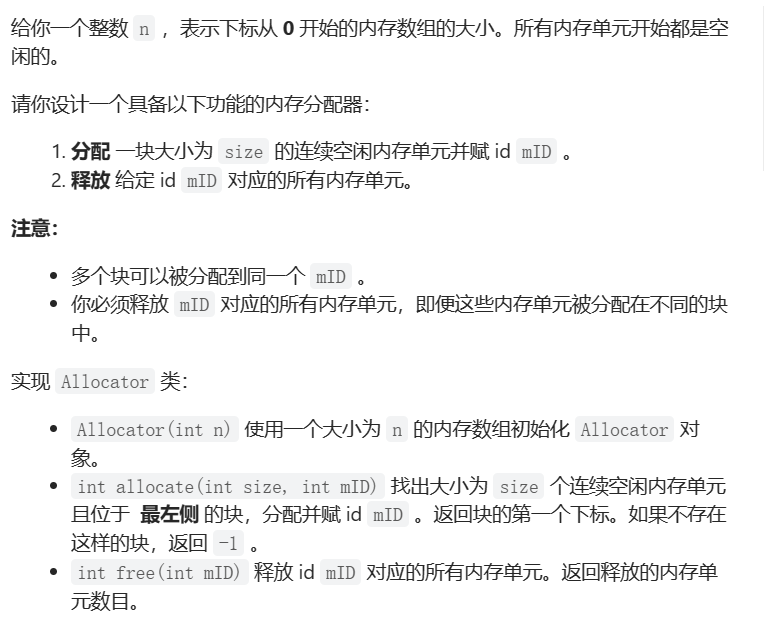

# 1. t2502 设计内存分配器

tag: `模拟`

time: 2023年5月10日

[2502. 设计内存分配器 - 力扣（LeetCode）](https://leetcode.cn/problems/design-memory-allocator/)



## 1.1 思考

好像挺简单的,设计一个有序的hash表不就行了

结构

<(mId,start),size> // 排序的时候按照start排,检索按mId检索

转念一想TreeSet就行了,后来编码一看,只要有序就行 

能分配的块的起始一定在每个已分配块的右边或者0的位置

节点设计如下:

```java
class Node implements Comparable<Node>{
        private int start;
        private int mId;
        private int size;

        public Node(int start,int size, int mId) {
            this.start = start;
            this.mId = mId;
            this.size = size;
        }

        @Override
        public boolean equals(Object o) {
            if (this == o) return true;
            if (o == null || getClass() != o.getClass()) return false;
            Node node = (Node) o;
            return mId == node.mId;
        }

        @Override
        public int hashCode() {
            return Objects.hash(mId);
        }

        @Override
        public int compareTo(Node o) {
            return this.start - o.start;
        }
    }
```

```java
class Allocator {
        TreeSet<Node> set = new TreeSet<>();
        boolean zeroFree = true;
        int n;
        public Allocator(int n) {
            this.n = n;
            set.add(new Node(-1,1,-1));
        }

        public int allocate(int size, int mID) {
            Iterator<Node> iterator = set.iterator();
            Node first = iterator.next();
            Node next;
            int start;
            while(iterator.hasNext()){
                next = iterator.next();
                start = first.start + first.size;
                if(start  + size <= next.start){
                    set.add(new Node(start,size,mID));
                    return start;
                }
                first = next;
            }
            start = first.start + first.size;
            if(start + size <= n){
                set.add(new Node(start,size,mID));
                return start;
            }else{
                return -1;
            }
        }

        public int free(int mID) {
            Iterator<Node> iterator = set.iterator();
            int count = 0;
            while(iterator.hasNext()){
                Node next = iterator.next();
                if(next.mId == mID){
                    count += next.size;
                    iterator.remove();
                }

            }
            return count;
        }
    }
```

执行用时：11 ms, 在所有 Java 提交中击败了95.00%的用户

内存消耗：43.7 MB, 在所有 Java 提交中击败了5.00%的用户