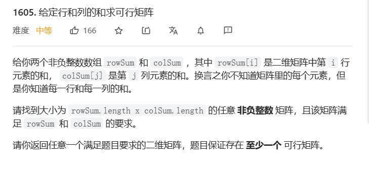
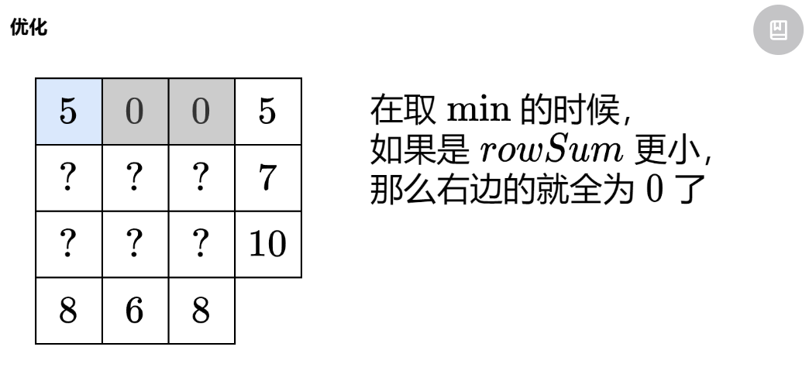
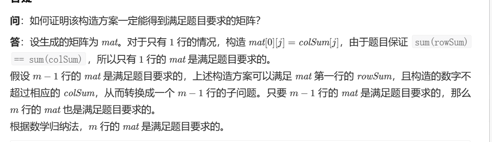
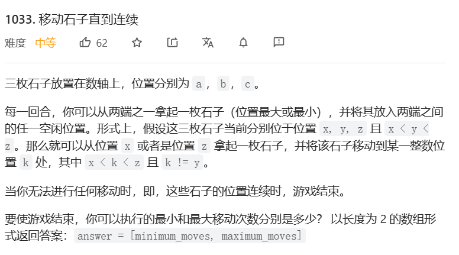
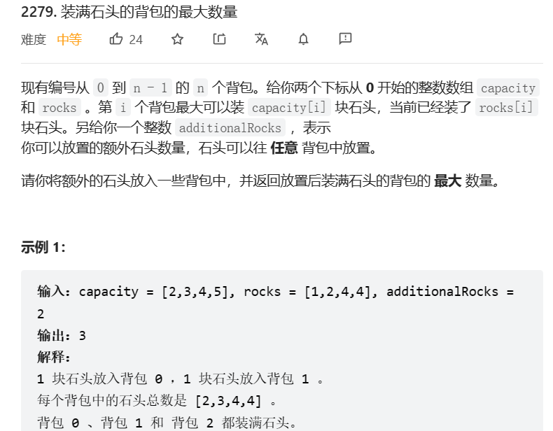
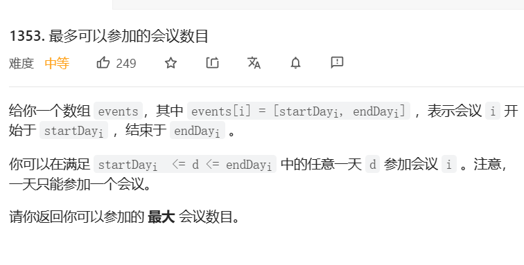
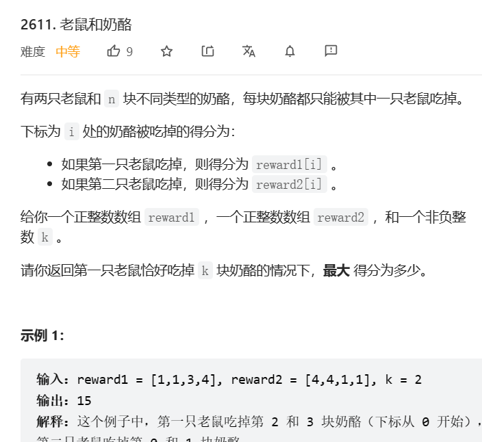
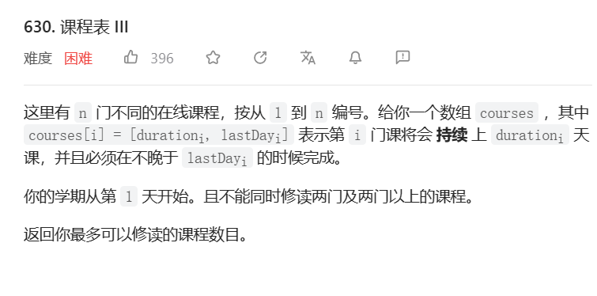
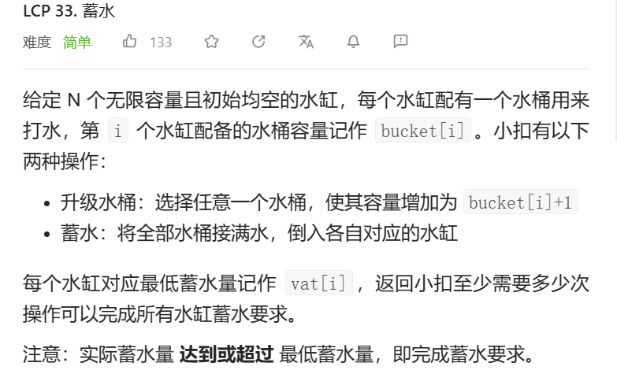
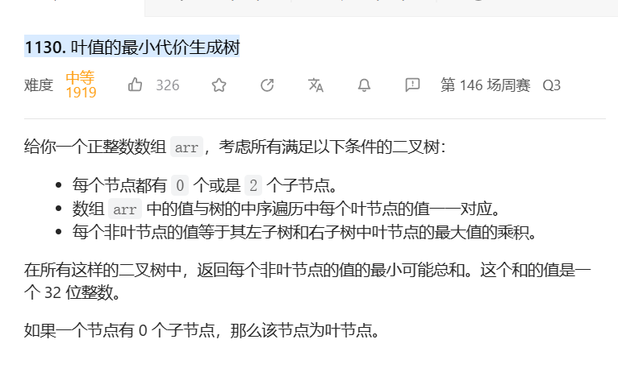

# 1. t1605 通过行列和求矩阵

tag: `贪心`

[1605. 给定行和列的和求可行矩阵 - 力扣（LeetCode）](https://leetcode.cn/problems/find-valid-matrix-given-row-and-column-sums/)



## 1.1 思考与编码

### 1.1.1 矩阵的思考

可能是缺乏对应的数学知识,想了十分钟只知道暴力求解,或者说暴力求解也没想明白

数学上看,是a * b个未知数对应a + b个表达式的求解问题,那说不定可以化解成矩阵求解问题(?)

或许比较好算,因为矩阵的所有数字都是1,不过还是需要思考一下

> 努力回忆线性代数:
>
> A是一个(ab,a + b)形状的矩阵,且能保证R(A) < ab
>
> 由于总和一致,所以可以列出大小a + b - 1非线性的向量组
>
> 在这个方程中,ab - a - b + 1个未知数可以被任意指定,但是难点在于需要保证未知数为正整数

嗯...很难保证,重新来吧

### 1.1.2 贪心的思考

之所以思考贪心主要是因为题目tag里给出了贪心,

如果是贪心的话,那一般在某个格子里填上最小值就完事了,嗯...

取`行最小和位置i`和`列最小值位置j`,在i,j位置,填入两者中更小的行和或列和,更新行和列和,并且可以直接将其他位置赋0,再也不用进行大小比较

> 迭代 行和,获得min(行和)和其index i
>
> 迭代 列和,获得min(列和)及其index j
>
> 取min(min(行和),min(列和)),划入res[i]\[j] = min(min(行和),min(列和))
>
> 并将对应行和与列和减去res[i]\[j] 的值
>
> 如此反复直到min为0

```java
public int[][] restoreMatrix(int[] rowSum, int[] colSum) {
    // 定义好返回的矩阵
    int[][] result = new int[rowSum.length][colSum.length];
```

```java
   while (true) {
        int minRow = 100000001;
        int rowIndex = -1;
        //从这里开始两次迭代
        for (int i = 0; i < rowSum.length; i++) {
            if(rowSum[i] != 0){
                if(rowSum[i] < minRow){
                    minRow = rowSum[i];
                    rowIndex = i;
                }
            }
        }
       //第二个数组迭代
        int minCol= 100000001;
        int colIndex = -1;
        for (int i = 0; i < colSum.length; i++) {
            if(colSum[i] != 0){
                if(colSum[i] < minCol){
                    minCol = colSum[i];
                    colIndex = i;
                }
            }
        }
        if(colIndex == -1 && rowIndex == -1){
            break;
        }
        //迭代结束,进行处理,中间两个必有一个数字被降为0
        result[rowIndex][colIndex] = Math.min(minCol,minRow);
        colSum[colIndex] -= result[rowIndex][colIndex];
        rowSum[rowIndex] -= result[rowIndex][colIndex];
    }
    return result;
}
```

* 运行结果:

  执行用时：9 ms, 在所有 Java 提交中击败了30.08%的用户

  内存消耗：49.6 MB, 在所有 Java 提交中击败了13.37%的用户

问题和评价:

> 1. 在判断最大值的时候,提供了0xffffffff比10^8要小,导致在临界最大值时出现问题
> 2. 时间复杂度和空间复杂度都挺高的,主要是重复在遍历最小值,可能可以考虑用堆等手段优化
> 3. 没有能力证明一定能求出正确解,只是直觉上没有求不出的可能性,毕竟已经贪到最小值了,最小值作为问题的最小单元,是可以单独占一行或一列的

## 1.2 官方题解

[没有思路？一个动画秒懂！附优化写法（Python/Java/C++/Go） - 给定行和列的和求可行矩阵 - 力扣（LeetCode）](https://leetcode.cn/problems/find-valid-matrix-given-row-and-column-sums/solution/mei-you-si-lu-yi-ge-dong-hua-miao-dong-f-eezj/)

官方(不是)题解其实可以看做是在我的贪心思路上的进一步优化,在这个过程中,求行和列和的最小值这一步被省略,在每一行每一列上都可以直接使用最小值



难就难在证明方面,题解是这样证明的



> 原来如此,是数学归纳法,第一行/列能成,第二行/列去掉第一行/列也能成,行
>
> 那我的贪心也完全可以这么证明,挺好

代码:

```java
class Solution {
    public int[][] restoreMatrix(int[] rowSum, int[] colSum) {
        int m = rowSum.length, n = colSum.length;
        var mat = new int[m][n];
        for (int i = 0; i < m; ++i) {
            for (int j = 0; j < n; ++j) {
                mat[i][j] = Math.min(rowSum[i], colSum[j]);
                rowSum[i] -= mat[i][j];
                colSum[j] -= mat[i][j];
            }
        }
        return mat;
    }
}
```

# 2. t1033 移动石子直到连续

[1033. 移动石子直到连续 - 力扣（LeetCode）](https://leetcode.cn/problems/moving-stones-until-consecutive/)



### 2.1 思考与解

最小次数是最容易思考的,如果有三个挨着就是0,两个挨着就是1,不然就是2

最大次数就是一格一个挪,res = y - 1 - x + z - y - 1 = z - x - 2

```java
class Solution {
    public int[] numMovesStones(int a, int b, int c) {
        int max = a;
        int min = c;
        int mid = b;
        if(a > c && c > b){
            mid = c;
            min = b;
        }else if(a > b && b > c){
            mid = b;
            min = c;
        }else if(b > a && a > c){
            mid = a;
            max = b;
            min = c;
        }else if(b > c && c > a){
            mid = c;
            max = b;
            min = a;
        }else if(c > a && a > b){
            max = c;
            min = b;
            mid = a;
        }else if(c > b && b > a){
            max = c;
            min = a;
            mid = b;
        }
        int [] arr = new int[2];
        if(max - mid == 1 && mid - min == 1){
            arr[0] = 0;
        }else if(max - mid == 1 || mid - min == 1 || max - mid == 2 || mid - min == 2){
            arr[0] = 1;
        }else{
            arr[0] = 2;
        }
        arr[1] = max - min - 2;
        return arr;
    }
}
```

# 3. t1553 吃掉 N 个橘子的最少天数

## 3.1 见"动态规划.md",第五题

# 4. t2279 装满石头背包的最大数量

[2279. 装满石头的背包的最大数量 - 力扣（LeetCode）](https://leetcode.cn/problems/maximum-bags-with-full-capacity-of-rocks/)



## 4.1 贪心解

一眼贪心,把差值排序然后一个个减并计数

# 5. t1353 最多可以参加的会议的个数

tag: `贪心`

time: 2023年5月5日

[1353. 最多可以参加的会议数目 - 力扣（LeetCode）](https://leetcode.cn/problems/maximum-number-of-events-that-can-be-attended/)

## 5.1 贪心

我以前肯定在别的地方做过类似的题目,挑选一天中会议最早结束的,把会开了,然后抽走这个会议重复计算即可

# 6. t2611 老鼠和奶酪

tag: `贪心`

time: 2023年5月11日

[2611. 老鼠和奶酪 - 力扣（LeetCode）](https://leetcode.cn/problems/mice-and-cheese/)



## 6. 1贪心

一眼就是贪心,我们假设是第二只老鼠已经吃掉了全部,而**第一只老鼠挑选其中k个来获得差值**

所以只要算出差值并排序前k个即可

# 7. t630 课程表III

tag: `贪心`

time: 2023年5月17日

[630. 课程表 III - 力扣（LeetCode）](https://leetcode.cn/problems/course-schedule-iii/)



## 7.1 思考: 贪心

怎么感觉见过呢,就是先做最早结束的就行啊

试了一下不太行,泪目

考虑这个例子:

[[5,5],[4,6],[2,6]]

[5,5]可以无损的换成[4,6],因为:

1. 持续时间更短
2. 两者一同放下的时候超出时间(核心判断,如果不是这样的话就可以直接放下了)
3. 没有超过前者的deadline

所以入栈!

### 7.1.1 修改贪心1

> 如果能直接放下,就放进栈,推进时间
>
> 放不下,就peek一下栈顶,满足以下条件时,取代栈顶:
>
> 1. 持续时间更短
> 2. 当前时间没有超过该deadline(其实这是必然的)

然后发现了这个样例:

[[7,17],[3,12],[10,20],[9,10],[5,20],[10,19],[4,18]]

按照我的做法,会先做9,10然后3,12,但其实7,17是9,10的更好平替

也就说已经被选中的都有可能被平替,其实上就是__持续时间最大的被平替__,把<u>栈改成堆</u>

```java
public int scheduleCourse(int[][] courses) {
    Arrays.sort(courses, Comparator.comparingInt(a -> a[1]));
    // time由变量记录,heap只储存持续时间
    PriorityQueue<Integer> heap =  new PriorityQueue<>((a,b)->b-a);
    int time = 0;
    for(int i = 0;i < courses.length;i++){
        if(time + courses[i][0] <= courses[i][1]){
            heap.offer(courses[i][0]);
            time += courses[i][0];
        }else{
            Integer peek = heap.peek();
            if(time <= courses[i][1] && peek != null && peek > courses[i][0]){
                heap.poll();
                heap.offer(courses[i][0]);
                time -= (peek - courses[i][0]);
            }
        }
    }
    return heap.size();
}
```

执行用时：33 ms, 在所有 Java 提交中击败了48.75%的用户

内存消耗：52.9 MB, 在所有 Java 提交中击败了7.48%的用户

通过测试用例：97 / 97

# 8. lcp33 蓄水

tag: `贪心`

time: 2023年5月21日

~~这难度怎么也得是中等题吧~~

[LCP 33. 蓄水 - 力扣（LeetCode）](https://leetcode.cn/problems/o8SXZn/)



## 8.1 思考: 贪心

> 向上取整除法: (a+b-1)/b

做过这题,但不记得在哪做过了

优先调整的肯定是__需要次数最高的__,放个堆然后一直调整就好
$$
次数n=vat[i] / bucket[i] + vat[i]\%bucket[i]==0?0:1\\
=(vat[i]+bucket[i]-1)/bucket[i];
$$
如何计算调整数?假设需要调整的值为x

有
$$
n * b=v+k(k<n)
$$
这时b增加了,增加到什么程度能够改变蓄水次数呢?

答案是
$$
(n-1)(b+x)>=v\\
b+x>=v/(n-1)
$$
转换为向上取整除法就是
$$
b+x=(v+n-2)/(n-1)
$$
代码:

辅助计算方法

```java
public int times(int a){
    return times(a / 100000,a % 100000);
}
// 算次数
public int times(int v,int b){
    if(v == 0){
        return 0;
    }
    return (v + b - 1) / b;
}
// 算下一个b
public int remained(int v,int times){
    return (v + times - 2) / (times - 1);
}
```

主体

按次数从大到小放入堆

```java
PriorityQueue<Integer> heap = new PriorityQueue<>(
    (a,b)->times(b) - times(a)
);
int res = 0;
int any = 0;
for(int i = 0;i < bucket.length;i++){
    if(bucket[i] == 0 && vat[i] != 0){
        any += 1;
        bucket[i] = 1;
    }
    heap.add(100000 * vat[i] + bucket[i]);
}
int min = 0x7fffffff;
```

按次数大小进行贪心计算

```java
int time,v,b,b2,time2;
while(!heap.isEmpty() && any < min){
    Integer poll = heap.poll();
    v = poll / 100000;
    b = poll % 100000;
    time = times(v,b);
    Math.min(min,res + any);
    if(time + any < min){
        min = time + any;
    }
    if(time <= 1){
        return min;
    }
    b2 = remained(v,time);
    any += b2 - b;
    heap.offer(100000 * v + b2);
}
return min;
```

执行用时：3 ms, 在所有 Java 提交中击败了91.98%的用户

内存消耗：39.2 MB, 在所有 Java 提交中击败了41.97%的用户

* 存在过的问题:
  * 对最小值应该是最大次数+扩容次数这个概念产生过模糊
  * 对扩容和次数之间的影响产生过迷茫

## 8.2 社区题解: 枚举次数

很有智慧的想法,从1次倒水到最多次倒水进行枚举,调整容量

```java

class Solution {
    public int storeWater(int[] bucket, int[] vat) {
        int n = bucket.length;
        int maxk = Arrays.stream(vat).max().getAsInt();
        if (maxk == 0) {
            return 0;
        }
        int res = Integer.MAX_VALUE;
        for (int k = 1; k <= maxk && k < res; ++k) {
            int t = 0;
            for (int i = 0; i < bucket.length; ++i) {
                t += Math.max(0, (vat[i] + k - 1) / k - bucket[i]);
            }
            res = Math.min(res, t + k);
        }
        return res;
    }
}

作者：LeetCode-Solution
链接：https://leetcode.cn/problems/o8SXZn/solution/xu-shui-by-leetcode-solution-g4lx/
来源：力扣（LeetCode）
著作权归作者所有。商业转载请联系作者获得授权，非商业转载请注明出处。
```

# 9. t1130 叶值的最小代价生成树

tag: `贪心`,`dp`

time: 2023年5月31日

[1130. 叶值的最小代价生成树 - 力扣（LeetCode）](https://leetcode.cn/problems/minimum-cost-tree-from-leaf-values/)



## 9.1 思考1: 枚举 

叶子节点的顺序已经确定

从中间切开,根节点的值就是左边的最大值和右边的最大值

如果子树大小为1则不再产生和

这就先枚举回溯一下好了

```java
public int[] dfs(int[]arr,int start,int end){
    if(start == end){
        return new int[]{arr[start],0};
    }
    if(end - start == 1){
        return new int[]{
            Math.max(arr[start],arr[end]),arr[start] * arr[end]
        };
    }
    int max = 0;
    int min = 0x7fffffff;
    for(int i = start;i < end;i++){
        int[]a = dfs(arr,start,i);
        int[]b = dfs(arr,i + 1,end);
        if(min > a[0] * b[0] + a[1] +b[1]){
            max = Math.max(a[0],b[0]);
            min = a[0] * b[0] + a[1] +b[1];
        }
    }
    return new int[]{max,min};
}
```

超时了

## 9.2 思考2: 枚举改成动态规划

将dfs改写成动态规划,输入为start,end,边界为start==end,所求为0,arr.length - 1

dp[start]\[end\]记为`[start..end]`创造出的非叶节点和

状态转换为:
$$
dp[i][i]=0\\
dp[i][j]=min(dp[i][i+t]+dp[i+t+1][j]+m_{(i,i+t)}*m_{(i+t+1,j)})\\
0<=t<j-i
$$
区间最大值:我们维护一个线段树储存区间最大值

按照状态转换,我们应该先初始化对角线,从下到上,从左到右维护右上角

```java
for(int i = n - 2;i >= 0;i--){
    for(int j = i + 1;j < n;j++){
        dp[i][j] = Integer.MAX_VALUE;
        for(int t = 0;t < j - i;t++){
            dp[i][j] = Math.min(dp[i][j],
                                dp[i][i+t] + dp[i + t + 1][j] + search(i,i+t) * search(i + t + 1,j)
                               );
        }
    }
}
return dp[0][n - 1];
```

执行用时：26 ms, 在所有 Java 提交中击败了6.29%的用户

内存消耗：39.3 MB, 在所有 Java 提交中击败了41.51%的用户

## 9.3 思考3: 贪心

类似于哈夫曼树,我们贪心一个

计算相邻数字间的和,将其中最小的计算出来放进结果中,并且放回反复计算

```java
public int mctFromLeafValues(int[] arr) {
    List<Integer> list = new ArrayList<>();
    for(int i = 0;i < arr.length;i++){
        list.add(arr[i]);
    }
    int sum = 0;
    while(list.size() > 1){
        int index = 0;
        int min = 0x7fffffff;
        for(int i = 0;i < list.size() - 1;i++){
            if(list.get(i) * list.get(i + 1) < min){
                min = list.get(i) * list.get(i + 1);
                index = i;
            }
        }
        int a1 = list.remove(index);
        int a2 = list.remove(index);
        sum += min;
        list.add(index,Math.max(a1,a2));
    }
    return sum;
}
```

## 9.4 题解: 单调栈

https://leetcode.cn/problems/minimum-cost-tree-from-leaf-values/solution/xie-zhi-de-zui-xiao-dai-jie-sheng-cheng-26ozf/