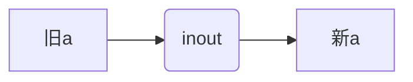

# Mysql

-------------------------------------------------------------

>[TOC]

----------------------------

## 一. 常见函数

### 单行函数

#### 字符函数

| 函数名                  | 返回值                                     |
| ----------------------- | ------------------------------------------ |
| concat(str1,str2,...)   | 字节数                                     |
| length(str)             | 拼接                                       |
| upper(str)/lower(str)   | 大写/小写                                  |
| substr/substring(str,n) | 截取字符串(从n到末尾)                      |
| substr(str,m,n)         | (从m到n)[^index]                           |
| instr(str1,str2)        | 返回str2在str1中的起始索引                 |
| trim(str)               | 去掉前后的空格                             |
| trim(char1 FROM str)    | 去掉前后的char1字符                        |
| lpad(str,n,char)        | 用指定的字符__左填充__至指定长度(多则截断) |
| rpad(str,n,char)        | 用指定的字符__右填充__至指定长度(多则截断) |

------------------------------------

#### 数学函数

| 函数            | 返回值                  |
| --------------- | ----------------------- |
| round(num)      | 四舍五入返回整数        |
| round(num,n)    | 四舍五入保留小数点后n位 |
| ceil(num)       | 向上取整                |
| floor(num)      | 向下取整                |
| truncate(num,n) | 小数点后保留n位,不舍    |
| mod(a,b)        | a%b[^本质算法]          |

[^本质算法]:a-a/b*b

---------

#### 日期函数

| 函数                                              | 返回值                       |
| ------------------------------------------------- | ---------------------------- |
| now()                                             | 当前时间                     |
| curdate()                                         | 系统日期                     |
| curtime()                                         | 当前时分秒                   |
| year(date)                                        | 返回年                       |
| month(date)                                       | 返回月                       |
| month_name(date)                                  | 返回月(英语)                 |
| __str_to_date__(str,[for_str](# str_to_date参数)) | 按照for_str把str改成date格式 |
| date_format(date,format)                          | 把日期以format转化为字符串   |
| datediff(date1,date2)                             | date1减date2的天数           |

##### str_to_date参数

| 格式符 | 功能            |
| ------ | --------------- |
| %Y     | 四位的年份      |
| %y     | 二位的年份      |
| %m     | 月份(01,02...)  |
| %c     | 月份(1,2...)    |
| %d     | 日(01,02...)    |
| %h     | 小时(12小时制)  |
| %H     | 小时(24小时制)  |
| %i     | 分钟(00,01....) |
| %s     | 秒(00,01....)   |

#### 其他函数

* version() 查看版本
* database() 查看数据库

#### 流程控制

| 函数           | 返回值             |
| -------------- | ------------------ |
| if(exp,a,b)    | exp为true则a,否则b |
| [case](# case) | 见详解[^?]         |

[^?]:ctrl+点击跳转

##### -case

1. 用法:[^delimiter]
	
   ```sql
   case expression
   when 常量1 then 语句1或值1;
   
   #若是值可以没有分号,不需要delimiter
   
   when 常量2 then 语句2或值2;
   ...
   else 语句n或值n
   end;
   ```

[^delimiter]:若when后面有语句需要改变结束符

2. 直接用:

   ```sql
   case
   when 条件1 值或语句
   ...
   else 值或语句
   end
   ```

   

[^index]:从0开始

-----------------

### 分组函数/聚合函数

```markdown
* sum
* avg
处理数值类

* max
* min
* count
处理任何类型

都忽略null值
```
* sum(distinct salary) 处理不重复,avg也可以

* count(*),count(1)统计行数,myisam下count(1)不推荐,传入任何常量都显示行数,但不推荐.

  innodb差不多,*效率还是高一些

## 二.DQL(查询语言)

### 1. 连接

> 笛卡尔积
>
> 内连接
>
> 外连接
>
> 交叉连接

----------------------------

#### 内连接(sql92)

> 等值连接
>
> 非等值连接
>
> 自连接

在_sql99标准_前[^1],等值连接和非等值连接用`where`子句实现,也就是在__笛卡尔积__[^2]的情况下进行where筛选实现.

#### sql99语法:

```sql
select 查询列表
from 表1 as 别名 [连接类型]join 表2 as 别名
on 连接条件
[[连接类型] join ...on...]
#这是一个整体,这句表示再连一个
[where 筛选条件]
[group by...]
...
```

| 连接类型           | 关键字             |
| ------------------ | ------------------ |
| 内连接             | inner(默认)        |
| 左外连接           | left               |
| 右外连接           | right              |
| 自然连接           | natural            |
| 全外连接           | 不支持(full outer) |
| 交叉连接(笛卡尔积) | cross              |

* 1. 左外连接左表为主表,在结果中有主表的全部记录.
  2. 右外连接反之
  3. 左右外连接不需要用outer(加了也没事)
  4. 内连接是左右连接交集;全外是并集

------------------------------

### 2.子查询

> 分类:
>
> ​	出现的位置分类:
>
> 1. select(支持标量子查询)
> 2. from(支持表子查询)
> 3. where(都行) *(重点)
> 4. having(都行) *(重点)
> 5. exists(表子查询)
>
> 按结果集行列数:
>
> 1. 标量子查询(一行一列)
>2. 行子查询(一行)
> 3. 列子查询(一列)
>4. 表子查询

#### where/having型子查询

##### 特点

```chinese
1. 一般放在条件右侧

2. 放在小括号内

3. 标量子查询一般可以搭配单行操作符(比如比较操作符)

4. 列子查询一般搭配多行操作符(如in,any)

5. 行子查询可以在where中与多个字段组成的元组比较
```

##### 多行操作符

| 操作符   | 含义                              |
| -------- | --------------------------------- |
| in       | 等于列表中任意一个                |
| any/some | 和子查询中某一个值比较成立,则成立 |
| all      | 和子查询中所有值比较成立,则成立   |
```sql
#示例
select last_name,employee_id
from employees
where salary <  any(select distinct salary
                 	from employees
                   where job_id='IT'
                  )
```
-----
####  exists子查询(相关子查询)

__exists(select...)__当参数存在至少一列时返回1,不存在时返回0.用`in`关键词一般有同样的效果.

### 3. 分页查询(limit)

服务器在请求某种查询的内容而不是所有内容,显示时只显示一页,这样的sql请求就是__分页查询__.

* 语法:

  ```sql
  select 查询列表
  from 表
  [join...]
  [where]
  [group by]
  [having]
  [order by]
  limit [offset],set;
  ```

`offset`:可选,代表起始索引(从0开始)

`set`:必选,代表显示条数

### 4. Union联合查询

`union`将多条查询语句合并成一个结果,即结果的__并集__.效率比使用or更高.

1. 格式

   ```sql
   select...
   union
   select...
   ```

2. 适用于多个表且没有什么连接关系的条件下.

3. 联合条件:

   - 要求多条语句查询__列数一致__

   - 要求多条语句每一列的顺序和类型_最好一致_

   - 相同字段会去重(并集),使用关键字`union all`阻止去重

## 三.DML(数据操作)

数据操作是针对`字段`操作的语言.

关键词有:__insert,delete,update,truncate__

### 1.Insert(set型)(用得少)

set型语法:

```sql
insert into ...
set
字段1=...
字段2=...
```

1. 特点:
   + 只能增加一行
   
   + select子查询不能放在这种类型里
   
### 2. update(多表)

```sql
update 表1 各种连接 表2 on...
set...
where...
```
### 3. delete(多表)

```sql
delete 表1/表2 
#删表一里写表一,删表二写表二,可都写,可加别名
from 表1 连接 表2 on连接条件
where...
```


## 四.DDL(数据定义)

> create
>
> alter
>
> drop
>

着重对于__表的模式__的创建和修改删除以及__数据库的创建删除操作__

### 1. 各种微操作

+ 如果存在则不创建/删除数据库:

  ``` sql
  create/drop database if (not) exists `x`
  ```

+ 更改库名:(废弃)

  ```sql
  rename database `x` to `y`
  ```
  
+ 更改库的字符集:

  ```sql
  alter database `x` character set `gbk`;
  ```
  
### 2. 修改表模式

+ 改类型和名称(change)

  ```sql
  alter table `x` change [column] `a` `b` 类型+约束
  ```

+ 只改类型/约束(modify)

  ```sql
  alter table `x` modify [column] `a` 类型+约束
  ```

+ 添加/删除列(add/drop)

  ```sql
  alter table `x` add/drop [column] `a` 类型(删除时不写) +约束
  ```
  
+ 改表名(rename)
  
  ```sql
  alter table `x` rename to `y`1q
  ```
  
### 3.表的复制

+ 复制`模式`(like):

  ```plsql
  create table`x` LIKE `y`
  ```

+ 复制`模式`和`内容`:

  ```sql
  create table `x`
  查询语句;
  ```

### 4. 枚举类型enum和集合类型set
>enum
>1. 格式:enum('a','b','c')
>2. 插入式不分大小写

>set
>1. 格式:set('a','b','c')
>2. 对应值可以是set参数中参数的任意组合

### 5. 约束

>六大约束:
>
>not null:	非空
>
>default:	默认
>
>primary key:	主键(码)
>
>unique:	可以为空(可有多个空),唯一键
>
>check:	检查[不支持]
>
>foreign key+reference:	外码,在从表添加

* 分类:

1. 列级:语法上都支持,`外码`__没有效果__

2. 表级:除了`not null`和`default`都行

   ```sql
   #列级和表级语法
   create table `a`(
   	`x` 类型 列级约束,
        `y` 类型,...
       表级约束
   )
   ```

   

* 添加约束的时机:

1. 创建表
2. 修改表

#### 查看索引

查看表中索引(包括`主键`,`唯一`,`外键`,还有自建索引):

```sql
show index form `x`;
```

#### 表级约束**

* 注意:最后一个字段和表级约束之间需要有__逗号__

* 语法:`constraint约束名` 可以不写(自动命名)

  > __constraint__ 约束名 约束类型(字段)

  ```sql
  #示例
  create table `x`
  (
  	id int,#后有逗号,并且最好空行
      
      Constraint pk primary key(id),#主键
      constraint uq unique(seat),#唯一值
      constraint fk foreign key(majorid) references major(id)#外键
  )
  ```

  * 外键语法:

    > constraint 约束名  foreign key(字段) references 主表(参照的主表字段)
  + 外键约束名规范:`fk_从表_主表`
  
#### 组合键

主键和unique表级约束 参数都可以多个,称为`组合`,多个字段构成一个主键或unique.

* ___但不推荐___

#### 外键的特点

1. 在__从表__设置
2. 从表的外键类型与参照字段类型 一致或兼容,对名称没有要求
3. 参照的列必须是__KEY__(primary key或unique),即要求其唯一
4. 删表/删除数据 先删从表,建表/插入数据 先加主表;

#### 修改表时改变约束

* 列级:

  在alter modify [column] 后面直接修改(把所有需要的约束写全)

  [链接](# 2. 修改表模式)

* 增添/删除表级约束:

  ```sql
  alter table x add/drop [constraint 约束名] primary key(id)#主键
  #只有add的时候写constraint
  ```

--------

### 6. 标识列(自增长列)

  可以不手动输入插入值,由系统提供默认的序列值.

* 语法:跟`列级约束`放在一起,关键词`auto_increment`

```sql
create table x(
	id int primary key auto_increment
)
```

* 细节微操:
  >1. 在插入时省略此列列名,实现自增.
  >2. 在该插入时,可以用__null__使其实现自增
  >3. ```sql
  >     show variables like '%auto_increment%'
  >     ```
  >     
  >    该语句可以展示有关自增的值,偏移量`offset`不可改变.
  >    
  >    步长`increment`可以改变
  > 
  >  ```sql
  > 	 set auto_increment_increment=...
  >  ```
  > 
  > 
  >  4. 从上一列的值开始增,没有上一列就从1开始.
  > 
  >  5. 标识列必须和key[^3]结合
  > 
  >  6. 标识列在一个表中__只能有一个__
  > 
  >  7. 只能和_数值型_结合使用
  
* 使用alter modify增减标识列属性

## 五. TCL(事务控制)

__事务__(transaction)是一个或一组sql语句组成一个执行单元,特点是_要么全部执行,要么全部不执行(语句相互依赖)_.在mysql中,仅有存储引擎`Innodb`支持事务

### 1. 事务的属性(**)

  > ___ACID___四大属性
  >
  > 1. __原子性(Atomicity)__
  >
  >    即一个transaction不可再分,必须以整体进行
  >
  > 2. __一致性(Consistency)__
  >
  >    数据库应从一个一致状态转换到另一个一致状态
  >
  > 3. __隔离性(Isolation)__
  >
  >    一个事务的执行不能被其他事务干扰
  >
  > 4. __持久性(Durability)__
  >
  >    事务一旦提交,对数据库的改变是永久的
----
### 2.创建事务的步骤

1. `显式事务`的前提是设置__自动提交功能__为禁用

```sql
set autocommit=0
#针对本次连接有效
```

2. 开启事务

   ```sql
   start transaction;#可选
   ```

   * DDL语言(包括truncate)不在事务中,事务主要包括增删改查

3. 结束事务

   ```sql
   commit;#提交
   rollback;#回滚
   ```
   

### 3. 隔离机制

#### 并发会产生的问题

> __脏读__:事务T1读取了T2已被更新但_没有提交_的字段,若T2回滚,T1读取错误(临时而无效)
>
> __不可重复读__:T1读取了一个字段,T2_更新_了字段,则T1只能读取值不同的字段
>
> __幻读__:若T1读了几个字段,T2_插入_新的行,T1再读就会多出几行
#### mysql隔离级别

* 查看隔离级别语句:

  ```sql
  select @@tx_isolation;
  ```
* 隔离级别
  

| 关键词          |                                                 |
| --------------- | ----------------------------------------------- |
| read-uncommited | 最低隔离,三种问题都会产生                       |
| read-commited   | 避免脏读,不避免幻读和不可重复读                 |
| repeatable-read | 避免脏读和不可重复读,不解决幻读_(默认隔离级别)_ |
| serializable    | 全部避免,性能低下                               |

* 设置隔离级别

  ```sql
  set session transaction isolation level 关键词; #设定当前连接
  set global transaction isolation level 关键词;#设置全局隔离级别,重启有效
  ```

### 4.savepoint保存点

```sql
savepoint 保存点名;
```

* 用法:回滚到保存点处

  ```sql
  rollback to 保存点名;
  #回滚到保存点名
  ```
## 六.视图view

view是mysql5.1以后加入的功能,通过表动态生成数据(虚拟表).只保存__sql逻辑__,不保存查询结果.

查询的时候当表使用.

### 1.创建视图

```sql
create view 视图名 as
select语句
```

### 2.修改视图

```sql
#方式一
create or replace view 视图名 #若有则改,无则创建
as
select

#方式二
alter view 视图名
as
select
```

### 3. 删除

```sql
drop view 视图;
```

### 4. 视图更新

__一般不对视图进行更新__.

增删改对视图可用,但是有以下成分的不可以更新(not upadtable):

> 1.  包含select子查询的视图
> 2. 常量视图
> 3. join
> 4. from一个不能更新的视图
> 5. where子查询引用了from子句中的表

## 七. 变量

> ### 分类:
>
> 系统变量:
>
> ​	全局变量_(所有连接)_
> ​	会话变量_(当前连接)_
>
> 自定义变量:
>
> ​	用户变量
>
> ​	局部变量

### 1.系统变量

* 说明:变量由系统提供,属于__服务器层面__

* 语法:一般默认会话变量(session)

  1. 查看所有系统变量

     ```sql
     show global/[session] variables;
     #展示全局/会话系统变量
     
     show global/[session] variables like '...';
     #展示符合条件的系统变量
     
     select @@global/[session].系统变量名;
     #查看某个系统变量 的值
     ```

  2. 为系统变量赋值
  
     ```sql
     set global/[session] 变量名=值;
     #或者
     set @@global/[session].变量名=值
     ```
  
* 全局变量不能跨越重启,重启后回复默认状态.

  想要修改则只能修改配置文件

### 2. 自定义变量

#### 用户变量

这种变量是弱类型,即可以改变类型,变量前加@是他的特点,一般都加上.

* 作用域:对于当前会话(session)有效

* 声明: 要求声明时必须初始化

  ```sql
  set @变量名=值;
  set @用户变量名:=值;
  select @ 用户变量名:=值;
  
  #set时:= 和 =皆可赋值
  #select时仅可:=
  ```
  
* 赋值:
  
  1. 方式一语法同初始化
  
  2. 方式二:
  
     ``` sql
     select 字段(标量查询) into @变量
     from...
     ;
     #这个方法也可以声明变量
     ```
  
* 查看:
```sql
select @变量名;
```
#### 局部变量

作用域在`begin end`之间,只能在`begin end`中最顶端声明.

* 声明:

  ```sql
  declare 变量名 类型 [default 值];
  ```

* 赋值:

  和_用户变量_一模一样,只是不需要使用__@__前缀

## 八.存储过程(procedure)

### 1. 创建过程

```sql
create procedure 存储过程名(参数列表)
begin
	存储过程体(一组合法的sql语句)
end
#若过程体只有一句话,begin end可以省略
#每条语句加上分号
#delimiter 改变结束符
```

参数列表: 由`参数模式`__(in/out/inout)__,`参数名`,`参数类型`组成 

### 2. 调用过程

```sql
call 存储过程名(实参列表);
```
### 3.inout

自己进自己出,重复利用.对有`out`的直接赋值即可,不需要返回



### 4.查看过程的信息

```sql
show create procedure 过程名;
```

## 九.函数(自己定义的)

`函数function`其实和过程差不多,就多了个__返回值__,而且 __有且仅有一个__.<u>记得加delimiter</u>

### 1. 声明

```sql
create function 函数名(参数 类型,参数 类型...)
returns 返回类型
begin
	函数体
end
```
### 2. 调用

和单行函数一样的,你会的

### 3. 返回

```sql
#在函数体里
declare 变量 类型约束;
...
return 变量;
```

### 4. show create function 函数;
### 5. drop function 函数;

## 十. 流程控制结构

### 1. 顺序结构

### 2. 分支结构

* [if函数](# 流程控制):实现简单的双分支

* [case结构](# -case):讲过了,但作为独立的语句时,then后面只能加语句,最后要加end case分号

* if结构:

  ```sql
  #实现多重分支
  if 条件1 then 语句1;
  elseif 条件2 语句2;
  ...
  else 语句n;
  end if;
  #只能放在begin end之间
  ```

  

### 3. 循环结构

1. 循环控制:

   `iterate+标签`语句:类似于continue

   `leave+标签`语句:类似break

   需要使用这些语句的时候循环应该加上_标签_

2. __while__

   ```sql
   [标签:]while 循环条件 do 
   循环体;
   end while [标签];
   ```

   

3. loop

   ```sql
   [标签:]loop
   循环体;
   end loop [标签];
   #可以模拟死循环.也可以leave
   ```

4. repeat

   ```slq
   [标签:]repeat
   循环体:
   until 结束条件;
   end repeat [标签];
   ```

   


## 补充. 创建用户

```sql
create user tom identified by '123456'
```

### 1. 给权限

```sql
grant select,insert,update,delete on 库.表 to 用户名@host;
```


[^ 1]:sql92标准
[^2]:逗号连接表名

[^3]:(unique/主/外)

